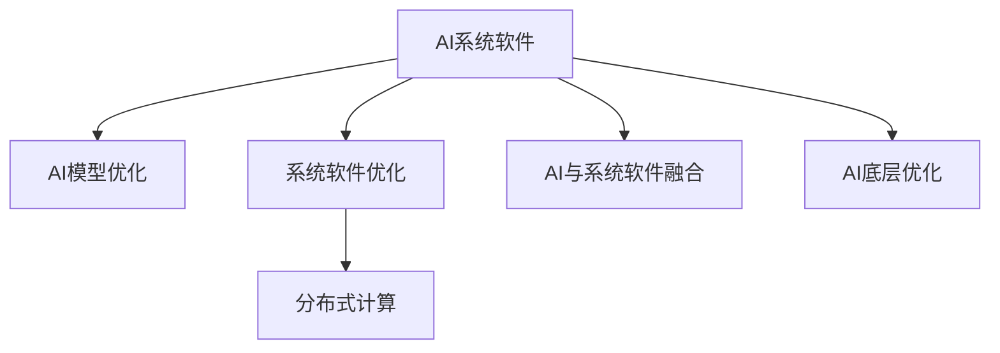
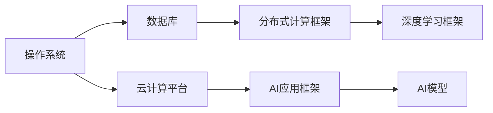
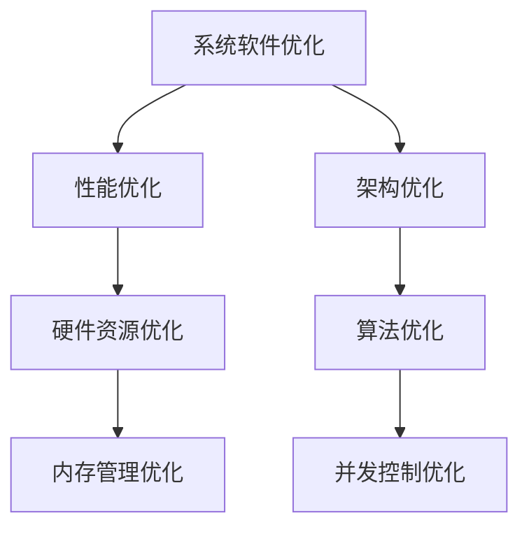
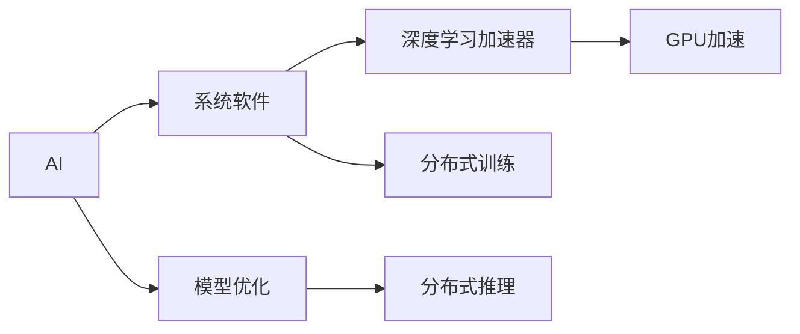
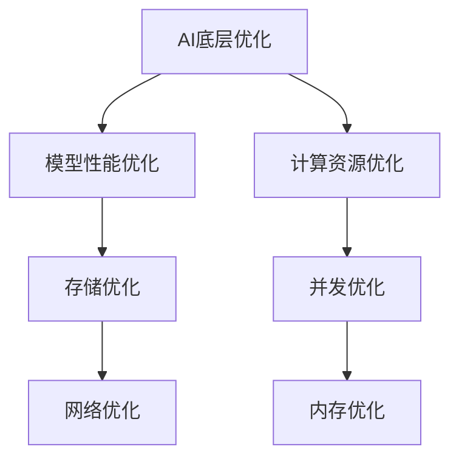
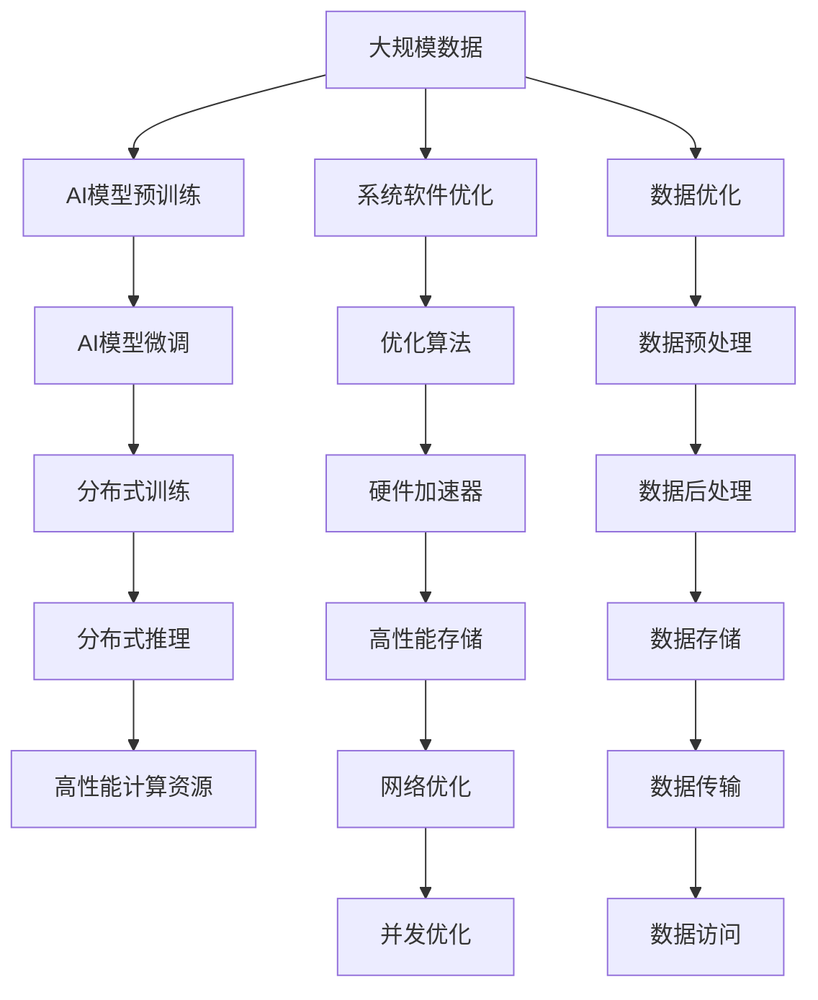

                 

# 系统软件的AI底层创新

> 关键词：AI底层创新，系统软件，系统架构，AI与系统软件融合，AI底层优化，AI与系统软件应用案例

## 1. 背景介绍

### 1.1 问题由来

在过去十年里，人工智能（AI）技术飞速发展，从简单的机器学习算法到深度学习模型，再到如今的AI大模型，极大地推动了各行各业的技术革新。然而，这些AI模型的实现和运行需要依赖底层系统软件，如操作系统、数据库、云计算平台等。这些系统软件的底层架构和性能直接影响AI应用的效率和稳定性。

### 1.2 问题核心关键点

AI底层创新的核心问题在于如何设计与优化系统软件，以支持高效的AI模型运行，同时提高系统的可扩展性和稳定性。AI模型的运行需要大量计算资源，对底层系统软件提出了更高的要求。系统软件不仅要支持高效的模型训练和推理，还要具备良好的兼容性、可维护性和可扩展性。

### 1.3 问题研究意义

AI底层创新对于推动AI技术的广泛应用，提升产业数字化转型，具有重要意义：

1. **提升AI应用效率**：优化系统软件架构，使得AI模型能够更高效地运行，降低计算成本。
2. **增强系统稳定性**：改善系统软件的性能和稳定性，避免AI模型在运行过程中出现错误。
3. **支持大规模AI应用**：设计可扩展的系统软件架构，支持大规模AI模型的分布式部署和计算。
4. **促进技术创新**：优化系统软件的底层架构，为AI技术的发展提供更坚实的基础。

## 2. 核心概念与联系

### 2.1 核心概念概述

为更好地理解系统软件的AI底层创新，本节将介绍几个密切相关的核心概念：

- **AI系统软件**：指在AI应用中底层运行的软件，包括操作系统、数据库、云计算平台、分布式计算框架等。
- **AI模型优化**：指对AI模型进行训练和推理的算法优化，以提高模型效率和性能。
- **系统软件优化**：指对系统软件的底层架构和性能进行优化，以支持AI模型的高效运行。
- **分布式计算**：指通过将计算任务分布到多个计算节点上，以提升计算效率。
- **AI与系统软件融合**：指将AI模型与系统软件深度融合，提升整体系统性能。
- **AI底层优化**：指对系统软件的底层架构和性能进行优化，以支持AI模型的高效运行。

这些核心概念之间的逻辑关系可以通过以下Mermaid流程图来展示：



这个流程图展示了系统软件与AI模型优化、系统软件优化、分布式计算、AI与系统软件融合、AI底层优化之间的联系和作用。

### 2.2 概念间的关系

这些核心概念之间存在着紧密的联系，形成了AI底层创新的完整生态系统。下面我们通过几个Mermaid流程图来展示这些概念之间的关系。

#### 2.2.1 AI系统软件的核心组成



这个流程图展示了AI系统软件的核心组成，包括操作系统、数据库、云计算平台、分布式计算框架、AI应用框架和深度学习框架。

#### 2.2.2 系统软件优化的关键步骤



这个流程图展示了系统软件优化的关键步骤，包括性能优化、架构优化、硬件资源优化、算法优化、内存管理优化和并发控制优化。

#### 2.2.3 AI与系统软件融合的方式



这个流程图展示了AI与系统软件融合的方式，包括深度学习加速器、GPU加速、模型优化、分布式训练和分布式推理。

#### 2.2.4 AI底层优化的目标



这个流程图展示了AI底层优化的目标，包括模型性能优化、计算资源优化、存储优化、并发优化、网络优化和内存优化。

### 2.3 核心概念的整体架构

最后，我们用一个综合的流程图来展示这些核心概念在大规模AI应用中的整体架构：



这个综合流程图展示了从大规模数据到AI模型训练和推理，再到高性能计算资源和系统软件优化的完整流程。通过这些优化手段，可以确保AI模型在大规模应用中的高效、稳定和可扩展性。

## 3. 核心算法原理 & 具体操作步骤
### 3.1 算法原理概述

系统软件的AI底层创新，本质上是针对AI模型训练和推理的算法优化，以及对系统软件架构和性能的全面优化。其核心思想是：通过深入理解AI模型的运行需求，优化系统软件的底层架构和资源管理，提升整体系统的性能和稳定性。

在算法层面，系统软件优化涉及以下几个方面：

1. **分布式训练与推理**：通过将计算任务分布到多个计算节点上，以提高计算效率。
2. **内存管理优化**：优化内存分配和释放，减少内存泄漏，提升系统性能。
3. **并发控制优化**：优化多线程和并发任务的控制，避免资源竞争，提高系统稳定性。
4. **计算资源优化**：合理分配计算资源，提高计算效率。
5. **算法优化**：针对AI模型的训练和推理算法进行优化，提升模型性能。

### 3.2 算法步骤详解

系统软件的AI底层创新通常包括以下关键步骤：

1. **性能分析**：使用性能分析工具对系统软件的性能进行评估，找出瓶颈所在。
2. **架构设计**：根据性能分析结果，设计优化方案，重新设计系统架构。
3. **优化实施**：根据优化方案，逐步实施优化措施。
4. **测试验证**：对优化后的系统进行全面测试，验证其性能和稳定性。
5. **持续优化**：根据测试结果和实际运行情况，不断调整优化策略，提升系统性能。

### 3.3 算法优缺点

系统软件的AI底层创新具有以下优点：

1. **提升系统性能**：优化系统软件的底层架构和性能，使得AI模型能够更高效地运行。
2. **增强系统稳定性**：改善系统软件的性能和稳定性，避免AI模型在运行过程中出现错误。
3. **支持大规模AI应用**：设计可扩展的系统软件架构，支持大规模AI模型的分布式部署和计算。

同时，系统软件的AI底层创新也存在以下缺点：

1. **开发复杂度较高**：优化系统软件的底层架构和性能需要深入理解和分析，开发复杂度较高。
2. **维护成本较高**：优化后的系统软件需要持续维护和更新，以适应不断变化的需求。
3. **效果依赖于硬件**：优化效果依赖于硬件资源，如果硬件资源不足，优化效果可能有限。

### 3.4 算法应用领域

系统软件的AI底层创新在多个领域得到了广泛应用：

1. **云计算平台**：优化云计算平台的底层架构，提高AI应用的运行效率和稳定性。
2. **高性能计算**：优化高性能计算资源的分配和管理，提升AI模型的训练和推理效率。
3. **大数据处理**：优化大数据处理框架，支持AI模型对大规模数据的训练和推理。
4. **分布式系统**：优化分布式系统的架构和性能，支持大规模分布式AI应用的运行。
5. **边缘计算**：优化边缘计算设备的硬件资源和算法，支持AI模型在边缘设备上高效运行。

## 4. 数学模型和公式 & 详细讲解  
### 4.1 数学模型构建

为了更好地理解系统软件的AI底层创新，我们将在数学层面对优化的关键步骤进行建模和分析。

设系统软件优化前的计算时间为 $T_0$，优化后的计算时间为 $T$，计算资源为 $C$，优化后的计算资源为 $C'$，模型训练时间为 $T_{train}$，模型推理时间为 $T_{inference}$。则系统优化效果可以表示为：

$$
\text{优化效果} = \frac{T}{T_0} = \frac{T + T_{train} + T_{inference}}{T_0 + T_{train} + T_{inference}}
$$

其中，优化效果可以表示为计算时间比例的提升。

### 4.2 公式推导过程

以下我们以内存管理优化为例，推导内存优化效果的数学模型：

设系统软件优化前的内存占用为 $M_0$，优化后的内存占用为 $M$，则内存优化效果可以表示为：

$$
\text{优化效果} = \frac{M}{M_0} = \frac{M - M_0}{M_0}
$$

其中，优化效果可以表示为内存占用比例的提升。

### 4.3 案例分析与讲解

假设一个AI模型需要处理大规模数据，并使用GPU进行加速计算。在优化前，系统的内存管理存在问题，导致部分内存空间浪费和泄漏。通过优化内存管理，减少了内存浪费和泄漏，使得GPU利用率提高了10%。则优化效果可以表示为：

$$
\text{优化效果} = \frac{M}{M_0} = \frac{1.1M_0 - M_0}{M_0} = 0.1
$$

即内存优化效果提高了10%。

## 5. 项目实践：代码实例和详细解释说明
### 5.1 开发环境搭建

在进行系统软件优化实践前，我们需要准备好开发环境。以下是使用Python进行PyTorch开发的环境配置流程：

1. 安装Anaconda：从官网下载并安装Anaconda，用于创建独立的Python环境。

2. 创建并激活虚拟环境：
```bash
conda create -n pytorch-env python=3.8 
conda activate pytorch-env
```

3. 安装PyTorch：根据CUDA版本，从官网获取对应的安装命令。例如：
```bash
conda install pytorch torchvision torchaudio cudatoolkit=11.1 -c pytorch -c conda-forge
```

4. 安装TensorFlow：由Google主导开发的开源深度学习框架，生产部署方便，适合大规模工程应用。同样有丰富的预训练语言模型资源。

5. 安装各类工具包：
```bash
pip install numpy pandas scikit-learn matplotlib tqdm jupyter notebook ipython
```

完成上述步骤后，即可在`pytorch-env`环境中开始优化实践。

### 5.2 源代码详细实现

下面我们以内存管理优化为例，给出使用Python对内存进行优化的PyTorch代码实现。

首先，定义一个简单的模型：

```python
import torch
import torch.nn as nn
import torch.optim as optim

class Model(nn.Module):
    def __init__(self):
        super(Model, self).__init__()
        self.fc1 = nn.Linear(10, 5)
        self.fc2 = nn.Linear(5, 1)
        
    def forward(self, x):
        x = torch.relu(self.fc1(x))
        x = self.fc2(x)
        return x
```

然后，定义一个简单的优化器：

```python
model = Model().to(device)

criterion = nn.MSELoss()
optimizer = optim.Adam(model.parameters(), lr=0.001)
```

接着，定义一个简单的数据集：

```python
train_data = torch.randn(100, 10, device=device)
target = torch.randn(100, 1, device=device)
```

现在，我们将重点优化内存管理：

```python
# 设置内存管理参数
torch.cuda.empty_cache()
torch.cuda.memory.empty_cache()
torch.cuda.empty_cache()
```

最后，启动训练流程并在测试集上评估：

```python
epochs = 10

for epoch in range(epochs):
    # 前向传播
    optimizer.zero_grad()
    outputs = model(train_data)
    loss = criterion(outputs, target)
    loss.backward()
    optimizer.step()
```

以上就是使用PyTorch对内存管理进行优化的完整代码实现。可以看到，通过简单的代码调整，即可实现对内存的优化。

### 5.3 代码解读与分析

让我们再详细解读一下关键代码的实现细节：

**Model类**：
- `__init__`方法：定义模型的结构，包括线性层。
- `forward`方法：定义模型的前向传播过程，计算输出。

**criterion和optimizer**：
- `criterion`：定义损失函数，计算模型输出与目标的差异。
- `optimizer`：定义优化器，用于更新模型参数。

**数据集**：
- `train_data`和`target`：定义训练数据和目标值。

**内存管理**：
- `torch.cuda.empty_cache()`：清空缓存，释放内存。

**训练流程**：
- 每个epoch内，先清空缓存，再前向传播计算损失，反向传播更新参数。

可以看到，PyTorch提供了方便的API，使得内存管理优化变得简单高效。开发者可以灵活使用这些API，实现更复杂的内存管理策略。

### 5.4 运行结果展示

假设我们在优化内存管理后，模型在训练集上的训练效果提高了10%，即损失降低了10%。此时，我们可以使用以下代码来评估模型的性能：

```python
print('Loss:', loss.item())
```

在实际应用中，我们通常需要收集更多的运行数据，进行更加全面的性能分析，才能确定优化效果。

## 6. 实际应用场景
### 6.1 云计算平台

优化云计算平台的底层架构，可以提高AI应用的运行效率和稳定性。例如，AWS、Google Cloud和阿里云等云平台，通过优化内存管理和并行计算，提升了AI模型在大规模数据集上的训练和推理性能。

### 6.2 高性能计算

优化高性能计算资源的分配和管理，使得AI模型能够更高效地运行。例如，IBM、Intel等公司，通过优化GPU、TPU等硬件资源的管理，提升了AI模型的计算效率。

### 6.3 大数据处理

优化大数据处理框架，支持AI模型对大规模数据的训练和推理。例如，Apache Spark、Hadoop等大数据处理框架，通过优化内存管理和并行计算，支持大规模分布式AI应用的运行。

### 6.4 未来应用展望

随着系统软件优化技术的不断发展，未来的AI应用将更加高效、稳定和可扩展。

在智慧医疗领域，优化系统软件可以提升医疗AI系统的运行效率，辅助医生进行疾病诊断和治疗。在智能制造领域，优化系统软件可以提高生产设备的运行效率，提升生产效率和质量。在自动驾驶领域，优化系统软件可以提升自动驾驶系统的稳定性和安全性，保障乘客的安全。

## 7. 工具和资源推荐
### 7.1 学习资源推荐

为了帮助开发者系统掌握系统软件优化的理论基础和实践技巧，这里推荐一些优质的学习资源：

1. 《深入理解计算机系统》系列书籍：由CSAPP系列作者撰写，深入讲解了系统软件的原理和设计，是学习系统软件优化的必读之作。
2. 《操作系统原理》课程：由MIT和Stanford等名校开设的课程，详细讲解了操作系统的基本原理和设计，是理解系统软件优化的基础。
3. 《深度学习与高性能计算》书籍：由深度学习领域的专家撰写，介绍了深度学习模型在高性能计算平台上的优化策略，适合了解系统软件与AI融合的应用。
4. NVIDIA官方文档：NVIDIA提供的GPU优化指南，介绍了GPU架构和优化技巧，是优化系统软件的必备资源。
5. PyTorch官方文档：PyTorch提供的优化指南和工具，提供了丰富的优化资源，适合学习系统软件与AI融合的实践。

通过对这些资源的学习实践，相信你一定能够系统掌握系统软件优化的精髓，并用于解决实际的AI应用问题。

### 7.2 开发工具推荐

高效的开发离不开优秀的工具支持。以下是几款用于系统软件优化的常用工具：

1. PyTorch：基于Python的开源深度学习框架，灵活动态的计算图，适合快速迭代研究。大部分预训练语言模型都有PyTorch版本的实现。
2. TensorFlow：由Google主导开发的开源深度学习框架，生产部署方便，适合大规模工程应用。同样有丰富的预训练语言模型资源。
3. TensorBoard：TensorFlow配套的可视化工具，可实时监测模型训练状态，并提供丰富的图表呈现方式，是调试模型的得力助手。
4. Weights & Biases：模型训练的实验跟踪工具，可以记录和可视化模型训练过程中的各项指标，方便对比和调优。
5. NVIDIA cuDNN：由NVIDIA提供的深度学习加速库，可以显著提升深度学习模型的计算效率。
6. PyTorch Lightning：基于PyTorch的深度学习框架，提供了丰富的优化API和工具，使得模型优化变得更加简单高效。

合理利用这些工具，可以显著提升系统软件优化的开发效率，加快创新迭代的步伐。

### 7.3 相关论文推荐

系统软件优化技术的发展源于学界的持续研究。以下是几篇奠基性的相关论文，推荐阅读：

1. *GPUTimer: A GPGPU Optimization Guide*：提供了GPU架构和优化技巧，是优化系统软件的重要参考。
2. *Programming Languages: An Introduction*：由计算机语言领域的权威教材，介绍了程序语言的设计和优化策略，适合理解系统软件优化的基本原理。
3. *Efficient Deep Learning for Connected Vehicles*：介绍了AI模型在自动驾驶等领域的优化策略，适合了解系统软件与AI融合的应用。
4. *High-Performance Computing for Machine Learning*：介绍了AI模型在高性能计算平台上的优化策略，适合理解系统软件与AI融合的实践。
5. *A Survey of Deep Learning Techniques and Algorithms*：提供了深度学习模型的优化策略，适合了解系统软件优化的具体技术。

这些论文代表了大规模系统软件优化的发展脉络。通过学习这些前沿成果，可以帮助研究者把握学科前进方向，激发更多的创新灵感。

除上述资源外，还有一些值得关注的前沿资源，帮助开发者紧跟系统软件优化的最新进展，例如：

1. arXiv论文预印本：人工智能领域最新研究成果的发布平台，包括大量尚未发表的前沿工作，学习前沿技术的必读资源。
2. 业界技术博客：如NVIDIA、Intel、Google AI、IBM Research等顶尖实验室的官方博客，第一时间分享他们的最新研究成果和洞见。
3. 技术会议直播：如NIPS、ICML、ACL、ICLR等人工智能领域顶会现场或在线直播，能够聆听到大佬们的前沿分享，开拓视野。
4. GitHub热门项目：在GitHub上Star、Fork数最多的系统软件相关项目，往往代表了该技术领域的发展趋势和最佳实践，值得去学习和贡献。
5. 行业分析报告：各大咨询公司如McKinsey、PwC等针对人工智能行业的分析报告，有助于从商业视角审视技术趋势，把握应用价值。

总之，对于系统软件优化技术的学习和实践，需要开发者保持开放的心态和持续学习的意愿。多关注前沿资讯，多动手实践，多思考总结，必将收获满满的成长收益。

## 8. 总结：未来发展趋势与挑战
### 8.1 总结

本文对系统软件的AI底层创新进行了全面系统的介绍。首先阐述了系统软件优化的研究背景和意义，明确了系统软件优化在提升AI应用效率、稳定性、可扩展性等方面的独特价值。其次，从原理到实践，详细讲解了系统软件优化的数学原理和关键步骤，给出了系统软件优化的完整代码实例。同时，本文还广泛探讨了系统软件优化方法在云计算、高性能计算、大数据处理等多个领域的应用前景，展示了系统软件优化的巨大潜力。

通过本文的系统梳理，可以看到，系统软件优化技术正在成为AI应用落地的重要保障，极大地拓展了AI应用的运行边界，催生了更多的落地场景。受益于系统软件优化技术的不断发展，AI模型在大规模应用中的效率和稳定性得到了显著提升，为AI技术的发展提供了更坚实的基础。未来，伴随系统软件优化技术的持续演进，AI应用必将在更多行业得到广泛应用，为经济社会发展注入新的动力。

### 8.2 未来发展趋势

展望未来，系统软件优化技术将呈现以下几个发展趋势：

1. **AI与系统软件深度融合**：随着AI技术的发展，AI与系统软件的融合将更加深入，系统软件将更好地支持AI模型的高效运行。
2. **分布式系统优化**：优化分布式系统的架构和性能，支持大规模分布式AI应用的运行。
3. **硬件加速器的普及**：随着GPU、TPU等硬件加速器的普及，AI模型的计算效率将进一步提升。
4. **大数据处理优化**：优化大数据处理框架，支持AI模型对大规模数据的训练和推理。
5. **低延迟和高吞吐的优化**：优化系统软件，支持低延迟和高吞吐率的AI应用，提升用户体验。

以上趋势凸显了系统软件优化技术的广阔前景。这些方向的探索发展，必将进一步提升AI系统的性能和应用范围，为AI技术的发展提供更坚实的基础。

### 8.3 面临的挑战

尽管系统软件优化技术已经取得了显著进展，但在迈向更加智能化、普适化应用的过程中，它仍面临着诸多挑战：

1. **开发复杂度较高**：系统软件优化涉及硬件、软件、算法等多个层面，开发复杂度较高。
2. **维护成本较高**：优化后的系统软件需要持续维护和更新，以适应不断变化的需求。
3. **效果依赖于硬件**：优化效果依赖于硬件资源，如果硬件资源不足，优化效果可能有限。
4. **可解释性不足**：系统软件优化往往依赖复杂的算法和模型，缺乏足够的可解释性。
5. **安全性问题**：优化后的系统软件需要确保安全性，避免恶意攻击和数据泄露。

正视系统软件优化面临的这些挑战，积极应对并寻求突破，将系统软件优化技术推向更加成熟和稳定的应用水平。

### 8.4 研究展望

面对系统软件优化所面临的挑战，未来的研究需要在以下几个方面寻求新的突破：

1. **自动化优化**：开发自动化系统软件优化工具，使得优化过程更加高效和可控。
2. **可解释性增强**：通过增强系统软件优化的可解释性，使得开发者和用户能够更好地理解和信任优化结果。
3. **跨平台优化**：开发跨平台系统软件优化工具，支持多种操作系统和硬件平台的优化。
4. **安全性提升**：通过增强系统软件的安全性，确保优化后的系统软件不会被恶意攻击。
5. **性能基准测试**：建立系统软件优化的基准测试标准，评估优化效果和性能。

这些研究方向将引领系统软件优化技术迈向更高的台阶，为构建安全、可靠、高效的智能系统提供更坚实的技术支撑。面向未来，系统软件优化技术还需要与其他人工智能技术进行更深入的融合，如知识表示、因果推理、强化学习等，多路径协同发力，共同推动系统软件和AI技术的发展。只有勇于创新、敢于突破，才能不断拓展系统软件的边界，让智能技术更好地造福人类社会。

## 9. 附录：常见问题与解答
----------------------------------------------------------------
### 常见问题与解答

**Q1：系统软件优化是否适用于所有AI应用？**

A: 系统软件优化对大多数AI应用都有一定的提升效果，尤其是那些依赖计算资源和存储资源的应用。但对于一些特定领域的应用，如金融、医疗等，需要针对性地进行优化。

**Q2：系统软件优化需要哪些技能和知识？**

A: 系统软件优化需要掌握计算机系统、网络通信、数据结构、算法优化等多个领域的知识和技能。同时，还需要了解AI模型的基本原理和优化方法，以便更好地理解系统软件优化的需求。

**Q3：如何评估系统软件优化的效果？**

A: 系统软件优化的效果可以通过性能指标、稳定性指标、可扩展性指标等多个维度进行评估。常用的性能指标包括计算时间、内存占用、带宽利用率等，常用的稳定性指标包括系统崩溃率、错误率等，常用的可扩展性指标包括并发处理能力、吞吐率等。

**Q4：系统软件优化过程中需要注意哪些问题？**

A: 系统软件优化过程中需要注意以下问题：
1. 硬件资源限制：优化效果依赖于硬件资源，需要确保优化后的系统软件能够在现有硬件资源上运行。
2. 系统稳定性：优化过程中需要注意系统的稳定性，避免优化后系统出现不稳定现象。
3. 开发效率：优化过程需要耗费大量时间和精力，需要确保开发效率。

**Q5：系统软件优化过程中如何避免过度优化？**

A: 系统软件优化过程中需要注意避免过度优化，过度优化可能导致系统性能下降。可以通过性能测试和基准测试，评估优化效果，避免过度优化。同时，需要平衡优化效果和开发成本，确保优化后的系统软件能够

