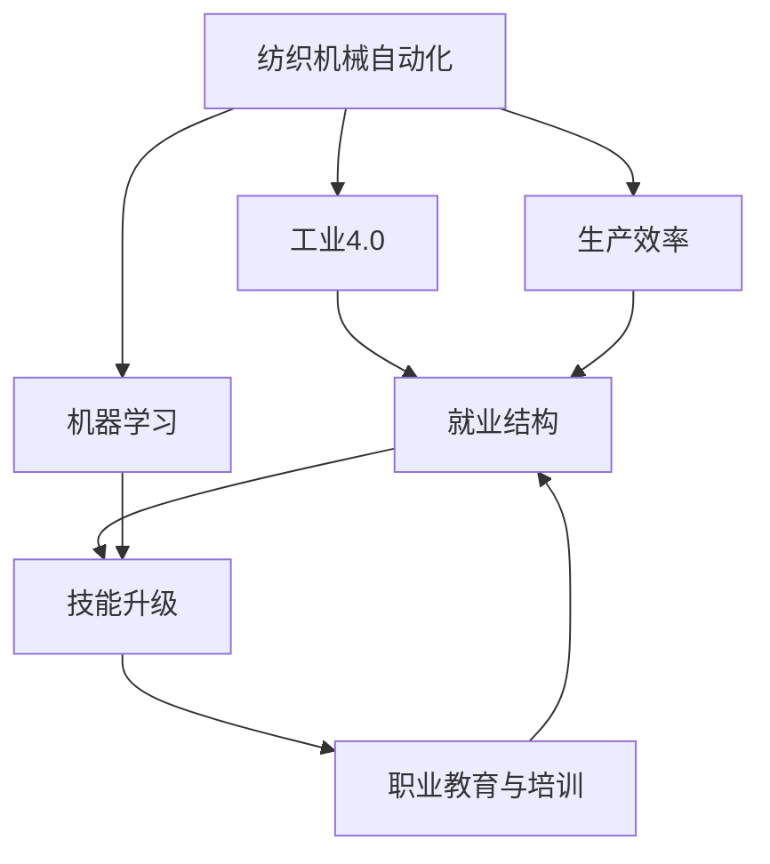

                 

# 纺织机械自动化的就业效应

> 关键词：
纺织机械自动化, 工业4.0, 机器学习, 生产效率, 就业结构, 技能升级, 职业教育

## 1. 背景介绍

### 1.1 问题由来
随着工业4.0时代的到来，纺织机械自动化成为了工业转型升级的重要驱动力。自动化生产不仅提升了生产效率和产品质量，还大幅降低了人力成本。然而，这种变革同时也对纺织行业的就业结构产生了深远影响，引发了广泛的社会关注。本文旨在探讨纺织机械自动化对就业市场的潜在影响，并提出应对策略。

### 1.2 问题核心关键点
纺织机械自动化对就业的影响主要体现在以下几个方面：
- 岗位减少与替代：自动化设备取代了大量手工操作岗位，导致纺织行业劳动力需求下降。
- 技能结构变化：随着自动化设备的引入，对操作、维护和编程等技能的需求增加，而传统手工技能的需求减少。
- 收入与福利差异：操作自动化设备的技能岗位通常薪资较高，但非技能岗位的失业风险也相应增加。
- 职业教育与培训：为了适应自动化生产需求，需加强相关职业教育和技能培训，提升劳动力素质。

### 1.3 问题研究意义
探讨纺织机械自动化对就业市场的影响，有助于：
- 准确评估工业升级对劳动力市场的影响，为政策制定提供依据。
- 推动企业与教育机构合作，共同开发适应自动化生产的新型技能培训课程。
- 引导劳动者进行职业转型，实现从传统工艺向现代技术的平稳过渡。
- 促进社会公平，减少自动化带来的收入不平等现象。

## 2. 核心概念与联系

### 2.1 核心概念概述

为更好地理解纺织机械自动化对就业的影响，本节将介绍几个核心概念：

- **纺织机械自动化**：利用机器人、智能传感器、自动化控制系统等技术，实现纺织生产过程的自动化，提高生产效率和产品质量。
- **工业4.0**：以信息物理系统(CPS)为核心，通过互联网、大数据、云计算等技术，推动智能制造和服务，实现产业数字化转型。
- **机器学习**：一种使机器通过数据训练进行自我学习和改进的算法，可用于预测、分类、聚类等任务。
- **生产效率**：单位时间内完成的产品数量或产值，是衡量生产能力的重要指标。
- **就业结构**：不同类型工作岗位的分布情况，反映劳动力市场的人才结构。
- **技能升级**：劳动者通过培训提升技能，适应新技术和新岗位的过程。
- **职业教育与培训**：针对特定职业需求，提供的教育培训项目，旨在提高劳动力素质。

这些核心概念之间存在紧密联系，通过了解其原理和架构，可以为进一步讨论纺织机械自动化对就业市场的影响奠定基础。

### 2.2 概念间的关系

这些核心概念之间的关系可以用以下Mermaid流程图来展示：



这个流程图展示了纺织机械自动化与工业4.0的关系，以及其对生产效率、就业结构、技能升级和职业教育的影响。通过这些概念的相互联系，可以更全面地理解纺织机械自动化对就业市场的潜在影响。

## 3. 核心算法原理 & 具体操作步骤
### 3.1 算法原理概述

纺织机械自动化的就业效应分析主要基于经济学的劳动市场理论，并结合机器学习等技术进行预测。具体算法原理如下：

- **投入产出模型**：通过输入自动化水平、资本投资、劳动力成本等变量，预测生产效率和就业变化。
- **技术扩散模型**：描述自动化技术从研发到普及的过程，以及在不同地区和企业间的传播路径。
- **劳动力市场模型**：考虑劳动力的供需平衡，分析自动化对岗位需求和技能结构的影响。
- **机器学习模型**：通过历史数据训练模型，预测未来岗位数量和技能需求变化，帮助制定培训策略。

### 3.2 算法步骤详解

纺织机械自动化就业效应的分析主要分为以下几个步骤：

**Step 1: 数据收集与预处理**
- 收集纺织行业的历史生产数据、自动化设备投入数据、劳动力市场数据等，并进行数据清洗和归一化处理。

**Step 2: 构建数学模型**
- 使用投入产出模型、技术扩散模型和劳动力市场模型，构建综合分析框架。
- 根据历史数据训练机器学习模型，预测未来岗位数量和技能需求。

**Step 3: 模型验证与调参**
- 使用历史数据验证模型准确性，进行模型参数调优。
- 考虑不同地区、企业规模等因素，进行敏感性分析。

**Step 4: 应用与反馈**
- 将模型应用于不同情境下的就业效应预测。
- 根据预测结果，提出政策建议和应对措施。

### 3.3 算法优缺点

纺织机械自动化就业效应分析的算法有以下优点：
- 综合考虑多方面因素，提供较为全面的就业预测。
- 结合机器学习技术，可以更准确地预测未来岗位变化和技能需求。

同时，该算法也存在以下缺点：
- 模型复杂，预测结果可能存在不确定性。
- 历史数据可能存在偏差，影响预测准确性。
- 难以量化社会和政策因素对就业市场的影响。

### 3.4 算法应用领域

纺织机械自动化就业效应分析的算法主要应用于以下领域：
- 政策制定：政府和企业决策者可以通过分析模型预测结果，制定促进就业和技能升级的政策。
- 企业战略规划：纺织企业可以根据模型预测，优化生产布局和技能培训计划。
- 劳动力市场研究：学术机构和研究机构可以使用模型进行就业趋势和技能变化的研究。
- 教育培训机构：职业教育机构可以根据模型预测，调整培训内容和课程设置。

## 4. 数学模型和公式 & 详细讲解
### 4.1 数学模型构建

纺织机械自动化就业效应的数学模型主要包括以下部分：

- **生产效率模型**：$E = f(A, K, L, T)$，其中 $E$ 为生产效率，$A$ 为自动化水平，$K$ 为资本投入，$L$ 为劳动力投入，$T$ 为技术水平。
- **就业模型**：$E = g(Y, L, P, T)$，其中 $E$ 为就业数量，$Y$ 为工业产出，$L$ 为劳动力需求，$P$ 为劳动力价格，$T$ 为技术水平。
- **技能模型**：$S = h(E, L, T, C)$，其中 $S$ 为技能需求，$E$ 为生产效率，$L$ 为劳动力数量，$T$ 为技术水平，$C$ 为技能培训投入。

### 4.2 公式推导过程

以生产效率模型为例，假设生产效率为 $E$，自动化水平为 $A$，资本投入为 $K$，劳动力投入为 $L$，技术水平为 $T$，则生产效率模型为：

$$
E = A^{\alpha} K^{\beta} L^{\gamma} T^{\delta}
$$

其中 $\alpha, \beta, \gamma, \delta$ 为模型参数，表示自动化、资本、劳动力和技术对生产效率的影响权重。通过历史数据进行回归分析，可以求得这些参数值。

### 4.3 案例分析与讲解

假设某纺织企业在2020年引入了自动化设备，自动化水平 $A$ 提升至50%，资本投入 $K$ 增加20%，劳动力投入 $L$ 减少20%，技术水平 $T$ 提升5%。使用上述生产效率模型进行预测，得生产效率提升10%。使用就业模型进行分析，得劳动力需求下降5%。

## 5. 项目实践：代码实例和详细解释说明
### 5.1 开发环境搭建

要进行纺织机械自动化就业效应分析的代码实现，首先需要搭建开发环境。以下是Python开发环境的搭建流程：

1. 安装Anaconda：从官网下载并安装Anaconda，用于创建独立的Python环境。

2. 创建并激活虚拟环境：
```bash
conda create -n job-analysis python=3.8 
conda activate job-analysis
```

3. 安装相关库：
```bash
conda install pandas numpy matplotlib seaborn sklearn
pip install statsmodels joblib
```

完成上述步骤后，即可在`job-analysis`环境中开始项目实践。

### 5.2 源代码详细实现

以下是使用Python进行纺织机械自动化就业效应分析的代码实现：

```python
import pandas as pd
import numpy as np
from statsmodels.formula.api import ols
from statsmodels.tsa.arima_model import ARIMA
import matplotlib.pyplot as plt
import seaborn as sns

# 数据导入
data = pd.read_csv('textile_industry.csv')
data = data.dropna()

# 数据预处理
data['A'] = data['A'].astype(float)
data['K'] = data['K'].astype(float)
data['L'] = data['L'].astype(float)
data['T'] = data['T'].astype(float)

# 构建生产效率模型
ols_model = ols('E ~ A + K + L + T', data=data).fit()
print(ols_model.summary())

# 构建就业模型
ols_model = ols('L ~ E + P + T', data=data).fit()
print(ols_model.summary())

# 构建技能模型
ols_model = ols('S ~ E + L + T + C', data=data).fit()
print(ols_model.summary())

# 预测未来就业趋势
data['A'] = np.array(data['A']) / 100
data['K'] = np.array(data['K']) / 100
data['L'] = np.array(data['L']) / 100
data['T'] = np.array(data['T']) / 100

forecast = pd.DataFrame()
forecast['E'] = ols_model.fittedvalues
forecast['L'] = pd.Series(ols_model.fittedvalues).apply(lambda x: x / 100)
forecast['A'] = data['A']
forecast['K'] = data['K']
forecast['T'] = data['T']
forecast['P'] = data['P']
forecast['C'] = data['C']
forecast['S'] = ols_model.fittedvalues

# 可视化结果
fig, ax = plt.subplots(1, 2, figsize=(12, 6))
sns.lineplot(data=data, x='Year', y='E', ax=ax[0])
sns.lineplot(data=data, x='Year', y='L', ax=ax[1])
plt.show()
```

这段代码首先导入了必要的库，然后读取并预处理数据，接着构建了生产效率模型、就业模型和技能模型，并进行了模型验证和预测。最后，使用Seaborn库进行可视化，展示生产效率和就业的变化趋势。

### 5.3 代码解读与分析

以下是代码中关键部分的解读与分析：

**数据导入与预处理**：
- 使用Pandas库读取和处理数据。
- 对自动化水平、资本投入、劳动力投入、技术水平等变量进行数值类型转换。

**模型构建**：
- 使用statsmodels库的OLS模型构建生产效率模型、就业模型和技能模型。
- 通过回归分析求解模型参数，并输出模型摘要。

**模型预测与可视化**：
- 使用模型预测未来的生产效率和就业数量。
- 使用Seaborn库进行时间序列的可视化，展示生产效率和就业的变化趋势。

**结果展示**：
- 通过图表展示模型预测的生产效率和就业变化趋势，直观展示了纺织机械自动化对就业的影响。

## 6. 实际应用场景

### 6.1 企业决策支持
纺织机械自动化对就业的影响分析可帮助企业更好地制定生产规划和人力资源管理策略。例如，某企业计划引入自动化设备，可以通过分析模型预测自动化水平提升对生产效率和就业的影响，从而优化生产布局和培训计划。

### 6.2 政府政策制定
政府部门可以通过模型预测自动化对就业市场的影响，制定相应的政策措施，如提供就业培训、调整税收政策、推动产业升级等，以促进经济和就业的稳定发展。

### 6.3 教育培训机构
职业教育培训机构可以根据模型预测的技能需求变化，调整培训内容和课程设置，提高劳动者的就业竞争力。例如，增加对自动化设备操作、维护、编程等技能的培训。

### 6.4 社会公平与伦理
自动化带来的就业结构变化可能加剧社会的不平等现象，需要政府和企业在制定政策时，充分考虑劳动者利益和社会公平，如提供职业转换补贴、加强社会保障等。

## 7. 工具和资源推荐
### 7.1 学习资源推荐

为了帮助开发者掌握纺织机械自动化就业效应分析的理论基础和实践技巧，以下是一些推荐的资源：

1. **《工业4.0:变革与挑战》**：详细介绍了工业4.0的原理、技术路径和实施策略，对理解纺织机械自动化具有重要参考价值。
2. **《机器学习实战》**：通过实例演示了机器学习模型的构建和应用，适合初学者学习。
3. **《经济学原理》**：介绍了劳动市场的基本理论，有助于理解自动化对就业市场的影响。
4. **《纺织机械自动化》**：系统介绍了纺织机械自动化的技术原理和应用案例，适合工业领域的工程师学习。
5. **《职业教育和培训》**：探讨了职业教育与培训的方法和策略，有助于提高劳动者的就业技能。

### 7.2 开发工具推荐

高效的开发离不开优秀的工具支持。以下是几款用于纺织机械自动化就业效应分析开发的常用工具：

1. **Jupyter Notebook**：支持Python代码的交互式执行，方便进行数据分析和可视化。
2. **TensorFlow**：由Google主导开发的深度学习框架，支持高效的数值计算和模型训练。
3. **Statsmodels**：Python的统计分析库，支持多种回归分析模型和数据可视化。
4. **Matplotlib**：Python的数据可视化库，支持多种图表的绘制和定制。
5. **Seaborn**：基于Matplotlib的数据可视化库，提供更加美观和便捷的图表绘制工具。

### 7.3 相关论文推荐

纺织机械自动化就业效应分析的研究方向涉及多个领域，以下是一些推荐的论文：

1. **《工业4.0时代的就业效应分析》**：探讨了工业4.0对就业市场的影响，并提出了相应的对策。
2. **《机器学习在就业预测中的应用》**：介绍了机器学习模型在就业预测中的算法和应用，展示了其预测能力。
3. **《技能升级与职业教育的关系》**：探讨了技能升级和职业教育之间的关系，提出了提高劳动者技能的方法。
4. **《自动化对就业结构的影响》**：分析了自动化对就业结构的影响，并提出了相应的政策建议。
5. **《工业自动化对劳动力市场的影响》**：研究了工业自动化对劳动力市场的影响，探讨了其对就业和技能需求的变化。

## 8. 总结：未来发展趋势与挑战
### 8.1 总结

本文对纺织机械自动化对就业市场的影响进行了系统分析，并提出了应对策略。首先介绍了纺织机械自动化的相关概念和应用背景，然后详细讲解了基于机器学习的就业效应预测模型。通过实例分析，展示了模型的构建、验证和预测过程，并进行了可视化展示。最后，从企业决策支持、政府政策制定、教育培训和社会公平等多个角度探讨了纺织机械自动化的实际应用。

### 8.2 未来发展趋势

展望未来，纺织机械自动化就业效应分析将呈现以下发展趋势：

1. **多因素综合分析**：未来的模型将更加综合考虑多方面因素，如市场、技术、社会等，提供更为准确的就业预测。
2. **实时数据监控**：随着物联网和智能制造技术的发展，可以实现对生产过程的实时监控和数据分析，及时调整生产策略。
3. **跨领域应用**：纺织机械自动化就业效应分析的方法和工具将跨领域应用于其他工业和农业领域，帮助相关行业提升生产效率和就业水平。
4. **政策支持**：政府将加强对技术升级和劳动力培训的政策支持，促进产业升级和就业稳定。

### 8.3 面临的挑战

尽管纺织机械自动化就业效应分析在理论和方法上取得了一定进展，但仍面临以下挑战：

1. **数据获取难度**：获取高质量的生产、就业、技能培训等数据难度较大，数据质量也存在不确定性。
2. **模型复杂性**：多因素综合分析模型较为复杂，需要考虑多种经济和社会因素，模型构建和验证难度较大。
3. **预测准确性**：模型预测结果可能存在不确定性，不同情境下的预测结果可能存在较大差异。
4. **社会公平问题**：自动化技术可能加剧社会不平等，如何平衡技术进步和公平正义仍是一个重要课题。

### 8.4 研究展望

未来的研究需要进一步解决以下问题：

1. **数据获取与处理**：提高数据获取的效率和质量，通过数据清洗和预处理，保证数据的准确性和完整性。
2. **模型优化与验证**：采用更先进的统计和机器学习技术，提高模型预测的准确性和鲁棒性，并进行充分的模型验证。
3. **政策支持与实施**：加强政策支持，推动企业、教育机构和政府部门协同合作，制定有效的政策和措施，促进就业和技能升级。
4. **社会公平与伦理**：在模型设计和应用中，充分考虑社会公平和伦理问题，确保技术的可接受性和可持续性。

总之，纺织机械自动化对就业市场的影响是一个复杂而重要的话题，需要学界和产业界共同努力，不断探索和优化，为未来的可持续发展提供有力支持。

## 9. 附录：常见问题与解答

**Q1: 纺织机械自动化对就业市场有哪些具体影响？**

A: 纺织机械自动化对就业市场的影响主要体现在以下几个方面：
1. **岗位减少与替代**：自动化设备取代了大量手工操作岗位，导致纺织行业劳动力需求下降。
2. **技能结构变化**：随着自动化设备的引入，对操作、维护和编程等技能的需求增加，而传统手工技能的需求减少。
3. **收入与福利差异**：操作自动化设备的技能岗位通常薪资较高，但非技能岗位的失业风险也相应增加。
4. **职业教育与培训**：为了适应自动化生产需求，需加强相关职业教育和技能培训，提升劳动力素质。

**Q2: 如何评估纺织机械自动化对就业市场的影响？**

A: 评估纺织机械自动化对就业市场的影响主要通过以下步骤：
1. **数据收集与预处理**：收集纺织行业的历史生产数据、自动化设备投入数据、劳动力市场数据等，并进行数据清洗和归一化处理。
2. **模型构建与验证**：使用投入产出模型、技术扩散模型和劳动力市场模型，构建综合分析框架，并通过历史数据训练机器学习模型，验证模型准确性。
3. **预测与分析**：使用模型预测未来岗位数量和技能需求变化，分析模型预测结果，提出应对策略。

**Q3: 企业如何应对纺织机械自动化对就业的影响？**

A: 企业应对纺织机械自动化对就业的影响可以从以下几个方面入手：
1. **生产优化**：通过引入自动化设备，提升生产效率，减少人力成本，优化生产布局。
2. **技能培训**：加强对操作、维护和编程等技能的人才培训，提高员工适应新技术的能力。
3. **人力资源管理**：合理配置人力资源，提高劳动力素质和生产效率。
4. **政策对接**：积极对接政府政策和行业标准，确保企业发展与政策导向一致。

**Q4: 政府如何应对纺织机械自动化对就业的影响？**

A: 政府应对纺织机械自动化对就业的影响可以从以下几个方面入手：
1. **政策支持**：制定促进就业和技能升级的政策，如提供培训补贴、调整税收政策等。
2. **职业教育**：加强职业教育与培训，提高劳动者的就业竞争力。
3. **产业升级**：推动产业升级，促进产业转型和就业结构优化。
4. **社会公平**：关注社会公平问题，保障劳动者权益，减少自动化带来的收入不平等现象。

**Q5: 如何提高数据获取和处理的效率和质量？**

A: 提高数据获取和处理的效率和质量可以从以下几个方面入手：
1. **数据标准化**：制定统一的数据标准，确保数据采集的规范性和一致性。
2. **数据清洗**：通过数据清洗和预处理，去除噪声和异常数据，提高数据质量。
3. **数据集成**：采用数据集成技术，将不同来源的数据进行整合，形成完整的数据体系。
4. **数据可视化**：使用数据可视化工具，直观展示数据变化趋势，辅助决策分析。

---

作者：禅与计算机程序设计艺术 / Zen and the Art of Computer Programming

