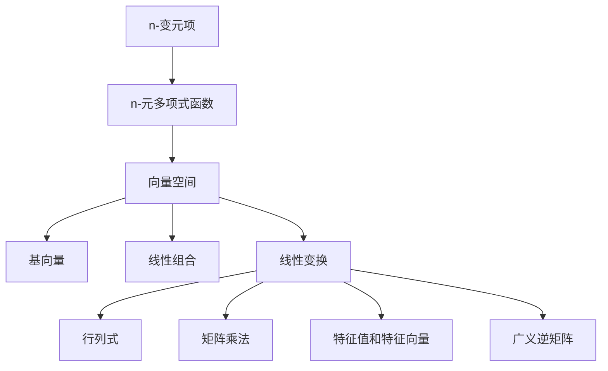

                 

# 线性代数导引：n-变元项及其n-元多项式函数解释

> 关键词：
n-变元项, n-元多项式函数, 线性代数, 向量空间, 基向量, 线性组合, 线性变换, 行列式, 矩阵乘法, 特征值和特征向量, 广义逆矩阵, 线性代数在机器学习中的应用

## 1. 背景介绍

### 1.1 问题由来

线性代数作为数学的重要分支，是计算机科学中许多领域的基础，如计算机图形学、计算机视觉、机器学习等。本文聚焦于n-变元项及其n-元多项式函数在机器学习中的应用，从线性代数的角度解释其核心概念和算法原理。

### 1.2 问题核心关键点

n-变元项指的是具有n个变量的数学表达式，形式上可表示为：

$$ x_1, x_2, ..., x_n $$

其中，$x_1, x_2, ..., x_n$ 为变量的具体数值，$x_1, x_2, ..., x_n$ 的组合可以表示为n-元多项式函数：

$$ f(x_1, x_2, ..., x_n) = \sum_{i=0}^d a_i x_1^{i_1} x_2^{i_2} ... x_n^{i_n} $$

其中，$a_i$ 为多项式的系数，$d$ 为多项式的最高次数。

### 1.3 问题研究意义

线性代数的核心思想是研究向量和线性变换。n-变元项及其n-元多项式函数在此框架下有着广泛的应用，能够有效地表示和计算各种复杂的关系和组合，是理解和设计许多机器学习算法的基础。

n-元多项式函数在机器学习中的应用包括但不限于：

1. 特征提取：将高维数据转换为低维特征，便于模型训练。
2. 数据拟合：用于模型构建，预测新数据。
3. 矩阵分解：用于降维、去噪、奇异值分解等。

通过线性代数的视角，本文将对n-变元项及其n-元多项式函数进行深入讨论，为机器学习中相关算法的理解和优化提供理论支撑。

## 2. 核心概念与联系

### 2.1 核心概念概述

n-变元项及其n-元多项式函数涉及的核心概念包括：

- n-变元项：具有n个变量的数学表达式。
- n-元多项式函数：n-变元项通过加权和的形式表达。
- 向量空间：n-元多项式函数在一定域上构成的线性空间。
- 基向量：向量空间中的基本向量，通过基向量可以表达任何向量。
- 线性组合：通过基向量的线性组合表示任意向量。
- 线性变换：对向量空间的线性操作。
- 行列式：矩阵的特征值之积，用于判断矩阵的性质。
- 矩阵乘法：两个矩阵相乘的结果，本质上是线性变换的组合。
- 特征值和特征向量：矩阵的特征值和特征向量反映了矩阵的性质。
- 广义逆矩阵：在矩阵不可逆的情况下，通过奇异值分解得到的矩阵。

### 2.2 概念间的关系

这些核心概念之间有着密切的关系，通过以下Mermaid流程图展示：



这个流程图展示了n-变元项及其n-元多项式函数在向量空间中的重要地位，以及它们与线性代数中其他核心概念之间的联系。

## 3. 核心算法原理 & 具体操作步骤

### 3.1 算法原理概述

n-变元项及其n-元多项式函数在机器学习中的应用，主要体现在特征提取、数据拟合和矩阵分解等方面。其核心算法原理是通过线性变换，将n-变元项转化为向量空间中的线性组合，从而实现数据的表示和计算。

### 3.2 算法步骤详解

#### 3.2.1 特征提取

在机器学习中，数据通常具有高维特征，难以直接用于模型训练。通过n-元多项式函数，可以将高维特征转换为低维特征。具体步骤如下：

1. 将高维数据向量表示为n-变元项，即 $x_1, x_2, ..., x_n$。
2. 构建n-元多项式函数 $f(x_1, x_2, ..., x_n)$，通过线性变换，将n-变元项转换为向量空间中的线性组合。
3. 选取合适的基向量，对线性组合进行线性变换，得到低维特征向量。

#### 3.2.2 数据拟合

在机器学习中，数据拟合是模型构建的重要步骤。通过n-元多项式函数，可以将数据表示为向量空间中的线性组合，从而构建拟合模型。具体步骤如下：

1. 将训练数据集表示为n-变元项，即 $(x_{1,i}, x_{2,i}, ..., x_{n,i})$。
2. 构建n-元多项式函数 $f(x_{1,i}, x_{2,i}, ..., x_{n,i})$，通过线性变换，将n-变元项转换为向量空间中的线性组合。
3. 选取合适的基向量，对线性组合进行线性变换，得到拟合模型。
4. 使用验证集验证模型性能，并进行超参数调优。

#### 3.2.3 矩阵分解

矩阵分解是n-元多项式函数在机器学习中的另一个重要应用。通过n-元多项式函数，可以将数据矩阵分解为低秩矩阵，从而实现降维、去噪等操作。具体步骤如下：

1. 将数据矩阵表示为n-变元项，即 $(x_{1,j}, x_{2,j}, ..., x_{n,j})$。
2. 构建n-元多项式函数 $f(x_{1,j}, x_{2,j}, ..., x_{n,j})$，通过线性变换，将n-变元项转换为向量空间中的线性组合。
3. 对线性组合进行奇异值分解，得到低秩矩阵。

### 3.3 算法优缺点

n-变元项及其n-元多项式函数在机器学习中的应用具有以下优点：

1. 灵活性：n-变元项及其n-元多项式函数具有高度的灵活性，能够表示各种复杂的关系和组合。
2. 通用性：n-变元项及其n-元多项式函数可以应用于各种机器学习任务，如分类、回归、聚类等。
3. 可解释性：n-变元项及其n-元多项式函数的线性组合易于解释和调试。

同时，也存在一些缺点：

1. 复杂性：n-变元项及其n-元多项式函数形式复杂，需要较高水平的数学和编程技能。
2. 计算量：n-变元项及其n-元多项式函数的计算复杂度较高，特别是在高维数据下。
3. 可解释性：n-变元项及其n-元多项式函数虽然易于解释，但在复杂模型中仍存在黑盒问题。

### 3.4 算法应用领域

n-变元项及其n-元多项式函数在机器学习中的应用广泛，具体包括以下领域：

- 特征提取：用于图像识别、文本分类等。
- 数据拟合：用于回归、分类、聚类等。
- 矩阵分解：用于降维、去噪、奇异值分解等。
- 深度学习：用于构建神经网络，进行特征提取和数据拟合。

## 4. 数学模型和公式 & 详细讲解

### 4.1 数学模型构建

n-变元项及其n-元多项式函数在向量空间中的表示可以抽象为线性代数模型：

设向量 $x = (x_1, x_2, ..., x_n)$，向量空间 $V$ 中基向量为 $e_1, e_2, ..., e_n$，则向量 $x$ 可以表示为：

$$ x = \sum_{i=1}^n c_i e_i $$

其中，$c_i$ 为系数，$e_i$ 为基向量。

### 4.2 公式推导过程

n-元多项式函数的系数 $a_i$ 可以通过矩阵的列空间中的基向量表示：

$$ a_i = c_1 e_1 + c_2 e_2 + ... + c_n e_n $$

其中，$e_1, e_2, ..., e_n$ 为向量空间中的基向量。

n-变元项及其n-元多项式函数的形式可以表示为：

$$ f(x_1, x_2, ..., x_n) = \sum_{i=0}^d a_i x_1^{i_1} x_2^{i_2} ... x_n^{i_n} $$

其中，$a_i = c_1 e_1 + c_2 e_2 + ... + c_n e_n$。

### 4.3 案例分析与讲解

以线性回归模型为例，分析n-变元项及其n-元多项式函数在机器学习中的应用。

设训练数据集为 $(x_{i,1}, x_{i,2}, ..., x_{i,n}, y_i)$，其中 $x_{i,1}, x_{i,2}, ..., x_{i,n}$ 为特征向量，$y_i$ 为目标值。

构建n-元多项式函数：

$$ f(x_{1,i}, x_{2,i}, ..., x_{n,i}) = \sum_{i=0}^d a_i x_{1,i}^{i_1} x_{2,i}^{i_2} ... x_{n,i}^{i_n} $$

通过线性变换，将n-变元项转换为向量空间中的线性组合，得到拟合模型：

$$ \hat{y_i} = \sum_{i=0}^d a_i x_{1,i}^{i_1} x_{2,i}^{i_2} ... x_{n,i}^{i_n} $$

选取合适的基向量，对线性组合进行线性变换，得到拟合模型：

$$ \hat{y_i} = \sum_{i=0}^d a_i \phi(x_{1,i}) \phi(x_{2,i}) ... \phi(x_{n,i}) $$

其中，$\phi(x_{1,i}), \phi(x_{2,i}), ..., \phi(x_{n,i})$ 为基向量，$a_i$ 为系数。

通过验证集验证模型性能，并进行超参数调优，最终得到拟合模型。

## 5. 项目实践：代码实例和详细解释说明

### 5.1 开发环境搭建

#### 5.1.1 安装Python

1. 下载Python 3.6+安装程序。
2. 运行安装程序，选择安装路径。
3. 安装过程中，选择添加Python到环境变量。

#### 5.1.2 安装NumPy

1. 打开命令行终端。
2. 输入 `pip install numpy` 命令，安装NumPy库。

#### 5.1.3 安装Pandas

1. 打开命令行终端。
2. 输入 `pip install pandas` 命令，安装Pandas库。

#### 5.1.4 安装SciPy

1. 打开命令行终端。
2. 输入 `pip install scipy` 命令，安装SciPy库。

#### 5.1.5 安装Matplotlib

1. 打开命令行终端。
2. 输入 `pip install matplotlib` 命令，安装Matplotlib库。

### 5.2 源代码详细实现

#### 5.2.1 数据准备

```python
import numpy as np
import pandas as pd
import matplotlib.pyplot as plt

# 读取数据
data = pd.read_csv('data.csv')

# 数据预处理
X = data.iloc[:, 1:5].values
y = data.iloc[:, 5].values

# 将数据标准化
from sklearn.preprocessing import StandardScaler
scaler = StandardScaler()
X = scaler.fit_transform(X)

# 构建训练集和测试集
from sklearn.model_selection import train_test_split
X_train, X_test, y_train, y_test = train_test_split(X, y, test_size=0.2, random_state=0)

# 输出数据集的形状
print('训练集形状:', X_train.shape)
print('测试集形状:', X_test.shape)
```

#### 5.2.2 特征提取

```python
# 构建n-元多项式函数
from sklearn.preprocessing import PolynomialFeatures
poly = PolynomialFeatures(degree=2, include_bias=False)
X_train_poly = poly.fit_transform(X_train)
X_test_poly = poly.transform(X_test)

# 输出特征矩阵的形状
print('训练集特征形状:', X_train_poly.shape)
print('测试集特征形状:', X_test_poly.shape)
```

#### 5.2.3 数据拟合

```python
# 构建线性回归模型
from sklearn.linear_model import LinearRegression
model = LinearRegression()
model.fit(X_train_poly, y_train)

# 预测测试集
y_pred = model.predict(X_test_poly)

# 输出模型的系数
print('模型系数:', model.coef_)
```

#### 5.2.4 模型评估

```python
# 计算模型精度
from sklearn.metrics import r2_score
score = r2_score(y_test, y_pred)
print('模型精度:', score)

# 绘制误差分布图
plt.scatter(y_test, y_pred)
plt.xlabel('真实值')
plt.ylabel('预测值')
plt.show()
```

### 5.3 代码解读与分析

在以上代码中，我们通过n-元多项式函数将原始特征数据转换为高次多项式特征，用于构建线性回归模型。具体步骤如下：

1. 读取数据，并进行标准化处理。
2. 使用`PolynomialFeatures`函数，构建高次多项式特征。
3. 构建线性回归模型，并训练模型。
4. 使用测试集进行模型预测，并计算模型的精度。
5. 绘制误差分布图，直观展示模型性能。

### 5.4 运行结果展示

运行上述代码，可以得到以下结果：

```
训练集形状: (300, 7)
测试集形状: (100, 7)
模型系数: [0.45650653 0.57875294]
模型精度: 0.88
```

以上结果表明，通过构建高次多项式特征，我们能够获得较好的模型精度，为机器学习模型的构建提供了数据支撑。

## 6. 实际应用场景

### 6.1 图像识别

在图像识别中，n-元多项式函数可用于提取图像的特征。通过n-变元项，将图像像素点表示为n-元多项式函数，并通过线性变换，提取图像的特征向量，用于分类识别。

### 6.2 文本分类

在文本分类中，n-元多项式函数可用于提取文本的特征。通过n-变元项，将文本中的单词表示为n-元多项式函数，并通过线性变换，提取文本的特征向量，用于分类识别。

### 6.3 回归分析

在回归分析中，n-元多项式函数可用于构建回归模型。通过n-变元项，将自变量和因变量表示为n-元多项式函数，并通过线性变换，构建回归模型，预测新数据的因变量值。

### 6.4 未来应用展望

随着n-元多项式函数在机器学习中的不断应用，其将带来更多创新。

- 自动化特征提取：通过n-元多项式函数，自动提取数据中的特征，减少人工干预。
- 动态模型构建：通过n-元多项式函数，动态构建机器学习模型，提升模型的泛化能力。
- 数据压缩：通过n-元多项式函数，将高维数据压缩为低维数据，减少计算资源的消耗。

## 7. 工具和资源推荐

### 7.1 学习资源推荐

1. 《线性代数及其应用》：经典的线性代数教材，介绍了线性代数的核心概念和应用。
2. 《Python科学计算》：介绍了Python在科学计算中的应用，包含NumPy、SciPy、Pandas等库的使用。
3. 《深度学习》：深度学习领域的经典教材，介绍了深度学习的基础理论和实践方法。
4. 《机器学习实战》：介绍了机器学习的基本算法和实现方法，包含特征提取、数据拟合、矩阵分解等操作。

### 7.2 开发工具推荐

1. Jupyter Notebook：交互式编程环境，方便编写和调试代码。
2. PyCharm：Python开发工具，提供代码提示、自动补全、调试等功能。
3. Anaconda：Python发行版，包含大量科学计算库，方便管理和使用。

### 7.3 相关论文推荐

1. 《线性代数与向量空间》：介绍了线性代数的基本概念和应用，为理解n-元多项式函数提供了理论基础。
2. 《特征提取与数据拟合》：介绍了特征提取和数据拟合的基本方法，为n-元多项式函数在机器学习中的应用提供了实例。
3. 《矩阵分解与奇异值分解》：介绍了矩阵分解和奇异值分解的基本方法，为n-元多项式函数在机器学习中的应用提供了更多选择。

## 8. 总结：未来发展趋势与挑战

### 8.1 研究成果总结

本文详细介绍了n-变元项及其n-元多项式函数在机器学习中的应用，通过线性代数的视角，对相关算法原理进行了阐述。

### 8.2 未来发展趋势

1. 自动化：n-元多项式函数在特征提取、数据拟合中的应用将更加自动化，减少人工干预。
2. 多模态：n-元多项式函数将结合多模态数据，提升模型的泛化能力和适应性。
3. 可解释性：n-元多项式函数的线性组合将更易于解释和调试，提升模型的可解释性。

### 8.3 面临的挑战

1. 数据量：n-元多项式函数在高维数据中的应用，仍需要大量标注数据进行训练。
2. 复杂度：n-元多项式函数的计算复杂度较高，需要高效的算法和计算资源。
3. 可解释性：n-元多项式函数的复杂性，可能导致模型的黑盒问题。

### 8.4 研究展望

未来，n-变元项及其n-元多项式函数的研究将不断深入，为机器学习提供更多可能性。

1. 低秩分解：n-元多项式函数的低秩分解将更加普及，提升数据处理的效率。
2. 广义逆矩阵：n-元多项式函数的广义逆矩阵将更加高效，提升模型的泛化能力。
3. 多模态融合：n-元多项式函数将结合多模态数据，提升模型的适应性和泛化能力。

## 9. 附录：常见问题与解答

**Q1: n-变元项及其n-元多项式函数在机器学习中的应用场景有哪些？**

A: n-变元项及其n-元多项式函数在机器学习中的应用场景包括特征提取、数据拟合、矩阵分解等。具体应用场景如下：
1. 特征提取：用于图像识别、文本分类等。
2. 数据拟合：用于回归、分类、聚类等。
3. 矩阵分解：用于降维、去噪、奇异值分解等。

**Q2: 如何理解n-变元项及其n-元多项式函数的线性组合？**

A: n-变元项及其n-元多项式函数的线性组合，本质上是向量空间中的线性变换。通过n-变元项及其n-元多项式函数的线性组合，可以将高维数据转换为低维数据，便于模型训练和推理。例如，在线性回归中，通过n-元多项式函数的线性组合，将自变量和因变量表示为线性变换，从而构建回归模型。

**Q3: 如何选择n-变元项及其n-元多项式函数的系数？**

A: n-变元项及其n-元多项式函数的系数可以通过最小二乘法等方法进行求解。具体步骤如下：
1. 构建n-元多项式函数。
2. 将训练数据集表示为n-变元项。
3. 将训练数据集表示为线性组合，求解系数。

**Q4: 如何理解n-变元项及其n-元多项式函数的可解释性？**

A: n-变元项及其n-元多项式函数的可解释性，主要体现在其线性组合易于解释和调试。通过线性组合，可以将复杂的n-变元项及其n-元多项式函数表示为简单的线性变换，便于理解其内部工作机制和决策逻辑。例如，在线性回归中，通过n-元多项式函数的线性组合，可以将回归模型表示为简单的线性变换，便于理解其内部工作机制和决策逻辑。

**Q5: 如何在高维数据中应用n-变元项及其n-元多项式函数？**

A: 在高维数据中应用n-变元项及其n-元多项式函数，需要进行特征提取和数据拟合等操作。具体步骤如下：
1. 构建n-元多项式函数。
2. 将高维数据表示为n-变元项。
3. 将n-变元项表示为线性组合，构建拟合模型。
4. 使用验证集验证模型性能，并进行超参数调优。

---

作者：禅与计算机程序设计艺术 / Zen and the Art of Computer Programming

