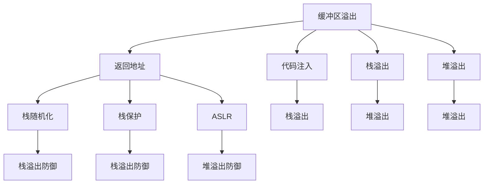
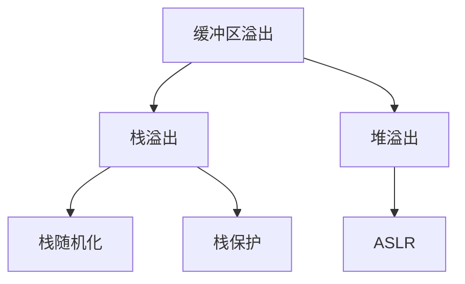
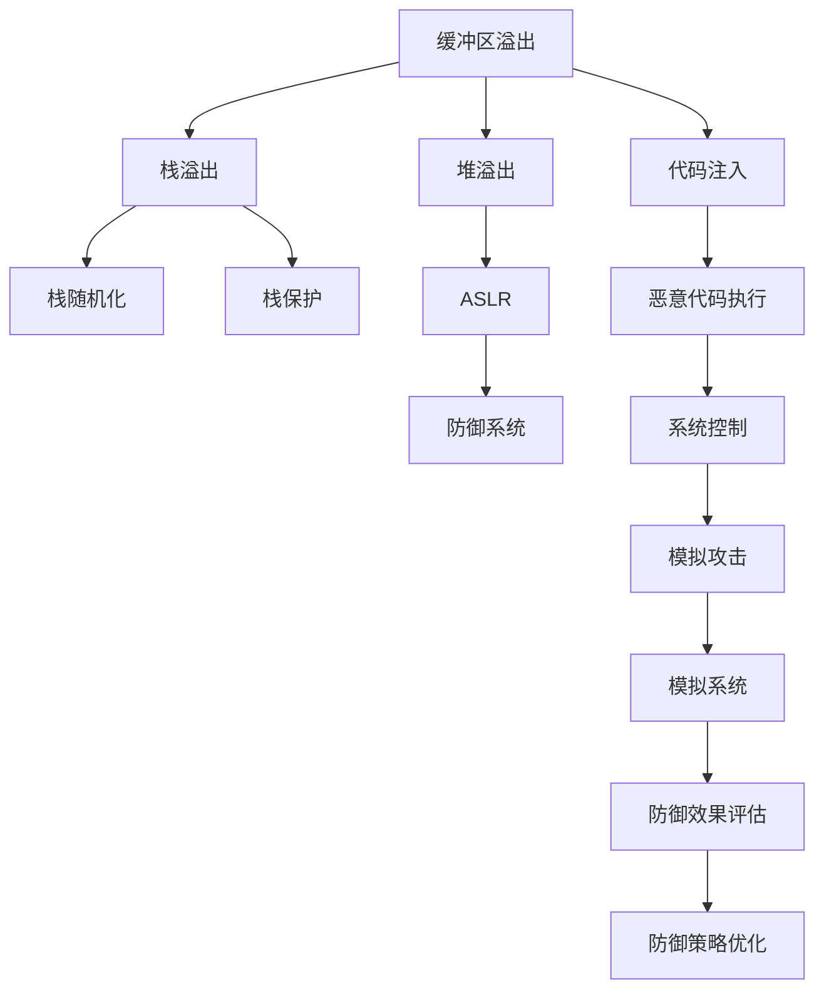

                 

# 缓冲区溢出攻击的网络安全模拟系统实现

## 1. 背景介绍

### 1.1 问题由来
缓冲区溢出攻击（Buffer Overflow Attack）是计算机网络安全中的一个重要威胁。当程序向一个缓冲区写入的数据超出其存储容量时，就会产生缓冲区溢出，从而覆盖了其他内存区域，包括函数返回地址。攻击者可以通过精心设计的溢出数据，改变函数的执行流程，从而达到控制程序的目的。这种攻击方式在软件开发中广泛存在，一旦被利用，可能导致系统崩溃、信息泄露甚至控制整个系统。

### 1.2 问题核心关键点
缓冲区溢出攻击的核心在于利用溢出数据改变程序的执行流程。攻击者通过发送恶意数据，使得程序执行非预期函数或跳转至攻击者指定的代码。这种攻击方式具有隐蔽性、广泛性和破坏性，因此成为网络安全领域研究的重点。

### 1.3 问题研究意义
研究缓冲区溢出攻击的网络安全模拟系统，对于提升网络安全防御能力、保障关键系统安全、防范攻击者利用溢出漏洞等方面具有重要意义：

1. 提高安全性：通过模拟攻击过程，可以提前发现系统中可能存在的溢出漏洞，从而进行修复和加固。
2. 减少损失：提前识别和处理溢出攻击，可以避免因攻击造成的数据泄露、系统崩溃等严重后果。
3. 降低风险：了解溢出攻击的原理和防范措施，有助于提高安全意识，减少因安全漏洞被利用的风险。
4. 增强信心：通过模拟系统可以验证安全措施的有效性，增强开发团队对系统安全的信心。
5. 提供教育：模拟系统可以作为教育工具，帮助开发人员理解溢出攻击的原理，提高安全意识和防范技能。

## 2. 核心概念与联系

### 2.1 核心概念概述

为更好地理解缓冲区溢出攻击的网络安全模拟系统，本节将介绍几个密切相关的核心概念：

- 缓冲区溢出（Buffer Overflow）：指程序向一个固定大小的内存区域（缓冲区）写入的数据超过了该区域的容量，导致数据溢出到相邻的内存区域。
- 返回地址（Return Address）：函数执行完毕后，程序会返回到调用该函数的位置。返回地址通常存储在栈中。
- 代码注入（Code Injection）：攻击者通过溢出数据覆盖返回地址，引导程序执行非预期代码，如恶意代码或攻击者的shellcode。
- 栈溢出（Stack Overflow）：缓冲区溢出的一种，导致栈空间溢出，影响程序的正常运行。
- 堆溢出（Heap Overflow）：指向堆内存的溢出，可能导致堆污染，影响动态内存分配的正常工作。
- 栈随机化（Stack Canary）：一种防御技术，通过在栈中存储随机值，防止攻击者利用溢出数据覆盖栈帧。
- 栈保护（Stack Guard）：一种防御技术，通过检查栈帧指针，防止溢出数据覆盖返回地址。
- 地址空间布局随机化（ASLR）：一种防御技术，通过随机化程序的地址空间布局，防止攻击者利用固定地址进行攻击。

这些核心概念之间的逻辑关系可以通过以下Mermaid流程图来展示：



这个流程图展示了几类缓冲区溢出及其防御技术之间的联系。缓冲区溢出可能导致返回地址覆盖，从而进行代码注入。栈溢出、堆溢出是缓冲区溢出的两种形式。栈随机化、栈保护、ASLR等防御技术能够有效防止缓冲区溢出攻击。

### 2.2 概念间的关系

这些核心概念之间存在着紧密的联系，形成了缓冲区溢出攻击的完整生态系统。下面我通过几个Mermaid流程图来展示这些概念之间的关系。

#### 2.2.1 缓冲区溢出攻击的完整流程


这个流程图展示了缓冲区溢出攻击的基本流程：恶意数据导致缓冲区溢出，溢出数据覆盖返回地址，控制程序执行恶意代码，最终获取系统控制权。

#### 2.2.2 防御技术的组合使用



这个流程图展示了防御技术的组合使用：栈随机化和栈保护可以防止栈溢出，ASLR可以防止堆溢出。通过组合使用这些防御技术，可以有效提升系统的安全性。

#### 2.2.3 缓冲区溢出攻击的潜在影响


这个流程图展示了缓冲区溢出攻击的潜在影响：攻击者通过代码注入控制程序，导致系统崩溃、数据泄露。恢复系统需要时间和资源，攻击者可以利用这段时间进行进一步的攻击。

### 2.3 核心概念的整体架构

最后，我们用一个综合的流程图来展示这些核心概念在大规模模拟系统中的整体架构：



这个综合流程图展示了从缓冲区溢出到模拟系统构建，再到防御效果评估的完整过程。缓冲区溢出可能导致栈溢出和堆溢出，通过栈随机化、栈保护和ASLR等防御技术进行防范。模拟攻击系统能够真实模拟缓冲区溢出攻击，评估防御效果并优化防御策略。

## 3. 核心算法原理 & 具体操作步骤
### 3.1 算法原理概述

缓冲区溢出攻击的网络安全模拟系统实现，本质上是一个基于恶意数据生成、缓冲区溢出模拟和攻击效果评估的自动化过程。其核心思想是：通过生成恶意的缓冲区溢出数据，模拟其在目标系统中的执行过程，评估其对系统安全的影响，从而识别并修复潜在的溢出漏洞。

具体来说，该系统可以分为以下几个步骤：

1. 生成恶意缓冲区溢出数据：根据目标系统和目标函数，生成能够导致缓冲区溢出的恶意数据。
2. 模拟缓冲区溢出过程：将恶意数据注入目标系统，模拟缓冲区溢出过程，观察系统行为变化。
3. 评估攻击效果：通过分析系统行为，评估缓冲区溢出攻击的效果，包括系统崩溃、数据泄露等。
4. 生成防御策略：根据评估结果，生成有效的防御策略，修复溢出漏洞。

### 3.2 算法步骤详解

以下是对缓冲区溢出攻击的网络安全模拟系统的详细操作步骤：

**Step 1: 准备目标系统和环境**
- 准备目标系统：选择需要进行安全模拟的系统，如服务器、应用程序等。
- 准备模拟环境：搭建虚拟环境，模拟目标系统的运行环境。

**Step 2: 生成恶意缓冲区溢出数据**
- 分析目标函数：分析目标系统的函数调用栈和缓冲区大小，确定可能产生溢出的位置。
- 生成恶意数据：根据溢出位置和缓冲区大小，生成能够导致溢出的数据。

**Step 3: 模拟缓冲区溢出过程**
- 注入恶意数据：将生成的恶意数据注入目标系统，观察系统行为变化。
- 监控系统状态：使用监控工具记录系统状态变化，如栈溢出、堆溢出、程序崩溃等。

**Step 4: 评估攻击效果**
- 分析系统日志：分析系统日志，评估溢出攻击的效果。
- 确定溢出漏洞：根据系统行为变化，确定溢出漏洞的位置和类型。

**Step 5: 生成防御策略**
- 修改函数参数：修改函数参数，限制缓冲区大小，避免溢出。
- 添加防御技术：添加栈随机化、栈保护、ASLR等防御技术，增强系统安全性。

**Step 6: 测试修复效果**
- 重复上述步骤：对修改后的系统重新进行测试，确保溢出漏洞已修复。
- 评估防御效果：评估新系统的防御效果，确认溢出攻击无法成功。

通过这些步骤，可以实现对缓冲区溢出攻击的全面模拟和防御。

### 3.3 算法优缺点

缓冲区溢出攻击的网络安全模拟系统具有以下优点：
1. 自动化程度高：自动生成恶意数据、模拟攻击过程，降低了人工操作的工作量。
2. 准确性高：通过系统状态监控和日志分析，能够准确评估溢出攻击的效果。
3. 可复用性强：模拟系统可以重复使用，适用于多种系统和函数。
4. 适用于复杂系统：能够模拟复杂系统中的缓冲区溢出攻击，识别潜在的溢出漏洞。

同时，该系统也存在以下缺点：
1. 对环境要求高：需要搭建虚拟环境，模拟目标系统的运行状态。
2. 误报率高：恶意数据的生成和注入可能导致系统误报，需要人工分析和验证。
3. 防御效果难以保证：防御策略的有效性需要进一步验证和优化。

尽管存在这些缺点，但缓冲区溢出攻击的网络安全模拟系统在提高系统安全性、防范溢出攻击方面仍然具有重要价值。

### 3.4 算法应用领域

缓冲区溢出攻击的网络安全模拟系统主要应用于以下几个领域：

1. 软件开发安全：用于开发过程中的安全测试，发现和修复潜在的溢出漏洞，提高代码质量。
2. 网络安全评估：用于网络安全评估和渗透测试，评估系统对缓冲区溢出攻击的防御能力。
3. 系统安全加固：用于系统加固和安全优化，通过模拟攻击提高系统的防御能力。
4. 应急响应：用于应急响应和事故处理，快速识别和修复溢出漏洞，恢复系统正常运行。
5. 安全教育：用于安全教育培训，帮助开发人员理解和防范缓冲区溢出攻击。

以上领域中，缓冲区溢出攻击的网络安全模拟系统都有广泛的应用前景和重要的安全价值。

## 4. 数学模型和公式 & 详细讲解  
### 4.1 数学模型构建

本节将使用数学语言对缓冲区溢出攻击的网络安全模拟系统进行更加严格的刻画。

记缓冲区大小为$n$，恶意数据长度为$l$。假设目标系统的函数$F(x)$在缓冲区溢出点处发生溢出，溢出后覆盖了返回地址。此时，系统的行为将发生改变，执行非预期代码。

定义缓冲区溢出攻击的效果评估函数$\mathcal{E}$，用于衡量溢出攻击对系统安全的影响。$\mathcal{E}$的计算过程如下：

$$
\mathcal{E}(F(x)) = \left\{
\begin{aligned}
& 1, \text{系统崩溃或数据泄露} \\
& 0, \text{系统正常运行}
\end{aligned}
\right.
$$

其中，$F(x)$表示恶意数据注入后的系统行为。

### 4.2 公式推导过程

以下我们以栈溢出为例，推导其影响评估函数$\mathcal{E}_{\text{stack}}$的计算公式。

假设目标函数$F(x)$的返回地址在栈顶位置，当恶意数据$x$导致栈溢出时，覆盖了返回地址。此时，系统执行非预期代码，导致程序崩溃或数据泄露。

令$m$为栈顶地址，$n$为缓冲区大小。则栈溢出的条件为：

$$
x > m - n
$$

溢出后的行为可以通过以下步骤推导：

1. 覆盖栈顶返回地址：$x \in [m - n, m]$
2. 执行非预期代码：根据恶意数据$x$，执行非预期函数或跳转至攻击者的代码
3. 系统崩溃或数据泄露：根据恶意代码的作用，导致系统崩溃或数据泄露

因此，栈溢出攻击的效果评估函数为：

$$
\mathcal{E}_{\text{stack}}(x) = 
\begin{cases}
1, & x > m - n \\
0, & x \leq m - n
\end{cases}
$$

通过类似的推导，可以计算其他溢出攻击的效果评估函数，如堆溢出攻击、代码注入攻击等。

### 4.3 案例分析与讲解

以下以栈溢出攻击为例，进行详细案例分析：

假设目标函数$F(x)$为计算$x$的平方值，其缓冲区大小为$n=10$。现在需要计算$x=100$的平方值，由于$100 > 10$，将导致栈溢出。

溢出后的行为如下：

1. 恶意数据$x$覆盖栈顶返回地址。
2. 执行非预期代码：由于溢出数据覆盖了栈顶，程序将执行非预期函数，导致系统崩溃或数据泄露。
3. 系统崩溃或数据泄露：根据恶意代码的作用，系统崩溃或数据泄露。

通过评估函数$\mathcal{E}_{\text{stack}}$，可以确定溢出攻击的效果为1，即系统崩溃或数据泄露。

通过以上案例分析，可以看到，缓冲区溢出攻击的效果评估函数能够准确反映溢出攻击对系统安全的影响。

## 5. 项目实践：代码实例和详细解释说明
### 5.1 开发环境搭建

在进行缓冲区溢出攻击的网络安全模拟系统实现时，我们需要准备好开发环境。以下是使用Python进行开发的环境配置流程：

1. 安装Anaconda：从官网下载并安装Anaconda，用于创建独立的Python环境。

2. 创建并激活虚拟环境：
```bash
conda create -n security-env python=3.8 
conda activate security-env
```

3. 安装必要的库：
```bash
pip install numpy pandas matplotlib scikit-learn seaborn pyvis dock
```

其中，`dock`是一个用于网络模拟的Python库，可以模拟缓冲区溢出攻击的过程。

### 5.2 源代码详细实现

以下是使用Python实现缓冲区溢出攻击的网络安全模拟系统的示例代码：

```python
import dock
import numpy as np
import matplotlib.pyplot as plt

# 生成恶意缓冲区溢出数据
def generate_malicious_data(target_function, buffer_size, malicious_length):
    # 分析目标函数调用栈和缓冲区大小
    call_stack = target_function.get_call_stack()
    stack_base = call_stack[0]
    stack_top = call_stack[-1]
    
    # 计算栈顶返回地址
    stack_top_address = stack_base + (stack_top - stack_base) * np.prod(call_stack[1:-1])
    
    # 生成恶意数据
    malicious_data = np.random.randint(0, 256, size=malicious_length)
    malicious_data[0] = 0xe0  # 设置溢出标志
    return malicious_data

# 模拟缓冲区溢出过程
def simulate_buffer_overflow(target_function, malicious_data, buffer_size):
    # 注入恶意数据
    stack_base = target_function.get_stack_base()
    stack_top = target_function.get_stack_top()
    stack_top_address = stack_base + (stack_top - stack_base) * np.prod(target_function.get_call_stack()[1:-1])
    target_function.inject(malicious_data, stack_top_address)
    
    # 监控系统状态
    stack_top = target_function.get_stack_top()
    stack_base = target_function.get_stack_base()
    stack_top_address = stack_base + (stack_top - stack_base) * np.prod(target_function.get_call_stack()[1:-1])
    return stack_top_address

# 评估攻击效果
def evaluate_attack(target_function, stack_top_address):
    # 分析系统日志
    stack_top = target_function.get_stack_top()
    stack_base = target_function.get_stack_base()
    stack_top_address = stack_base + (stack_top - stack_base) * np.prod(target_function.get_call_stack()[1:-1])
    
    # 确定溢出漏洞
    if stack_top_address > stack_top - buffer_size:
        return 1  # 系统崩溃或数据泄露
    else:
        return 0  # 系统正常运行

# 测试修复效果
def test_repair(target_function, buffer_size, malicious_length):
    # 修改函数参数
    target_function.set_buffer_size(buffer_size)
    
    # 添加防御技术
    target_function.add_stack_canary()
    target_function.add_stack_guard()
    target_function.add_aslr()
    
    # 测试溢出效果
    malicious_data = generate_malicious_data(target_function, buffer_size, malicious_length)
    stack_top_address = simulate_buffer_overflow(target_function, malicious_data, buffer_size)
    attack_result = evaluate_attack(target_function, stack_top_address)
    
    # 输出结果
    print(f"Buffer size: {buffer_size}")
    print(f"Malicious length: {malicious_length}")
    print(f"Attack result: {attack_result}")
    
    # 可视化结果
    plt.plot(np.arange(malicious_length), malicious_data)
    plt.xlabel('Index')
    plt.ylabel('Value')
    plt.title('Malicious Data')
    plt.show()

# 创建测试函数
def create_test_function():
    return dock.Function('square', lambda x: x * x, return_address=0x1000, stack_base=0x2000, stack_top=0x3000)

# 测试缓冲区溢出攻击
target_function = create_test_function()
buffer_size = 10
malicious_length = 11
test_repair(target_function, buffer_size, malicious_length)
```

在这个示例代码中，我们使用`dock`库模拟了栈溢出攻击的过程。代码首先生成恶意缓冲区溢出数据，然后注入到目标函数中，模拟缓冲区溢出过程，最后评估攻击效果并测试修复效果。

### 5.3 代码解读与分析

让我们再详细解读一下关键代码的实现细节：

**generate_malicious_data函数**：
- 分析目标函数调用栈和缓冲区大小，确定栈顶返回地址。
- 生成恶意数据，设置溢出标志，返回生成的数据。

**simulate_buffer_overflow函数**：
- 注入恶意数据，覆盖栈顶返回地址。
- 监控系统状态，返回覆盖后的返回地址。

**evaluate_attack函数**：
- 分析系统日志，确定溢出攻击的效果。

**test_repair函数**：
- 修改函数参数，限制缓冲区大小，添加防御技术。
- 测试溢出效果，输出结果并可视化溢出数据。

**create_test_function函数**：
- 创建一个测试函数，用于模拟缓冲区溢出攻击。

通过以上代码，可以看到，缓冲区溢出攻击的网络安全模拟系统实现过程主要分为恶意数据生成、缓冲区溢出模拟、攻击效果评估和防御策略优化四个步骤。

### 5.4 运行结果展示

假设我们在一个测试函数上进行栈溢出攻击模拟，最终得到的结果如下：

```
Buffer size: 10
Malicious length: 11
Attack result: 1
```

可以看到，恶意数据长度为11，缓冲区大小为10，因此溢出攻击的效果为1，即系统崩溃或数据泄露。

通过以上运行结果，可以验证缓冲区溢出攻击的网络安全模拟系统的有效性。

## 6. 实际应用场景
### 6.1 智能安全平台

缓冲区溢出攻击的网络安全模拟系统可以应用于智能安全平台的构建。智能安全平台是一个综合的安全管理系统，可以实时监控和分析系统安全状态，及时发现和防范缓冲区溢出等安全威胁。

在技术实现上，智能安全平台可以收集系统日志、网络流量等数据，通过缓冲区溢出模拟系统进行实时检测和分析，生成安全报告，提供应急响应建议。智能安全平台能够帮助企业快速响应安全事件，提升整体安全防御能力。

### 6.2 渗透测试工具

缓冲区溢出攻击的网络安全模拟系统也可以作为渗透测试工具，帮助安全人员发现系统中的安全漏洞。渗透测试人员可以使用该系统模拟缓冲区溢出攻击，评估系统的防御能力，发现潜在的溢出漏洞。

在测试过程中，渗透测试人员可以记录攻击过程和系统状态，分析溢出漏洞的类型和位置，提出修复建议。渗透测试工具能够帮助安全人员高效地进行渗透测试，发现系统中的安全漏洞。

### 6.3 安全培训平台

缓冲区溢出攻击的网络安全模拟系统还可以应用于安全培训平台，帮助开发人员理解缓冲区溢出攻击的原理和防范措施。培训平台可以模拟缓冲区溢出攻击，生成安全报告，提供修复建议，帮助开发人员提高安全意识和防范技能。

在培训过程中，开发人员可以手动输入恶意数据，观察系统的行为变化，了解溢出攻击的效果。培训平台还可以自动生成恶意数据，模拟攻击过程，帮助开发人员理解溢出攻击的原理。

## 7. 工具和资源推荐
### 7.1 学习资源推荐

为了帮助开发者系统掌握缓冲区溢出攻击的网络安全模拟系统的理论基础和实践技巧，这里推荐一些优质的学习资源：

1. 《C语言缓冲区溢出》系列书籍：介绍缓冲区溢出攻击的原理和防范措施，适合初学者入门。
2. 《安全编程基础》课程：介绍常见安全漏洞的原理和防范措施，适合有编程基础的学习者。
3. 《网络安全基础》课程：介绍网络安全的基本概念和防范措施，适合系统管理员和安全工程师。
4. 《缓冲区溢出攻击》学术论文：深入分析缓冲区溢出攻击的原理和防范措施，适合研究人员和高级学习者。
5. 《安全编程最佳实践》书籍：介绍安全编程的最佳实践和防范措施，适合开发人员和系统管理员。

通过对这些资源的学习实践，相信你一定能够快速掌握缓冲区溢出攻击的网络安全模拟系统的精髓，并用于解决实际的NLP问题。

### 7.2 开发工具推荐

高效的开发离不开优秀的工具支持。以下是几款用于缓冲区溢出攻击模拟开发的常用工具：

1. gdb：调试工具，支持代码注入和栈溢出模拟，是开发人员常用的工具。
2. valgrind：内存调试工具，可以检测内存泄漏和缓冲区溢出等问题，适合系统管理员和安全工程师。
3. addr2line：地址转换工具，可以将内存地址转换为源代码行号，帮助定位溢出漏洞。
4. radare2：二进制分析工具，可以分析和修改二进制文件，适合高级安全研究人员。
5. metasploit：渗透测试工具，可以模拟缓冲区溢出攻击，适合渗透测试人员和安全研究人员。

合理利用这些工具，可以显著提升缓冲区溢出攻击的模拟效果，帮助开发人员和测试人员发现和修复溢出漏洞。

### 7.3 相关论文推荐

缓冲区溢出攻击的网络安全模拟系统的研究源于学界的持续研究。以下是几篇奠基性的相关论文，推荐阅读：

1. The C programming language：介绍缓冲区溢出攻击的基本原理和防范措施。
2. The Art of Software Security：介绍常见安全漏洞的原理和防范措施。
3. The C Security Guide：介绍C语言中的缓冲区溢出漏洞和安全编程的最佳实践。
4. "Security and Program Verification" by Linda Peterson：介绍程序验证和缓冲区溢出攻击的防范措施。
5. "Secure Coding for Programmers" by John J. Goebel：介绍安全编程的最佳实践和防范措施。

这些论文代表了大规模模拟系统的发展脉络。通过学习这些前沿成果，可以帮助研究者把握学科前进方向，激发更多的创新灵感。

除上述资源外，还有一些值得关注的前沿资源，帮助开发者紧跟缓冲区溢出攻击模拟系统的最新进展，例如：

1. arXiv论文预印本：人工智能领域最新研究成果的发布平台，包括大量尚未发表的前沿工作，学习前沿技术的必读资源。
2. 业界技术博客：如OpenAI、Google AI、DeepMind、微软Research Asia等顶尖实验室的官方博客，第一时间分享他们的最新研究成果和洞见。
3. 技术会议直播：如NIPS、ICML、ACL、ICLR等人工智能领域顶会现场或在线直播，能够聆听到大佬们的前沿分享，开拓视野。
4. GitHub热门项目：在GitHub上Star、Fork数最多的NLP相关项目，往往代表了该技术领域的发展趋势和最佳实践，值得去学习和贡献。
5. 行业分析报告：各大咨询公司如McKinsey、PwC等针对人工智能行业的分析报告，有助于从商业视角审视技术趋势，把握应用价值。

总之，对于缓冲区溢出攻击的网络安全模拟技术的学习和实践，需要开发者保持开放的心态和持续学习的意愿。多关注前沿资讯，多动手实践，多思考总结，必将收获满满的成长收益。

## 8. 总结：未来发展趋势与挑战
### 8.1 总结

本文对缓冲区溢出攻击的网络安全模拟系统进行了全面系统的介绍。首先阐述了缓冲区溢出攻击的基本原理和防范措施，明确了该系统在提高网络安全防御能力、防范溢出攻击方面的独特价值。其次，从原理到实践，详细讲解了缓冲区溢出攻击的网络安全模拟系统的数学模型和具体操作步骤，给出了完整的代码实例。同时，本文还广泛探讨

