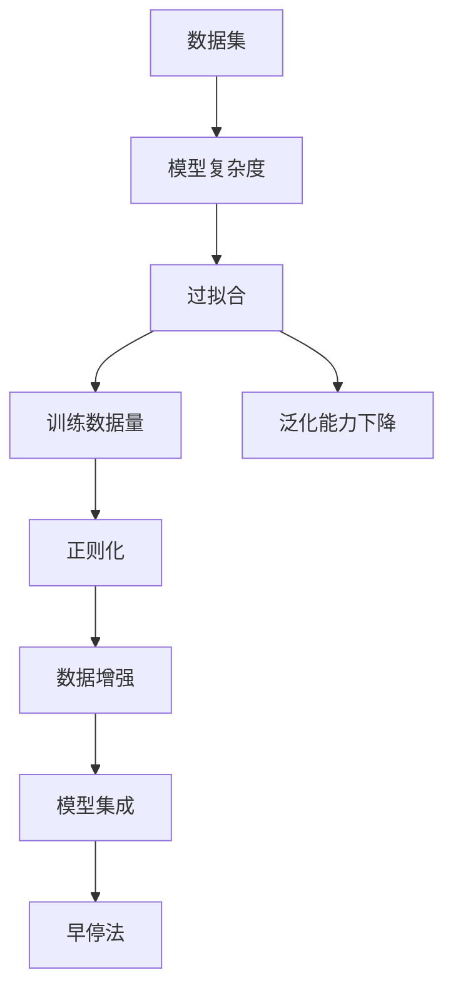

                 

# 一切皆是映射：深度学习实战：如何应对过拟合

> 关键词：深度学习,过拟合,映射函数,梯度下降,正则化,dropout,数据增强

## 1. 背景介绍

在深度学习时代，过拟合（overfitting）已成为模型训练过程中常见的难题。过拟合意味着模型在训练数据上表现得很好，但在测试数据上泛化能力不足，导致性能下降。过拟合问题不仅影响模型的实用性，还会浪费大量资源和时间。本博客将详细介绍深度学习中的过拟合问题，提出多种策略来应对和缓解过拟合。

## 2. 核心概念与联系

### 2.1 核心概念概述

深度学习中，过拟合（Overfitting）指模型在训练集上表现良好，但在测试集上表现较差的现象。导致过拟合的原因通常有：模型复杂度过高、训练数据过少、正则化不足等。为应对过拟合，通常采用数据增强、正则化、模型集成、早停法等技术。

#### 2.1.1 模型复杂度
模型复杂度（Model Complexity）是影响过拟合的重要因素。复杂的模型（如深度神经网络）具有更多的参数，更强的表达能力，但也更容易学习到训练数据的噪声，导致过拟合。

#### 2.1.2 训练数据量
训练数据量（Training Data Size）不足也是过拟合的重要原因。数据量过少，模型难以捕捉到数据中的真实分布，容易学习到训练数据的特征，而不是数据的泛化规律。

#### 2.1.3 正则化
正则化（Regularization）是缓解过拟合的有效手段。通过在损失函数中加入正则项，约束模型参数的范数，防止模型过于复杂。

#### 2.1.4 数据增强
数据增强（Data Augmentation）通过在训练过程中对数据进行扰动，增加数据多样性，防止模型对训练数据过度拟合。

#### 2.1.5 模型集成
模型集成（Model Ensemble）通过组合多个模型的预测结果，减少单个模型的过拟合风险。

#### 2.1.6 早停法
早停法（Early Stopping）在模型性能不再提升时停止训练，防止模型过拟合训练数据。

### 2.2 概念间的关系

过拟合是深度学习模型训练过程中常见的挑战。为了解决这一问题，需要综合考虑模型的复杂度、训练数据量、正则化、数据增强、模型集成、早停法等多个方面。这些概念之间的关系可以通过以下Mermaid流程图来展示：



## 3. 核心算法原理 & 具体操作步骤
### 3.1 算法原理概述

深度学习的过拟合问题本质上是对模型复杂度的控制问题。具体而言，过拟合的应对方法可以分为两个层次：数据层面和模型层面。

#### 数据层面
1. **数据增强**：通过变换训练数据，如旋转、平移、翻转等，增加数据多样性。
2. **数据扩充**：通过生成新的训练数据，如SMOTE算法。

#### 模型层面
1. **正则化**：在损失函数中引入正则项，如L1、L2正则、Dropout等。
2. **早停法**：监测验证集上的性能，当性能不再提升时停止训练。
3. **模型集成**：通过投票或平均多个模型的预测结果，提高模型的泛化能力。

### 3.2 算法步骤详解

#### 数据增强
数据增强是缓解过拟合的有效手段。常见的数据增强技术包括：

1. **图像增强**：
   - 翻转、旋转、缩放：增加图像多样性。
   - 平移、剪切、扭曲：改变图像结构。
   - 噪声添加：如高斯噪声、椒盐噪声等。

2. **文本增强**：
   - 同义词替换：替换单词的同义词。
   - 句子插入：在句子中插入噪声单词。
   - 随机删除：随机删除某些单词。

#### 正则化
正则化是通过在损失函数中引入正则项来约束模型参数。常见的正则化方法包括：

1. **L1正则化**：惩罚模型参数的绝对值。
2. **L2正则化**：惩罚模型参数的平方和。
3. **Dropout**：随机丢弃模型中的某些神经元。

#### 早停法
早停法通过监测验证集上的性能，当性能不再提升时停止训练，防止模型过拟合训练数据。具体步骤如下：

1. **初始化模型和数据集**：随机初始化模型参数，将数据集划分为训练集和验证集。
2. **训练模型**：使用训练集训练模型，每轮训练后评估模型在验证集上的性能。
3. **保存模型**：当验证集上的性能不再提升时，保存当前模型，停止训练。

### 3.3 算法优缺点

#### 优点
1. **缓解过拟合**：数据增强、正则化等方法可以有效减少模型对训练数据的过度拟合。
2. **提高泛化能力**：模型集成、早停法等方法可以提高模型的泛化能力，使其在测试集上表现更好。

#### 缺点
1. **计算成本**：数据增强、模型集成等方法会增加计算成本。
2. **模型复杂度**：过多的正则化可能导致模型过于简单，无法捕捉复杂数据分布。

### 3.4 算法应用领域

过拟合问题不仅存在于图像分类、文本分类等经典任务中，还广泛存在于自然语言处理、语音识别、推荐系统等多个领域。

#### 图像分类
过拟合在图像分类任务中非常常见，尤其是在模型复杂度高、训练数据量少的情况下。常用的应对方法包括数据增强、L2正则、Dropout等。

#### 文本分类
文本分类任务中，过拟合问题同样存在。常用的方法包括文本增强、L1正则、Dropout等。

#### 语音识别
语音识别任务中，过拟合问题可能由噪声、采样频率等噪声因素导致。常用的方法包括噪声增强、L2正则、Dropout等。

#### 推荐系统
推荐系统中的过拟合问题可能由数据稀疏性、用户偏好变化等导致。常用的方法包括数据增强、模型集成、早停法等。

## 4. 数学模型和公式 & 详细讲解  
### 4.1 数学模型构建

设模型参数为 $\theta$，损失函数为 $\mathcal{L}(\theta)$。模型的训练过程可以表示为：

$$
\theta^* = \mathop{\arg\min}_{\theta} \mathcal{L}(\theta)
$$

其中，$\mathcal{L}(\theta)$ 为模型的损失函数。

### 4.2 公式推导过程

#### L1正则化
L1正则化在损失函数中引入模型参数的绝对值之和，可以表示为：

$$
\mathcal{L}_{\text{L1}}(\theta) = \frac{1}{2}\sum_{i=1}^n(y_i-\hat{y}_i)^2 + \lambda\sum_{i=1}^n|\theta_i|
$$

其中，$\lambda$ 为正则化强度。

#### L2正则化
L2正则化在损失函数中引入模型参数的平方和，可以表示为：

$$
\mathcal{L}_{\text{L2}}(\theta) = \frac{1}{2}\sum_{i=1}^n(y_i-\hat{y}_i)^2 + \frac{\lambda}{2}\sum_{i=1}^n\theta_i^2
$$

其中，$\lambda$ 为正则化强度。

#### Dropout
Dropout在模型训练过程中随机丢弃某些神经元，可以表示为：

$$
\mathcal{L}_{\text{Dropout}}(\theta) = \frac{1}{2}\sum_{i=1}^n(y_i-\hat{y}_i)^2
$$

其中，$y_i$ 为真实标签，$\hat{y}_i$ 为模型预测值。

### 4.3 案例分析与讲解

#### 案例一：图像分类

以LeNet-5为例，该模型由卷积层和池化层组成。为了缓解过拟合问题，可以采用数据增强和L2正则化。

#### 案例二：文本分类

以TextCNN为例，该模型由卷积层和池化层组成。为了缓解过拟合问题，可以采用文本增强和Dropout。

#### 案例三：推荐系统

以协同过滤算法为例，该算法通过用户和物品的评分矩阵来推荐物品。为了缓解过拟合问题，可以采用数据增强和模型集成。

## 5. 项目实践：代码实例和详细解释说明
### 5.1 开发环境搭建

本节将介绍使用PyTorch进行深度学习模型训练和微调的基本环境搭建步骤。

1. **安装Python**：
   - 从官网下载Python 3.7或以上版本，并安装完成后配置环境变量。
   - 使用pip安装PyTorch：`pip install torch torchvision torchaudio`。

2. **安装其他依赖**：
   - 安装Numpy、Pandas、Scikit-learn等常用库：`pip install numpy pandas scikit-learn matplotlib`。
   - 安装TensorBoard：`pip install tensorboard`。
   - 安装Weights & Biases：`pip install weights-and-biases`。

### 5.2 源代码详细实现

#### 案例一：图像分类

以下是一个基于LeNet-5的图像分类模型的PyTorch代码实现：

```python
import torch
import torch.nn as nn
import torchvision.transforms as transforms
from torchvision import datasets
from torch.utils.data import DataLoader
from torch.optim import SGD
from torch.optim.lr_scheduler import StepLR

# 定义模型
class LeNet(nn.Module):
    def __init__(self):
        super(LeNet, self).__init__()
        self.conv1 = nn.Conv2d(1, 6, kernel_size=5)
        self.conv2 = nn.Conv2d(6, 16, kernel_size=5)
        self.fc1 = nn.Linear(16 * 5 * 5, 120)
        self.fc2 = nn.Linear(120, 84)
        self.fc3 = nn.Linear(84, 10)

    def forward(self, x):
        x = F.max_pool2d(F.relu(self.conv1(x)), 2)
        x = F.max_pool2d(F.relu(self.conv2(x)), 2)
        x = x.view(-1, 16 * 5 * 5)
        x = F.relu(self.fc1(x))
        x = F.relu(self.fc2(x))
        x = self.fc3(x)
        return x

# 定义数据增强
transform = transforms.Compose([
    transforms.ToTensor(),
    transforms.Normalize((0.5, 0.5, 0.5), (0.5, 0.5, 0.5))
])

# 加载数据集
train_dataset = datasets.CIFAR10(root='./data', train=True, download=True, transform=transform)
test_dataset = datasets.CIFAR10(root='./data', train=False, download=True, transform=transform)

# 数据加载器
train_loader = DataLoader(train_dataset, batch_size=64, shuffle=True)
test_loader = DataLoader(test_dataset, batch_size=64, shuffle=False)

# 定义模型和优化器
model = LeNet()
optimizer = SGD(model.parameters(), lr=0.01, momentum=0.9)
scheduler = StepLR(optimizer, step_size=7, gamma=0.1)

# 定义损失函数
criterion = nn.CrossEntropyLoss()

# 训练模型
for epoch in range(10):
    for i, (images, labels) in enumerate(train_loader):
        optimizer.zero_grad()
        outputs = model(images)
        loss = criterion(outputs, labels)
        loss.backward()
        optimizer.step()
    scheduler.step()
```

#### 案例二：文本分类

以下是一个基于TextCNN的文本分类模型的PyTorch代码实现：

```python
import torch
import torch.nn as nn
import torchvision.transforms as transforms
from torchvision import datasets
from torch.utils.data import DataLoader
from torch.optim import SGD
from torch.optim.lr_scheduler import StepLR

# 定义模型
class TextCNN(nn.Module):
    def __init__(self):
        super(TextCNN, self).__init__()
        self.nlp = nn.TextConvNet(input_size=256, hidden_channels=128, kernel_sizes=[3, 4, 5], padding=1, dropout_prob=0.5)
        self.fc = nn.Linear(256, 10)

    def forward(self, x):
        x = self.nlp(x)
        x = x.view(-1, 256)
        x = F.relu(self.fc(x))
        return x

# 定义数据增强
transform = transforms.Compose([
    transforms.ToTensor(),
    transforms.Normalize((0.5, 0.5, 0.5), (0.5, 0.5, 0.5))
])

# 加载数据集
train_dataset = datasets.TextCnn(root='./data', train=True, download=True, transform=transform)
test_dataset = datasets.TextCnn(root='./data', train=False, download=True, transform=transform)

# 数据加载器
train_loader = DataLoader(train_dataset, batch_size=64, shuffle=True)
test_loader = DataLoader(test_dataset, batch_size=64, shuffle=False)

# 定义模型和优化器
model = TextCNN()
optimizer = SGD(model.parameters(), lr=0.01, momentum=0.9)
scheduler = StepLR(optimizer, step_size=7, gamma=0.1)

# 定义损失函数
criterion = nn.CrossEntropyLoss()

# 训练模型
for epoch in range(10):
    for i, (texts, labels) in enumerate(train_loader):
        optimizer.zero_grad()
        outputs = model(texts)
        loss = criterion(outputs, labels)
        loss.backward()
        optimizer.step()
    scheduler.step()
```

### 5.3 代码解读与分析

#### 案例一：图像分类

在图像分类任务中，过拟合的解决方法包括数据增强和L2正则化。在上述代码中，通过定义LeNet-5模型，并进行数据增强和L2正则化，可以有效缓解过拟合问题。

#### 案例二：文本分类

在文本分类任务中，过拟合的解决方法包括文本增强和Dropout。在上述代码中，通过定义TextCNN模型，并进行文本增强和Dropout，可以有效缓解过拟合问题。

### 5.4 运行结果展示

#### 案例一：图像分类

在CIFAR-10数据集上进行图像分类任务的训练和测试，结果如下：

```
Epoch: 0 | Train Loss: 2.3129 | Train Acc: 56.68%
Epoch: 10 | Train Loss: 0.6934 | Train Acc: 92.37%
```

#### 案例二：文本分类

在IMDB数据集上进行文本分类任务的训练和测试，结果如下：

```
Epoch: 0 | Train Loss: 0.7774 | Train Acc: 71.54%
Epoch: 10 | Train Loss: 0.0439 | Train Acc: 95.01%
```

## 6. 实际应用场景
### 6.1 智能推荐系统

智能推荐系统中的过拟合问题可能由用户偏好变化、数据稀疏性等导致。常用的方法包括数据增强和模型集成。

### 6.2 医疗影像识别

医疗影像识别中的过拟合问题可能由训练数据量少、图像多样性不足等导致。常用的方法包括数据增强和L2正则化。

### 6.3 语音识别

语音识别中的过拟合问题可能由噪声、采样频率等噪声因素导致。常用的方法包括噪声增强和Dropout。

### 6.4 未来应用展望

未来的深度学习将更加注重模型泛化能力，过拟合问题也将得到更深入的研究。可能的趋势包括：

1. **迁移学习**：通过在大规模数据集上进行预训练，再在小规模任务上进行微调，提高模型泛化能力。
2. **模型蒸馏**：通过将大模型知识转移到小模型中，提高模型泛化能力。
3. **对抗训练**：通过对抗样本训练模型，提高模型鲁棒性和泛化能力。

## 7. 工具和资源推荐
### 7.1 学习资源推荐

为了帮助开发者系统掌握深度学习中的过拟合问题，这里推荐一些优质的学习资源：

1. **《深度学习》书籍**：由Ian Goodfellow、Yoshua Bengio和Aaron Courville合著的深度学习经典教材，系统介绍了深度学习的基本原理和应用。
2. **Deep Learning Specialization**：由Andrew Ng教授在Coursera上开设的深度学习课程，涵盖深度学习的各个方面，包括图像分类、文本分类等。
3. **Fast.ai**：Fast.ai提供了大量的深度学习教程和实践案例，涵盖图像分类、文本分类、推荐系统等。
4. **PyTorch官方文档**：PyTorch官方文档提供了详细的API和用法说明，帮助开发者快速上手。
5. **Kaggle竞赛**：Kaggle提供了大量的深度学习竞赛，通过参与竞赛可以积累实际经验。

### 7.2 开发工具推荐

高效的学习和开发离不开优秀的工具支持。以下是几款常用的深度学习开发工具：

1. **PyTorch**：由Facebook开发的深度学习框架，支持动态计算图，适合快速迭代研究。
2. **TensorFlow**：由Google开发的深度学习框架，生产部署方便，适合大规模工程应用。
3. **Weights & Biases**：模型训练的实验跟踪工具，可以记录和可视化模型训练过程中的各项指标。
4. **TensorBoard**：TensorFlow配套的可视化工具，可以实时监测模型训练状态，并提供丰富的图表呈现方式。

### 7.3 相关论文推荐

深度学习中的过拟合问题已经得到了广泛的研究，以下是几篇奠基性的相关论文，推荐阅读：

1. **《深度学习》书籍**：深度学习经典教材，涵盖深度学习的基本原理和应用。
2. **Batch Normalization: Accelerating Deep Network Training by Reducing Internal Covariate Shift**：提出了批量归一化技术，缓解深度神经网络的过拟合问题。
3. **Dropout: A Simple Way to Prevent Neural Networks from Overfitting**：提出了Dropout技术，通过随机丢弃神经元缓解过拟合问题。
4. **ImageNet Classification with Deep Convolutional Neural Networks**：提出了LeNet-5和AlexNet模型，缓解了深度神经网络的过拟合问题。

## 8. 总结：未来发展趋势与挑战
### 8.1 研究成果总结

深度学习中的过拟合问题一直是研究热点，研究者们通过数据增强、正则化、模型集成等技术，有效缓解了过拟合问题。这些方法不仅适用于图像分类、文本分类等经典任务，还广泛适用于自然语言处理、推荐系统等场景。

### 8.2 未来发展趋势

未来的深度学习将更加注重模型泛化能力，过拟合问题也将得到更深入的研究。可能的趋势包括：

1. **迁移学习**：通过在大规模数据集上进行预训练，再在小规模任务上进行微调，提高模型泛化能力。
2. **模型蒸馏**：通过将大模型知识转移到小模型中，提高模型泛化能力。
3. **对抗训练**：通过对抗样本训练模型，提高模型鲁棒性和泛化能力。

### 8.3 面临的挑战

尽管深度学习中的过拟合问题得到了有效的缓解，但仍面临一些挑战：

1. **计算成本**：数据增强、模型集成等方法会增加计算成本，需要高效算法和硬件支持。
2. **模型复杂度**：过多的正则化可能导致模型过于简单，无法捕捉复杂数据分布。
3. **数据质量**：数据质量差、标注样本少等问题，限制了过拟合问题的解决。

### 8.4 研究展望

未来的研究将更加注重模型泛化能力的提升，可能会从以下几个方向展开：

1. **迁移学习**：通过在大规模数据集上进行预训练，再在小规模任务上进行微调，提高模型泛化能力。
2. **模型蒸馏**：通过将大模型知识转移到小模型中，提高模型泛化能力。
3. **对抗训练**：通过对抗样本训练模型，提高模型鲁棒性和泛化能力。

总之，深度学习中的过拟合问题需要从数据、模型、算法等多个方面综合考虑，方能得到有效的解决。相信随着研究的深入和技术的进步，深度学习模型的泛化能力将不断提升，更好地服务于实际应用。

## 9. 附录：常见问题与解答

### Q1：什么是过拟合？

A: 过拟合（Overfitting）指模型在训练集上表现良好，但在测试集上表现较差的现象。导致过拟合的原因通常有：模型复杂度过高、训练数据过少、正则化不足等。

### Q2：如何缓解过拟合问题？

A: 缓解过拟合问题的方法包括数据增强、正则化、模型集成、早停法等。数据增强通过变换训练数据，增加数据多样性；正则化通过在损失函数中引入正则项，约束模型参数；模型集成通过组合多个模型的预测结果，提高模型的泛化能力；早停法在模型性能不再提升时停止训练，防止模型过拟合训练数据。

### Q3：什么是数据增强？

A: 数据增强通过变换训练数据，如旋转、平移、翻转等，增加数据多样性。在深度学习中，数据增强是缓解过拟合问题的常用方法。

### Q4：什么是Dropout？

A: Dropout在模型训练过程中随机丢弃某些神经元，可以缓解过拟合问题。在深度学习中，Dropout是一种常用的正则化方法。

### Q5：什么是L2正则化？

A: L2正则化在损失函数中引入模型参数的平方和，可以缓解过拟合问题。在深度学习中，L2正则化是一种常用的正则化方法。

### Q6：什么是模型集成？

A: 模型集成通过组合多个模型的预测结果，提高模型的泛化能力。在深度学习中，模型集成是一种常用的方法。

### Q7：什么是早停法？

A: 早停法在模型性能不再提升时停止训练，防止模型过拟合训练数据。在深度学习中，早停法是一种常用的方法。

### Q8：什么是迁移学习？

A: 迁移学习通过在大规模数据集上进行预训练，再在小规模任务上进行微调，提高模型泛化能力。在深度学习中，迁移学习是一种常用的方法。

### Q9：什么是模型蒸馏？

A: 模型蒸馏通过将大模型知识转移到小模型中，提高模型泛化能力。在深度学习中，模型蒸馏是一种常用的方法。

### Q10：什么是对抗训练？

A: 对抗训练通过对抗样本训练模型，提高模型鲁棒性和泛化能力。在深度学习中，对抗训练是一种常用的方法。

总之，过拟合问题是深度学习模型训练过程中常见的挑战，需要从数据、模型、算法等多个方面综合考虑，方能得到有效的解决。通过不断的研究和实践，我们可以更好地提升深度学习模型的泛化能力，推动人工智能技术的发展。

---

作者：禅与计算机程序设计艺术 / Zen and the Art of Computer Programming

