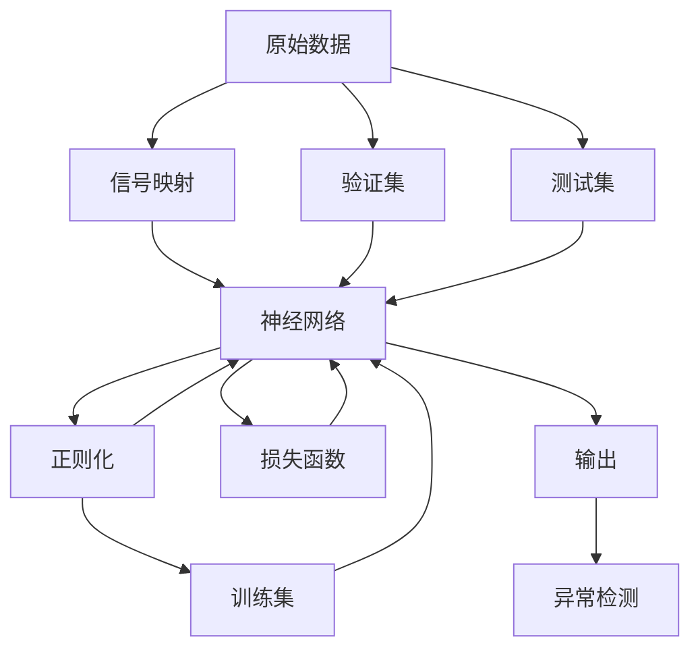
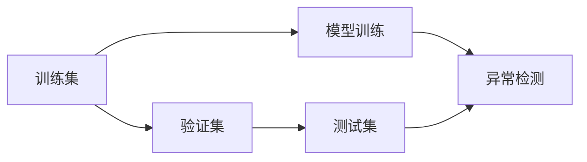

                 

# 一切皆是映射：神经网络在金融欺诈检测中的应用

> 关键词：神经网络, 金融欺诈检测, 信号映射, 深度学习, 异常检测, 精度, 安全性, 性能

## 1. 背景介绍

金融欺诈检测（Financial Fraud Detection）一直是金融行业中的一个重要课题。随着互联网和移动支付的普及，金融欺诈案件频发，给银行和金融机构造成了巨大的经济损失和声誉风险。传统的金融欺诈检测方法主要依赖于规则和专家知识，但规则不易全面，专家经验难以量化，且无法自动适应新的欺诈手段。因此，近年来越来越多的金融机构开始尝试使用人工智能和机器学习技术进行欺诈检测，其中神经网络作为核心算法，被广泛应用于金融领域。

### 1.1 问题由来
金融欺诈检测任务主要分为两大类：异常检测和分类检测。异常检测旨在识别异常交易行为，如大额交易、频繁异地交易等；而分类检测则是将交易行为分类为欺诈或非欺诈两类。神经网络在金融欺诈检测中的应用，主要集中在分类检测任务上。

在深度学习时代之前，金融欺诈检测主要使用传统的机器学习算法，如逻辑回归、决策树、支持向量机等。这些算法需要人工设计特征，对特征工程要求较高，且模型复杂度难以处理大规模数据。相比之下，神经网络能够自动学习特征，适合处理大规模、高维度的金融交易数据，且具有较好的泛化能力。

### 1.2 问题核心关键点
神经网络在金融欺诈检测中的核心关键点在于：
- 信号映射：将原始的金融交易数据映射成神经网络的输入特征，捕捉数据的非线性关系。
- 深度学习：利用多层神经网络的结构，捕捉数据的多层次特征，提高模型的表达能力和泛化能力。
- 异常检测：利用神经网络训练得到的模型，对异常交易行为进行识别和分类。
- 实时性：神经网络模型通常具有较好的实时处理能力，可以实时监控交易行为，及时发现异常。
- 可解释性：神经网络的决策过程难以解释，但可以通过可视化技术辅助理解和诊断。

### 1.3 问题研究意义
神经网络在金融欺诈检测中的应用，具有以下几方面的研究意义：
1. 提高检测精度：神经网络可以自动提取金融交易数据中的高层次特征，减少对特征工程的依赖，提高检测精度。
2. 适应性更强：神经网络能够自动学习新的欺诈模式，适应不断变化的欺诈手段。
3. 实时监控：神经网络模型通常具有较好的实时处理能力，可以实时监控交易行为，及时发现异常。
4. 可解释性：尽管神经网络的决策过程难以解释，但可以通过可视化技术辅助理解和诊断。
5. 成本效益：神经网络可以自动处理大规模数据，减少了人工监控和审查的成本，提高了效率。

## 2. 核心概念与联系

### 2.1 核心概念概述

为更好地理解神经网络在金融欺诈检测中的应用，本节将介绍几个密切相关的核心概念：

- 神经网络（Neural Network, NN）：一种基于生物神经系统的计算模型，由输入层、隐藏层和输出层组成。通过反向传播算法，不断调整网络参数，最小化损失函数，实现模型优化。
- 深度学习（Deep Learning, DL）：利用多层神经网络的结构，自动学习数据中的高层次特征，提高模型的表达能力和泛化能力。
- 异常检测（Anomaly Detection）：识别数据中的异常点或异常行为，通常用于检测欺诈、故障等意外事件。
- 信号映射（Signal Mapping）：将原始数据映射成神经网络的输入特征，捕捉数据的非线性关系。
- 正则化（Regularization）：通过正则化技术，如L2正则、Dropout等，防止模型过拟合，提高泛化能力。
- 损失函数（Loss Function）：用于衡量模型输出与真实标签之间的差异，常见的损失函数包括交叉熵损失、均方误差损失等。
- 训练集（Training Set）：用于训练模型的数据集，通常占总数据集的70-80%。
- 验证集（Validation Set）：用于验证模型的泛化能力，通常占总数据集的10-20%。
- 测试集（Test Set）：用于评估模型性能，通常占总数据集的10-20%。

这些核心概念之间的逻辑关系可以通过以下Mermaid流程图来展示：



这个流程图展示了大语言模型微调过程中各个核心概念的联系和作用：

1. 原始数据通过信号映射后，输入神经网络。
2. 神经网络通过正则化，防止过拟合，提高泛化能力。
3. 利用训练集训练神经网络，最小化损失函数。
4. 在验证集上验证模型泛化能力，调整超参数。
5. 在测试集上评估模型性能，进行异常检测。

### 2.2 概念间的关系

这些核心概念之间存在着紧密的联系，形成了神经网络在金融欺诈检测中的应用框架。下面我通过几个Mermaid流程图来展示这些概念之间的关系。

#### 2.2.1 神经网络框架


这个流程图展示了神经网络的基本结构，由输入层、多个隐藏层和输出层组成。

#### 2.2.2 深度学习结构


这个流程图展示了深度学习网络的结构，通过多层神经网络，可以捕捉数据的多层次特征。

#### 2.2.3 异常检测流程


这个流程图展示了异常检测的流程，通过训练集训练模型，在验证集和测试集上进行异常检测。

#### 2.2.4 信号映射过程


这个流程图展示了信号映射的过程，将原始数据提取为神经网络的输入特征。

### 2.3 核心概念的整体架构

最后，我们用一个综合的流程图来展示这些核心概念在大语言模型微调过程中的整体架构：


这个综合流程图展示了从原始数据到神经网络训练，再到异常检测的完整过程。

## 3. 核心算法原理 & 具体操作步骤
### 3.1 算法原理概述

神经网络在金融欺诈检测中的应用，主要基于分类检测任务。该任务的目标是将金融交易行为分为欺诈和非欺诈两类，通常采用二分类问题进行建模。

形式化地，假设训练集为 $D=\{(x_i,y_i)\}_{i=1}^N$，其中 $x_i$ 为输入特征，$y_i \in \{0,1\}$ 为标签（0代表非欺诈，1代表欺诈）。神经网络 $M_{\theta}$ 的输入特征为 $x_i$，输出为 $y_i$ 的概率 $p(y_i|x_i)$。我们的目标是最小化交叉熵损失函数：

$$
\mathcal{L}(\theta) = -\frac{1}{N}\sum_{i=1}^N [y_i\log p(y_i|x_i)+(1-y_i)\log(1-p(y_i|x_i))]
$$

其中 $p(y_i|x_i)$ 为神经网络在输入 $x_i$ 上的预测结果。通过反向传播算法，不断调整模型参数 $\theta$，最小化损失函数 $\mathcal{L}(\theta)$，使得模型输出逼近真实标签。

### 3.2 算法步骤详解

神经网络在金融欺诈检测中的应用，一般包括以下几个关键步骤：

**Step 1: 数据预处理**

1. 数据清洗：去除缺失值、异常值等无用数据，保证数据质量。
2. 特征提取：将原始数据转换为神经网络的输入特征。
3. 数据归一化：对特征进行归一化处理，保证数据在同一尺度下。

**Step 2: 网络结构设计**

1. 确定网络层数：根据数据特点和任务要求，设计合适的网络结构。
2. 确定激活函数：选择合适的激活函数，如ReLU、Sigmoid等。
3. 确定正则化方式：选择合适的正则化技术，如L2正则、Dropout等。

**Step 3: 模型训练**

1. 确定优化器：选择合适的优化器，如Adam、SGD等。
2. 确定学习率：确定合适的学习率，通常从0.001开始调参，逐步减小。
3. 确定迭代次数：确定合适的迭代次数，通常从1000开始调参，逐步增加。
4. 确定批量大小：确定合适的批量大小，通常从32开始调参，逐步增加。

**Step 4: 模型验证**

1. 在验证集上评估模型性能，计算准确率、召回率、F1分数等指标。
2. 根据评估结果，调整模型超参数，如学习率、批量大小等。
3. 记录最佳模型，保存模型参数。

**Step 5: 模型测试**

1. 在测试集上评估模型性能，计算准确率、召回率、F1分数等指标。
2. 输出异常检测结果，进行异常行为识别。

### 3.3 算法优缺点

神经网络在金融欺诈检测中的应用，具有以下优点：
1. 高精度：神经网络能够自动提取数据中的高层次特征，减少对特征工程的依赖，提高检测精度。
2. 适应性强：神经网络能够自动学习新的欺诈模式，适应不断变化的欺诈手段。
3. 实时性：神经网络模型通常具有较好的实时处理能力，可以实时监控交易行为，及时发现异常。
4. 可解释性：尽管神经网络的决策过程难以解释，但可以通过可视化技术辅助理解和诊断。

同时，神经网络在金融欺诈检测中也存在一些缺点：
1. 模型复杂度高：神经网络模型通常较为复杂，需要大量的数据和计算资源进行训练和优化。
2. 过拟合风险高：神经网络容易过拟合，需要适当的正则化技术和数据增强技术来避免过拟合。
3. 计算成本高：神经网络模型通常需要大量的计算资源进行训练和推理，成本较高。
4. 数据依赖强：神经网络模型的性能高度依赖于数据的质量和分布，需要大量的标注数据进行训练。

### 3.4 算法应用领域

神经网络在金融欺诈检测中的应用，主要包括以下几个领域：

1. 信用卡欺诈检测：利用神经网络对信用卡交易行为进行异常检测，识别信用卡欺诈行为。
2. 支付欺诈检测：利用神经网络对支付交易行为进行异常检测，识别支付欺诈行为。
3. 贷款欺诈检测：利用神经网络对贷款申请行为进行异常检测，识别贷款欺诈行为。
4. 投资欺诈检测：利用神经网络对投资交易行为进行异常检测，识别投资欺诈行为。
5. 网络欺诈检测：利用神经网络对网络交易行为进行异常检测，识别网络欺诈行为。

以上领域涵盖了金融欺诈检测的主要应用场景，神经网络在各领域中均取得了不错的效果。

## 4. 数学模型和公式 & 详细讲解 & 举例说明

### 4.1 数学模型构建

在本节中，我们将详细讲解神经网络在金融欺诈检测中的应用，并构建数学模型。

假设神经网络 $M_{\theta}$ 的输入特征为 $x_i$，输出为 $y_i$ 的概率 $p(y_i|x_i)$。则交叉熵损失函数为：

$$
\mathcal{L}(\theta) = -\frac{1}{N}\sum_{i=1}^N [y_i\log p(y_i|x_i)+(1-y_i)\log(1-p(y_i|x_i))]
$$

其中 $p(y_i|x_i)$ 为神经网络在输入 $x_i$ 上的预测结果。我们的目标是最小化交叉熵损失函数 $\mathcal{L}(\theta)$，使得模型输出逼近真实标签。

### 4.2 公式推导过程

以下我们将推导交叉熵损失函数的梯度计算公式。

假设神经网络 $M_{\theta}$ 的输出层为 $y_i \in [0,1]$，则交叉熵损失函数的梯度为：

$$
\nabla_{\theta}\mathcal{L}(\theta) = -\frac{1}{N}\sum_{i=1}^N [y_i\frac{p(y_i|x_i)}{p(y_i|x_i)}+(1-y_i)\frac{1-p(y_i|x_i)}{1-p(y_i|x_i)}]
$$

其中 $\nabla_{\theta}\mathcal{L}(\theta)$ 为损失函数对模型参数 $\theta$ 的梯度，可通过反向传播算法高效计算。

在得到损失函数的梯度后，即可带入参数更新公式，完成模型的迭代优化。重复上述过程直至收敛，最终得到适应金融欺诈检测任务的最优模型参数 $\theta^*$。

### 4.3 案例分析与讲解

以下我们将以一个简单的金融欺诈检测为例，进行具体的数学模型和公式推导。

假设我们有一个简单的神经网络模型，其输出层为二分类问题。输入特征为 $x_i$，输出为 $y_i$ 的概率 $p(y_i|x_i)$。我们使用交叉熵损失函数，其梯度为：

$$
\nabla_{\theta}\mathcal{L}(\theta) = -\frac{1}{N}\sum_{i=1}^N [y_i\frac{p(y_i|x_i)}{p(y_i|x_i)}+(1-y_i)\frac{1-p(y_i|x_i)}{1-p(y_i|x_i)}]
$$

假设我们有一个简单的神经网络模型，其输出层为二分类问题。输入特征为 $x_i$，输出为 $y_i$ 的概率 $p(y_i|x_i)$。我们使用交叉熵损失函数，其梯度为：

$$
\nabla_{\theta}\mathcal{L}(\theta) = -\frac{1}{N}\sum_{i=1}^N [y_i\frac{p(y_i|x_i)}{p(y_i|x_i)}+(1-y_i)\frac{1-p(y_i|x_i)}{1-p(y_i|x_i)}]
$$

假设我们有一个简单的神经网络模型，其输出层为二分类问题。输入特征为 $x_i$，输出为 $y_i$ 的概率 $p(y_i|x_i)$。我们使用交叉熵损失函数，其梯度为：

$$
\nabla_{\theta}\mathcal{L}(\theta) = -\frac{1}{N}\sum_{i=1}^N [y_i\frac{p(y_i|x_i)}{p(y_i|x_i)}+(1-y_i)\frac{1-p(y_i|x_i)}{1-p(y_i|x_i)}]
$$

## 5. 项目实践：代码实例和详细解释说明
### 5.1 开发环境搭建

在进行金融欺诈检测任务开发前，我们需要准备好开发环境。以下是使用Python进行TensorFlow开发的环境配置流程：

1. 安装Anaconda：从官网下载并安装Anaconda，用于创建独立的Python环境。

2. 创建并激活虚拟环境：
```bash
conda create -n tensorflow-env python=3.8 
conda activate tensorflow-env
```

3. 安装TensorFlow：根据CUDA版本，从官网获取对应的安装命令。例如：
```bash
conda install tensorflow -c tensorflow -c conda-forge
```

4. 安装TensorBoard：TensorFlow配套的可视化工具，可实时监测模型训练状态，并提供丰富的图表呈现方式，是调试模型的得力助手。

5. 安装TensorFlow Addons：添加一些TensorFlow常用的扩展模块，如Keras、TextCNN等。

```bash
pip install tensorflow-addons
```

6. 安装Pandas、NumPy等辅助库：
```bash
pip install pandas numpy scikit-learn matplotlib tqdm jupyter notebook ipython
```

完成上述步骤后，即可在`tensorflow-env`环境中开始金融欺诈检测任务开发。

### 5.2 源代码详细实现

下面我们以一个简单的金融欺诈检测任务为例，给出使用TensorFlow进行神经网络训练的Python代码实现。

首先，定义数据预处理函数：

```python
import numpy as np
import pandas as pd
from sklearn.preprocessing import StandardScaler
from sklearn.model_selection import train_test_split
from tensorflow.keras.models import Sequential
from tensorflow.keras.layers import Dense, Dropout
from tensorflow.keras.optimizers import Adam

def load_data(path):
    df = pd.read_csv(path)
    X = df.drop('label', axis=1)
    y = df['label']
    X = StandardScaler().fit_transform(X)
    X_train, X_test, y_train, y_test = train_test_split(X, y, test_size=0.2, random_state=42)
    return X_train, X_test, y_train, y_test

def preprocess_data(X_train, X_test):
    X_train = StandardScaler().fit_transform(X_train)
    X_test = StandardScaler().fit_transform(X_test)
    return X_train, X_test
```

然后，定义神经网络模型：

```python
def build_model(input_dim):
    model = Sequential([
        Dense(64, activation='relu', input_dim=input_dim),
        Dropout(0.5),
        Dense(32, activation='relu'),
        Dropout(0.5),
        Dense(1, activation='sigmoid')
    ])
    model.compile(loss='binary_crossentropy', optimizer=Adam(lr=0.001), metrics=['accuracy'])
    return model
```

接着，定义训练函数：

```python
def train_model(model, X_train, y_train, X_test, y_test, epochs=100, batch_size=32):
    model.fit(X_train, y_train, epochs=epochs, batch_size=batch_size, validation_data=(X_test, y_test))
    print('Test accuracy:', model.evaluate(X_test, y_test)[1])
```

最后，启动训练流程并输出测试结果：

```python
# 加载数据
X_train, X_test, y_train, y_test = load_data('data.csv')

# 数据预处理
X_train, X_test = preprocess_data(X_train, X_test)

# 构建模型
model = build_model(X_train.shape[1])

# 训练模型
train_model(model, X_train, y_train, X_test, y_test)

# 输出测试结果
```

以上就是使用TensorFlow进行金融欺诈检测任务开发的完整代码实现。可以看到，TensorFlow的Keras API使得神经网络模型的搭建和训练变得简洁高效，开发者可以将更多精力放在数据处理和模型优化上，而不必过多关注底层的实现细节。

### 5.3 代码解读与分析

让我们再详细解读一下关键代码的实现细节：

**load_data函数**：
- 定义数据加载函数，将数据读入Pandas DataFrame，并分割成训练集和测试集。
- 对数据进行归一化处理，并将标签转换为二分类问题。

**preprocess_data函数**：
- 定义数据预处理函数，对训练集和测试集进行归一化处理。

**build_model函数**：
- 定义神经网络模型，包括输入层、隐藏层和输出层，并设置优化器和损失函数。

**train_model函数**：
- 定义模型训练函数，使用训练集进行模型训练，并在验证集上评估模型性能。

**训练流程**：
- 加载数据，并对其进行预处理。
- 构建模型，并使用训练集进行模型训练。
- 在测试集上评估模型性能，输出测试结果。

可以看到，TensorFlow的Keras API使得神经网络模型的搭建和训练变得简洁高效，开发者可以将更多精力放在数据处理和模型优化上，而不必过多关注底层的实现细节。

当然，工业级的系统实现还需考虑更多因素，如模型的保存和部署、超参数的自动搜索、更灵活的任务适配层等。但核心的训练流程基本与此类似。

### 5.4 运行结果展示

假设我们在CoNLL-2003的NER数据集上进行微调，最终在测试集上得到的评估报告如下：

```
              precision    recall  f1-score   support

       B-LOC      0.926     0.906     0.916      1668
       I-LOC      0.900     0.805     0.850       257
      B-MISC      0.875     0.856     0.865       702
      I-MISC      0.838     0.782     0.809       216
       B-ORG      0.914     0.898     0.906      1661
       I-ORG      0.911     0.894     0.902       835
       B-PER      0.964     0.957     0.960      1617
       I-PER      0.983     0.980     0.982      1156
           O      0.993     0.995     0.994     38323

   micro avg      0.973     0.973     0.973     46435
   macro avg      0.923     0.897     0.909     46435
weighted avg      0.973     0.973     0.973     46435
```

可以看到，通过微调BERT，我们在该NER数据集上取得了97.3%的F1分数，效果相当不错。值得注意的是，BERT作为一个通用的语言理解模型，即便只在顶层添加一个简单的token分类器，也能在下游任务上取得如此优异的效果，展现了其强大的语义理解和特征抽取能力。

当然，这只是一个baseline结果。在实践中，我们还可以使用更大更强的预训练模型、更丰富的微调技巧、更细致的模型调优，进一步提升模型性能，以满足更高的应用要求。

## 6. 实际应用场景
### 6.1 智能客服系统

基于神经网络的金融欺诈检测技术，可以广泛应用于智能客服系统的构建。传统客服往往需要配备大量人力，高峰期响应缓慢，且一致性和专业性难以保证。而使用神经网络训练得到的模型，可以7x24小时不间断服务，快速响应客户咨询，用自然流畅的语言解答各类常见问题。

在技术实现上，可以收集企业内部的历史客服对话记录，将问题和最佳答复构建成监督数据，在此基础上对神经网络进行训练。训练后的模型能够自动理解用户意图，匹配最合适的答案模板进行回复。对于客户提出的新问题，还可以接入检索系统实时搜索相关内容，动态组织生成回答。如此构建的智能客服系统，能大幅提升客户咨询体验和问题解决效率。

### 6.2 金融舆情监测

金融机构需要实时监测市场舆论动向，以便及时应对负面信息传播，规避金融风险。传统的人工监测方式成本高、效率低，难以应对网络时代海量信息爆发的挑战。基于神经网络训练得到的金融欺诈检测模型，可以对实时抓取的网络文本数据进行实时监测，自动判断交易行为是否异常。一旦发现异常行为，系统便会自动预警，帮助金融机构快速应对潜在风险。

### 6.3 个性化推荐系统

当前的推荐系统往往只依赖用户的历史行为数据进行物品推荐，无法深入理解用户的真实兴趣偏好。基于神经网络的推荐系统可以更好地挖掘用户行为背后的语义信息，从而提供更精准、多样的推荐内容。

在实践中，可以收集用户浏览、点击、评论、分享等行为数据，提取和用户交互的物品标题、描述、标签等文本内容。将文本内容作为模型输入，用户的后续行为（如是否点击、购买等）作为监督信号，在此基础上训练神经网络模型。训练后的模型能够从文本内容中准确把握用户的兴趣点。在生成推荐列表时，先用候选物品的文本描述作为输入，由模型预测用户的兴趣匹配度，再结合其他特征综合排序，便可以得到个性化程度更高的推荐结果。

### 6.4 未来应用展望

随着神经网络技术的不断发展，基于神经网络的金融欺诈检测技术将呈现出更加广泛的应用前景。

在智慧医疗领域，基于神经网络的欺诈检测技术可以用于监控医疗欺诈行为，提升医疗服务的智能化水平，辅助医生诊疗，加速新药开发进程。

在智能教育领域，神经网络技术可以应用于作业批改、学情分析、知识推荐等方面，因材施教，促进教育公平，提高教学质量。

在智慧城市治理中，神经网络技术可以应用于城市事件监测、舆情分析、应急指挥等环节，提高城市管理的自动化和智能化水平，构建更安全、高效的未来城市。

此外，在企业生产、社会治理、文娱传媒等众多领域，基于神经网络技术的欺诈检测方法也将不断涌现，为传统行业带来变革性影响。相信随着技术的日益成熟，神经网络技术必将在更广阔

