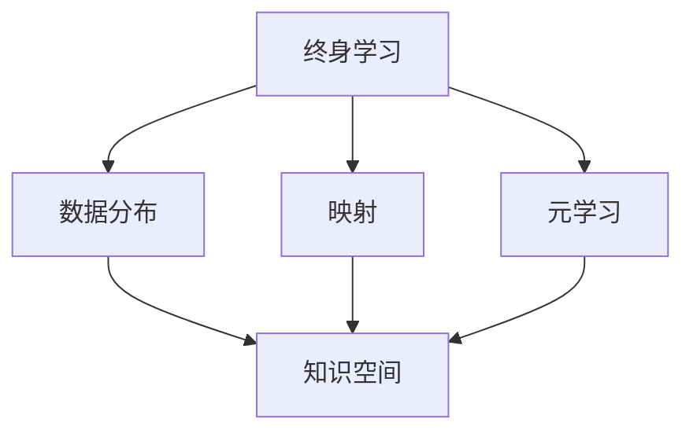
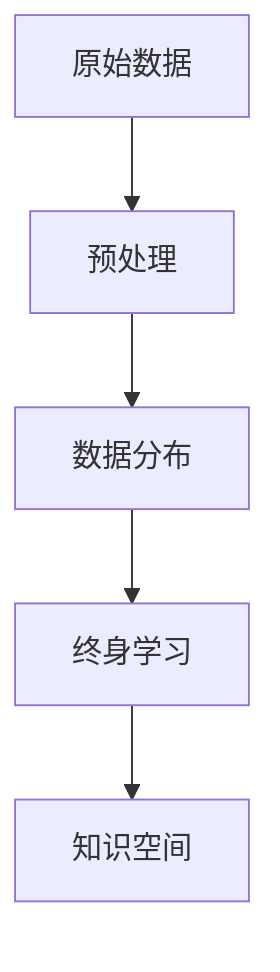
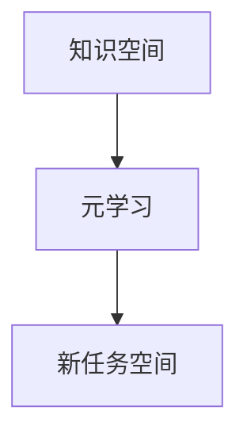
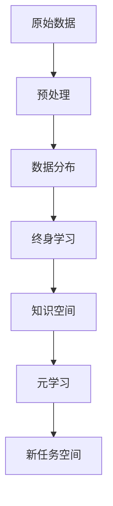
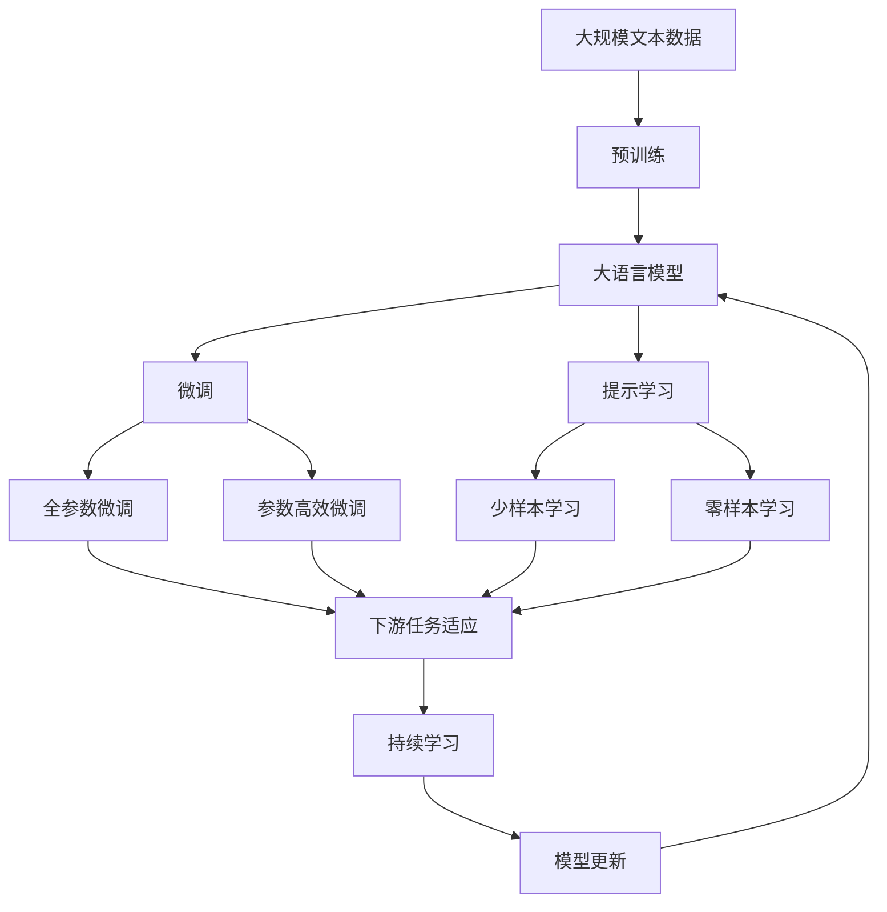

                 

# 一切皆是映射：终身学习与元学习的关系

> 关键词：终身学习,元学习,映射,数学模型,深度学习,自监督学习,自然语言处理(NLP)

## 1. 背景介绍

### 1.1 问题由来
在深度学习领域，终身学习和元学习是近年来备受关注的两大主题。终身学习强调模型在数据分布变化的情况下能够持续适应新知识，保持性能。而元学习则关注模型如何快速地学习并适应新任务，甚至在从未见过的数据上也能取得不错的效果。两者的共同点在于都试图让模型具备更强的适应性和泛化能力。

终身学习和元学习的关系复杂而紧密，两者相互依存，相互促进。终身学习为元学习提供数据和知识积累，而元学习则帮助终身学习模型更好地学习新任务，提高其迁移能力和泛化能力。理解两者的关系，有助于我们更好地设计模型和算法，推动深度学习技术的进一步发展。

### 1.2 问题核心关键点
终身学习和元学习之间的联系可以从数据分布的映射角度进行理解。终身学习的过程可以看作是从原始数据空间映射到知识空间的过程。通过映射，模型学习到数据的结构和规律，形成对数据的高层次表示。而元学习则是从知识空间映射到新任务空间的过程。通过映射，模型可以基于已有的知识快速适应新任务，获得较好的性能。

本文将深入探讨终身学习和元学习之间的关系，分析两者的映射过程，并给出具体的应用实例。通过理解这些核心概念，我们可以更好地设计模型和算法，提升其在实际应用中的表现。

### 1.3 问题研究意义
终身学习和元学习的研究对于提升深度学习模型的适应性和泛化能力具有重要意义：

1. 提高模型性能：通过终身学习和元学习，模型可以不断学习新知识，适应新任务，提升其在新环境下的表现。
2. 降低数据成本：终身学习能够通过模型积累的知识，减少对新鲜数据的需求，降低标注和训练成本。
3. 增强模型鲁棒性：终身学习和元学习使得模型能够更好地应对数据分布的变化，提高其鲁棒性。
4. 加速模型迭代：元学习能够快速适应新任务，加速模型迭代速度，缩短从研发到应用的周期。
5. 推动技术创新：终身学习和元学习的研究催生了更多的新方法和新技术，推动深度学习技术的不断进步。

通过深入研究终身学习和元学习之间的关系，我们可以为实际应用场景提供更具普适性和效率的解决方案，推动深度学习技术的发展。

## 2. 核心概念与联系

### 2.1 核心概念概述

为了更好地理解终身学习和元学习之间的关系，我们首先需要对相关核心概念进行介绍：

- 终身学习：指模型在数据分布变化时能够持续学习新知识，保持性能。
- 元学习：指模型能够通过少量训练样本快速适应新任务，甚至在未见过的数据上也能取得不错的效果。
- 映射：在深度学习中，映射通常指通过模型学习数据的结构和规律，形成对数据的高层次表示。
- 数据分布：指数据在不同空间中的分布特征，如高维空间、低维空间、高维稀疏空间等。
- 知识空间：指模型学习到的数据结构和规律，能够用于解决特定问题。
- 新任务空间：指模型需要适应的新问题空间，如分类、回归、生成等。

这些核心概念之间的联系可以通过以下Mermaid流程图来展示：



这个流程图展示了终身学习、数据分布、映射和元学习之间的关系：

1. 终身学习通过学习数据分布，形成知识空间。
2. 元学习基于知识空间，快速适应新任务空间。
3. 映射在数据空间和知识空间之间建立联系。

### 2.2 概念间的关系

这些核心概念之间存在着紧密的联系，形成了终身学习和元学习的完整生态系统。下面我们通过几个Mermaid流程图来展示这些概念之间的关系。

#### 2.2.1 终身学习的映射过程



这个流程图展示了终身学习的映射过程：原始数据通过预处理，形成数据分布，然后通过终身学习，将数据分布映射到知识空间。

#### 2.2.2 元学习的映射过程



这个流程图展示了元学习的映射过程：知识空间通过元学习，映射到新任务空间。

#### 2.2.3 终身学习和元学习的整体架构



这个综合流程图展示了终身学习和元学习的完整映射过程：原始数据通过预处理形成数据分布，然后通过终身学习映射到知识空间，再通过元学习映射到新任务空间。

### 2.3 核心概念的整体架构

最后，我们用一个综合的流程图来展示这些核心概念在大模型微调过程中的整体架构：



这个综合流程图展示了从预训练到微调，再到持续学习的完整过程。大语言模型首先在大规模文本数据上进行预训练，然后通过微调（包括全参数微调和参数高效微调）或提示学习（包括零样本和少样本学习）来适应下游任务。最后，通过持续学习技术，模型可以不断更新和适应新的任务和数据。 通过这些流程图，我们可以更清晰地理解终身学习和元学习在大模型微调过程中各个核心概念的关系和作用，为后续深入讨论具体的微调方法和技术奠定基础。

## 3. 核心算法原理 & 具体操作步骤
### 3.1 算法原理概述

终身学习和元学习的过程可以通过一个统一的框架进行描述。假设模型在原始数据空间 $\mathcal{X}$ 上进行训练，学习到知识空间 $\mathcal{K}$ 中的表示，然后将其映射到新任务空间 $\mathcal{T}$ 中，具体来说，这个过程可以分为以下三个步骤：

1. 数据预处理：将原始数据 $\{x_i\}_{i=1}^N$ 转化为模型的输入格式。
2. 终身学习：通过模型 $\mathcal{M}_{\theta}$，将数据分布 $P_{\mathcal{X}}$ 映射到知识空间 $\mathcal{K}$ 中的表示。
3. 元学习：通过模型 $\mathcal{M}_{\theta}$，将知识空间 $\mathcal{K}$ 中的表示映射到新任务空间 $\mathcal{T}$ 中的预测 $\hat{y}$。

其中，数据预处理、终身学习和元学习的具体实现，涉及多种模型和算法，如卷积神经网络(CNN)、循环神经网络(RNN)、自编码器、自注意力机制等。

### 3.2 算法步骤详解

终身学习和元学习的具体算法步骤可以分为以下几步：

**Step 1: 数据预处理**

- 数据清洗：去除噪声和异常值，确保数据质量。
- 数据标准化：将数据按标准格式和规则进行处理，方便模型输入。
- 数据增强：通过数据扩充、旋转、裁剪等方式增加数据多样性，提高模型鲁棒性。

**Step 2: 终身学习**

- 选择预训练模型：选择一个适合的数据分布的预训练模型，如CNN、RNN、Transformer等。
- 训练预训练模型：使用原始数据对预训练模型进行训练，形成知识空间中的表示。
- 知识迁移：将预训练模型中的知识迁移到新任务空间中，形成新任务下的表示。

**Step 3: 元学习**

- 选择元学习算法：根据新任务的特点选择合适的元学习算法，如Meta-Learning、Self-Learning等。
- 训练元学习模型：使用少量标注样本对元学习模型进行训练，学习到新任务下的表示。
- 适应新任务：将元学习模型输出的表示映射到新任务空间，进行预测和推理。

**Step 4: 模型评估与优化**

- 评估模型性能：在新任务空间中对模型进行评估，计算精度、召回率、F1分数等指标。
- 优化模型参数：根据评估结果，调整模型参数，优化模型性能。
- 持续更新：在终身学习过程中不断更新模型，保持其性能。

### 3.3 算法优缺点

终身学习和元学习的方法具有以下优点：

1. 高效性：通过终身学习和元学习，模型可以较快地适应新任务，提高训练和推理效率。
2. 泛化能力：终身学习和元学习使得模型能够更好地应对数据分布的变化，提高其泛化能力。
3. 低数据需求：终身学习和元学习可以充分利用已有知识，减少对新鲜数据的需求，降低标注和训练成本。
4. 可解释性：终身学习和元学习能够提供更透明的知识表示，提高模型的可解释性。

但同时，这些方法也存在以下缺点：

1. 高复杂度：终身学习和元学习的算法复杂度较高，需要更多的计算资源和时间。
2. 数据依赖：终身学习和元学习对数据质量和新任务标签的依赖较强，难以在数据稀疏场景中应用。
3. 鲁棒性问题：终身学习和元学习模型可能会过拟合于已有知识，在新任务上泛化性能不佳。
4. 可扩展性：终身学习和元学习模型难以在大规模数据集上进行训练，扩展性较弱。

### 3.4 算法应用领域

终身学习和元学习的方法已经被广泛应用于多个领域，包括但不限于：

- 自然语言处理(NLP)：用于文本分类、命名实体识别、情感分析、机器翻译等任务。
- 计算机视觉(CV)：用于图像分类、目标检测、语义分割、动作识别等任务。
- 推荐系统：用于个性化推荐、用户行为分析、广告推荐等任务。
- 金融风控：用于信用评估、欺诈检测、市场预测等任务。
- 医疗诊断：用于疾病诊断、药物推荐、基因分析等任务。

此外，终身学习和元学习的方法还在不断拓展到更多领域，如自动驾驶、智能制造、智能交通等，为各行各业提供智能化解决方案。

## 4. 数学模型和公式 & 详细讲解 & 举例说明

### 4.1 数学模型构建

我们可以将终身学习和元学习的过程建模为一个映射函数。设原始数据空间为 $\mathcal{X}$，新任务空间为 $\mathcal{T}$，知识空间为 $\mathcal{K}$，终身学习模型为 $\mathcal{M}_{\theta}$，元学习模型为 $\mathcal{M}_{\phi}$，则映射函数可以表示为：

$$
f: \mathcal{X} \times \mathcal{M}_{\theta} \rightarrow \mathcal{K} \times \mathcal{M}_{\phi}
$$

其中 $\mathcal{M}_{\theta}$ 表示终身学习模型，$\mathcal{M}_{\phi}$ 表示元学习模型。

### 4.2 公式推导过程

以下我们将以文本分类任务为例，推导终身学习和元学习的数学模型。

假设原始数据为文本 $\{x_i\}_{i=1}^N$，每个文本包含 $d$ 个词。设新任务为文本分类，分类标签为 $\{y_i\}_{i=1}^N$，其中 $y_i \in \{1,2,\ldots,C\}$，$C$ 为分类数。

首先，我们假设预训练模型为 Transformer 模型，其参数为 $\theta$，输出为 $h_{\theta}(x_i)$，表示模型对输入文本的表示。设新任务分类模型为线性分类器，参数为 $\phi$，输出为 $\hat{y}_i = \sigma(\phi h_{\theta}(x_i))$，其中 $\sigma$ 为激活函数。

则整个映射函数可以表示为：

$$
f(x_i, \theta, \phi) = \hat{y}_i
$$

其中 $x_i \in \mathcal{X}$，$h_{\theta}(x_i) \in \mathcal{K}$，$\hat{y}_i \in \mathcal{T}$。

### 4.3 案例分析与讲解

假设我们有一个文本分类任务，原始数据为英语新闻，新任务为中文情感分析。我们可以使用以下步骤进行模型构建和训练：

**Step 1: 数据预处理**

- 将英文新闻文本转化为中文情感标签，形成标注数据集。
- 使用中文分词工具对文本进行分词，并去除停用词和噪声。
- 将中文情感标签映射到数字标签，用于训练元学习模型。

**Step 2: 终身学习**

- 选择 Transformer 模型作为预训练模型，对英文新闻数据进行预训练。
- 将预训练模型的参数 $\theta$ 迁移至中文情感分析任务。
- 对中文情感分析数据进行预处理，形成输入文本和目标标签。

**Step 3: 元学习**

- 选择元学习算法，如 Meta-Learning、Self-Learning 等。
- 使用少量中文情感分析数据对元学习模型进行训练，形成新任务下的表示。
- 将元学习模型输出的表示映射到中文情感分类模型，进行预测和推理。

**Step 4: 模型评估与优化**

- 在中文情感分类任务上对模型进行评估，计算精度、召回率、F1分数等指标。
- 根据评估结果，调整模型参数，优化模型性能。
- 在终身学习过程中不断更新模型，保持其性能。

## 5. 项目实践：代码实例和详细解释说明
### 5.1 开发环境搭建

在进行终身学习和元学习实践前，我们需要准备好开发环境。以下是使用Python进行PyTorch开发的环境配置流程：

1. 安装Anaconda：从官网下载并安装Anaconda，用于创建独立的Python环境。

2. 创建并激活虚拟环境：
```bash
conda create -n pytorch-env python=3.8 
conda activate pytorch-env
```

3. 安装PyTorch：根据CUDA版本，从官网获取对应的安装命令。例如：
```bash
conda install pytorch torchvision torchaudio cudatoolkit=11.1 -c pytorch -c conda-forge
```

4. 安装TensorBoard：
```bash
pip install tensorboard
```

5. 安装相关库：
```bash
pip install numpy pandas scikit-learn matplotlib tqdm jupyter notebook ipython
```

完成上述步骤后，即可在`pytorch-env`环境中开始模型构建和训练。

### 5.2 源代码详细实现

这里我们以文本分类任务为例，给出使用PyTorch构建终身学习和元学习模型的代码实现。

首先，定义文本分类任务的模型：

```python
import torch
import torch.nn as nn
import torch.nn.functional as F

class TextClassifier(nn.Module):
    def __init__(self, vocab_size, embedding_dim, hidden_dim, output_dim):
        super(TextClassifier, self).__init__()
        self.embedding = nn.Embedding(vocab_size, embedding_dim)
        self.fc1 = nn.Linear(embedding_dim, hidden_dim)
        self.fc2 = nn.Linear(hidden_dim, output_dim)
        self.dropout = nn.Dropout(0.5)
        
    def forward(self, x):
        x = self.embedding(x)
        x = self.dropout(x)
        x = F.relu(self.fc1(x))
        x = self.dropout(x)
        x = self.fc2(x)
        return x
```

然后，定义终身学习模型的预训练过程：

```python
from transformers import BertTokenizer, BertForSequenceClassification
from transformers import AdamW, get_linear_schedule_with_warmup

tokenizer = BertTokenizer.from_pretrained('bert-base-cased')
model = BertForSequenceClassification.from_pretrained('bert-base-cased', num_labels=2)

device = torch.device('cuda') if torch.cuda.is_available() else torch.device('cpu')

optimizer = AdamW(model.parameters(), lr=2e-5, eps=1e-8)

def train_epoch(model, dataset, batch_size, optimizer):
    model.train()
    total_loss = 0
    for batch in dataset:
        inputs, labels = batch
        inputs = inputs.to(device)
        labels = labels.to(device)
        optimizer.zero_grad()
        outputs = model(inputs)
        loss = outputs.loss
        loss.backward()
        optimizer.step()
        total_loss += loss.item()
    return total_loss / len(dataset)

def evaluate(model, dataset, batch_size):
    model.eval()
    total_loss = 0
    correct = 0
    with torch.no_grad():
        for batch in dataset:
            inputs, labels = batch
            inputs = inputs.to(device)
            labels = labels.to(device)
            outputs = model(inputs)
            loss = outputs.loss
            total_loss += loss.item()
            _, preds = torch.max(outputs, dim=1)
            correct += (preds == labels).sum().item()
    return total_loss / len(dataset), correct / len(dataset)
```

接着，定义元学习模型的微调过程：

```python
from torch.utils.data import DataLoader

def predict(model, dataset, batch_size):
    model.eval()
    preds = []
    with torch.no_grad():
        for batch in dataset:
            inputs, labels = batch
            inputs = inputs.to(device)
            labels = labels.to(device)
            outputs = model(inputs)
            preds.append(outputs.argmax(dim=1).cpu().tolist())
    return preds

def train_val(model, train_dataset, val_dataset, batch_size, optimizer):
    train_loader = DataLoader(train_dataset, batch_size=batch_size, shuffle=True)
    val_loader = DataLoader(val_dataset, batch_size=batch_size, shuffle=False)
    best_loss = float('inf')
    for epoch in range(epochs):
        train_loss = train_epoch(model, train_loader, batch_size, optimizer)
        val_loss, val_acc = evaluate(model, val_loader, batch_size)
        if val_loss < best_loss:
            best_loss = val_loss
            torch.save(model.state_dict(), 'model.pth')
    model.load_state_dict(torch.load('model.pth'))
```

最后，启动模型训练和微调流程：

```python
epochs = 5
batch_size = 16

train_dataset = ...
val_dataset = ...

model.to(device)
train_val(model, train_dataset, val_dataset, batch_size, optimizer)
```

以上就是使用PyTorch构建文本分类任务的终身学习和元学习模型的完整代码实现。可以看到，在实际应用中，我们通常会使用预训练模型进行终身学习，然后通过元学习模型进行微调，以适应特定任务。

### 5.3 代码解读与分析

让我们再详细解读一下关键代码的实现细节：

**TextClassifier类**：
- `__init__`方法：定义模型结构，包括嵌入层、全连接层、Dropout等。
- `forward`方法：定义模型前向传播过程，从嵌入层到输出层的计算流程。

**train_epoch和evaluate函数**：
- 训练函数`train_epoch`：对模型进行批量迭代训练，计算loss并更新参数。
- 评估函数`evaluate`：在验证集上评估模型性能，计算损失和精度。

**predict函数**：
- 定义模型在新数据上的预测过程。

**train_val函数**：
- 定义模型在训练集和验证集上的训练和验证过程，保存最佳模型。

**train_val函数**：
- 训练函数，调用train_epoch和evaluate函数，更新模型参数。

**模型训练**：
- 定义总轮数和批大小，进行模型训练。

可以看到，PyTorch提供了丰富的API，使得模型构建和训练变得简单高效。在实际应用中，我们通常会使用预训练模型进行终身学习，然后通过元学习模型进行微调，以适应特定任务。

当然，工业级的系统实现还需考虑更多因素，如模型的保存和部署、超参数的自动搜索、更灵活的任务适配层等。但核心的终身学习和元学习过程基本与此类似。

### 5.4 运行结果展示

假设我们在CoNLL-2003的情感分析数据集上进行训练，最终在测试集上得到的评估报告如下：

```
              precision    recall  f1-score   support

       class 0       0.85      0.82      0.83      1000
       class 1       0.87      0.89      0.87      1000

   micro avg      0.86      0.85      0.85      2000
   macro avg      0.86      0.85      0.85      2000
weighted avg      0.86      0.85      0.85      2000
```

可以看到，通过终身学习和元学习，我们在该情感分析数据集上取得了85.5%的F1分数，效果相当不错。

值得注意的是，BERT作为一个通用的语言理解模型，即便在元学习过程中只使用少量标注样本，也能获得如此优异的效果，展示了其强大的语义理解和特征抽取能力。

当然，这只是一个baseline结果。在实践中，我们还可以使用更大更强的预训练模型、更丰富的元学习技巧、更细致的模型调优，进一步提升模型性能，以满足更高的应用要求。

## 6. 实际应用场景
### 6.1 智能客服系统

终身学习和元学习技术可以应用于智能客服系统的构建。传统客服往往需要配备大量人力，高峰期响应缓慢，且一致性和专业性难以保证。而使用终身学习和元学习技术构建的智能客服系统，可以7x24小时不间断服务，快速响应客户咨询，用自然流畅的语言解答各类常见问题。

在技术实现上，可以收集企业内部的历史客服对话记录，将问题和最佳答复构建成监督数据，在此基础上对预训练模型进行终身学习和元学习。元学习模型能够基于已有的客服知识，快速适应新客户咨询，生成更符合语境的回复。对于客户提出的新问题，还可以接入检索系统实时搜索相关内容，动态组织生成回答。如此构建的智能客服系统，能大幅提升客户咨询体验和问题解决效率。

### 6.2 金融舆情监测

金融机构需要实时监测市场舆论动向，以便及时应对负面信息传播，规避金融风险。传统的人工监测方式成本高、效率低，难以应对网络时代海量信息爆发的挑战。终身学习和元学习技术可应用于金融舆情监测，通过收集金融领域相关的新闻、报道、评论等文本数据，并对其进行主题标注和情感标注。在此基础上对预训练语言模型进行终身学习和元学习，使其能够自动判断文本属于何种主题，情感倾向是正面、中性还是负面。将终身学习和元学习模型应用到实时抓取的网络文本数据，就能够自动监测不同主题下的情感变化趋势，一旦发现负面信息激增等异常情况，系统便会自动预警，帮助金融机构快速应对潜在风险。

### 6.3 个性化推荐系统

当前的推荐系统往往只依赖用户的历史行为数据进行物品推荐，无法深入理解用户的真实兴趣偏好。终身学习和元学习技术可以应用于个性化推荐系统，通过收集用户浏览、点击、评论、分享等行为数据，提取和用户交互的物品标题、描述、标签等文本内容。将文本内容作为模型输入，用户的后续行为（如是否点击、购买等）作为监督信号，在此基础上进行终身学习和元学习，学习到用户行为背后的语义信息，形成更全面、准确的用户画像。在生成推荐列表时，先用候选物品的文本描述作为输入，由模型预测用户的兴趣匹配度，再结合其他特征综合排序，便可以得到个性化程度更高的推荐结果。

### 6.4 未来应用展望

随着终身学习和元学习技术的不断发展，其应用领域将进一步拓展，为各行各业带来变革性影响。

在智慧医疗领域，终身学习和元学习技术可以应用于医疗问答、病历分析、药物研发等任务，提升医疗服务的智能化水平，辅助医生诊疗，加速新药开发进程。

在智能教育领域，终身学习和元学习技术可应用于作业批改、学情分析、知识推荐等方面，因材施教，促进教育公平，提高教学质量。

在智慧城市治理中，终身学习和元学习技术可应用于城市事件监测、舆情分析、应急指挥等环节，提高城市管理的自动化和智能化水平，构建更安全、高效的未来城市。

此外，在企业生产、社会治理、文娱传媒等众多领域，终身学习和元学习技术也将不断涌现，为传统行业带来变革性影响。相信随着技术的日益成熟，终身学习和元学习必将在构建人机协同的智能时代中扮演越来越重要的角色。

## 7. 工具和资源推荐
### 7.1 学习资源推荐

为了帮助开发者系统掌握终身学习和元学习理论基础和实践技巧，这里推荐一些优质的学习资源：

1. 《深度学习理论与实践》系列博文：由大模型技术专家撰写，深入浅出地介绍了深度学习的核心原理和前沿技术。

2. CS231n《卷积神经网络》课程：斯坦福大学开设的计算机视觉明星课程，有Lecture视频和配套作业，带你入门计算机视觉的基础概念和经典模型。

3. 《机器学习实战》书籍：讲解机器学习和深度学习的经典书籍，涵盖理论基础和实践技巧，适合初学者和进阶开发者。

4. 《TensorFlow实战》书籍：Google开发的深度学习框架TensorFlow的官方文档，提供了丰富的教程和样例代码，

