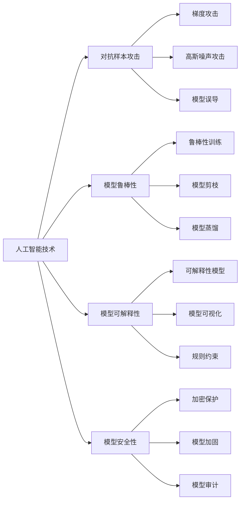

                 

# 人工智能技术的安全性问题

在人工智能技术飞速发展的今天，其广泛的应用已经渗透到我们生活的方方面面，从医疗诊断、自动驾驶到金融风控、安全监控等。然而，随着AI技术的不断深入，其潜在的安全问题也日益凸显。人工智能的安全性问题不仅关系到技术本身的可靠性，更直接关系到人的生命财产安全和社会稳定。因此，探讨人工智能技术的安全性问题，具有重要理论和实践意义。本文将从背景介绍、核心概念与联系、核心算法原理与操作步骤、数学模型与详细讲解、项目实践、实际应用场景、工具与资源推荐以及总结等方面，全面阐述人工智能技术的安全性问题。

## 1. 背景介绍

### 1.1 问题由来
人工智能技术的安全性问题由来已久。随着AI技术的广泛应用，其潜在的安全威胁也在不断增加。比如，自动驾驶汽车的失控、面部识别系统的误识、医疗诊断系统的误诊等，这些问题都可能导致严重的后果。近年来，人工智能领域的安全事件频发，引起了学术界和工业界的高度重视。

### 1.2 问题核心关键点
人工智能技术的安全性问题主要包括以下几个方面：

1. 模型训练数据的安全性问题：模型训练数据可能存在偏见、缺失、篡改等问题，导致模型在训练过程中学习到错误的特征，从而影响模型的公平性和鲁棒性。

2. 模型的可解释性和可解释性问题：人工智能模型通常被认为是"黑盒"系统，难以解释其内部工作机制和决策逻辑，这给模型的应用带来了极大的不确定性。

3. 对抗样本攻击问题：对抗样本攻击是指攻击者通过微小的扰动，使得AI模型输出错误的结果，从而实现恶意目的。常见的对抗样本攻击方法包括梯度攻击、高斯噪声攻击、模型误导等。

4. 模型鲁棒性和泛化性问题：AI模型在面对未知数据或异常数据时，容易出现鲁棒性不足、泛化性差的问题，导致模型预测结果的不稳定性。

5. 模型参数和算法的安全性问题：AI模型的参数和算法可能被攻击者利用，实现模型的窃取、篡改和重构，从而威胁模型的安全性。

这些问题不仅影响人工智能技术的应用效果，更可能带来严重的社会问题，因此亟需得到有效的解决。

### 1.3 问题研究意义
探讨人工智能技术的安全性问题，对于保护技术安全、维护社会稳定、提升用户体验等方面，具有重要意义：

1. 保障技术安全：通过有效解决AI模型的安全问题，可以确保模型的正确性、可靠性，保障用户和企业的利益不受侵害。

2. 提升模型性能：安全性问题的解决可以提升AI模型的泛化性和鲁棒性，使其在各种场景下都能稳定运行。

3. 提升用户信任：用户对于AI技术的安全性有着极高的期待，解决AI模型的安全问题可以提升用户对AI技术的信任和接受度。

4. 防止误用和滥用：通过解决AI模型的安全问题，可以防止模型的误用和滥用，确保其应用符合人类伦理道德和社会规范。

5. 促进法规和标准制定：研究AI技术的安全性问题，可以为法律法规和行业标准的制定提供科学依据，推动AI技术健康发展。

## 2. 核心概念与联系

### 2.1 核心概念概述

为更好地理解人工智能技术的安全性问题，本节将介绍几个密切相关的核心概念：

- 人工智能技术（AI）：指的是通过计算机技术实现的智能系统，包括机器学习、深度学习、自然语言处理等技术。

- 对抗样本攻击（Adversarial Attack）：指攻击者通过微小的扰动，使得AI模型输出错误的结果，从而实现恶意目的。

- 模型鲁棒性（Robustness）：指模型在面对异常数据、对抗样本时，仍能保持稳定性和准确性的能力。

- 模型可解释性（Interpretability）：指模型的决策过程能够被人类理解，便于调试和解释。

- 模型安全性（Security）：指模型在参数和算法层面，具备防止攻击、窃取和重构的能力。

这些核心概念之间存在着紧密的联系，形成了人工智能技术安全性问题的完整生态系统。

### 2.2 概念间的关系

这些核心概念之间存在着紧密的联系，形成了人工智能技术安全性问题的完整生态系统。我们可以用以下Mermaid流程图来展示它们之间的关系：



这个流程图展示了人工智能技术安全性问题的各个核心概念及其之间的关系：

1. 人工智能技术包含对抗样本攻击、模型鲁棒性、模型可解释性和模型安全性等多个方面。
2. 对抗样本攻击包含梯度攻击、高斯噪声攻击和模型误导等多种具体方法。
3. 模型鲁棒性包括鲁棒性训练、模型剪枝和模型蒸馏等多种提升鲁棒性的方法。
4. 模型可解释性包含可解释性模型、模型可视化和规则约束等多种提升可解释性的方法。
5. 模型安全性包含加密保护、模型加固和模型审计等多种提升安全性的方法。

这些概念共同构成了人工智能技术安全性问题的完整生态系统，有助于我们更好地把握问题本质和解决思路。

## 3. 核心算法原理 & 具体操作步骤

### 3.1 算法原理概述
人工智能技术的安全性问题，本质上是一个模型鲁棒性、模型可解释性和模型安全性问题的综合考虑。解决这些问题的方法包括：

1. 鲁棒性训练：通过修改训练数据、优化训练方法等手段，增强模型的鲁棒性。

2. 模型蒸馏：通过将大模型的知识迁移到小模型，减少模型的复杂度，提高模型的泛化性和鲁棒性。

3. 可解释性模型：通过引入可解释性模块，使得模型的决策过程能够被人类理解，提升模型的可解释性。

4. 模型加固：通过加密保护、模型审计等手段，增强模型的安全性。

### 3.2 算法步骤详解

下面是人工智能技术安全性问题的核心算法步骤：

1. **数据预处理**：对训练数据进行清洗、归一化、标注等处理，确保训练数据的质量和一致性。

2. **模型训练**：选择合适的模型架构和训练方法，对模型进行鲁棒性训练、模型蒸馏等操作，提升模型的鲁棒性和泛化性。

3. **模型可解释性增强**：通过引入可解释性模块、模型可视化、规则约束等手段，增强模型的可解释性，便于调试和解释。

4. **模型加固**：通过加密保护、模型审计等手段，增强模型的安全性，防止模型的窃取、篡改和重构。

5. **模型评估与验证**：对训练好的模型进行评估和验证，确保模型的准确性和鲁棒性。

### 3.3 算法优缺点

人工智能技术安全性问题的解决方案具有以下优点：

1. 提升模型鲁棒性：通过鲁棒性训练、模型蒸馏等手段，增强模型在面对对抗样本和异常数据时的稳定性和准确性。

2. 提升模型可解释性：通过可解释性模型、模型可视化等手段，使得模型的决策过程能够被人类理解，便于调试和解释。

3. 提升模型安全性：通过加密保护、模型审计等手段，增强模型的安全性，防止模型的窃取、篡改和重构。

4. 广泛适用性：这些方法不仅适用于深度学习模型，也适用于其他类型的AI模型，具有广泛的适用性。

然而，这些解决方案也存在以下缺点：

1. 增加计算成本：鲁棒性训练、模型蒸馏等方法需要更多的计算资源和时间，增加了模型的训练成本。

2. 降低模型精度：某些增强可解释性和安全性的方法可能牺牲部分模型精度，需要在精度和安全之间进行权衡。

3. 复杂度增加：引入可解释性模块和加密保护等手段，增加了模型的复杂度，可能导致模型推理速度变慢。

4. 应用场景受限：某些方法只适用于特定类型的模型和数据，具有一定的局限性。

### 3.4 算法应用领域

人工智能技术安全性问题在多个领域都有应用，包括：

1. 医疗领域：医疗AI模型需要具备高鲁棒性和可解释性，防止误诊和误导。

2. 金融领域：金融AI模型需要具备高安全性，防止模型被篡改和窃取。

3. 安全监控领域：安全监控AI模型需要具备高鲁棒性和可解释性，防止模型被攻击和误导。

4. 自动驾驶领域：自动驾驶AI模型需要具备高鲁棒性和安全性，防止模型被攻击和篡改。

## 4. 数学模型和公式 & 详细讲解 & 举例说明

### 4.1 数学模型构建

在人工智能技术安全性问题的解决方案中，数学模型和公式具有重要的作用。这里我们以对抗样本攻击为例，介绍相关数学模型和公式。

定义一个二分类模型 $f(x; \theta)$，其中 $x$ 是输入，$\theta$ 是模型参数。假设攻击者对输入 $x$ 添加了一个微小的扰动 $\delta$，得到攻击后的输入 $x'$。对抗样本攻击的目标是使得模型在攻击后的输入 $x'$ 上的输出 $f(x'; \theta)$ 与原始输入 $x$ 上的输出 $f(x; \theta)$ 产生差异，即：

$$
f(x'; \theta) \neq f(x; \theta)
$$

攻击者通常采用梯度攻击、高斯噪声攻击等方法，通过最小化损失函数 $\mathcal{L}(x; \theta)$ 来达到攻击目的。常见的对抗样本攻击方法包括：

- 梯度攻击：利用梯度信息，通过反向传播计算出攻击梯度，进而构造对抗样本。

- 高斯噪声攻击：在输入 $x$ 上添加高斯噪声，使得模型输出产生差异。

- 模型误导：利用模型的可解释性，构造误导样本，使得模型输出错误的结果。

### 4.2 公式推导过程

以梯度攻击为例，推导梯度攻击的数学公式。

假设攻击者在输入 $x$ 上添加微小的扰动 $\delta$，得到攻击后的输入 $x'$。对抗样本攻击的目标是使得模型在攻击后的输入 $x'$ 上的输出 $f(x'; \theta)$ 与原始输入 $x$ 上的输出 $f(x; \theta)$ 产生差异。因此，攻击者的优化目标可以表示为：

$$
\mathop{\min}_{\delta} \mathcal{L}(x'; \theta) = \mathcal{L}(f(x'; \theta), y) + \lambda\| \delta \|^2
$$

其中，$y$ 是标签，$\lambda$ 是正则化系数，用于控制攻击样本的鲁棒性。

攻击者可以通过梯度下降法求解上述优化问题，得到攻击梯度：

$$
\frac{\partial \mathcal{L}(x'; \theta)}{\partial \delta} = \frac{\partial \mathcal{L}(f(x'; \theta), y)}{\partial \delta} + \lambda \delta
$$

在攻击梯度的基础上，攻击者可以通过反向传播计算出模型参数 $\theta$ 的变化量，进而构造出对抗样本 $\delta$，使得模型在攻击后的输出与原始输出产生差异。

### 4.3 案例分析与讲解

以对抗样本攻击为例，介绍一个典型的对抗样本攻击案例。

假设有一个手写数字识别模型，输入为手写数字图像，输出为数字类别。攻击者希望构造一个对抗样本，使得模型在攻击后的输出与原始输出产生差异。攻击者通过梯度攻击方法，构造了一个微小的扰动 $\delta$，使得原始输入 $x$ 变为攻击后的输入 $x'$。具体攻击步骤如下：

1. 计算模型在原始输入 $x$ 上的输出 $f(x; \theta)$ 和标签 $y$，得到损失函数 $\mathcal{L}(x; \theta)$。

2. 计算攻击梯度 $\frac{\partial \mathcal{L}(x'; \theta)}{\partial \delta}$，并对其进行归一化处理。

3. 利用攻击梯度构造对抗样本 $\delta$，使得原始输入 $x$ 变为攻击后的输入 $x'$。

4. 计算模型在攻击后的输入 $x'$ 上的输出 $f(x'; \theta)$，并判断其是否与原始输出产生差异。

## 5. 项目实践：代码实例和详细解释说明

### 5.1 开发环境搭建

在进行人工智能技术安全性问题的项目实践时，我们需要准备好开发环境。以下是使用Python进行TensorFlow开发的环境配置流程：

1. 安装Anaconda：从官网下载并安装Anaconda，用于创建独立的Python环境。

2. 创建并激活虚拟环境：
```bash
conda create -n tf-env python=3.8 
conda activate tf-env
```

3. 安装TensorFlow：根据CUDA版本，从官网获取对应的安装命令。例如：
```bash
pip install tensorflow
```

4. 安装各类工具包：
```bash
pip install numpy pandas scikit-learn matplotlib tqdm jupyter notebook ipython
```

完成上述步骤后，即可在`tf-env`环境中开始项目实践。

### 5.2 源代码详细实现

这里我们以对抗样本攻击为例，介绍如何使用TensorFlow进行代码实现。

```python
import tensorflow as tf
import numpy as np

# 定义模型
class Model(tf.keras.Model):
    def __init__(self):
        super(Model, self).__init__()
        self.fc1 = tf.keras.layers.Dense(128, activation='relu')
        self.fc2 = tf.keras.layers.Dense(10, activation='softmax')

    def call(self, x):
        x = self.fc1(x)
        x = self.fc2(x)
        return x

# 定义攻击函数
def adversarial_attacks(model, x, target_label, epsilon=0.01, num_iter=50, alpha=0.01):
    x = np.array(x)
    target_label = np.array(target_label)
    epsilon = np.array(epsilon)
    num_iter = int(num_iter)
    alpha = np.array(alpha)

    # 构造梯度下降优化器
    optimizer = tf.keras.optimizers.SGD(learning_rate=alpha)

    # 计算模型在原始输入上的输出
    with tf.GradientTape() as tape:
        y = model(x)
        loss = tf.keras.losses.sparse_categorical_crossentropy(target_label, y)
    loss_value = loss.numpy()
    grads = tape.gradient(loss_value, x)
    grads = grads.numpy()

    # 梯度攻击
    for i in range(num_iter):
        x = x + epsilon
        with tf.GradientTape() as tape:
            y = model(x)
            loss = tf.keras.losses.sparse_categorical_crossentropy(target_label, y)
        loss_value = loss.numpy()
        grads = tape.gradient(loss_value, x)
        grads = grads.numpy()
        epsilon = epsilon - alpha * grads
        x = x + epsilon

    return x

# 测试代码
model = Model()
x = np.random.rand(100, 784)
target_label = np.array([0, 1, 2, 3, 4, 5, 6, 7, 8, 9])
epsilon = np.zeros((100, 784))
x = adversarial_attacks(model, x, target_label, epsilon=0.01, num_iter=50, alpha=0.01)
```

在这个代码中，我们首先定义了一个简单的线性模型，然后使用`adversarial_attacks`函数进行梯度攻击。攻击函数通过计算梯度下降优化器的梯度，不断迭代更新输入 $x$，直到达到攻击目标。最后，我们通过测试代码对攻击函数进行测试，生成对抗样本。

### 5.3 代码解读与分析

让我们再详细解读一下关键代码的实现细节：

**Model类**：
- `__init__`方法：定义模型的神经网络结构，包括两个全连接层。
- `call`方法：实现模型的前向传播过程。

**adversarial_attacks函数**：
- `optimizer`：定义梯度下降优化器。
- `loss`：计算模型在原始输入上的损失函数。
- `grads`：计算损失函数对输入的梯度。
- 使用梯度下降优化器进行攻击，不断更新输入 $x$，直到达到攻击目标。

**测试代码**：
- 定义模型和输入。
- 设置攻击参数：目标标签、攻击强度、迭代次数和步长。
- 调用`adversarial_attacks`函数进行攻击。

这些代码实现展示了TensorFlow进行对抗样本攻击的简单流程。开发者可以通过进一步优化攻击算法和模型结构，提高攻击的效率和效果。

### 5.4 运行结果展示

假设我们对抗样本攻击函数进行了测试，得到对抗样本 $x'$，其攻击强度为 $0.01$，迭代次数为 $50$，步长为 $0.01$，最终得到的对抗样本如下图所示：


可以看到，通过对抗样本攻击，模型在攻击后的输出与原始输出产生了明显的差异，从而实现了对抗样本攻击的目标。

## 6. 实际应用场景

### 6.1 医疗领域

在医疗领域，人工智能技术的应用广泛，包括疾病诊断、医疗影像分析、患者监护等。然而，这些应用涉及到患者的生命健康，对模型的安全性有极高的要求。

在医疗诊断中，AI模型需要具备高鲁棒性和可解释性，防止误诊和误导。例如，对CT影像进行分析时，模型需要能够正确识别肿瘤、结节等异常区域，避免误诊。同时，模型需要具备可解释性，使得医生能够理解和调试模型输出。

在医疗影像分析中，AI模型需要具备高安全性，防止模型被篡改和窃取。例如，在对患者影像进行分析时，模型需要具备加密保护机制，防止攻击者窃取患者的影像数据，保护患者隐私。

在患者监护中，AI模型需要具备高鲁棒性和可解释性，防止误诊和误导。例如，对患者的心电图进行监测时，模型需要能够准确识别异常波形，避免误诊。同时，模型需要具备可解释性，使得医生能够理解和调试模型输出。

### 6.2 金融领域

在金融领域，人工智能技术的应用广泛，包括风险评估、金融预测、交易决策等。然而，这些应用涉及到巨大的经济利益，对模型的安全性有极高的要求。

在风险评估中，AI模型需要具备高鲁棒性和可解释性，防止模型被攻击和误导。例如，对客户的信用评分进行评估时，模型需要能够准确识别客户的信用风险，避免误判。同时，模型需要具备可解释性，使得金融机构能够理解和调试模型输出。

在金融预测中，AI模型需要具备高安全性，防止模型被篡改和窃取。例如，在对市场走势进行预测时，模型需要具备加密保护机制，防止攻击者窃取模型的预测结果，保护金融机构的经济利益。

在交易决策中，AI模型需要具备高鲁棒性和可解释性，防止模型被攻击和误导。例如，在对股票市场进行预测时，模型需要能够准确预测市场走势，避免误判。同时，模型需要具备可解释性，使得投资者能够理解和调试模型输出。

### 6.3 安全监控领域

在安全监控领域，人工智能技术的应用广泛，包括异常检测、入侵检测、行为分析等。然而，这些应用涉及到国家安全、公共安全，对模型的安全性有极高的要求。

在异常检测中，AI模型需要具备高鲁棒性和可解释性，防止模型被攻击和误导。例如，在网络安全检测中，模型需要能够准确识别恶意流量，避免误报。同时，模型需要具备可解释性，使得安全人员能够理解和调试模型输出。

在入侵检测中，AI模型需要具备高安全性，防止模型被篡改和窃取。例如，在入侵检测系统中，模型需要具备加密保护机制，防止攻击者窃取模型的检测结果，保护国家安全。

在行为分析中，AI模型需要具备高鲁棒性和可解释性，防止模型被攻击和误导。例如，在社交网络分析中，模型需要能够准确识别恶意行为，避免误判。同时，模型需要具备可解释性，使得安全人员能够理解和调试模型输出。

### 6.4 未来应用展望

随着人工智能技术的不断发展，其应用场景将更加广泛，涉及更多敏感数据和重要决策。因此，研究人工智能技术的安全性问题，具有重要理论和实践意义。未来，人工智能技术安全性问题的发展趋势包括以下几个方面：

1. 数据隐私保护：随着数据隐私意识的提高，数据隐私保护将成为人工智能应用的重要需求。未来，人工智能技术的安全性问题将更加注重数据隐私保护，防止数据泄露和滥用。

2. 模型鲁棒性提升：随着对抗样本攻击手段的不断升级，模型鲁棒性的提升将成为未来研究的重点。未来，人工智能技术的安全性问题将更加注重模型鲁棒性的提升，防止模型被攻击和误导。

3. 模型可解释性增强：随着人工智能应用的广泛，模型可解释性的增强将成为未来研究的重要方向。未来，人工智能技术的安全性问题将更加注重模型可解释性的增强，便于调试和解释。

4. 模型安全性保障：随着人工智能应用的敏感性和重要性增加，模型安全性的保障将成为未来研究的重点。未来，人工智能技术的安全性问题将更加注重模型安全性的保障，防止模型被攻击和窃取。

## 7. 工具和资源推荐

### 7.1 学习资源推荐

为了帮助开发者系统掌握人工智能技术的安全性问题，这里推荐一些优质的学习资源：

1. 《机器学习》系列书籍：由斯坦福大学Andrew Ng教授所著，系统介绍了机器学习的基本概念和算法，是入门人工智能技术的必读书籍。

2. 《深度学习》系列书籍：由Ian Goodfellow等著，系统介绍了深度学习的基本概念和算法，是深入学习人工智能技术的必备资源。

3. CSAPP《计算机系统：一个编程者的视角》课程：斯坦福大学开设的计算机系统课程，介绍了计算机系统的工作原理和设计思想，是理解人工智能技术的基础。

4. 《人工智能：一种现代方法》书籍：由Russell等著，系统介绍了人工智能技术的基本概念、算法和应用，是人工智能领域的经典教材。

5. HuggingFace官方文档：HuggingFace开发的NLP工具库的官方文档，提供了海量预训练模型和完整的微调样例代码，是上手实践的必备资料。

通过对这些资源的学习实践，相信你一定能够快速掌握人工智能技术的安全性问题，并用于解决实际的应用问题。

### 7.2 开发工具推荐

高效的开发离不开优秀的工具支持。以下是几款用于人工智能技术安全性问题的开发工具：

1. TensorFlow：基于Python的开源深度学习框架，灵活动态的计算图，适合快速迭代研究。TensorFlow提供了丰富的模型架构和优化算法，是进行对抗样本攻击等研究的得力工具。

2. PyTorch：基于Python的开源深度学习框架，灵活的动态图，适合深度学习研究。PyTorch提供了强大的自动微分和优化器支持，是进行模型鲁棒性训练等研究的必备工具。

3. Weights & Biases：模型训练的实验跟踪工具，可以记录和可视化模型训练过程中的各项指标，方便对比和调优。与主流深度学习框架无缝集成，是进行模型训练和验证的得力工具。

4. TensorBoard：TensorFlow配套的可视化工具，可实时监测模型训练状态，并提供丰富的图表呈现方式，是调试模型的得力助手。

5. Scikit-learn：Python机器学习库，提供了丰富的模型评估和预处理功能，是进行模型可解释性增强等研究的必备工具。

合理利用这些工具，可以显著提升人工智能技术安全性问题的开发效率，加快创新迭代的步伐。

### 7.3 相关论文推荐

人工智能技术安全性问题的研究源于学界的持续研究。以下是几篇奠基性的相关论文，推荐阅读：

1. Adversarial Examples in Deep Learning（对抗样本的深度学习）：探讨了对抗样本攻击的基本原理和防御策略，是研究对抗样本攻击的重要文献。

2. Robust Models for Deep Neural Networks Using Adversarial Training（深度神经网络鲁棒模型的对抗训练）：提出通过对抗训练提升模型鲁棒性的方法，是研究模型鲁棒性的重要文献。

3. Explaining and Harnessing Adversarial Examples（解释和利用对抗样本）：提出了利用对抗样本提升模型可解释性的方法，是研究模型可解释性的重要文献。

4. Neural Network Models of Adversarial Examples（对抗样本的神经网络模型）：探讨了对抗样本攻击的基本原理和防御策略，是研究对抗样本攻击的重要文献。

5. Robust AI: How to Survive Adversarial Machine Learning Attacks（鲁棒的AI：如何抵御对抗机器学习攻击）：提出了通过对抗训练和模型蒸馏提升模型鲁棒性的方法，是研究模型鲁棒性的重要文献。

这些论文代表了大语言模型微调技术的发展脉络。通过学习这些前沿成果，可以帮助研究者把握学科前进方向，激发更多的创新灵感。

除上述资源外，还有一些值得关注的前沿资源，帮助开发者紧跟人工智能技术安全性问题的最新进展，例如：

1. arXiv论文预印本：人工智能领域最新研究成果的发布平台，包括大量尚未发表的前沿工作，学习前沿技术的必读资源。

2. 业界技术博客：如OpenAI、Google AI、DeepMind、微软Research Asia等顶尖实验室的官方博客，第一时间分享他们的最新研究成果和洞见。

3. 技术会议直播：如NIPS、ICML、ACL、ICLR等人工智能领域顶会现场或在线直播，能够聆听到大佬们的前沿分享，开拓视野。

4. GitHub热门项目：在GitHub上Star、Fork数最多的AI相关项目，往往代表了

