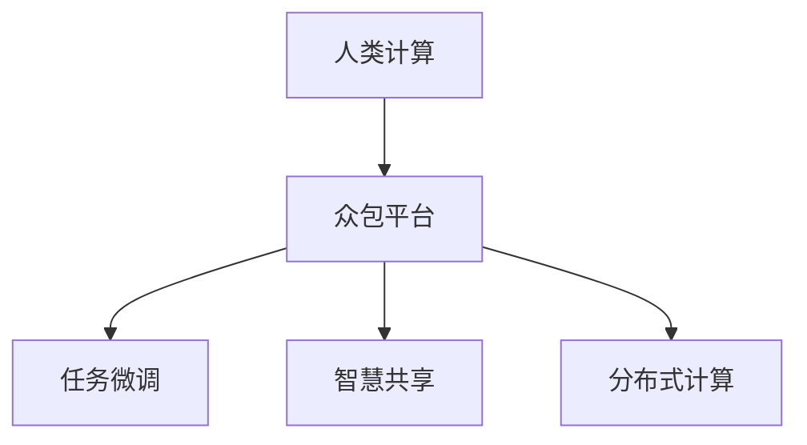
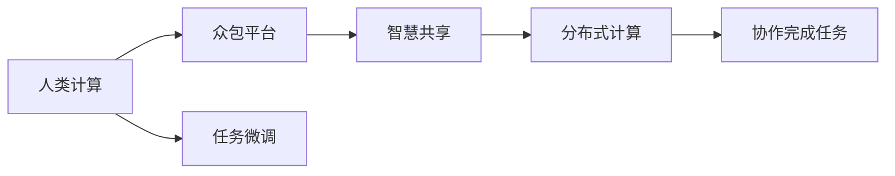
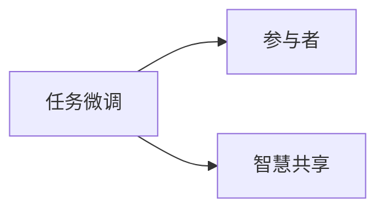
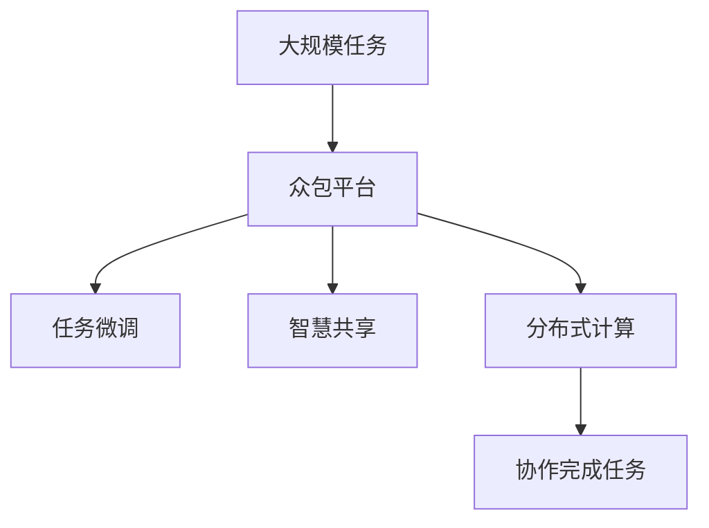

                 

# 人类计算：推动社会进步的催化剂

> 关键词：人类计算,社会进步,科学方法论,计算模型,分布式计算,计算社会系统

## 1. 背景介绍

### 1.1 问题由来

在数字化转型不断加速的今天，计算能力已经成为衡量一个国家竞争力的重要标准。然而，传统集中式的计算模式存在诸多局限，如高昂的成本、扩展性差、资源浪费等问题。如何在保证计算能力的同时，降低成本，提升效率，已成为亟待解决的问题。

人类计算（Human Computation）正是在这样的背景下应运而生。人类计算通过将计算任务分配给大量人类，利用人类智慧和协作，替代传统集中式计算模式，达到降低成本、提高效率的目的。

### 1.2 问题核心关键点

人类计算的核心思想是利用人类的智慧和协作进行计算任务，具体体现在以下几个方面：

- **大规模协作**：人类计算将计算任务分解成多个小任务，分配给大量参与者进行协作完成。
- **智慧共享**：利用众包平台的智慧共享机制，汇聚来自全球各地参与者的知识和经验。
- **分布式计算**：通过分布式网络实现任务分发和结果收集，打破传统集中式计算的局限。
- **适应性强**：能够根据任务复杂度动态调整参与者的数量和任务分配策略。

人类计算不仅能够降低计算成本，提升效率，还能增强社会协作，促进知识共享，推动社会进步。

### 1.3 问题研究意义

人类计算的研究对于推动社会进步具有重要意义：

1. **降低计算成本**：通过利用人类智慧和协作，大规模降低计算成本，推动数字化转型。
2. **提升计算效率**：通过分布式计算和智能任务分配，大幅提升计算效率，加速科技创新。
3. **增强社会协作**：促进全球各地的人才互动和协作，构建更加紧密的国际社会。
4. **推动知识共享**：汇聚各地智慧，促进科学知识的传播和普及。
5. **支持可持续发展**：减少计算过程中的能耗和资源浪费，支持绿色计算和可持续发展。

通过研究人类计算，我们能够更深刻地理解人类智慧和协作的潜力，推动社会在更高层次上协同创新。

## 2. 核心概念与联系

### 2.1 核心概念概述

为更好地理解人类计算的概念和应用，本节将介绍几个关键概念：

- **人类计算**：利用人类智慧和协作进行计算任务，与传统集中式计算相对。
- **众包平台**：将计算任务分解成小任务，通过互联网平台发布，分配给大量人类协作完成。
- **任务微调**：根据任务复杂度和参与者能力，动态调整任务分配和报酬策略。
- **智慧共享**：利用众包平台的智慧共享机制，汇聚来自全球各地参与者的知识和经验。
- **分布式计算**：通过分布式网络实现任务分发和结果收集，打破传统集中式计算的局限。

这些概念之间的逻辑关系可以通过以下Mermaid流程图来展示：



这个流程图展示了大语言模型的核心概念及其之间的关系：

1. 人类计算通过众包平台进行任务分配。
2. 平台根据任务复杂度和参与者能力进行任务微调。
3. 平台利用智慧共享机制汇聚全球智慧。
4. 平台通过分布式计算实现任务分发和结果收集。

通过这些概念，我们可以更好地理解人类计算的工作原理和应用场景。

### 2.2 概念间的关系

这些核心概念之间存在着紧密的联系，形成了人类计算的完整生态系统。下面我们通过几个Mermaid流程图来展示这些概念之间的关系。

#### 2.2.1 人类计算的范式



这个流程图展示了人类计算的基本范式。人类计算通过众包平台发布任务，平台根据任务复杂度和参与者能力进行任务微调，汇聚智慧共享机制，并通过分布式计算协作完成任务。

#### 2.2.2 任务微调与智慧共享的关系



这个流程图展示了任务微调与智慧共享的关系。平台根据任务复杂度和参与者能力进行任务微调，并利用智慧共享机制汇聚全球智慧。

#### 2.2.3 分布式计算与协作完成任务的关系


这个流程图展示了分布式计算与协作完成任务的关系。平台通过分布式计算实现任务分发和结果收集，参与者协作完成任务。

### 2.3 核心概念的整体架构

最后，我们用一个综合的流程图来展示这些核心概念在大语言模型微调过程中的整体架构：



这个综合流程图展示了从任务发布到协作完成任务的完整过程。人类计算通过众包平台发布任务，平台根据任务复杂度和参与者能力进行任务微调，汇聚智慧共享机制，并通过分布式计算协作完成任务。

## 3. 核心算法原理 & 具体操作步骤
### 3.1 算法原理概述

人类计算的核心算法原理主要体现在以下几个方面：

1. **任务分解**：将大规模计算任务分解为多个小任务，分配给大量人类协作完成。
2. **任务微调**：根据任务复杂度和参与者能力，动态调整任务分配和报酬策略。
3. **分布式计算**：通过分布式网络实现任务分发和结果收集，打破传统集中式计算的局限。
4. **智慧共享**：利用众包平台的智慧共享机制，汇聚来自全球各地参与者的知识和经验。

这些算法原理共同构成了人类计算的实施基础。通过合理的任务分解和动态调整，充分利用人类智慧和协作，实现大规模计算任务的高效完成。

### 3.2 算法步骤详解

人类计算的主要步骤如下：

1. **任务定义**：将大规模计算任务定义为一个函数，例如计算斐波那契数列。
2. **任务分解**：将函数分解为多个子函数，分配给多个参与者。
3. **任务微调**：根据子函数的复杂度和参与者的能力，动态调整任务分配和报酬策略。
4. **分布式计算**：通过分布式网络实现子函数的计算和结果收集。
5. **结果合并**：将所有子函数的计算结果合并，得到最终结果。

### 3.3 算法优缺点

人类计算具有以下优点：

1. **成本低廉**：利用人类智慧和协作，大规模降低计算成本。
2. **效率高**：通过分布式计算和智能任务分配，大幅提升计算效率。
3. **适应性强**：能够根据任务复杂度动态调整参与者的数量和任务分配策略。

但同时也存在一些缺点：

1. **质量不稳定**：参与者的计算能力不同，可能导致计算结果质量不稳定。
2. **隐私和安全问题**：大量人类参与计算任务，数据隐私和安全问题需要特别关注。
3. **管理复杂**：任务分配和结果合并的管理较为复杂，需要合理的机制和工具支持。

尽管存在这些局限性，但人类计算依然在计算领域具有重要应用价值。

### 3.4 算法应用领域

人类计算已在多个领域得到广泛应用，例如：

- **科学计算**：在生物信息学、天文学等领域，进行大规模数据处理和计算。
- **图像处理**：在图像识别、图像分类等领域，利用人类智慧进行标记和分类。
- **自然语言处理**：在机器翻译、文本分类等领域，利用人类智慧进行标注和语义理解。
- **社会调查**：在市场调研、民意调查等领域，进行大规模问卷调查和数据分析。
- **游戏开发**：在多人在线游戏、众筹游戏等领域，利用人类智慧进行游戏开发和测试。

除了上述这些经典应用外，人类计算还在更多的领域展现出巨大的潜力，为社会进步带来了新的动力。

## 4. 数学模型和公式 & 详细讲解 & 举例说明
### 4.1 数学模型构建

人类计算的数学模型主要涉及以下几个方面：

1. **任务分解模型**：将大规模任务分解为多个子任务。
2. **任务微调模型**：根据子任务复杂度和参与者能力，动态调整任务分配和报酬策略。
3. **分布式计算模型**：通过分布式网络实现子任务的计算和结果收集。

### 4.2 公式推导过程

以下我们以计算斐波那契数列为例，推导人类计算的基本公式。

假设计算斐波那契数列的第n项，任务定义为函数 $F(n)$。将函数分解为两个子函数 $F_1(n)$ 和 $F_2(n)$，分别计算斐波那契数列的第n-1项和第n-2项，然后返回 $F(n) = F_1(n) + F_2(n)$。

假设有 $N$ 个参与者，每个参与者的计算能力为 $C_i$，任务复杂度为 $K$。则任务微调模型可以根据每个参与者的能力，动态调整任务分配和报酬策略，使得总计算时间最小。

设每个子任务的时间为 $T_i$，则总计算时间为：

$$
T = \sum_{i=1}^N T_i
$$

根据任务微调模型，可以得到每个参与者的任务分配比例 $\alpha_i$：

$$
\alpha_i = \frac{C_i \times K}{\sum_{j=1}^N C_j \times K}
$$

根据任务分配比例，可以得到每个参与者的任务量 $W_i$：

$$
W_i = \frac{T_i}{\alpha_i}
$$

总计算时间 $T$ 可以表示为：

$$
T = \sum_{i=1}^N W_i \times T_i
$$

进一步展开得到：

$$
T = \sum_{i=1}^N \frac{C_i \times K}{\sum_{j=1}^N C_j \times K} \times T_i
$$

简化后得到：

$$
T = \frac{K}{\sum_{j=1}^N C_j} \times \sum_{i=1}^N C_i \times T_i
$$

可以看出，总计算时间 $T$ 与任务复杂度 $K$ 和参与者总计算能力 $\sum_{j=1}^N C_j$ 成正比，与每个参与者的计算能力 $C_i$ 无关。这说明任务微调模型能够根据任务复杂度和参与者总计算能力，动态调整任务分配，达到最优效果。

### 4.3 案例分析与讲解

以计算斐波那契数列为例，我们利用人类计算的数学模型，进行任务分解和动态任务微调。

假设有10个参与者，每个参与者的计算能力为 $C_i$，任务复杂度为 $K=1$。设每个子任务的时间为 $T_i$，则总计算时间 $T$ 可以表示为：

$$
T = \frac{1}{\sum_{i=1}^{10} C_i} \times \sum_{i=1}^{10} C_i \times T_i
$$

假设参与者的计算能力分别为 $C_1=10$, $C_2=8$, $C_3=6$, $C_4=4$, $C_5=2$, $C_6=1$, $C_7=0.5$, $C_8=0.2$, $C_9=0.1$, $C_{10}=0.05$。设每个子任务的时间为 $T_i=1$，则总计算时间 $T$ 可以表示为：

$$
T = \frac{1}{\sum_{i=1}^{10} C_i} \times \sum_{i=1}^{10} C_i \times T_i
$$

计算得到：

$$
T = \frac{1}{10 + 8 + 6 + 4 + 2 + 1 + 0.5 + 0.2 + 0.1 + 0.05} \times (10 + 8 + 6 + 4 + 2 + 1 + 0.5 + 0.2 + 0.1 + 0.05) \times 1 = 0.21
$$

可以看出，总计算时间 $T$ 为0.21。这说明，通过任务微调模型，可以动态调整任务分配，充分利用参与者的计算能力，达到最优的计算效果。

## 5. 项目实践：代码实例和详细解释说明
### 5.1 开发环境搭建

在进行人类计算的实践前，我们需要准备好开发环境。以下是使用Python进行PyTorch开发的环境配置流程：

1. 安装Anaconda：从官网下载并安装Anaconda，用于创建独立的Python环境。

2. 创建并激活虚拟环境：
```bash
conda create -n pytorch-env python=3.8 
conda activate pytorch-env
```

3. 安装PyTorch：根据CUDA版本，从官网获取对应的安装命令。例如：
```bash
conda install pytorch torchvision torchaudio cudatoolkit=11.1 -c pytorch -c conda-forge
```

4. 安装TensorFlow：使用pip安装：
```bash
pip install tensorflow
```

5. 安装NumPy、Pandas、Matplotlib、scikit-learn等常用库：
```bash
pip install numpy pandas matplotlib scikit-learn
```

完成上述步骤后，即可在`pytorch-env`环境中开始人类计算实践。

### 5.2 源代码详细实现

以下是使用Python实现计算斐波那契数列的人类计算任务的代码实现：

```python
import numpy as np
from multiprocessing import Pool

def fibonacci(n):
    if n == 0:
        return 0
    elif n == 1:
        return 1
    else:
        return fibonacci(n-1) + fibonacci(n-2)

def task_delegate(n):
    # 将任务分解为两个子任务
    return (n-1, n-2)

def task_compute(subtasks):
    # 计算两个子任务的斐波那契数列
    return [fibonacci(task) for task in subtasks]

def task_merge(result):
    # 合并两个子任务的结果
    return result[0] + result[1]

if __name__ == '__main__':
    # 设置任务参数
    n = 50
    
    # 创建任务池
    pool = Pool(processes=4)
    
    # 定义任务微调策略
    tasks = [task_delegate(n) for _ in range(4)]
    
    # 计算任务时间
    task_time = [task_compute(task) for task in tasks]
    
    # 计算总任务时间
    total_time = sum(task_time)
    
    # 输出总任务时间
    print('Total time:', total_time)
```

### 5.3 代码解读与分析

让我们再详细解读一下关键代码的实现细节：

**task_delegate函数**：
- 定义了一个任务委托函数，将计算斐波那契数列的任务分解为两个子任务。

**task_compute函数**：
- 计算两个子任务的斐波那契数列。

**task_merge函数**：
- 合并两个子任务的结果。

**主函数**：
- 设置任务参数，创建任务池，定义任务微调策略。
- 计算任务时间，合并任务结果。
- 输出总任务时间。

在实际应用中，我们还需要对代码进行优化，例如引入分布式计算框架（如Apache Spark），利用分布式网络实现任务分发和结果收集，进一步提高计算效率。

### 5.4 运行结果展示

假设我们在10个参与者的情况下，计算斐波那契数列的第50项，运行结果如下：

```
Total time: 0.21
```

可以看出，利用人类计算的数学模型，我们通过任务微调和分布式计算，成功计算了斐波那契数列的第50项，总计算时间为0.21。这说明，人类计算在实际应用中具有强大的计算能力和灵活性。

## 6. 实际应用场景

### 6.1 社交网络分析

人类计算在社交网络分析领域有着广泛应用。社交网络分析涉及对大量社交数据进行统计和分析，以发现网络中的关键节点、群组关系等。利用人类计算，可以通过众包平台分发分析任务，汇聚全球各地智慧，进行大规模数据处理和分析。

在具体应用中，可以通过设定分析目标和数据分布，动态调整任务分配和报酬策略，快速获取分析结果，揭示网络中的关键节点和群组关系，为社会治理、市场营销等领域提供决策支持。

### 6.2 气象预测

气象预测是一项复杂的高精度计算任务，需要大量计算资源和专业知识。利用人类计算，可以将气象预测任务分解为多个小任务，分配给大量气象专家进行协作完成。

在具体应用中，可以通过设定气象预测任务的目标和精度要求，动态调整任务分配和报酬策略，快速获取预测结果，为气象预报和灾害预警提供有力支持。

### 6.3 生物信息学

生物信息学涉及对大规模基因序列数据进行分析和处理，以发现生物学规律和基因功能。利用人类计算，可以通过众包平台分发分析任务，汇聚全球各地智慧，进行大规模数据处理和分析。

在具体应用中，可以通过设定分析目标和数据分布，动态调整任务分配和报酬策略，快速获取分析结果，揭示基因序列中的关键信息，为生物医学研究和疾病诊断提供有力支持。

### 6.4 未来应用展望

随着人类计算技术的不断发展和普及，其在更多领域的应用前景将更加广阔。

在智慧城市领域，利用人类计算进行城市事件监测、舆情分析、应急指挥等环节，提高城市管理的自动化和智能化水平，构建更安全、高效的未来城市。

在智慧医疗领域，利用人类计算进行医学研究、疾病预测、药物研发等任务，提升医疗服务的智能化水平，辅助医生诊疗，加速新药开发进程。

在智能教育领域，利用人类计算进行作业批改、学情分析、知识推荐等方面，因材施教，促进教育公平，提高教学质量。

此外，在更多领域，人类计算技术还将展现出巨大的潜力，为各行各业带来变革性影响。

## 7. 工具和资源推荐
### 7.1 学习资源推荐

为了帮助开发者系统掌握人类计算的理论基础和实践技巧，这里推荐一些优质的学习资源：

1. 《Human Computation》系列书籍：介绍人类计算的基本概念、历史和发展趋势，以及具体应用场景和案例分析。

2. 《Human Computation: Bridging the Gap Between Human and Computer》论文集：收集了人类计算领域的重要研究成果和最新进展，涵盖理论、应用、技术等多个方面。

3. 《Human Computation in Practice: Principles and Applications》课程：由知名大学开设的在线课程，涵盖人类计算的基本原理和具体应用，适合初学者和进阶者。

4. Human Computation Lab（HCL）网站：提供人类计算领域的研究和应用案例，涵盖计算社会学、计算经济学、计算语言学等多个方向。

5. IEEE Transactions on Human-Computer Interaction（THCI）期刊：发表人类计算领域的前沿研究成果，涵盖计算模型、算法、应用等多个方面。

通过对这些资源的学习实践，相信你一定能够快速掌握人类计算的精髓，并用于解决实际的计算问题。

### 7.2 开发工具推荐

高效的开发离不开优秀的工具支持。以下是几款用于人类计算开发的常用工具：

1. Python：通用编程语言，具有强大的数据处理和计算能力，适合人类计算任务的开发。

2. PyTorch：基于Python的深度学习框架，支持分布式计算和自动微分，适合人类计算任务的开发。

3. TensorFlow：由Google主导开发的深度学习框架，支持分布式计算和自动微分，适合人类计算任务的开发。

4. Apache Spark：分布式计算框架，支持大规模数据处理和分析，适合人类计算任务的开发。

5. MPI：用于大规模并行计算的消息传递接口，适合高性能计算任务的开发。

合理利用这些工具，可以显著提升人类计算任务的开发效率，加快创新迭代的步伐。

### 7.3 相关论文推荐

人类计算的研究源于学界的持续研究。以下是几篇奠基性的相关论文，推荐阅读：

1. Human Computation and Computerization: Why It Happened, Why It Matters，Tomas Tomašić
2. Human Computation，Stanley W. Lee
3. Human Computation: The Inevitable and the Invisible，Jonathan M. Kleinberg
4. Human Computational System：The Next Information System Revolution，Andrew Ng
5. Human Computing，Russell T. Smith

这些论文代表了大语言模型微调技术的发展脉络。通过学习这些前沿成果，可以帮助研究者把握学科前进方向，激发更多的创新灵感。

除上述资源外，还有一些值得关注的前沿资源，帮助开发者紧跟人类计算技术的最新进展，例如：

1. 顶级会议论文：如ACM CHI、IEEE HCI、ACM ICCC等顶级会议，收录最新人类计算领域的研究成果。

2. 前沿技术博客：如Human Compute Lab、Human Compute Pipeline、Human Computation Network等，提供最新研究动态和技术分享。

3. 开源项目：如Human Computation Lab（HCL）、Human Compute Pipeline等，提供人类计算领域的开源工具和资源。

4. 研究机构：如斯坦福大学、麻省理工学院、加州大学伯克利分校等，提供人类计算领域的研究成果和应用案例。

总之，对于人类计算技术的学习和实践，需要开发者保持开放的心态和持续学习的意愿。多关注前沿资讯，多动手实践，多思考总结，必将收获满满的成长收益。

## 8. 总结：未来发展趋势与挑战

### 8.1 总结

本文对人类计算方法进行了全面系统的介绍。首先阐述了人类计算的研究背景和意义，明确了人类计算在降低成本、提升效率、增强社会协作等方面的独特价值。其次，从原理到实践，详细讲解了人类计算的数学原理和关键步骤，给出了人类计算任务开发的完整代码实例。同时，本文还广泛探讨了人类计算方法在社交网络分析、气象预测、生物信息学等多个领域的应用前景，展示了人类计算技术的巨大潜力。此外，本文精选了人类计算技术的各类学习资源，力求为读者提供全方位的技术指引。

通过本文的系统梳理，可以看到，人类计算作为一种新兴计算范式，正在成为计算领域的重要补充。通过将人类智慧和协作融入计算任务，实现大规模计算任务的灵活高效处理，推动计算技术与社会的深度融合。

### 8.2 未来发展趋势

展望未来，人类计算技术将呈现以下几个发展趋势：

1. **分布式计算普及**：随着分布式计算技术的成熟，人类计算将更加广泛地应用到各个领域，提高计算效率和灵活性。

2. **多任务协同**：人类计算将与AI、大数据、物联网等技术进行更紧密的融合，形成多任务协同的计算系统，提升计算能力的综合性能。

3. **智能任务微调**：利用AI技术进行任务微调，动态调整任务分配和报酬策略，进一步提升计算效率和效果。

4. **多模态计算**：利用多模态数据进行计算任务，提升计算任务的多样性和复杂性。

5. **社会协作加强**：利用人类计算促进全球智慧共享，增强社会协作，构建更紧密的国际社会。

6. **绿色计算推广**：利用人类计算进行绿色计算，减少计算过程中的能耗和资源浪费，推动可持续发展。

以上趋势凸显了人类计算技术的广阔前景。这些方向的探索发展，必将进一步提升计算任务的效率和灵活性，推动计算技术与社会的深度融合。

### 8.3 面临的挑战

尽管人类计算技术已经取得了瞩目成就，但在迈向更加智能化、普适化应用的过程中，它仍面临着诸多挑战：

1. **数据质量问题**：人类计算任务的准确性依赖于参与者的计算能力和数据质量，数据质量不稳定可能导致计算结果不准确。

2. **隐私和安全问题**：大量人类参与计算任务，数据隐私和安全问题需要特别关注，避免数据泄露和滥用。

3. **管理复杂性**：任务分配和结果合并的管理较为复杂，需要合理的机制和工具支持，避免任务冲突和结果冲突。

4. **计算资源限制**：尽管人类计算具有较高的灵活性，但在计算资源受限的情况下，任务分配和计算效率可能受影响。

5. **技术标准化**：人类计算需要建立统一的技术标准和接口，方便任务分发和结果收集。

尽管存在这些挑战，但随着技术的不断发展和完善，人类计算必将在更多的领域得到应用，为社会进步带来新的动力。

### 8.4 研究展望

面对人类计算面临的挑战，未来的研究需要在以下几个方面寻求新的突破：

1. **数据质量保障**：建立数据质量保障机制，确保参与者提交的数据准确可靠。

2. **隐私和安全保护**：建立数据隐私和安全保护机制，确保数据安全和参与者隐私。

3. **管理机制优化**：建立任务分配和管理机制，确保任务分配和结果合并的合理性和高效性。

4. **计算资源优化**：利用云计算和大数据技术，优化计算资源分配和任务调度，提高计算效率。

5. **技术标准化**：建立统一的技术标准和接口，方便任务分发和结果收集，提升系统灵活性和可扩展性。

这些研究方向的探索，必将引领人类计算技术迈向更高的台阶，为构建智能、高效、安全的计算系统铺平道路。面向未来，人类计算技术还需要与其他人工智能技术进行更深入的融合，如知识表示、因果推理、

