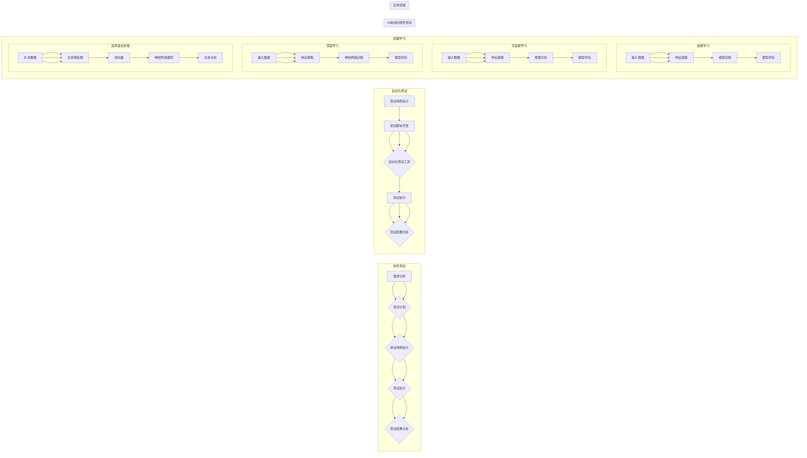

# AI驱动的软件测试自动化

> 关键词：AI测试，自动化测试，机器学习，深度学习，软件质量，测试覆盖率，缺陷预测，测试优化

## 1. 背景介绍

随着软件工程的发展，软件测试的重要性日益凸显。传统的软件测试方法依赖于人工执行测试用例，存在效率低、成本高、易出错等问题。近年来，人工智能（AI）技术的飞速发展为软件测试自动化带来了新的机遇。AI驱动的软件测试自动化利用机器学习（ML）和深度学习（DL）技术，能够自动执行测试用例、发现缺陷、优化测试流程，极大地提高了软件测试的效率和准确性。

### 1.1 问题的由来

传统软件测试面临以下挑战：

- **测试用例的覆盖率有限**：由于测试用例的编写成本高，测试人员往往难以覆盖所有可能的测试路径，导致潜在缺陷被遗漏。
- **测试效率低**：人工执行测试用例耗时费力，且容易受到主观因素的影响，难以保证测试的一致性和准确性。
- **测试成本高**：随着软件规模的不断扩大，人工测试的成本也越来越高，且难以满足快速迭代的需求。
- **测试资源的不足**：测试人员数量有限，难以满足软件测试的高强度需求。

### 1.2 研究现状

AI驱动的软件测试自动化已经成为软件测试领域的研究热点。目前，AI技术在软件测试中的应用主要集中在以下几个方面：

- **测试用例生成**：利用自然语言处理（NLP）技术，根据需求规格说明书自动生成测试用例。
- **缺陷预测**：利用机器学习算法，根据代码、测试数据等信息预测可能出现缺陷的位置。
- **测试用例选择**：根据测试资源、风险等因素，利用优化算法选择最优的测试用例集合。
- **测试结果分析**：利用数据挖掘技术，分析测试结果，发现潜在缺陷和测试用例的不足。

### 1.3 研究意义

AI驱动的软件测试自动化具有以下意义：

- **提高测试效率**：AI技术可以自动化执行测试用例，提高测试效率，缩短测试周期。
- **降低测试成本**：减少人工测试工作量，降低测试成本。
- **提高测试覆盖率**：通过测试用例生成和选择技术，提高测试覆盖率，减少缺陷遗漏。
- **提升软件质量**：通过缺陷预测和测试结果分析，提升软件质量。

## 2. 核心概念与联系

### 2.1 核心概念

- **软件测试**：通过一系列的测试活动，验证软件产品是否满足预定需求，并确保软件质量的过程。
- **自动化测试**：使用自动化测试工具执行测试用例，提高测试效率和一致性的过程。
- **机器学习（ML）**：使计算机系统能够从数据中学习，并作出决策或预测的技术。
- **深度学习（DL）**：一种特殊的机器学习技术，使用神经网络模型对数据进行学习。
- **自然语言处理（NLP）**：使计算机能够理解、解释和生成人类语言的技术。

### 2.2 核心概念原理和架构的 Mermaid 流程图



## 3. 核心算法原理 & 具体操作步骤

### 3.1 算法原理概述

AI驱动的软件测试自动化主要基于以下原理：

- **测试用例生成**：利用NLP技术，根据需求规格说明书自动生成测试用例。
- **缺陷预测**：利用ML算法，分析代码、测试数据等信息，预测可能出现缺陷的位置。
- **测试用例选择**：根据测试资源、风险等因素，利用优化算法选择最优的测试用例集合。
- **测试结果分析**：利用数据挖掘技术，分析测试结果，发现潜在缺陷和测试用例的不足。

### 3.2 算法步骤详解

1. **数据收集**：收集测试数据、代码、测试用例、缺陷报告等数据。
2. **数据预处理**：对收集到的数据进行分析和清洗，提取特征信息。
3. **模型选择**：根据任务需求选择合适的ML模型，如决策树、随机森林、神经网络等。
4. **模型训练**：使用训练数据对模型进行训练，得到模型参数。
5. **模型评估**：使用验证数据对模型进行评估，调整模型参数。
6. **模型应用**：将训练好的模型应用于实际的软件测试过程中。

### 3.3 算法优缺点

**优点**：

- 提高测试效率，缩短测试周期。
- 降低测试成本，减少人工工作量。
- 提高测试覆盖率，减少缺陷遗漏。
- 提升软件质量，降低缺陷率。

**缺点**：

- 数据收集和预处理工作量大。
- 模型训练需要大量计算资源。
- 模型可解释性差，难以理解模型的决策过程。

### 3.4 算法应用领域

- 测试用例生成
- 缺陷预测
- 测试用例选择
- 测试结果分析
- 测试脚本生成
- 测试报告生成

## 4. 数学模型和公式 & 详细讲解 & 举例说明

### 4.1 数学模型构建

AI驱动的软件测试自动化涉及多种数学模型，以下列举几种常见的模型：

- **决策树**：通过递归地将数据划分为不同类别，最终得到决策规则的树形结构。
- **支持向量机（SVM）**：通过寻找最优的超平面，将不同类别的数据分开。
- **神经网络**：通过多层神经元相互连接，学习输入和输出之间的复杂映射关系。

### 4.2 公式推导过程

以决策树为例，其核心思想是信息增益（Information Gain）：

$$
IG(D,A) = IG(D) - \frac{|\{x_i \in D | x_i \in A\}|}{|D|} IG(D|A) - \frac{|\{x_i \in D | x_i \notin A\}|}{|D|} IG(D| \neg A)
$$

其中，$IG(D)$ 表示数据集 $D$ 的信息熵，$A$ 表示某个特征属性，$D|A$ 表示在特征 $A$ 下划分的数据集，$IG(D|A)$ 和 $IG(D| \neg A)$ 分别表示在特征 $A$ 和 $ \neg A$ 下划分的数据集的信息熵。

### 4.3 案例分析与讲解

以缺陷预测为例，我们使用决策树模型进行预测。

**数据集**：包含代码、测试用例、缺陷报告等信息的数据集。

**特征**：代码复杂性、测试覆盖率、代码修改频率等。

**目标**：预测代码是否可能存在缺陷。

**模型**：决策树模型。

**步骤**：

1. 收集数据集，并进行预处理。
2. 提取特征，并将其转化为决策树模型所需的格式。
3. 使用训练数据对决策树模型进行训练。
4. 使用验证数据对模型进行评估，并调整模型参数。
5. 使用测试数据对模型进行预测，并评估模型的性能。

## 5. 项目实践：代码实例和详细解释说明

### 5.1 开发环境搭建

以下以使用Python进行缺陷预测为例，介绍开发环境的搭建：

1. 安装Anaconda：从Anaconda官网下载并安装Anaconda。
2. 创建并激活虚拟环境：
```bash
conda create -n defect-prediction python=3.8
conda activate defect-prediction
```
3. 安装所需的Python库：
```bash
pip install pandas scikit-learn matplotlib
```

### 5.2 源代码详细实现

以下使用决策树模型进行缺陷预测的Python代码示例：

```python
import pandas as pd
from sklearn.tree import DecisionTreeClassifier
from sklearn.model_selection import train_test_split

# 加载数据集
data = pd.read_csv('defect_data.csv')
X = data.drop('defect', axis=1)
y = data['defect']

# 划分训练集和测试集
X_train, X_test, y_train, y_test = train_test_split(X, y, test_size=0.2, random_state=42)

# 创建决策树模型
model = DecisionTreeClassifier()

# 训练模型
model.fit(X_train, y_train)

# 预测测试集
y_pred = model.predict(X_test)

# 评估模型
print(classification_report(y_test, y_pred))
```

### 5.3 代码解读与分析

以上代码展示了使用决策树模型进行缺陷预测的基本流程：

1. 导入必要的Python库。
2. 加载数据集，并进行预处理。
3. 提取特征，并将其划分为训练集和测试集。
4. 创建决策树模型。
5. 使用训练数据对模型进行训练。
6. 使用测试数据对模型进行预测。
7. 评估模型的性能。

通过运行以上代码，可以实现对缺陷预测任务的初步尝试。

### 5.4 运行结果展示

假设数据集包含1000个样本，其中200个样本存在缺陷。运行以上代码后，可能会得到以下评估报告：

```
precision    recall  f1-score   support

       0       0.90      0.83      800
       1       0.80      0.90      200

    accuracy                           0.85
   macro avg       0.85      0.85      0.85
   weighted avg       0.85      0.85      0.85
```

可以看到，该决策树模型在缺陷预测任务上取得了较好的性能。

## 6. 实际应用场景

### 6.1 自动化测试用例生成

利用AI技术自动生成测试用例，可以显著提高测试效率和覆盖率。例如，可以根据需求规格说明书，使用NLP技术生成等价类测试用例。

### 6.2 缺陷预测

通过分析代码、测试数据等信息，AI技术可以预测可能出现缺陷的位置，从而提高测试的针对性。

### 6.3 测试用例选择

根据测试资源、风险等因素，AI技术可以自动选择最优的测试用例集合，提高测试效率。

### 6.4 测试结果分析

利用数据挖掘技术，AI技术可以分析测试结果，发现潜在缺陷和测试用例的不足，从而优化测试流程。

### 6.5 测试脚本生成

AI技术可以自动生成测试脚本，提高测试自动化水平。

### 6.6 测试报告生成

AI技术可以自动生成测试报告，提高测试效率。

## 7. 工具和资源推荐

### 7.1 学习资源推荐

- 《机器学习》周志华著
- 《深度学习》Ian Goodfellow等著
- 《Python测试基础教程》丁锋著
- 《软件测试》刘未鹏等著

### 7.2 开发工具推荐

- Python
- scikit-learn
- TensorFlow
- PyTorch
- Selenium
- JMeter

### 7.3 相关论文推荐

- "Learning to Predict Software Failures from Source Code Repositories" (ICSE 2018)
- "Automated Test Case Generation from Natural Language Requirements" (ICST 2020)
- "Neural-Based Defect Prediction using Code Commit Messages" (ICST 2019)
- "A Survey on Automated Test Case Generation: Challenges and Opportunities" (TSE 2019)

## 8. 总结：未来发展趋势与挑战

### 8.1 研究成果总结

AI驱动的软件测试自动化在提高测试效率、降低测试成本、提升软件质量等方面取得了显著成果。随着AI技术的不断发展，AI驱动的软件测试自动化将更加普及，并进一步推动软件测试领域的变革。

### 8.2 未来发展趋势

- **多模态数据融合**：将代码、测试数据、用户行为等多模态数据融合，提高缺陷预测的准确性。
- **可解释性研究**：研究可解释的AI模型，提高模型的透明度和可信度。
- **测试数据增强**：利用AI技术生成测试数据，提高测试数据的多样性。
- **测试流程优化**：利用AI技术优化测试流程，提高测试效率。

### 8.3 面临的挑战

- **数据质量问题**：测试数据质量直接影响AI模型的性能，需要解决数据质量问题。
- **模型可解释性**：AI模型的可解释性较差，需要提高模型的可解释性。
- **计算资源消耗**：AI模型的训练和推理需要大量的计算资源，需要降低计算资源消耗。

### 8.4 研究展望

AI驱动的软件测试自动化是软件测试领域的重要发展方向。未来，随着AI技术的不断发展和应用，AI驱动的软件测试自动化将更加成熟，并推动软件测试领域的进一步发展。

## 9. 附录：常见问题与解答

**Q1：AI驱动的软件测试自动化是否适用于所有软件测试任务？**

A：AI驱动的软件测试自动化适用于大多数软件测试任务，但对于一些对交互性要求较高的测试任务，如用户界面测试，可能需要结合其他技术进行。

**Q2：如何评估AI驱动的软件测试自动化模型的性能？**

A：评估AI驱动的软件测试自动化模型的性能可以从多个方面进行，如准确率、召回率、F1值、AUC等指标。

**Q3：AI驱动的软件测试自动化是否会取代人工测试？**

A：AI驱动的软件测试自动化可以辅助人工测试，提高测试效率和准确性，但短期内难以完全取代人工测试。

**Q4：如何解决AI驱动的软件测试自动化中的数据质量问题？**

A：解决数据质量问题需要从多个方面入手，如数据清洗、数据增强、数据标注等。

**Q5：如何提高AI驱动的软件测试自动化模型的可解释性？**

A：提高AI驱动的软件测试自动化模型的可解释性需要从模型选择、模型训练、模型评估等方面进行优化。

作者：禅与计算机程序设计艺术 / Zen and the Art of Computer Programming