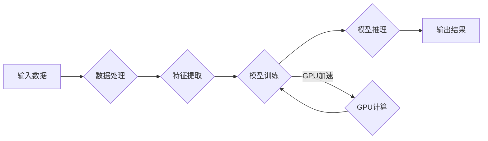

# GPU技术在AI算力中的应用

> 关键词：GPU，AI算力，深度学习，并行计算，异构计算，CUDA，cuDNN，Tensor Core，AI加速

## 1. 背景介绍

随着人工智能（AI）和深度学习（Deep Learning）技术的飞速发展，对计算资源的需求呈现出爆炸式增长。传统的CPU在处理大规模并行计算任务时，效率低下，难以满足AI算力的需求。GPU（Graphics Processing Unit，图形处理器）因其强大的并行计算能力，成为了AI算力加速的利器。本文将深入探讨GPU技术在AI算力中的应用，解析其原理、优势、挑战以及未来发展趋势。

## 2. 核心概念与联系

### 2.1 核心概念

**GPU（图形处理器）**：最初设计用于渲染图形，具有成百上千个处理核心，适合并行计算。

**深度学习（Deep Learning）**：一种人工智能技术，通过模拟人脑神经网络结构，进行特征提取和模式识别。

**并行计算（Parallel Computing）**：通过同时处理多个任务，提高计算效率。

**异构计算（Heterogeneous Computing）**：结合CPU和GPU等多核处理器进行计算，发挥各自优势。

**CUDA（Compute Unified Device Architecture）**：NVIDIA推出的并行计算平台和编程模型。

**cuDNN（CUDA Deep Neural Network Library）**：NVIDIA提供的深度学习加速库。

**Tensor Core**：英伟达新一代GPU架构，专为AI和深度学习任务设计。

### 2.2 架构的 Mermaid 流程图



如图所示，GPU技术在AI算力中的应用流程包括数据处理、特征提取、模型训练、模型推理和输出结果等步骤，其中GPU计算是核心环节，通过GPU加速模型训练和推理过程。

## 3. 核心算法原理 & 具体操作步骤

### 3.1 算法原理概述

GPU技术通过以下原理实现AI算力加速：

1. **并行计算**：GPU拥有大量核心，可以同时处理多个数据或任务，适合并行计算。

2. **数据传输优化**：GPU与主机之间通过高速接口（如PCIe）传输数据，减少数据传输瓶颈。

3. **内存管理**：GPU具有独立的高速内存，避免与CPU内存争用。

4. **优化算法**：针对GPU架构的特性，优化算法以充分利用GPU的并行计算能力。

### 3.2 算法步骤详解

1. **预处理**：将输入数据转换为适合GPU处理的格式，如使用NumPy库进行数据转换和预处理。

2. **模型设计**：设计适合GPU加速的深度学习模型，如使用PyTorch、TensorFlow等深度学习框架。

3. **模型编译**：使用CUDA编译器将模型编译为GPU可执行的代码。

4. **数据加载**：使用GPU内存加载训练和测试数据，避免与CPU内存争用。

5. **模型训练**：使用CUDA进行模型训练，利用GPU并行计算能力加快训练速度。

6. **模型推理**：使用GPU进行模型推理，快速得到预测结果。

### 3.3 算法优缺点

**优点**：

- **计算效率高**：GPU并行计算能力强大，可显著提高AI算力。

- **开发效率高**：深度学习框架提供丰富的API和工具，简化开发过程。

- **成本效益高**：相比高性能服务器，GPU成本更低。

**缺点**：

- **编程复杂**：GPU编程需要一定的专业知识，学习成本较高。

- **内存带宽有限**：GPU内存带宽有限，大数据量处理时可能成为瓶颈。

- **兼容性较差**：不同GPU架构可能存在兼容性问题。

### 3.4 算法应用领域

GPU技术在以下AI算力应用领域具有广泛的应用：

- **图像识别**：人脸识别、物体检测、图像分类等。

- **语音识别**：语音转文字、语音合成等。

- **自然语言处理**：机器翻译、情感分析、文本分类等。

- **推荐系统**：个性化推荐、广告推荐等。

- **科学计算**：药物发现、天气预报、金融市场分析等。

## 4. 数学模型和公式 & 详细讲解 & 举例说明

### 4.1 数学模型构建

深度学习模型通常由多个层组成，包括输入层、隐藏层和输出层。以下以卷积神经网络（CNN）为例，介绍深度学习模型的数学模型构建。

- **输入层**：将输入数据转换为模型可处理的格式。

- **卷积层**：通过卷积核提取特征，计算局部特征图。

- **池化层**：降低特征图的分辨率，减少计算量。

- **全连接层**：将特征图转换为输出结果。

### 4.2 公式推导过程

以卷积层为例，介绍其数学公式推导过程。

- **卷积操作**：假设输入特征图为 $X \in \mathbb{R}^{H \times W \times C_{in}}$，卷积核为 $K \in \mathbb{R}^{K_h \times K_w \times C_{in}}$，输出特征图为 $Y \in \mathbb{R}^{H' \times W' \times C_{out}}$，则卷积操作可表示为：

  $$
  Y = \text{Conv}(X, K)
  $$

  其中：

  $$
  Y_{ij} = \sum_{m,n,c} X_{im+1,n+1,c} \cdot K_{mn,c}
  $$

### 4.3 案例分析与讲解

以下以PyTorch框架为例，介绍GPU加速下的CNN模型训练过程。

```python
import torch
import torch.nn as nn
import torch.optim as optim

# 定义CNN模型
class CNN(nn.Module):
    def __init__(self):
        super(CNN, self).__init__()
        self.conv1 = nn.Conv2d(1, 16, kernel_size=3, stride=1, padding=1)
        self.relu = nn.ReLU()
        self.pool = nn.MaxPool2d(kernel_size=2, stride=2)
        self.fc = nn.Linear(16 * 7 * 7, 10)

    def forward(self, x):
        x = self.conv1(x)
        x = self.relu(x)
        x = self.pool(x)
        x = x.view(-1, 16 * 7 * 7)
        x = self.fc(x)
        return x

# 加载预训练模型和数据集
model = CNN().to('cuda')
criterion = nn.CrossEntropyLoss()
optimizer = optim.Adam(model.parameters(), lr=0.001)

# 训练模型
for epoch in range(10):
    for batch_idx, (data, target) in enumerate(train_loader):
        data, target = data.to('cuda'), target.to('cuda')
        optimizer.zero_grad()
        output = model(data)
        loss = criterion(output, target)
        loss.backward()
        optimizer.step()
        if batch_idx % 100 == 0:
            print(f'Train Epoch: {epoch} [{batch_idx * len(data)}/{len(train_loader.dataset)} ({100. * batch_idx / len(train_loader):.0f}%)]\tLoss: {loss.item():.6f}')

# 保存模型
torch.save(model.state_dict(), 'cnn_model.pth')
```

在上述代码中，我们将模型和数据加载到GPU上，使用CUDA进行模型训练。通过PyTorch框架，开发者可以轻松实现GPU加速下的深度学习模型训练。

## 5. 项目实践：代码实例和详细解释说明

### 5.1 开发环境搭建

1. 安装CUDA Toolkit：从NVIDIA官网下载并安装CUDA Toolkit，版本需与GPU驱动程序兼容。

2. 安装深度学习框架：安装PyTorch，并选择CUDA版本。

3. 安装GPU驱动程序：从NVIDIA官网下载并安装与CUDA Toolkit版本兼容的GPU驱动程序。

### 5.2 源代码详细实现

以下使用PyTorch框架实现GPU加速下的神经网络训练。

```python
import torch
import torch.nn as nn
import torch.optim as optim

# 定义神经网络模型
class NeuralNetwork(nn.Module):
    def __init__(self):
        super(NeuralNetwork, self).__init__()
        self.fc1 = nn.Linear(784, 128)
        self.relu = nn.ReLU()
        self.fc2 = nn.Linear(128, 10)

    def forward(self, x):
        x = self.fc1(x)
        x = self.relu(x)
        x = self.fc2(x)
        return x

# 加载预训练模型和数据集
model = NeuralNetwork().to('cuda')
criterion = nn.CrossEntropyLoss()
optimizer = optim.Adam(model.parameters(), lr=0.001)

# 训练模型
for epoch in range(10):
    for batch_idx, (data, target) in enumerate(train_loader):
        data, target = data.to('cuda'), target.to('cuda')
        optimizer.zero_grad()
        output = model(data)
        loss = criterion(output, target)
        loss.backward()
        optimizer.step()
        if batch_idx % 100 == 0:
            print(f'Train Epoch: {epoch} [{batch_idx * len(data)}/{len(train_loader.dataset)} ({100. * batch_idx / len(train_loader):.0f}%)]\tLoss: {loss.item():.6f}')

# 保存模型
torch.save(model.state_dict(), 'neural_network.pth')
```

### 5.3 代码解读与分析

在上述代码中，我们首先定义了一个简单的神经网络模型，包括两个全连接层和ReLU激活函数。然后，我们将模型和数据加载到GPU上，使用CUDA进行模型训练。通过PyTorch框架，开发者可以轻松实现GPU加速下的神经网络训练。

### 5.4 运行结果展示

运行上述代码，将进行神经网络模型训练。训练完成后，模型将保存到本地文件中，可用于后续的模型推理。

## 6. 实际应用场景

GPU技术在以下AI算力应用场景中具有广泛的应用：

1. **图像识别**：人脸识别、物体检测、图像分类等。

2. **语音识别**：语音转文字、语音合成等。

3. **自然语言处理**：机器翻译、情感分析、文本分类等。

4. **推荐系统**：个性化推荐、广告推荐等。

5. **科学计算**：药物发现、天气预报、金融市场分析等。

## 7. 工具和资源推荐

### 7.1 学习资源推荐

1. 《深度学习》系列书籍：介绍深度学习的基础理论和应用案例。

2. PyTorch官方文档：提供PyTorch框架的详细文档和教程。

3. NVIDIA官方文档：提供CUDA Toolkit和cuDNN的官方文档和示例代码。

### 7.2 开发工具推荐

1. PyTorch：开源深度学习框架，提供GPU加速功能。

2. CUDA Toolkit：NVIDIA的并行计算平台和编程模型。

3. cuDNN：NVIDIA提供的深度学习加速库。

4. Jupyter Notebook：支持代码、公式、可视化等多种形式，方便进行AI算力研究。

### 7.3 相关论文推荐

1. "A Survey on Deep Learning for Image Recognition"：介绍了深度学习在图像识别领域的应用。

2. "Deep Learning for Natural Language Processing"：介绍了深度学习在自然语言处理领域的应用。

3. "Distributed Deep Learning: An Overview"：介绍了分布式深度学习的原理和应用。

## 8. 总结：未来发展趋势与挑战

### 8.1 研究成果总结

GPU技术在AI算力中的应用取得了显著成果，为深度学习和人工智能技术的发展提供了强大的动力。GPU并行计算能力、深度学习框架和开发工具的发展，使得GPU加速的AI算力成为可能。

### 8.2 未来发展趋势

1. **异构计算**：结合CPU和GPU等多核处理器进行计算，发挥各自优势。

2. **人工智能芯片**：开发专门用于AI计算的芯片，提高计算效率。

3. **模型压缩和加速**：通过模型压缩和加速技术，降低计算成本。

4. **可解释性研究**：提高模型的可解释性，增强AI系统的可信度。

### 8.3 面临的挑战

1. **编程复杂度**：GPU编程需要一定的专业知识，学习成本较高。

2. **能耗问题**：GPU计算功耗较高，需要考虑能耗问题。

3. **模型兼容性**：不同GPU架构可能存在兼容性问题。

### 8.4 研究展望

未来，GPU技术将在AI算力领域发挥越来越重要的作用。随着异构计算、人工智能芯片和模型压缩技术的发展，GPU加速的AI算力将更加高效、可靠、可扩展。同时，研究者和开发者需要不断探索新的技术和方法，以应对编程复杂度、能耗和模型兼容性等挑战，推动GPU技术在AI领域的广泛应用。

## 9. 附录：常见问题与解答

**Q1：为什么GPU比CPU更适合AI计算？**

A：GPU拥有成百上千个核心，适合并行计算，而CPU核心数量较少。GPU架构专为图形渲染设计，具有高效的数据并行处理能力，适合深度学习等AI计算任务。

**Q2：如何选择合适的GPU进行AI计算？**

A：选择GPU时，需要考虑以下因素：
1. 核心数量：核心数量越多，并行计算能力越强。
2. 显存容量：显存容量越大，可以处理更大的数据量。
3. CUDA版本：选择与CUDA Toolkit版本兼容的GPU。
4. 兼容性：考虑GPU与计算机主板的兼容性。

**Q3：如何优化GPU计算性能？**

A：优化GPU计算性能可以从以下方面入手：
1. 优化算法：针对GPU架构的特性，优化算法以充分利用并行计算能力。
2. 数据传输优化：优化数据传输效率，减少数据传输时间。
3. 内存管理：合理管理内存，避免内存争用。
4. 并行编程：合理分配任务，充分利用GPU并行计算能力。

**Q4：如何将深度学习模型部署到GPU？**

A：将深度学习模型部署到GPU，需要以下步骤：
1. 选择合适的深度学习框架。
2. 将模型和数据加载到GPU上。
3. 使用GPU进行模型训练或推理。
4. 将训练好的模型保存到本地文件中。

**Q5：如何解决GPU计算中的能耗问题？**

A：解决GPU计算中的能耗问题可以从以下方面入手：
1. 选择功耗较低的GPU。
2. 使用节能模式。
3. 优化算法，降低计算复杂度。
4. 调整GPU工作频率和电压，降低功耗。