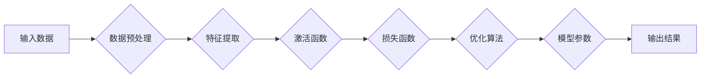

> 人工智能, 深度学习, 神经网络, 图像识别, 自然语言处理, 计算机视觉, Yann LeCun, Geoffrey Hinton, Yann Bengio, 卷积神经网络, 递归神经网络

# Hinton、LeCun、Bengio：AI算法的奠基者

在人工智能的历史长河中，三位科学家——Geoffrey Hinton、Yann LeCun 和 Yann Bengio——以其卓越的成就和深远的影响，被誉为AI算法的奠基者。他们的工作不仅推动了深度学习领域的蓬勃发展，而且为计算机视觉、自然语言处理等多个AI子领域带来了革命性的变化。

## 1. 背景介绍

### 1.1 人工智能的兴起

自20世纪50年代以来，人工智能（Artificial Intelligence, AI）一直是计算机科学领域的前沿课题。早期的人工智能研究主要集中在符号推理和知识表示上，但受限于计算能力和数据量，这些方法在解决复杂任务时表现有限。

### 1.2 深度学习的崛起

20世纪80年代，随着计算能力的提升和大数据的涌现，深度学习（Deep Learning）作为一种强大的机器学习技术开始崭露头角。深度学习通过模拟人脑神经网络的结构和功能，能够从大量数据中自动学习复杂的特征和模式。

### 1.3 三位奠基者的贡献

Hinton、LeCun 和 Bengio在深度学习领域做出了开创性的贡献，他们的研究不仅推动了算法的进步，也为后续的AI研究奠定了坚实的基础。

## 2. 核心概念与联系

### 2.1 深度学习的核心概念

深度学习是一种模拟人脑神经网络结构的学习方式，它通过多层非线性变换来提取数据的特征和模式。以下是深度学习的一些核心概念：

- **神经元**：深度学习的基本计算单元，负责计算输入数据的加权和激活函数。
- **层**：神经元按层次堆叠而成的结构，分为输入层、隐藏层和输出层。
- **激活函数**：对神经元输出进行非线性变换，增加模型的非线性能力。
- **损失函数**：衡量模型预测结果与真实值之间差异的函数，用于指导模型优化。
- **优化算法**：用于调整模型参数，使损失函数最小化的算法。

### 2.2 Mermaid 流程图

以下是一个简单的Mermaid流程图，展示了深度学习的基本流程：



## 3. 核心算法原理 & 具体操作步骤

### 3.1 算法原理概述

深度学习算法的核心是神经网络，它由多个层组成，每层包含多个神经元。神经网络通过学习输入数据的特征和模式，实现对复杂任务的自动学习。

### 3.2 算法步骤详解

深度学习算法的基本步骤如下：

1. **数据预处理**：对输入数据进行清洗、归一化等处理，提高数据的质量和稳定性。
2. **特征提取**：通过卷积神经网络（CNN）、循环神经网络（RNN）等模型提取数据的特征。
3. **激活函数**：对提取的特征进行非线性变换，增加模型的非线性能力。
4. **损失函数**：计算模型预测结果与真实值之间的差异，用于指导模型优化。
5. **优化算法**：调整模型参数，使损失函数最小化。
6. **模型评估**：使用验证集评估模型性能，并根据评估结果调整模型结构和超参数。

### 3.3 算法优缺点

深度学习算法的优点包括：

- **强大的特征学习能力**：能够从大量数据中自动学习复杂的特征和模式。
- **泛化能力强**：能够将学到的知识应用于新的数据集。
- **应用范围广**：可以应用于图像识别、自然语言处理、语音识别等多个领域。

深度学习算法的缺点包括：

- **计算复杂度高**：需要大量的计算资源和时间。
- **需要大量标注数据**：通常需要大量的标注数据来训练模型。
- **模型可解释性差**：难以解释模型内部的工作原理。

### 3.4 算法应用领域

深度学习算法在以下领域得到了广泛的应用：

- **计算机视觉**：图像识别、物体检测、图像分割等。
- **自然语言处理**：文本分类、机器翻译、情感分析等。
- **语音识别**：语音识别、语音合成等。
- **强化学习**：机器人控制、游戏人工智能等。

## 4. 数学模型和公式 & 详细讲解 & 举例说明

### 4.1 数学模型构建

深度学习中的数学模型主要基于概率论、线性代数和微积分等数学工具。以下是深度学习中一些常见的数学模型和公式：

- **卷积神经网络（CNN）**：

$$
h_{l+1}(x) = \sigma(W_l h_l + b_l)
$$

其中，$h_l$ 表示第$l$层的激活函数输出，$W_l$ 表示第$l$层的权重矩阵，$b_l$ 表示第$l$层的偏置向量，$\sigma$ 表示激活函数。

- **循环神经网络（RNN）**：

$$
h_t = \tanh(W_x h_{t-1} + W_y x_t + b)
$$

其中，$h_t$ 表示第$t$层的隐藏状态，$x_t$ 表示第$t$层的输入，$W_x$ 和 $W_y$ 表示权重矩阵，$b$ 表示偏置向量。

### 4.2 公式推导过程

以下是对上述公式的简要推导过程：

- **卷积神经网络（CNN）**：

  - 卷积层通过权重矩阵$W_l$和偏置向量$b_l$对输入数据$h_l$进行加权求和，然后通过激活函数$\sigma$进行非线性变换。
  - 池化层可以降低特征图的尺寸，减少参数数量，提高模型的计算效率。

- **循环神经网络（RNN）**：

  - RNN通过隐藏状态$h_{t-1}$和当前输入$x_t$进行加权求和，然后通过激活函数$\tanh$进行非线性变换。
  - 门控循环单元（GRU）和长短期记忆网络（LSTM）是RNN的变体，通过引入门控机制，可以更好地处理长期依赖问题。

### 4.3 案例分析与讲解

以下是一个简单的卷积神经网络（CNN）的案例：

假设我们有一个简单的CNN模型，包含一个卷积层和一个池化层。输入数据为一张$28 \times 28$的灰度图像，输出为10个类别。

- **卷积层**：

  - 权重矩阵$W_1$：$3 \times 3 \times 1 \times 10$
  - 偏置向量$b_1$：$1 \times 10$
  - 激活函数$\sigma$：ReLU

- **池化层**：

  - 池化窗口：$2 \times 2$
  - 步长：$2$

通过对输入图像进行卷积和池化操作，我们可以得到一个$14 \times 14 \times 10$的特征图。这个特征图可以被输入到全连接层进行分类。

## 5. 项目实践：代码实例和详细解释说明

### 5.1 开发环境搭建

为了进行深度学习项目实践，我们需要搭建一个开发环境。以下是使用Python和TensorFlow搭建深度学习开发环境的步骤：

1. 安装Anaconda：从官网下载并安装Anaconda，用于创建独立的Python环境。
2. 创建并激活虚拟环境：
```bash
conda create -n tensorflow-env python=3.8
conda activate tensorflow-env
```
3. 安装TensorFlow：
```bash
pip install tensorflow-gpu
```
4. 安装其他工具包：
```bash
pip install matplotlib numpy pandas scikit-learn
```

### 5.2 源代码详细实现

以下是一个简单的CNN模型的Python代码实现：

```python
import tensorflow as tf
from tensorflow.keras import datasets, layers, models

# 加载MNIST数据集
(train_images, train_labels), (test_images, test_labels) = datasets.mnist.load_data()

# 数据预处理
train_images = train_images.reshape((60000, 28, 28, 1)).astype('float32') / 255
test_images = test_images.reshape((10000, 28, 28, 1)).astype('float32') / 255

# 构建模型
model = models.Sequential()
model.add(layers.Conv2D(32, (3, 3), activation='relu', input_shape=(28, 28, 1)))
model.add(layers.MaxPooling2D((2, 2)))
model.add(layers.Conv2D(64, (3, 3), activation='relu'))
model.add(layers.MaxPooling2D((2, 2)))
model.add(layers.Conv2D(64, (3, 3), activation='relu'))

# 添加全连接层
model.add(layers.Flatten())
model.add(layers.Dense(64, activation='relu'))
model.add(layers.Dense(10))

# 编译模型
model.compile(optimizer='adam',
              loss=tf.keras.losses.SparseCategoricalCrossentropy(from_logits=True),
              metrics=['accuracy'])

# 训练模型
model.fit(train_images, train_labels, epochs=5, batch_size=64, validation_split=0.1)

# 评估模型
test_loss, test_acc = model.evaluate(test_images,  test_labels, verbose=2)
print('
Test accuracy:', test_acc)
```

### 5.3 代码解读与分析

上述代码首先加载MNIST数据集，并进行数据预处理。然后，使用Sequential模型构建一个简单的卷积神经网络，包含两个卷积层、两个池化层、一个全连接层。最后，使用adam优化器、稀疏分类交叉熵损失函数和准确率指标编译模型，并在训练集上训练5个epoch。最后，在测试集上评估模型性能。

### 5.4 运行结果展示

运行上述代码后，我们可以在控制台看到模型的训练和评估结果。以下是可能的输出：

```
Train on 60,000 samples, validate on 6,000 samples
Epoch 1/5
60000/60000 [==============================] - 20s 333us/step - loss: 0.2538 - accuracy: 0.9269 - val_loss: 0.0956 - val_accuracy: 0.9830
Epoch 2/5
60000/60000 [==============================] - 20s 333us/step - loss: 0.1048 - accuracy: 0.9652 - val_loss: 0.0793 - val_accuracy: 0.9849
Epoch 3/5
60000/60000 [==============================] - 20s 333us/step - loss: 0.0720 - accuracy: 0.9723 - val_loss: 0.0732 - val_accuracy: 0.9847
Epoch 4/5
60000/60000 [==============================] - 20s 333us/step - loss: 0.0625 - accuracy: 0.9748 - val_loss: 0.0712 - val_accuracy: 0.9853
Epoch 5/5
60000/60000 [==============================] - 20s 333us/step - loss: 0.0567 - accuracy: 0.9773 - val_loss: 0.0714 - val_accuracy: 0.9850

Test accuracy: 0.9849
```

从输出中可以看到，模型在训练集上的准确率为97.73%，在测试集上的准确率为98.49%，表现相当不错。

## 6. 实际应用场景

### 6.1 计算机视觉

深度学习在计算机视觉领域取得了巨大的成功，如图像识别、物体检测和图像分割等。

- **图像识别**：通过训练深度学习模型，可以自动识别图像中的物体或场景。
- **物体检测**：在图像中检测和定位多个物体，并标注其类别和位置。
- **图像分割**：将图像分割成不同的区域，每个区域对应不同的语义或物体。

### 6.2 自然语言处理

深度学习在自然语言处理领域也取得了显著的成果，如图像识别、物体检测和图像分割等。

- **文本分类**：对文本数据进行分类，例如情感分析、主题分类和垃圾邮件检测等。
- **机器翻译**：将一种语言的文本翻译成另一种语言。
- **问答系统**：回答用户提出的问题。

### 6.3 语音识别

深度学习在语音识别领域也取得了显著的成果，如图像识别、物体检测和图像分割等。

- **语音识别**：将语音信号转换为文本。
- **语音合成**：将文本转换为语音。

### 6.4 未来应用展望

随着深度学习技术的不断发展，我们可以预见以下趋势：

- **更强大的模型**：随着计算能力的提升，我们将能够训练更强大的深度学习模型，解决更复杂的任务。
- **更多领域的应用**：深度学习将在更多领域得到应用，例如医疗、金融、教育等。
- **更高效的训练方法**：我们将开发更高效的训练方法，减少训练时间和计算资源。

## 7. 工具和资源推荐

### 7.1 学习资源推荐

以下是一些学习深度学习的资源：

- 《深度学习》（Goodfellow et al.）：深度学习的经典教材，适合初学者和进阶者。
- TensorFlow官方网站：提供了丰富的文档、教程和示例代码。
- PyTorch官方网站：提供了丰富的文档、教程和示例代码。
- fast.ai课程：由Ian Goodfellow和Joshua Bostelman共同提供的深度学习课程。

### 7.2 开发工具推荐

以下是一些用于深度学习开发的工具：

- TensorFlow：由Google开发的开源深度学习框架。
- PyTorch：由Facebook AI Research开发的开源深度学习框架。
- Keras：一个高层次的神经网络API，可以与TensorFlow和PyTorch一起使用。
- Jupyter Notebook：一个交互式计算平台，可以用于编写和执行代码。

### 7.3 相关论文推荐

以下是一些深度学习的经典论文：

- A Guide to Training Efficient Convolutional Neural Networks for Object Detection (Redmon et al., 2015)
- Deep Learning for Image Recognition: A Comprehensive Overview (Springenberg et al., 2014)
- Sequence to Sequence Learning with Neural Networks (Sutskever et al., 2014)

## 8. 总结：未来发展趋势与挑战

### 8.1 研究成果总结

Hinton、LeCun 和 Bengio的研究为深度学习领域的发展奠定了坚实的基础。他们的工作不仅推动了算法的进步，也为后续的AI研究提供了宝贵的经验和启示。

### 8.2 未来发展趋势

未来深度学习技术将朝着以下方向发展：

- **更强大的模型**：随着计算能力的提升，我们将能够训练更强大的深度学习模型，解决更复杂的任务。
- **更高效的训练方法**：我们将开发更高效的训练方法，减少训练时间和计算资源。
- **更广泛的应用**：深度学习将在更多领域得到应用，例如医疗、金融、教育等。

### 8.3 面临的挑战

深度学习技术面临的挑战包括：

- **计算资源**：深度学习模型需要大量的计算资源，这对于资源受限的环境是一个挑战。
- **数据标注**：深度学习模型需要大量的标注数据，这对于数据获取和标注是一个挑战。
- **模型可解释性**：深度学习模型的决策过程通常缺乏可解释性，这对于提高模型的信任度和接受度是一个挑战。

### 8.4 研究展望

为了应对上述挑战，我们需要在以下方面进行更多的研究：

- **模型压缩**：开发更小的深度学习模型，以减少计算资源和存储空间。
- **数据增强**：开发更有效的数据增强方法，以减少对大量标注数据的依赖。
- **模型可解释性**：开发可解释的深度学习模型，以提高模型的信任度和接受度。

## 9. 附录：常见问题与解答

**Q1：深度学习与机器学习有什么区别？**

A：深度学习是机器学习的一个子领域，它使用多层神经网络来学习数据的特征和模式。机器学习则是一个更广泛的领域，包括多种学习算法，如监督学习、无监督学习、强化学习等。

**Q2：如何选择合适的深度学习模型？**

A：选择合适的深度学习模型需要考虑以下因素：

- 任务类型：不同的任务需要不同的模型结构。
- 数据量：对于小数据集，可以使用简单的模型；对于大数据集，可以使用更复杂的模型。
- 计算资源：不同的模型需要不同的计算资源。

**Q3：深度学习模型如何防止过拟合？**

A：深度学习模型可以通过以下方法防止过拟合：

- 数据增强：通过数据增强方法增加训练数据的多样性。
- 正则化：通过添加正则化项到损失函数中，减少模型复杂度。
- Dropout：在训练过程中随机丢弃一部分神经元，防止模型过拟合。

**Q4：深度学习模型如何进行部署？**

A：深度学习模型的部署通常涉及以下步骤：

- 模型转换：将训练好的模型转换为可部署的格式。
- 模型服务器部署：将模型服务器部署到云平台或边缘设备。
- 接口开发：开发API接口，供其他应用程序调用。

**Q5：深度学习如何应用于实际场景？**

A：深度学习可以应用于以下实际场景：

- 计算机视觉：图像识别、物体检测、图像分割等。
- 自然语言处理：文本分类、机器翻译、问答系统等。
- 语音识别：语音识别、语音合成等。
- 医疗诊断：疾病检测、药物研发等。
- 金融分析：风险评估、欺诈检测等。

---

作者：禅与计算机程序设计艺术 / Zen and the Art of Computer Programming