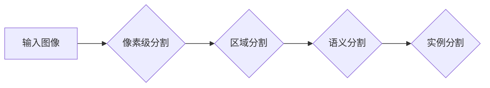

> 关键词：图像分割，深度学习，卷积神经网络，语义分割，实例分割，分割网络，U-Net，Mask R-CNN，PyTorch

# Image Segmentation 原理与代码实战案例讲解

图像分割（Image Segmentation）是计算机视觉领域的一项重要任务，其目标是将图像划分为若干个互不相交的区域，每个区域代表图像中的一个对象或场景的一部分。图像分割在医学图像分析、自动驾驶、遥感图像处理等领域有着广泛的应用。本文将深入探讨图像分割的原理，并通过实战案例讲解如何使用深度学习技术进行图像分割。

## 1. 背景介绍

### 1.1 问题的由来

图像分割技术的需求源于对图像内容的深入理解和分析。在医学图像分析中，分割出肿瘤、血管等组织对于诊断和治疗具有重要意义；在自动驾驶领域，准确分割出道路、行人、车辆等对于安全驾驶至关重要；在遥感图像处理中，分割出不同的地物类型对于环境监测和资源管理有着重要价值。

### 1.2 研究现状

随着深度学习技术的快速发展，基于深度学习的图像分割方法取得了显著的成果。早期的方法主要基于传统图像处理技术，如阈值分割、边缘检测等，但准确性和鲁棒性较差。近年来，卷积神经网络（Convolutional Neural Networks, CNNs）的兴起为图像分割带来了新的突破。

### 1.3 研究意义

图像分割技术的研究对于推动计算机视觉技术的发展具有重要意义。准确、高效的分割方法可以帮助我们更好地理解图像内容，为后续的图像分析和理解提供基础。

### 1.4 本文结构

本文将首先介绍图像分割的核心概念与联系，然后深入探讨核心算法原理和具体操作步骤，接着通过数学模型和公式进行详细讲解，并通过项目实践展示代码实例和运行结果。最后，我们将讨论图像分割的实际应用场景和未来发展趋势。

## 2. 核心概念与联系

### 2.1 核心概念

- **像素级分割**：将图像分割成像素级别的区域，每个像素属于某个特定类别。
- **区域分割**：将图像分割成若干个区域，每个区域包含多个像素，且属于同一类别。
- **语义分割**：将图像分割成像素级别的区域，每个区域表示一个语义类别，如人、车、树等。
- **实例分割**：将图像分割成像素级别的区域，每个区域不仅表示一个语义类别，还唯一标识该类别的实例。

### 2.2 核心概念原理和架构的 Mermaid 流程图



## 3. 核心算法原理 & 具体操作步骤

### 3.1 算法原理概述

图像分割的核心算法是分割网络（Segmentation Network），它通常由卷积神经网络（CNN）构成。分割网络通过学习图像特征，将图像分割成不同的区域或实例。

### 3.2 算法步骤详解

1. **输入图像**：将待分割的图像输入到分割网络中。
2. **特征提取**：网络中的卷积层提取图像的特征。
3. **区域预测**：网络中的池化层对特征进行降维。
4. **分类**：网络中的全连接层对降维后的特征进行分类，得到每个像素的类别标签。
5. **输出结果**：将每个像素的类别标签输出为分割结果。

### 3.3 算法优缺点

**优点**：

- 高度自动化：分割网络能够自动从图像中学习特征，无需人工设计特征。
- 高精度：分割网络能够实现高精度的分割结果。

**缺点**：

- 计算量大：分割网络通常需要大量的计算资源。
- 需要大量标注数据：分割网络需要大量的标注数据进行训练。

### 3.4 算法应用领域

- 医学图像分析
- 自动驾驶
- 遥感图像处理
- 视频分析
- 增强现实

## 4. 数学模型和公式 & 详细讲解 & 举例说明

### 4.1 数学模型构建

图像分割的数学模型通常是基于卷积神经网络的。以下是一个简单的卷积神经网络模型：

$$
y = f(W \cdot x + b)
$$

其中，$y$ 是网络的输出，$x$ 是输入图像，$W$ 是权重矩阵，$b$ 是偏置向量，$f$ 是激活函数。

### 4.2 公式推导过程

卷积神经网络的推导过程涉及到许多数学公式，包括卷积操作、池化操作、激活函数等。这里简要介绍卷积操作的推导过程：

$$
h(x) = \sum_{i=1}^{m} w_i * x_i + b
$$

其中，$h(x)$ 是卷积操作的结果，$w_i$ 是卷积核，$x_i$ 是输入图像的像素值，$b$ 是偏置。

### 4.3 案例分析与讲解

以下是一个简单的U-Net模型，用于医学图像分割：

```python
import torch
import torch.nn as nn

class UNet(nn.Module):
    def __init__(self):
        super(UNet, self).__init__()
        self.encoder = nn.Sequential(
            nn.Conv2d(3, 64, kernel_size=3, stride=1, padding=1),
            nn.ReLU(),
            nn.Conv2d(64, 64, kernel_size=3, stride=1, padding=1),
            nn.ReLU(),
            nn.MaxPool2d(kernel_size=2, stride=2)
        )
        self.decoder = nn.Sequential(
            nn.ConvTranspose2d(64, 64, kernel_size=2, stride=2),
            nn.ReLU(),
            nn.Conv2d(64, 1, kernel_size=3, stride=1, padding=1),
            nn.Sigmoid()
        )

    def forward(self, x):
        x = self.encoder(x)
        x = self.decoder(x)
        return x
```

U-Net模型首先通过编码器提取图像特征，然后通过解码器进行特征上采样，最后输出分割结果。

## 5. 项目实践：代码实例和详细解释说明

### 5.1 开发环境搭建

为了进行图像分割的实战，我们需要搭建以下开发环境：

- Python 3.6+
- PyTorch 1.2+
- OpenCV 3.4+
- NumPy 1.14+

### 5.2 源代码详细实现

以下是一个使用PyTorch实现的图像分割项目：

```python
import torch
import torch.nn as nn
import torch.optim as optim
from torch.utils.data import DataLoader, Dataset
from torchvision import transforms
from sklearn.model_selection import train_test_split
import cv2

class ImageDataset(Dataset):
    def __init__(self, image_paths, label_paths, transform=None):
        self.image_paths = image_paths
        self.label_paths = label_paths
        self.transform = transform

    def __len__(self):
        return len(self.image_paths)

    def __getitem__(self, idx):
        image = cv2.imread(self.image_paths[idx])
        label = cv2.imread(self.label_paths[idx], cv2.IMREAD_GRAYSCALE)

        if self.transform:
            image = self.transform(image)
            label = self.transform(label)

        return image, label

def train(model, dataloader, criterion, optimizer, num_epochs):
    model.train()
    for epoch in range(num_epochs):
        running_loss = 0.0
        for images, labels in dataloader:
            optimizer.zero_grad()
            outputs = model(images)
            loss = criterion(outputs, labels)
            loss.backward()
            optimizer.step()
            running_loss += loss.item()
        print(f'Epoch {epoch+1}, Loss: {running_loss/len(dataloader)}')

def main():
    image_paths = ['path/to/image1.jpg', 'path/to/image2.jpg', ...]
    label_paths = ['path/to/label1.png', 'path/to/label2.png', ...]
    train_image_paths, val_image_paths, train_label_paths, val_label_paths = train_test_split(image_paths, label_paths, test_size=0.2)
    transform = transforms.Compose([
        transforms.Resize((256, 256)),
        transforms.ToTensor()
    ])
    train_dataset = ImageDataset(train_image_paths, train_label_paths, transform=transform)
    val_dataset = ImageDataset(val_image_paths, val_label_paths, transform=transform)
    train_dataloader = DataLoader(train_dataset, batch_size=4, shuffle=True)
    val_dataloader = DataLoader(val_dataset, batch_size=4, shuffle=False)
    model = UNet()
    criterion = nn.BCEWithLogitsLoss()
    optimizer = optim.Adam(model.parameters(), lr=0.001)
    train(model, train_dataloader, criterion, optimizer, num_epochs=20)

if __name__ == '__main__':
    main()
```

### 5.3 代码解读与分析

- `ImageDataset` 类：定义了一个自定义数据集，用于加载图像和标签。
- `train` 函数：定义了训练函数，包括前向传播、损失计算、反向传播和优化。
- `main` 函数：定义了主函数，包括数据集划分、数据加载、模型定义、损失函数、优化器、训练和验证。

### 5.4 运行结果展示

运行上述代码后，模型将在训练集上进行训练，并在验证集上进行验证。训练过程中，会输出每个epoch的损失值。

## 6. 实际应用场景

### 6.1 医学图像分析

图像分割在医学图像分析中有着广泛的应用，如：

- 肿瘤检测和分割
- 心脏分析
- 骨折检测

### 6.2 自动驾驶

图像分割在自动驾驶领域有着重要的应用，如：

- 道路分割
- 行人检测
- 车辆检测

### 6.3 遥感图像处理

图像分割在遥感图像处理中有着重要的应用，如：

- 地物分类
- 森林火灾检测
- 农业监测

## 7. 工具和资源推荐

### 7.1 学习资源推荐

- 《Deep Learning with PyTorch》
- 《Learning PyTorch for Computer Vision》
- Coursera上的《卷积神经网络与视觉识别》课程

### 7.2 开发工具推荐

- PyTorch
- TensorFlow
- OpenCV
- NumPy

### 7.3 相关论文推荐

- "U-Net: A Convolutional Neural Network for Image Segmentation"
- "Fully Convolutional Networks for Semantic Segmentation"
- "Mask R-CNN"

## 8. 总结：未来发展趋势与挑战

### 8.1 研究成果总结

图像分割技术取得了显著的进展，基于深度学习的分割网络在准确性和鲁棒性方面取得了突破。

### 8.2 未来发展趋势

- **多尺度特征融合**：结合不同尺度的特征进行分割，提高分割精度。
- **多模态数据融合**：结合图像、视频、雷达等多模态数据进行分割，提高分割精度和鲁棒性。
- **端到端分割**：实现从图像到分割结果的端到端学习，提高分割效率。

### 8.3 面临的挑战

- **数据标注成本高**：高质量的标注数据是分割模型训练的关键，但数据标注成本高昂。
- **计算资源需求大**：深度学习模型需要大量的计算资源进行训练和推理。
- **模型可解释性差**：深度学习模型通常缺乏可解释性，难以理解其决策过程。

### 8.4 研究展望

随着深度学习技术的不断发展，图像分割技术将会在更多领域得到应用，并取得更大的突破。

## 9. 附录：常见问题与解答

**Q1：什么是像素级分割？**

A：像素级分割是将图像分割成像素级别的区域，每个像素属于某个特定类别。

**Q2：什么是区域分割？**

A：区域分割是将图像分割成若干个区域，每个区域包含多个像素，且属于同一类别。

**Q3：什么是语义分割？**

A：语义分割是将图像分割成像素级别的区域，每个区域表示一个语义类别，如人、车、树等。

**Q4：什么是实例分割？**

A：实例分割是将图像分割成像素级别的区域，每个区域不仅表示一个语义类别，还唯一标识该类别的实例。

**Q5：如何选择合适的分割网络？**

A：选择合适的分割网络需要根据具体的应用场景和数据特点进行选择。对于小样本数据，可以选择U-Net等轻量级网络；对于大样本数据，可以选择更复杂的网络，如Mask R-CNN。

**Q6：如何提高分割模型的鲁棒性？**

A：提高分割模型的鲁棒性可以通过以下方法：
- 使用数据增强技术，如旋转、翻转、缩放等。
- 使用迁移学习，利用预训练模型的知识。
- 使用多尺度特征融合。
- 使用对抗训练。

作者：禅与计算机程序设计艺术 / Zen and the Art of Computer Programming