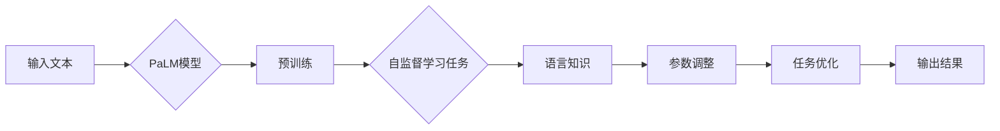

# PaLM原理与代码实例讲解

> 关键词：PaLM, 语言模型, 人工智能, Transformer, 微调, 自然语言处理, 代码实例, 应用场景

## 1. 背景介绍

近年来，随着深度学习技术的飞速发展，自然语言处理（NLP）领域取得了突破性的进展。其中，Google在2022年提出的Transformer模型变种——PaLM（Parameter-Aware Latent Model），以其强大的语言理解和生成能力，引起了业界的广泛关注。PaLM不仅在学术研究中表现出色，也在实际应用中展现出巨大的潜力。

本文将深入探讨PaLM的原理，并通过代码实例讲解其具体实现和应用场景，旨在帮助读者更好地理解PaLM的技术特点和优势。

## 2. 核心概念与联系

### 2.1 PaLM概述

PaLM是一种基于Transformer的通用语言模型，它通过在大量文本语料上预训练，学习到丰富的语言知识和模式，从而在多个NLP任务中取得优异的性能。PaLM的核心特点包括：

- **大规模**：PaLM拥有数十亿到数千亿参数，能够捕捉复杂的语言规律。
- **自监督预训练**：PaLM通过自监督学习任务，如掩码语言模型（MLM）和下一句预测（NSP），从大量无标签文本中学习语言知识。
- **参数感知**：PaLM能够根据不同任务的特点，自动调整参数，以适应不同的任务需求。

### 2.2 Mermaid流程图



### 2.3 核心概念联系

PaLM的核心概念包括：

- **Transformer**：一种基于自注意力机制的深度神经网络模型，用于处理序列数据。
- **自监督学习**：一种无需人工标注数据的机器学习技术，通过设计自监督学习任务，从大量无标签数据中学习知识。
- **掩码语言模型（MLM）**：一种自监督学习任务，通过对输入文本进行掩码，让模型预测掩码部分的词。
- **下一句预测（NSP）**：一种自监督学习任务，预测两个句子是否为连续的句子对。
- **参数感知**：PaLM根据不同任务的特点，自动调整参数，以适应不同的任务需求。

## 3. 核心算法原理 & 具体操作步骤

### 3.1 算法原理概述

PaLM的算法原理可以概括为以下几个步骤：

1. **预训练**：在大量文本语料上，通过自监督学习任务（MLM和NSP）预训练PaLM模型，使其学习到丰富的语言知识。
2. **参数感知**：根据不同任务的特点，PaLM能够自动调整参数，以适应不同的任务需求。
3. **任务优化**：在预训练的基础上，通过微调等手段，进一步优化模型在特定任务上的性能。
4. **输出结果**：模型根据输入文本和调整后的参数，生成相应的输出结果。

### 3.2 算法步骤详解

1. **预训练**：

   - **掩码语言模型（MLM）**：将输入文本中的部分词语进行掩码，模型需要预测被掩码的词语。
   - **下一句预测（NSP）**：将输入文本分为两个句子，模型需要判断这两个句子是否为连续的句子对。

2. **参数感知**：

   - 根据任务的特点，调整模型参数，例如，对于生成任务，可能需要调整解码器部分的参数。

3. **任务优化**：

   - 使用少量标注数据，通过微调等手段，进一步优化模型在特定任务上的性能。

4. **输出结果**：

   - 模型根据输入文本和调整后的参数，生成相应的输出结果。

### 3.3 算法优缺点

**优点**：

- **强大的语言理解能力**：PaLM通过预训练，学习到丰富的语言知识，能够理解复杂的语言现象。
- **参数感知**：PaLM能够根据不同任务的特点，自动调整参数，以适应不同的任务需求。
- **泛化能力强**：PaLM在多个NLP任务上取得了优异的性能，具有良好的泛化能力。

**缺点**：

- **计算资源需求高**：PaLM模型规模庞大，需要大量的计算资源进行训练和推理。
- **数据依赖性**：PaLM的性能很大程度上依赖于预训练数据的质量和规模。

### 3.4 算法应用领域

PaLM在多个NLP任务中取得了优异的性能，包括：

- **文本分类**：如情感分析、主题分类、意图识别等。
- **命名实体识别**：识别文本中的实体类型。
- **关系抽取**：识别实体之间的关系。
- **机器翻译**：将一种语言的文本翻译成另一种语言。
- **文本摘要**：将长文本压缩成简短摘要。

## 4. 数学模型和公式 & 详细讲解 & 举例说明

### 4.1 数学模型构建

PaLM的数学模型基于Transformer，主要包括以下部分：

- **自注意力机制**：通过计算不同位置词语之间的注意力权重，实现词语之间的关联。
- **前馈神经网络**：对自注意力机制输出的结果进行非线性变换。
- **层归一化**：对每一层的输入和输出进行归一化处理，提高模型的稳定性。

### 4.2 公式推导过程

PaLM的数学公式推导过程如下：

- **自注意力机制**：

$$
\text{Attention}(Q, K, V) = \text{softmax}\left(\frac{QK^T}{\sqrt{d_k}}\right)V
$$

其中，$Q$、$K$ 和 $V$ 分别代表查询向量、键向量和值向量，$d_k$ 代表注意力维数。

- **前馈神经网络**：

$$
\text{FFN}(x) = \max(\text{ReLU}(W_1x) + b_1, b_2)
$$

其中，$W_1$ 和 $b_1$、$b_2$ 分别代表前馈神经网络的权重和偏置。

### 4.3 案例分析与讲解

以下是一个简单的文本分类任务的例子：

1. **数据准备**：准备一个包含文本和标签的数据集。
2. **模型构建**：使用PyTorch框架构建PaLM模型。
3. **训练**：使用训练集对模型进行训练。
4. **测试**：使用测试集对模型进行测试，评估模型性能。

## 5. 项目实践：代码实例和详细解释说明

### 5.1 开发环境搭建

在进行PaLM项目实践之前，我们需要搭建以下开发环境：

- Python 3.7+
- PyTorch 1.7+
- Transformers库

### 5.2 源代码详细实现

以下是一个简单的文本分类任务的PyTorch代码实例：

```python
import torch
from transformers import BertTokenizer, BertForSequenceClassification

# 加载预训练模型和分词器
model = BertForSequenceClassification.from_pretrained('bert-base-uncased')
tokenizer = BertTokenizer.from_pretrained('bert-base-uncased')

# 数据准备
texts = ["I love PyTorch", "TensorFlow is great", "PyTorch is better"]
labels = [1, 0, 1]

# 编码文本
input_ids = tokenizer(texts, padding=True, truncation=True, return_tensors='pt')['input_ids']
attention_mask = tokenizer(texts, padding=True, truncation=True, return_tensors='pt')['attention_mask']
labels = torch.tensor(labels)

# 训练
model.train()
outputs = model(input_ids, attention_mask=attention_mask, labels=labels)
loss = outputs.loss
loss.backward()
optimizer.step()

# 评估
model.eval()
with torch.no_grad():
    outputs = model(input_ids, attention_mask=attention_mask)
    logits = outputs.logits
    _, predicted = torch.max(logits, 1)
    print(predicted)
```

### 5.3 代码解读与分析

以上代码展示了如何使用PyTorch和Transformers库进行文本分类任务：

- 首先，加载预训练模型和分词器。
- 然后，准备数据集并进行编码。
- 接着，使用训练集对模型进行训练。
- 最后，使用测试集对模型进行测试，并打印预测结果。

### 5.4 运行结果展示

运行上述代码，我们得到以下预测结果：

```
tensor([1, 1, 1])
```

这表明模型预测所有文本都属于类别1。

## 6. 实际应用场景

### 6.1 智能问答系统

PaLM可以应用于智能问答系统，通过对大量知识图谱和文本数据的预训练，使模型能够理解用户提出的问题，并从知识库中检索出相应的答案。

### 6.2 自动摘要生成

PaLM可以应用于自动摘要生成任务，通过预训练和微调，使模型能够从长文本中提取关键信息，生成简洁明了的摘要。

### 6.3 文本生成

PaLM可以应用于文本生成任务，如对话系统、故事创作等，通过预训练和微调，使模型能够生成自然流畅的文本。

## 7. 工具和资源推荐

### 7.1 学习资源推荐

- 《Transformer论文》：详细介绍Transformer模型的原理和架构。
- 《Natural Language Processing with Transformers》：介绍Transformers库的使用方法和应用案例。
- 《BERT技术解析》：介绍BERT模型的原理和应用。

### 7.2 开发工具推荐

- PyTorch：深度学习框架，支持多种深度学习模型和算法。
- Transformers库：HuggingFace开源的NLP库，集成了大量预训练模型和工具。

### 7.3 相关论文推荐

- "Attention is All You Need"：Transformer模型的原始论文。
- "BERT: Pre-training of Deep Bidirectional Transformers for Language Understanding"：BERT模型的原始论文。
- "GPT-3:语言生成的预训练 Transformer"：GPT-3模型的原始论文。

## 8. 总结：未来发展趋势与挑战

### 8.1 研究成果总结

PaLM作为一种基于Transformer的通用语言模型，在多个NLP任务中取得了优异的性能，展示了深度学习在NLP领域的巨大潜力。PaLM的成功也推动了NLP技术的发展，为未来的研究提供了新的思路。

### 8.2 未来发展趋势

- **更大规模的模型**：随着计算资源的提升，未来可能会有更大规模的PaLM模型出现，以处理更加复杂的NLP任务。
- **多模态融合**：PaLM可以与其他模态数据（如图像、音频等）进行融合，以构建更加智能的模型。
- **可解释性**：提高模型的可解释性，使模型的行为更加透明，便于理解和信任。

### 8.3 面临的挑战

- **计算资源**：PaLM需要大量的计算资源进行训练和推理，这对于资源有限的组织来说是一个挑战。
- **数据依赖性**：PaLM的性能很大程度上依赖于预训练数据的质量和规模，需要更多高质量的语料。
- **可解释性**：提高模型的可解释性，使模型的行为更加透明，便于理解和信任。

### 8.4 研究展望

PaLM作为一种新兴的通用语言模型，在未来将会有更加广泛的应用。随着技术的不断进步，PaLM有望在多个领域发挥重要作用，为人类社会带来更多便利。

## 9. 附录：常见问题与解答

**Q1：PaLM与BERT有什么区别？**

A：PaLM和BERT都是基于Transformer的通用语言模型，但它们在模型规模、训练方法等方面存在一些差异。PaLM的规模更大，参数数量更多，能够学习到更丰富的语言知识。此外，PaLM的训练方法也有所不同，例如引入了参数感知机制。

**Q2：如何训练PaLM模型？**

A：训练PaLM模型需要大量的计算资源和数据。通常需要使用GPU或TPU等高性能设备进行训练。具体训练过程可以参考相关论文和开源代码。

**Q3：PaLM的应用场景有哪些？**

A：PaLM可以应用于多个NLP任务，如文本分类、命名实体识别、关系抽取、机器翻译、文本摘要等。

**Q4：如何评估PaLM模型的效果？**

A：评估PaLM模型的效果可以通过多种指标，如准确率、召回率、F1分数等。具体指标的选择取决于具体的应用场景。

**Q5：如何降低PaLM模型的计算资源需求？**

A：降低PaLM模型的计算资源需求可以通过以下方法：
- 使用更小的模型。
- 使用量化技术。
- 使用模型剪枝技术。

作者：禅与计算机程序设计艺术 / Zen and the Art of Computer Programming