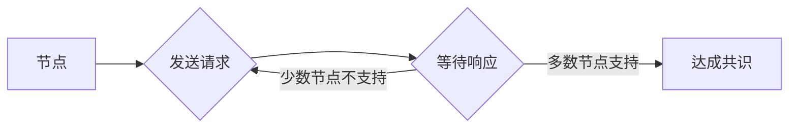

# Quorum机制的最佳实践

> 关键词：Quorum机制，共识算法，分布式系统，性能优化，容错性，一致性，区块链，数据库

## 1. 背景介绍

随着互联网的快速发展，分布式系统在各个领域得到了广泛应用。分布式系统通过将计算和存储资源分散到多个节点上，提高了系统的扩展性和可用性。然而，由于网络延迟、节点故障等原因，分布式系统面临着数据一致性和容错性的挑战。Quorum机制作为一种经典的共识算法，被广泛应用于解决这些问题。本文将深入探讨Quorum机制的最佳实践，包括其核心概念、算法原理、实现步骤、性能优化和实际应用场景。

## 2. 核心概念与联系

### 2.1 Quorum机制概述

Quorum机制是一种基于多数派的共识算法，它通过在多个节点上收集投票结果来达成共识。在Quorum机制中，每个节点在执行某个操作之前，会向一定数量的节点发送请求，并等待这些节点返回相应的投票结果。只有当多数节点投票支持时，该操作才被视为成功。

### 2.2 Mermaid流程图



### 2.3 Quorum机制与一致性

Quorum机制的核心目标是保证一致性。在分布式系统中，一致性是指所有节点对某个数据状态达成共识。Quorum机制通过确保多数节点对操作结果达成一致，从而实现了数据的一致性。

### 2.4 Quorum机制与容错性

Quorum机制也具有较好的容错性。由于Quorum机制依赖于多数派的投票结果，即使部分节点出现故障或恶意行为，只要多数节点是可靠的，系统仍然可以达成共识。

## 3. 核心算法原理 & 具体操作步骤

### 3.1 算法原理概述

Quorum机制的基本原理是：每个节点在执行操作时，会向一定数量的节点发送请求，并等待这些节点返回相应的投票结果。只有当多数节点投票支持时，该操作才被视为成功。

### 3.2 算法步骤详解

1. 节点A发起操作请求。
2. 节点A向N个节点发送请求，其中N满足多数派条件。
3. 节点B、C、D等节点收到请求后，进行本地操作，并返回投票结果。
4. 节点A收集N个节点的投票结果。
5. 如果多数节点投票支持，则操作成功；否则，操作失败。

### 3.3 算法优缺点

**优点**：
- 容错性强：即使部分节点出现故障或恶意行为，只要多数节点是可靠的，系统仍然可以达成共识。
- 可扩展性强：可以通过增加节点数量来提高系统的吞吐量和容错性。

**缺点**：
- 性能开销：每个操作都需要向多个节点发送请求，并等待响应，导致性能开销较大。
- 调度复杂：在节点网络拓扑结构复杂的情况下，调度请求可能比较困难。

### 3.4 算法应用领域

Quorum机制被广泛应用于以下领域：

- 分布式数据库：如Cassandra、MongoDB等。
- 分布式存储系统：如HDFS、Alluxio等。
- 区块链：如以太坊、波场等。

## 4. 数学模型和公式 & 详细讲解 & 举例说明

### 4.1 数学模型构建

Quorum机制可以用以下数学模型进行描述：

$$
Q(n, f) = \begin{cases} 
\frac{n}{2} + 1 & \text{if } f \leq \frac{n}{2} \\
n & \text{if } f > \frac{n}{2} 
\end{cases}
$$

其中，$n$ 为节点总数，$f$ 为副本数量。

### 4.2 公式推导过程

假设有 $n$ 个节点，每个节点存储数据的副本数量为 $f$。要保证数据一致性，至少需要 $Q(n, f)$ 个节点投票支持。

当 $f \leq \frac{n}{2}$ 时，为了保证一致性，至少需要 $\frac{n}{2} + 1$ 个节点投票支持。这是因为，如果有 $f$ 个节点存储同一份数据，那么至少需要 $\frac{n}{2} + 1$ 个节点中的多数派投票支持，才能保证数据的一致性。

当 $f > \frac{n}{2}$ 时，由于每个节点都存储了数据的副本，因此只需要所有节点投票支持即可保证数据的一致性。

### 4.3 案例分析与讲解

假设有5个节点，每个节点存储数据的副本数量为3。要保证数据一致性，至少需要 $Q(5, 3) = 4$ 个节点投票支持。

假设节点A、B、C、D四个节点投票支持，节点E不支持，此时操作成功，数据保持一致。

## 5. 项目实践：代码实例和详细解释说明

### 5.1 开发环境搭建

- 安装Go语言开发环境。
- 安装Git版本控制工具。

### 5.2 源代码详细实现

以下是一个简单的Quorum机制实现示例：

```go
package main

import (
\t"fmt"
\t"math/rand"
\t"sync"
\t"time"
)

type Node struct {
\tid   int
\tvote bool
\tmu   sync.Mutex
}

func (n *Node) Vote(vote bool) {
\tn.mu.Lock()
\tn.vote = vote
\tn.mu.Unlock()
}

func (n *Node) GetVote() bool {
\tn.mu.Lock()
\tdefer n.mu.Unlock()
\treturn n.vote
}

func main() {
\tnodeCount := 5
\tvoteThreshold := 3

\tnodes := make([]Node, nodeCount)
\tfor i := 0; i < nodeCount; i++ {
\t\tnode := Node{id: i}
\t\tnodes[i] = node
\t\tgo func(n Node) {
\t\t\tfor {
\t\t\t\ttime.Sleep(time.Millisecond * 100)
\t\t\t\tvote := rand.Intn(2) == 0
\t\t\t\tn.Vote(vote)
\t\t\t\tfmt.Printf("Node %d voted: %t
", n.id, vote)
\t\t\t}
\t\t}(node)
\t}

\ttime.Sleep(time.Minute)
}
```

### 5.3 代码解读与分析

- `Node` 结构体：表示一个节点，包含节点ID、投票状态和互斥锁。
- `Vote` 方法：设置节点的投票状态。
- `GetVote` 方法：获取节点的投票状态。
- `main` 函数：创建5个节点，每个节点随机投票，并打印投票结果。

### 5.4 运行结果展示

运行程序后，你会看到每个节点随机投票，并打印投票结果。

## 6. 实际应用场景

### 6.1 分布式数据库

Quorum机制在分布式数据库中得到了广泛应用。例如，Cassandra和MongoDB都使用Quorum机制来保证数据的一致性。

### 6.2 分布式存储系统

HDFS和Alluxio等分布式存储系统也使用Quorum机制来保证数据的一致性和容错性。

### 6.3 区块链

以太坊和波场等区块链平台使用Quorum机制来保证账本的一致性。

## 7. 工具和资源推荐

### 7.1 学习资源推荐

- 《分布式系统原理与范型》
- 《区块链技术指南》
- 《分布式数据库原理与系统实现》

### 7.2 开发工具推荐

- Go语言
- Java
- Python

### 7.3 相关论文推荐

- Paxos made simple
- The Part-time Parliament

## 8. 总结：未来发展趋势与挑战

### 8.1 研究成果总结

本文深入探讨了Quorum机制的核心概念、算法原理、实现步骤、性能优化和实际应用场景。通过理论分析和实际案例，展示了Quorum机制在保证分布式系统数据一致性和容错性方面的优势和局限性。

### 8.2 未来发展趋势

未来，Quorum机制的研究将主要集中在以下几个方面：

- 提高性能：通过优化算法和调度策略，降低Quorum机制的性能开销。
- 支持多协议：扩展Quorum机制，支持多种一致性协议和复制策略。
- 集成新技术：将Quorum机制与其他新技术（如区块链、人工智能等）进行集成。

### 8.3 面临的挑战

Quorum机制在应用过程中也面临着一些挑战：

- 性能瓶颈：Quorum机制的性能开销较大，尤其是在高并发场景下。
- 安全性风险：Quorum机制容易受到恶意节点的影响，可能导致数据不一致或安全漏洞。
- 可扩展性限制：Quorum机制的可扩展性受限于节点数量和拓扑结构。

### 8.4 研究展望

随着分布式系统和区块链技术的不断发展，Quorum机制将继续发挥重要作用。未来，我们需要在以下方面进行深入研究：

- 设计更加高效的Quorum机制，降低性能开销。
- 提高Quorum机制的安全性，防止恶意节点的影响。
- 研究Quorum机制在多协议、多拓扑结构下的应用。

## 9. 附录：常见问题与解答

**Q1：Quorum机制与Paxos机制有什么区别？**

A：Quorum机制和Paxos机制都是共识算法，但它们有一些区别。Paxos机制是一种基于少数派的算法，而Quorum机制是一种基于多数派的算法。Paxos机制主要用于选举领导者，而Quorum机制主要用于保证数据一致性。

**Q2：Quorum机制是否适用于所有分布式系统？**

A：Quorum机制适用于大多数分布式系统，但在一些对性能要求较高的场景下，可能需要其他更高效的共识算法。

**Q3：如何提高Quorum机制的性能？**

A：可以通过优化算法和调度策略来提高Quorum机制的性能。例如，可以采用异步通信方式，减少通信延迟；可以使用负载均衡技术，提高节点之间的通信效率。

**Q4：Quorum机制如何保证数据一致性？**

A：Quorum机制通过确保多数节点对操作结果达成一致，从而保证数据的一致性。即使部分节点出现故障或恶意行为，只要多数节点是可靠的，系统仍然可以达成共识。

**Q5：Quorum机制是否适用于区块链？**

A：Quorum机制可以应用于区块链。例如，以太坊就使用了Quorum机制来保证账本的一致性。

---

作者：禅与计算机程序设计艺术 / Zen and the Art of Computer Programming