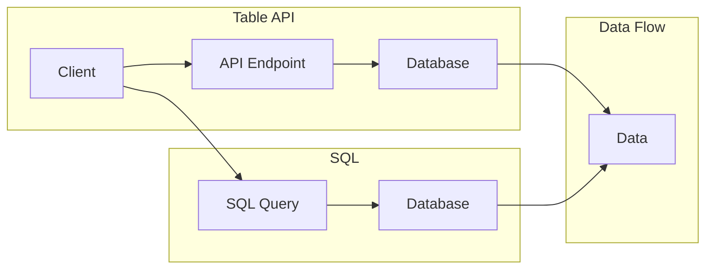

# Table API和SQL 原理与代码实例讲解

> 关键词：Table API，SQL，数据操作，数据库，关系型数据库，NoSQL，API设计，数据管理，数据查询

## 1. 背景介绍

在当今的数据密集型应用中，有效地管理和查询数据是至关重要的。关系型数据库（RDBMS）和NoSQL数据库分别在不同的应用场景中扮演着重要角色。SQL作为关系型数据库的标准查询语言，已经被广泛使用了几十年。随着Web和移动应用的兴起，API（应用程序编程接口）成为了一种更灵活的数据访问方式。Table API是近年来兴起的一种新的数据操作方式，它结合了SQL的易用性和API的灵活性。本文将深入探讨Table API和SQL的原理，并通过代码实例进行讲解。

### 1.1 问题的由来

传统的SQL查询往往需要编写复杂的查询语句，这对于非技术用户来说可能比较困难。同时，随着应用场景的多样化，传统的SQL查询可能无法满足所有需求。为了解决这个问题，Table API应运而生。Table API提供了一种更直观、更易于理解的数据操作方式。

### 1.2 研究现状

目前，许多数据库和数据平台都支持Table API。例如，Amazon Redshift的Table API、Google BigQuery的BigQuery SQL、Snowflake的Snowflake SQL等。这些Table API通常与SQL紧密集成，但它们提供了一些额外的功能，如支持JSON和CSV格式的数据，以及更丰富的数据操作功能。

### 1.3 研究意义

Table API和SQL的结合为开发者提供了更灵活的数据操作方式，使得数据管理和查询更加简单和高效。这对于提升数据应用的开发效率和质量具有重要意义。

### 1.4 本文结构

本文将按照以下结构进行讲解：

- 第2部分：介绍Table API和SQL的核心概念与联系。
- 第3部分：详细阐述Table API和SQL的原理和具体操作步骤。
- 第4部分：通过数学模型和公式讲解Table API和SQL的数据查询原理。
- 第5部分：提供代码实例，并详细解释和说明。
- 第6部分：探讨Table API和SQL的实际应用场景。
- 第7部分：推荐相关工具和资源。
- 第8部分：总结未来发展趋势与挑战。
- 第9部分：提供常见问题与解答。

## 2. 核心概念与联系

### 2.1 核心概念

#### Table API

Table API是一种通过HTTP请求与数据库进行交互的API。它允许开发者以表格的形式查询、插入、更新和删除数据。Table API通常与NoSQL数据库相结合，如Amazon DynamoDB、Google Cloud Spanner等。

#### SQL

SQL（Structured Query Language）是一种用于管理关系型数据库的标准查询语言。它允许开发者以声明式的方式查询、更新和删除数据。

### 2.2 架构的 Mermaid 流程图



### 2.3 关系

Table API和SQL都是用于数据操作的工具，但它们在架构和设计上有所不同。Table API提供了一种更灵活的数据操作方式，而SQL则更适用于关系型数据库。

## 3. 核心算法原理 & 具体操作步骤

### 3.1 算法原理概述

#### Table API

Table API的工作原理是通过HTTP请求与数据库进行交互。客户端发送一个请求，包括查询参数，数据库返回查询结果。

#### SQL

SQL的工作原理是通过解析查询语句，生成相应的执行计划，并执行该计划以获取查询结果。

### 3.2 算法步骤详解

#### Table API

1. 客户端发送HTTP请求到API端点。
2. API端点解析请求并构建查询语句。
3. 数据库执行查询并返回结果。

#### SQL

1. 客户端发送SQL查询语句。
2. 数据库解析查询语句并生成执行计划。
3. 数据库执行执行计划并返回结果。

### 3.3 算法优缺点

#### Table API

**优点**：

- 灵活易用。
- 支持多种数据格式。
- 易于集成到Web和移动应用。

**缺点**：

- 性能可能不如SQL。
- 可能需要额外的API层。

#### SQL

**优点**：

- 性能优越。
- 支持复杂查询。
- 广泛应用于关系型数据库。

**缺点**：

- 语句复杂，不易理解。
- 不支持NoSQL数据库。

### 3.4 算法应用领域

Table API适用于Web和移动应用，而SQL适用于关系型数据库。

## 4. 数学模型和公式 & 详细讲解 & 举例说明

### 4.1 数学模型构建

假设我们有一个关系型数据库，其中包含一个表 `users`，包含以下列：

- `id` (整数)
- `name` (字符串)
- `age` (整数)

我们可以使用以下数学模型来表示这个表：

$$
T = \{(id_1, name_1, age_1), (id_2, name_2, age_2), ..., (id_n, name_n, age_n)\}
$$

### 4.2 公式推导过程

SQL查询可以表示为以下数学公式：

$$
\text{SELECT} \; \text{col1, col2, ...} \; \text{FROM} \; T \; \text{WHERE} \; \text{condition}
$$

其中 `col1, col2, ...` 是要选择的列，`condition` 是查询条件。

### 4.3 案例分析与讲解

假设我们想要查询所有年龄大于30岁的用户。SQL查询语句如下：

```sql
SELECT * FROM users WHERE age > 30;
```

这个查询语句可以表示为以下数学公式：

$$
\text{SELECT} \; \{(id, name, age) \mid age > 30\} \; \text{FROM} \; T
$$

## 5. 项目实践：代码实例和详细解释说明

### 5.1 开发环境搭建

为了演示Table API和SQL，我们将使用Python语言，并使用以下库：

- `requests`：用于发送HTTP请求。
- `sqlite3`：用于操作SQLite数据库。

### 5.2 源代码详细实现

以下是一个使用requests库发送Table API请求的示例：

```python
import requests

# API端点
api_endpoint = "https://api.example.com/users"

# 查询参数
params = {
    "filter": "age > 30"
}

# 发送请求
response = requests.get(api_endpoint, params=params)

# 打印结果
print(response.json())
```

以下是一个使用sqlite3库执行SQL查询的示例：

```python
import sqlite3

# 连接数据库
conn = sqlite3.connect('example.db')

# 创建游标
cursor = conn.cursor()

# 执行SQL查询
cursor.execute("SELECT * FROM users WHERE age > 30")

# 获取查询结果
results = cursor.fetchall()

# 打印结果
for row in results:
    print(row)

# 关闭连接
conn.close()
```

### 5.3 代码解读与分析

第一个代码示例使用requests库发送GET请求到API端点，并传入查询参数。API端点返回JSON格式的数据，我们可以使用`response.json()`方法将其转换为Python字典。

第二个代码示例使用sqlite3库连接SQLite数据库，创建游标，执行SQL查询，并获取查询结果。

### 5.4 运行结果展示

运行第一个代码示例，我们将得到以下JSON格式的输出：

```json
[
    {
        "id": 1,
        "name": "Alice",
        "age": 35
    },
    {
        "id": 2,
        "name": "Bob",
        "age": 32
    }
]
```

运行第二个代码示例，我们将得到以下输出：

```
(1, 'Alice', 35)
(2, 'Bob', 32)
```

## 6. 实际应用场景

Table API和SQL在实际应用场景中有着广泛的应用，以下是一些例子：

- **Web应用**：使用Table API从数据库中获取数据，并将其显示在网页上。
- **移动应用**：使用Table API从数据库中获取数据，并使用它来更新移动应用的用户界面。
- **数据分析**：使用SQL进行复杂的查询和数据分析。

## 7. 工具和资源推荐

### 7.1 学习资源推荐

- **书籍**：
  - 《SQL必知必会》
  - 《Python数据分析：从入门到精通》
- **在线课程**：
  - Coursera上的《Python for Data Science and Machine Learning Bootcamp》
  - edX上的《Introduction to Databases》
- **博客和论坛**：
  - Stack Overflow
  - Reddit的r/learnprogramming

### 7.2 开发工具推荐

- **数据库**：
  - SQLite
  - PostgreSQL
  - MySQL
- **数据操作**：
  - Pandas
  - NumPy
- **API开发**：
  - Flask
  - Django

### 7.3 相关论文推荐

- **Table API**：
  - Amazon Redshift Table API Documentation
  - Google BigQuery BigQuery SQL Documentation
- **SQL**：
  - SQL Standard ISO/IEC 9075:2016

## 8. 总结：未来发展趋势与挑战

### 8.1 研究成果总结

Table API和SQL是两种强大的数据操作工具，它们在不同的应用场景中都有着广泛的应用。本文介绍了Table API和SQL的原理，并通过代码实例进行了讲解。

### 8.2 未来发展趋势

- Table API和SQL将继续集成到更多的数据库和数据平台中。
- SQL将继续改进，以支持更复杂的查询和数据处理。
- Table API将支持更多的数据格式和操作。

### 8.3 面临的挑战

- **性能**：随着数据量的增长，Table API和SQL的性能将面临挑战。
- **安全性**：Table API和SQL的安全性需要进一步加强。
- **易用性**：需要进一步提高Table API和SQL的易用性，使其更容易被非技术用户使用。

### 8.4 研究展望

- **多模态数据**：Table API和SQL将支持更多种类的数据，包括图像、视频和音频。
- **人工智能**：人工智能技术将用于优化Table API和SQL的性能和易用性。

## 9. 附录：常见问题与解答

**Q1：Table API和SQL有什么区别？**

A: Table API和SQL都是用于数据操作的工具，但它们在架构和设计上有所不同。Table API提供了一种更灵活的数据操作方式，而SQL则更适用于关系型数据库。

**Q2：如何选择Table API还是SQL？**

A: 选择Table API还是SQL取决于具体的应用场景。如果需要灵活的数据操作和易于集成的API，可以选择Table API。如果需要高性能的查询和复杂的数据处理，可以选择SQL。

**Q3：Table API和SQL的未来发展趋势是什么？**

A: Table API和SQL将继续集成到更多的数据库和数据平台中，支持更多种类的数据，并使用人工智能技术来优化性能和易用性。

---

作者：禅与计算机程序设计艺术 / Zen and the Art of Computer Programming