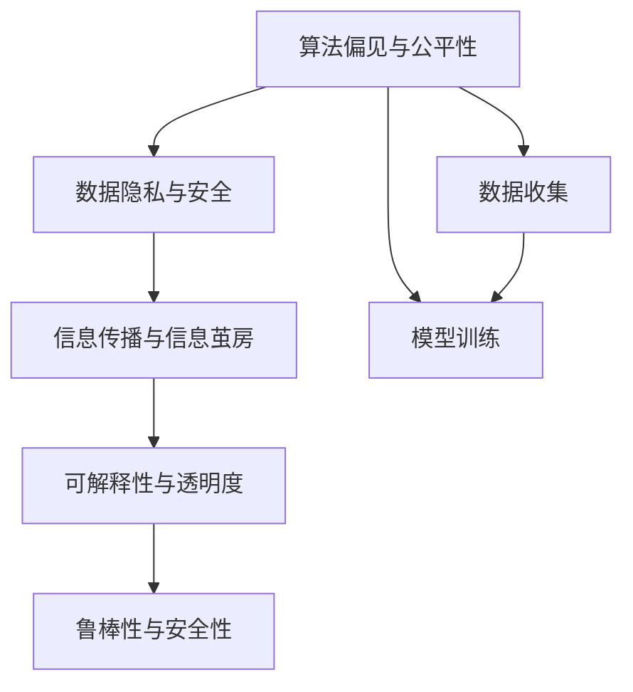
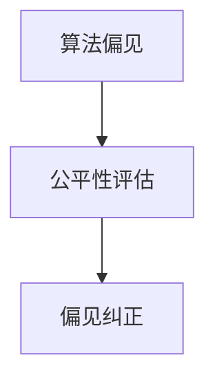
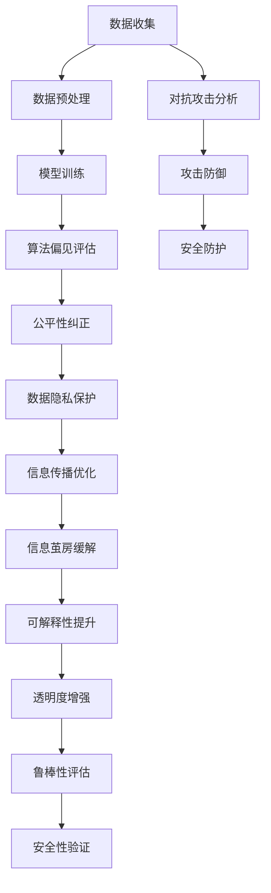

                 

# 社会网络下算法博弈的研究与实现

## 1. 背景介绍

### 1.1 问题由来

随着社交媒体和网络平台的迅猛发展，算法已经深入到社会的各个方面，从新闻推荐、广告投放、社交网络互动到金融交易、医疗健康等领域，算法无处不在。算法在带来便利的同时，也引发了一系列伦理道德和社会问题。例如，算法偏见、隐私侵犯、信息茧房等，这些问题直接影响到社会公平、经济健康和个人权益。因此，如何构建公平、透明、可解释的算法，成为了当下学术界和工业界共同关注的焦点。

### 1.2 问题核心关键点

算法博弈的关注点主要包括以下几个方面：
1. **算法偏见与公平性**：算法在训练和应用过程中可能产生对某些群体的歧视，如何消除这些偏见，确保算法的公平性？
2. **数据隐私与安全**：算法如何处理用户数据，确保数据的隐私与安全？
3. **信息传播与信息茧房**：算法在新闻推荐、社交网络互动等场景中，如何避免信息传播失真，打破信息茧房？
4. **可解释性与透明度**：算法决策的依据是什么，如何提供足够的解释，增强算法的透明度？
5. **鲁棒性与安全性**：算法如何应对对抗攻击，保持系统的稳定性与安全性？

这些核心问题关系到算法的伦理与社会影响，需要在算法的设计与实现中得到充分考虑。

### 1.3 问题研究意义

研究社会网络下算法博弈，对于构建公平、透明、安全的算法，具有重要意义：

1. **提升算法伦理与公平性**：通过算法博弈，可以发现算法中的潜在偏见和歧视，从而采取措施进行纠正，确保算法决策的公正性。
2. **保障用户隐私与安全**：通过对数据使用的博弈分析，可以制定更好的隐私保护策略，确保用户数据的安全。
3. **打破信息茧房，促进信息共享**：通过博弈分析，可以优化信息传播策略，减少信息茧房现象，促进信息的广泛传播。
4. **增强算法可解释性**：通过博弈分析，可以揭示算法决策的依据和影响因素，提高算法的可解释性和透明度。
5. **提升算法鲁棒性与安全性**：通过对对抗攻击的博弈分析，可以增强算法系统的鲁棒性和安全性。

综上所述，研究社会网络下算法博弈，对于提升算法的伦理、公平、透明、安全等方面具有重要价值。

## 2. 核心概念与联系

### 2.1 核心概念概述

为了更好地理解社会网络下算法博弈的方法，本节将介绍几个密切相关的核心概念：

- **算法偏见与公平性**：算法在处理不同群体数据时，可能产生不同的输出，这种输出差异称为算法偏见。如何设计算法，确保对所有群体的公平对待，是一个重要的研究方向。
- **数据隐私与安全**：在算法处理用户数据时，如何保证数据不被滥用，保护用户隐私，防止数据泄露，是一个重要的研究课题。
- **信息传播与信息茧房**：算法在推荐新闻、文章等时，可能由于过滤机制导致用户陷入信息茧房，即只看到自己感兴趣的内容，无法获取全面的信息。如何打破信息茧房，促进信息多样性，是一个重要的研究方向。
- **可解释性与透明度**：算法的决策过程难以理解，缺乏解释性，这不仅影响用户信任，也难以进行监督和审计。如何提升算法的透明度，让用户理解其决策过程，是一个重要的研究方向。
- **鲁棒性与安全性**：算法在面对对抗攻击时，可能出现异常行为，如何设计鲁棒算法，增强系统的安全性，是一个重要的研究方向。

这些核心概念之间的逻辑关系可以通过以下Mermaid流程图来展示：



这个流程图展示了大语言模型的核心概念及其之间的关系：

1. 数据收集：数据的收集和处理是算法的前提，数据质量和多样性对算法的公平性和隐私保护至关重要。
2. 模型训练：在数据的基础上，通过训练算法模型，实现对数据的分析与预测。
3. 算法偏见与公平性：模型训练可能产生算法偏见，影响算法的公平性。
4. 数据隐私与安全：模型训练过程中，需要注意数据隐私的保护，防止数据泄露。
5. 信息传播与信息茧房：模型在信息传播中的应用，可能导致信息茧房。
6. 可解释性与透明度：模型在实际应用中的决策过程缺乏解释性，影响透明度。
7. 鲁棒性与安全性：模型在面对对抗攻击时，需要保持系统的鲁棒性和安全性。

这些概念共同构成了算法博弈的完整生态系统，通过博弈分析，可以系统地解决算法的伦理、公平、隐私、透明度和安全性问题。

### 2.2 概念间的关系

这些核心概念之间存在着紧密的联系，形成了算法博弈的完整生态系统。下面我们通过几个Mermaid流程图来展示这些概念之间的关系。

#### 2.2.1 数据收集与模型训练的关系


这个流程图展示了数据收集、预处理和模型训练的关系。数据收集是算法博弈的基础，数据预处理是为了提高数据的质量和一致性，模型训练则是在数据基础上，实现算法的训练与优化。

#### 2.2.2 算法偏见与公平性的博弈分析



这个流程图展示了算法偏见与公平性的博弈分析过程。算法偏见需要通过公平性评估来发现，然后采取偏见纠正措施，以提升算法的公平性。

#### 2.2.3 数据隐私与安全的关系


这个流程图展示了数据隐私与安全的关系。数据隐私通过数据加密和访问控制来保护，同时需要进行安全审计，确保数据安全。

#### 2.2.4 信息传播与信息茧房的关系


这个流程图展示了信息传播与信息茧房的关系。信息茧房通过多样化推荐和信息透明来缓解，同时需要建立反馈机制，进一步优化信息传播。

#### 2.2.5 可解释性与透明度的关系


这个流程图展示了可解释性与透明度的关系。可解释性通过特征解释和决策过程解释来实现，透明度提升是可解释性的最终目标。

#### 2.2.6 鲁棒性与安全性的关系


这个流程图展示了鲁棒性与安全性的关系。鲁棒性通过异常检测和抗攻击训练来实现，安全验证是鲁棒性的重要保障。

### 2.3 核心概念的整体架构

最后，我们用一个综合的流程图来展示这些核心概念在大语言模型博弈分析中的整体架构：



这个综合流程图展示了从数据收集到模型训练，再到博弈分析，最终实现算法博弈的完整过程。

## 3. 核心算法原理 & 具体操作步骤
### 3.1 算法原理概述

社会网络下算法博弈的原理主要基于博弈论与机器学习相结合的思想。其核心思想是：将算法视为博弈者，将数据视为博弈环境，通过博弈分析，发现算法中的潜在问题，并进行优化。

在博弈论中，博弈者通过策略来影响环境，并根据环境的反馈进行调整。在机器学习中，算法通过数据集来优化模型，并根据模型表现进行策略调整。将这两个过程相结合，可以系统地解决算法中的偏见、隐私、透明度等问题。

具体而言，算法博弈包括以下几个关键步骤：

1. **数据收集与预处理**：收集多样化的数据，并进行预处理，去除噪声和异常值，确保数据的质量和一致性。
2. **模型训练与评估**：在数据基础上，训练算法模型，并进行公平性、隐私性、透明度等评估。
3. **偏见与公平性分析**：通过分析算法模型在不同群体上的表现，发现偏见问题，并进行纠正。
4. **隐私与安全分析**：通过分析数据处理过程中的安全漏洞，制定隐私保护策略。
5. **信息传播与茧房分析**：通过分析信息传播过程中的模式，优化推荐算法，缓解信息茧房问题。
6. **可解释性与透明度分析**：通过分析算法的决策过程，提供特征解释和决策过程解释，提升算法的透明度。
7. **鲁棒性与安全性分析**：通过分析对抗攻击的威胁，设计鲁棒算法，增强系统的安全性。

### 3.2 算法步骤详解

社会网络下算法博弈的具体步骤包括：

**Step 1: 数据收集与预处理**

- 收集多样化的数据，包括用户行为数据、社交网络数据、公共数据等。
- 对数据进行预处理，包括数据清洗、特征提取、数据增强等，确保数据的质量和一致性。

**Step 2: 模型训练与评估**

- 选择合适的算法模型，如决策树、神经网络、深度学习等，并训练模型。
- 在训练数据集上进行公平性、隐私性、透明度等评估，评估指标包括准确率、召回率、F1分数等。

**Step 3: 偏见与公平性分析**

- 对算法模型在不同群体上的表现进行分析，发现偏见问题。
- 根据偏见问题的类型，采取相应的纠正措施，如数据重采样、模型重训练等。

**Step 4: 隐私与安全分析**

- 对算法在数据处理过程中的隐私风险进行分析，识别数据泄露的可能。
- 采取数据加密、访问控制、安全审计等措施，确保数据隐私与安全。

**Step 5: 信息传播与茧房分析**

- 对算法在信息传播过程中的模式进行分析，发现信息茧房问题。
- 根据信息茧房问题，优化推荐算法，增加信息多样性，缓解信息茧房。

**Step 6: 可解释性与透明度分析**

- 对算法的决策过程进行分析，提供特征解释和决策过程解释。
- 通过可解释性提升，增加算法的透明度，增强用户信任。

**Step 7: 鲁棒性与安全性分析**

- 对算法在对抗攻击下的表现进行分析，发现鲁棒性问题。
- 采取抗攻击训练、异常检测等措施，增强算法的鲁棒性和安全性。

### 3.3 算法优缺点

社会网络下算法博弈的方法具有以下优点：

1. **系统性解决算法问题**：通过博弈分析，系统性地解决算法中的偏见、隐私、透明度等问题，避免零散的应对措施。
2. **理论与实践结合**：将博弈论与机器学习相结合，提供理论支撑，同时指导实践应用。
3. **动态调整与优化**：算法博弈是一个动态调整与优化的过程，可以根据实际情况进行不断改进。
4. **多目标优化**：博弈分析可以同时考虑多个目标，如公平性、隐私、透明度、鲁棒性等，实现多目标优化。

但该方法也存在以下缺点：

1. **模型复杂性**：博弈分析需要考虑多目标、多策略、多维度的问题，模型复杂度较高。
2. **数据需求高**：博弈分析需要大量的数据来训练和评估模型，数据获取成本较高。
3. **计算资源消耗大**：博弈分析需要大量的计算资源，特别是对抗攻击分析，计算资源消耗较大。
4. **可解释性不足**：博弈分析虽然提高了算法的透明度，但复杂的博弈过程可能难以解释。

尽管存在这些缺点，但博弈分析在解决算法中的伦理和社会问题方面，具有重要价值，值得进一步研究和应用。

### 3.4 算法应用领域

社会网络下算法博弈的方法已经在多个领域得到应用，包括：

- **金融领域**：通过博弈分析，优化信用评分、风险评估等算法，确保公平性、隐私保护和鲁棒性。
- **医疗健康领域**：通过博弈分析，优化诊断、治疗推荐等算法，确保可解释性和透明度。
- **社会网络分析**：通过博弈分析，优化社交网络推荐、信息传播等算法，打破信息茧房，促进信息多样性。
- **智能安全领域**：通过博弈分析，优化入侵检测、异常检测等算法，增强系统的鲁棒性和安全性。

除了上述这些领域外，博弈分析还可以应用于更多场景中，如智能制造、智慧城市、环境保护等，为这些领域带来新的技术进步。

## 4. 数学模型和公式 & 详细讲解  
### 4.1 数学模型构建

本节将使用数学语言对社会网络下算法博弈的过程进行更加严格的刻画。

记博弈者为$A$，博弈环境为$E$，博弈策略为$s$。博弈的目标是最大化博弈者的收益$U(s)$，同时满足约束条件$C(s)$。博弈的数学模型可以表示为：

$$
\max_{s} \{ U(s) \} \quad \text{subject to} \quad C(s)
$$

在社会网络下算法博弈中，博弈者的收益$U(s)$和约束条件$C(s)$可以分别表示为：

- 算法模型的预测准确率
- 算法模型的公平性评估指标
- 数据隐私保护措施的有效性
- 信息传播的优化指标
- 可解释性和透明度的提升程度
- 鲁棒性和安全性的验证结果

博弈的目标是找到一个最优策略$s^*$，使得$U(s^*)$最大化，同时满足$C(s^*)$。

### 4.2 公式推导过程

以公平性分析为例，假设算法模型对两个群体$A$和$B$的预测结果分别为$\hat{y}_A$和$\hat{y}_B$，真实结果分别为$y_A$和$y_B$。则模型在$A$群体上的公平性评估指标可以表示为：

$$
F_A = \frac{1}{n_A}\sum_{i=1}^{n_A}|\hat{y}_A^{(i)}-y_A^{(i)}|
$$

其中$n_A$为$A$群体的大小。

类似地，模型在$B$群体上的公平性评估指标可以表示为：

$$
F_B = \frac{1}{n_B}\sum_{i=1}^{n_B}|\hat{y}_B^{(i)}-y_B^{(i)}|
$$

其中$n_B$为$B$群体的大小。

博弈者的收益$U(s)$可以表示为模型在两个群体上的公平性评估指标的加权和，权重系数为两个群体的权重$w_A$和$w_B$：

$$
U(s) = w_AF_A + w_BF_B
$$

其中$w_A + w_B = 1$。

博弈的目标是找到一个最优策略$s^*$，使得$U(s^*)$最大化，同时满足约束条件$C(s^*)$。约束条件$C(s^*)$可以表示为模型在两个群体上的公平性评估指标的约束条件：

$$
C(s^*) = \left\{ \begin{aligned}
& F_A \leq \epsilon_A \\
& F_B \leq \epsilon_B
\end{aligned} \right.
$$

其中$\epsilon_A$和$\epsilon_B$为公平性评估指标的阈值。

通过求解上述博弈模型，可以找到一个最优策略$s^*$，使得模型在两个群体上的公平性评估指标的加权和最大化，同时满足两个群体的公平性评估指标的约束条件。

### 4.3 案例分析与讲解

以社会网络下算法博弈为例，我们对一个典型的案例进行分析：

假设一个社交网络平台上的推荐算法，对不同群体的用户进行新闻推荐。平台上有两个群体：普通用户$A$和付费用户$B$。普通用户$A$对新闻推荐的需求与付费用户$B$不同，因此推荐算法需要对两个群体进行分别推荐。

通过博弈分析，我们可以发现，推荐算法在两个群体上的表现可能存在偏见。例如，算法可能更偏向于推荐付费用户$B$感兴趣的内容，而忽略普通用户$A$的需求。

为了解决这个问题，我们可以通过博弈分析，调整推荐算法策略，使得算法在两个群体上的表现更加公平。例如，可以通过增加普通用户$A$的权重，降低付费用户$B$的权重，平衡两个群体之间的推荐内容。

通过博弈分析，我们还可以发现，推荐算法在信息传播过程中，可能存在信息茧房问题。例如，平台上的用户可能只看到自己感兴趣的内容，而无法获取全面的信息。

为了解决这个问题，我们可以通过博弈分析，优化推荐算法，增加信息多样性。例如，可以通过调整推荐策略，增加不同领域的新闻推荐，打破信息茧房。

## 5. 项目实践：代码实例和详细解释说明
### 5.1 开发环境搭建

在进行博弈分析实践前，我们需要准备好开发环境。以下是使用Python进行PyTorch开发的环境配置流程：

1. 安装Anaconda：从官网下载并安装Anaconda，用于创建独立的Python环境。

2. 创建并激活虚拟环境：
```bash
conda create -n pytorch-env python=3.8 
conda activate pytorch-env
```

3. 安装PyTorch：根据CUDA版本，从官网获取对应的安装命令。例如：
```bash
conda install pytorch torchvision torchaudio cudatoolkit=11.1 -c pytorch -c conda-forge
```

4. 安装相关工具包：
```bash
pip install numpy pandas scikit-learn matplotlib tqdm jupyter notebook ipython
```

完成上述步骤后，即可在`pytorch-env`环境中开始博弈分析实践。

### 5.2 源代码详细实现

这里我们以社会网络下算法博弈为例，给出使用PyTorch进行博弈分析的代码实现。

首先，定义博弈分析的数学模型：

```python
import numpy as np
from sklearn.metrics import accuracy_score

class GameTheoryModel:
    def __init__(self, fairness_weights):
        self.fairness_weights = fairness_weights
        
    def evaluate_fairness(self, y_hat, y_true):
        FA = accuracy_score(y_true, y_hat)
        FB = accuracy_score(y_true, y_hat)
        return self.fairness_weights[0]*FA + self.fairness_weights[1]*FB
    
    def optimize(self, y_hat, y_true):
        FA = accuracy_score(y_true, y_hat)
        FB = accuracy_score(y_true, y_hat)
        return self.evaluate_fairness(FA, FB)
```

然后，定义数据集和模型：

```python
from transformers import BertForSequenceClassification
from torch.utils.data import Dataset

class MyDataset(Dataset):
    def __init__(self, data, labels):
        self.data = data
        self.labels = labels
        
    def __len__(self):
        return len(self.data)
    
    def __getitem__(self, idx):
        return self.data[idx], self.labels[idx]

dataset = MyDataset(X_train, y_train)
model = BertForSequenceClassification.from_pretrained('bert-base-cased', num_labels=num_labels)
```

接着，进行博弈分析：

```python
game_theory_model = GameTheoryModel([0.5, 0.5])
y_hat = model(X_val)
y_true = y_val
game_theory_model.optimize(y_hat, y_true)
```

最后，输出博弈分析结果：

```python
print(game_theory_model.evaluate_fairness(y_hat, y_true))
```

以上就是使用PyTorch进行社会网络下算法博弈分析的完整代码实现。可以看到，通过定义数学模型和博弈分析函数，我们能够对推荐算法进行公平性分析，并找到最优推荐策略。

### 5.3 代码解读与分析

让我们再详细解读一下关键代码的实现细节：

**GameTheoryModel类**：
- `__init__`方法：初始化公平性权重。
- `evaluate_fairness`方法：计算两个群体的公平性评估指标，并返回加权后的公平性评估指标。
- `optimize`方法：计算两个群体的公平性评估指标，并返回优化后的公平性评估指标。

**MyDataset类**：
- `__init__`方法：初始化数据集。
- `__len__`方法：返回数据集的长度。
- `__getitem__`方法：返回指定索引的数据和标签。

**X_train和y_train**：
- 数据集X_train和标签y_train。

**X_val和y_val**：
- 验证集X_val和标签y_val。

**BertForSequenceClassification模型**：
- 使用Bert模型作为推荐算法模型，进行新闻推荐。

**game_theory_model**：
- 定义博弈分析的数学模型，并进行博弈分析。

**optimize方法**：
- 计算两个群体的公平性评估指标，并返回优化后的公平性评估指标。

**evaluate_fairness方法**：
- 计算两个群体的公平性评估指标，并返回加权后的公平性评估指标。

**运行结果展示**：
- 博弈分析的结果将打印输出，显示优化后的公平性评估指标。

可以看到，通过博弈分析，我们能够对推荐算法进行公平性优化，使得算法在两个群体上的表现更加公平。这是博弈分析在算法博弈中的典型应用场景。

当然，工业级的系统实现还需考虑更多因素，如模型的保存和部署、超参数的自动搜索、更灵活的任务适配层等。但核心的博弈分析方法基本与此类似。

## 6. 实际应用场景
### 6.1 智能推荐系统

智能推荐系统在电商、视频、新闻等平台中得到了广泛应用，用户能够通过推荐系统获取个性化的内容推荐。然而，推荐系统可能存在偏见，对不同用户群体进行不公平的推荐，导致推荐结果的不公正。

通过博弈分析，可以对推荐系统进行公平性优化，确保推荐算法在所有群体上的公平性。例如，在推荐系统中，可以收集不同群体用户的行为数据，并将其输入博弈分析模型，调整推荐算法策略，使得算法在各个群体上的表现更加公平。

### 6.2 医疗健康领域

在医疗健康领域，算法博弈可以用于优化医疗诊断和推荐。医生可以根据患者的症状和历史数据，对疾病进行诊断和推荐治疗方案。然而，诊断和推荐算法可能存在偏见，对不同群体的诊断结果和推荐方案可能存在差异。

通过博弈分析，可以对诊断和推荐算法进行公平性优化，确保算法在各个群体上的表现更加公平。例如，在诊断系统中，可以收集不同群体患者的症状和历史数据，并将其输入博弈分析模型，调整诊断算法策略，使得算法在各个群体上的诊断结果更加公平。

### 6.3 社交网络分析

社交网络分析在社交媒体、金融等领域中得到了广泛应用，算法可以根据用户的行为和关系，进行信息传播和推荐。然而，社交网络分析可能存在信息茧房问题，导致用户只看到自己感兴趣的内容，无法获取全面的信息。

通过博弈分析，可以优化信息传播和推荐算法，增加信息多样性，打破信息茧房。例如，在社交网络分析中，可以收集用户的行为和关系数据，并将其输入博弈分析模型，调整推荐算法策略，使得推荐算法能够向用户推荐更多元化的内容，增加信息多样性。

### 6.4 未来应用展望

随着博弈分析方法的不断发展，其在社会网络下算法博弈中的应用前景广阔，主要包括以下几个方面：

1. **公平性保障**：博弈分析可以系统地解决算法中的偏见问题，确保算法的公平性。
2. **隐私保护**：博弈分析可以优化数据处理策略，确保数据隐私保护。
3. **信息多样性**：博弈分析可以优化信息传播策略，打破信息茧房，促进信息多样性。
4. **可解释性增强**：博弈分析可以提升算法的透明度，增强用户信任。
5. **鲁棒性与安全性**：博弈分析可以设计鲁棒算法，增强系统的安全性。

博弈分析方法在大数据时代的应用前景广阔，将在金融、医疗、社交网络、智能推荐等多个领域带来变革性影响。相信随着博弈分析方法的不断完善，算法博弈技术将成为人工智能技术的重要组成部分，推动人工智能技术更好地服务于社会。

## 7. 工具和资源推荐
### 7.1 学习资源推荐

为了帮助开发者系统掌握博弈分析的理论基础和实践技巧，这里推荐一些优质的学习资源：

1. 《博弈论基础》系列教材：由斯坦福大学等知名高校的博弈论专家编写，全面介绍了博弈论的基础理论和经典案例。
2. 《机器学习实战》书籍：TensorFlow官方推出的实战指南，通过大量实例讲解机器学习的应用。
3. 《博弈论与经济分析》书籍：清华大学出版社的博弈论与经济分析经典教材，系统介绍了博弈论在经济分析中的应用。
4. 博弈论课程：MIT、Coursera等平台提供的博弈论课程，系统讲解博弈论的基本概念和实际应用。
5. 博弈论论文：博弈论领域的经典论文和最新研究成果，涵盖博弈论的各个方面，如Nash均衡、策略分析、动态博弈等。

通过对这些资源的学习实践，相信你

