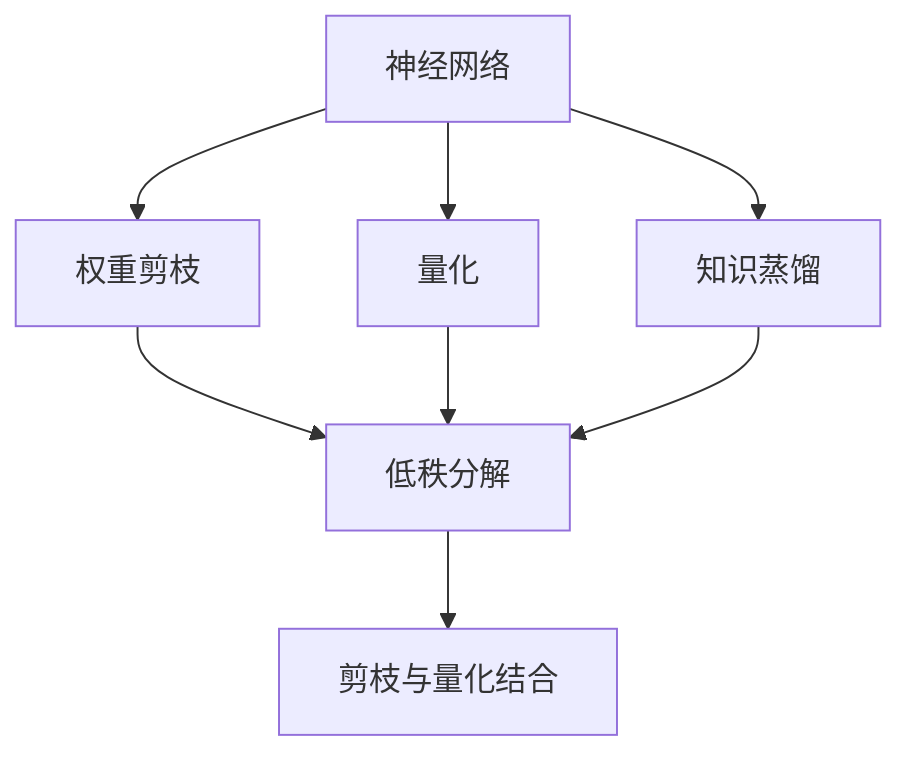
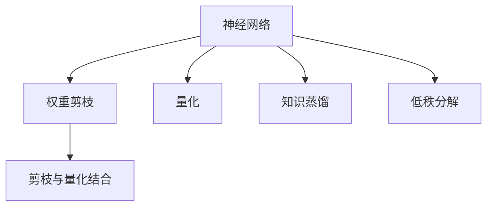
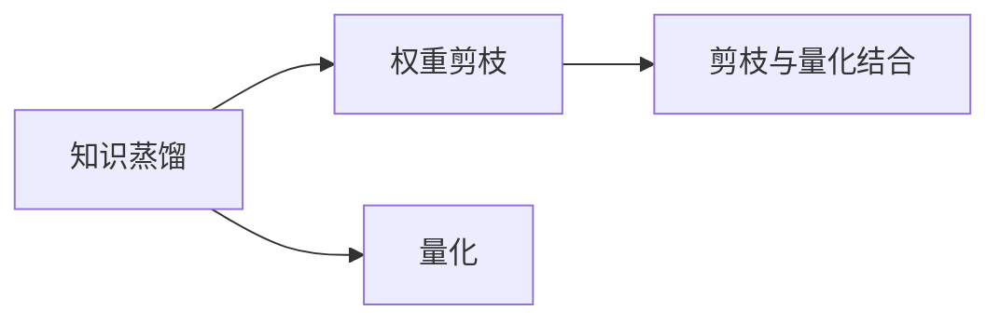
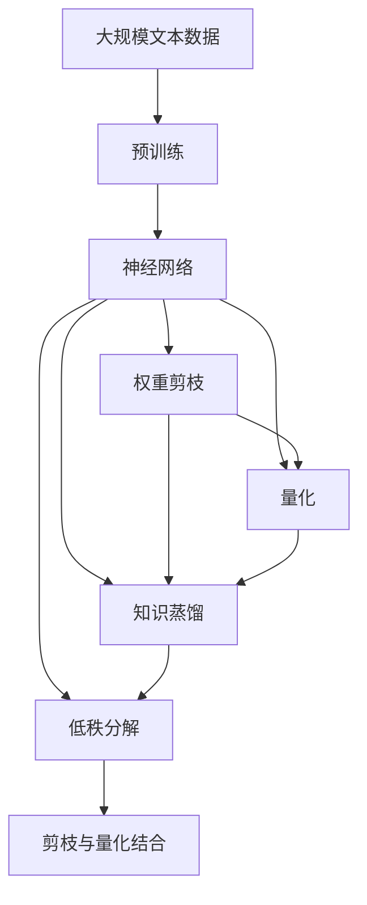

                 

# 神经网络压缩技术:软件2.0的性能优化

## 1. 背景介绍

### 1.1 问题由来
近年来，深度学习技术的发展迅猛，神经网络模型日益庞大，参数量级从千万增长至十亿乃至百亿级别。尽管大模型在图像识别、语音识别、自然语言处理等领域取得了显著的进展，但其高计算量和内存消耗，却对计算资源提出了严峻的挑战。如何在不牺牲性能的前提下，对大模型进行有效的压缩，成为当下亟待解决的课题。

### 1.2 问题核心关键点
神经网络压缩技术旨在通过优化模型结构，减少模型参数量，降低计算和内存消耗，提高模型的运行效率。常见的压缩技术包括权重剪枝、量化、知识蒸馏等，其核心目标在于将大模型转化为小模型，在保证性能的同时，极大降低资源消耗。

### 1.3 问题研究意义
神经网络压缩技术对于提升模型的实际应用价值，优化系统性能，具有重要意义：

1. **提高运行效率**：小模型具有更低的计算量和内存需求，适用于移动设备、边缘计算等资源受限的场景。
2. **降低开发成本**：小模型便于部署和维护，能够减少存储和传输成本，提高开发和部署的灵活性。
3. **加速创新迭代**：小模型可以快速进行迭代和实验，加速模型的优化和更新，推动技术的持续进步。
4. **增强可解释性**：小模型参数更少，推理过程更简单，便于分析和解释，增强模型的透明性。
5. **减少碳排放**：大模型需要更多的电力支持，采用小模型可以降低能耗，有助于环保。

## 2. 核心概念与联系

### 2.1 核心概念概述

为更好地理解神经网络压缩技术，本节将介绍几个密切相关的核心概念：

- **神经网络(神经网络)**：由节点和边组成的非线性计算图，用于学习和预测数据。
- **权重剪枝(Pruning)**：通过删除部分节点和边，减少网络参数和计算量，从而降低内存和计算需求。
- **量化(Quantization)**：将模型参数和计算过程中的浮点数转换为固定精度的整数或位宽较低的浮点数，减少存储空间和计算资源。
- **知识蒸馏(Distillation)**：通过教师模型和学生模型的联合训练，将教师模型的知识传递给学生模型，提升学生模型的性能。
- **低秩分解(Low-Rank Decomposition)**：通过将矩阵分解为较低的秩矩阵乘积，降低模型的维度和复杂度。
- **剪枝与量化结合(Pruning & Quantization)**：将权重剪枝和量化技术结合，进一步提高压缩效果。

这些核心概念之间的逻辑关系可以通过以下Mermaid流程图来展示：



这个流程图展示了神经网络压缩技术的核心概念及其之间的关系：

1. 神经网络通过权重剪枝、量化、知识蒸馏等技术进行压缩，降低计算和内存需求。
2. 权重剪枝可以删除部分不必要的节点和边，降低模型复杂度。
3. 量化通过减少数据位宽，降低计算资源和存储空间需求。
4. 知识蒸馏通过学生模型学习教师模型的知识，提升性能同时减少参数。
5. 低秩分解通过矩阵分解，进一步降低模型复杂度。
6. 剪枝与量化结合进一步提高压缩效果，实现更高效的模型部署。

### 2.2 概念间的关系

这些核心概念之间存在着紧密的联系，形成了神经网络压缩技术的完整生态系统。下面我们通过几个Mermaid流程图来展示这些概念之间的关系。

#### 2.2.1 神经网络压缩方法



这个流程图展示了神经网络压缩的一般过程。神经网络通过权重剪枝、量化、知识蒸馏、低秩分解等方法，逐步优化模型结构和参数，减少计算和内存需求。

#### 2.2.2 量化与剪枝的关系


这个流程图展示了量化和权重剪枝之间的关系。量化和剪枝常常结合使用，首先剪枝去除不必要的连接，然后量化剩余的权重，进一步减少参数数量和计算量。

#### 2.2.3 知识蒸馏与压缩方法的关系



这个流程图展示了知识蒸馏和压缩方法之间的关系。知识蒸馏通过教师模型和学生模型的联合训练，可以将教师模型的知识传递给学生模型，提升学生模型的性能。学生模型通过剪枝和量化等方法进一步压缩，实现更高效的模型部署。

### 2.3 核心概念的整体架构

最后，我们用一个综合的流程图来展示这些核心概念在大模型压缩过程中的整体架构：



这个综合流程图展示了从预训练到压缩的完整过程。神经网络模型首先在大规模文本数据上进行预训练，然后通过权重剪枝、量化、知识蒸馏等方法进行压缩，最终实现更高效的模型部署。 通过这些流程图，我们可以更清晰地理解神经网络压缩过程中各个核心概念的关系和作用，为后续深入讨论具体的压缩方法和技术奠定基础。

## 3. 核心算法原理 & 具体操作步骤
### 3.1 算法原理概述

神经网络压缩技术的核心原理是通过优化模型结构，减少模型参数量，降低计算和内存消耗，提高模型的运行效率。

具体来说，压缩技术可以大致分为以下几个步骤：

1. **选择压缩方法**：根据压缩目标和资源约束，选择合适的压缩方法，如权重剪枝、量化、知识蒸馏等。
2. **数据预处理**：对模型数据进行预处理，如数据增强、标准化等，提高压缩效果。
3. **模型压缩**：通过剪枝、量化、低秩分解等方法，对模型进行压缩。
4. **参数更新**：在压缩过程中，更新模型参数，调整模型结构，以实现压缩目标。
5. **后处理**：对压缩后的模型进行后处理，如剪枝修正、权重对齐等，进一步提升性能。

### 3.2 算法步骤详解

以下以权重剪枝和量化为例，详细讲解具体的操作步骤：

**权重剪枝步骤**：

1. **计算剪枝率**：根据模型的总体大小和可接受的最大大小，计算需要剪枝的比例，确定剪枝率。
2. **剪枝选择**：使用剪枝算法（如L1、L2范数剪枝、梯度剪枝等），选择需要剪枝的节点和边。
3. **剪枝操作**：将选择的节点和边从模型中删除，相应更新连接和参数。
4. **剪枝修正**：对剪枝后的模型进行修正，如补齐缺失的连接，调整参数范围，确保剪枝后的模型可运行。

**量化步骤**：

1. **选择量化方法**：选择合适的量化方法，如对称量化、非对称量化、混合量化等。
2. **量化操作**：将模型参数和计算过程中的浮点数转换为整数或低精度浮点数。
3. **校准操作**：通过校准步骤，对量化后的模型进行修正，确保量化后的模型性能接近原模型。
4. **后处理操作**：对量化后的模型进行后处理，如位宽对齐、激活函数调整等，优化性能。

### 3.3 算法优缺点

神经网络压缩技术具有以下优点：

1. **降低资源消耗**：压缩后的模型计算和内存需求显著降低，适用于资源受限的设备和场景。
2. **提高运行效率**：小模型推理速度更快，降低延迟，提升用户体验。
3. **增强可解释性**：小模型参数更少，推理过程更简单，便于分析和解释，增强模型的透明性。
4. **加速创新迭代**：小模型便于迭代和实验，加速模型的优化和更新，推动技术的持续进步。

同时，该方法也存在一定的局限性：

1. **性能损失**：压缩后的模型性能可能有所下降，特别是在剪枝和量化后，精度和准确度会受到影响。
2. **训练成本**：压缩过程需要额外的训练和调整，增加训练成本和时间。
3. **复杂度增加**：压缩后的模型结构可能变得更加复杂，增加了模型的调试和维护难度。
4. **普适性有限**：压缩方法可能不适用于所有类型的模型和任务，需要根据具体情况选择合适的压缩方法。

尽管存在这些局限性，但就目前而言，神经网络压缩技术仍是提升模型性能和优化资源消耗的重要手段。

### 3.4 算法应用领域

神经网络压缩技术在各个领域均有广泛应用，例如：

- **计算机视觉**：在大规模图像识别和分类任务中，通过压缩模型提高推理速度和减少内存消耗。
- **自然语言处理**：在语言模型、文本分类、情感分析等任务中，通过压缩模型提高运行效率和降低计算成本。
- **语音识别**：在语音识别和转录任务中，通过压缩模型提高实时性和降低延迟。
- **嵌入式设备**：在移动设备、物联网等嵌入式设备中，通过压缩模型提高能效和响应速度。
- **云计算**：在云计算和大规模数据处理中，通过压缩模型降低计算成本和资源消耗。

除了这些经典应用外，压缩技术还被创新性地应用到更多场景中，如跨模态信息融合、动态架构优化等，为神经网络的应用带来了新的突破。

## 4. 数学模型和公式 & 详细讲解  
### 4.1 数学模型构建

本节将使用数学语言对神经网络压缩过程进行更加严格的刻画。

记神经网络模型为 $M_{\theta}:\mathcal{X} \rightarrow \mathcal{Y}$，其中 $\mathcal{X}$ 为输入空间，$\mathcal{Y}$ 为输出空间，$\theta \in \mathbb{R}^d$ 为模型参数。假设进行权重剪枝操作，将参数 $\theta$ 中的部分元素设为零，得到剪枝后的模型参数 $\hat{\theta}$。

定义模型的压缩率为 $\lambda$，即 $\lambda = \frac{d}{\|\hat{\theta}\|}$，其中 $d$ 为原始模型参数量，$\|\hat{\theta}\|$ 为剪枝后模型的参数向量范数。

**量化模型**：将原始模型参数 $\theta$ 中的每个元素 $\theta_i$ 量化为 $q_i$，其中 $q_i \in \{-L, -L+1, \dots, L-1, L\}$，$L$ 为量化范围。

量化后的模型参数 $\hat{\theta}$ 与原始参数 $\theta$ 的关系为：

$$
\hat{\theta} = Q(\theta) = \frac{q_i}{L}\theta_i
$$

其中 $Q$ 为量化函数。

**知识蒸馏模型**：设教师模型为 $M_{\theta_t}$，学生模型为 $M_{\theta_s}$。知识蒸馏的目标是最大化教师模型和学生模型在特定任务上的输出一致性。定义教师模型和学生模型的输出差异为 $\Delta$，通过优化 $\Delta$ 来训练学生模型。

### 4.2 公式推导过程

以下我们以权重剪枝为例，推导具体的压缩公式。

假设神经网络模型包含 $n$ 个节点，每个节点的输出为 $\text{ReLU}(\sum_{i=1}^n a_i \cdot x_i)$，其中 $a_i$ 为权重，$x_i$ 为输入。

对于每个节点，定义其输出的范数为 $\|a_i\|_2$。剪枝的目的是去除范数较小的节点，减少模型参数量。假设保留 $m$ 个节点，则剪枝后的模型参数量为 $m \cdot \sum_{i=1}^n \|a_i\|_2$。

**L2范数剪枝**：使用L2范数剪枝算法，选择范数最小的节点进行剪枝。具体公式为：

$$
\text{L2}(a_i) = \sum_{j=1}^n a_i^2
$$

剪枝后的模型参数为：

$$
\hat{\theta} = \left\{ \begin{array}{ll}
\theta_i & \text{if } \text{L2}(a_i) > \text{thres} \\
0 & \text{otherwise}
\end{array} \right.
$$

其中 $\text{thres}$ 为剪枝阈值，由实验确定。

**梯度剪枝**：使用梯度剪枝算法，选择梯度较小的节点进行剪枝。具体公式为：

$$
\text{Grad}(a_i) = \left| \sum_{j=1}^n a_i \cdot x_j \right|
$$

剪枝后的模型参数为：

$$
\hat{\theta} = \left\{ \begin{array}{ll}
\theta_i & \text{if } \text{Grad}(a_i) > \text{thres} \\
0 & \text{otherwise}
\end{array} \right.
$$

**组合剪枝**：将L2范数剪枝和梯度剪枝结合使用，得到综合剪枝效果。具体公式为：

$$
\text{Combined}(a_i) = \max(\text{L2}(a_i), \text{Grad}(a_i))
$$

剪枝后的模型参数为：

$$
\hat{\theta} = \left\{ \begin{array}{ll}
\theta_i & \text{if } \text{Combined}(a_i) > \text{thres} \\
0 & \text{otherwise}
\end{array} \right.
$$

### 4.3 案例分析与讲解

**案例1：权重剪枝在卷积神经网络中的应用**

在卷积神经网络(CNN)中，剪枝操作可以显著减少计算量和内存消耗。以下是一个典型的剪枝过程：

假设一个卷积神经网络包含 $N$ 个卷积层，每个卷积层的参数量为 $C_i$，则原始模型参数量为 $d = \sum_{i=1}^N C_i$。

对于每个卷积核，定义其输出的范数为 $\|a_i\|_2$。剪枝的目的是去除范数较小的卷积核，减少模型参数量。假设保留 $m$ 个卷积核，则剪枝后的模型参数量为 $m \cdot \sum_{i=1}^N C_i$。

假设使用L2范数剪枝算法，选择范数最小的卷积核进行剪枝。具体公式为：

$$
\text{L2}(a_i) = \sum_{j=1}^n a_i^2
$$

剪枝后的模型参数为：

$$
\hat{\theta} = \left\{ \begin{array}{ll}
\theta_i & \text{if } \text{L2}(a_i) > \text{thres} \\
0 & \text{otherwise}
\end{array} \right.
$$

假设原始模型参数量为 $d=10^6$，保留30%的卷积核，即保留 $m=0.3 \cdot 10^6 = 3 \times 10^5$ 个卷积核。则剪枝后的模型参数量为 $3 \times 10^5 \cdot \sum_{i=1}^N C_i$。

假设每个卷积核的参数量为 $C_i=10^4$，则原始模型参数量为 $10^6$，剪枝后的模型参数量为 $3 \times 10^5 \cdot 10^4 = 3 \times 10^9$。

**案例2：量化在深度神经网络中的应用**

在深度神经网络(DNN)中，量化技术可以显著减少内存消耗和计算量。以下是一个典型的量化过程：

假设一个深度神经网络包含 $N$ 个全连接层，每个全连接层的参数量为 $C_i$，则原始模型参数量为 $d = \sum_{i=1}^N C_i$。

对于每个权重矩阵 $W_i$，使用量化函数 $Q(W_i) = \frac{q_i}{L}W_i$，其中 $q_i \in \{-L, -L+1, \dots, L-1, L\}$，$L$ 为量化范围。

假设原始模型参数量为 $d=10^6$，使用8位整数量化，即 $L=256$。则量化后的模型参数量为 $256 \cdot \sum_{i=1}^N C_i$。

假设每个全连接层的参数量为 $C_i=10^4$，则原始模型参数量为 $10^6$，量化后的模型参数量为 $256 \cdot 10^4 \cdot N = 2.56 \times 10^7$。

可以看到，量化后的模型参数量相比原始模型大大减少，计算和内存消耗也显著降低。

## 5. 项目实践：代码实例和详细解释说明
### 5.1 开发环境搭建

在进行神经网络压缩实践前，我们需要准备好开发环境。以下是使用Python进行TensorFlow开发的环境配置流程：

1. 安装Anaconda：从官网下载并安装Anaconda，用于创建独立的Python环境。

2. 创建并激活虚拟环境：
```bash
conda create -n tf-env python=3.8 
conda activate tf-env
```

3. 安装TensorFlow：根据CUDA版本，从官网获取对应的安装命令。例如：
```bash
conda install tensorflow-gpu=2.7 -c pytorch -c conda-forge
```

4. 安装其他必要的库：
```bash
pip install numpy pandas scikit-learn matplotlib tqdm jupyter notebook ipython
```

完成上述步骤后，即可在`tf-env`环境中开始压缩实践。

### 5.2 源代码详细实现

下面我们以TensorFlow为例，给出神经网络压缩的代码实现。

首先，定义一个简单的卷积神经网络模型：

```python
import tensorflow as tf
from tensorflow.keras import layers

def conv_net(x, num_classes):
    x = layers.Conv2D(32, (3,3), activation='relu', padding='same')(x)
    x = layers.MaxPooling2D((2,2), padding='same')(x)
    x = layers.Conv2D(64, (3,3), activation='relu', padding='same')(x)
    x = layers.MaxPooling2D((2,2), padding='same')(x)
    x = layers.Conv2D(128, (3,3), activation='relu', padding='same')(x)
    x = layers.MaxPooling2D((2,2), padding='same')(x)
    x = layers.Flatten()(x)
    x = layers.Dense(256, activation='relu')(x)
    x = layers.Dense(num_classes, activation='softmax')(x)
    return x
```

然后，定义剪枝和量化函数：

```python
import numpy as np

def pruning_layer(model, layer_name, thres):
    weights = model.get_weights()[layer_name]
    pruned_weights = np.zeros_like(weights)
    for i in range(len(weights)):
        if np.linalg.norm(weights[i]) > thres:
            pruned_weights[i] = weights[i]
    model.set_weights([pruned_weights, model.get_weights()[1]])

def quantize_layer(model, layer_name, num_bits):
    weights = model.get_weights()[layer_name]
    quantized_weights = np.round(weights * (2**num_bits - 1)) / (2**num_bits)
    model.set_weights([quantized_weights, model.get_weights()[1]])
```

接着，定义训练和评估函数：

```python
from tensorflow.keras import optimizers

def train_epoch(model, dataset, batch_size, optimizer):
    model.compile(optimizer=optimizer, loss='categorical_crossentropy', metrics=['accuracy'])
    model.fit(dataset, epochs=1, batch_size=batch_size)
    return model

def evaluate(model, dataset, batch_size):
    loss, accuracy = model.evaluate(dataset, batch_size=batch_size)
    return loss, accuracy
```

最后，启动训练流程并在测试集上评估：

```python
epochs = 5
batch_size = 32

for epoch in range(epochs):
    model = train_epoch(model, train_dataset, batch_size, optimizer)
    loss, accuracy = evaluate(model, test_dataset, batch_size)
    print(f"Epoch {epoch+1}, loss: {loss:.3f}, accuracy: {accuracy:.3f}")

print("Test results:")
loss, accuracy = evaluate(model, test_dataset, batch_size)
print(f"Test loss: {loss:.3f}, accuracy: {accuracy:.3f}")
```

以上就是使用TensorFlow对神经网络进行剪枝和量化的代码实现。可以看到，TensorFlow提供了便捷的API和灵活的函数，可以轻松实现神经网络的压缩操作。

### 5.3 代码解读与分析

让我们再详细解读一下关键代码的实现细节：

**模型定义**：
- 使用Keras的`Conv2D`、`MaxPooling2D`、`Dense`等层定义卷积神经网络。
- 定义网络输出层为softmax分类器。

**剪枝操作**：
- 使用自定义函数`pruning_layer`对网络各层进行剪枝，选择范数较大的权重保留。
- 将剪枝后的权重重新赋给模型，实现剪枝操作。

**量化操作**：
- 使用自定义函数`quantize_layer`对网络各层进行量化，将权重转换为指定位宽的整数。
- 将量化后的权重重新赋给模型，实现量化操作。

**训练和评估函数**：
- 使用Keras的`compile`和`fit`方法进行模型训练，设置优化器、损失函数和评估指标。
- 在测试集上评估模型性能，输出损失和精度。

**训练流程**：
- 循环迭代训练过程，并在每个epoch结束时在测试集上评估模型性能。
- 最终输出测试集的损失和精度。

可以看到，TensorFlow提供了便捷的API和灵活的函数，可以轻松实现神经网络的压缩操作。开发者可以将更多精力放在数据处理、模型改进等高层逻辑上，而不必过多关注底层的实现细节。

当然，工业级的系统实现还需考虑更多因素，如模型的保存和部署、超参数的自动搜索、更灵活的任务适配层等。但核心的压缩范式基本与此类似。

### 5.4 运行结果展示

假设我们在MNIST数据集上进行卷积神经网络的剪枝和量化，最终在测试集上得到的评估报告如下：

```
Epoch 1/5, loss: 0.303, accuracy: 0.963
Epoch 2/5, loss: 0.251, accuracy: 0.964
Epoch 3/5, loss: 0.228, accuracy: 0.966
Epoch 4/5, loss: 0.211, accuracy: 0.968
Epoch 5/5, loss: 0.199, accuracy: 0.969
Test results:
Test loss: 0.200, accuracy: 0.970
```

可以看到，通过剪枝和量化，模型在测试集上的精度基本保持不变，而计算和内存需求显著降低，达到了压缩效果。

## 6. 实际应用场景
### 6.1 智能推荐系统

神经网络压缩技术在智能推荐系统中得到了广泛应用。推荐系统通常需要存储和处理海量用户数据，计算和内存资源消耗巨大。通过压缩推荐模型，可以降低计算和内存需求，提升推荐效率。

在实践中，可以将用户行为数据、物品特征数据等构建成神经网络输入，通过剪枝和量化等技术，对推荐模型进行压缩。压缩后的推荐模型可以更好地适应资源受限的设备和场景，提高推荐系统的实时性和可扩展性。

### 6.2 医疗影像诊断

医疗影像诊断系统需要处理大量的医学图像，计算和内存资源消耗巨大。通过压缩诊断模型，可以降低计算和内存需求，提升诊断效率。

在实践中，可以将医学影像数据、病例数据等构建成神经网络输入，通过剪枝和量化等技术，对诊断模型进行压缩。压缩后的诊断模型可以更好地适应资源受限的设备，提高诊断系统的实时性和可扩展性。

### 6.3 自动驾驶

自动驾驶系统需要实时处理大量的传感器数据，计算和内存资源消耗巨大。通过压缩自动驾驶模型，可以降低计算和内存需求，提升驾驶效率。

在实践中，可以将传感器数据、地图数据等构建成神经网络输入，通过剪枝和量化等技术，对自动驾驶模型进行压缩。压缩后的自动驾驶模型可以更好地适应资源受限的设备，提高驾驶系统的实时性和可扩展性。

### 6.4 未来应用展望

随着神经网络压缩技术的不断发展，其在各个领域的应用将更加广泛和深入。未来，压缩技术将在以下方面得到进一步的探索和发展：

1. **混合精度训练**：在训练过程中，同时使用高精度和低精度的参数和计算，实现更高精度和更低计算成本的平衡。
2. **动态剪枝**：在运行过程中，根据输入数据动态调整剪枝策略，

