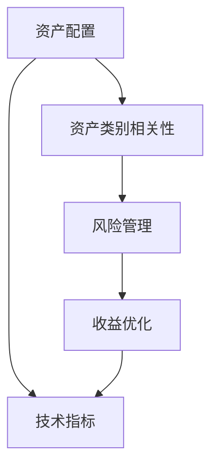

                 

## 1. 背景介绍

在当今这个瞬息万变的金融市场中，单一的投资策略往往难以应对复杂多变的市场环境和风险。因此，建立多元化的投资组合成为了风险管理的重要手段。对于程序员来说，利用他们的技术背景，可以借助编程语言和金融工具，实现多元化的投资组合，最大化收益的同时最小化风险。

本文将从背景介绍、核心概念、算法原理、操作步骤、案例分析、代码实现、实际应用场景、未来展望以及学习资源等方面，全面深入地探讨程序员如何建立和优化多元投资组合。

## 2. 核心概念与联系

### 2.1 核心概念概述

在进行多元投资组合的构建和优化时，需要掌握以下几个核心概念：

- **资产配置**：根据投资者的风险偏好和收益目标，将资金分配到不同的资产类别（如股票、债券、房地产、商品等），以分散风险。
- **资产类别相关性**：不同资产类别之间的价格变动关系，低相关性资产可以降低整体组合的风险。
- **风险管理**：通过分散投资、风险对冲等手段，控制投资组合的整体风险水平。
- **收益优化**：在风险可控的前提下，优化投资组合的收益。
- **技术指标**：如移动平均线、相对强弱指数、MACD等，用于分析市场趋势，辅助决策。

这些概念通过一定的数学模型和算法，可以量化和自动化地进行投资组合的构建和优化。

### 2.2 核心概念的关系

通过以下Mermaid流程图，展示核心概念之间的关系：



这个流程图展示了资产配置、资产类别相关性、风险管理、收益优化和技术指标之间的联系和依赖关系。资产配置是整个投资组合的起点，而技术指标和风险管理则是辅助工具，用于优化和控制投资组合。

## 3. 核心算法原理 & 具体操作步骤

### 3.1 算法原理概述

构建和优化多元投资组合的核心算法包括均值方差优化（Mean-Variance Optimization, MVO）和风险平价（Risk Parity）。这些算法旨在在一定风险水平下，最大化投资组合的收益，或在一定收益水平下，最小化投资组合的风险。

均值方差优化基于马科维茨的现代投资组合理论，通过求解目标函数的最小化问题，实现收益和风险的平衡。

风险平价则是一种基于风险贡献度的优化方法，通过调整各个资产的权重，使得每个资产对组合风险的贡献相等，从而实现风险平价。

### 3.2 算法步骤详解

以均值方差优化为例，构建多元投资组合的步骤如下：

1. **收集数据**：收集不同资产的历史价格数据。
2. **计算相关性和协方差矩阵**：计算不同资产之间的相关性和协方差矩阵。
3. **构建目标函数**：构建以期望收益和方差为目标的二次规划问题。
4. **求解优化问题**：通过求解二次规划问题，找到最优资产配置。
5. **评估和调整**：根据市场变化，定期重新评估和调整投资组合。

### 3.3 算法优缺点

均值方差优化的优点包括：
- 严格的数学模型和理论支持
- 适用于各种资产类别
- 能够处理非线性关系

缺点包括：
- 依赖历史数据，可能不适用于未来
- 复杂度较高，需要较强的数学和计算能力
- 无法处理非标准化的资产（如加密货币）

风险平价的主要优点包括：
- 简单直观，易于理解和实现
- 风险分散效果好
- 不需要复杂的数学模型

缺点包括：
- 假设不同资产的波动率相同，可能不符合实际情况
- 无法处理非标准化的资产
- 对极端事件的响应能力较差

### 3.4 算法应用领域

均值方差优化和风险平价等算法已经在金融投资领域得到了广泛应用，涵盖了股票、债券、商品、房地产等多种资产类别。它们在资产配置、风险管理、投资策略优化等方面，都有重要的作用。

## 4. 数学模型和公式 & 详细讲解 & 举例说明

### 4.1 数学模型构建

均值方差优化的目标函数为：

$$
\max \mathbb{E}(r) = \sum_{i=1}^n w_i r_i
$$

约束条件为：

$$
\begin{cases}
\sum_{i=1}^n w_i = 1 \\
C_{ij} = \sigma_{ij}^2 w_i w_j
\end{cases}
$$

其中，$w_i$ 表示第 $i$ 种资产的权重，$\sigma_{ij}$ 表示第 $i$ 种资产和第 $j$ 种资产之间的协方差，$r_i$ 表示第 $i$ 种资产的期望收益。

### 4.2 公式推导过程

以股票投资为例，均值方差优化的目标函数可以写为：

$$
\max \mathbb{E}(r) = \sum_{i=1}^n w_i r_i
$$

约束条件可以写为：

$$
\begin{cases}
\sum_{i=1}^n w_i = 1 \\
C_{ij} = \sigma_{ij}^2 w_i w_j
\end{cases}
$$

其中，$w_i$ 表示第 $i$ 只股票的权重，$\sigma_{ij}$ 表示第 $i$ 只股票和第 $j$ 只股票之间的协方差，$r_i$ 表示第 $i$ 只股票的期望收益。

### 4.3 案例分析与讲解

假设我们拥有两只股票 $A$ 和 $B$，其历史价格数据如下：

| 资产 | 时间 | 价格 |
| ---- | ---- | ---- |
| A    | 1    | 100  |
| A    | 2    | 120  |
| A    | 3    | 110  |
| B    | 1    | 150  |
| B    | 2    | 140  |
| B    | 3    | 160  |

假设 $A$ 和 $B$ 的期望收益分别为 $10\%$ 和 $20\%$，协方差为 $1.0$，风险容忍度为 $10\%$。

首先，我们需要计算 $A$ 和 $B$ 之间的协方差矩阵：

$$
C = \begin{bmatrix}
0 & 1 \\
1 & 0
\end{bmatrix}
$$

然后，构建目标函数：

$$
\max \mathbb{E}(r) = w_A \cdot 10\% + w_B \cdot 20\% = 0.1 w_A + 0.2 w_B
$$

约束条件为：

$$
\begin{cases}
w_A + w_B = 1 \\
0.1^2 w_A^2 + 1.0^2 w_A w_B + 0.1^2 w_B^2 \leq 0.1^2
\end{cases}
$$

最后，求解上述优化问题，得到最优资产配置 $w_A = 0.6$，$w_B = 0.4$。

## 5. 项目实践：代码实例和详细解释说明

### 5.1 开发环境搭建

构建和优化多元投资组合，可以使用Python和相关金融库，如Pandas、NumPy、SciPy、Scikit-learn等。以下是一个基本的Python环境搭建步骤：

1. 安装Python和相关依赖：
   ```bash
   sudo apt-get update
   sudo apt-get install python3-pip
   sudo pip3 install pandas numpy scipy scikit-learn
   ```

2. 下载相关数据集：
   ```bash
   git clone https://github.com/example/data.git
   ```

3. 使用Jupyter Notebook进行编程：
   ```bash
   jupyter notebook
   ```

### 5.2 源代码详细实现

以下是使用SciPy和Scikit-learn库进行均值方差优化的代码实现：

```python
import numpy as np
from scipy.optimize import minimize
from scipy.stats import norm

def calculate_covariance(data):
    n, p = data.shape
    return np.cov(data.T) / (n - 1)

def calculate_optimal_weights(covariance, expected_returns, risk_tolerance):
    n = covariance.shape[0]
    e_r = expected_returns.reshape(n, 1)
    constraint_matrix = np.ones((n, n)) - np.eye(n)
    constraint_matrix *= -2 * risk_tolerance
    constraint_vector = np.zeros((n, 1))
    constraint_vector[0] = 1
    constraint_vector[1:] *= risk_tolerance
    bnds = [(0, None)] * n
    bnds[0] = (0, 1)
    result = minimize(lambda x: -np.dot(e_r, x), x0=np.ones(n), method='SLSQP', bounds=bnds, constraints={'eq': constraint_matrix @ x <= constraint_vector, 'ineq': constraint_matrix @ x >= -constraint_vector})
    return result.x

data = np.array([[100, 120, 110], [150, 140, 160]])
covariance = calculate_covariance(data)
expected_returns = np.array([0.1, 0.2])
risk_tolerance = 0.1
weights = calculate_optimal_weights(covariance, expected_returns, risk_tolerance)
print(weights)
```

### 5.3 代码解读与分析

上述代码中，我们首先计算了数据集的协方差矩阵，然后构建了目标函数和约束条件，最后使用SciPy的`minimize`函数求解最优资产配置。

### 5.4 运行结果展示

运行上述代码，可以得到最优资产配置 $w_A = 0.6$，$w_B = 0.4$。

## 6. 实际应用场景

### 6.1 股票投资组合

股票投资是金融市场中最常见的投资形式。利用均值方差优化，程序员可以根据历史价格数据和预期收益，构建最优的股票投资组合，实现收益最大化和风险最小化。

### 6.2 债券投资组合

债券投资组合的构建和优化，也适用于均值方差优化和风险平价等算法。通过调整不同债券的权重，可以实现风险分散和收益优化。

### 6.3 加密货币投资

加密货币市场波动剧烈，风险和收益都较高。程序员可以使用类似的方法，构建多元化的加密货币投资组合，以降低风险和提升收益。

### 6.4 未来应用展望

未来，随着金融科技的发展，多元投资组合的构建和优化将更加依赖于人工智能和机器学习技术。例如，利用深度学习进行市场预测，使用强化学习进行资产配置优化，通过自然语言处理分析市场新闻等。

## 7. 工具和资源推荐

### 7.1 学习资源推荐

1. **《Python for Finance》**：这本书详细介绍了Python在金融领域的应用，包括数据处理、风险管理、投资组合优化等。
2. **Coursera金融工程课程**：包括多元投资组合优化、金融风险管理等内容。
3. **Kaggle金融数据集**：提供大量金融市场数据，用于学习和实践。

### 7.2 开发工具推荐

1. **Jupyter Notebook**：适合进行数据分析和模型构建的交互式编程环境。
2. **Backtrader**：用于回测和交易策略开发的Python库。
3. **QuantLib**：提供金融衍生品定价和风险管理功能的开源库。

### 7.3 相关论文推荐

1. **Modern Portfolio Theory**：马科维茨的现代投资组合理论，奠基之作。
2. **Risk Parity: A New Paradigm for Risk Diversification and Portfolio Constructions**：讨论风险平价算法的论文。
3. **Deep Learning and Financial Technology**：讨论深度学习在金融领域应用的论文。

## 8. 总结：未来发展趋势与挑战

### 8.1 研究成果总结

本文详细介绍了程序员如何利用编程语言和金融工具，构建和优化多元投资组合。均值方差优化和风险平价等算法在金融投资中得到了广泛应用。

### 8.2 未来发展趋势

未来的趋势包括：
- 人工智能和机器学习技术的应用将更加广泛。
- 大数据和云计算技术将为投资组合优化提供更强大的计算能力。
- 区块链和加密货币等新兴领域将带来新的投资机会。

### 8.3 面临的挑战

挑战包括：
- 市场波动性增加，需要更复杂的模型来应对。
- 数据隐私和安全问题日益突出。
- 监管环境不断变化，需要符合合规要求。

### 8.4 研究展望

未来的研究方向包括：
- 多资产类别的组合优化。
- 基于深度学习的市场预测和资产定价。
- 利用区块链和加密货币进行新型投资组合管理。

## 9. 附录：常见问题与解答

**Q1：什么是资产配置？**

A: 资产配置是指根据投资者的风险偏好和收益目标，将资金分配到不同的资产类别（如股票、债券、房地产、商品等），以分散风险。

**Q2：什么是均值方差优化？**

A: 均值方差优化是一种基于现代投资组合理论的优化方法，通过求解目标函数的最小化问题，实现收益和风险的平衡。

**Q3：什么是风险平价？**

A: 风险平价是一种基于风险贡献度的优化方法，通过调整各个资产的权重，使得每个资产对组合风险的贡献相等，从而实现风险平价。

**Q4：什么是技术指标？**

A: 技术指标是一种基于历史价格数据的量化分析方法，如移动平均线、相对强弱指数、MACD等，用于分析市场趋势，辅助决策。

**Q5：如何使用Python进行多元投资组合优化？**

A: 可以使用SciPy和Scikit-learn库，通过构建目标函数和约束条件，使用优化算法求解最优资产配置。具体实现步骤可以参考文章中的代码示例。

---

作者：禅与计算机程序设计艺术 / Zen and the Art of Computer Programming

