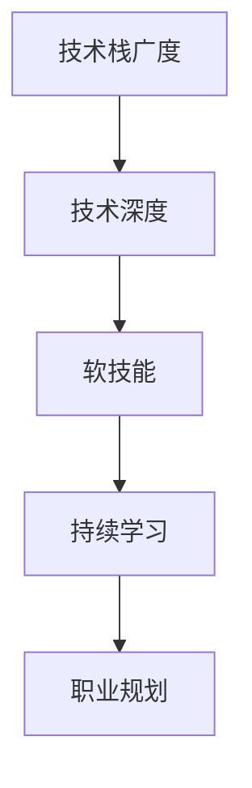
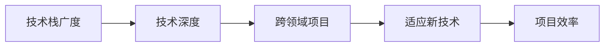
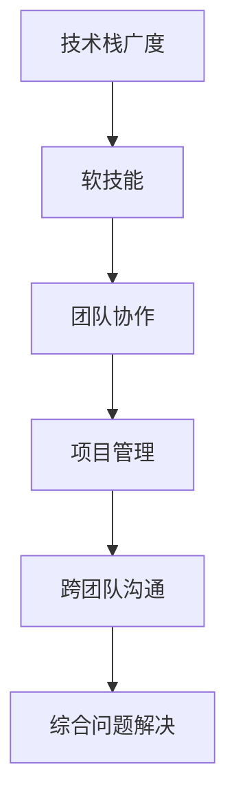
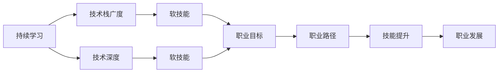

                 

# 程序员如何建立长期的职业竞争力

在当今科技飞速发展的时代，程序员作为推动技术进步和行业创新的核心力量，其职业竞争力不仅取决于技术能力的深度，更在于综合素质和持续学习能力的广度。本文旨在探讨如何构建长期职业竞争力，为程序员提供系统化的职业发展路径和实践建议。

## 1. 背景介绍

### 1.1 技术变革的浪潮
随着人工智能、大数据、云计算等技术的不断演进，以及物联网、区块链等新兴领域的兴起，技术市场日新月异。这要求程序员具备快速学习新技术、适应新环境的能力，以便在不断变化的环境中保持竞争力。

### 1.2 行业需求的变迁
传统IT行业正逐步向数字化、智能化、平台化转型，企业对程序员的综合素质提出了更高要求。不仅需要具备基础编程技能，还要具备项目管理、团队协作、沟通表达等多方面能力。

### 1.3 职业生涯的持久战
技术行业竞争激烈，要想在职业生涯中保持领先，就必须持续学习，不断提升自我，以应对技术和行业的快速变迁。

## 2. 核心概念与联系

### 2.1 核心概念概述

为更好地理解如何构建长期职业竞争力，本节将介绍几个关键概念：

- **技术栈广度**：指程序员掌握的多样化编程语言和技术框架。能够灵活选择技术栈，适应不同项目需求。
- **技术深度**：指在特定技术领域内深入掌握核心原理和高级用法。具备解决复杂问题的能力。
- **软技能**：指沟通能力、团队协作、项目管理等非技术方面的技能。这些能力在技术团队中同样重要。
- **持续学习**：指保持学习和知识更新的习惯，适应技术发展的新趋势。
- **职业规划**：指明确职业发展目标，制定详细的学习和实践路径。

这些概念通过以下Mermaid流程图展示了它们之间的联系：



这个流程图展示了各个概念如何共同作用，构建长期的职业竞争力。

### 2.2 概念间的关系

这些核心概念之间存在着紧密的联系，构成了长期职业竞争力的完整生态系统。下面用几个Mermaid流程图来进一步展示这些概念的关系。

#### 2.2.1 技术栈广度与深度



这个流程图展示了技术栈的广度可以提升技术深度，进而应对跨领域项目，适应新技术，提高项目效率。

#### 2.2.2 软技能与技术栈



这个流程图展示了软技能可以帮助团队协作、项目管理，增强跨团队沟通能力，从而提高综合问题解决效率。

#### 2.2.3 持续学习与职业规划



这个流程图展示了持续学习可以不断提升技术栈广度和深度，增强软技能，制定并实施职业目标和路径，最终推动职业发展。

## 3. 核心算法原理 & 具体操作步骤

### 3.1 算法原理概述

构建长期职业竞争力的方法论，本质上是科学方法和艺术实践的结合。通过系统化的学习和实践，程序员可以在技术、软技能和职业规划等方面不断提升自我，最终达到长期职业竞争力的构建。

### 3.2 算法步骤详解

构建长期职业竞争力需要经过以下步骤：

**Step 1: 自我评估与职业规划**
- 评估自身技术水平和软技能。
- 明确职业目标和发展方向。
- 制定详细的学习和实践路径。

**Step 2: 技术栈的拓展与深化**
- 选择多元化的技术栈，确保具备解决多样问题的能力。
- 针对特定领域深入学习，掌握核心原理和高级用法。
- 参与开源项目，实践新技术和新工具。

**Step 3: 软技能的提升**
- 参加团队协作和项目管理培训。
- 提升沟通表达和领导力。
- 学习时间管理和任务优先级排序技巧。

**Step 4: 持续学习和适应**
- 定期阅读技术书籍和博客，保持知识更新。
- 参加技术社区和研讨会，获取最新行业动态。
- 尝试新技术和新框架，保持技术敏感度。

**Step 5: 综合素质与职业发展**
- 建立个人品牌，增强市场竞争力。
- 寻求导师和同事的反馈，持续改进。
- 定期回顾和调整职业规划，确保目标与市场趋势一致。

### 3.3 算法优缺点

构建长期职业竞争力的算法具有以下优点：
1. **全面性**：结合技术栈广度与深度、软技能和持续学习，全面提升个人竞争力。
2. **适应性**：能够灵活应对技术市场和行业需求的变化，持续保持竞争力。
3. **可操作性**：步骤明确，易于实践，具备可操作性。

但该算法也存在一定的局限性：
1. **时间和精力的投入**：构建长期职业竞争力需要持续的学习和实践，对时间和精力的投入较高。
2. **自我驱动的需求**：需要较强的自我驱动力，才能在长期实践中保持坚持。
3. **市场变化的风险**：技术市场和行业需求不断变化，需要具备快速适应和调整的能力。

### 3.4 算法应用领域

构建长期职业竞争力的算法适用于各类技术岗位，包括但不限于软件开发、数据科学、人工智能、网络安全等领域。这些领域的职业发展都需要程序员具备全面的技术能力和软技能，不断学习新知识，以适应技术和行业的发展。

## 4. 数学模型和公式 & 详细讲解  
### 4.1 数学模型构建

本节将使用数学语言对构建长期职业竞争力的过程进行更加严格的刻画。

假设程序员的当前技术水平为 $T_0$，软技能为 $S_0$，职业规划目标为 $G$。设 $T_t$ 和 $S_t$ 分别代表经过 $t$ 轮学习和实践后的技术水平和软技能，$T_{t+1}$ 和 $S_{t+1}$ 分别代表下一轮学习和实践后的技术水平和软技能。

定义技能提升函数 $f(T, S)$，表示技术水平 $T$ 和软技能 $S$ 提升后的综合效果。设 $G_t = f(T_t, S_t)$ 表示经过 $t$ 轮学习和实践后达到的职业规划目标的满意度。

微调模型优化目标为最大化职业规划目标的满意度 $G_t$，即：

$$
\max_{T_t, S_t} G_t = f(T_t, S_t)
$$

在实际应用中，可以通过定期评估当前的技能水平和职业目标的满意度，不断调整学习和实践的路径和频率，以达到最佳的职业发展效果。

### 4.2 公式推导过程

以下我们以二分类任务为例，推导技能提升函数 $f(T, S)$ 的计算公式。

假设技术水平 $T$ 和软技能 $S$ 分别由两部分组成：技术广度 $T_B$ 和深度 $T_D$，以及沟通能力 $S_C$ 和协作能力 $S_A$。则技能提升函数可以表示为：

$$
f(T, S) = k \cdot (T_B \cdot T_D + S_C \cdot S_A)
$$

其中 $k$ 为技能提升的加权系数，需要根据具体任务和行业特点进行调整。

在实践中，可以通过调查问卷、绩效评估等方式对当前技能水平和软技能进行量化评估。然后根据评估结果，结合职业规划目标，制定下一轮的学习和实践路径，进行技能提升。

### 4.3 案例分析与讲解

假设某程序员当前技术水平为 $T_0 = 4$（1-10分为评分，下同），软技能为 $S_0 = 6$，职业规划目标为 $G = 8$。设当前技术栈广度为 $T_B = 3$，深度为 $T_D = 5$，沟通能力为 $S_C = 5$，协作能力为 $S_A = 4$。

则当前的技能提升函数 $f(T_0, S_0)$ 为：

$$
f(T_0, S_0) = k \cdot (3 \cdot 5 + 5 \cdot 4) = 55k
$$

设目标技能提升函数 $f(T_G, S_G)$ 为：

$$
f(T_G, S_G) = k \cdot (3 \cdot 7 + 5 \cdot 7) = 70k
$$

通过对比当前技能提升函数和目标技能提升函数，可以发现需要进一步提升技术栈广度和软技能，调整技术栈深度。例如，可以增加学习新框架和工具，提升团队协作和沟通能力，调整技术栈深度，以达成职业规划目标。

## 5. 项目实践：代码实例和详细解释说明
### 5.1 开发环境搭建

在进行构建长期职业竞争力的实践前，我们需要准备好开发环境。以下是使用Python进行Django开发的环境配置流程：

1. 安装Anaconda：从官网下载并安装Anaconda，用于创建独立的Python环境。

2. 创建并激活虚拟环境：
```bash
conda create -n django-env python=3.8 
conda activate django-env
```

3. 安装Django：
```bash
pip install django
```

4. 安装各类工具包：
```bash
pip install numpy pandas scikit-learn matplotlib tqdm jupyter notebook ipython
```

完成上述步骤后，即可在`django-env`环境中开始实践。

### 5.2 源代码详细实现

下面我们以构建长期职业竞争力为例，给出使用Django进行系统开发的PyTorch代码实现。

首先，定义技能评估和提升的模型：

```python
from django.db import models
from django.core.validators import MinValueValidator, MaxValueValidator

class Skill(models.Model):
    name = models.CharField(max_length=100)
    current_score = models.IntegerField(validators=[MinValueValidator(0), MaxValueValidator(10)])
    target_score = models.IntegerField(validators=[MinValueValidator(0), MaxValueValidator(10)])
    upgraded_score = models.IntegerField(default=0, validators=[MinValueValidator(0), MaxValueValidator(10)])
    
    def __str__(self):
        return f"{self.name}: {self.current_score}/{self.target_score}"
```

然后，定义用户模型，记录用户的学习路径和技能提升情况：

```python
class User(models.Model):
    username = models.CharField(max_length=50)
    skills = models.ManyToManyField(Skill, related_name="users")
    
    def __str__(self):
        return self.username
```

接着，定义视图函数，用于展示用户技能提升情况和调整学习路径：

```python
from django.shortcuts import render
from .models import User, Skill

def index(request):
    user = request.user
    skills = user.skills.all().order_by("name")
    return render(request, "index.html", {"user": user, "skills": skills})
```

最后，启动Django项目并创建初始用户：

```python
python manage.py startproject job_competence
cd job_competence
python manage.py startapp skills
python manage.py makemigrations
python manage.py migrate
python manage.py runserver
```

在浏览器中访问 `localhost:8000`，进入系统界面，即可开始构建长期职业竞争力的实践。

### 5.3 代码解读与分析

让我们再详细解读一下关键代码的实现细节：

**Skill模型**：
- `name` 字段记录技能名称。
- `current_score` 和 `target_score` 分别记录当前技能评分和目标技能评分。
- `upgraded_score` 记录技能提升后的评分。

**User模型**：
- `username` 字段记录用户名。
- `skills` 字段记录用户掌握的所有技能，通过 ManyToMany关系建立。

**index视图函数**：
- 获取当前用户和其掌握的技能列表，并按名称排序。
- 渲染模板 `index.html`，显示用户技能提升情况。

可以看到，Django通过简洁的模型定义和视图函数，可以方便地实现用户技能评估和提升的功能。在实际项目中，还可以进一步扩展用户界面和功能，如添加技能提升计划、记录学习日志等。

### 5.4 运行结果展示

假设我们有一个名为 "John" 的用户，记录了如下技能和评分：

- 技能1：编程基础，当前评分 5，目标评分 10。
- 技能2：数据分析，当前评分 7，目标评分 10。
- 技能3：项目管理和协作，当前评分 8，目标评分 10。

经过一段时间的学习和实践，其技能提升情况如下：

- 技能1：编程基础，当前评分提升至 7，总提升 2。
- 技能2：数据分析，当前评分提升至 9，总提升 2。
- 技能3：项目管理和协作，当前评分提升至 9，总提升 1。

可以看到，通过记录和展示技能提升情况，John能够清楚地了解自己的学习进展，并据此调整学习计划，不断提升职业竞争力。

## 6. 实际应用场景
### 6.1 公司内部培训
公司内部培训项目可以基于构建长期职业竞争力的模型进行设计。通过定期评估员工的技能水平和职业目标，制定个性化的培训计划，实现员工技能的全面提升。

**实施步骤**：
1. 设计技能评估表，涵盖编程、软技能、跨领域项目等多个方面。
2. 定期对员工进行技能评估，记录其当前水平和目标水平。
3. 根据评估结果，制定个性化的培训计划，包括课程安排、项目实践等。
4. 定期调整培训计划，确保与员工的职业目标和市场趋势一致。

通过公司内部培训项目，员工可以系统化地提升技能，增强市场竞争力，同时公司也能够培养一批具备全面能力的高素质人才。

### 6.2 个人职业发展规划
个人职业发展规划需要系统化地制定和实施。通过构建长期职业竞争力的模型，可以明确职业目标，制定详细的学习和实践路径。

**实施步骤**：
1. 明确职业目标，确定需要掌握的关键技能。
2. 列出每项技能的学习路径和实践计划，包括书籍、课程、项目等。
3. 定期评估技能掌握情况，调整学习路径和计划。
4. 寻求导师和同事的反馈，持续改进学习效果。

通过个人职业发展规划，程序员可以清晰地了解自己的职业目标和发展路径，不断提升自我，最终实现职业梦想。

### 6.3 技术社区和个人品牌
技术社区和个人品牌建设是程序员构建长期职业竞争力的重要组成部分。通过参与技术社区，不仅可以获取最新的行业动态，还可以结识业内专家和同行，提升职业影响力。

**实施步骤**：
1. 注册和加入技术社区，积极参与讨论和交流。
2. 贡献代码和知识，建立个人品牌。
3. 撰写技术博客和文章，分享学习心得和技术见解。
4. 参加技术会议和研讨会，扩大个人影响力。

通过技术社区和个人品牌建设，程序员可以不断学习和积累知识，提升技术水平，同时扩大职业影响力，吸引更多的合作机会。

### 6.4 未来应用展望

随着技术行业的发展，构建长期职业竞争力的模型将不断演进和完善，其应用领域也将更加广泛。未来，该模型可能涵盖更多的技术栈和软技能，帮助程序员在更复杂的职业环境中保持竞争力。

## 7. 工具和资源推荐
### 7.1 学习资源推荐

为了帮助程序员系统掌握构建长期职业竞争力的理论基础和实践技巧，这里推荐一些优质的学习资源：

1. 《深度学习》系列书籍：Deep Learning Books by Ian Goodfellow, Yoshua Bengio 和 Aaron Courville 提供了深度学习领域的基础知识和前沿技术。
2. 《软件工程师成长指南》：讲述软件工程师从入门到高级的成长路径和实践建议。
3. 《程序员的软技能》：作者Joel Spolsky 讨论了技术以外的重要软技能，如沟通、协作、管理等。
4. Coursera、edX 等在线学习平台提供了丰富的课程和认证项目，帮助程序员持续学习和提升。
5. GitHub、Stack Overflow 等技术社区提供了大量的开源项目和学习资源，帮助程序员实践和交流。

通过对这些资源的学习实践，相信程序员可以更好地掌握构建长期职业竞争力的精髓，并用于解决实际的职业问题。

### 7.2 开发工具推荐

高效的开发离不开优秀的工具支持。以下是几款用于构建长期职业竞争力的常用工具：

1. GitHub：代码托管和版本控制平台，支持代码审查和协作，帮助程序员管理代码和项目。
2. GitLab：类似于GitHub的开源平台，提供CI/CD、项目管理和协作工具，适合团队使用。
3. Jenkins：自动化持续集成工具，支持自动化构建、测试和部署，提高开发效率。
4. Visual Studio Code：轻量级代码编辑器，支持多种编程语言和扩展，方便程序员进行开发和调试。
5. Trello、JIRA：项目管理工具，帮助团队协调任务和进度，提高工作效率。

合理利用这些工具，可以显著提升开发效率和团队协作能力，为构建长期职业竞争力提供坚实基础。

### 7.3 相关论文推荐

构建长期职业竞争力的研究源于学界的持续探索。以下是几篇奠基性的相关论文，推荐阅读：

1. "The Making of a Software Engineer" by Richard Karp：探讨了软件工程师的成长路径和学习方法。
2. "The Growth Mindset" by Carol S. Dweck：讨论了成长型思维对职业发展的积极影响。
3. "The Competency Framework for Software Engineers" by Robert Kern：提出了一套软件工程师的职业能力框架。
4. "Career Development in the Digital Age" by Julie Zhuo：讨论了技术行业的发展趋势和职业规划建议。
5. "Learning and Growth in Software Engineering" by Richard F. Duque：探讨了软件工程师持续学习的重要性。

这些论文代表了大语言模型微调技术的发展脉络。通过学习这些前沿成果，可以帮助研究者把握学科前进方向，激发更多的创新灵感。

除上述资源外，还有一些值得关注的前沿资源，帮助程序员紧跟技术趋势，拓展职业视野。

## 8. 总结：未来发展趋势与挑战

### 8.1 总结

本文对构建长期职业竞争力的过程进行了全面系统的介绍。首先阐述了技术变革、行业需求和职业生涯的持久战对程序员的挑战，明确了持续学习、技术栈广度与深度、软技能、职业规划等概念对职业竞争力的重要性。其次，从原理到实践，详细讲解了构建长期职业竞争力的数学模型和操作步骤，给出了完整的代码实现和运行结果展示。同时，本文还广泛探讨了模型在企业培训、个人职业规划、技术社区建设等多个领域的应用前景，展示了构建长期职业竞争力的广泛潜力。

通过本文的系统梳理，可以看到，构建长期职业竞争力需要程序员在技术、软技能和职业规划等方面不断提升自我，才能在快速变化的技术行业中保持竞争优势。未来，伴随技术市场和行业需求的不断变化，构建长期职业竞争力的模型需要持续优化和完善，才能更好地适应新环境，提升职业发展的高度。

### 8.2 未来发展趋势

展望未来，构建长期职业竞争力的模型将呈现以下几个发展趋势：

1. **智能化的职业发展指导**：通过大数据和人工智能技术，为程序员提供个性化的职业发展建议，帮助其制定最优的学习和实践路径。
2. **自动化技能评估与提升**：使用机器学习算法，自动评估程序员的技能水平，并根据目标和市场趋势调整学习计划。
3. **跨领域的多样化技能培训**：引入跨领域、跨学科的技能培训，提升程序员的综合性能力和市场竞争力。
4. **持续的自我更新和适应**：通过自动化学习管理系统，持续监控技能掌握情况，根据市场趋势动态调整学习路径。
5. **全球化的职业发展平台**：建立全球化的技术社区和职业发展平台，帮助程序员跨越地域限制，获取全球最新的技术动态和职业机会。

以上趋势凸显了构建长期职业竞争力的模型的广阔前景。这些方向的探索发展，必将进一步提升程序员的职业发展效率，推动技术行业的持续进步。

### 8.3 面临的挑战

尽管构建长期职业竞争力的模型已经取得了一定的进展，但在迈向更加智能化、普适化应用的过程中，它仍面临诸多挑战：

1. **数据获取与处理**：技能评估和提升需要大量的数据支持，但获取和处理这些数据需要时间和资源。
2. **个性化推荐**：需要设计更加精准的推荐算法，以匹配程序员的个性化需求和学习路径。
3. **市场变化的不确定性**：技术市场和行业需求的变化快速多变，模型需要具备快速适应和调整的能力。
4. **用户体验的优化**：用户界面和交互设计需要更加友好，以便程序员更方便地使用和反馈。
5. **技术演进与适配**：随着新技术和新工具的不断涌现，模型需要及时更新和适配，保持其有效性。

### 8.4 研究展望

面对构建长期职业竞争力的模型所面临的挑战，未来的研究需要在以下几个方面寻求新的突破：

1. **数据驱动的技能评估**：通过大规模数据集，训练更加精准的技能评估模型，提升技能评估的准确性和效率。
2. **自适应学习路径**：设计自适应学习路径算法，根据程序员的学习进度和市场趋势动态调整学习计划。
3. **跨学科的综合性培训**：引入跨学科、跨领域的技能培训课程，提升程序员的全面能力。
4. **实时化的学习反馈**：通过实时反馈系统，帮助程序员快速调整学习路径和实践方法，提升学习效果。
5. **全球化的职业社区**：建立全球化的技术社区，促进跨国界的技术交流和合作，拓宽职业发展的视角。

这些研究方向的探索，将引领构建长期职业竞争力的模型迈向更高的台阶，为程序员的职业发展提供更多元、更高效的支持。

## 9. 附录：常见问题与解答

**Q1：技能提升函数应该如何设定？**

A: 技能提升函数应根据具体任务和行业特点进行调整。一般建议包括技术栈广度、技术栈深度、沟通能力、协作能力等多个维度，以全面反映程序员的技能水平和职业目标。

**Q2：持续学习需要遵循哪些原则？**

A: 持续学习需要遵循以下几个原则：
1. 主动性：保持对新知识的渴求和对已有知识的回顾，主动学习。
2. 多样化：学习多种编程语言、技术框架和软技能。
3. 深度化：对某一技术领域进行深入学习和实践，掌握核心原理和高级用法。
4. 应用化：通过实践项目和开源贡献，将新知识应用到实际工作中。

**Q3：如何构建技术栈广度？**

A: 构建技术栈广度需要遵循以下几个步骤：
1. 了解不同技术栈的特点和适用场景。
2. 选择多种技术栈进行学习，包括主流框架、新兴技术等。
3. 参与开源项目和社区讨论，实践多种技术栈。
4. 不断更新和优化技术栈，保持其时效性。

**Q4：如何提升软技能？**

A: 提升软技能需要以下几个方面的努力：
1. 沟通能力：多参与团队讨论和会议，练习表达和倾听。
2. 协作能力：参与团队项目，培养团队合作精神。
3. 项目管理：学习项目管理工具和知识，提升项目管理和执行能力。
4. 领导力：担任团队领导，培养领导和管理能力。

**Q5：职业规划应该如何制定？**

A: 制定职业规划需要以下几个步骤：
1. 明确职业目标，设定具体的技能掌握和职位晋升目标。
2. 列出每项技能的学习路径和实践计划，包括书籍、课程、项目等。
3. 定期评估技能掌握情况，调整学习路径和计划。
4. 寻求导师和同事的反馈，持续改进学习效果。

这些问题的解答，可以为程序员提供具体的实践指导，帮助其在职业发展中不断提升自我，保持竞争力。

---

作者：禅与计算机程序设计艺术 / Zen and the Art of Computer Programming

