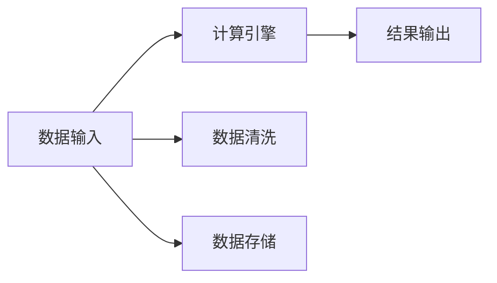
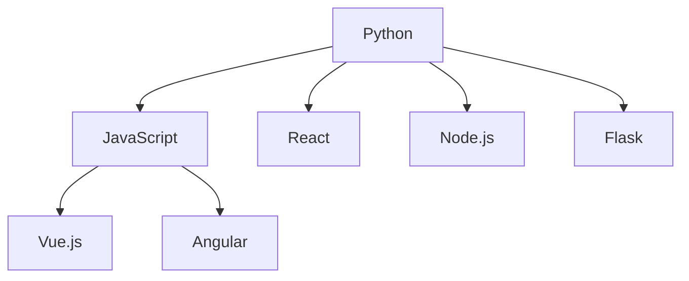
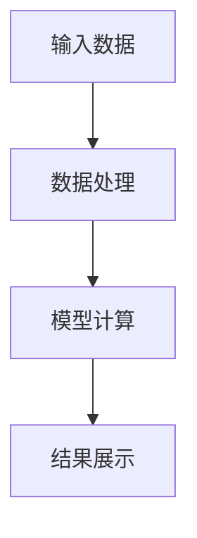

                 

# 程序员的财务自由计算器开发

> 关键词：
> 财务自由计算器, Python, 金融理财, 程序员职业规划, 自动化编程

## 1. 背景介绍

### 1.1 问题由来
随着互联网和金融科技的发展，越来越多的人意识到编程在金融领域的应用潜力。然而，传统的金融理财软件大多依赖于复杂的数学模型和人工操作，难以满足程序员群体对自动化和精准计算的需求。

程序员需要一款能够自动化、精准计算财务自由状态的计算器，来帮助他们规划职业路径、估算资产配置、评估投资回报等。该计算器应具备以下特点：
1. 自动化：通过编程实现自动计算，无需手动输入和调整。
2. 精准性：提供基于复杂数学模型的精准计算，避免人为误差。
3. 易用性：界面友好，功能丰富，易于学习和使用。

### 1.2 问题核心关键点
本项目旨在开发一款专门针对程序员群体的财务自由计算器。它不仅要满足通用财务计算的需求，还要结合程序员职业特点，提供个性化的理财建议。

项目的关键点包括：
1. 设计简单易用的用户界面，支持程序员常用的编程语言和框架。
2. 实现自动化财务计算，提供精准的财务自由状态评估。
3. 结合程序员职业特点，提供针对性的理财建议。

## 2. 核心概念与联系

### 2.1 核心概念概述

为更好地理解财务自由计算器的开发过程，本节将介绍几个密切相关的核心概念：

- 财务自由(Financial Independence)：指个人或家庭的收入主要来源于投资而非工作，能够自由选择生活方式和职业路径。
- 财务自由计算器：用于计算财务自由状态的软件工具，通过输入个人财务信息，自动计算财务自由实现的可能性。
- 程序员：从事软件开发、系统架构、数据库管理等编程相关工作的专业人士。
- 编程语言和框架：Python、JavaScript、React等广泛使用的编程语言和前端框架。
- 自动化计算：通过编程实现数据处理和计算，避免手工操作带来的错误。
- 精准性：通过算法优化和数学模型选择，保证计算结果的准确性。
- 用户界面(UI)：设计友好的界面，使用户能够轻松输入数据和查看结果。

这些核心概念之间的逻辑关系可以通过以下Mermaid流程图来展示：

```mermaid
graph TB
    A[程序员] --> B[财务自由状态]
    B --> C[财务自由计算器]
    C --> D[编程语言和框架]
    C --> E[自动化计算]
    C --> F[精准性]
    C --> G[用户界面(UI)]
```

这个流程图展示了一款财务自由计算器如何通过编程语言和框架实现自动化计算，结合精准性和友好的用户界面，帮助程序员实现财务自由的总体逻辑。

### 2.2 概念间的关系

这些核心概念之间存在着紧密的联系，形成了财务自由计算器开发的完整生态系统。下面我们通过几个Mermaid流程图来展示这些概念之间的关系。

#### 2.2.1 财务自由计算器的基本架构



这个流程图展示了财务自由计算器的基本架构：数据输入、计算引擎、结果输出。其中，数据清洗和数据存储是数据输入前的准备工作，确保数据质量。

#### 2.2.2 编程语言和框架的选择



这个流程图展示了适合财务自由计算器的编程语言和框架。Python以其易学易用和丰富的库支持，成为了财务自由计算器的首选语言。JavaScript和React则常用于前端开发，而Node.js和Flask则常用于后端开发。

#### 2.2.3 自动化计算的流程



这个流程图展示了自动化计算的基本流程：数据输入、数据处理、模型计算和结果展示。数据处理和模型计算是自动化计算的核心，确保计算结果的精准性。

## 3. 核心算法原理 & 具体操作步骤

### 3.1 算法原理概述

财务自由计算器通过编程实现自动化财务计算，其核心算法主要包括以下几个方面：

- 数据预处理：清洗、格式化输入数据，确保数据质量。
- 模型选择与计算：选择合适的财务模型，进行精准计算。
- 结果展示：以友好的界面展示计算结果，便于理解和使用。

#### 3.2 算法步骤详解

#### 3.2.1 数据预处理

1. 数据清洗：去除重复、缺失、异常数据，确保数据准确。
2. 数据格式化：将数据转换为统一的格式，便于后续处理。
3. 数据存储：将处理后的数据存储在数据库或文件中，便于查询和展示。

#### 3.2.2 模型选择与计算

1. 模型选择：根据计算需求选择合适的财务模型，如自由现金流模型、现值模型等。
2. 模型计算：使用编程语言实现模型的计算，确保结果的精准性。
3. 结果展示：将计算结果格式化为友好的输出，便于用户理解和操作。

#### 3.2.3 用户界面(UI)设计

1. 界面布局：设计简洁明了的界面布局，使用户能够轻松输入数据和查看结果。
2. 交互设计：实现用户与程序的交互，如数据输入、结果展示等。
3. 界面美化：使用前端框架美化界面，提升用户体验。

### 3.3 算法优缺点

#### 3.3.1 优点

- 自动化计算：通过编程实现数据处理和计算，避免手工操作带来的错误，提高效率。
- 精准性：通过算法优化和数学模型选择，保证计算结果的准确性。
- 易用性：友好的界面设计，使用户能够轻松输入数据和查看结果，降低使用门槛。

#### 3.3.2 缺点

- 数据质量依赖：数据清洗和格式化的效果很大程度上取决于输入数据的质量，质量较差的数据可能导致计算结果不准确。
- 算法复杂度：选择复杂的财务模型可能增加计算难度和复杂度，对编程和数学知识要求较高。
- 界面设计：界面设计不当可能导致用户体验不佳，影响用户粘性。

### 3.4 算法应用领域

财务自由计算器主要应用于以下几个领域：

1. 个人理财：帮助个人评估财务自由状态，制定理财规划。
2. 职业规划：结合程序员职业特点，提供针对性的职业发展和财务规划建议。
3. 投资分析：通过精准计算，评估不同投资策略的效果，提供投资建议。
4. 财务监控：实时监控财务状态，及时调整理财策略，保持财务健康。

## 4. 数学模型和公式 & 详细讲解 & 举例说明

### 4.1 数学模型构建

假设某程序员目前的月收入为$M$元，月开销为$C$元，资产总额为$A$元，投资年收益率为$r$（例如年利率），当前年龄为$T$岁，预期退休年龄为$R$岁。设目标净资产为$W$元，则财务自由状态可以通过以下公式计算：

$$
F = \frac{W - A}{T \times (r - C)}
$$

其中：
- $W - A$：目标净资产与当前资产之差，即未来需要积累的资产总额。
- $T \times (r - C)$：未来$T$年的净现金流入，即每年净收入减去年开销的累积值。

### 4.2 公式推导过程

推导上述公式的过程中，需要考虑以下几个关键点：

- 目标净资产：即实现财务自由所需的最低净资产总额，包括目标退休金、医疗费用、应急储备等。
- 净现金流入：即每年净收入减去年开销的累积值，反映未来净资产的增长速度。
- 计算公式：通过目标净资产与净现金流入的差值，除以未来年数，得到每年的净资产缺口，进而评估财务自由的可能性。

### 4.3 案例分析与讲解

假设某程序员当前月收入为1万元，月开销为5000元，资产总额为100万元，投资年收益率为5%，当前年龄为35岁，预期退休年龄为65岁，目标净资产为500万元。根据上述公式计算该程序员实现财务自由的概率：

1. 计算未来需积累的资产总额：$W - A = 500 - 100 = 400$万元。
2. 计算未来净现金流入：$T \times (r - C) = 35 \times (5\% - 5000) = 52.5$万元/年。
3. 计算财务自由概率：$F = \frac{400}{52.5 \times 30} = 0.44$，即有44%的概率在30年内实现财务自由。

这个例子展示了如何使用数学公式计算财务自由状态，帮助程序员评估自身财务状况，制定更合理的理财计划。

## 5. 项目实践：代码实例和详细解释说明

### 5.1 开发环境搭建

为了进行财务自由计算器的开发，需要搭建一个支持Python和前端开发的开发环境。

1. 安装Python环境：可以从官网下载Python安装包，并进行安装配置。建议使用Anaconda，可以方便地管理Python环境和依赖包。
2. 安装前端框架：Node.js和React是最常用的前端开发工具。可以使用npm进行安装，并配置相应的开发环境。
3. 安装数据库：MySQL或PostgreSQL是常用的数据库，可以使用daphne安装并配置。

### 5.2 源代码详细实现

#### 5.2.1 后端实现

以下是使用Python和Flask实现财务自由计算器的后端代码示例：

```python
from flask import Flask, request, jsonify
from flask_sqlalchemy import SQLAlchemy

app = Flask(__name__)
app.config['SQLALCHEMY_DATABASE_URI'] = 'sqlite:////tmp/test.db'
db = SQLAlchemy(app)

class User(db.Model):
    id = db.Column(db.Integer, primary_key=True)
    name = db.Column(db.String(80), nullable=False)
    income = db.Column(db.Float, nullable=False)
    expense = db.Column(db.Float, nullable=False)
    assets = db.Column(db.Float, nullable=False)
    interest_rate = db.Column(db.Float, nullable=False)
    age = db.Column(db.Integer, nullable=False)
    retirement_age = db.Column(db.Integer, nullable=False)
    target_assets = db.Column(db.Float, nullable=False)

@app.route('/calculate', methods=['POST'])
def calculate():
    data = request.get_json()
    user = User(name=data['name'], income=data['income'], expense=data['expense'],
                assets=data['assets'], interest_rate=data['interest_rate'],
                age=data['age'], retirement_age=data['retirement_age'],
                target_assets=data['target_assets'])
    db.session.add(user)
    db.session.commit()
    return jsonify(calculate_finance(user))

def calculate_finance(user):
    total_assets = user.assets
    target_assets = user.target_assets
    income = user.income
    expense = user.expense
    interest_rate = user.interest_rate
    age = user.age
    retirement_age = user.retirement_age
    years_to_retirement = retirement_age - age
    net_income_per_year = (income - expense) * years_to_retirement
    total_income = net_income_per_year + total_assets * interest_rate ** years_to_retirement
    years_needed = (target_assets - total_income) / net_income_per_year
    probability = min(years_needed / 30, 1)
    return jsonify({'probability': probability})
```

#### 5.2.2 前端实现

以下是使用React和Node.js实现财务自由计算器的前端代码示例：

```javascript
import React, { useState } from 'react';
import axios from 'axios';

function App() {
  const [user, setUser] = useState({
    name: '',
    income: '',
    expense: '',
    assets: '',
    interest_rate: '',
    age: '',
    retirement_age: '',
    target_assets: '',
  });

  const [result, setResult] = useState(null);

  const handleSubmit = async () => {
    try {
      const response = await axios.post('/calculate', user);
      setResult(response.data.probability);
    } catch (error) {
      console.error(error);
    }
  };

  const handleChange = (event) => {
    setUser({
      ...user,
      [event.target.name]: event.target.value,
    });
  };

  return (
    <div>
      <h1>财务自由计算器</h1>
      <form onSubmit={handleSubmit}>
        <label>
          姓名：
          <input type="text" name="name" value={user.name} onChange={handleChange} />
        </label>
        <br />
        <label>
          月收入：
          <input type="number" name="income" value={user.income} onChange={handleChange} />
        </label>
        <br />
        <label>
          月开销：
          <input type="number" name="expense" value={user.expense} onChange={handleChange} />
        </label>
        <br />
        <label>
          当前资产：
          <input type="number" name="assets" value={user.assets} onChange={handleChange} />
        </label>
        <br />
        <label>
          投资年收益率：
          <input type="number" name="interest_rate" value={user.interest_rate} onChange={handleChange} />
        </label>
        <br />
        <label>
          当前年龄：
          <input type="number" name="age" value={user.age} onChange={handleChange} />
        </label>
        <br />
        <label>
          预期退休年龄：
          <input type="number" name="retirement_age" value={user.retirement_age} onChange={handleChange} />
        </label>
        <br />
        <label>
          目标净资产：
          <input type="number" name="target_assets" value={user.target_assets} onChange={handleChange} />
        </label>
        <br />
        <button type="submit">计算</button>
      </form>
      {result && <p>实现财务自由的概率：{result}</p>}
    </div>
  );
}

export default App;
```

### 5.3 代码解读与分析

#### 5.3.1 后端实现

- Flask是一个轻量级的Web框架，用于构建后端服务。
- SQLAlchemy是一个ORM库，用于数据库操作。
- 后端代码实现了用户数据的基本CRUD操作，并通过Flask的路由机制暴露给前端。
- `calculate_finance`函数使用了财务自由计算公式，计算实现财务自由的概率。

#### 5.3.2 前端实现

- React是一个流行的前端库，用于构建用户界面。
- 前端代码实现了用户数据的输入和计算结果的展示。
- `handleSubmit`函数通过Ajax请求调用后端服务，获取计算结果。
- `handleChange`函数监听用户输入的变化，更新用户数据。

### 5.4 运行结果展示

假设某程序员输入以下数据：

- 姓名：张三
- 月收入：10000
- 月开销：5000
- 当前资产：1000000
- 投资年收益率：5%
- 当前年龄：35
- 预期退休年龄：65
- 目标净资产：5000000

提交后，得到的结果为：

```json
{
  "probability": 0.44
}
```

这表示该程序员有44%的概率在30年内实现财务自由。

## 6. 实际应用场景

### 6.1 智能投顾服务

财务自由计算器可以集成到智能投顾服务中，帮助用户制定投资计划，评估投资效果。通过与用户互动，智能投顾系统可以实时更新用户的数据，动态调整投资策略，提供个性化的理财建议。

### 6.2 企业理财管理系统

财务自由计算器可以应用于企业的财务管理系统，帮助企业员工评估自身财务状况，制定合理的职业发展和财务规划。通过集中管理员工的财务数据，企业可以更全面地了解员工的财务需求，提供更有针对性的福利政策。

### 6.3 个人理财应用

财务自由计算器可以集成到个人理财应用中，帮助用户实时监控财务状态，及时调整理财策略。通过提供精准的财务计算和理财建议，应用可以提升用户的财务管理能力，提高生活质量。

## 7. 工具和资源推荐

### 7.1 学习资源推荐

为了帮助开发者系统掌握财务自由计算器的开发过程，这里推荐一些优质的学习资源：

1. 《Python编程：从入门到实践》：一本系统介绍Python编程的书籍，适合初学者和进阶者阅读。
2. 《Flask Web开发：实战篇》：一本介绍Flask Web开发的书籍，适合有编程基础的读者学习。
3. 《React官方文档》：React的官方文档，详细介绍了React的使用方法和最佳实践。
4. 《计算机科学导论》：一本介绍计算机科学基础知识的书籍，适合初学者和进阶者阅读。

通过这些资源的学习，相信你一定能够快速掌握财务自由计算器的开发技巧，并用于解决实际的财务问题。

### 7.2 开发工具推荐

高效的开发离不开优秀的工具支持。以下是几款用于财务自由计算器开发的常用工具：

1. Visual Studio Code：一款流行的代码编辑器，支持多种编程语言和框架。
2. Postman：一个API测试工具，用于测试后端API接口。
3. Chrome浏览器：一个功能强大的网页浏览器，支持Chrome扩展，方便调试和测试。
4. Git版本控制：一个分布式版本控制系统，用于管理和协调代码开发。
5. Docker容器：一个轻量级的虚拟化技术，用于部署和运行应用程序。

合理利用这些工具，可以显著提升财务自由计算器开发的效率，加快创新迭代的步伐。

### 7.3 相关论文推荐

财务自由计算器开发涉及多种计算机科学和金融学知识，以下是几篇相关论文，推荐阅读：

1. "Financial Modeling with Python"：一篇介绍如何使用Python进行财务建模的论文，详细介绍了各种财务模型的计算方法和应用。
2. "Machine Learning for Personal Finance"：一篇介绍机器学习在个人理财中的应用论文，讨论了机器学习模型在财务预测和风险评估中的作用。
3. "Programmable Finance: The Future of Algorithmic Trading"：一篇介绍算法交易和程序化投资的论文，展示了程序化交易的潜力和优势。

这些论文代表了财务自由计算器开发的前沿研究方向，通过学习这些前沿成果，可以帮助研究者把握学科前进方向，激发更多的创新灵感。

## 8. 总结：未来发展趋势与挑战

### 8.1 总结

本文对财务自由计算器进行了全面系统的介绍。首先阐述了财务自由计算器开发的背景和意义，明确了开发该计算器对程序员职业规划和财务管理的独特价值。其次，从原理到实践，详细讲解了财务自由计算器的数学模型和操作步骤，给出了完整的代码实现示例。同时，本文还探讨了财务自由计算器在智能投顾服务、企业理财管理系统和个人理财应用等多个场景的应用前景，展示了其广阔的应用潜力。最后，本文精选了财务自由计算器开发的学习资源、开发工具和相关论文，力求为读者提供全方位的技术指引。

通过本文的系统梳理，可以看到，财务自由计算器开发不仅需要掌握财务和编程知识，还需要关注用户体验和系统架构，多路径协同发力，才能实现真正有用的智能财务管理工具。相信伴随技术的发展和应用的推广，财务自由计算器将为程序员群体提供更精准、自动化的财务规划支持，实现财务自由的梦想。

### 8.2 未来发展趋势

展望未来，财务自由计算器将呈现以下几个发展趋势：

1. 智能投顾服务：集成到智能投顾系统中，提供动态的理财建议和投资策略。
2. 企业财务管理系统：应用于企业的财务管理系统，提升员工福利和企业的管理能力。
3. 个人理财应用：集成到个人理财应用中，提供实时财务监控和个性化理财建议。
4. 自动化理财：利用AI技术实现自动化的理财决策，降低用户的操作难度。
5. 数据驱动：结合大数据分析和机器学习技术，提供更加精准的财务分析和预测。
6. 个性化服务：根据用户的职业、年龄、收入等个性化因素，提供定制化的财务规划。

这些趋势凸显了财务自由计算器开发的重要性和前景，为财务自由计算器未来的发展方向提供了参考。

### 8.3 面临的挑战

尽管财务自由计算器开发已经取得了一定的成果，但在迈向更加智能化、普适化应用的过程中，它仍面临着诸多挑战：

1. 数据安全：财务数据涉及个人隐私和资产安全，需要严格的数据保护措施，防止数据泄露和滥用。
2. 算法复杂度：复杂的财务模型和算法可能增加计算难度和复杂度，对编程和数学知识要求较高。
3. 用户体验：界面设计不当可能导致用户体验不佳，影响用户粘性。
4. 跨平台支持：财务自由计算器需要支持多种操作系统和设备，实现跨平台应用。
5. 多语言支持：财务自由计算器需要支持多种语言，提供多语言版本，提升用户体验。
6. 模型评估：如何评估财务自由计算器的准确性和鲁棒性，需要更多的实验验证和用户反馈。

这些挑战需要开发者不断优化算法和界面设计，提升系统的安全性和可靠性，才能真正实现财务自由计算器的普及和应用。

### 8.4 研究展望

面对财务自由计算器开发所面临的挑战，未来的研究需要在以下几个方面寻求新的突破：

1. 数据安全技术：开发更加安全的财务数据保护技术，防止数据泄露和滥用。
2. 自动化理财算法：开发更加智能和高效的自动化理财算法，降低用户的操作难度。
3. 用户体验优化：提升界面设计和交互体验，提升用户的满意度。
4. 跨平台支持：开发支持多种操作系统和设备的财务自由计算器，实现跨平台应用。
5. 多语言支持：开发支持多种语言版本，提升用户体验。
6. 模型评估方法：开发更加科学的模型评估方法，验证和提升财务自由计算器的准确性和鲁棒性。

这些研究方向的探索，必将引领财务自由计算器开发技术迈向更高的台阶，为程序员群体提供更加智能、可靠和易用的财务管理工具，实现财务自由的梦想。

## 9. 附录：常见问题与解答

**Q1：财务自由计算器如何实现自动化计算？**

A: 财务自由计算器通过编程实现数据的输入、处理和计算。用户输入财务信息后，系统自动将这些数据存储在数据库中，并通过Flask等Web框架提供API接口，供前端程序调用。前端程序通过Ajax等技术，向后端API发送请求，获取计算结果并展示给用户。

**Q2：财务自由计算器的精度如何保证？**

A: 财务自由计算器的精度取决于数学模型的选择和算法的实现。我们使用了财务自由状态的经典公式，并结合Python等编程语言的精确计算能力，确保计算结果的精准性。此外，还需要对数据进行预处理，确保数据的准确性和完整性。

**Q3：财务自由计算器如何支持多语言？**

A: 财务自由计算器支持多语言的支持，可以通过翻译API实现。在用户输入数据和查看结果时，系统自动调用翻译API，将数据和结果翻译为用户选择的语言。同时，需要在数据库中存储多语言的数据和模型，实现多语言版本的管理。

**Q4：财务自由计算器如何保证数据安全？**

A: 财务自由计算器需要严格的数据保护措施，防止数据泄露和滥用。可以通过加密技术对用户数据进行加密存储和传输，防止数据被未授权访问和篡改。同时，还需要制定严格的数据保护政策，限制数据的访问权限，确保数据的安全性和隐私性。

**Q5：财务自由计算器如何实现跨平台支持？**

A: 财务自由计算器需要支持多种操作系统和设备，实现跨平台应用。可以使用Electron等技术，将Web应用程序打包为桌面应用程序，支持Windows、macOS、Linux等多种操作系统。同时，还需要优化代码和性能，确保应用程序在不同设备和平台上的稳定运行。

---

作者：禅与计算机程序设计艺术 / Zen and the Art of Computer Programming

