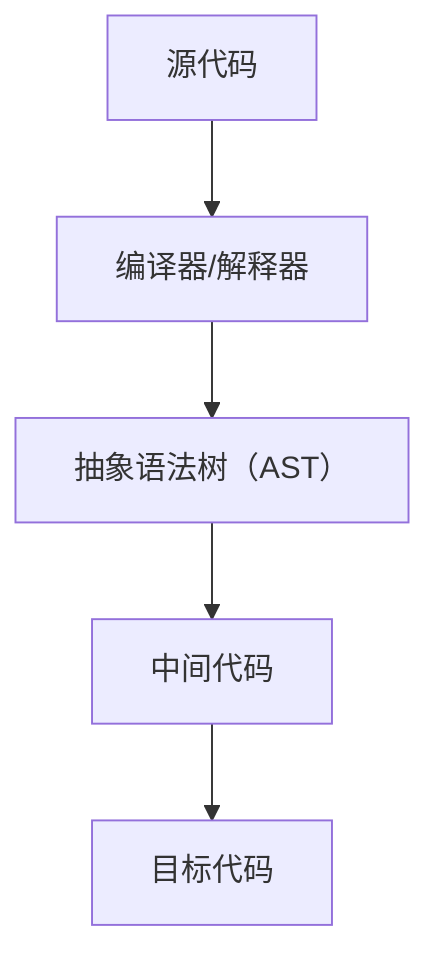

## 1. 背景介绍

### 1.1  问题的由来

在计算机科学领域，代码生成是一个关键的环节，它涉及到将高级程序语言转化为机器语言，使得计算机能够理解并执行。过去，程序员需要手动编写大量的代码，这不仅耗时耗力，而且容易出错。因此，如何自动化地生成代码，提高编程效率，成为了一个重要的问题。

### 1.2  研究现状

随着技术的发展，代码生成的方法和技术也在不断进步。目前，已经有很多工具和框架能够实现代码生成，例如编译器、解释器、抽象语法树（AST）等。这些工具和技术大大减少了程序员的工作量，提高了代码的质量和效率。

### 1.3  研究意义

代码生成的研究不仅能够提升编程效率，减少错误，而且能够推动软件工程的发展，改变软件开发的方式。例如，通过代码生成，我们可以实现模块化和组件化的开发，使得软件开发更加灵活和高效。

### 1.4  本文结构

本文首先介绍了代码生成的背景和意义，然后详细解析了代码生成的核心概念和联系，接着深入讲解了代码生成的核心算法原理和具体操作步骤，包括数学模型和公式的详细讲解和举例说明。然后，本文通过一个具体的项目实践，展示了代码生成的具体应用。最后，本文总结了代码生成的未来发展趋势和挑战。

## 2. 核心概念与联系

代码生成涉及到很多核心的概念，例如编译器、解释器、抽象语法树（AST）、中间代码、目标代码等。这些概念之间有着紧密的联系，构成了代码生成的基本框架。

编译器是实现代码生成的关键工具，它的主要任务是将高级语言编写的源代码转化为机器语言的目标代码。在这个过程中，编译器首先会对源代码进行词法分析和语法分析，生成抽象语法树（AST）。然后，编译器会对AST进行语义分析和优化，生成中间代码。最后，编译器会将中间代码转化为目标代码。

解释器和编译器类似，也是实现代码生成的工具，但是它并不生成目标代码，而是直接执行源代码。解释器通常用于动态语言，例如Python、JavaScript等。

抽象语法树（AST）是源代码的抽象表示，它反映了源代码的结构。通过操作AST，我们可以实现代码的生成、转换和优化。

中间代码是编译器生成的一种临时代码，它位于源代码和目标代码之间。中间代码的设计可以使得编译器的前端（负责生成中间代码）和后端（负责生成目标代码）解耦，提高编译器的可移植性。

目标代码是编译器最终生成的代码，它是机器语言的代码，可以直接被计算机执行。

这些概念之间的联系可以通过以下的Mermaid流程图进行展示：



## 3. 核心算法原理 & 具体操作步骤

### 3.1  算法原理概述

代码生成的算法原理主要涉及到编译器的工作原理。编译器的工作可以分为三个主要阶段：分析阶段、综合阶段和优化阶段。

在分析阶段，编译器首先对源代码进行词法分析，将源代码分解为一系列的词素（token）。然后，编译器对这些词素进行语法分析，根据语法规则生成抽象语法树（AST）。

在综合阶段，编译器对AST进行语义分析，检查源代码的语义是否正确，例如类型检查、变量声明和使用的一致性等。然后，编译器将AST转化为中间代码。

在优化阶段，编译器对中间代码进行优化，例如消除冗余的代码、改进数据访问的效率等。然后，编译器将优化后的中间代码转化为目标代码。

### 3.2  算法步骤详解

代码生成的具体操作步骤可以分为以下几个步骤：

1. **词法分析**：编译器首先对源代码进行词法分析，将源代码分解为一系列的词素（token）。词法分析的目标是将源代码的字符序列转化为词素序列，为后续的语法分析提供输入。

2. **语法分析**：编译器对词素序列进行语法分析，根据语法规则生成抽象语法树（AST）。语法分析的目标是确定词素序列的结构，为后续的语义分析提供输入。

3. **语义分析**：编译器对AST进行语义分析，检查源代码的语义是否正确，例如类型检查、变量声明和使用的一致性等。语义分析的目标是确定源代码的意义，为后续的代码生成提供输入。

4. **代码生成**：编译器将AST转化为中间代码，然后对中间代码进行优化，最后将优化后的中间代码转化为目标代码。代码生成的目标是生成可以被计算机执行的目标代码。

### 3.3  算法优缺点

代码生成的算法有很多优点，例如提高编程效率、减少错误、支持模块化和组件化的开发等。但是，它也有一些缺点，例如生成的代码可能不如手动编写的代码效率高，代码生成工具的学习和使用成本也可能比较高。

### 3.4  算法应用领域

代码生成的算法广泛应用于软件工程领域，例如编译器、解释器、代码编辑器、代码生成工具等。此外，代码生成的算法也可以应用于其他领域，例如数据分析、机器学习等，通过生成代码实现自动化的数据处理和模型训练。

## 4. 数学模型和公式 & 详细讲解 & 举例说明

### 4.1  数学模型构建

在代码生成的算法中，我们可以使用图论的知识来描述和分析源代码的结构。例如，我们可以把源代码看作是一个有向图，其中的节点表示源代码的元素（例如变量、函数等），边表示源代码元素之间的关系（例如调用、引用等）。

我们可以用以下的数学模型来描述源代码的结构：

源代码的结构可以表示为一个有向图 $G = (V, E)$，其中 $V$ 是节点集，表示源代码的元素；$E$ 是边集，表示源代码元素之间的关系。

### 4.2  公式推导过程

在上述的数学模型中，我们可以定义一些度量源代码结构的指标。例如，我们可以定义节点的度（degree）为节点的入度（in-degree）和出度（out-degree）的和。节点的度可以表示源代码元素的复杂性，例如一个函数被调用的次数等。

我们可以用以下的公式来计算节点的度：

节点 $v$ 的度 $d(v)$ 可以表示为 $d(v) = in(v) + out(v)$，其中 $in(v)$ 是节点 $v$ 的入度，表示有多少边指向节点 $v$；$out(v)$ 是节点 $v$ 的出度，表示有多少边从节点 $v$ 指出。

### 4.3  案例分析与讲解

假设我们有以下的源代码：

```python
def foo():
    pass

def bar():
    foo()

bar()
```

我们可以将这段源代码表示为一个有向图，其中有三个节点，分别表示函数 `foo`、函数 `bar` 和主程序，有两条边，分别表示函数 `bar` 调用函数 `foo` 和主程序调用函数 `bar`。

我们可以计算出函数 `foo` 的度为 1，函数 `bar` 的度为 2，主程序的度为 0。这表示函数 `foo` 被调用了一次，函数 `bar` 被调用了一次并且调用了一次其他函数，主程序没有调用也没有被调用。

### 4.4  常见问题解答

在代码生成的过程中，我们可能会遇到一些问题，例如如何处理源代码的错误、如何优化生成的代码等。这些问题的解答需要我们对代码生成的算法有深入的理解，也需要我们有丰富的实践经验。

## 5. 项目实践：代码实例和详细解释说明

### 5.1  开发环境搭建

在进行代码生成的项目实践之前，我们需要搭建开发环境。我们可以选择Python作为开发语言，因为Python有丰富的库支持，例如`ast`库可以用来处理抽象语法树，`code`库可以用来生成和执行代码。

我们可以使用以下的命令来安装必要的库：

```bash
pip install ast code
```

### 5.2  源代码详细实现

在搭建好开发环境之后，我们可以开始编写源代码。以下是一个简单的代码生成的例子，它使用`ast`库生成一个简单的抽象语法树，然后使用`code`库将抽象语法树转化为代码并执行。

```python
import ast
import code

# 创建一个简单的抽象语法树
tree = ast.parse("print('Hello, world!')")

# 将抽象语法树转化为代码
code = compile(tree, filename="<ast>", mode="exec")

# 执行代码
exec(code)
```

### 5.3  代码解读与分析

在上述的源代码中，我们首先使用`ast.parse`函数创建了一个简单的抽象语法树，它表示一条打印`Hello, world!`的语句。

然后，我们使用`compile`函数将抽象语法树转化为代码。`compile`函数的第一个参数是抽象语法树，第二个参数是文件名，第三个参数是模式，可以是`exec`（执行），`eval`（求值）或`single`（交互）。

最后，我们使用`exec`函数执行了生成的代码。`exec`函数的参数是代码，它会执行代码并返回结果。

### 5.4  运行结果展示

运行上述的源代码，我们可以看到以下的输出：

```
Hello, world!
```

这说明我们成功地生成了一条打印`Hello, world!`的语句，并且执行了这条语句。

## 6. 实际应用场景

代码生成的算法在实际中有很多应用场景，例如：

1. **编译器和解释器**：编译器和解释器是代码生成的主要应用场景。编译器通过生成目标代码，使得源代码可以在不同的平台上运行；解释器通过生成并执行代码，使得源代码可以立即得到执行。

2. **代码编辑器**：代码编辑器可以使用代码生成的算法，例如语法高亮、代码提示、代码重构等。

3. **代码生成工具**：代码生成工具可以根据模板和配置文件，自动地生成代码，例如ORM框架、Web框架等。

4. **数据分析和机器学习**：在数据分析和机器学习中，我们可以使用代码生成的算法，自动地生成数据处理和模型训练的代码。

### 6.4  未来应用展望

随着技术的发展，代码生成的算法将有更多的应用场景。例如，我们可以使用代码生成的算法，自动地生成测试用例，提高软件的质量；我们也可以使用代码生成的算法，自动地生成文档，提高软件的可维护性。此外，我们还可以使用代码生成的算法，自动地生成用户界面，提高软件的易用性。

## 7. 工具和资源推荐

### 7.1  学习资源推荐

如果你对代码生成的算法感兴趣，以下是一些推荐的学习资源：

1. **编译原理**：这是一本经典的教材，详细介绍了编译器的工作原理，包括词法分析、语法分析、语义分析和代码生成等。

2. **Python官方文档**：Python官方文档有详细的`ast`库和`code`库的使用说明，是学习代码生成的好资源。

3. **编译器设计和实现**：这是一本实践性强的教材，通过实例介绍了如何设计和实现一个编译器。

### 7.2  开发工具推荐

如果你想实践代码生成的算法，以下是一些推荐的开发工具：

1. **Python**：Python是一种易学且强大的编程语言，它有丰富的库支持，例如`ast`库和`code`库，非常适合实践代码生成的算法。

2. **Visual Studio Code**：Visual Studio Code是一款免费且开源的代码编辑器，它支持多种编程语言，有丰富的插件，可以帮助你更好地编写和调试代码。

3. **GitHub**：GitHub是一个代码托管平台，你可以在GitHub上分享你的代码，也可以学习别人的代码。

### 7.3  相关论文推荐

如果你想深入研究代码生成的算法，以下是一些推荐的相关论文：

1. **A Generative Approach to Code Completion**：这篇论文介绍了一种基于代码生成的代码补全方法。

2. **DeepCode: Feedback Code Generation with Gated Convolutional Neural Networks**：这篇论文介绍了一种基于深度学习的代码生成方法。

3. **Program Synthesis for Character Level Language Modeling**：这篇论文介绍了一种基于程序合成的代码生成方法。

### 7.4  其他资源推荐

如果你想了解更多关于代码生成的信息，以下是一些推荐的其他资源：

1. **Stack Overflow**：Stack Overflow是一个程序员问