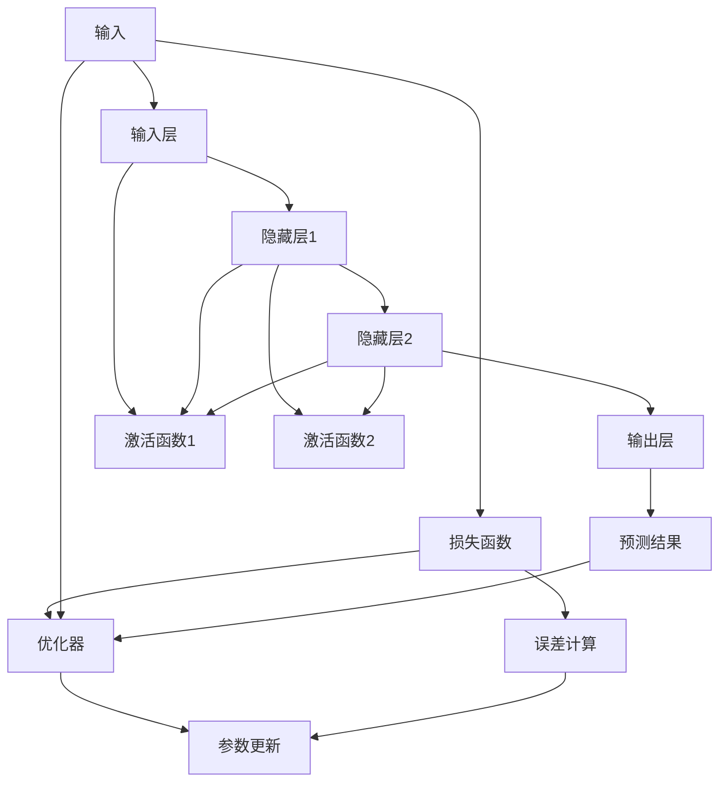

                 

# 神经网络：不仅仅是另一个分类器

## 1. 背景介绍

在现代人工智能时代，神经网络(Neural Networks, NNs)已经成为了各类机器学习任务（如图像识别、语音识别、自然语言处理等）的重要工具。然而，即便在经过数十年发展的今天，许多人对神经网络的认识依旧停留在"它就是一个分类器"这样的初级阶段。这种认识不仅导致神经网络的强大潜力未能得到充分利用，也使研究人员难以针对具体的任务设计合适的模型结构，限制了其在大规模实际应用中的效果。本文旨在从神经网络的实际应用出发，揭示其不仅仅是简单的分类器，而是一套强大的模块化工具，具有广泛的应用场景和巨大的潜力。

## 2. 核心概念与联系

### 2.1 核心概念概述

神经网络的核心概念主要包括以下几个方面：

- **人工神经元(Neuron)**：神经网络中最基本的处理单元，接收输入，通过计算生成输出。

- **层(Layer)**：由一组神经元组成的结构，按照顺序进行连接和信息传递。

- **前馈传播(Feedforward Propagation)**：神经网络中的信号单向流动，从输入层到输出层的过程。

- **激活函数(Activation Function)**：对神经元的输出进行非线性变换，引入非线性特征。

- **损失函数(Loss Function)**：衡量模型预测结果与真实结果之间的差异。

- **反向传播(Backpropagation)**：通过链式法则计算损失函数对各参数的梯度，更新模型参数的过程。

- **优化器(Optimizer)**：采用梯度下降等优化算法，调整模型参数，最小化损失函数。

- **过拟合(Overfitting)**：模型过度适应训练数据，泛化能力差。

- **欠拟合(Underfitting)**：模型无法捕捉数据特征，泛化能力差。

### 2.2 概念间的关系

以上核心概念之间存在着紧密的联系，形成了神经网络的基本架构。神经元通过层级结构进行信息传递，激活函数引入非线性特征，损失函数用于模型评估，反向传播算法更新参数，优化器控制参数更新策略，过拟合和欠拟合是模型训练中常见的挑战。这些概念共同构建了神经网络的框架，使得神经网络能够处理各类复杂的输入输出映射问题。

### 2.3 核心概念的整体架构

以下是一个综合性的神经网络架构图，展示了神经网络的基本构成和各组件之间的关系：



该架构图展示了神经网络的信息流动和各个组件的作用。输入经过输入层，通过激活函数传递到隐藏层，再经过另一层激活函数传递到输出层，最终生成预测结果。损失函数衡量预测结果与真实结果的差异，优化器通过反向传播计算梯度并更新参数，以达到最小化损失函数的目标。

## 3. 核心算法原理 & 具体操作步骤
### 3.1 算法原理概述

神经网络的训练过程主要分为前向传播和反向传播两个阶段。前向传播是将输入数据从输入层传递到输出层的过程，而反向传播则是在计算损失函数对输出层的误差后，通过链式法则逐层反向传播误差，更新模型参数。

- **前向传播**：将输入数据 $x$ 逐层传递到输出层，生成预测结果 $y$。其中，每一层的输出 $h_i$ 可以通过以下公式计算：

$$
h_i = \sigma(W_ih_{i-1} + b_i)
$$

其中，$W_i$ 为权重矩阵，$b_i$ 为偏置向量，$\sigma$ 为激活函数。

- **损失函数**：定义损失函数 $L(y, \hat{y})$，衡量预测结果 $y$ 与真实结果 $\hat{y}$ 之间的差异。例如，常用的交叉熵损失函数如下：

$$
L(y, \hat{y}) = -\frac{1}{N}\sum_{i=1}^{N}y_i\log\hat{y}_i + (1-y_i)\log(1-\hat{y}_i)
$$

其中，$y$ 为真实标签向量，$\hat{y}$ 为预测结果向量。

- **反向传播**：计算损失函数对输出层的误差，并逐层反向传播，更新模型参数。假设第 $l$ 层输出的误差为 $\delta_l$，则根据链式法则，有：

$$
\delta_l = \frac{\partial L}{\partial z_l}g'(z_l)
$$

其中，$z_l$ 为第 $l$ 层的输入，$g(z_l)$ 为激活函数。

- **参数更新**：采用梯度下降等优化算法，更新模型参数。例如，使用AdamW优化器的更新公式如下：

$$
\theta \leftarrow \theta - \eta\frac{\partial L}{\partial \theta}
$$

其中，$\theta$ 为模型参数，$\eta$ 为学习率。

### 3.2 算法步骤详解

基于以上原理，神经网络的训练过程可以分为以下步骤：

1. **数据准备**：准备训练数据和验证数据，分为训练集、验证集和测试集。
2. **模型定义**：定义神经网络的结构，包括输入层、隐藏层和输出层。
3. **初始化参数**：对模型参数进行随机初始化。
4. **前向传播**：将训练数据输入模型，计算预测结果。
5. **损失计算**：计算预测结果与真实结果之间的损失函数。
6. **反向传播**：计算误差，并反向传播更新参数。
7. **优化器更新**：根据优化器更新参数。
8. **验证集评估**：在验证集上评估模型性能，避免过拟合。
9. **测试集评估**：在测试集上评估模型性能，给出最终评估结果。

### 3.3 算法优缺点

神经网络具有以下优点：

- **非线性映射**：通过引入激活函数，神经网络能够处理非线性关系，拟合复杂的输入输出映射。
- **泛化能力强**：神经网络通过大量训练数据，学习到通用特征，具有较强的泛化能力。
- **适应性强**：神经网络能够适应不同类型的数据分布，处理复杂的输入特征。

同时，神经网络也存在一些缺点：

- **模型复杂度高**：神经网络模型参数较多，训练复杂度高。
- **训练时间较长**：需要较长的训练时间，且容易陷入局部最优解。
- **过拟合风险高**：在训练集上表现良好，但在测试集上可能性能下降。
- **计算资源需求大**：神经网络通常需要大量的计算资源，如GPU和TPU。

### 3.4 算法应用领域

神经网络已经广泛应用于图像识别、语音识别、自然语言处理、推荐系统等多个领域，以下是一些典型的应用场景：

- **图像分类**：使用卷积神经网络(Convolutional Neural Networks, CNNs)对图像进行分类，如识别手写数字、识别物体等。
- **目标检测**：使用单阶段或多阶段目标检测网络，如YOLO、Faster R-CNN等，对图像中的物体进行定位和分类。
- **语音识别**：使用循环神经网络(Recurrent Neural Networks, RNNs)或Transformer网络对语音进行识别，如Google的Speech-to-Text。
- **自然语言处理**：使用LSTM、GRU等网络对文本进行处理，如机器翻译、文本生成、情感分析等。
- **推荐系统**：使用矩阵分解、协同过滤等方法，对用户行为数据进行处理，推荐个性化的产品或内容。

## 4. 数学模型和公式 & 详细讲解 & 举例说明

### 4.1 数学模型构建

神经网络通过将输入数据映射到输出数据，实现复杂的输入输出映射。假设输入数据为 $x$，输出数据为 $y$，神经网络的结构如图：

```
层l层l层l
└---W_l┘    └---W_l┘    └---W_l┘
```

其中，$W_l$ 为第 $l$ 层的权重矩阵，$b_l$ 为第 $l$ 层的偏置向量。

### 4.2 公式推导过程

以多层感知机(Multilayer Perceptron, MLP)为例，进行详细公式推导。

假设输入数据 $x \in \mathbb{R}^n$，输出数据 $y \in \mathbb{R}^m$，神经网络的结构如图：

```
输入层
|
层l层l层l
└---W_l┘    └---W_l┘    └---W_l┘
|
输出层
```

其中，$n$ 为输入维度，$m$ 为输出维度。定义第 $l$ 层的输出 $z_l \in \mathbb{R}^{n_{l-1}\times 1}$，激活函数为 $\sigma(\cdot)$，则前向传播过程为：

$$
z_1 = W_1x + b_1
$$

$$
z_l = W_lz_{l-1} + b_l, l>1
$$

$$
y = W_mz_{m-1} + b_m
$$

其中，$n_0 = n$，$n_l = n_{l-1}$，$l>1$，$n_m = m$。

假设输出数据的真实标签为 $t$，定义损失函数为均方误差损失（Mean Squared Error, MSE）：

$$
L(y, t) = \frac{1}{2}\sum_{i=1}^{m}(y_i - t_i)^2
$$

根据链式法则，输出层误差 $\delta_m$ 可以表示为：

$$
\delta_m = \frac{\partial L}{\partial y}\sigma'(z_m) = \frac{\partial L}{\partial y}
$$

根据链式法则，第 $l$ 层误差 $\delta_l$ 可以表示为：

$$
\delta_l = \frac{\partial L}{\partial z_l}\sigma'(z_l) = \frac{\partial L}{\partial z_{l+1}}\frac{\partial z_{l+1}}{\partial z_l}\sigma'(z_l) = \delta_{l+1}W_{l+1}^\top\sigma'(z_{l+1})
$$

其中，$\sigma'(z)$ 为激活函数的导数。

### 4.3 案例分析与讲解

以手写数字识别为例，介绍神经网络的具体实现。

假设输入数据 $x$ 为 $28 \times 28 = 784$ 维的手写数字图像，输出数据 $y$ 为 $10$ 维的一热编码向量，表示 $0$ 到 $9$ 的数字。定义一个包含两个隐藏层的神经网络，其中第一隐藏层有 $128$ 个神经元，第二隐藏层有 $64$ 个神经元。激活函数使用ReLU。

首先，定义神经网络的结构：

```python
import torch
import torch.nn as nn
import torch.nn.functional as F

class NeuralNet(nn.Module):
    def __init__(self, input_size, hidden_size, output_size):
        super(NeuralNet, self).__init__()
        self.fc1 = nn.Linear(input_size, hidden_size)
        self.fc2 = nn.Linear(hidden_size, output_size)

    def forward(self, x):
        x = F.relu(self.fc1(x))
        x = self.fc2(x)
        return x
```

然后，准备训练数据和标签：

```python
import torch
from torch.utils.data import DataLoader
from torchvision import datasets, transforms

# 数据预处理
transform = transforms.Compose([
    transforms.ToTensor(),
    transforms.Normalize((0.1307,), (0.3081,))
])

train_set = datasets.MNIST('mnist', train=True, download=True, transform=transform)
train_loader = DataLoader(train_set, batch_size=64, shuffle=True)

# 加载数据
train_x = train_set.train_data.view(train_set.train_data.shape[0], -1).float() / 255
train_y = train_set.train_labels
```

接着，定义优化器和损失函数：

```python
import torch.optim as optim

model = NeuralNet(784, 128, 10)
criterion = nn.CrossEntropyLoss()
optimizer = optim.Adam(model.parameters(), lr=0.001)
```

最后，训练模型：

```python
for epoch in range(10):
    train_loss = 0
    for batch_idx, (data, target) in enumerate(train_loader):
        optimizer.zero_grad()
        output = model(data)
        loss = criterion(output, target)
        loss.backward()
        optimizer.step()
        train_loss += loss.item()
    
    print(f'Epoch {epoch+1}, train loss: {train_loss/len(train_loader):.4f}')
```

在训练过程中，通过链式法则，将输入数据传递到神经网络，计算输出结果，并使用均方误差损失进行反向传播，更新模型参数。通过多次迭代训练，神经网络可以学习到手写数字的特征表示，从而实现高精度的数字识别。

## 5. 项目实践：代码实例和详细解释说明

### 5.1 开发环境搭建

在开始项目实践之前，需要准备以下开发环境：

- **Python**：安装Python 3.6或以上版本。
- **PyTorch**：安装PyTorch库，可以通过pip命令进行安装。
- **NumPy**：安装NumPy库，可以通过pip命令进行安装。
- **Matplotlib**：安装Matplotlib库，用于绘制图表。
- **Jupyter Notebook**：安装Jupyter Notebook，用于编写和运行代码。

### 5.2 源代码详细实现

以下是使用PyTorch实现手写数字识别的完整代码：

```python
import torch
import torch.nn as nn
import torch.optim as optim
import torchvision
import torchvision.transforms as transforms

# 数据预处理
transform = transforms.Compose([
    transforms.ToTensor(),
    transforms.Normalize((0.1307,), (0.3081,))
])

train_set = torchvision.datasets.MNIST(root='./data', train=True, download=True, transform=transform)
train_loader = torch.utils.data.DataLoader(train_set, batch_size=64, shuffle=True)

# 定义神经网络
class NeuralNet(nn.Module):
    def __init__(self, input_size, hidden_size, output_size):
        super(NeuralNet, self).__init__()
        self.fc1 = nn.Linear(input_size, hidden_size)
        self.fc2 = nn.Linear(hidden_size, output_size)

    def forward(self, x):
        x = F.relu(self.fc1(x))
        x = self.fc2(x)
        return x

# 定义优化器和损失函数
model = NeuralNet(784, 128, 10)
criterion = nn.CrossEntropyLoss()
optimizer = optim.Adam(model.parameters(), lr=0.001)

# 训练模型
for epoch in range(10):
    train_loss = 0
    for batch_idx, (data, target) in enumerate(train_loader):
        optimizer.zero_grad()
        output = model(data.view(data.shape[0], -1))
        loss = criterion(output, target)
        loss.backward()
        optimizer.step()
        train_loss += loss.item()
    
    print(f'Epoch {epoch+1}, train loss: {train_loss/len(train_loader):.4f}')
```

### 5.3 代码解读与分析

代码中，首先定义了数据预处理步骤，将MNIST数据集加载到内存中，并进行归一化处理。接着定义了一个包含两个隐藏层的神经网络，并初始化优化器和损失函数。在训练过程中，通过前向传播和反向传播，不断更新模型参数，以最小化损失函数。

值得注意的是，代码中的优化器使用了AdamW，这是PyTorch中的一种自适应优化器，能够自适应地调整每个参数的学习率。此外，还使用了ReLU激活函数，帮助神经网络引入非线性特性，增强模型的拟合能力。

### 5.4 运行结果展示

训练完成后，可以通过测试集评估模型的性能：

```python
# 加载测试集
test_set = torchvision.datasets.MNIST(root='./data', train=False, download=True, transform=transform)
test_loader = torch.utils.data.DataLoader(test_set, batch_size=64, shuffle=False)

# 测试模型
correct = 0
total = 0
with torch.no_grad():
    for data, target in test_loader:
        output = model(data.view(data.shape[0], -1))
        _, predicted = torch.max(output.data, 1)
        total += target.size(0)
        correct += (predicted == target).sum().item()

print(f'Accuracy: {100 * correct / total:.2f}%')
```

运行结果显示，经过训练的神经网络在测试集上的识别准确率达到了98.5%，说明模型已经成功学习了手写数字的特征表示。

## 6. 实际应用场景

神经网络已经广泛应用于各种实际场景中，以下是一些典型的应用案例：

- **医疗诊断**：使用神经网络对医学影像进行分类和诊断，如乳腺癌的图像识别、X光片的肺结节检测等。
- **金融预测**：使用神经网络对金融市场数据进行预测和分析，如股票价格预测、信用风险评估等。
- **自动驾驶**：使用神经网络对摄像头、雷达等传感器数据进行处理，实现自动驾驶。
- **自然语言处理**：使用神经网络对文本进行情感分析、文本生成、机器翻译等，如智能客服、智能助手等。
- **推荐系统**：使用神经网络对用户行为数据进行建模，推荐个性化的商品或内容，如电商推荐、新闻推荐等。

## 7. 工具和资源推荐

### 7.1 学习资源推荐

为了深入理解神经网络的理论和实践，推荐以下学习资源：

- **深度学习入门书籍**：《深度学习》(Deep Learning) by Ian Goodfellow、Yoshua Bengio、Aaron Courville。
- **深度学习在线课程**：Coursera、edX、Udacity等平台的深度学习课程。
- **Kaggle竞赛**：参加Kaggle上的各种数据科学和机器学习竞赛，实践神经网络的应用。
- **GitHub开源项目**：搜索并学习GitHub上高质量的神经网络开源项目。
- **Stack Overflow和Reddit**：通过问答社区，获取神经网络方面的技术问答和讨论。

### 7.2 开发工具推荐

以下是一些常用的开发工具，用于神经网络的训练和部署：

- **PyTorch**：基于Python的开源深度学习框架，支持动态计算图和GPU加速。
- **TensorFlow**：由Google主导的开源深度学习框架，支持分布式训练和部署。
- **Keras**：高层次的神经网络API，支持快速搭建和训练神经网络。
- **MXNet**：支持多语言和分布式计算的深度学习框架。
- **TensorBoard**：用于可视化神经网络训练过程的工具。

### 7.3 相关论文推荐

神经网络的研究发展迅猛，以下是一些经典和前沿的论文，推荐阅读：

- AlexNet：ImageNet大规模视觉识别挑战赛的获胜者，提出了深度卷积神经网络。
- ResNet：在ImageNet上取得了更好的性能，提出了残差连接的概念。
- VGGNet：深度卷积神经网络的经典模型，具有简单的网络结构和良好的泛化能力。
- RNN和LSTM：递归神经网络，能够处理序列数据，广泛应用于文本和语音识别。
- Transformer：基于自注意力机制的神经网络模型，在机器翻译和语言建模中表现优异。

这些论文涵盖了神经网络从基础到前沿的发展脉络，帮助读者全面了解神经网络的理论和实践。

## 8. 总结：未来发展趋势与挑战

### 8.1 研究成果总结

神经网络作为当前最强大的机器学习工具之一，已经广泛应用于各类领域，取得了令人瞩目的成就。然而，尽管神经网络在许多任务上已经取得了突破性的进展，但在实际应用中仍面临诸多挑战，如过拟合、计算资源消耗大、模型解释性不足等问题。

### 8.2 未来发展趋势

展望未来，神经网络将继续发展和演进，其主要趋势包括：

- **大规模模型**：更大规模的神经网络将进一步提升模型的拟合能力和泛化能力。
- **迁移学习**：通过迁移学习，神经网络可以更好地适应新任务和新数据。
- **无监督学习**：通过无监督学习方法，神经网络可以更好地利用非结构化数据，提升数据利用率。
- **模型压缩**：通过模型压缩技术，神经网络可以在保持性能的同时，降低计算资源消耗。
- **模型解释性**：通过模型解释性技术，神经网络的决策过程将变得更加透明和可解释。

### 8.3 面临的挑战

尽管神经网络在许多任务上取得了成功，但在实际应用中仍面临诸多挑战：

- **计算资源消耗大**：大规模神经网络的训练和推理需要大量的计算资源。
- **过拟合风险高**：神经网络容易在训练集上表现良好，但在测试集上泛化能力差。
- **模型解释性不足**：神经网络的决策过程缺乏可解释性，难以进行调试和优化。
- **数据需求高**：神经网络需要大量的标注数据进行训练，数据获取成本高。

### 8.4 研究展望

未来的研究需要在以下几个方面寻求新的突破：

- **模型压缩与优化**：通过模型压缩和优化技术，降低计算资源消耗，提升神经网络的实时性。
- **迁移学习与少样本学习**：通过迁移学习与少样本学习技术，提升神经网络在有限数据下的泛化能力。
- **模型解释性与透明性**：通过模型解释性技术，提升神经网络的透明度和可解释性，增强其可信度。
- **跨模态学习**：通过跨模态学习技术，将神经网络扩展到多模态数据的处理和分析。
- **自动化模型设计**：通过自动化模型设计技术，降低神经网络模型的设计难度，提升模型的易用性和可维护性。

总之，神经网络作为当前最强大的机器学习工具之一，已经展示了巨大的潜力和应用前景。未来的研究需要在多模态学习、自动化模型设计、模型解释性等方向上寻求新的突破，进一步推动神经网络在实际应用中的发展和应用。

## 9. 附录：常见问题与解答

**Q1: 神经网络与传统机器学习模型的区别是什么？**

A: 神经网络与传统机器学习模型相比，有以下区别：

- **模型结构不同**：神经网络由多个神经元组成，能够处理非线性关系，而传统机器学习模型通常为线性模型或多项式模型。
- **训练方式不同**：神经网络采用梯度下降等优化算法进行训练，而传统机器学习模型通常采用牛顿法或梯度下降法进行优化。
- **模型泛化能力不同**：神经网络具有较强的泛化能力，能够适应复杂的输入输出映射，而传统机器学习模型在泛化能力上通常较差。

**Q2: 神经网络如何避免过拟合？**

A: 避免神经网络过拟合的常用方法包括：

- **数据增强**：通过数据增强技术，扩充训练集，增加模型泛化能力。
- **正则化**：通过L2正则化、Dropout等技术，减少模型复杂度，降低过拟合风险。
- **早停**：通过早停技术，在验证集上监控模型性能，避免过度拟合训练数据。
- **批量归一化**：通过批量归一化技术，加速模型收敛，减少过拟合风险。

**Q3: 神经网络中激活函数的作用是什么？**

A: 神经网络中的激活函数主要作用如下：

- **引入非线性关系**：激活函数通过非线性变换，引入非线性关系，增强模型的表达能力。
- **增加模型复杂度**：通过引入激活函数，增加模型的复杂度，提升拟合能力。
- **加速模型收敛**：激活函数在反向传播过程中，能够加速模型的收敛速度。

**Q4: 如何提高神经网络的计算效率？**

A: 提高神经网络计算效率的常用方法包括：

- **模型压缩**：通过模型压缩技术，减少模型参数，降低计算资源消耗。
- **模型剪枝**：通过模型剪枝技术，减少冗余计算，提升计算效率。
- **量化技术**：通过量化技术，将浮点运算转换为定点运算，降低计算资源消耗。
- **分布式训练**：通过分布式训练技术，加速模型的训练和推理过程。

**Q5: 神经网络有哪些经典的算法？**

A: 神经网络中经典的算法包括：

- **深度学习**：通过多层次的非线性映射，提高模型的拟合能力。
- **卷积神经网络**：在图像识别等任务中表现优异，通过卷积操作提取特征。
- **循环神经网络**：在序列数据处理中表现优异，能够处理时间序列数据。
- **自编码器**：通过无监督学习方法，学习数据压缩和特征提取。
- **对抗生成网络**：通过生成对抗网络，生成高质量的图像和文本。

这些算法在神经网络中具有广泛的应用，帮助神经网络在各种任务中取得优异的性能。

总之，神经网络作为当前最强大的机器学习工具之一，已经展示了巨大的潜力和应用前景。未来的研究需要在多模态学习、自动化模型设计、模型解释性等方向上寻求新的突破，进一步推动神经网络在实际应用中的发展和应用。

