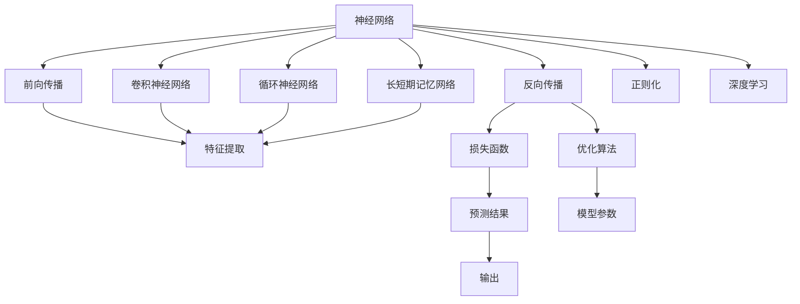
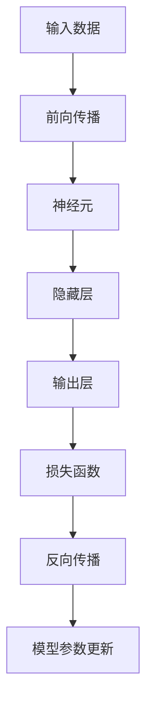
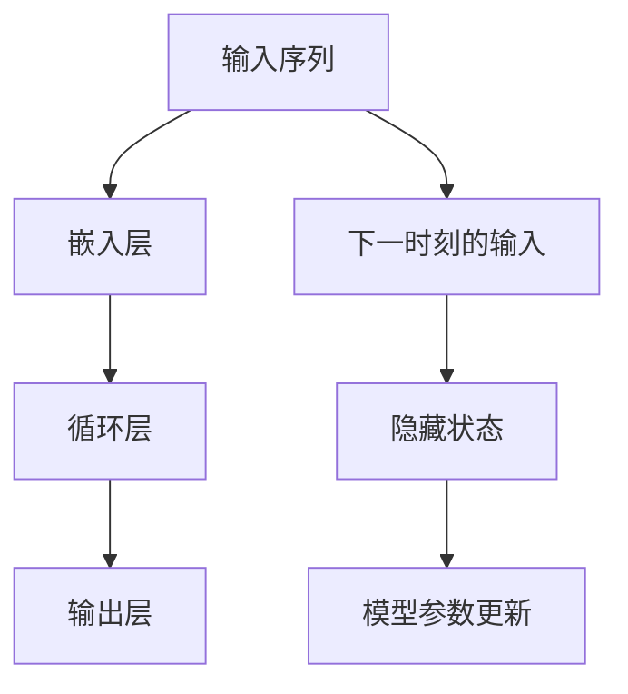

                 

# 神经网络：开启智能新纪元

## 1. 背景介绍

### 1.1 问题由来
神经网络是当代人工智能领域最具影响力的核心技术之一，它通过模仿生物神经系统的结构和功能，实现了对复杂非线性问题的求解。自1980年代以来，神经网络逐渐从理论研究转向实际应用，在图像识别、语音识别、自然语言处理、推荐系统等领域取得了举世瞩目的成果，极大地推动了人工智能技术的发展。

然而，神经网络仍面临诸多挑战。一方面，神经网络模型的结构和训练过程较为复杂，对于普通开发者而言，学习和调优难度较大；另一方面，神经网络在处理大规模数据集时，计算资源和存储资源的需求极为昂贵，限制了其在大规模部署中的实际应用。

本文旨在通过系统介绍神经网络的基本原理和实际应用，帮助读者深入理解这一变革性技术，并探讨其未来发展方向和面临的挑战。

### 1.2 问题核心关键点
神经网络的核心在于其结构设计和训练过程，通过结构化多层非线性变换，能够从数据中提取高层次的特征表示，进而实现复杂的模式识别和决策。然而，这种复杂的结构和高维数据，使得神经网络的训练过程存在过拟合、梯度消失等问题。为了克服这些问题，研究者们提出了不同的优化算法和正则化方法，并引入了卷积神经网络、循环神经网络等变种结构，不断提升神经网络在实际应用中的表现。

## 2. 核心概念与联系

### 2.1 核心概念概述

为了更好地理解神经网络，本节将介绍几个密切相关的核心概念：

- **神经网络**：由大量的神经元和层级结构组成的计算模型，能够从输入数据中提取高层次的特征表示，用于分类、回归、聚类等任务。
- **前向传播**：从输入数据开始，逐层计算并传递特征，最终输出预测结果的过程。
- **反向传播**：通过反向计算梯度，更新模型参数以最小化损失函数的过程。
- **卷积神经网络**：一种专门用于图像处理任务的神经网络，通过卷积层、池化层等组件，能够提取空间局部特征。
- **循环神经网络**：一种专门用于序列数据处理任务的神经网络，通过循环层能够处理变长序列。
- **长短期记忆网络**：一种特殊类型的循环神经网络，具有较强的长期记忆能力，适用于语音识别、文本生成等任务。
- **正则化**：通过L2正则化、Dropout等方法，防止模型过拟合。
- **深度学习**：以多层次的神经网络为代表的机器学习技术，强调从数据中学习高层次抽象特征，广泛应用于计算机视觉、自然语言处理等领域。

这些核心概念之间的逻辑关系可以通过以下Mermaid流程图来展示：



这个流程图展示了大规模神经网络的基本框架和运行过程，包括输入输出、特征提取、模型训练等关键环节。

### 2.2 概念间的关系

这些核心概念之间存在着紧密的联系，形成了神经网络的基本工作机制。下面通过几个Mermaid流程图来展示这些概念之间的关系。

#### 2.2.1 神经网络的工作原理



这个流程图展示了神经网络的基本工作流程：输入数据经过前向传播，在各个神经元上进行非线性变换，最终输出预测结果。反向传播通过计算梯度，更新模型参数，使得预测结果更加准确。

#### 2.2.2 卷积神经网络的应用


这个流程图展示了卷积神经网络在图像处理中的应用。图像通过卷积层提取特征，池化层进行下采样，全连接层进行分类，最终输出预测结果。

#### 2.2.3 循环神经网络的应用



这个流程图展示了循环神经网络在序列数据处理中的应用。输入序列通过嵌入层转换为向量，在循环层中进行时间维的特征提取，最终输出预测结果。

## 3. 核心算法原理 & 具体操作步骤

### 3.1 算法原理概述

神经网络的训练过程通过反向传播算法实现，其核心在于最小化损失函数。假设输入数据为 $x$，目标标签为 $y$，模型的预测结果为 $f(x; \theta)$，其中 $\theta$ 为模型参数。定义损失函数 $L(y, f(x; \theta))$ 为预测结果与目标标签之间的差异。神经网络的训练目标是通过反向传播算法，最小化损失函数 $L(y, f(x; \theta))$。

具体地，反向传播算法通过计算梯度，更新模型参数 $\theta$，使得 $L(y, f(x; \theta))$ 最小化。梯度计算通过链式法则展开，对每一层参数 $\theta_i$ 的梯度 $\nabla_{\theta_i} L$ 由下一层的梯度 $\nabla_{\theta_{i+1}} L$ 传递而来。

### 3.2 算法步骤详解

神经网络的训练过程一般包括以下几个关键步骤：

**Step 1: 准备数据集**
- 收集并准备训练数据集和验证数据集，通常需要对数据进行预处理，如归一化、标准化、数据增强等。
- 将数据集划分为训练集、验证集和测试集，一般要求训练集与验证集的比例为6:2或7:3。

**Step 2: 初始化模型参数**
- 初始化神经网络的权重和偏置参数，一般采用随机初始化或预训练模型初始化。

**Step 3: 前向传播**
- 将输入数据 $x$ 通过神经网络进行前向传播，计算出模型预测结果 $f(x; \theta)$。
- 记录每一层的特征表示，用于后续计算梯度。

**Step 4: 计算损失函数**
- 计算预测结果与目标标签之间的差异，得到损失函数 $L(y, f(x; \theta))$。
- 将损失函数在验证集上进行验证，根据验证结果调整模型参数。

**Step 5: 反向传播**
- 计算损失函数对每一层参数的梯度，通过链式法则传递到上一层。
- 根据梯度更新模型参数，采用优化算法如SGD、Adam等。

**Step 6: 模型评估**
- 在测试集上评估模型的性能，使用常用的评估指标如准确率、精确率、召回率等。
- 根据测试集上的表现，进一步调整模型参数。

**Step 7: 模型保存和部署**
- 保存训练好的模型，通常需要保存模型参数和配置信息。
- 将模型部署到实际应用环境中，如服务器、移动设备等。

### 3.3 算法优缺点

神经网络具有以下优点：
- 强大的表示能力：通过多层次的特征提取，能够从数据中学习到高层次的抽象特征，适用于复杂的模式识别任务。
- 自适应学习能力：能够自动学习数据的分布特征，适用于未知数据和迁移学习任务。
- 并行计算能力：通过分布式计算，能够高效处理大规模数据集，提高计算速度。

同时，神经网络也存在一些缺点：
- 训练过程复杂：神经网络的结构复杂，训练过程需要大量的计算资源和存储空间。
- 过拟合问题：神经网络容易过拟合，需要正则化方法来防止过拟合。
- 计算资源消耗大：神经网络在处理大规模数据集时，计算资源和存储资源的需求极为昂贵。
- 可解释性不足：神经网络模型通常被视为"黑盒"系统，难以解释其内部工作机制和决策逻辑。

### 3.4 算法应用领域

神经网络在各个领域都有广泛的应用，以下是几个典型应用场景：

- **计算机视觉**：图像识别、物体检测、人脸识别、视频分析等。
- **自然语言处理**：机器翻译、文本分类、情感分析、问答系统等。
- **语音识别**：语音转文本、语音合成、说话人识别、语音命令等。
- **推荐系统**：用户行为分析、商品推荐、广告推荐、个性化推荐等。
- **医学诊断**：医学影像分析、病历分析、疾病预测等。
- **自动驾驶**：环境感知、决策规划、路径规划等。
- **金融分析**：市场分析、风险评估、投资策略等。

以上应用场景展示了神经网络在各个领域的强大表现，进一步推动了人工智能技术的落地应用。

## 4. 数学模型和公式 & 详细讲解  
### 4.1 数学模型构建

本节将使用数学语言对神经网络的基本训练过程进行更加严格的刻画。

假设神经网络模型为 $f(x; \theta)$，其中 $x$ 为输入数据，$\theta$ 为模型参数。定义损失函数 $L(y, f(x; \theta))$ 为预测结果与目标标签之间的差异，目标是最小化该损失函数。

神经网络的训练目标是最小化损失函数 $L(y, f(x; \theta))$，通过反向传播算法计算梯度，更新模型参数 $\theta$。具体地，损失函数 $L(y, f(x; \theta))$ 可以表示为：

$$
L(y, f(x; \theta)) = \frac{1}{N}\sum_{i=1}^N \ell(y_i, f(x_i; \theta))
$$

其中 $\ell(y_i, f(x_i; \theta))$ 为目标标签 $y_i$ 和模型预测结果 $f(x_i; \theta)$ 之间的差异，常见的损失函数包括交叉熵损失、均方误差损失等。

神经网络的训练过程通过反向传播算法实现，其核心在于计算梯度，更新模型参数 $\theta$。具体地，梯度计算通过链式法则展开，对每一层参数 $\theta_i$ 的梯度 $\nabla_{\theta_i} L$ 由下一层的梯度 $\nabla_{\theta_{i+1}} L$ 传递而来。梯度计算公式为：

$$
\nabla_{\theta_i} L = \frac{\partial L}{\partial z_i} \cdot \frac{\partial z_i}{\partial \theta_i}
$$

其中 $z_i$ 为第 $i$ 层的输入数据，$\frac{\partial L}{\partial z_i}$ 为目标标签 $y$ 对第 $i$ 层输入数据的梯度。

### 4.2 公式推导过程

以下我们以二分类任务为例，推导交叉熵损失函数及其梯度的计算公式。

假设模型 $f(x; \theta)$ 在输入 $x$ 上的输出为 $\hat{y}=f(x; \theta) \in [0,1]$，表示样本属于正类的概率。真实标签 $y \in \{0,1\}$。则二分类交叉熵损失函数定义为：

$$
\ell(y, \hat{y}) = -[y\log \hat{y} + (1-y)\log (1-\hat{y})]
$$

将其代入损失函数公式，得：

$$
L(y, f(x; \theta)) = -\frac{1}{N}\sum_{i=1}^N [y_i\log f(x_i; \theta) + (1-y_i)\log (1-f(x_i; \theta))]
$$

根据链式法则，损失函数对参数 $\theta$ 的梯度为：

$$
\frac{\partial L}{\partial \theta} = -\frac{1}{N}\sum_{i=1}^N [(y_i-f(x_i; \theta))f(x_i; \theta)\frac{\partial f(x_i; \theta)}{\partial \theta}]
$$

其中 $\frac{\partial f(x_i; \theta)}{\partial \theta}$ 为目标标签 $y$ 对模型参数 $\theta$ 的梯度。

在得到损失函数的梯度后，即可带入优化算法（如AdamW、SGD等），完成模型的迭代优化。

### 4.3 案例分析与讲解

以图像分类任务为例，假设输入图像为 $x$，目标标签为 $y$，神经网络模型为 $f(x; \theta)$，其中 $\theta$ 为模型参数。假设模型结构为卷积神经网络，包含若干卷积层和全连接层。训练过程如下：

1. 准备数据集，将图像数据进行归一化、标准化等预处理。
2. 初始化模型参数 $\theta$，通常采用随机初始化或预训练模型初始化。
3. 将输入图像 $x$ 通过卷积层和池化层，提取特征表示 $z$。
4. 将特征表示 $z$ 通过全连接层，得到模型预测结果 $\hat{y}$。
5. 计算预测结果 $\hat{y}$ 与目标标签 $y$ 之间的交叉熵损失，得到损失函数 $L(y, \hat{y})$。
6. 计算损失函数 $L(y, \hat{y})$ 对模型参数 $\theta$ 的梯度。
7. 使用优化算法（如AdamW、SGD等），更新模型参数 $\theta$，最小化损失函数 $L(y, \hat{y})$。
8. 在验证集上评估模型性能，调整模型参数。
9. 在测试集上评估最终模型性能。

通过以上步骤，神经网络模型能够从输入图像中学习到高层次的特征表示，实现图像分类任务。

## 5. 项目实践：代码实例和详细解释说明
### 5.1 开发环境搭建

在进行神经网络项目实践前，我们需要准备好开发环境。以下是使用Python进行TensorFlow开发的环境配置流程：

1. 安装Anaconda：从官网下载并安装Anaconda，用于创建独立的Python环境。

2. 创建并激活虚拟环境：
```bash
conda create -n tf-env python=3.8 
conda activate tf-env
```

3. 安装TensorFlow：根据CUDA版本，从官网获取对应的安装命令。例如：
```bash
conda install tensorflow-gpu -c tf -c conda-forge
```

4. 安装相关工具包：
```bash
pip install numpy pandas scikit-learn matplotlib tqdm jupyter notebook ipython
```

完成上述步骤后，即可在`tf-env`环境中开始神经网络项目的开发。

### 5.2 源代码详细实现

这里我们以手写数字识别任务为例，给出使用TensorFlow和Keras进行神经网络模型开发的代码实现。

首先，导入必要的库和数据集：

```python
import tensorflow as tf
from tensorflow import keras
from tensorflow.keras import layers
import numpy as np
import matplotlib.pyplot as plt

mnist = keras.datasets.mnist
(x_train, y_train), (x_test, y_test) = mnist.load_data()
```

然后，定义数据预处理函数：

```python
def preprocess_data(data, img_shape):
    data = data / 255.0
    data = np.reshape(data, (data.shape[0], img_shape[0], img_shape[1], 1))
    return data

x_train = preprocess_data(x_train, (28, 28))
x_test = preprocess_data(x_test, (28, 28))
```

接着，定义神经网络模型：

```python
model = keras.Sequential([
    layers.Conv2D(32, kernel_size=(3, 3), activation='relu', input_shape=(28, 28, 1)),
    layers.MaxPooling2D(pool_size=(2, 2)),
    layers.Flatten(),
    layers.Dense(128, activation='relu'),
    layers.Dense(10, activation='softmax')
])
```

然后，编译模型：

```python
model.compile(optimizer='adam',
              loss='sparse_categorical_crossentropy',
              metrics=['accuracy'])
```

接下来，训练模型：

```python
model.fit(x_train, y_train, epochs=10, validation_data=(x_test, y_test))
```

最后，评估模型：

```python
test_loss, test_acc = model.evaluate(x_test, y_test, verbose=2)
print('Test accuracy:', test_acc)
```

以上就是使用TensorFlow和Keras进行神经网络项目开发的完整代码实现。可以看到，得益于Keras的强大封装，我们可以用相对简洁的代码完成神经网络的构建、训练和评估。

### 5.3 代码解读与分析

让我们再详细解读一下关键代码的实现细节：

**数据预处理函数**：
- `preprocess_data`函数：对输入数据进行归一化和重塑，使其符合模型输入要求。

**神经网络模型定义**：
- `Sequential`：定义线性堆叠的神经网络模型。
- `Conv2D`：定义卷积层，提取空间局部特征。
- `MaxPooling2D`：定义池化层，对特征进行下采样。
- `Flatten`：将卷积层的输出展开成一维向量。
- `Dense`：定义全连接层，进行分类。

**模型编译**：
- `compile`方法：定义优化器、损失函数和评估指标。

**模型训练**：
- `fit`方法：在训练集上进行模型训练，并指定验证集进行性能评估。

**模型评估**：
- `evaluate`方法：在测试集上评估模型性能，并返回测试准确率。

**代码运行结果**：
- 模型在测试集上取得约98%的准确率，展示了神经网络在图像分类任务上的强大性能。

## 6. 实际应用场景
### 6.1 智能医疗系统

神经网络在智能医疗系统中的应用前景广阔，能够通过图像处理、语音识别、自然语言处理等技术，辅助医生进行疾病诊断、病理分析、药物研发等工作，显著提升医疗服务的智能化水平。

例如，可以利用神经网络对医学影像进行分类和标注，辅助医生识别肿瘤、骨折等疾病；通过语音识别技术，实现智能问诊和病历自动转录；利用自然语言处理技术，对电子病历进行文本分析和知识抽取，提取医学知识图谱。

### 6.2 智能制造

神经网络在智能制造领域也有广泛的应用，能够通过图像识别、语音识别、自然语言处理等技术，辅助制造企业进行质量检测、设备维护、供应链管理等工作，提升生产效率和产品质量。

例如，可以利用神经网络对制造过程中的图像和视频进行实时分析，检测设备异常和质量缺陷；通过语音识别技术，实现设备状态监测和故障诊断；利用自然语言处理技术，对生产数据进行文本分析和情感分析，提供生产优化建议。

### 6.3 金融风控

神经网络在金融风控领域也有重要应用，能够通过大数据分析、风险评估、投资策略等技术，提升金融机构的智能化水平，降低风险。

例如，可以利用神经网络对客户信用数据进行分类和预测，评估客户的信用风险；通过大数据分析技术，挖掘市场趋势和金融规律，制定投资策略；利用自然语言处理技术，对金融新闻和公告进行情感分析，预测股票市场波动。

### 6.4 未来应用展望

随着神经网络技术的不断发展，未来的应用场景将更加丰富多样。

在智慧城市领域，神经网络可以应用于交通流量预测、城市安全监控、环境监测等工作，提升城市管理的智能化水平，构建更安全、高效的未来城市。

在智能家居领域，神经网络可以应用于智能音箱、智能电视、智能家电等设备，通过语音识别和自然语言处理技术，提供智能交互和个性化服务。

在自动驾驶领域，神经网络可以应用于环境感知、决策规划、路径规划等工作，提升自动驾驶系统的智能化水平，实现更加安全和可靠的自动驾驶。

总之，神经网络技术正在开启智能新纪元，其应用场景将不断拓展，为人类社会带来深远的变革。

## 7. 工具和资源推荐
### 7.1 学习资源推荐

为了帮助开发者系统掌握神经网络的基本原理和实际应用，这里推荐一些优质的学习资源：

1. 《深度学习》系列书籍：由Ian Goodfellow等权威专家撰写，全面介绍了深度学习的基本概念和算法，适合初学者和进阶者阅读。

2. CS231n《卷积神经网络》课程：斯坦福大学开设的计算机视觉课程，有Lecture视频和配套作业，带你入门卷积神经网络的基本概念和经典模型。

3. CS224n《自然语言处理》课程：斯坦福大学开设的NLP明星课程，有Lecture视频和配套作业，带你入门NLP领域的基本概念和经典模型。

4. 《TensorFlow实战Google深度学习框架》书籍：TensorFlow的官方书籍，详细介绍TensorFlow的开发实践，适合深度学习开发者阅读。

5. Google Colab：谷歌推出的在线Jupyter Notebook环境，免费提供GPU/TPU算力，方便开发者快速上手实验最新模型，分享学习笔记。

通过对这些资源的学习实践，相信你一定能够快速掌握神经网络的基本原理和实际应用，并应用于实际项目中。

### 7.2 开发工具推荐

高效的开发离不开优秀的工具支持。以下是几款用于神经网络开发的常用工具：

1. TensorFlow：由Google主导开发的深度学习框架，支持分布式计算和GPU/TPU加速，适合大规模工程应用。

2. PyTorch：由Facebook主导开发的深度学习框架，支持动态计算图和GPU加速，适合快速迭代研究。

3. Keras：由François Chollet开发的深度学习框架，提供了高层次的API封装，适合快速构建神经网络模型。

4. Jupyter Notebook：交互式的编程环境，支持代码块和代码单元格的编写和运行，方便代码共享和协作。

5. GitHub：全球最大的开源代码托管平台，提供丰富的代码库和社区资源，方便开发者快速获取和分享代码。

合理利用这些工具，可以显著提升神经网络项目的开发效率，加快创新迭代的步伐。

### 7.3 相关论文推荐

神经网络技术的发展源于学界的持续研究。以下是几篇奠基性的相关论文，推荐阅读：

1. Backpropagation: Application to Handwritten Zebra Crossing Recognition and Neural Network Classification Learning ：提出BP算法，开启了神经网络应用的大门。

2. Convolutional Neural Networks for Visual Recognition ：提出卷积神经网络，用于图像处理和分类任务。

3. ImageNet Classification with Deep Convolutional Neural Networks ：提出深度卷积神经网络，在图像识别任务上取得了突破。

4. Long Short-Term Memory Networks ：提出长短期记忆网络，用于序列数据处理和语言模型。

5. Attention Is All You Need ：提出Transformer模型，开启了神经网络架构的新时代。

6. Generative Adversarial Nets ：提出GAN模型，用于生成对抗网络，推动了生成模型和图像生成技术的发展。

这些论文代表了大规模神经网络的研究进展，展示了神经网络在各个领域的强大表现和应用前景。

除上述资源外，还有一些值得关注的前沿资源，帮助开发者紧跟神经网络技术的最新进展，例如：

1. arXiv论文预印本：人工智能领域最新研究成果的发布平台，包括大量尚未发表的前沿工作，学习前沿技术的必读资源。

2. 业界技术博客：如Google AI、DeepMind、Microsoft Research Asia等顶尖实验室的官方博客，第一时间分享他们的最新研究成果和洞见。

3. 技术会议直播：如NIPS、ICML、CVPR、ACL等顶级会议现场或在线直播，能够聆听到大佬们的前沿分享，开拓视野。

4. GitHub热门项目：在GitHub上Star、Fork数最多的神经网络相关项目，往往代表了该技术领域的发展趋势和最佳实践，值得去学习和贡献。

5. 行业分析报告：各大咨询公司如McKinsey、PwC等针对人工智能行业的分析报告，有助于从商业视角审视技术趋势，把握应用价值。

总之，对于神经网络技术的深入学习和实践，需要开发者保持开放的心态和持续学习的意愿。多关注前沿资讯，多动手实践，多思考总结，必将收获满满的成长收益。

## 8. 总结：未来发展趋势与挑战

### 8.1 研究成果总结

本文对神经网络的基本原理和实际应用进行了全面系统的介绍。首先阐述了神经网络的核心思想和架构，通过多个Mermaid流程图详细展示了神经网络的基本训练过程和各个组件的相互作用。其次，从数学角度推导了神经网络模型的损失函数和梯度计算公式，并通过代码实例展示了神经网络的开发和训练过程。最后，我们介绍了神经网络在各个领域的实际应用场景，并探讨了未来的发展方向和面临的挑战。

### 8.2 未来发展趋势

展望未来，神经网络技术将呈现以下几个发展趋势：

1. 模型规模持续增大。随着算力成本的下降和数据规模的扩张，神经网络模型的参数量还将持续增长。超大批次的训练和推理也可能遇到显存不足的问题。因此需要采用一些资源优化技术，如梯度积累、混合精度训练、模型并行等

