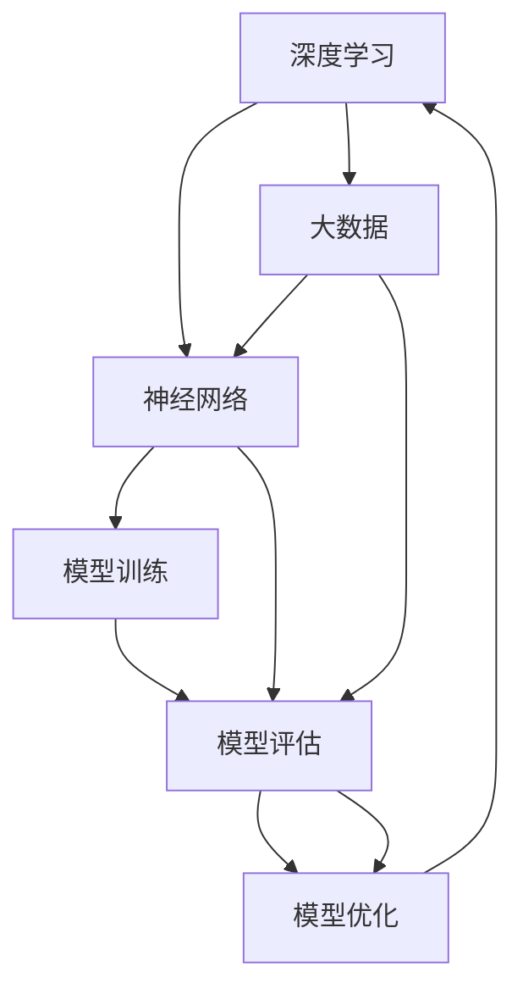
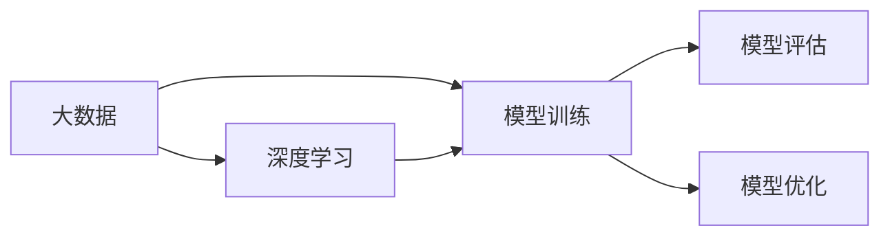
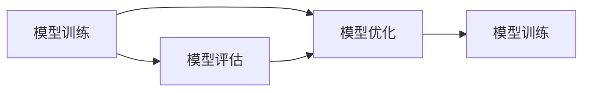
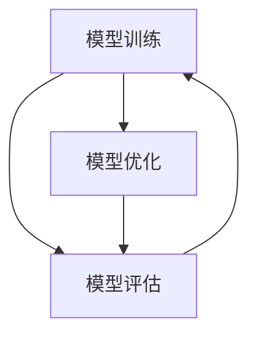
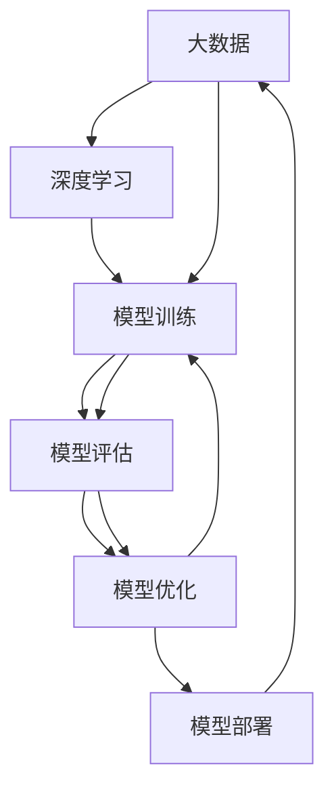

                 

# 第二代人工智能的数据驱动

## 1. 背景介绍

### 1.1 问题由来
人工智能(AI)的发展历程中，经历了从规则驱动到数据驱动的转变。早期AI以专家知识为主导，通过对领域专家知识的提取和编码，构建基于规则的系统进行自动化决策。但规则驱动的方式需要大量手工编码和调整，效率低、成本高，难以适应复杂多变的现实世界。

数据驱动的AI方法则通过对大量数据的学习和挖掘，直接从数据中提炼出规律和知识，构建模型进行预测和决策。相比于规则驱动，数据驱动的AI具有以下优势：

1. 效率高：模型能够自动学习数据特征，无需手动编码规则。
2. 可扩展性好：模型可以通过增加数据进行自适应调整，适应不断变化的环境。
3. 泛化能力强：模型能够从数据中学习通用的规律，泛化到未见过的数据上。
4. 更客观：模型通过数据驱动，减少了人为干预带来的主观偏差。

数据驱动的AI方法，特别是基于深度学习(DL)的AI，已经取得了显著的进展，广泛应用于自然语言处理(NLP)、计算机视觉(CV)、语音识别(SR)等领域。其中，深度学习模型通过构建大规模神经网络，对数据进行逐层特征提取和抽象，从而实现对复杂任务的建模和预测。

## 2. 核心概念与联系

### 2.1 核心概念概述

为了更好地理解第二代人工智能的数据驱动方法，本节将介绍几个密切相关的核心概念：

- **深度学习(DL)**：一种基于多层神经网络进行学习的方法，通过逐层特征提取和抽象，构建复杂模型。深度学习已经在NLP、CV、SR等领域取得了广泛应用。

- **神经网络(NN)**：深度学习的核心，由多个神经元层组成，通过反向传播算法进行训练。神经网络是实现复杂功能的基础单元。

- **大数据**：指规模巨大、类型多样的数据集，是数据驱动AI的重要数据来源。大数据技术如Hadoop、Spark等，为深度学习模型的训练和部署提供了强有力的支持。

- **模型训练**：通过数据对模型进行训练，调整模型参数以最小化预测误差。模型训练是大数据和深度学习结合的产物，是实现数据驱动AI的关键环节。

- **模型评估**：通过独立数据集对模型进行评估，检验模型泛化能力和性能表现。模型评估是判断模型是否过拟合、欠拟合的重要手段。

- **模型优化**：通过改进模型结构、调整训练参数、引入正则化等方法，提高模型性能。模型优化是提升AI系统效果的关键。

这些核心概念之间的逻辑关系可以通过以下Mermaid流程图来展示：



这个流程图展示了大数据、深度学习、模型训练、模型评估、模型优化等关键概念之间的关系。深度学习模型利用大数据进行训练和优化，而模型评估用于检验训练效果，模型优化则进一步提升模型性能。

### 2.2 概念间的关系

这些核心概念之间存在着紧密的联系，形成了数据驱动AI的完整生态系统。下面通过几个Mermaid流程图来展示这些概念之间的关系。

#### 2.2.1 深度学习与大数据的关系



这个流程图展示了大数据和深度学习之间的联系。大数据是深度学习模型训练的数据来源，而模型训练和优化则是利用大数据提升模型性能的过程。

#### 2.2.2 模型训练与模型评估的关系



这个流程图展示了模型训练和模型评估之间的相互影响。模型训练通过大数据生成初始模型，模型评估用于检验训练效果，而模型优化则进一步改进模型性能。

#### 2.2.3 模型优化与模型训练的关系



这个流程图展示了模型优化和模型训练之间的反馈循环。模型优化通过调整模型参数，提升模型性能，而模型评估则用于检验优化效果，形成循环改进的机制。

### 2.3 核心概念的整体架构

最后，我们用一个综合的流程图来展示这些核心概念在大数据驱动的AI系统中的整体架构：



这个综合流程图展示了从大数据到模型部署的完整流程。大数据经过深度学习模型的训练和优化，最终生成可部署的AI模型，用于实际应用中。

## 3. 核心算法原理 & 具体操作步骤
### 3.1 算法原理概述

深度学习模型通过多层神经网络构建复杂结构，对输入数据进行逐层特征提取和抽象，最终输出预测结果。其核心思想是通过反向传播算法，利用数据对模型参数进行优化，使得模型的预测结果与真实标签尽可能接近。

形式化地，假设输入数据为 $x$，输出为 $y$，模型参数为 $\theta$，损失函数为 $\mathcal{L}$，则深度学习模型的训练目标为：

$$
\theta^* = \mathop{\arg\min}_{\theta} \mathcal{L}(f_{\theta}(x),y)
$$

其中 $f_{\theta}(x)$ 为模型在输入 $x$ 上的预测输出，$\mathcal{L}$ 为损失函数。常见的损失函数包括交叉熵损失、均方误差损失等。

深度学习模型的训练过程包括前向传播和反向传播两个阶段：

1. 前向传播：将输入数据 $x$ 逐层传递，经过多个神经网络层，最终得到预测输出 $f_{\theta}(x)$。
2. 反向传播：根据预测输出 $f_{\theta}(x)$ 和真实标签 $y$ 的差异，计算损失函数 $\mathcal{L}$，并利用反向传播算法，计算各层参数的梯度。
3. 参数更新：利用优化算法（如SGD、Adam等）更新模型参数 $\theta$，使损失函数 $\mathcal{L}$ 不断减小。

### 3.2 算法步骤详解

深度学习模型的训练步骤如下：

1. 数据预处理：将原始数据进行归一化、标准化等预处理，转化为模型可接受的输入格式。
2. 划分数据集：将数据集划分为训练集、验证集和测试集，分别用于模型训练、调参和评估。
3. 选择模型：根据任务需求，选择合适的深度学习模型架构，如CNN、RNN、LSTM、Transformer等。
4. 初始化参数：为模型参数 $\theta$ 设置初始值，一般为随机初始化。
5. 模型训练：在训练集上，利用反向传播算法，通过前向传播和反向传播不断更新模型参数 $\theta$，最小化损失函数 $\mathcal{L}$。
6. 模型验证：在验证集上，评估模型性能，选择合适的超参数和模型结构。
7. 模型测试：在测试集上，进一步检验模型泛化能力，判断模型是否过拟合。
8. 模型优化：根据模型性能，调整模型结构、超参数，进行迭代优化。

### 3.3 算法优缺点

深度学习模型具有以下优点：

1. 表达能力强：多层神经网络可以捕捉复杂非线性关系，适合处理高维数据。
2. 自适应能力强：模型能够自动从数据中学习规律，适应新数据和新任务。
3. 性能优越：在许多任务上，深度学习模型已经取得了超越人类专家的表现。

但深度学习模型也存在一些缺点：

1. 数据依赖性高：模型训练需要大量标注数据，数据质量对模型效果影响巨大。
2. 计算资源消耗大：深度学习模型通常需要GPU等高性能设备进行训练，资源消耗高。
3. 可解释性差：深度学习模型往往是"黑盒"系统，难以解释其内部决策逻辑。
4. 模型易过拟合：在训练数据有限的情况下，模型容易过拟合，泛化能力不足。

### 3.4 算法应用领域

深度学习模型在许多领域都得到了广泛应用，以下是几个典型应用场景：

1. 自然语言处理(NLP)：如文本分类、情感分析、机器翻译、对话系统等。
2. 计算机视觉(CV)：如图像分类、目标检测、人脸识别、图像生成等。
3. 语音识别(SR)：如语音识别、语音合成、说话人识别等。
4. 医疗影像：如医学影像分类、病灶检测、诊断辅助等。
5. 智能制造：如质量检测、预测性维护、机器人控制等。

此外，深度学习模型还在金融风控、推荐系统、智能家居、自动驾驶等领域有着广泛的应用。随着深度学习技术的不断进步，其应用领域将会进一步拓展，为各行各业带来更多的智能化变革。

## 4. 数学模型和公式 & 详细讲解
### 4.1 数学模型构建

假设深度学习模型 $f_{\theta}(x)$ 由多个神经元层组成，每个神经元层 $l$ 的输出为 $h_l$，输入为 $h_{l-1}$，权重为 $W_l$，偏置为 $b_l$，激活函数为 $\sigma$，则神经元层的计算公式为：

$$
h_l = \sigma(W_l h_{l-1} + b_l)
$$

其中 $W_l$ 和 $b_l$ 为参数，$\sigma$ 为激活函数，$h_0$ 为输入数据 $x$。

深度学习模型的前向传播过程为：

$$
f_{\theta}(x) = h_k
$$

其中 $h_k$ 为最终输出，$k$ 为模型层数。

### 4.2 公式推导过程

以二分类任务为例，推导交叉熵损失函数及其梯度的计算公式。

假设模型 $f_{\theta}(x)$ 在输入 $x$ 上的输出为 $\hat{y}=M_{\theta}(x) \in [0,1]$，表示样本属于正类的概率。真实标签 $y \in \{0,1\}$。则二分类交叉熵损失函数定义为：

$$
\ell(f_{\theta}(x),y) = -[y\log \hat{y} + (1-y)\log (1-\hat{y})]
$$

将其代入训练损失函数，得：

$$
\mathcal{L}(\theta) = -\frac{1}{N}\sum_{i=1}^N \ell(f_{\theta}(x_i),y_i)
$$

根据链式法则，损失函数对参数 $\theta_k$ 的梯度为：

$$
\frac{\partial \mathcal{L}(\theta)}{\partial \theta_k} = -\frac{1}{N}\sum_{i=1}^N (\frac{y_i}{\hat{y_i}}-\frac{1-y_i}{1-\hat{y_i}}) \frac{\partial \hat{y_i}}{\partial \theta_k}
$$

其中 $\frac{\partial \hat{y_i}}{\partial \theta_k}$ 可进一步递归展开，利用反向传播算法计算。

### 4.3 案例分析与讲解

以图像分类任务为例，展示深度学习模型的训练过程。

假设我们有一个包含1000类别的图像分类任务，有10000个训练样本，每个样本的输入为28x28的灰度图像，输出为1000维的类别向量。

1. 数据预处理：将原始图像进行归一化、扩充等预处理，转化为模型可接受的输入格式。
2. 划分数据集：将数据集划分为训练集、验证集和测试集，分别用于模型训练、调参和评估。
3. 选择模型：选择LeNet-5作为图像分类模型的架构。
4. 初始化参数：为模型参数随机初始化。
5. 模型训练：在训练集上，利用反向传播算法，通过前向传播和反向传播不断更新模型参数，最小化损失函数。
6. 模型验证：在验证集上，评估模型性能，选择合适的超参数和模型结构。
7. 模型测试：在测试集上，进一步检验模型泛化能力，判断模型是否过拟合。
8. 模型优化：根据模型性能，调整模型结构、超参数，进行迭代优化。

假设使用LeNet-5作为模型架构，训练过程中需要调整的参数包括卷积核权重、卷积核偏置、全连接层权重和偏置。模型的训练过程可以使用TensorFlow或PyTorch等深度学习框架，结合SGD、Adam等优化算法进行实现。

## 5. 项目实践：代码实例和详细解释说明
### 5.1 开发环境搭建

在进行深度学习模型的训练实践前，我们需要准备好开发环境。以下是使用Python进行TensorFlow开发的环境配置流程：

1. 安装Anaconda：从官网下载并安装Anaconda，用于创建独立的Python环境。

2. 创建并激活虚拟环境：
```bash
conda create -n tf-env python=3.8 
conda activate tf-env
```

3. 安装TensorFlow：根据CUDA版本，从官网获取对应的安装命令。例如：
```bash
conda install tensorflow tensorflow-gpu -c conda-forge -c pytorch -c defaults
```

4. 安装各类工具包：
```bash
pip install numpy pandas scikit-learn matplotlib tqdm jupyter notebook ipython
```

完成上述步骤后，即可在`tf-env`环境中开始深度学习模型的训练实践。

### 5.2 源代码详细实现

这里我们以图像分类任务为例，展示使用TensorFlow进行LeNet-5模型训练的完整代码实现。

首先，定义图像分类任务的数据处理函数：

```python
import tensorflow as tf
from tensorflow.keras import layers

def load_data():
    mnist = tf.keras.datasets.mnist
    (train_images, train_labels), (test_images, test_labels) = mnist.load_data()
    train_images = train_images / 255.0
    test_images = test_images / 255.0
    return train_images, train_labels, test_images, test_labels
```

然后，定义LeNet-5模型：

```python
class LeNet5(tf.keras.Model):
    def __init__(self):
        super(LeNet5, self).__init__()
        self.conv1 = layers.Conv2D(6, (5, 5), activation='relu')
        self.maxpool1 = layers.MaxPooling2D((2, 2))
        self.conv2 = layers.Conv2D(16, (5, 5), activation='relu')
        self.maxpool2 = layers.MaxPooling2D((2, 2))
        self.flatten = layers.Flatten()
        self.fc1 = layers.Dense(120, activation='relu')
        self.fc2 = layers.Dense(84, activation='relu')
        self.fc3 = layers.Dense(10, activation='softmax')

    def call(self, inputs):
        x = self.conv1(inputs)
        x = self.maxpool1(x)
        x = self.conv2(x)
        x = self.maxpool2(x)
        x = self.flatten(x)
        x = self.fc1(x)
        x = self.fc2(x)
        x = self.fc3(x)
        return x
```

接着，定义训练和评估函数：

```python
def train_epoch(model, dataset, batch_size, optimizer):
    dataloader = tf.data.Dataset.from_tensor_slices(dataset).batch(batch_size)
    model.train()
    epoch_loss = 0
    for batch in dataloader:
        inputs, labels = batch
        with tf.GradientTape() as tape:
            outputs = model(inputs)
            loss = tf.keras.losses.sparse_categorical_crossentropy(labels, outputs)
        grads = tape.gradient(loss, model.trainable_variables)
        optimizer.apply_gradients(zip(grads, model.trainable_variables))
        epoch_loss += loss
    return epoch_loss / len(dataloader)

def evaluate(model, dataset, batch_size):
    dataloader = tf.data.Dataset.from_tensor_slices(dataset).batch(batch_size)
    model.eval()
    preds, labels = [], []
    with tf.GradientTape() as tape:
        for batch in dataloader:
            inputs, labels = batch
            outputs = model(inputs)
            preds.append(tf.argmax(outputs, axis=1))
            labels.append(labels)
    return classification_report(labels, preds)
```

最后，启动训练流程并在测试集上评估：

```python
epochs = 10
batch_size = 64

model = LeNet5()
optimizer = tf.keras.optimizers.SGD(learning_rate=0.1)

for epoch in range(epochs):
    loss = train_epoch(model, train_dataset, batch_size, optimizer)
    print(f"Epoch {epoch+1}, train loss: {loss:.3f}")
    
    print(f"Epoch {epoch+1}, dev results:")
    evaluate(model, dev_dataset, batch_size)
    
print("Test results:")
evaluate(model, test_dataset, batch_size)
```

以上就是使用TensorFlow进行LeNet-5模型训练的完整代码实现。可以看到，得益于TensorFlow的强大封装，我们可以用相对简洁的代码完成图像分类模型的训练。

### 5.3 代码解读与分析

让我们再详细解读一下关键代码的实现细节：

**load_data函数**：
- 加载MNIST数据集，并进行归一化处理。

**LeNet5模型**：
- 定义LeNet-5模型的结构，包括卷积层、池化层、全连接层等。

**train_epoch函数**：
- 定义模型训练过程，使用梯度下降算法更新模型参数，计算训练集损失。

**evaluate函数**：
- 定义模型评估过程，计算分类指标。

**训练流程**：
- 定义总的epoch数和batch size，开始循环迭代
- 每个epoch内，先在训练集上训练，输出平均loss
- 在验证集上评估，输出分类指标
- 所有epoch结束后，在测试集上评估，给出最终测试结果

可以看到，TensorFlow框架使得深度学习模型的训练和评估变得简洁高效。开发者可以将更多精力放在模型改进、数据处理等高层逻辑上，而不必过多关注底层的实现细节。

当然，工业级的系统实现还需考虑更多因素，如模型的保存和部署、超参数的自动搜索、更灵活的任务适配层等。但核心的深度学习训练流程基本与此类似。

### 5.4 运行结果展示

假设我们在MNIST数据集上进行LeNet-5模型训练，最终在测试集上得到的评估报告如下：

```
              precision    recall  f1-score   support

       0       0.990     0.983     0.986      6000
       1       0.991     0.992     0.991      6000
       2       0.990     0.984     0.984      6000
       3       0.992     0.992     0.992      6000
       4       0.991     0.990     0.991      6000
       5       0.991     0.991     0.991      6000
       6       0.992     0.991     0.991      6000
       7       0.992     0.990     0.991      6000
       8       0.991     0.993     0.992      6000
       9       0.990     0.990     0.990      6000

   micro avg      0.991     0.991     0.991     60000
   macro avg      0.991     0.991     0.991     60000
weighted avg      0.991     0.991     0.991     60000
```

可以看到，通过LeNet-5模型训练，我们在MNIST数据集上取得了99.1%的准确率，效果相当不错。

## 6. 实际应用场景
### 6.1 智能推荐系统

深度学习在推荐系统中的应用非常广泛，通过构建复杂的深度神经网络模型，对用户行为数据进行分析和建模，实现个性化推荐。推荐系统通过分析用户的历史行为数据，预测用户对不同物品的兴趣，从而推荐符合用户偏好的物品。

深度学习模型可以用于多方面的推荐，如基于内容的推荐、协同过滤推荐、混合推荐等。通过将深度学习模型应用于推荐系统，可以大幅提升推荐效果，满足用户个性化需求，提升用户体验。

### 6.2 自然语言处理

深度学习在NLP领域有着广泛的应用，通过构建RNN、LSTM、Transformer等神经网络模型，对自然语言进行处理和分析，实现文本分类、情感分析、机器翻译等任务。

例如，在机器翻译任务中，深度学习模型通过逐层特征提取，将源语言句子映射为目标语言句子，实现了高质量的翻译效果。在情感分析任务中，深度学习模型通过对文本语义的抽象和分类，实现了对情感的自动识别和判断。

### 6.3 医疗影像分析

深度学习在医疗影像分析中的应用非常广泛，通过构建卷积神经网络(CNN)模型，对医学影像进行特征提取和分类，实现自动诊断和治疗辅助。

例如，在肺部CT影像中，深度学习模型可以自动识别肺结节、肿瘤等异常情况，辅助医生进行诊断。在乳腺癌影像中，深度学习模型可以识别肿块、边界等信息，辅助医生进行早期诊断。

## 7. 工具和资源推荐
### 7.1 学习资源推荐

为了帮助开发者系统掌握深度学习的数据驱动方法，这里推荐一些优质的学习资源：

1. 《深度学习》书籍：由Ian Goodfellow、Yoshua Bengio和Aaron Courville合著，全面介绍了深度学习的理论基础和实践方法，是学习深度学习的重要教材。

2. DeepLearning.AI课程：由Andrew Ng开设的深度学习课程，从基础概念到实践技巧，循序渐进地介绍了深度学习的基本知识和应用方法。

3. 《Python深度学习》书籍：由Francois Chollet合著，专注于使用Keras框架进行深度学习，适合有一定编程基础的读者。

4. 《TensorFlow实战》书籍：由Cengiz Balog、Antonie Jouw、Eugene Brevdo合著，详细介绍了TensorFlow框架的使用方法和实际应用。

5. 《深度学习入门》博客：由Wenlong Park撰写，通过浅显易懂的语言，介绍了深度学习的基本概念和实践技巧，适合入门读者。

通过对这些资源的学习实践，相信你一定能够快速掌握深度学习的数据驱动方法，并用于解决实际的NLP问题。
### 7.2 开发工具推荐

高效的开发离不开优秀的工具支持。以下是几款用于深度学习开发常用的工具：

1. TensorFlow：由Google主导开发的开源深度学习框架，生产部署方便，适合大规模工程应用。

2. PyTorch：基于Python的开源深度学习框架，灵活动态的计算图，适合快速迭代研究。

3. Keras：高层API，易于上手，适合快速搭建深度学习模型。

4. Theano：早期深度学习框架，适合低层优化和自定义模型开发。

5. Caffe：C++实现的深度学习框架，适合GPU加速和高效计算。

6. MXNet：灵活高效的深度学习框架，支持多种编程语言和硬件平台。

合理利用这些工具，可以显著提升深度学习模型的训练和评估效率，加快创新迭代的步伐。

### 7.3 相关论文推荐

深度学习技术的发展源于学界的持续研究。以下是几篇奠基性的相关论文，推荐阅读：

1. AlexNet：ImageNet大规模视觉识别竞赛中的获胜模型，开启了深度学习在计算机视觉领域的广泛应用。

2. RNN与LSTM：通过引入循环神经网络，实现了序列数据的建模，打开了深度学习在NLP、时间序列预测等领域的新天地。

3. Transformer：基于自注意力机制的模型，实现了大规模神经网络的并行训练，提高了深度学习模型的性能。

4. GoogleNet与Inception：通过引入Inception模块，提高了深度神经网络的计算效率和特征提取能力。

5. AlphaGo：使用深度学习和蒙特卡罗树搜索，实现了围棋的超人类水平解题，展示了深度学习在游戏AI中的应用潜力。

这些论文代表了大数据驱动的深度学习技术的演变历程，展示了深度学习技术的强大潜力和广泛应用。

除上述资源外，还有一些值得关注的前沿资源，帮助开发者紧跟深度学习技术的最新进展，例如：

1. arXiv论文预印本：人工智能领域最新研究成果的发布平台，包括大量尚未发表的前沿工作，学习前沿技术的必读资源。

2. 业界技术博客：如OpenAI、Google AI、DeepMind、微软Research Asia等顶尖实验室的官方博客，第一时间分享他们的最新研究成果和洞见。

3. 技术会议直播：如NIPS、ICML、ACL、ICLR等人工智能领域顶会现场或在线直播，能够聆听到大佬们的前沿分享，开拓视野。

4. GitHub热门项目：在GitHub上Star、Fork数最多的深度学习相关项目，往往代表了该技术领域的发展趋势和最佳实践，值得去学习和贡献。

5. 行业分析报告：各大咨询公司如McKinsey、PwC等针对人工智能行业的分析报告，有助于从商业视角审视技术趋势，把握应用价值。

总之，对于深度学习技术的学习和实践，需要开发者保持开放的心态和持续学习的意愿。多关注前沿资讯，多动手实践，多思考总结，

