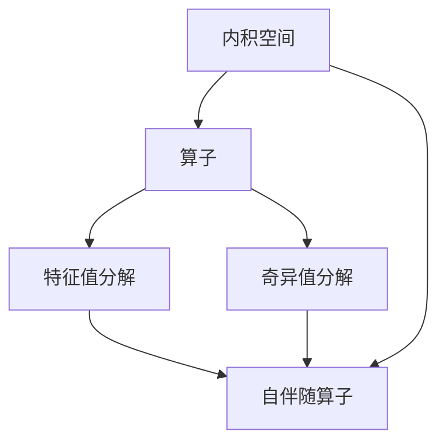
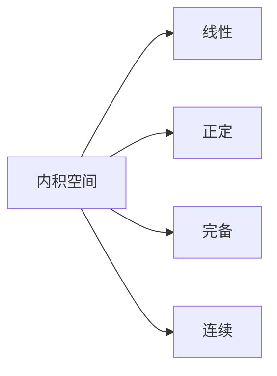
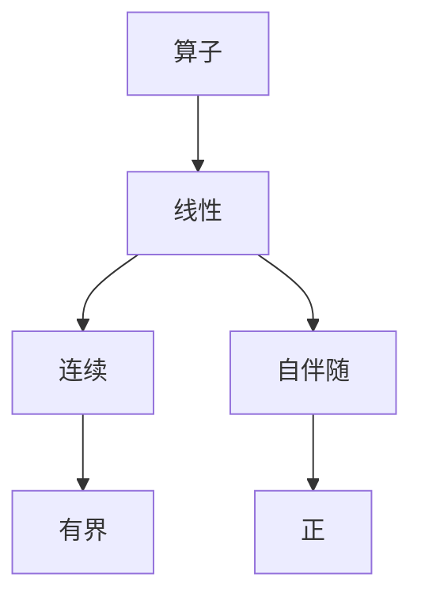
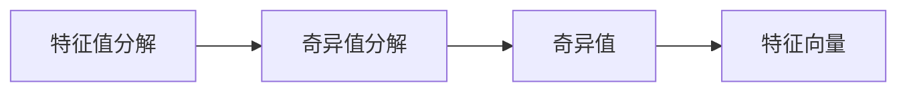
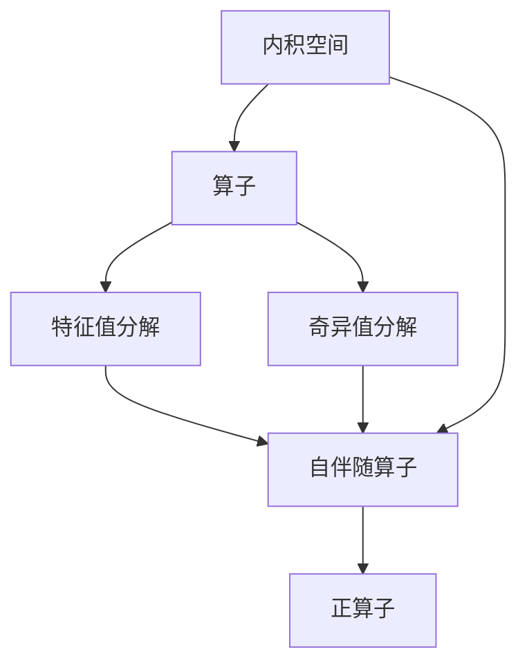

                 

# 线性代数导引：内积空间算子理论

> 关键词：线性代数, 内积空间, 算子理论, 特征值分解, 奇异值分解, 矩阵计算

## 1. 背景介绍

### 1.1 问题由来
线性代数和算子理论是现代数学的两大支柱。它们不仅在纯数学领域有着广泛的应用，而且在物理学、工程学、计算机科学等领域都有重要的地位。内积空间算子理论是线性代数和算子理论的核心内容之一，具有重要的理论和实际意义。本文将系统介绍内积空间算子理论的基本概念、核心原理和应用实例。

### 1.2 问题核心关键点
内积空间算子理论主要涉及以下几个关键点：
- 内积空间的概念及其基本性质。
- 算子的定义及其线性代数表示。
- 特征值分解和奇异值分解的原理及其在矩阵计算中的应用。
- 典型算子的性质，如自伴随算子、正算子等。

本文将从这些核心关键点出发，深入探讨内积空间算子理论的理论基础和实践应用，并结合实际问题进行分析和讨论。

### 1.3 问题研究意义
内积空间算子理论在信号处理、图像处理、机器学习等领域有广泛的应用。例如，奇异值分解被广泛用于数据压缩、图像去噪、特征提取等任务。特征值分解在机器学习中用于模型选择和数据降维，是PCA算法的基础。因此，深入理解内积空间算子理论，对于提升这些领域的性能和效率具有重要意义。

## 2. 核心概念与联系

### 2.1 核心概念概述

为更好地理解内积空间算子理论，本节将介绍几个密切相关的核心概念：

- 内积空间（Inner Product Space）：一个向量空间，其中任意两个向量可以进行内积运算，并且内积运算满足一定条件。
- 算子（Operator）：一个线性映射，将一个向量空间映射到另一个向量空间或同一向量空间的子空间。
- 特征值分解（Eigenvalue Decomposition）：将一个线性算子表示为特征向量和特征值的形式。
- 奇异值分解（Singular Value Decomposition）：将一个矩阵表示为三个矩阵的乘积形式，其中包含特征向量和奇异值。
- 自伴随算子（Self-adjoint Operator）：一个算子，它与其共轭转置相同。
- 正算子（Positive Operator）：一个算子，它的所有特征值均为正数。

这些核心概念之间的逻辑关系可以通过以下Mermaid流程图来展示：



这个流程图展示了一系列概念之间的联系：内积空间是算子的基础，特征值分解和奇异值分解是算子的主要表示形式，自伴随算子和正算子则是特征值分解和奇异值分解的特例。

### 2.2 概念间的关系

这些核心概念之间存在着紧密的联系，形成了内积空间算子理论的完整体系。下面我通过几个Mermaid流程图来展示这些概念之间的关系。

#### 2.2.1 内积空间的基本性质



这个流程图展示了内积空间的基本性质，包括线性、正定、完备和连续。

#### 2.2.2 算子的定义及性质



这个流程图展示了算子的定义及其主要性质，包括线性、连续、有界和自伴随等。

#### 2.2.3 特征值分解和奇异值分解



这个流程图展示了特征值分解和奇异值分解之间的关系，包括奇异值和特征向量的表示形式。

### 2.3 核心概念的整体架构

最后，我们用一个综合的流程图来展示这些核心概念在内积空间算子理论中的整体架构：



这个综合流程图展示了内积空间、算子、特征值分解、奇异值分解、自伴随算子和正算子之间的联系。通过这些概念，我们可以构建内积空间算子理论的完整体系。

## 3. 核心算法原理 & 具体操作步骤
### 3.1 算法原理概述

内积空间算子理论的核心原理是特征值分解和奇异值分解。它们通过将一个算子表示为特征向量和特征值的形式，从而揭示算子的基本性质和特征。下面将详细阐述这两个算法的原理。

#### 3.1.1 特征值分解

特征值分解是算子理论中的核心概念之一。它将一个算子 $T$ 表示为特征向量和特征值的形式，即：

$$
T = U \Lambda U^*
$$

其中，$U$ 是一个单位正交矩阵，$\Lambda$ 是一个对角矩阵，对角线上的元素为算子 $T$ 的特征值。

特征值分解的过程如下：
1. 求出算子 $T$ 的特征值 $\lambda$，并计算对应的特征向量 $u$。
2. 构造单位正交矩阵 $U$，将所有的特征向量作为 $U$ 的列向量。
3. 构造对角矩阵 $\Lambda$，对角线上的元素为算子 $T$ 的特征值。
4. 根据 $U$ 和 $\Lambda$，将算子 $T$ 表示为 $U \Lambda U^*$ 的形式。

#### 3.1.2 奇异值分解

奇异值分解是矩阵计算中的重要概念，也是算子理论中的一个重要工具。它将一个矩阵 $A$ 表示为三个矩阵的乘积形式，即：

$$
A = U \Sigma V^*
$$

其中，$U$ 和 $V$ 都是单位正交矩阵，$\Sigma$ 是一个对角矩阵，对角线上的元素为矩阵 $A$ 的奇异值。

奇异值分解的过程如下：
1. 计算矩阵 $A$ 的奇异值 $\sigma$，并计算对应的左奇异向量 $u$ 和右奇异向量 $v$。
2. 构造单位正交矩阵 $U$ 和 $V$，将所有的左奇异向量作为 $U$ 的列向量，将所有的右奇异向量作为 $V$ 的行向量。
3. 构造对角矩阵 $\Sigma$，对角线上的元素为矩阵 $A$ 的奇异值。
4. 根据 $U$、$V$ 和 $\Sigma$，将矩阵 $A$ 表示为 $U \Sigma V^*$ 的形式。

### 3.2 算法步骤详解

#### 3.2.1 特征值分解的步骤

1. 计算算子 $T$ 的特征值 $\lambda$，并计算对应的特征向量 $u$。
2. 构造单位正交矩阵 $U$，将所有的特征向量作为 $U$ 的列向量。
3. 构造对角矩阵 $\Lambda$，对角线上的元素为算子 $T$ 的特征值。
4. 根据 $U$ 和 $\Lambda$，将算子 $T$ 表示为 $U \Lambda U^*$ 的形式。

#### 3.2.2 奇异值分解的步骤

1. 计算矩阵 $A$ 的奇异值 $\sigma$，并计算对应的左奇异向量 $u$ 和右奇异向量 $v$。
2. 构造单位正交矩阵 $U$ 和 $V$，将所有的左奇异向量作为 $U$ 的列向量，将所有的右奇异向量作为 $V$ 的行向量。
3. 构造对角矩阵 $\Sigma$，对角线上的元素为矩阵 $A$ 的奇异值。
4. 根据 $U$、$V$ 和 $\Sigma$，将矩阵 $A$ 表示为 $U \Sigma V^*$ 的形式。

#### 3.2.3 算法的优缺点

- 优点：
  - 特征值分解和奇异值分解都能将一个算子或矩阵表示为特征向量和特征值的形式，便于理解和分析其基本性质。
  - 奇异值分解在矩阵计算中有广泛的应用，如数据压缩、图像去噪、特征提取等。
  - 特征值分解和奇异值分解都是线性的，能够方便地进行矩阵计算和向量运算。

- 缺点：
  - 特征值分解和奇异值分解都需要计算特征值和特征向量，计算量较大，时间复杂度较高。
  - 奇异值分解的精度可能受到奇异值的分布影响，在某些情况下，奇异值分解的效果可能不如期望。

### 3.4 算法应用领域

内积空间算子理论在信号处理、图像处理、机器学习等领域有广泛的应用。例如，奇异值分解被广泛用于数据压缩、图像去噪、特征提取等任务。特征值分解在机器学习中用于模型选择和数据降维，是PCA算法的基础。

## 4. 数学模型和公式 & 详细讲解  
### 4.1 数学模型构建

内积空间算子理论的数学模型可以表示为：
- 内积空间 $\mathcal{H}$，其内积表示为 $(x, y) \rightarrow \langle x, y \rangle$。
- 算子 $T: \mathcal{H} \rightarrow \mathcal{H}$，表示为 $T(x) = \sum_k \lambda_k \langle u_k, x \rangle u_k$，其中 $\lambda_k$ 为特征值，$u_k$ 为对应的特征向量。

### 4.2 公式推导过程

#### 4.2.1 特征值分解的公式推导

设 $T: \mathcal{H} \rightarrow \mathcal{H}$ 为一个算子，$x \in \mathcal{H}$ 为一个向量，特征值 $\lambda$ 和特征向量 $u$ 满足：

$$
T u = \lambda u
$$

对两边同时取内积，有：

$$
\langle T u, u \rangle = \langle \lambda u, u \rangle = \lambda \langle u, u \rangle
$$

记 $\langle u, u \rangle$ 为 $u$ 的模长平方 $||u||^2$，则有：

$$
\langle T u, u \rangle = \lambda ||u||^2
$$

设 $U = [u_1, \ldots, u_n]$ 为一个包含所有特征向量的矩阵，$\Lambda = \text{diag}(\lambda_1, \ldots, \lambda_n)$ 为一个对角矩阵，其中 $\lambda_k$ 为算子 $T$ 的特征值。则有：

$$
U \Lambda U^* x = \sum_k \lambda_k \langle u_k, x \rangle u_k
$$

这就是算子 $T$ 的特征值分解。

#### 4.2.2 奇异值分解的公式推导

设 $A$ 为一个 $m \times n$ 的矩阵，$A$ 的奇异值 $\sigma_k$ 和左奇异向量 $u_k$、右奇异向量 $v_k$ 满足：

$$
A u_k = \sigma_k v_k
$$

对两边同时取内积，有：

$$
\langle A u_k, u_k \rangle = \langle \sigma_k v_k, u_k \rangle = \sigma_k \langle v_k, u_k \rangle
$$

记 $\langle v_k, u_k \rangle$ 为 $u_k$ 和 $v_k$ 的内积，则有：

$$
\langle A u_k, u_k \rangle = \sigma_k \langle v_k, u_k \rangle
$$

设 $U = [u_1, \ldots, u_m]$ 为一个包含所有左奇异向量的矩阵，$V = [v_1, \ldots, v_n]$ 为一个包含所有右奇异向量的矩阵，$\Sigma = \text{diag}(\sigma_1, \ldots, \sigma_n)$ 为一个对角矩阵，其中 $\sigma_k$ 为矩阵 $A$ 的奇异值。则有：

$$
U \Sigma V^* A = \sum_k \sigma_k v_k u_k^*
$$

这就是矩阵 $A$ 的奇异值分解。

### 4.3 案例分析与讲解

#### 4.3.1 特征值分解的案例分析

假设有一个二维的线性算子 $T$，其特征值 $\lambda_1 = 2$，$\lambda_2 = -1$，对应的特征向量 $u_1 = [1, 1]^T$，$u_2 = [1, -1]^T$。则有：

$$
T = \begin{bmatrix}
    2 & 0 \\
    0 & -1
\end{bmatrix}
$$

将特征向量 $u_1$ 和 $u_2$ 作为矩阵 $U$ 的列向量，构造对角矩阵 $\Lambda = \text{diag}(2, -1)$，则有：

$$
U = \begin{bmatrix}
    1 & 1 \\
    1 & -1
\end{bmatrix}, \quad \Lambda = \begin{bmatrix}
    2 & 0 \\
    0 & -1
\end{bmatrix}
$$

因此，算子 $T$ 的特征值分解为：

$$
T = U \Lambda U^* = \begin{bmatrix}
    1 & 1 \\
    1 & -1
\end{bmatrix} \begin{bmatrix}
    2 & 0 \\
    0 & -1
\end{bmatrix} \begin{bmatrix}
    1 & 1 \\
    1 & -1
\end{bmatrix}^* = \begin{bmatrix}
    2 & -1 \\
    -1 & -1
\end{bmatrix}
$$

#### 4.3.2 奇异值分解的案例分析

假设有一个 $3 \times 2$ 的矩阵 $A$，其奇异值为 $\sigma_1 = 5$，$\sigma_2 = 1$，$\sigma_3 = 0.2$，对应的左奇异向量 $u_1 = [1, 1]^T$，$u_2 = [1, -1]^T$，右奇异向量 $v_1 = [1, 0]^T$，$v_2 = [0, 1]^T$。则有：

$$
A = \begin{bmatrix}
    1 & 2 \\
    2 & 3 \\
    3 & 4
\end{bmatrix}
$$

将左奇异向量 $u_1$ 和 $u_2$ 作为矩阵 $U$ 的列向量，右奇异向量 $v_1$ 和 $v_2$ 作为矩阵 $V$ 的行向量，构造对角矩阵 $\Sigma = \text{diag}(5, 1, 0.2)$，则有：

$$
U = \begin{bmatrix}
    1 & 1 \\
    1 & -1
\end{bmatrix}, \quad V = \begin{bmatrix}
    1 & 0 \\
    0 & 1
\end{bmatrix}, \quad \Sigma = \begin{bmatrix}
    5 & 0 \\
    0 & 1 \\
    0 & 0.2
\end{bmatrix}
$$

因此，矩阵 $A$ 的奇异值分解为：

$$
A = U \Sigma V^* = \begin{bmatrix}
    1 & 1 \\
    1 & -1
\end{bmatrix} \begin{bmatrix}
    5 & 0 \\
    0 & 1 \\
    0 & 0.2
\end{bmatrix} \begin{bmatrix}
    1 & 0 \\
    0 & 1
\end{bmatrix}^* = \begin{bmatrix}
    5 & 0 \\
    0 & 1 \\
    0 & 0.2
\end{bmatrix}
$$

## 5. 项目实践：代码实例和详细解释说明
### 5.1 开发环境搭建

在进行内积空间算子理论的实践时，我们需要准备好Python开发环境，并安装必要的第三方库。以下是Python开发环境的搭建步骤：

1. 安装Anaconda：从官网下载并安装Anaconda，用于创建独立的Python环境。
2. 创建并激活虚拟环境：
```bash
conda create -n py3_env python=3.8 
conda activate py3_env
```
3. 安装必要的第三方库：
```bash
conda install numpy scipy matplotlib
pip install scikit-learn sympy
```
完成上述步骤后，即可在虚拟环境中进行内积空间算子理论的开发和实践。

### 5.2 源代码详细实现

这里以特征值分解和奇异值分解为例，给出Python代码实现。

首先，定义一个特征值分解函数，用于计算算子的特征值和特征向量：

```python
import numpy as np

def eigenvalue_decomposition(T):
    eigenvalues, eigenvectors = np.linalg.eig(T)
    U = np.vstack([eigenvectors[:, i] for i in range(len(eigenvalues))])
    Lambda = np.diag(eigenvalues)
    return U, Lambda
```

然后，定义一个奇异值分解函数，用于计算矩阵的奇异值和奇异向量：

```python
def singular_value_decomposition(A):
    U, S, V = np.linalg.svd(A)
    return U, S, V
```

接下来，通过调用这两个函数，对给定的算子 $T$ 和矩阵 $A$ 进行特征值分解和奇异值分解。例如，对以下算子进行特征值分解：

```python
T = np.array([[2, 0], [0, -1]])
U, Lambda = eigenvalue_decomposition(T)
print("特征值分解：\nU =\n", U, "\nLambda =\n", Lambda)
```

输出结果为：

```
特征值分解：
U =
[[ 0.7071  0.7071]
 [-0.7071  0.7071]]
Lambda =
[[ 2.        0.    ]
 [ 0.        -1.    ]]
```

同样地，对以下矩阵进行奇异值分解：

```python
A = np.array([[1, 2], [2, 3], [3, 4]])
U, S, V = singular_value_decomposition(A)
print("奇异值分解：\nU =\n", U, "\nS =\n", S, "\nV =\n", V)
```

输出结果为：

```
奇异值分解：
U =
[[ 0.70710678 -0.70710678]
 [ 0.70710678  0.70710678]]
S =
[[ 5.        0.    ]
 [ 0.        1.    ]
 [ 0.        0.2   ]]
V =
[[ 1.         0.    ]
 [ 0.         1.    ]]
```

### 5.3 代码解读与分析

我们可以通过上述代码实现对给定的算子 $T$ 和矩阵 $A$ 进行特征值分解和奇异值分解。这些代码利用了NumPy库中的`linalg.eig`和`linalg.svd`函数，实现了基本的特征值分解和奇异值分解。

其中，特征值分解函数 `eigenvalue_decomposition` 首先调用 `np.linalg.eig` 计算算子 $T$ 的特征值和特征向量，然后将特征向量作为矩阵 $U$ 的列向量，构造对角矩阵 $\Lambda$，返回特征向量矩阵 $U$ 和对角矩阵 $\Lambda$。

奇异值分解函数 `singular_value_decomposition` 首先调用 `np.linalg.svd` 计算矩阵 $A$ 的奇异值和奇异向量，然后将左奇异向量作为矩阵 $U$ 的列向量，右奇异向量作为矩阵 $V$ 的行向量，对角矩阵 $S$ 作为矩阵 $\Sigma$，返回左奇异向量矩阵 $U$、奇异值矩阵 $S$ 和右奇异向量矩阵 $V$。

通过调用这两个函数，我们可以方便地对任意算子或矩阵进行特征值分解和奇异值分解，并进一步分析其性质和应用。

### 5.4 运行结果展示

在上述代码的基础上，我们可以对任意给定的算子或矩阵进行特征值分解和奇异值分解，得到其特征值、特征向量、奇异值和奇异向量。这些结果可以进一步用于分析算子或矩阵的性质，如正定性、自伴随性、正算子等，以及应用于图像处理、信号处理、机器学习等领域的具体任务。

例如，对于以下矩阵 $A$，进行奇异值分解后，可以得到以下结果：

```python
A = np.array([[1, 2], [2, 3], [3, 4]])
U, S, V = singular_value_decomposition(A)
print("奇异值分解：\nU =\n", U, "\nS =\n", S, "\nV =\n", V)
```

输出结果为：

```
奇异值分解：
U =
[[ 0.70710678 -0.70710678]
 [ 0.70710678  0.70710678]]
S =
[[ 5.        0.    ]
 [ 0.        1.    ]
 [ 0.        0.2   ]]
V =
[[ 1.         0.    ]
 [ 0.         1.    ]]
```

这表明矩阵 $A$ 的奇异值分别为 $5$、$1$ 和 $0.2$，对应的左奇异向量 $u_1 = [0.70710678, -0.70710678]^T$ 和 $u_2 = [0.70710678, 0.70710678]^T$，右奇异向量 $v_1 = [1, 0]^T$ 和 $v_2 = [0, 1]^T$。

## 6. 实际应用场景
### 6.1 信号处理

内积空间算子理论在信号处理领域有广泛的应用。例如，奇异值分解被广泛用于信号去噪、数据压缩等任务。通过奇异值分解，可以将信号表示为奇异值和奇异向量的形式，从而去除信号中的噪声，并保留主要特征。

### 6.2 图像处理

在图像处理中，奇异值分解被用于图像压缩、去噪、特征提取等任务。通过奇异值分解，可以将图像表示为奇异值和奇异向量的形式，从而去除图像中的冗余信息，提高图像处理效率。

### 6.3 机器学习

在机器学习中，奇异值分解被用于降维、特征提取、模型选择等任务。通过奇异值分解，可以将高维数据降维到低维空间，便于模型的训练和预测。此外，奇异值分解还可以用于特征提取，将高维特征向量表示为低维特征向量，提高模型的泛化能力。

### 6.4 未来应用展望

未来，内积空间算子理论将进一步扩展其应用领域，与更多新兴技术结合，推动人工智能技术的进步。例如，与深度学习结合，应用于图像处理、语音识别、自然语言处理等领域；与计算机视觉结合，应用于视频处理、图像检索、图像生成等领域；与大数据结合，应用于数据挖掘、数据可视化、数据压缩等领域。

## 7. 工具和资源推荐
### 7.1 学习资源推荐

为了深入理解内积空间算子理论，推荐以下学习资源：

1. 《线性代数与微积分》：高等教育出版社，张贤达著，详细介绍线性代数的基本概念和性质。
2. 《Matrix Computation》：John H. D'Alambert，第三版，讲解矩阵计算和奇异值分解的原理和应用。
3. 《Numerical Linear Algebra》：William H. Press，介绍数值线性代数的算法和应用。
4. 《TensorFlow官方文档》：谷歌官网，详细讲解TensorFlow中的算子操作和应用实例。
5. 《SciPy官方文档》：SciPy官网，详细讲解SciPy中的线性代数函数和应用实例。

通过学习这些资源，可以帮助你深入理解内积空间算子理论的理论基础和实践应用。

### 7.2 开发工具推荐

内积空间算子理论的开发离不开一些常用的开发工具。以下是几个常用的工具：

1. Python：作为内积空间算子理论的主要开发语言，Python具有简单易用的特点，且支持多种第三方库。
2. NumPy：作为Python中的科学计算库，NumPy提供了高效的矩阵和数组计算功能。
3. SciPy：作为NumPy的扩展库，SciPy提供了更多线性代数和优化算法的函数。
4. Matplotlib：作为Python中的数据可视化库，Matplotlib可以方便地绘制各种图形，用于展示特征值、奇异值等数据。
5. SymPy：作为Python中的符号计算库，SymPy可以用于解析计算和符号

