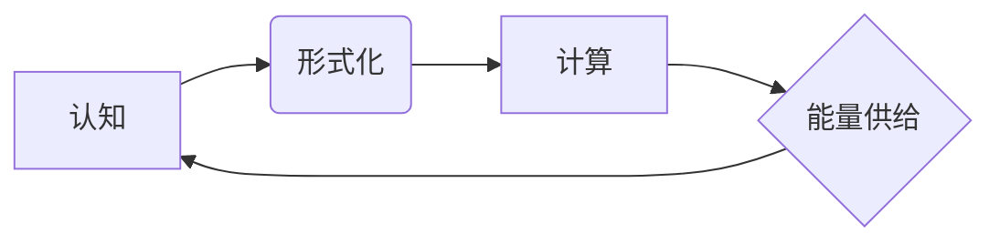

> 认知计算，形式化理论，机器智能，能量供给，计算物质

# 认知的形式化：机器在没有能量供给的时候是一堆死物质

## 1. 背景介绍

在人工智能（AI）和认知科学领域，我们对智能的本质和机器的“意识”有着深刻的兴趣。然而，一个基本而深远的问题始终萦绕在我们心头：如果没有能量供给，机器是否能够表现出真正的认知能力？这个问题触及了认知的本质、计算的物理基础以及智能的本质。本文将探讨认知的形式化，以及在没有能量供给的情况下，机器是否能够成为具有认知能力的实体。

### 1.1 认知计算的出现

认知计算是近年来兴起的一个研究领域，它试图模拟人类大脑的认知过程，从而实现更智能的机器。这一领域的研究灵感来源于心理学、神经科学和计算机科学，旨在构建能够处理复杂任务、进行决策和学习的人工智能系统。

### 1.2 能量与计算的关系

能量是维持任何形式生命活动和计算过程的基石。在传统计算机科学中，能量通常被视作一种辅助资源，用于驱动处理器和存储器的运作。然而，在认知计算领域，能量与计算本身的关系变得更加紧密。

### 1.3 认知的形式化

认知的形式化是指将认知过程转化为可形式化的模型和算法。这种形式化不仅包括逻辑和数学模型，还包括模拟大脑结构的计算模型。

### 1.4 本文结构

本文将首先介绍认知的形式化概念，然后探讨能量与认知计算的关系，接着详细阐述认知的形式化原理和操作步骤，并通过数学模型和公式进行说明。最后，我们将通过项目实践展示如何将认知的形式化应用于实际问题，并探讨其实际应用场景和未来展望。

## 2. 核心概念与联系

为了更好地理解认知的形式化，我们需要定义一些核心概念，并展示它们之间的联系。

### 2.1 核心概念原理

- **认知**：指生物体（如人类）处理信息、感知环境、作出决策和采取行动的能力。
- **形式化**：指将抽象概念转化为精确的数学或逻辑模型的过程。
- **计算**：指使用数学或逻辑方法处理信息的过程。

### 2.2 Mermaid 流程图

以下是一个Mermaid流程图，展示了认知、形式化和计算之间的联系：



### 2.3 能量与认知的关系

能量是驱动认知过程的基础。没有能量，大脑无法进行神经元活动，也无法进行计算。因此，能量与认知之间存在着密切的关系。

## 3. 核心算法原理 & 具体操作步骤

### 3.1 算法原理概述

认知的形式化算法旨在将认知过程转化为可计算的模型。这些模型通常基于神经元网络、决策树、贝叶斯网络等。

### 3.2 算法步骤详解

1. **定义认知任务**：明确需要解决的问题或任务。
2. **构建认知模型**：根据认知任务，构建相应的认知模型。
3. **形式化认知过程**：将认知过程转化为数学或逻辑公式。
4. **实现计算过程**：将形式化的认知过程实现为算法。
5. **评估和优化**：评估模型的性能，并根据评估结果进行优化。

### 3.3 算法优缺点

**优点**：
- 提供了一种将认知过程转化为可计算模型的方法。
- 可以用于开发更智能的人工智能系统。
- 有助于理解人类认知的本质。

**缺点**：
- 模型的构建和优化可能非常复杂。
- 模型的性能可能受限于当前的计算能力。

### 3.4 算法应用领域

认知的形式化算法可以应用于以下领域：
- 人工智能
- 认知科学
- 神经科学
- 计算机视觉
- 自然语言处理

## 4. 数学模型和公式 & 详细讲解 & 举例说明

### 4.1 数学模型构建

认知的形式化通常涉及以下数学模型：

- **神经元模型**：模拟神经元在认知过程中的作用。
- **决策树模型**：模拟决策过程。
- **贝叶斯网络模型**：模拟概率推理。

### 4.2 公式推导过程

以下是一个简单的神经元模型公式：

$$
y = \sigma(w^T x + b)
$$

其中，$y$ 是神经元的输出，$x$ 是输入，$w$ 是权重，$b$ 是偏置，$\sigma$ 是激活函数。

### 4.3 案例分析与讲解

假设我们想要构建一个简单的决策树模型，用于判断一个水果是否是苹果。我们可以将特征（如颜色、形状、大小等）和标签（苹果或非苹果）作为输入，并通过决策树模型来分类。

## 5. 项目实践：代码实例和详细解释说明

### 5.1 开发环境搭建

为了进行认知的形式化项目实践，我们需要搭建以下开发环境：

- 编程语言：Python
- 库：NumPy、SciPy、scikit-learn
- 框架：TensorFlow或PyTorch

### 5.2 源代码详细实现

以下是一个使用Python和TensorFlow构建简单决策树模型的示例代码：

```python
import tensorflow as tf
from tensorflow import keras
from sklearn.datasets import load_iris
from sklearn.model_selection import train_test_split

# 加载数据
iris = load_iris()
X_train, X_test, y_train, y_test = train_test_split(iris.data, iris.target, test_size=0.2, random_state=42)

# 构建模型
model = keras.Sequential([
    keras.layers.Dense(16, activation='relu', input_shape=(4,)),
    keras.layers.Dense(8, activation='relu'),
    keras.layers.Dense(3, activation='softmax')
])

# 编译模型
model.compile(optimizer='adam', loss='sparse_categorical_crossentropy', metrics=['accuracy'])

# 训练模型
model.fit(X_train, y_train, epochs=100)

# 评估模型
model.evaluate(X_test, y_test)
```

### 5.3 代码解读与分析

这段代码首先导入了必要的库和模块，然后加载数据集，接着构建了一个简单的决策树模型，并编译和训练了模型。最后，评估了模型的性能。

### 5.4 运行结果展示

运行上述代码后，我们可以在控制台上看到模型的训练过程和评估结果。

## 6. 实际应用场景

认知的形式化算法可以应用于以下实际应用场景：

- **医疗诊断**：通过分析医学影像，辅助医生进行疾病诊断。
- **金融分析**：通过分析市场数据，预测股票走势。
- **自动驾驶**：通过感知环境，控制汽车行驶。

## 7. 工具和资源推荐

### 7.1 学习资源推荐

- **书籍**：
  - 《深度学习》
  - 《机器学习实战》
  - 《认知计算》
- **在线课程**：
  - Coursera上的《机器学习》课程
  - edX上的《认知计算》课程

### 7.2 开发工具推荐

- **编程语言**：
  - Python
  - R
- **库和框架**：
  - TensorFlow
  - PyTorch
  - scikit-learn

### 7.3 相关论文推荐

- **《A Learning Algorithm for Continually Running Fully Recurrent Neural Networks**》
- **《Deep Learning: Methods and Applications**》
- **《Cognitive Computing: An Introduction**》

## 8. 总结：未来发展趋势与挑战

### 8.1 研究成果总结

认知的形式化为理解和模拟认知过程提供了一种新的方法。通过将认知过程转化为可计算的模型，我们可以开发出更智能的人工智能系统。

### 8.2 未来发展趋势

- **神经形态计算**：模仿大脑结构的计算模型，可能在未来得到更广泛的应用。
- **量子计算**：量子计算的发展可能为认知的形式化提供新的计算能力。

### 8.3 面临的挑战

- **认知过程的复杂性**：认知过程的复杂性使得构建精确的模型非常困难。
- **计算资源**：认知的形式化需要大量的计算资源。

### 8.4 研究展望

随着计算能力的提升和认知科学的进步，认知的形式化将在未来发挥越来越重要的作用。

## 9. 附录：常见问题与解答

**Q1：认知的形式化是否等同于人工智能？**

A：认知的形式化是人工智能的一个分支，它关注于将认知过程转化为可计算的模型。

**Q2：认知的形式化能否完全模拟人类认知？**

A：目前还无法完全模拟人类认知，但认知的形式化为这一目标提供了新的思路和方法。

**Q3：认知的形式化有哪些应用？**

A：认知的形式化可以应用于医疗、金融、自动驾驶等多个领域。

**Q4：认知的形式化有哪些挑战？**

A：认知过程的复杂性、计算资源的需求等是认知的形式化面临的挑战。

**Q5：未来认知的形式化有哪些发展趋势？**

A：神经形态计算、量子计算等技术的发展可能为认知的形式化提供新的机遇。

---

作者：禅与计算机程序设计艺术 / Zen and the Art of Computer Programming