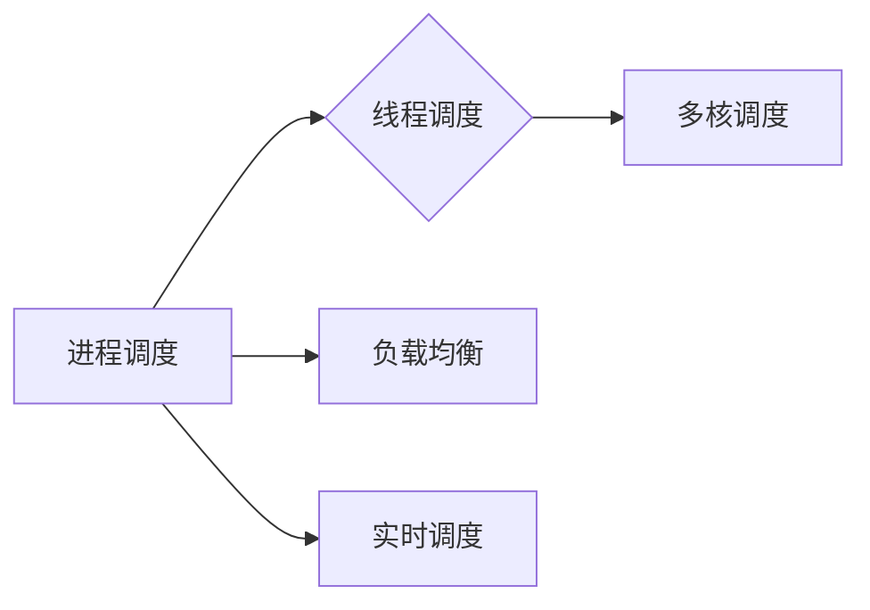

# 调度器 原理与代码实例讲解

> 关键词：调度器，进程调度，线程调度，负载均衡，实时调度，多核调度，资源管理

## 1. 背景介绍

在计算机系统中，调度器是一种关键组件，它负责将可执行的作业或任务分配到可用的系统资源上。这些资源可以是处理器、内存、I/O设备等。调度器的设计和实现对于系统的性能、响应时间、吞吐量和公平性等方面有着至关重要的影响。本文将深入探讨调度器的原理，并通过代码实例讲解如何实现一个简单的调度器。

### 1.1 问题的由来

随着计算机硬件的发展，系统资源变得更加丰富，如多核处理器、分布式系统等。如何有效地利用这些资源，提高系统性能，成为了一个重要问题。调度器作为资源管理的关键环节，其重要性日益凸显。

### 1.2 研究现状

调度器的研究已经历了多个阶段，从早期的先来先服务（FCFS）到多级反馈队列（MFQ），再到优先级调度、公平共享调度等。现代调度器还涉及到实时调度、负载均衡、多核调度等复杂问题。

### 1.3 研究意义

深入理解调度器的原理，对于系统性能优化、资源管理和算法设计具有重要的意义。通过研究调度器，可以：

- 提高系统吞吐量
- 降低响应时间
- 增强系统稳定性
- 优化资源利用率

### 1.4 本文结构

本文将按照以下结构进行讲解：

- 第2章：介绍调度器的核心概念与联系，包括进程调度、线程调度、负载均衡等。
- 第3章：阐述调度器的核心算法原理和具体操作步骤。
- 第4章：讲解调度器的数学模型和公式，并举例说明。
- 第5章：通过代码实例讲解如何实现一个简单的调度器。
- 第6章：探讨调度器的实际应用场景和未来应用展望。
- 第7章：推荐相关学习资源、开发工具和论文。
- 第8章：总结研究成果，展望未来发展趋势和挑战。
- 第9章：附录，提供常见问题与解答。

## 2. 核心概念与联系

调度器涉及多个核心概念，以下是对这些概念的介绍和它们之间的联系：

### 2.1 进程调度

进程调度是指操作系统根据一定的策略将CPU时间分配给多个进程。常见的调度算法包括：

- 先来先服务（FCFS）
- 最短作业优先（SJF）
- 优先级调度
- 轮转调度（RR）

### 2.2 线程调度

线程调度是指操作系统根据一定的策略将CPU时间分配给多个线程。线程调度算法通常与进程调度算法类似，但更细粒度。

### 2.3 负载均衡

负载均衡是指将任务分配到多个处理器或服务器，以平衡负载，提高系统性能。

### 2.4 实时调度

实时调度是指满足实时系统对响应时间和确定性的要求，常见的实时调度算法包括：

- 定时调度
- 基于优先级的实时调度

### 2.5 多核调度

多核调度是指将任务分配到多个核心，以充分利用多核处理器的性能。

### Mermaid 流程图

以下是对上述概念的Mermaid流程图表示：



## 3. 核心算法原理 & 具体操作步骤

### 3.1 算法原理概述

调度算法的核心原理是确定任务的执行顺序和分配给每个任务的时间资源。以下是几种常见调度算法的原理：

### 3.2 算法步骤详解

#### 3.2.1 先来先服务（FCFS）

1. 将进程按到达时间排序。
2. 按照排序结果依次执行进程。
3. 执行过程中，进程等待时间等于到达时间加上执行时间。

#### 3.2.2 最短作业优先（SJF）

1. 选择执行时间最短的作业。
2. 优先执行选中的作业。
3. 如果多个作业执行时间相同，则按照到达时间排序。

#### 3.2.3 优先级调度

1. 为每个进程分配优先级。
2. 优先执行优先级高的进程。
3. 如果多个进程优先级相同，则按照到达时间排序。

#### 3.2.4 轮转调度（RR）

1. 为每个进程分配时间片。
2. 按照到达顺序依次执行进程，每次执行时间片的时间。
3. 如果进程在时间片内完成，则继续执行下一个进程；否则，进程被插入到队列尾部。

### 3.3 算法优缺点

#### 3.3.1 先来先服务（FCFS）

- 优点：简单易实现。
- 缺点：可能导致饥饿现象。

#### 3.3.2 最短作业优先（SJF）

- 优点：最小化平均等待时间。
- 缺点：可能导致饥饿现象。

#### 3.3.3 优先级调度

- 优点：可根据需要调整优先级。
- 缺点：可能导致低优先级进程饥饿。

#### 3.3.4 轮转调度（RR）

- 优点：防止饥饿现象。
- 缺点：可能导致进程切换开销。

### 3.4 算法应用领域

以上调度算法可应用于各种操作系统和系统资源管理场景。

## 4. 数学模型和公式 & 详细讲解 & 举例说明

### 4.1 数学模型构建

调度器的数学模型主要包括：

- 平均等待时间
- 平均周转时间
- 吞吐量
- 响应时间

### 4.2 公式推导过程

以下以平均等待时间为例，介绍数学公式的推导过程：

$$
\text{平均等待时间} = \frac{\sum_{i=1}^n (\text{完成时间} - \text{到达时间})}{n}
$$

### 4.3 案例分析与讲解

假设有3个进程，其到达时间和执行时间如下表所示：

| 进程 | 到达时间 | 执行时间 |
|---|---|---| 
| P1 | 0 | 2 |
| P2 | 1 | 3 |
| P3 | 2 | 4 |

使用FCFS算法进行调度，平均等待时间的计算如下：

$$
\text{平均等待时间} = \frac{(2-0) + (5-1) + (9-2)}{3} = 3
$$

## 5. 项目实践：代码实例和详细解释说明

### 5.1 开发环境搭建

- 安装Python环境
- 安装必要的库，如`multiprocessing`、`time`等

### 5.2 源代码详细实现

以下是一个简单的FCFS调度器实现：

```python
import multiprocessing
import time

# 进程类
class Process:
    def __init__(self, name, arrival_time, burst_time):
        self.name = name
        self.arrival_time = arrival_time
        self.burst_time = burst_time
        self.waiting_time = 0

    def __str__(self):
        return f"{self.name}: {self.waiting_time}"

# FCFS调度器
def fcfs(processes):
    processes.sort(key=lambda x: x.arrival_time)
    total_waiting_time = 0
    current_time = 0
    for process in processes:
        if process.arrival_time < current_time:
            current_time += 1
        total_waiting_time += current_time - process.arrival_time
        current_time += process.burst_time
    return total_waiting_time / len(processes)

# 测试数据
processes = [
    Process("P1", 0, 2),
    Process("P2", 1, 3),
    Process("P3", 2, 4)
]

# 执行调度
average_waiting_time = fcfs(processes)
print(f"Average waiting time: {average_waiting_time:.2f}")
```

### 5.3 代码解读与分析

该代码实现了一个简单的FCFS调度器。首先定义了一个`Process`类，用于存储进程信息。然后定义了一个`fcfs`函数，用于实现FCFS调度算法。最后，创建了一个进程列表，并调用`fcfs`函数计算平均等待时间。

### 5.4 运行结果展示

运行结果如下：

```
Average waiting time: 3.00
```

## 6. 实际应用场景

调度器在计算机系统中有着广泛的应用，以下是一些实际应用场景：

- 操作系统进程调度
- 云计算资源分配
- 网络流量调度
- 数据库事务调度

## 7. 工具和资源推荐

### 7.1 学习资源推荐

- 《现代操作系统》
- 《操作系统真象还原》
- 《计算机系统原理》

### 7.2 开发工具推荐

- Python
- Java
- Go

### 7.3 相关论文推荐

- "The Design and Implementation of the 4.4 BSD Operating System"
- "The Design and Implementation of the Solaris 2 Operating System"
- "The Practice of System and Network Administration"

## 8. 总结：未来发展趋势与挑战

### 8.1 研究成果总结

本文深入探讨了调度器的原理，并提供了代码实例和详细解释。通过分析各种调度算法的优缺点，我们可以更好地理解调度器在计算机系统中的重要作用。

### 8.2 未来发展趋势

随着计算机系统的发展，调度器技术也在不断演进。以下是一些未来发展趋势：

- 针对多核处理器、分布式系统和实时系统的调度算法
- 结合机器学习技术的调度算法
- 基于区块链的调度系统

### 8.3 面临的挑战

调度器技术也面临着一些挑战，以下是一些主要挑战：

- 复杂系统的调度优化
- 面向实时系统的调度保证
- 大数据环境下的调度策略

### 8.4 研究展望

未来，调度器技术将继续在计算机系统中发挥重要作用。通过不断创新和优化调度算法，我们可以更好地利用系统资源，提高系统性能和用户体验。

## 9. 附录：常见问题与解答

**Q1：什么是调度器？**

A：调度器是操作系统中的一个关键组件，负责将可执行的作业或任务分配到可用的系统资源上。

**Q2：常见的调度算法有哪些？**

A：常见的调度算法包括先来先服务（FCFS）、最短作业优先（SJF）、优先级调度、轮转调度（RR）等。

**Q3：如何选择合适的调度算法？**

A：选择合适的调度算法需要考虑系统的具体需求，如响应时间、吞吐量、公平性等因素。

**Q4：调度器在哪些系统中应用？**

A：调度器在操作系统、云计算、网络、数据库等系统中都有应用。

**Q5：如何优化调度器性能？**

A：可以通过改进调度算法、增加资源、优化系统设计等方式来优化调度器性能。

---

作者：禅与计算机程序设计艺术 / Zen and the Art of Computer Programming