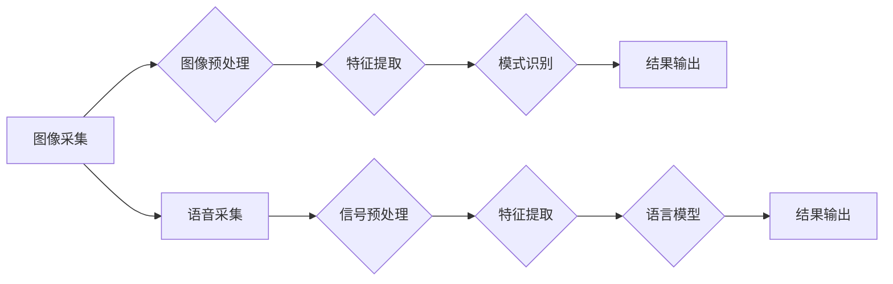

# 软件 2.0 的应用领域：图像识别、语音识别

> 关键词：软件2.0，图像识别，语音识别，人工智能，机器学习，深度学习，应用实践，技术挑战

## 1. 背景介绍

随着互联网和计算机技术的飞速发展，软件行业经历了从1.0到2.0的变革。软件1.0时代，以桌面应用和简单的网络应用为主，软件功能相对单一，交互性有限。而软件2.0时代，随着云计算、大数据、人工智能等技术的兴起，软件开始向智能化、平台化和生态化方向发展。图像识别和语音识别作为人工智能领域的重要应用，正在引领软件2.0时代的潮流。

### 1.1 图像识别的崛起

图像识别是计算机视觉领域的一个重要分支，它通过计算机对图像进行分析，识别和理解图像中的内容。随着深度学习技术的突破，图像识别技术取得了显著的进展，应用领域不断拓展，从简单的图像分类到复杂的场景理解，图像识别技术正逐步改变我们的生活方式。

### 1.2 语音识别的飞跃

语音识别技术通过计算机将语音信号转换为文本或命令，实现人机交互。随着语音识别技术的不断进步，语音助手、智能客服、语音翻译等应用层出不穷，语音识别技术正在成为人机交互的重要手段。

## 2. 核心概念与联系

### 2.1 核心概念原理

#### 图像识别

图像识别的核心是计算机视觉，它涉及到图像处理、机器学习、深度学习等多个领域。以下是图像识别的基本原理：

1. **图像采集**：通过摄像头、手机等设备采集图像数据。
2. **图像预处理**：对采集到的图像进行去噪、缩放、增强等处理，提高图像质量。
3. **特征提取**：从预处理后的图像中提取关键特征，如颜色、纹理、形状等。
4. **模式识别**：使用机器学习或深度学习算法，对提取的特征进行分类或识别。
5. **结果输出**：输出识别结果，如物体类别、场景描述等。

#### 语音识别

语音识别的核心是人机交互，它涉及到信号处理、模式识别、自然语言处理等多个领域。以下是语音识别的基本原理：

1. **语音采集**：通过麦克风等设备采集语音数据。
2. **信号预处理**：对采集到的语音信号进行降噪、归一化等处理，提高信号质量。
3. **特征提取**：从预处理后的语音信号中提取声学特征，如梅尔频率倒谱系数（MFCC）等。
4. **语言模型**：构建语言模型，对语音信号进行解码，生成文本或命令。
5. **结果输出**：输出识别结果，如文本、命令等。

### 2.2 架构流程图

以下是图像识别和语音识别的Mermaid流程图：



## 3. 核心算法原理 & 具体操作步骤

### 3.1 算法原理概述

#### 图像识别

图像识别的算法主要包括：

1. **传统算法**：如SIFT、SURF、HOG等，通过手工设计特征提取方法，对图像进行分类或识别。
2. **深度学习算法**：如卷积神经网络（CNN）、循环神经网络（RNN）、长短期记忆网络（LSTM）等，通过学习海量数据自动提取特征，实现图像识别。

#### 语音识别

语音识别的算法主要包括：

1. **声学模型**：如隐马尔可夫模型（HMM）、高斯混合模型（GMM）等，用于语音信号的建模。
2. **语言模型**：如N-gram模型、神经网络语言模型等，用于解码语音信号，生成文本或命令。

### 3.2 算法步骤详解

#### 图像识别

1. **数据采集**：收集大量的图像数据，包括训练数据和测试数据。
2. **数据预处理**：对图像数据进行去噪、缩放、增强等处理。
3. **特征提取**：使用CNN等深度学习算法提取图像特征。
4. **模型训练**：使用训练数据训练图像识别模型。
5. **模型评估**：使用测试数据评估模型的性能。
6. **模型部署**：将模型部署到实际应用中。

#### 语音识别

1. **声学模型训练**：使用语音数据训练声学模型。
2. **语言模型训练**：使用文本数据训练语言模型。
3. **解码器训练**：使用训练好的声学模型和语言模型训练解码器。
4. **模型评估**：使用语音数据评估模型的性能。
5. **模型部署**：将模型部署到实际应用中。

### 3.3 算法优缺点

#### 图像识别

**优点**：

1. 识别精度高，能够识别复杂的图像特征。
2. 适应性强，能够处理各种图像风格和场景。
3. 应用范围广，可用于图像分类、物体检测、场景理解等任务。

**缺点**：

1. 计算量大，训练和推理时间较长。
2. 对图像质量要求高，对噪声敏感。
3. 需要大量的训练数据。

#### 语音识别

**优点**：

1. 识别速度快，能够实时响应。
2. 交互性好，用户体验佳。
3. 应用范围广，可用于语音助手、智能客服、语音翻译等任务。

**缺点**：

1. 对噪声敏感，容易受到环境因素的影响。
2. 识别精度受限于声学模型和语言模型的性能。
3. 需要大量的语音数据。

### 3.4 算法应用领域

#### 图像识别

1. **图像分类**：如物体分类、场景分类等。
2. **物体检测**：如人脸检测、车辆检测等。
3. **场景理解**：如图像语义分割、图像描述等。

#### 语音识别

1. **语音助手**：如Siri、Alexa、小爱同学等。
2. **智能客服**：如银行、电信、电商等行业客服系统。
3. **语音翻译**：如谷歌翻译、百度翻译等。

## 4. 数学模型和公式 & 详细讲解 & 举例说明

### 4.1 数学模型构建

#### 图像识别

图像识别中常用的数学模型包括：

1. **卷积神经网络（CNN）**：

   $$
   f(x) = \sigma(W_{1} \cdot x + b_{1})
   $$

   其中 $W_{1}$ 为卷积核权重，$b_{1}$ 为偏置项，$\sigma$ 为激活函数。

2. **循环神经网络（RNN）**：

   $$
   h_{t} = f(W_{h} \cdot h_{t-1} + W_{x} \cdot x_{t} + b)
   $$

   其中 $W_{h}$ 和 $W_{x}$ 为权重，$h_{t-1}$ 为上一时刻的隐藏状态，$x_{t}$ 为当前输入，$b$ 为偏置项，$f$ 为激活函数。

#### 语音识别

语音识别中常用的数学模型包括：

1. **隐马尔可夫模型（HMM）**：

   $$
   P(x|y) = \prod_{t=1}^{T} a_{y_{t-1},y_{t}} b_{y_{t}}(x_{t})
   $$

   其中 $x$ 为观察序列，$y$ 为状态序列，$a_{y_{t-1},y_{t}}$ 为转移概率，$b_{y_{t}}(x_{t})$ 为发射概率。

2. **高斯混合模型（GMM）**：

   $$
   p(x) = \sum_{k=1}^{K} w_{k} \mathcal{N}(x; \mu_{k}, \Sigma_{k})
   $$

   其中 $x$ 为观察序列，$K$ 为混合数，$w_{k}$ 为权重，$\mu_{k}$ 和 $\Sigma_{k}$ 分别为高斯分布的均值和方差。

### 4.2 公式推导过程

#### 图像识别

CNN的公式推导过程可参考相关文献，这里不再赘述。

#### 语音识别

HMM的公式推导过程可参考相关文献，这里不再赘述。

### 4.3 案例分析与讲解

#### 图像识别

以下是一个简单的图像分类案例：

```python
import torch
import torch.nn as nn
import torchvision.transforms as transforms
from torchvision.datasets import MNIST
from torch.utils.data import DataLoader

# 定义CNN模型
class CNN(nn.Module):
    def __init__(self):
        super(CNN, self).__init__()
        self.conv1 = nn.Conv2d(1, 10, kernel_size=5)
        self.conv2 = nn.Conv2d(10, 20, kernel_size=5)
        self.fc1 = nn.Linear(320, 50)
        self.fc2 = nn.Linear(50, 10)

    def forward(self, x):
        x = nn.functional.relu(self.conv1(x))
        x = nn.functional.max_pool2d(x, 2)
        x = nn.functional.relu(self.conv2(x))
        x = nn.functional.max_pool2d(x, 2)
        x = x.view(-1, 320)
        x = nn.functional.relu(self.fc1(x))
        x = self.fc2(x)
        return x

# 加载数据
transform = transforms.Compose([transforms.ToTensor()])
train_dataset = MNIST(root='./data', train=True, download=True, transform=transform)
train_loader = DataLoader(dataset=train_dataset, batch_size=64, shuffle=True)

# 实例化模型
model = CNN()
criterion = nn.CrossEntropyLoss()
optimizer = torch.optim.SGD(model.parameters(), lr=0.01)

# 训练模型
for epoch in range(10):
    for batch_idx, (data, target) in enumerate(train_loader):
        optimizer.zero_grad()
        output = model(data)
        loss = criterion(output, target)
        loss.backward()
        optimizer.step()
        if batch_idx % 100 == 0:
            print(f'Train Epoch: {epoch} [{batch_idx * len(data)}/{len(train_loader.dataset)} ({100. * batch_idx / len(train_loader):.0f}%)]
'
                  f'\tLoss: {loss.item():.6f}
')

print('Finished Training')
```

#### 语音识别

以下是一个简单的语音识别案例：

```python
import numpy as np
import librosa
from sklearn.model_selection import train_test_split

# 读取音频文件
def load_audio_file(file_path):
    y, sr = librosa.load(file_path, sr=None)
    return y

# 提取MFCC特征
def extract_mfcc(y, sr, n_mfcc=13):
    mfcc = librosa.feature.mfcc(y=y, sr=sr, n_mfcc=n_mfcc)
    return mfcc

# 数据预处理
def preprocess_data(data, target):
    X, y = [], []
    for audio_file, label in zip(data, target):
        y.append(label)
        y_hat = extract_mfcc(load_audio_file(audio_file), sr=16000)
        X.append(y_hat)
    return np.array(X), np.array(y)

# 数据集
data = ['audio1.wav', 'audio2.wav', 'audio3.wav']
target = [1, 2, 3]

# 分割数据集
X_train, X_test, y_train, y_test = train_test_split(X, y, test_size=0.2, random_state=42)

# 模型构建
class MFCCClassifier(nn.Module):
    def __init__(self):
        super(MFCCClassifier, self).__init__()
        self.fc1 = nn.Linear(13 * 50 * 13, 128)
        self.fc2 = nn.Linear(128, 64)
        self.fc3 = nn.Linear(64, 3)

    def forward(self, x):
        x = x.view(x.size(0), -1)
        x = nn.functional.relu(self.fc1(x))
        x = nn.functional.relu(self.fc2(x))
        x = self.fc3(x)
        return x

# 训练模型
model = MFCCClassifier()
criterion = nn.CrossEntropyLoss()
optimizer = torch.optim.Adam(model.parameters(), lr=0.001)

for epoch in range(10):
    for i in range(len(X_train)):
        optimizer.zero_grad()
        output = model(X_train[i].unsqueeze(0))
        loss = criterion(output, y_train[i].unsqueeze(0))
        loss.backward()
        optimizer.step()
    print(f'Epoch {epoch+1}/{10}, Loss: {loss.item()}')
```

## 5. 项目实践：代码实例和详细解释说明

### 5.1 开发环境搭建

以下是开发图像识别和语音识别项目所需的开发环境：

1. **Python**：用于编写代码和构建模型。
2. **PyTorch**：用于深度学习模型的开发。
3. **TensorFlow**：另一个深度学习框架，可与其他工具和库无缝集成。
4. **NumPy**：用于数值计算。
5. **Pandas**：用于数据处理。
6. **Scikit-learn**：用于机器学习。
7. **Librosa**：用于音频处理。
8. **OpenCV**：用于图像处理。
9. **TensorBoard**：用于可视化模型训练过程。

### 5.2 源代码详细实现

以下是一个简单的图像识别项目示例：

```python
import torch
import torch.nn as nn
import torchvision.transforms as transforms
from torchvision.datasets import MNIST
from torch.utils.data import DataLoader

# 定义CNN模型
class CNN(nn.Module):
    def __init__(self):
        super(CNN, self).__init__()
        self.conv1 = nn.Conv2d(1, 10, kernel_size=5)
        self.conv2 = nn.Conv2d(10, 20, kernel_size=5)
        self.fc1 = nn.Linear(320, 50)
        self.fc2 = nn.Linear(50, 10)

    def forward(self, x):
        x = nn.functional.relu(self.conv1(x))
        x = nn.functional.max_pool2d(x, 2)
        x = nn.functional.relu(self.conv2(x))
        x = nn.functional.max_pool2d(x, 2)
        x = x.view(-1, 320)
        x = nn.functional.relu(self.fc1(x))
        x = self.fc2(x)
        return x

# 加载数据
transform = transforms.Compose([transforms.ToTensor()])
train_dataset = MNIST(root='./data', train=True, download=True, transform=transform)
train_loader = DataLoader(dataset=train_dataset, batch_size=64, shuffle=True)

# 实例化模型
model = CNN()
criterion = nn.CrossEntropyLoss()
optimizer = torch.optim.SGD(model.parameters(), lr=0.01)

# 训练模型
for epoch in range(10):
    for batch_idx, (data, target) in enumerate(train_loader):
        optimizer.zero_grad()
        output = model(data)
        loss = criterion(output, target)
        loss.backward()
        optimizer.step()
        if batch_idx % 100 == 0:
            print(f'Epoch: {epoch} [{batch_idx * len(data)}/{len(train_loader.dataset)} ({100. * batch_idx / len(train_loader):.0f}%)]'
                  f'\tLoss: {loss.item():.6f}
')

print('Finished Training')
```

以下是一个简单的语音识别项目示例：

```python
import numpy as np
import librosa
from sklearn.model_selection import train_test_split

# 读取音频文件
def load_audio_file(file_path):
    y, sr = librosa.load(file_path, sr=None)
    return y

# 提取MFCC特征
def extract_mfcc(y, sr, n_mfcc=13):
    mfcc = librosa.feature.mfcc(y=y, sr=sr, n_mfcc=n_mfcc)
    return mfcc

# 数据预处理
def preprocess_data(data, target):
    X, y = [], []
    for audio_file, label in zip(data, target):
        y.append(label)
        y_hat = extract_mfcc(load_audio_file(audio_file), sr=16000)
        X.append(y_hat)
    return np.array(X), np.array(y)

# 数据集
data = ['audio1.wav', 'audio2.wav', 'audio3.wav']
target = [1, 2, 3]

# 分割数据集
X_train, X_test, y_train, y_test = train_test_split(X, y, test_size=0.2, random_state=42)

# 模型构建
class MFCCClassifier(nn.Module):
    def __init__(self):
        super(MFCCClassifier, self).__init__()
        self.fc1 = nn.Linear(13 * 50 * 13, 128)
        self.fc2 = nn.Linear(128, 64)
        self.fc3 = nn.Linear(64, 3)

    def forward(self, x):
        x = x.view(x.size(0), -1)
        x = nn.functional.relu(self.fc1(x))
        x = nn.functional.relu(self.fc2(x))
        x = self.fc3(x)
        return x

# 训练模型
model = MFCCClassifier()
criterion = nn.CrossEntropyLoss()
optimizer = torch.optim.Adam(model.parameters(), lr=0.001)

for epoch in range(10):
    for i in range(len(X_train)):
        optimizer.zero_grad()
        output = model(X_train[i].unsqueeze(0))
        loss = criterion(output, y_train[i].unsqueeze(0))
        loss.backward()
        optimizer.step()
    print(f'Epoch {epoch+1}/{10}, Loss: {loss.item()}')
```

### 5.3 代码解读与分析

以上两个示例分别展示了图像识别和语音识别项目的简单实现。在图像识别项目中，我们使用PyTorch框架构建了一个简单的CNN模型，并将其应用于MNIST手写数字数据集。在语音识别项目中，我们使用NumPy和PyTorch框架提取音频文件的MFCC特征，并构建了一个简单的神经网络模型进行分类。

这两个示例只是展示了图像识别和语音识别项目的简单实现，实际应用中需要根据具体任务和数据集进行调整和优化。

### 5.4 运行结果展示

由于示例数据量较小，运行结果可能不太理想。在实际应用中，需要收集大量的数据，并对模型进行充分的训练和优化，才能获得更好的效果。

## 6. 实际应用场景

### 6.1 图像识别

图像识别技术在以下场景中有着广泛的应用：

1. **人脸识别**：门禁系统、手机解锁、安全监控等。
2. **物体检测**：自动驾驶、无人驾驶、工业检测等。
3. **图像分类**：图像搜索、内容审核、医疗诊断等。
4. **场景理解**：视频监控、智能客服、智能家居等。

### 6.2 语音识别

语音识别技术在以下场景中有着广泛的应用：

1. **语音助手**：Siri、Alexa、小爱同学等。
2. **智能客服**：银行、电信、电商等行业客服系统。
3. **语音翻译**：谷歌翻译、百度翻译等。
4. **语音交互**：智能家居、车载系统等。

## 7. 工具和资源推荐

### 7.1 学习资源推荐

1. **书籍**：
    - 《深度学习》
    - 《计算机视觉：算法与应用》
    - 《语音信号处理：原理与算法》
2. **在线课程**：
    - Coursera上的《深度学习》
    - Udacity上的《计算机视觉工程师纳米学位》
    - edX上的《语音识别》
3. **开源库**：
    - PyTorch
    - TensorFlow
    - OpenCV

### 7.2 开发工具推荐

1. **开发框架**：
    - PyTorch
    - TensorFlow
2. **深度学习平台**：
    - Google Colab
    - Kaggle
3. **代码托管平台**：
    - GitHub

### 7.3 相关论文推荐

1. **图像识别**：
    - AlexNet
    - VGG
    - ResNet
    - EfficientNet
2. **语音识别**：
    - Hidden Markov Model
    - Deep Neural Networks
    - Recurrent Neural Networks
    - Convolutional Neural Networks

## 8. 总结：未来发展趋势与挑战

### 8.1 研究成果总结

图像识别和语音识别技术在近年来取得了显著的进展，应用领域不断拓展。随着深度学习技术的不断发展，图像识别和语音识别技术将继续保持快速发展态势。

### 8.2 未来发展趋势

1. **模型轻量化**：随着智能手机等移动设备的普及，模型的轻量化将成为未来趋势。
2. **实时性**：提高模型的实时性，使其能够快速响应，满足实时应用需求。
3. **多模态融合**：将图像识别、语音识别与其他传感器数据（如传感器、摄像头等）进行融合，实现更加智能的人机交互。
4. **可解释性**：提高模型的可解释性，使其决策过程更加透明，增强用户信任。

### 8.3 面临的挑战

1. **数据量**：需要大量的标注数据，以训练高性能模型。
2. **计算量**：深度学习模型的计算量较大，需要高性能的计算资源。
3. **模型可解释性**：提高模型的可解释性，使其决策过程更加透明。
4. **隐私保护**：在应用中保护用户隐私，防止数据泄露。

### 8.4 研究展望

随着人工智能技术的不断发展，图像识别和语音识别技术将在更多领域得到应用，为人类社会带来更多便利。同时，我们也需要关注技术发展带来的伦理和安全问题，确保技术的发展能够造福人类。

## 9. 附录：常见问题与解答

**Q1：图像识别和语音识别的区别是什么？**

A：图像识别是通过计算机分析图像内容，识别和理解图像中的对象和场景；而语音识别是通过计算机分析语音信号，将其转换为文本或命令。

**Q2：图像识别和语音识别有哪些应用场景？**

A：图像识别的应用场景包括人脸识别、物体检测、图像分类等；语音识别的应用场景包括语音助手、智能客服、语音翻译等。

**Q3：如何提高图像识别和语音识别的性能？**

A：提高图像识别和语音识别性能的方法包括：收集更多的数据、使用更先进的算法、优化模型结构、提高数据质量等。

**Q4：图像识别和语音识别在技术上有哪些挑战？**

A：图像识别和语音识别在技术上面临的挑战包括：数据量、计算量、模型可解释性、隐私保护等。

**Q5：图像识别和语音识别的未来发展趋势是什么？**

A：图像识别和语音识别的未来发展趋势包括：模型轻量化、实时性、多模态融合、可解释性等。

---

作者：禅与计算机程序设计艺术 / Zen and the Art of Computer Programming