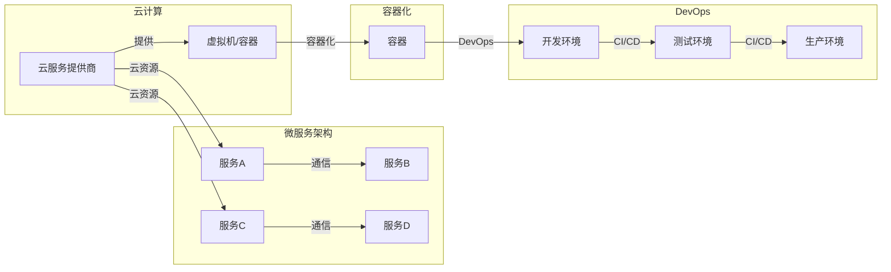

# 软件 2.0 的应用：从实验室走向现实

> 关键词：软件 2.0，云计算，微服务，容器化，DevOps，持续集成/持续部署（CI/CD），敏捷开发，数字化转型

## 1. 背景介绍

随着互联网和云计算技术的飞速发展，软件行业正在经历一场从软件 1.0 到软件 2.0 的变革。软件 1.0 时代，软件通常是封闭的、静态的，以单体应用为主，开发周期长，维护成本高。而软件 2.0 时代，软件更加开放、动态，以微服务架构为主，强调敏捷开发、持续集成/持续部署（CI/CD），旨在实现快速迭代和高效交付。

### 1.1 问题的由来

软件 1.0 时代的软件面临着以下问题：

- **开发周期长**：传统的瀑布模型导致开发周期长，难以满足快速变化的市场需求。
- **维护成本高**：单体应用结构复杂，维护难度大，成本高。
- **扩展性差**：单体应用难以扩展，扩展能力有限。
- **部署困难**：部署流程复杂，部署周期长。

### 1.2 研究现状

软件 2.0 时代，云计算、微服务、容器化、DevOps 等技术应运而生，为解决软件 1.0 时代的问题提供了新的思路和方法。

- **云计算**：提供弹性、可扩展的计算资源，降低 IT 成本。
- **微服务**：将单体应用拆分为多个独立的服务，提高可扩展性和可维护性。
- **容器化**：实现应用的轻量化、标准化，方便部署和迁移。
- **DevOps**：强调开发和运维的协作，实现快速迭代和高效交付。

### 1.3 研究意义

软件 2.0 的应用对于企业数字化转型具有重要意义：

- **提高开发效率**：缩短开发周期，快速响应市场需求。
- **降低运维成本**：简化运维流程，降低运维成本。
- **增强业务灵活性**：提高业务扩展性和灵活性。
- **提升客户体验**：快速迭代，提升客户体验。

### 1.4 本文结构

本文将围绕软件 2.0 的应用展开，具体内容包括：

- 核心概念与联系
- 核心算法原理 & 具体操作步骤
- 数学模型和公式 & 详细讲解 & 举例说明
- 项目实践：代码实例和详细解释说明
- 实际应用场景
- 工具和资源推荐
- 总结：未来发展趋势与挑战
- 附录：常见问题与解答

## 2. 核心概念与联系

### 2.1 核心概念

- **云计算**：提供可伸缩的计算资源，包括虚拟机、容器等，用户按需付费。
- **微服务**：将大型应用拆分为多个独立的服务，每个服务负责应用的一个特定功能。
- **容器化**：使用容器技术封装应用及其依赖环境，实现应用的轻量化、标准化。
- **DevOps**：强调开发和运维的协作，实现快速迭代和高效交付。
- **持续集成/持续部署（CI/CD）**：自动化构建、测试、部署流程，提高开发效率。

### 2.2 架构图

以下是一个软件 2.0 架构的 Mermaid 流程图：



### 2.3 联系

软件 2.0 的核心概念之间存在着紧密的联系：

- 云计算为软件 2.0 提供了基础设施支持。
- 微服务架构是软件 2.0 的核心思想，通过拆分服务提高应用的可扩展性和可维护性。
- 容器化是实现微服务架构的关键技术，它使得微服务具有更好的可移植性和一致性。
- DevOps 和 CI/CD 是软件 2.0 的最佳实践，它们通过自动化和协作提高开发效率。

## 3. 核心算法原理 & 具体操作步骤

### 3.1 算法原理概述

软件 2.0 的核心算法原理主要包括：

- **云计算**：虚拟化技术、弹性伸缩、自动化管理等。
- **微服务**：服务拆分、服务注册与发现、服务间通信等。
- **容器化**：容器技术、镜像管理、容器编排等。
- **DevOps**：自动化工具、持续集成、持续部署等。

### 3.2 算法步骤详解

以下是一些软件 2.0 的核心算法步骤：

#### 3.2.1 云计算

1. 选择云服务提供商。
2. 创建虚拟机或容器。
3. 部署应用和依赖。
4. 进行弹性伸缩和自动化管理。

#### 3.2.2 微服务

1. 分析业务需求，确定服务拆分策略。
2. 设计每个服务的接口和数据模型。
3. 开发和测试各个服务。
4. 部署各个服务到容器中。

#### 3.2.3 容器化

1. 使用 Docker 等容器技术封装应用及其依赖环境。
2. 创建容器镜像。
3. 使用容器编排工具（如 Kubernetes）管理容器。

#### 3.2.4 DevOps

1. 选择合适的 DevOps 工具。
2. 设置自动化测试流程。
3. 实现持续集成和持续部署。

### 3.3 算法优缺点

#### 3.3.1 优点

- 提高开发效率。
- 降低运维成本。
- 增强业务灵活性。
- 提升客户体验。

#### 3.3.2 缺点

- 技术复杂度高。
- 需要新的技能和知识。
- 安全问题。
- 需要持续维护。

### 3.4 算法应用领域

软件 2.0 的算法可以应用于以下领域：

- 金融行业：如银行、证券、保险等。
- 零售行业：如电商平台、线下零售等。
- 制造业：如工业自动化、智能制造等。
- 医疗行业：如医疗信息化、远程医疗等。

## 4. 数学模型和公式 & 详细讲解 & 举例说明

### 4.1 数学模型构建

软件 2.0 的数学模型主要包括：

- **云计算**：资源利用率、成本模型等。
- **微服务**：服务调用次数、服务可用性等。
- **容器化**：容器资源消耗、容器迁移等。
- **DevOps**：CI/CD 速率、代码质量等。

### 4.2 公式推导过程

以下是一个云计算资源利用率的计算公式：

$$
\text{资源利用率} = \frac{\text{实际使用资源量}}{\text{总资源量}} \times 100\%
$$

### 4.3 案例分析与讲解

假设一家企业使用云计算服务，共租用了 100 台虚拟机，实际使用 80 台，则其资源利用率为：

$$
\text{资源利用率} = \frac{80}{100} \times 100\% = 80\%
$$

### 4.4 常见问题解答

**Q1：云计算和虚拟化有什么区别？**

A：云计算是指通过网络提供计算资源，包括虚拟机、容器等，而虚拟化是云计算实现的一种技术。虚拟化可以将一台物理服务器虚拟成多台虚拟机，提高资源利用率。

**Q2：微服务架构有哪些优点？**

A：微服务架构的优点包括提高可扩展性、可维护性、可测试性、可部署性等。

**Q3：容器化和虚拟化有什么区别？**

A：容器化是将应用及其依赖环境打包到一个容器中，虚拟化是将物理硬件虚拟成虚拟机。容器化比虚拟化更加轻量级、高效，但虚拟化提供了更好的隔离性。

**Q4：DevOps 和持续集成/持续部署有什么关系？**

A：DevOps 是一种文化、实践和工具，持续集成/持续部署（CI/CD）是 DevOps 的核心实践之一。CI/CD 通过自动化构建、测试、部署流程，提高开发效率。

## 5. 项目实践：代码实例和详细解释说明

### 5.1 开发环境搭建

以下是在 Ubuntu 系统上搭建软件 2.0 开发环境的步骤：

1. 安装 Docker：
```bash
sudo apt-get update
sudo apt-get install docker.io
```

2. 安装 Kubernetes：
```bash
sudo apt-get update
sudo apt-get install -y apt-transport-https ca-certificates curl
sudo curl -s https://packages.cloud.google.com/apt/doc/apt-key.gpg | sudo apt-key add
echo "deb https://apt.kubernetes.io/ kubernetes-xenial main" | sudo tee -a /etc/apt/sources.list.d/kubernetes.list
sudo apt-get update
sudo apt-get install -y kubelet kubeadm kubectl
```

3. 安装 Jenkins：
```bash
sudo apt-get install -y jenkins
```

### 5.2 源代码详细实现

以下是一个简单的微服务应用示例，使用 Python 和 Flask 框架实现。

```python
from flask import Flask, jsonify

app = Flask(__name__)

@app.route('/add', methods=['GET'])
def add():
    num1 = int(request.args.get('num1', 0))
    num2 = int(request.args.get('num2', 0))
    result = num1 + num2
    return jsonify({'result': result})

if __name__ == '__main__':
    app.run(host='0.0.0.0', port=5000)
```

### 5.3 代码解读与分析

以上代码定义了一个简单的加法服务，提供 `/add` 接口，接受两个数字参数，返回它们的和。

### 5.4 运行结果展示

将以上代码保存为 `add.py` 文件，然后使用以下命令启动 Flask 应用：

```bash
python add.py
```

使用浏览器或工具如 Postman 访问 `http://localhost:5000/add?num1=2&num2=3`，可以获取到结果：

```json
{
  "result": 5
}
```

## 6. 实际应用场景

软件 2.0 的应用场景非常广泛，以下列举一些常见的应用场景：

- **电商平台**：使用微服务架构构建电商平台，提高系统的可扩展性和可维护性。
- **金融行业**：使用云计算和容器化技术构建金融系统，提高系统的安全性、可靠性和可扩展性。
- **制造业**：使用工业互联网和物联网技术，实现智能工厂和智能制造。
- **医疗行业**：使用大数据和人工智能技术，提供精准医疗和远程医疗服务。

## 7. 工具和资源推荐

### 7.1 学习资源推荐

- 《云原生应用架构》
- 《微服务架构实战》
- 《Docker实战》
- 《Kubernetes权威指南》
- 《DevOps实践》

### 7.2 开发工具推荐

- Docker
- Kubernetes
- Jenkins
- Git
- SonarQube

### 7.3 相关论文推荐

- Microservices: A systems design methodology for scalable, reliable, and maintainable software
- The Principles of Cloud-Native Application Design
- The Design of the Docker Engine
- Design and Implementation of Kubernetes

## 8. 总结：未来发展趋势与挑战

### 8.1 研究成果总结

软件 2.0 的应用在近年来取得了显著的成果，为企业和个人带来了诸多益处。未来，软件 2.0 的应用将继续发展，以下是一些发展趋势：

- **技术融合**：软件 2.0 将与其他新兴技术（如人工智能、区块链等）进行融合，产生新的应用场景。
- **智能化**：软件 2.0 将更加智能化，能够自动进行故障检测、性能优化等。
- **标准化**：软件 2.0 的标准和规范将更加完善，提高开发效率和互操作性。

### 8.2 未来发展趋势

- **多云管理**：企业将采用多云策略，以降低成本和提高灵活性。
- **服务网格**：服务网格将成为微服务架构的关键技术，提供更加灵活的服务间通信。
- **AIOps**：人工智能技术将被应用于运维领域，实现智能运维。

### 8.3 面临的挑战

- **安全风险**：软件 2.0 的应用将面临新的安全风险，需要加强安全防护。
- **技能短缺**：软件 2.0 的应用需要新的技能和知识，人才短缺是一个挑战。
- **技术复杂性**：软件 2.0 的技术复杂性增加，需要更加专业的运维团队。

### 8.4 研究展望

软件 2.0 的应用将继续发展，为企业和个人带来更多价值。未来的研究将集中在以下几个方面：

- **安全与隐私**：研究如何确保软件 2.0 的安全性和隐私性。
- **自动化与智能化**：研究如何进一步提高软件 2.0 的自动化和智能化水平。
- **跨领域应用**：研究如何将软件 2.0 的应用拓展到更多领域。

## 9. 附录：常见问题与解答

**Q1：什么是云计算？**

A：云计算是指通过网络提供计算资源，包括虚拟机、容器等，用户按需付费。

**Q2：什么是微服务架构？**

A：微服务架构是指将大型应用拆分为多个独立的服务，每个服务负责应用的一个特定功能。

**Q3：什么是容器化？**

A：容器化是将应用及其依赖环境打包到一个容器中，实现应用的轻量化、标准化。

**Q4：什么是DevOps？**

A：DevOps 是一种文化、实践和工具，强调开发和运维的协作，实现快速迭代和高效交付。

**Q5：什么是持续集成/持续部署？**

A：持续集成/持续部署（CI/CD）是通过自动化构建、测试、部署流程，提高开发效率。

**Q6：软件 2.0 的应用有哪些优点？**

A：软件 2.0 的应用可以提高开发效率、降低运维成本、增强业务灵活性、提升客户体验。

**Q7：软件 2.0 的应用有哪些挑战？**

A：软件 2.0 的应用需要新的技能和知识、面临安全风险、技术复杂性增加。

**Q8：软件 2.0 的应用未来发展趋势是什么？**

A：软件 2.0 的应用将与其他新兴技术融合、更加智能化、标准化。

作者：禅与计算机程序设计艺术 / Zen and the Art of Computer Programming