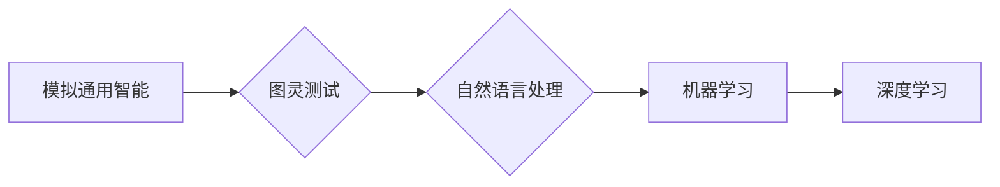

# 达特茅斯会议的历史意义

> 关键词：达特茅斯会议、人工智能、图灵测试、计算机科学、模拟通用智能、历史里程碑

## 1. 背景介绍

### 1.1 会议的起源

1956年，一场名为“达特茅斯会议”的学术研讨会在美国新罕布什尔州的达特茅斯学院召开。这次会议的召开标志着人工智能（Artificial Intelligence, AI）作为一门独立学科的诞生。会议的组织者包括约翰·麦卡锡（John McCarthy）、马文·闵斯基（Marvin Minsky）、克劳德·香农（Claude Shannon）等计算机科学界的领军人物。

### 1.2 会议的背景

20世纪50年代，随着图灵（Alan Turing）提出的图灵测试和香农（Claude Shannon）信息论的发展，计算机科学领域开始关注如何让计算机具有类似人类的智能。达特茅斯会议正是这一背景下的一次思想碰撞和理论探索。

### 1.3 会议的意义

达特茅斯会议不仅是一次技术讨论的盛会，更是一次具有划时代意义的学术事件。它奠定了人工智能学科的基础，并对后续的科研方向和技术发展产生了深远的影响。

## 2. 核心概念与联系

### 2.1 核心概念

**模拟通用智能（Artificial General Intelligence, AGI）**：AGI是指一种具有普遍适应性的智能，能够执行任何人类可以做的智能任务。

**图灵测试（Turing Test）**：由图灵提出，用于评估机器是否具有智能的一种测试方法。如果一个机器能够在与人类交流时被其他人类无法区分，那么它就可以被认为具有智能。

**自然语言处理（Natural Language Processing, NLP）**：研究如何让计算机理解和生成人类语言的技术。

### 2.2 Mermaid 流程图



### 2.3 关系联系

达特茅斯会议提出了AGI的概念，图灵测试成为了评估AGI的标准之一。随着技术的发展，NLP、机器学习、深度学习等成为了实现AGI的关键技术。

## 3. 核心算法原理 & 具体操作步骤

### 3.1 算法原理概述

达特茅斯会议的核心思想是利用计算机模拟人类的智能行为，通过算法实现AGI。

### 3.2 算法步骤详解

1. **数据收集**：收集大量数据，包括文本、图片、音频等。
2. **特征提取**：从数据中提取有用的特征。
3. **模型训练**：使用机器学习或深度学习算法训练模型。
4. **模型评估**：使用测试数据评估模型性能。
5. **模型优化**：根据评估结果优化模型。

### 3.3 算法优缺点

**优点**：
- **高效**：能够快速处理大量数据，提高效率。
- **准确**：通过机器学习算法，模型的准确率不断提高。

**缺点**：
- **数据依赖**：需要大量标注数据，且数据质量对模型性能影响较大。
- **可解释性差**：深度学习模型的可解释性较差，难以理解其内部决策过程。

### 3.4 算法应用领域

- **自然语言处理**：如机器翻译、情感分析、问答系统等。
- **图像识别**：如人脸识别、物体识别等。
- **语音识别**：如语音助手、语音翻译等。

## 4. 数学模型和公式 & 详细讲解 & 举例说明

### 4.1 数学模型构建

以深度学习为例，其基本数学模型可以表示为：

$$
\hat{y} = f(W \cdot x + b)
$$

其中，$x$ 是输入数据，$W$ 是权重，$b$ 是偏置，$f$ 是激活函数，$\hat{y}$ 是预测结果。

### 4.2 公式推导过程

以全连接神经网络为例，其前向传播的公式可以表示为：

$$
z^{[l]} = W^{[l]} \cdot a^{[l-1]} + b^{[l]}
$$

其中，$a^{[l-1]}$ 是第 $l-1$ 层的激活值，$W^{[l]}$ 是第 $l$ 层的权重，$b^{[l]}$ 是第 $l$ 层的偏置，$z^{[l]}$ 是第 $l$ 层的激活值。

### 4.3 案例分析与讲解

以机器翻译为例，我们可以使用神经网络模型进行翻译任务。首先，将源语言和目标语言分别输入到编码器和解码器中，然后通过注意力机制，将编码器的输出与解码器输出相连接，最终生成翻译结果。

## 5. 项目实践：代码实例和详细解释说明

### 5.1 开发环境搭建

以Python为例，我们需要安装以下库：

- TensorFlow
- Keras

### 5.2 源代码详细实现

```python
from tensorflow.keras.models import Sequential
from tensorflow.keras.layers import Embedding, LSTM, Dense

model = Sequential()
model.add(Embedding(input_dim=vocab_size, output_dim=embedding_dim, input_length=max_length))
model.add(LSTM(units=128))
model.add(Dense(units=output_dim, activation='softmax'))
model.compile(optimizer='adam', loss='categorical_crossentropy', metrics=['accuracy'])
model.fit(x_train, y_train, epochs=10, batch_size=64)
```

### 5.3 代码解读与分析

这段代码实现了一个简单的序列到序列模型。首先，我们创建了一个Sequential模型，并添加了Embedding层、LSTM层和Dense层。Embedding层用于将单词编码为向量，LSTM层用于处理序列数据，Dense层用于输出翻译结果。最后，我们使用adam优化器和categorical_crossentropy损失函数编译模型，并在训练集上进行训练。

### 5.4 运行结果展示

通过运行上述代码，我们可以在测试集上评估模型的翻译效果。

## 6. 实际应用场景

### 6.1 自动驾驶

自动驾驶汽车需要处理大量的视觉、感知和决策任务。通过人工智能技术，汽车可以实现对周围环境的感知、路径规划和决策，实现自动驾驶。

### 6.2 医疗诊断

人工智能可以分析大量的医学影像数据，辅助医生进行疾病诊断和治疗。

### 6.3 金融风控

人工智能可以分析大量的金融数据，帮助金融机构进行风险评估和欺诈检测。

## 7. 工具和资源推荐

### 7.1 学习资源推荐

- 《深度学习》（Goodfellow, Bengio, Courville）
- 《人工神经网络与深度学习》（邱锡鹏）
- 《Python深度学习》（François Chollet）

### 7.2 开发工具推荐

- TensorFlow
- Keras
- PyTorch

### 7.3 相关论文推荐

- “A Few Useful Things to Know about Machine Learning”（Pedro Domingos）
- “Deep Learning”（Ian Goodfellow, Yoshua Bengio, Aaron Courville）
- “The Unsupervised Learning of Natural Language Inference”（Dhruv Batra, Adam Trischler, Dipanjan Das）

## 8. 总结：未来发展趋势与挑战

### 8.1 研究成果总结

达特茅斯会议标志着人工智能学科的诞生，并对后续的科研方向和技术发展产生了深远的影响。通过不断的技术创新，人工智能在各个领域都取得了显著的成果。

### 8.2 未来发展趋势

- **跨学科融合**：人工智能与其他学科（如生物学、心理学、认知科学等）的交叉融合，将推动人工智能向更广泛的应用领域发展。
- **可解释性**：随着人工智能应用的普及，可解释性将变得越来越重要。如何提高模型的可解释性，将是一个重要的研究方向。
- **安全性**：人工智能的安全性问题将得到更多关注。如何确保人工智能系统的安全性，将是一个重要的挑战。

### 8.3 面临的挑战

- **数据安全**：如何保护用户数据的安全，将是一个重要的挑战。
- **算法偏见**：如何消除算法偏见，确保人工智能系统的公平性，将是一个重要的挑战。
- **伦理问题**：人工智能的伦理问题，如机器人的权利、人类失业等，将是一个重要的挑战。

### 8.4 研究展望

未来，人工智能将在各个领域发挥越来越重要的作用。通过不断的科技创新和伦理道德的引导，人工智能将为人类社会带来更多的福祉。

## 9. 附录：常见问题与解答

**Q1：什么是人工智能？**

A：人工智能是指使计算机具有类似人类的智能行为的技术。

**Q2：什么是图灵测试？**

A：图灵测试是一种评估机器是否具有智能的测试方法。

**Q3：什么是深度学习？**

A：深度学习是一种基于神经网络的学习方法，能够通过学习大量数据自动提取特征。

**Q4：人工智能的未来发展趋势是什么？**

A：人工智能的未来发展趋势包括跨学科融合、可解释性和安全性等。

**Q5：人工智能面临的挑战有哪些？**

A：人工智能面临的挑战包括数据安全、算法偏见和伦理问题等。

作者：禅与计算机程序设计艺术 / Zen and the Art of Computer Programming