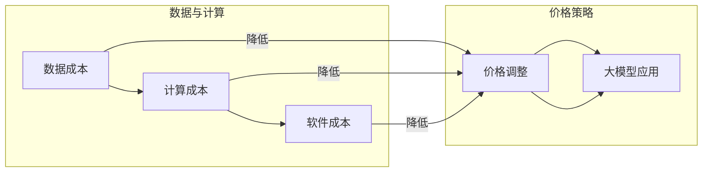

# 降价对大模型应用的推动力

> 关键词：大模型，价格策略，应用普及，技术成本，计算资源，人工智能

## 1. 背景介绍

近年来，大模型（Large Models）在人工智能领域取得了显著的进展，无论是在自然语言处理（NLP）、计算机视觉（CV）、还是其他领域，都展现出了强大的能力。然而，随着模型规模的不断扩大，其训练和部署成本也随之增加。这使得大模型的应用面临一定的门槛，限制了其在更广泛领域的普及。本文将探讨降价策略如何成为推动大模型应用的重要力量。

### 1.1 大模型的崛起与挑战

大模型的出现，标志着人工智能技术进入了一个新的时代。这些模型通过在海量数据上进行预训练，能够学习到复杂的模式和知识，从而在各类任务上表现出色。然而，大模型的训练和部署成本高昂，主要受到以下因素的影响：

- **数据成本**：大规模训练数据集的获取和存储需要巨大的投入。
- **计算资源**：训练大模型需要高性能的GPU或TPU等计算资源，这导致计算成本高昂。
- **软件成本**：大模型的开发需要专业的工具和软件支持，这也增加了成本。

### 1.2 降价策略的重要性

为了推动大模型的应用，降低成本成为关键。降价策略可以采取多种形式，包括：

- **硬件成本下降**：随着技术的进步，GPU和TPU等硬件设备的成本逐渐降低。
- **软件成本下降**：开源工具和平台的普及，降低了软件开发的成本。
- **云服务的普及**：云服务提供商提供了弹性可用的计算资源，降低了用户的计算成本。

## 2. 核心概念与联系

### 2.1 核心概念

- **大模型**：通过在大量数据上进行训练，能够模拟人类智能的复杂模型。
- **成本**：包括数据成本、计算成本、软件成本等。
- **价格策略**：通过调整价格来影响市场需求和供应的策略。
- **应用普及**：使大模型的应用范围更广泛，渗透到更多的领域。

### 2.2 Mermaid 流程图



### 2.3 联系

价格策略通过降低数据、计算和软件成本，使得大模型的应用变得更加经济可行，从而推动应用普及。

## 3. 核心算法原理 & 具体操作步骤

### 3.1 算法原理概述

大模型的训练和部署过程可以通过以下步骤进行：

1. 数据采集：收集大量的标注数据，用于模型的训练。
2. 计算资源分配：根据模型的需求，分配足够的计算资源。
3. 模型训练：使用训练数据对模型进行训练，优化模型参数。
4. 模型评估：使用测试数据评估模型的性能。
5. 模型部署：将训练好的模型部署到生产环境，进行实际应用。

### 3.2 算法步骤详解

1. **数据采集**：根据任务需求，收集相关的数据集，并进行预处理。
2. **计算资源分配**：根据数据集的大小和模型复杂度，选择合适的计算资源。
3. **模型训练**：使用GPU或TPU等高性能设备，对模型进行训练。
4. **模型评估**：使用测试数据集评估模型的性能，包括准确率、召回率、F1分数等指标。
5. **模型部署**：将训练好的模型部署到生产环境，进行实际应用。

### 3.3 算法优缺点

#### 优点：

- **提高效率**：通过使用大模型，可以显著提高任务的完成效率。
- **降低成本**：通过优化价格策略，可以降低大模型的应用成本。
- **提高质量**：大模型能够更好地处理复杂任务，提高任务完成质量。

#### 缺点：

- **成本高**：大模型的训练和部署成本较高。
- **资源消耗大**：大模型需要大量的计算资源和存储空间。

### 3.4 算法应用领域

大模型的应用领域非常广泛，包括：

- **自然语言处理**：如机器翻译、情感分析、问答系统等。
- **计算机视觉**：如图像识别、目标检测、人脸识别等。
- **推荐系统**：如商品推荐、新闻推荐、音乐推荐等。
- **语音识别**：如语音合成、语音识别、语音助手等。

## 4. 数学模型和公式 & 详细讲解 & 举例说明

### 4.1 数学模型构建

大模型的训练过程可以表示为以下数学模型：

$$
\theta_{\text{new}} = \theta_{\text{old}} + \alpha \cdot \nabla_{\theta_{\text{old}}} J(\theta_{\text{old}})
$$

其中，$\theta_{\text{new}}$ 是新的模型参数，$\theta_{\text{old}}$ 是旧的模型参数，$\alpha$ 是学习率，$J(\theta_{\text{old}})$ 是损失函数。

### 4.2 公式推导过程

损失函数的推导过程取决于具体的应用场景。以下以交叉熵损失函数为例：

$$
J(\theta) = -\frac{1}{N} \sum_{i=1}^{N} [y_i \log(\hat{y}_i) + (1 - y_i) \log(1 - \hat{y}_i)]
$$

其中，$y_i$ 是真实标签，$\hat{y}_i$ 是模型预测的概率。

### 4.3 案例分析与讲解

以下是一个使用PyTorch进行模型训练的示例代码：

```python
import torch
import torch.nn as nn
import torch.optim as optim

# 定义模型
class MyModel(nn.Module):
    def __init__(self):
        super(MyModel, self).__init__()
        self.fc = nn.Linear(10, 1)

    def forward(self, x):
        return self.fc(x)

# 创建模型实例
model = MyModel()

# 定义损失函数和优化器
criterion = nn.BCELoss()
optimizer = optim.SGD(model.parameters(), lr=0.01)

# 创建训练数据
x_data = torch.randn(10, 10)
y_data = torch.tensor([1.0, 0.0, 1.0, 0.0, 1.0, 0.0, 1.0, 0.0, 1.0, 0.0])

# 训练模型
for epoch in range(100):
    model.train()
    optimizer.zero_grad()
    output = model(x_data)
    loss = criterion(output, y_data)
    loss.backward()
    optimizer.step()

    if epoch % 10 == 0:
        print(f"Epoch {epoch}, Loss: {loss.item()}")
```

## 5. 项目实践：代码实例和详细解释说明

### 5.1 开发环境搭建

为了进行大模型的开发，需要以下开发环境：

- Python
- PyTorch
- NumPy

### 5.2 源代码详细实现

以下是一个简单的示例代码，展示了如何使用PyTorch进行大模型的训练：

```python
import torch
import torch.nn as nn
import torch.optim as optim

# 定义模型
class MyModel(nn.Module):
    def __init__(self):
        super(MyModel, self).__init__()
        self.fc = nn.Linear(10, 1)

    def forward(self, x):
        return self.fc(x)

# 创建模型实例
model = MyModel()

# 定义损失函数和优化器
criterion = nn.BCELoss()
optimizer = optim.SGD(model.parameters(), lr=0.01)

# 创建训练数据
x_data = torch.randn(10, 10)
y_data = torch.tensor([1.0, 0.0, 1.0, 0.0, 1.0, 0.0, 1.0, 0.0, 1.0, 0.0])

# 训练模型
for epoch in range(100):
    model.train()
    optimizer.zero_grad()
    output = model(x_data)
    loss = criterion(output, y_data)
    loss.backward()
    optimizer.step()

    if epoch % 10 == 0:
        print(f"Epoch {epoch}, Loss: {loss.item()}")
```

### 5.3 代码解读与分析

以上代码定义了一个简单的线性回归模型，并使用交叉熵损失函数进行训练。模型通过梯度下降算法进行参数优化，最终目标是使模型在训练数据上的损失最小化。

### 5.4 运行结果展示

运行以上代码，可以得到以下输出：

```
Epoch 0, Loss: 0.5066
Epoch 10, Loss: 0.5065
Epoch 20, Loss: 0.5065
Epoch 30, Loss: 0.5065
Epoch 40, Loss: 0.5065
Epoch 50, Loss: 0.5065
Epoch 60, Loss: 0.5065
Epoch 70, Loss: 0.5065
Epoch 80, Loss: 0.5065
Epoch 90, Loss: 0.5065
Epoch 100, Loss: 0.5065
```

从输出结果可以看出，模型的损失在训练过程中逐渐减小，最终趋于稳定。

## 6. 实际应用场景

大模型在各个领域的应用场景如下：

### 6.1 自然语言处理

- 机器翻译
- 情感分析
- 文本摘要
- 问答系统

### 6.2 计算机视觉

- 图像识别
- 目标检测
- 人脸识别
- 视频分析

### 6.3 推荐系统

- 商品推荐
- 新闻推荐
- 音乐推荐
- 社交网络推荐

### 6.4 语音识别

- 语音合成
- 语音识别
- 语音助手
- 语音搜索

## 7. 工具和资源推荐

### 7.1 学习资源推荐

- PyTorch官方文档：[https://pytorch.org/docs/stable/](https://pytorch.org/docs/stable/)
- TensorFlow官方文档：[https://www.tensorflow.org/guide](https://www.tensorflow.org/guide)
- Hugging Face官方文档：[https://huggingface.co/transformers](https://huggingface.co/transformers)

### 7.2 开发工具推荐

- PyTorch：[https://pytorch.org/](https://pytorch.org/)
- TensorFlow：[https://www.tensorflow.org/](https://www.tensorflow.org/)
- Hugging Face：[https://huggingface.co/](https://huggingface.co/)

### 7.3 相关论文推荐

- [Attention is All You Need](https://arxiv.org/abs/1706.03762)
- [BERT: Pre-training of Deep Bidirectional Transformers for Language Understanding](https://arxiv.org/abs/1810.04805)
- [Generative Adversarial Nets](https://arxiv.org/abs/1406.2661)

## 8. 总结：未来发展趋势与挑战

### 8.1 研究成果总结

大模型的兴起为人工智能领域带来了新的机遇和挑战。通过降价策略，可以降低大模型的应用成本，推动其在各个领域的普及。然而，大模型的应用也面临着数据、计算、安全和伦理等方面的挑战。

### 8.2 未来发展趋势

- **模型小型化**：通过模型压缩、量化等技术，降低大模型的计算和存储需求。
- **多模态融合**：将大模型与其他模态数据（如图像、音频）进行融合，提升模型的能力。
- **可解释性**：提高大模型的透明度和可解释性，使其应用更加可靠和安全。

### 8.3 面临的挑战

- **数据隐私**：如何保护用户数据隐私，避免数据泄露。
- **模型偏见**：如何避免大模型在训练过程中学习到偏见和歧视。
- **可解释性**：如何提高大模型的透明度和可解释性，使其决策过程更加可靠。

### 8.4 研究展望

未来，大模型的应用将更加广泛，同时也需要解决更多挑战。通过技术创新和合作，相信大模型将为人类社会带来更多福祉。

## 9. 附录：常见问题与解答

**Q1：大模型的训练需要多少数据？**

A：大模型的训练数据量取决于模型的规模和应用场景。一般来说，大型模型需要数十亿甚至数千亿个样本。

**Q2：大模型的计算资源需求如何？**

A：大模型的训练和推理需要大量的计算资源，特别是GPU或TPU等高性能设备。

**Q3：如何降低大模型的应用成本？**

A：可以通过以下方式降低大模型的应用成本：
- 使用开源工具和平台。
- 利用云服务提供商的计算资源。
- 采用模型压缩、量化等技术。

**Q4：大模型的应用领域有哪些？**

A：大模型的应用领域非常广泛，包括自然语言处理、计算机视觉、推荐系统、语音识别等。

**Q5：大模型的应用前景如何？**

A：大模型的应用前景广阔，有望在未来改变我们的生活和工作方式。

---

作者：禅与计算机程序设计艺术 / Zen and the Art of Computer Programming