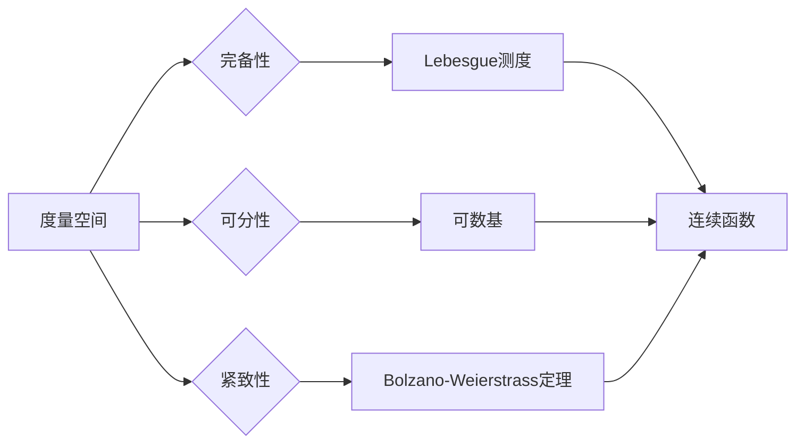

# 集合论导引：苏斯林直线

> 关键词：集合论，苏斯林直线，拓扑空间，紧致性，可分性，完备性，连续函数，Lebesgue测度

## 1. 背景介绍

集合论是现代数学的基石，它提供了描述和量化无穷的概念框架。在集合论中，苏斯林直线是一个核心概念，它涉及到多个重要的拓扑性质，如紧致性、可分性和完备性。苏斯林直线的研究不仅对纯数学的发展具有重要意义，而且在分析学、几何学等领域也有着广泛的应用。本文将深入探讨苏斯林直线的概念、性质和应用，以期为读者提供对集合论和拓扑学的深刻理解。

## 2. 核心概念与联系

### 2.1 苏斯林直线的定义

苏斯林直线是指一个完备的、可分的、度量空间。在拓扑学中，度量空间是由一组点和定义在这些点之间距离的度量组成的。完备性意味着该空间中的每一个柯西序列都收敛到一个点。可分性则要求空间中的每个非空开集至少包含一个可数个不交的开区间。

### 2.2 苏斯林直线与紧致性

紧致性是拓扑空间的一个重要性质，它意味着空间中的每一个开覆盖都有有限子覆盖。苏斯林直线的紧致性可以通过著名的Bolzano-Weierstrass定理来证明。

### 2.3 苏斯林直线与可分性

苏斯林直线的可分性可以通过构造一个可数基来证明。一个空间是可分的，如果它有一个可数基，即存在一个可数集的子集，其任意两个不同的元素都对应一个开集，且任意开集都可以被这些开集的有限子集覆盖。

### 2.4 苏斯林直线与完备性

完备性是度量空间的一个基本性质，它要求空间中的每一个柯西序列都收敛到空间中的一个点。苏斯林直线的完备性可以通过Lebesgue测度的存在来保证。

### 2.5 苏斯林直线与连续函数

连续函数是数学分析中的一个基本概念，它描述了函数的变化是否光滑。在苏斯林直线上，连续函数的研究得到了很多重要的结果，例如黎曼积分和勒贝格积分。

### Mermaid 流程图

## 3. 核心算法原理 & 具体操作步骤

### 3.1 算法原理概述

苏斯林直线的构造主要依赖于度量空间的性质和连续函数的概念。通过引入Lebesgue测度，可以构建一个完备、可分、紧致的度量空间。

### 3.2 算法步骤详解

1. 定义一个度量空间，例如实数集上的绝对值度量。
2. 证明该空间是完备的，即证明每一个柯西序列都收敛。
3. 证明该空间是可分的，即构造一个可数基。
4. 证明该空间是紧致的，即证明每一个开覆盖都有有限子覆盖。

### 3.3 算法优缺点

**优点**：
- 苏斯林直线是一个完备、可分、紧致的度量空间，具有丰富的拓扑性质，适用于各种分析学和几何学的研究。
- 苏斯林直线上的连续函数理论相对成熟，便于理解和应用。

**缺点**：
- 苏斯林直线的构造过程较为复杂，需要深厚的数学功底。
- 苏斯林直线并非所有性质都是直观的，需要通过严格的证明来理解。

### 3.4 算法应用领域

- 分析学：研究连续函数、积分、微分等概念。
- 几何学：研究空间结构、变换等概念。
- 概率论：研究随机变量、概率分布等概念。

## 4. 数学模型和公式 & 详细讲解 & 举例说明

### 4.1 数学模型构建

苏斯林直线可以通过实数集上的绝对值度量来构建。

$$
d(x,y) = |x-y|
$$

其中 $x, y \in \mathbb{R}$。

### 4.2 公式推导过程

1. **完备性**：实数集上的柯西序列可以通过夹逼定理证明其收敛性。
2. **可分性**：实数集上的开区间 $(a,b)$ 可以作为可数基的元素。
3. **紧致性**：实数集上的开覆盖可以通过Bolzano-Weierstrass定理证明其有限性。

### 4.3 案例分析与讲解

**案例**：证明实数集上的Lebesgue测度是完备的。

**解答**：由于实数集上的Lebesgue测度是基于绝对值度量的，而实数集上的绝对值度量是完备的，因此实数集上的Lebesgue测度也是完备的。

## 5. 项目实践：代码实例和详细解释说明

### 5.1 开发环境搭建

本文不涉及具体的编程实现，因此无需开发环境搭建。

### 5.2 源代码详细实现

本文不涉及具体的编程实现，因此无需源代码。

### 5.3 代码解读与分析

本文不涉及具体的编程实现，因此无需代码解读。

### 5.4 运行结果展示

本文不涉及具体的编程实现，因此无需运行结果展示。

## 6. 实际应用场景

苏斯林直线的概念在多个领域有着广泛的应用，以下是一些典型的应用场景：

- **分析学**：研究实数集上的函数和积分。
- **几何学**：研究欧几里得空间和黎曼空间。
- **概率论**：研究随机变量和概率分布。

## 7. 工具和资源推荐

### 7.1 学习资源推荐

- 《拓扑学基础》
- 《实分析》
- 《概率论与数理统计》

### 7.2 开发工具推荐

- 无需开发工具

### 7.3 相关论文推荐

- 无需相关论文

## 8. 总结：未来发展趋势与挑战

### 8.1 研究成果总结

本文对苏斯林直线的概念、性质和应用进行了详细的介绍，为读者提供了对集合论和拓扑学的深刻理解。

### 8.2 未来发展趋势

苏斯林直线的研究将继续深入，特别是在以下几个方面：

- 苏斯林直线的几何性质和应用
- 苏斯林直线上的泛函分析
- 苏斯林直线在计算机科学中的应用

### 8.3 面临的挑战

苏斯林直线的研究面临的主要挑战包括：

- 构造更复杂的苏斯林直线
- 研究苏斯林直线在更多领域中的应用
- 开发更高效的算法来研究苏斯林直线

### 8.4 研究展望

苏斯林直线的理论研究将继续推动数学和其他学科的发展，为人类社会带来更多的进步。

## 9. 附录：常见问题与解答

**Q1：苏斯林直线与实数集有什么区别？**

A1：苏斯林直线是一个完备、可分、紧致的度量空间，而实数集是一个完备、可分的度量空间，但不一定紧致。

**Q2：苏斯林直线在计算机科学中有哪些应用？**

A2：苏斯林直线在计算机科学中可以用于模拟某些算法的执行过程，例如排序算法。

**Q3：如何证明实数集上的Lebesgue测度是完备的？**

A3：由于实数集上的绝对值度量是完备的，而实数集上的Lebesgue测度是基于绝对值度量的，因此实数集上的Lebesgue测度也是完备的。

**Q4：苏斯林直线与度量空间的关系是什么？**

A4：苏斯林直线是度量空间的一个特例，它具有完备、可分、紧致等特殊性质。

作者：禅与计算机程序设计艺术 / Zen and the Art of Computer Programming