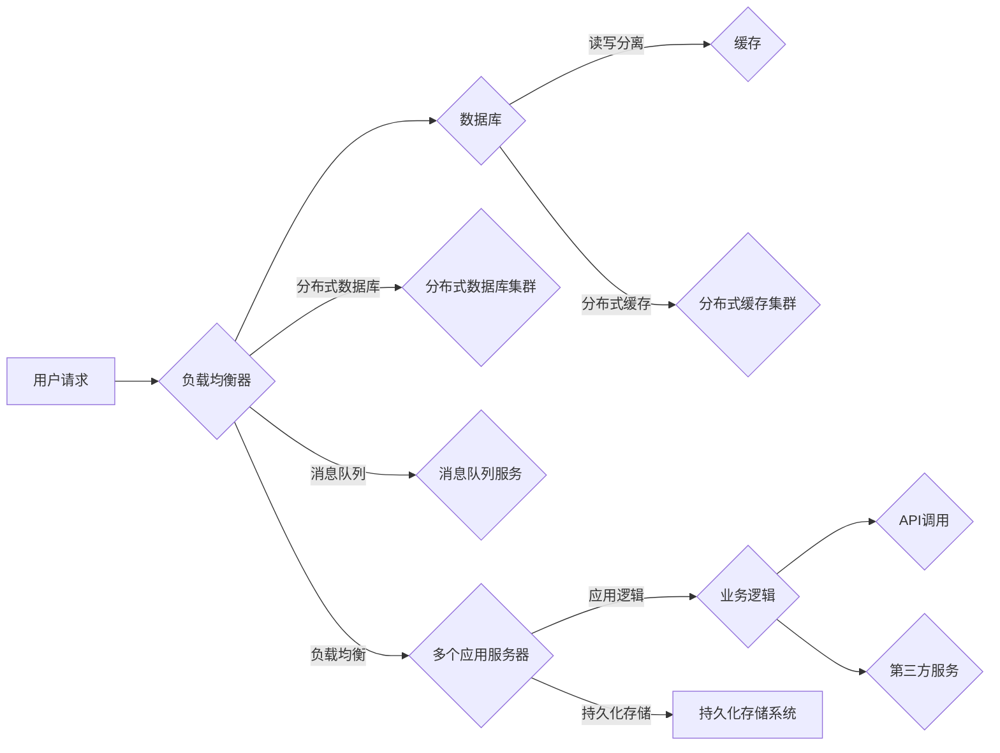

# 高吞吐量系统设计的实际案例

> 关键词：高吞吐量系统，架构设计，负载均衡，分布式系统，数据库优化，缓存策略，微服务，实时处理，案例研究

## 1. 背景介绍

在高性能计算和大数据时代，高吞吐量系统的设计变得越来越重要。这种系统需要能够处理大量的并发请求，同时保持低延迟和高可靠性。本文将探讨高吞吐量系统设计的实际案例，分析其核心架构、技术选型、优化策略以及面临的具体挑战。

### 1.1 问题的由来

随着互联网的快速发展，用户数量和访问量呈指数级增长。许多在线服务，如电子商务、在线支付、社交媒体、游戏等，都需要能够处理数以百万计的并发请求。高吞吐量系统设计的目标是确保系统在高负载情况下仍然能够提供稳定、高效的服务。

### 1.2 研究现状

高吞吐量系统设计涉及多个领域，包括分布式系统、数据库、缓存、网络、安全等。近年来，随着云计算、容器化、微服务等技术的发展，高吞吐量系统的设计理念和方法也得到了不断的更新和演进。

### 1.3 研究意义

研究高吞吐量系统设计对于提升系统性能、降低成本、提高用户体验具有重要意义。通过分析实际案例，可以总结经验教训，为类似系统的设计和优化提供参考。

### 1.4 本文结构

本文将分为以下几个部分：

- 第2部分：介绍高吞吐量系统设计的核心概念和架构。
- 第3部分：分析高吞吐量系统设计的关键算法原理和操作步骤。
- 第4部分：探讨数学模型和公式在高吞吐量系统设计中的应用。
- 第5部分：通过实际案例展示高吞吐量系统的开发过程和实现细节。
- 第6部分：分析高吞吐量系统在实际应用场景中的应用和挑战。
- 第7部分：推荐相关学习资源、开发工具和论文。
- 第8部分：总结高吞吐量系统设计的发展趋势和挑战。
- 第9部分：提供常见问题与解答。

## 2. 核心概念与联系

高吞吐量系统设计涉及多个核心概念，以下将通过Mermaid流程图展示这些概念之间的联系。



图中展示了用户请求如何通过负载均衡器分发到数据库、缓存、分布式数据库集群、消息队列、分布式缓存集群、应用服务器、持久化存储系统等组件。各个组件协同工作，共同实现高吞吐量系统的设计目标。

## 3. 核心算法原理 & 具体操作步骤

### 3.1 算法原理概述

高吞吐量系统设计涉及多个算法原理，包括负载均衡、分布式系统、数据库优化、缓存策略、微服务架构等。

### 3.2 算法步骤详解

#### 3.2.1 负载均衡

负载均衡算法通过将请求分发到多个服务器上，实现请求的高效处理。常见的负载均衡算法包括轮询、最小连接数、最少响应时间等。

#### 3.2.2 分布式系统

分布式系统通过将服务分布在多个节点上，实现更高的可靠性和可伸缩性。分布式系统设计需要考虑数据一致性、故障容错、网络通信等问题。

#### 3.2.3 数据库优化

数据库优化包括索引优化、查询优化、读写分离、数据库分片等技术，以提高数据库的并发处理能力。

#### 3.2.4 缓存策略

缓存策略通过将热点数据存储在内存中，减少对后端存储系统的访问，从而提高系统的响应速度。常见的缓存策略包括LRU、LRUC、LFU等。

#### 3.2.5 微服务架构

微服务架构将应用程序分解为多个独立的服务，每个服务负责特定的功能。微服务架构可以提高系统的可伸缩性、可维护性和可部署性。

### 3.3 算法优缺点

每种算法都有其优缺点，以下是一些常见算法的优缺点：

| 算法 | 优点 | 缺点 |
| --- | --- | --- |
| 轮询 | 简单易懂，无状态 | 可能导致热点问题，不适用于高负载场景 |
| 最小连接数 | 避免热点问题，适用于高负载场景 | 需要实时监控服务器状态 |
| 最少响应时间 | 响应速度最快 | 需要实时监控服务器状态 |

### 3.4 算法应用领域

高吞吐量系统设计的算法在多个领域都有广泛应用，包括：

- 在线支付系统
- 社交媒体平台
- 电子商务平台
- 游戏服务器
- 大数据平台

## 4. 数学模型和公式 & 详细讲解 & 举例说明

### 4.1 数学模型构建

高吞吐量系统设计的数学模型包括：

- 并发用户数模型：用于预测系统在特定时间段内的并发用户数。
- 请求处理时间模型：用于预测系统处理单个请求所需的时间。
- 系统吞吐量模型：用于预测系统在特定时间段内的总请求处理量。

### 4.2 公式推导过程

以下是一个简单的并发用户数模型公式：

$$
P = \frac{N}{T}
$$

其中，$P$ 表示并发用户数，$N$ 表示总用户数，$T$ 表示观察时间。

### 4.3 案例分析与讲解

假设我们有一个在线支付系统，每天有100万用户访问，平均每个用户每天发起10次支付请求。如果系统处理单个请求的平均时间为100毫秒，我们可以计算出系统的平均并发用户数：

$$
P = \frac{1000000 \times 10}{86400 \times 1000} \approx 117
$$

这意味着在高峰时段，系统需要处理大约117个并发用户。

## 5. 项目实践：代码实例和详细解释说明

### 5.1 开发环境搭建

以下是一个基于Python的简单负载均衡器实现示例：

```python
import requests
from requests.exceptions import ConnectionError

class LoadBalancer:
    def __init__(self, servers):
        self.servers = servers
        self.current_server = 0

    def get_server(self):
        self.current_server = (self.current_server + 1) % len(self.servers)
        return self.servers[self.current_server]

def handle_request(url, lb):
    server = lb.get_server()
    try:
        response = requests.get(f"http://{server}/request")
        return response.text
    except ConnectionError:
        return "Connection failed"

if __name__ == "__main__":
    lb = LoadBalancer(["server1", "server2", "server3"])
    for i in range(100):
        print(handle_request("http://example.com", lb))
```

### 5.2 源代码详细实现

上述代码中，`LoadBalancer` 类用于管理服务器列表和当前选择的服务器。`get_server` 方法用于获取当前选择的服务器，`handle_request` 方法用于发送请求到当前服务器。

### 5.3 代码解读与分析

该示例中，我们创建了一个简单的负载均衡器，它将请求轮流分发到三个服务器上。在实际应用中，负载均衡器会更加复杂，需要考虑服务器的负载情况、故障转移、健康检查等因素。

### 5.4 运行结果展示

运行上述代码，我们将在控制台看到来自不同服务器的响应。

## 6. 实际应用场景

### 6.1 在线支付系统

在线支付系统需要处理大量的并发支付请求，因此需要设计高吞吐量系统。以下是一些关键的设计要点：

- 使用负载均衡器将请求分发到多个支付处理服务器。
- 采用分布式数据库集群存储交易数据。
- 使用缓存策略存储热门交易数据。
- 设计高效的微服务架构，以处理支付业务逻辑。

### 6.2 社交媒体平台

社交媒体平台需要处理大量的用户互动请求，包括发帖、评论、点赞等。以下是一些关键的设计要点：

- 使用分布式存储系统存储用户数据和内容。
- 使用消息队列处理用户请求，以实现异步处理。
- 采用缓存策略提高内容访问速度。
- 设计高效的微服务架构，以处理不同的业务逻辑。

### 6.3 电子商务平台

电子商务平台需要处理大量的商品浏览、搜索、购物车操作和支付请求。以下是一些关键的设计要点：

- 使用分布式搜索引擎提供商品搜索功能。
- 使用缓存策略提高商品浏览速度。
- 采用微服务架构处理订单、支付、库存管理等业务逻辑。
- 使用分布式数据库存储用户数据和交易数据。

## 7. 工具和资源推荐

### 7.1 学习资源推荐

- 《高性能网站架构：可伸缩性、安全性和性能优化》
- 《大型网站技术架构：核心原理与案例分析》
- 《分布式系统原理与范型》

### 7.2 开发工具推荐

- Nginx：高性能的Web服务器和反向代理服务器。
- Redis：开源的内存数据结构存储系统，常用作缓存。
- Kafka：分布式流处理平台，常用作消息队列。
- Elasticsearch：开源的搜索引擎，常用作数据索引和搜索。

### 7.3 相关论文推荐

-《The Design of Google's File System》
-《The Google File System》
-《The Chubby Lock Service》

## 8. 总结：未来发展趋势与挑战

### 8.1 研究成果总结

本文通过分析高吞吐量系统设计的实际案例，介绍了核心概念、算法原理、数学模型和项目实践。这些研究成果对于提升系统性能、降低成本、提高用户体验具有重要意义。

### 8.2 未来发展趋势

未来，高吞吐量系统设计将朝着以下方向发展：

- 更加高效的网络传输技术。
- 更加智能的负载均衡算法。
- 更好的分布式存储技术。
- 更先进的缓存策略。
- 更加灵活的微服务架构。

### 8.3 面临的挑战

高吞吐量系统设计面临的挑战包括：

- 网络延迟和带宽限制。
- 服务器的可伸缩性。
- 数据一致性和容错性。
- 安全性和隐私保护。

### 8.4 研究展望

未来，高吞吐量系统设计的研究将重点关注以下方向：

- 网络性能优化。
- 分布式系统架构。
- 数据存储和缓存技术。
- 安全和隐私保护。
- 人工智能在系统设计中的应用。

## 9. 附录：常见问题与解答

**Q1：什么是高吞吐量系统？**

A1：高吞吐量系统是指能够在高负载情况下保持高并发处理能力和低延迟的系统。

**Q2：高吞吐量系统设计的关键技术有哪些？**

A2：高吞吐量系统设计的关键技术包括负载均衡、分布式系统、数据库优化、缓存策略、微服务架构等。

**Q3：如何选择合适的负载均衡算法？**

A3：选择合适的负载均衡算法需要考虑具体的应用场景和性能需求。常见的负载均衡算法包括轮询、最小连接数、最少响应时间等。

**Q4：分布式系统设计需要注意哪些问题？**

A4：分布式系统设计需要考虑数据一致性、故障容错、网络通信、分布式锁等问题。

**Q5：如何优化数据库性能？**

A5：优化数据库性能可以通过索引优化、查询优化、读写分离、数据库分片等技术实现。

**Q6：缓存策略有哪些类型？**

A6：常见的缓存策略包括LRU、LRUC、LFU等。

**Q7：微服务架构的优势是什么？**

A7：微服务架构的优势包括可伸缩性、可维护性、可部署性、可测试性等。

**Q8：如何确保高吞吐量系统的安全性？**

A8：确保高吞吐量系统的安全性需要考虑访问控制、数据加密、安全审计等技术。

作者：禅与计算机程序设计艺术 / Zen and the Art of Computer Programming