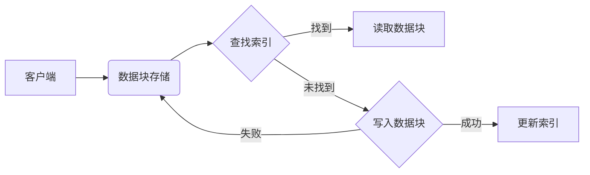

# 高效且可扩展的数据块详细解析

> 关键词：数据块，缓存，数据结构，内存管理，高效存储，可扩展架构，分布式系统，内存数据库

## 1. 背景介绍

在当今信息爆炸的时代，数据已经成为企业的核心资产。高效且可扩展的数据块架构成为数据处理和存储的关键。数据块是一种用于组织、存储和访问数据的结构，它通过将数据分割成小块来提高访问速度和扩展性。本文将深入解析数据块的概念、原理、实现和应用，旨在帮助读者理解如何构建高效且可扩展的数据块架构。

### 1.1 问题的由来

随着互联网和物联网的快速发展，数据量呈指数级增长，传统的数据存储和处理方式逐渐无法满足需求。以下是一些驱动数据块技术发展的原因：

- **性能需求**：随着应用对数据处理速度的要求越来越高，需要一种能够快速访问数据的存储方式。
- **扩展性需求**：数据量的增长要求存储系统能够水平扩展，以适应不断增长的数据量。
- **成本效益**：高效的数据块可以减少存储成本，通过优化数据存储和访问来降低整体成本。

### 1.2 研究现状

数据块技术已经在多个领域得到广泛应用，包括缓存系统、内存数据库、分布式存储系统等。以下是一些常见的数据块技术：

- **内存数据库**：如Redis和Memcached，使用内存作为数据存储，提供高速的数据访问。
- **分布式文件系统**：如HDFS，将数据分割成块并分布在多个节点上，提供高可用性和容错性。
- **NoSQL数据库**：如Cassandra和MongoDB，使用数据块进行数据的分布式存储和高效访问。

### 1.3 研究意义

研究数据块技术对于提升数据处理和存储系统的性能、扩展性和成本效益具有重要意义。以下是几个关键的研究意义：

- **提升性能**：通过优化数据块的设计和实现，可以显著提高数据访问速度和处理效率。
- **增强可扩展性**：数据块架构可以支持水平扩展，以适应不断增长的数据量。
- **降低成本**：通过高效的数据块设计，可以减少存储成本和计算资源的使用。

### 1.4 本文结构

本文将按以下结构进行：

- **第2章**：介绍数据块的核心概念与联系，并通过Mermaid流程图进行展示。
- **第3章**：详细讲解数据块的核心算法原理和具体操作步骤。
- **第4章**：介绍数据块的数学模型和公式，并通过实例进行说明。
- **第5章**：给出数据块的代码实例和详细解释说明。
- **第6章**：探讨数据块的实际应用场景和未来应用展望。
- **第7章**：推荐相关学习资源、开发工具和参考文献。
- **第8章**：总结研究成果，展望未来发展趋势与挑战。
- **第9章**：提供常见问题与解答。

## 2. 核心概念与联系

### 2.1 数据块的核心概念

数据块是一种将数据分割成固定大小块的组织方式。每个数据块包含一定数量的数据记录，每个记录通常包含一个键和相应的值。以下是一些关键的概念：

- **数据块大小**：每个数据块的固定大小，通常以字节为单位。
- **键值对**：数据块中的基本数据单元，包含一个键和一个值。
- **索引**：用于快速访问特定数据块的指针集合。

### 2.2 数据块架构的Mermaid流程图

以下是一个简单的数据块架构的Mermaid流程图：



### 2.3 数据块与相关技术的联系

数据块技术与其他技术紧密相关，以下是一些关键的联系：

- **内存数据库**：数据块是内存数据库的基本存储单元，用于快速访问数据。
- **分布式文件系统**：数据块是分布式文件系统中的基本数据结构，用于数据分布和复制。
- **NoSQL数据库**：数据块是NoSQL数据库中的基本数据单元，用于数据存储和索引。

## 3. 核心算法原理 & 具体操作步骤

### 3.1 算法原理概述

数据块技术的核心算法包括数据块的存储、索引和访问。以下是这些算法的基本原理：

- **数据块存储**：将数据分割成固定大小的块，并将这些块存储在存储介质上。
- **索引构建**：创建索引以快速定位数据块的位置。
- **数据块访问**：根据索引快速访问数据块，并返回所需的数据记录。

### 3.2 算法步骤详解

以下是数据块访问的基本步骤：

1. **索引查找**：根据数据记录的键，在索引中查找对应的数据块位置。
2. **数据块读取**：读取数据块并解析数据记录。
3. **数据块更新**：如果需要对数据记录进行更新，则将修改后的数据块写回存储介质。
4. **索引更新**：更新索引以反映数据块的更改。

### 3.3 算法优缺点

**优点**：

- **高效**：通过索引快速访问数据块，提高数据访问速度。
- **可扩展**：可以通过增加存储节点来水平扩展系统。
- **灵活**：支持多种数据结构和索引类型。

**缺点**：

- **索引开销**：索引需要额外的存储空间，并可能影响性能。
- **数据移动**：当数据块在存储介质之间移动时，需要更新索引。

### 3.4 算法应用领域

数据块技术适用于以下领域：

- **缓存系统**：如Redis和Memcached，用于缓存热点数据。
- **内存数据库**：如RocksDB，用于提供快速的数据访问。
- **分布式文件系统**：如HDFS，用于存储大量数据。
- **NoSQL数据库**：如Cassandra和MongoDB，用于存储和索引复杂数据结构。

## 4. 数学模型和公式 & 详细讲解 & 举例说明

### 4.1 数学模型构建

数据块的数学模型通常涉及以下概念：

- **数据块大小**：表示为 $B$，通常以字节为单位。
- **记录大小**：表示为 $R$，表示数据块中单个记录的大小。
- **数据块数量**：表示为 $N$，表示存储介质中数据块的总数。

### 4.2 公式推导过程

以下是一些基本的数学公式：

- **数据块数量**：$N = \frac{总存储空间}{B}$
- **记录数量**：$R = \frac{总存储空间}{B} \times \frac{1}{N}$
- **索引大小**：$I = \frac{键大小}{R} \times N$

### 4.3 案例分析与讲解

假设有一个100GB的存储空间，每个数据块大小为1MB，记录大小为100字节。则：

- **数据块数量**：$N = \frac{100GB}{1MB} = 100,000$
- **记录数量**：$R = \frac{100GB}{1MB} \times \frac{1}{100,000} = 100,000$
- **索引大小**：$I = \frac{键大小}{100} \times 100,000$

如果键大小为32字节，则索引大小为3.2MB。

## 5. 项目实践：代码实例和详细解释说明

### 5.1 开发环境搭建

为了演示数据块的实现，我们将使用Python编写一个简单的数据块存储系统。以下是开发环境的要求：

- Python 3.8及以上版本
- Flask框架（用于Web服务）
- SQLite数据库（用于存储数据块）

### 5.2 源代码详细实现

以下是一个简单的数据块存储系统的实现：

```python
from flask import Flask, request, jsonify
import sqlite3

app = Flask(__name__)

# 创建数据库连接
conn = sqlite3.connect('data_block.db')
c = conn.cursor()

# 创建数据块表
c.execute('''
CREATE TABLE IF NOT EXISTS data_blocks (
    id INTEGER PRIMARY KEY AUTOINCREMENT,
    key TEXT,
    block BLOB
)
''')

# 添加数据块
@app.route('/add_block', methods=['POST'])
def add_block():
    key = request.json['key']
    block = request.json['block']
    c.execute('INSERT INTO data_blocks (key, block) VALUES (?, ?)', (key, block))
    conn.commit()
    return jsonify({'id': c.lastrowid})

# 读取数据块
@app.route('/get_block/<int:block_id>', methods=['GET'])
def get_block(block_id):
    c.execute('SELECT block FROM data_blocks WHERE id = ?', (block_id,))
    block = c.fetchone()
    if block:
        return jsonify({'block': block[0]})
    else:
        return jsonify({'error': 'Block not found'}), 404

# 启动应用
if __name__ == '__main__':
    app.run(debug=True)
```

### 5.3 代码解读与分析

上述代码实现了一个简单的数据块存储系统，包含以下功能：

- **数据块添加**：通过POST请求将键和值存储为数据块。
- **数据块读取**：通过GET请求根据数据块ID读取数据。

代码首先创建了一个SQLite数据库，并定义了一个数据块表。在`add_block`函数中，将传入的键和值存储为数据块。在`get_block`函数中，根据数据块ID读取数据块。

### 5.4 运行结果展示

以下是一个简单的运行结果示例：

```
POST /add_block
Content-Type: application/json

{
  "key": "example_key",
  "block": "example_value"
}

Response:
{
  "id": 1
}

GET /get_block/1
Response:
{
  "block": "example_value"
}
```

## 6. 实际应用场景

### 6.1 缓存系统

数据块技术可以用于构建高性能的缓存系统，例如Redis和Memcached。通过将数据分割成块，可以快速访问热点数据，提高系统性能。

### 6.2 内存数据库

内存数据库如RocksDB可以使用数据块技术来存储和访问数据。通过将数据块存储在内存中，可以提供快速的数据访问和高效的并发处理。

### 6.3 分布式文件系统

分布式文件系统如HDFS可以使用数据块技术来存储和分布数据。通过将数据块分割成小块并分布到多个节点，可以提高数据存储的可靠性和可用性。

### 6.4 未来应用展望

随着技术的发展，数据块技术将在更多领域得到应用，例如：

- **边缘计算**：用于在边缘设备上高效地存储和处理数据。
- **物联网**：用于存储和处理大量物联网设备产生的数据。
- **人工智能**：用于存储和处理大规模机器学习模型。

## 7. 工具和资源推荐

### 7.1 学习资源推荐

- 《Python数据存储与处理》
- 《Flask Web开发：实战指南》
- 《SQLite数据库基础教程》
- 《Redis权威指南》

### 7.2 开发工具推荐

- Python 3.8及以上版本
- Flask框架
- SQLite数据库
- Redis客户端

### 7.3 相关论文推荐

- 《Scalable Caching Algorithms for Data Centers》
- 《In-Memory Data Grids》
- 《The Design of the Apache Hadoop Distributed File System》

## 8. 总结：未来发展趋势与挑战

### 8.1 研究成果总结

本文深入解析了数据块的概念、原理、实现和应用，探讨了数据块技术在各个领域的应用场景。通过理论和实践的结合，展示了数据块技术的重要性和价值。

### 8.2 未来发展趋势

随着技术的不断发展，数据块技术将呈现以下发展趋势：

- **更高效的数据块组织**：探索更高效的数据块组织方式，以提高数据访问速度和存储效率。
- **更智能的数据块索引**：结合机器学习技术，构建更智能的数据块索引，以优化数据访问策略。
- **更灵活的数据块管理**：支持更灵活的数据块管理策略，以适应不同的应用场景。

### 8.3 面临的挑战

数据块技术在实际应用中仍面临以下挑战：

- **数据一致性**：在分布式系统中保证数据块的一致性是一个挑战。
- **数据安全性**：保护数据块免受未授权访问和篡改是一个关键问题。
- **性能优化**：如何进一步优化数据块的访问速度和存储效率是一个持续的挑战。

### 8.4 研究展望

未来，数据块技术的研究方向包括：

- **数据块压缩**：研究更有效的数据块压缩算法，以减少存储空间。
- **数据块加密**：研究数据块加密技术，以保护数据安全。
- **数据块去重**：研究数据块去重技术，以减少存储空间占用。

通过不断的研究和创新，数据块技术将为未来的数据存储和处理提供更加高效、安全和可扩展的解决方案。

## 9. 附录：常见问题与解答

**Q1：数据块和数据库有什么区别？**

A1：数据块和数据库都是用于存储和访问数据的系统，但它们之间存在一些区别。数据块通常用于存储大量结构化或半结构化数据，而数据库通常用于存储结构化数据。数据块通常提供更高的性能和可扩展性，但可能缺乏一些数据库的高级功能，如事务、索引和查询优化。

**Q2：数据块技术是否适用于所有类型的数据？**

A2：数据块技术适用于各种类型的数据，包括结构化数据、半结构化数据和未结构化数据。然而，对于需要复杂查询和高级数据库功能的数据，可能需要考虑使用传统的数据库系统。

**Q3：如何选择合适的数据块大小？**

A3：选择合适的数据块大小需要考虑多个因素，包括存储介质的性能、数据访问模式和应用需求。一般来说，数据块大小应该适中，以平衡存储空间和访问速度。

**Q4：如何优化数据块的存储性能？**

A4：优化数据块的存储性能可以通过以下方法实现：

- 使用高速存储介质，如SSD。
- 使用数据压缩技术，以减少存储空间占用。
- 使用数据去重技术，以减少存储空间占用。

**Q5：数据块技术是否安全？**

A5：数据块技术本身不提供安全性保障。为了确保数据安全，需要采取额外的措施，如数据加密、访问控制和数据备份。