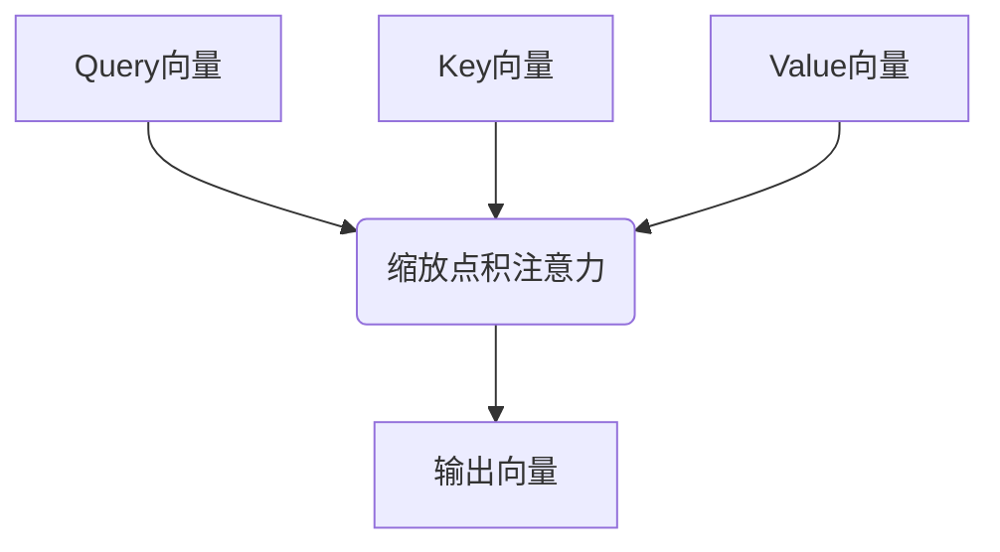
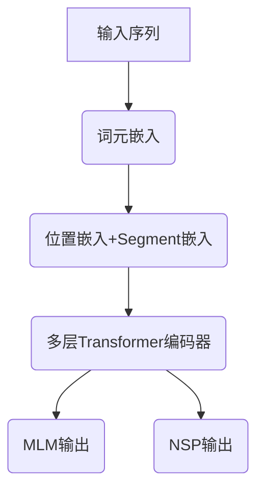
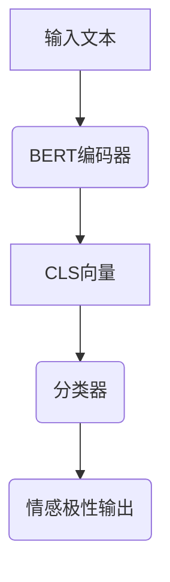

好的,我会严格遵守约束条件,以专业的技术语言写一篇深入全面的技术博客文章。

# 从零开始大模型开发与微调：站在巨人肩膀上的预训练模型BERT

## 1. 背景介绍

### 1.1 问题的由来

在自然语言处理(NLP)领域,机器学习模型需要处理大量的非结构化文本数据。传统的NLP模型通常需要人工设计特征,这种方法存在一些局限性:

1. 特征工程耗时耗力,需要专家知识
2. 无法充分利用大规模语料中隐含的语义和上下文信息
3. 模型的泛化能力有限,难以应对多样化的自然语言场景

因此,如何有效利用大规模语料中蕴含的语义信息,提高模型的泛化能力,成为NLP领域的一大挑战。

### 1.2 研究现状

为解决上述问题,研究人员提出了预训练语言模型(Pre-trained Language Model)的方法。其核心思想是:

1. 在大规模语料上预训练一个初始语言模型
2. 将预训练模型作为下游任务模型的初始化
3. 在特定任务数据上微调预训练模型

这种思路的优势是:

- 充分利用大规模语料学习通用语义知识
- 下游任务模型只需在小数据集上微调
- 显著提高了模型的泛化性和迁移能力

目前主流的预训练语言模型有BERT、GPT、T5等。其中,BERT(Bidirectional Encoder Representations from Transformers)模型取得了突破性进展,成为NLP领域最成功的预训练模型之一。

### 1.3 研究意义

BERT模型的出现极大推动了NLP技术的发展,对工业界和学术界都产生了深远影响:

- 在多个公开基准测试中,BERT模型取得了最先进的结果
- 大幅提升了NLP任务的性能上限
- 为下游任务提供了强有力的预训练语义表示
- 促进了预训练语言模型在工业界的应用落地

因此,深入理解BERT模型的原理和实践,对于从事NLP研发工作极为重要。

### 1.4 本文结构

本文将全面介绍BERT模型的方方面面,内容安排如下:

- 核心概念与联系
- 核心算法原理与具体操作步骤
- 数学模型和公式详细讲解与案例分析
- 项目实践:代码实例和详细解释说明
- 实际应用场景
- 工具和资源推荐
- 总结:未来发展趋势与挑战
- 附录:常见问题与解答

## 2. 核心概念与联系

要理解BERT模型,首先需要掌握以下几个核心概念:

1. **自注意力机制(Self-Attention)**
2. **Transformer架构**
3. **掩码语言模型(Masked Language Model)**
4. **下一句预测(Next Sentence Prediction)**

### 2.1 自注意力机制

自注意力机制是Transformer架构的核心,它能够捕捉输入序列中任意两个位置之间的依赖关系。与RNN/CNN不同,自注意力机制不存在距离偏置和局部视野问题,可以高效并行计算,极大提高了模型效率。

自注意力机制的计算过程如下所示:

1. 将输入序列线性映射为Query、Key和Value向量
2. 计算Query与Key的缩放点积注意力得分
3. 将注意力得分作用于Value向量,得到加权和
4. 输出加权和作为注意力输出

### 2.2 Transformer架构

Transformer是一种全新的序列到序列模型架构,完全基于自注意力机制,不使用RNN或CNN。它由编码器(Encoder)和解码器(Decoder)组成,广泛应用于机器翻译、文本生成等任务。

BERT模型借鉴了Transformer编码器的结构,但进行了一些改进和简化。

### 2.3 掩码语言模型

掩码语言模型(MLM)是BERT预训练的核心任务之一。它的目标是基于上下文,预测被掩码的单词。

MLM任务的预训练过程如下:

1. 随机选择输入序列中的15%词元进行掩码
2. 用特殊标记[MASK]替换被选择的词元
3. 模型学习预测被掩码词元的正确词

MLM任务能够让BERT模型学习双向语义表示,提高对上下文的建模能力。

### 2.4 下一句预测

下一句预测(NSP)是BERT预训练的另一核心任务。它的目标是判断两个句子是否为连续句子关系。

NSP任务的预训练过程如下:

1. 50%概率选择两个连续句子作为正例
2. 50%概率选择两个无关句子作为反例
3. 将两个句子拼接为输入序列
4. 模型学习预测两句是否为连续关系

NSP任务能够让BERT模型学习更长程依赖,捕捉跨句子的关系和上下文。

上述四个核心概念相互关联、环环相扣,共同构建了BERT模型的理论基础。

## 3. 核心算法原理与具体操作步骤

### 3.1 算法原理概述

BERT模型的核心算法原理可总结为以下三个方面:

1. **Transformer编码器架构**
   - 完全基于自注意力机制
   - 多层编码器堆叠
   - 位置编码注入序列位置信息

2. **双向建模策略**
   - 基于MLM任务学习双向语义表示
   - 克服传统单向语言模型的局限性

3. **预训练-微调范式**
   - 在大规模语料上预训练通用语义表示
   - 在特定任务数据上微调,快速迁移知识

BERT模型架构整体流程如下:

1. 将输入序列映射为词元嵌入向量
2. 加入位置嵌入和Segment嵌入
3. 通过多层Transformer编码器
4. 输出MLM和NSP的预测结果

### 3.2 算法步骤详解

BERT算法的具体步骤可分为预训练和微调两个阶段:

**1) 预训练阶段**

输入: 大规模文本语料

过程:
1. 构建BERT模型结构
2. 对输入语料执行MLM和NSP任务
3. 使用自监督方式训练模型参数

输出: 预训练的BERT模型参数

**2) 微调阶段**

输入: 预训练BERT模型、特定任务数据集

过程:
1. 根据任务构建微调模型头(如分类、序列标注等)
2. 在任务数据集上微调BERT模型参数
3. 根据开发集调整超参数

输出: 针对特定任务微调后的BERT模型

### 3.3 算法优缺点

**优点:**

1. 双向建模,捕捉上下文语义信息
2. 基于自注意力,无距离偏置和局部视野限制
3. 预训练-微调范式,知识快速迁移和泛化
4. 在多项基准测试中取得领先成绩

**缺点:**

1. 预训练计算开销大,需要大规模GPU集群
2. 对长序列建模能力有限,最长512个词元
3. 缺乏对长程依赖的直接建模
4. 在生成任务上表现不佳

### 3.4 算法应用领域

BERT模型可广泛应用于自然语言处理的各个领域,主要包括:

- 文本分类: 情感分析、主题分类等
- 序列标注: 命名实体识别、关系抽取等
- 问答系统: 阅读理解、开放域问答等
- 语义匹配: 句子相似度、文本蕴含等
- 文本生成: 文本续写、对话系统等
- 语音识别、机器翻译等

总的来说,BERT模型为各种NLP任务提供了强大的语义表示能力,成为通用NLP基线模型。

## 4. 数学模型和公式详细讲解与举例说明

### 4.1 数学模型构建

BERT模型的核心是基于Transformer的编码器架构,我们先来看看Transformer编码器的数学模型。

Transformer编码器由多层相同的编码器层堆叠而成,每一层的输入是上一层的输出,并且包含两个子层:

1. **Multi-Head Attention层**
2. **前馈全连接层(Feed Forward)**

具体计算过程如下:

$$\begin{aligned}
\text{MultiHead}(Q,K,V) &= \text{Concat}(\text{head}_1, \ldots, \text{head}_h)W^O\
\text{where\ head}_i &= \text{Attention}(QW_i^Q,KW_i^K,VW_i^V)
\end{aligned}$$

其中 $Q$、$K$、$V$ 分别表示 Query、Key 和 Value 向量。

单头自注意力的计算公式为:

$$\text{Attention}(Q,K,V) = \text{softmax}(\frac{QK^T}{\sqrt{d_k}})V$$

这里 $d_k$ 为 Query 和 Key 向量的维度。

前馈全连接层的计算如下:

$$\text{FFN}(x)=\max(0,xW_1+b_1)W_2+b_2$$

其中 $W_1$、$W_2$、$b_1$、$b_2$ 为可训练参数。

### 4.2 公式推导过程

我们以单头自注意力机制为例,推导其数学原理:

1) 首先计算 Query 与 Key 向量的点积:

$$Q \cdot K^T = \begin{bmatrix}
q_1\
q_2\
\vdots\
q_n
\end{bmatrix} \cdot \begin{bmatrix}
k_1^T & k_2^T & \cdots & k_n^T
\end{bmatrix} = \begin{bmatrix}
q_1 \cdot k_1^T & q_1 \cdot k_2^T & \cdots & q_1 \cdot k_n^T\
q_2 \cdot k_1^T & q_2 \cdot k_2^T & \cdots & q_2 \cdot k_n^T\
\vdots & \vdots & \ddots & \vdots\
q_n \cdot k_1^T & q_n \cdot k_2^T & \cdots & q_n \cdot k_n^T
\end{bmatrix}$$

得到一个 $n \times n$ 的注意力分数矩阵。

2) 对注意力分数矩阵的每一行进行 softmax 操作:

$$\text{softmax}(a_i) = \frac{e^{a_i}}{\sum_j e^{a_j}}$$

这样可以将每一行的分数转化为概率分布。

3) 将概率分布与 Value 向量相乘:

$$\text{Attention}(Q,K,V) = \begin{bmatrix}
\beta_{1,1} & \beta_{1,2} & \cdots & \beta_{1,n}
\end{bmatrix} \begin{bmatrix}
v_1\
v_2\
\vdots\
v_n
\end{bmatrix} = \beta_{1,1}v_1 + \beta_{1,2}v_2 + \cdots + \beta_{1,n}v_n$$

其中 $\beta_{i,j}$ 表示第 i 行第 j 列的注意力概率。

这就是自注意力机制的数学原理,它能够自动学习输入序列中不同位置之间的依赖关系。

### 4.3 案例分析与讲解

我们以一个具体的案例来分析BERT模型在文本分类任务中的应用。

**案例背景:**
对于给定的一段文本,判断其情感极性(正面/负面)。

**数据示例:**

- 正面样本: "The food here is delicious! I really enjoyed my meal."
- 负面样本: "Terrible service and the dishes were cold. Never coming back."

**模型架构:**

1. 将输入文本传入BERT编码器
2. 取出特殊的[CLS]向量作为文本的语义表示
3. 将[CLS