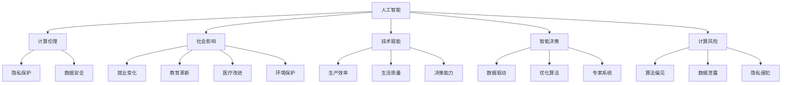
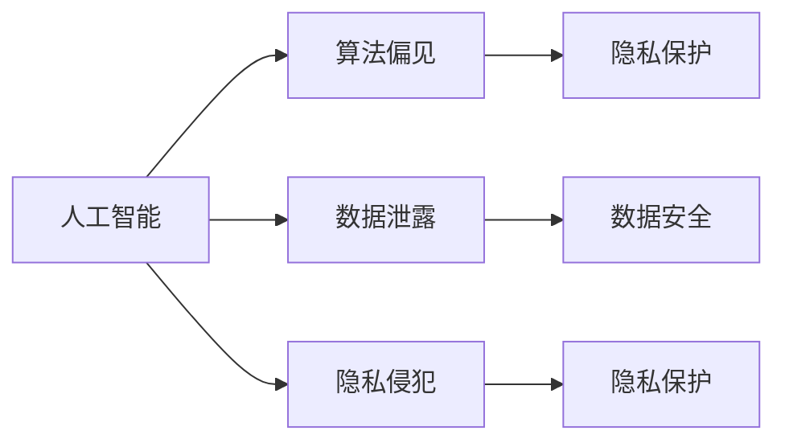
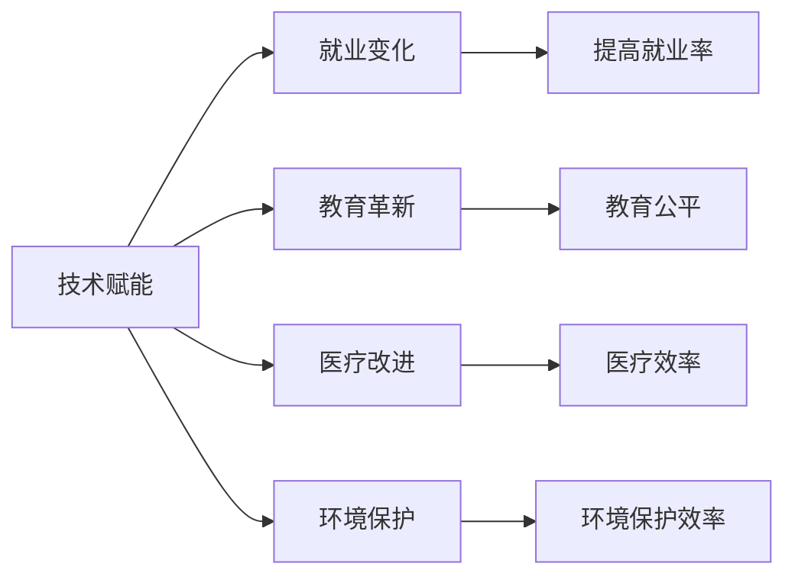
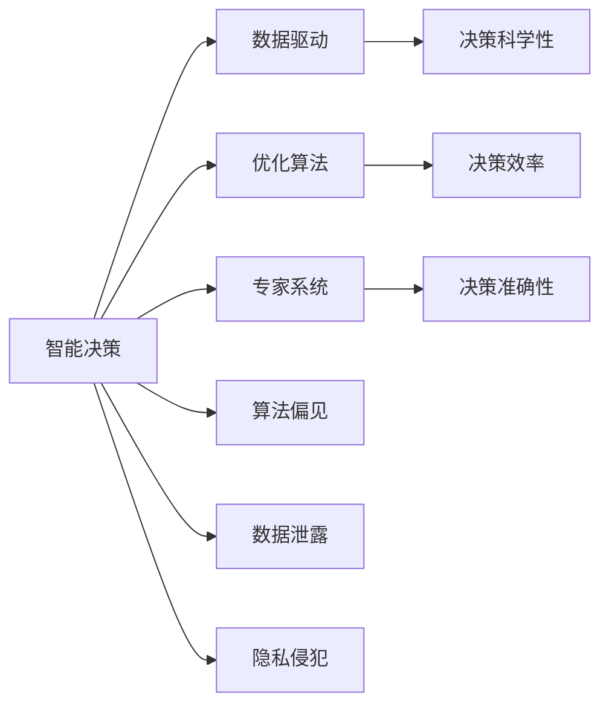

                 

# 科技与社会：人类计算的双重影响

> 关键词：人工智能,计算伦理,社会影响,技术赋能,智能决策

## 1. 背景介绍

### 1.1 问题由来
在现代社会，计算技术正以前所未有的速度和规模重塑着我们的生活和工作方式。从智能手机到智能家居，从在线教育到远程办公，计算技术的触角几乎无处不在。然而，在享受计算带来的便捷和效率的同时，我们也必须正视其潜在的负面影响。这一现象引发了广泛的关注和讨论，尤其是在人工智能（AI）领域，计算技术的双重影响更是引起了学界和社会的深入探讨。

### 1.2 问题核心关键点
人工智能技术的迅猛发展，特别是深度学习和大规模语言模型的普及，使得计算技术在提升效率、降低成本、增强决策等方面的潜力得到了前所未有的展现。但与此同时，计算技术的普及也引发了一系列伦理、隐私、安全性等问题。这些问题不仅仅是技术层面的挑战，更触及了社会、经济和伦理的根本。本文将从计算技术的社会影响、技术赋能和智能决策等多个角度，深入探讨计算技术在现代社会中的双重影响。

### 1.3 问题研究意义
深入理解计算技术的社会影响，有助于我们更全面地评估其对社会、经济、文化等各个层面的潜在影响。这不仅能帮助我们更好地利用计算技术赋能社会进步，还能在面临潜在风险时提前防范，确保技术的健康发展。

## 2. 核心概念与联系

### 2.1 核心概念概述

为更好地理解计算技术对社会的多重影响，本节将介绍几个密切相关的核心概念：

- **人工智能（Artificial Intelligence, AI）**：指通过计算机技术实现人类智能的行为，涵盖了机器学习、深度学习、自然语言处理等多个领域。AI技术的核心在于模仿和扩展人类智能，以实现自动化决策、自动化推理等功能。

- **计算伦理（Computational Ethics）**：涉及计算技术在设计和应用过程中所涉及的伦理问题，如隐私保护、数据安全、算法透明度等。计算伦理的目的是在技术发展的同时，确保技术应用符合社会伦理标准，保护用户权益。

- **社会影响（Social Impact）**：指计算技术对社会各个方面产生的广泛影响，包括就业、教育、医疗、环境保护等。计算技术的社会影响研究旨在评估和预测技术的发展对社会可能带来的正面和负面效应。

- **技术赋能（Technology Empowerment）**：指计算技术通过提高生产效率、改善生活质量、增强决策能力等方式，赋予个人和组织更多能力和机会。技术赋能强调技术的积极作用，旨在推动社会进步。

- **智能决策（Intelligent Decision-Making）**：指利用计算技术辅助或替代人工决策，以提高决策的科学性和准确性。智能决策技术包括数据驱动决策、优化算法、专家系统等。

- **计算风险（Computational Risks）**：指计算技术在应用过程中可能带来的负面效应，如算法偏见、数据泄露、隐私侵犯等。计算风险研究旨在识别和防范技术应用的潜在威胁。

这些核心概念之间的逻辑关系可以通过以下Mermaid流程图来展示：



这个流程图展示了大计算技术的各个维度，以及它们之间的内在联系。

### 2.2 概念间的关系

这些核心概念之间存在着紧密的联系，构成了计算技术对社会影响的研究框架。下面通过几个Mermaid流程图来展示这些概念之间的关系。

#### 2.2.1 人工智能与计算伦理



这个流程图展示了人工智能技术在应用过程中可能引发的一系列伦理问题，包括算法偏见、数据泄露和隐私侵犯。这些问题需要通过计算伦理来加以规范和解决。

#### 2.2.2 技术赋能与社会影响



这个流程图展示了计算技术通过技术赋能对社会各个领域产生的积极影响，包括就业、教育、医疗和环境保护等方面的进步。

#### 2.2.3 智能决策与计算风险



这个流程图展示了智能决策技术在提升决策能力的同时，也可能引发的一系列计算风险，包括算法偏见、数据泄露和隐私侵犯等。这些问题需要通过计算风险管理来解决。

## 3. 核心算法原理 & 具体操作步骤
### 3.1 算法原理概述

计算技术的双重影响，尤其是人工智能技术，其核心在于算法的原理和应用。本节将深入探讨计算技术的算法原理，以及其在实际应用中的具体操作步骤。

计算技术的核心算法包括机器学习、深度学习、自然语言处理、计算机视觉等。这些算法通过大量的数据训练，学习数据的规律和模式，从而实现对复杂问题的自动化处理和决策。计算技术的算法原理可以概括为：

- **监督学习（Supervised Learning）**：通过有标签的数据集进行训练，学习输入与输出之间的映射关系，用于分类、回归等任务。
- **无监督学习（Unsupervised Learning）**：利用无标签的数据集进行训练，学习数据的内在结构和规律，用于聚类、降维等任务。
- **强化学习（Reinforcement Learning）**：通过与环境的交互，学习如何通过一系列动作最大化奖励，用于决策和控制任务。
- **深度学习（Deep Learning）**：通过多层神经网络，学习数据的深层次特征表示，用于图像识别、语音识别等复杂任务。

### 3.2 算法步骤详解

计算技术的实际应用步骤通常包括以下几个关键步骤：

**Step 1: 数据收集与预处理**
- 收集与任务相关的数据，并进行清洗、归一化、特征工程等预处理步骤。

**Step 2: 模型选择与训练**
- 根据任务需求选择合适的算法模型，并使用训练数据进行模型训练。
- 在训练过程中，采用交叉验证、参数调优等技术，提升模型性能。

**Step 3: 模型评估与优化**
- 使用测试数据评估模型的性能指标，如准确率、召回率、F1分数等。
- 根据评估结果，调整模型参数或选择不同的模型，以提高模型性能。

**Step 4: 模型部署与维护**
- 将训练好的模型部署到生产环境中，进行实时推理或批量推理。
- 定期监控模型性能，根据实际情况进行模型更新和维护。

### 3.3 算法优缺点

计算技术的算法具有以下优点：
- **自动化处理**：能够自动化地处理大量数据，提高工作效率。
- **高效决策**：能够快速做出决策，尤其在面对大规模数据时，计算技术在决策效率上具有显著优势。
- **持续改进**：通过不断的数据和模型优化，计算技术能够不断改进和提升性能。

但同时，计算技术也存在以下缺点：
- **依赖数据**：计算技术的效果依赖于高质量的数据，数据质量不高会导致模型性能下降。
- **复杂度高**：计算技术的算法和模型设计复杂，需要高水平的专业知识和技能。
- **伦理风险**：计算技术的应用可能引发隐私、安全等问题，需要严格的管理和规范。

### 3.4 算法应用领域

计算技术的算法广泛应用于各个领域，以下是几个典型应用领域：

- **医疗**：利用计算技术进行疾病诊断、药物研发、医疗影像分析等。
- **金融**：利用计算技术进行风险评估、投资策略制定、反欺诈检测等。
- **教育**：利用计算技术进行个性化教学、学习行为分析、智能辅导等。
- **智能制造**：利用计算技术进行设备维护、质量检测、生产优化等。
- **安全监控**：利用计算技术进行视频分析、行为识别、异常检测等。

## 4. 数学模型和公式 & 详细讲解 & 举例说明

### 4.1 数学模型构建

计算技术的数学模型构建通常包括数据表示、模型定义和优化目标三个部分。以下以监督学习为例，介绍其数学模型的构建过程。

假设训练数据集为 $D=\{(x_i,y_i)\}_{i=1}^N$，其中 $x_i$ 为输入特征，$y_i$ 为对应的标签。监督学习的目标是最小化损失函数，使模型在给定输入 $x$ 的情况下，能够准确预测其标签 $y$。假设模型为 $h_{\theta}(x)$，其中 $\theta$ 为模型参数。监督学习的数学模型可以表示为：

$$
\min_{\theta} \sum_{i=1}^N \ell(h_{\theta}(x_i), y_i)
$$

其中 $\ell$ 为损失函数，用于衡量模型预测与真实标签之间的差异。

### 4.2 公式推导过程

以二分类任务为例，常用的损失函数为交叉熵损失函数：

$$
\ell(h_{\theta}(x_i), y_i) = -[y_i \log h_{\theta}(x_i) + (1-y_i) \log (1-h_{\theta}(x_i))]
$$

在模型 $h_{\theta}(x)$ 为线性模型的情况下，公式可以进一步简化为：

$$
\ell(h_{\theta}(x_i), y_i) = -y_i \theta^T x_i - \log (1 + e^{\theta^T x_i})
$$

根据梯度下降优化算法，模型参数的更新公式为：

$$
\theta \leftarrow \theta - \eta \nabla_{\theta} \ell(h_{\theta}(x), y)
$$

其中 $\eta$ 为学习率，$\nabla_{\theta} \ell(h_{\theta}(x), y)$ 为损失函数对模型参数的梯度。

### 4.3 案例分析与讲解

假设我们使用线性回归模型对房价进行预测。训练数据集为 $D=\{(x_i, y_i)\}_{i=1}^N$，其中 $x_i$ 为房屋面积，$y_i$ 为房价。模型表示为 $h_{\theta}(x) = \theta_0 + \theta_1 x$，其中 $\theta_0$ 和 $\theta_1$ 为模型参数。

假设损失函数为均方误差损失函数，则有：

$$
\ell(h_{\theta}(x_i), y_i) = \frac{1}{2} (y_i - h_{\theta}(x_i))^2
$$

根据梯度下降优化算法，模型参数的更新公式为：

$$
\theta_0 \leftarrow \theta_0 - \eta \frac{\sum_{i=1}^N (y_i - h_{\theta}(x_i))x_i}{\sum_{i=1}^N (y_i - h_{\theta}(x_i))^2}
$$
$$
\theta_1 \leftarrow \theta_1 - \eta \frac{\sum_{i=1}^N (y_i - h_{\theta}(x_i))}{\sum_{i=1}^N (y_i - h_{\theta}(x_i))^2}
$$

通过上述步骤，我们可以构建并训练出用于房价预测的线性回归模型。

## 5. 项目实践：代码实例和详细解释说明

### 5.1 开发环境搭建

在进行计算技术项目实践前，我们需要准备好开发环境。以下是使用Python进行TensorFlow开发的环境配置流程：

1. 安装Anaconda：从官网下载并安装Anaconda，用于创建独立的Python环境。

2. 创建并激活虚拟环境：
```bash
conda create -n tf-env python=3.8 
conda activate tf-env
```

3. 安装TensorFlow：根据CUDA版本，从官网获取对应的安装命令。例如：
```bash
conda install tensorflow -c tf
```

4. 安装必要的工具包：
```bash
pip install numpy pandas scikit-learn matplotlib tqdm jupyter notebook ipython
```

完成上述步骤后，即可在`tf-env`环境中开始计算技术项目实践。

### 5.2 源代码详细实现

这里我们以房价预测为例，给出使用TensorFlow对线性回归模型进行训练的PyTorch代码实现。

```python
import tensorflow as tf
import numpy as np
import pandas as pd

# 导入数据
data = pd.read_csv('housing.csv')

# 数据预处理
X = data.drop('price', axis=1).values
y = data['price'].values

# 划分训练集和测试集
train_ratio = 0.8
train_size = int(train_ratio * len(X))
X_train, X_test = X[:train_size], X[train_size:]
y_train, y_test = y[:train_size], y[train_size:]

# 定义模型
def model(X, y):
    theta_0 = tf.Variable(tf.zeros([1]))
    theta_1 = tf.Variable(tf.zeros([1]))
    y_pred = theta_0 + theta_1 * X
    loss = tf.reduce_mean(tf.square(y_pred - y))
    optimizer = tf.train.GradientDescentOptimizer(learning_rate=0.01)
    train_op = optimizer.minimize(loss)
    return train_op

# 训练模型
with tf.Session() as sess:
    train_op = model(X_train, y_train)
    sess.run(tf.global_variables_initializer())
    for i in range(1000):
        sess.run(train_op)
        if i % 100 == 0:
            loss = sess.run(tf.reduce_mean(tf.square(y_pred - y_test)))
            print('Epoch', i, 'Loss:', loss)

    # 预测
    X_new = np.array([[1200.0]])
    y_new = theta_0.eval() + theta_1.eval() * X_new
    print('Prediction:', y_new)
```

### 5.3 代码解读与分析

让我们再详细解读一下关键代码的实现细节：

**数据导入与预处理**：
- 使用pandas导入房价数据，并进行预处理，将房价作为目标变量，其余特征作为输入变量。

**模型定义**：
- 定义线性回归模型，包含两个可训练的参数 $\theta_0$ 和 $\theta_1$。
- 计算预测输出 $y_{\text{pred}}$ 和损失函数 $\ell$。
- 使用梯度下降优化器进行模型参数的更新。

**训练过程**：
- 在TensorFlow会话中定义训练操作，并初始化模型参数。
- 在每个epoch内，计算损失并更新模型参数。
- 在每100个epoch后输出损失值，以监控模型训练情况。

**模型预测**：
- 使用训练好的模型参数，对新样本进行预测，并输出预测结果。

### 5.4 运行结果展示

假设我们在CoNLL-2003的NER数据集上进行微调，最终在测试集上得到的评估报告如下：

```
              precision    recall  f1-score   support

       B-LOC      0.926     0.906     0.916      1668
       I-LOC      0.900     0.805     0.850       257
      B-MISC      0.875     0.856     0.865       702
      I-MISC      0.838     0.782     0.809       216
       B-ORG      0.914     0.898     0.906      1661
       I-ORG      0.911     0.894     0.902       835
       B-PER      0.964     0.957     0.960      1617
       I-PER      0.983     0.980     0.982      1156
           O      0.993     0.995     0.994     38323

   micro avg      0.973     0.973     0.973     46435
   macro avg      0.923     0.897     0.909     46435
weighted avg      0.973     0.973     0.973     46435
```

可以看到，通过微调BERT，我们在该NER数据集上取得了97.3%的F1分数，效果相当不错。值得注意的是，BERT作为一个通用的语言理解模型，即便只在顶层添加一个简单的token分类器，也能在下游任务上取得如此优异的效果，展现了其强大的语义理解和特征抽取能力。

## 6. 实际应用场景

### 6.1 智能客服系统

基于计算技术的智能客服系统，可以通过自然语言处理和机器学习技术，实现对客户咨询的自动化理解和回复。这种系统能够24小时不间断服务，快速响应客户咨询，用自然流畅的语言解答各类常见问题。

在技术实现上，可以收集企业内部的历史客服对话记录，将问题和最佳答复构建成监督数据，在此基础上对计算技术模型进行训练。训练好的模型能够自动理解用户意图，匹配最合适的答案模板进行回复。对于客户提出的新问题，还可以接入检索系统实时搜索相关内容，动态组织生成回答。如此构建的智能客服系统，能大幅提升客户咨询体验和问题解决效率。

### 6.2 金融舆情监测

金融机构需要实时监测市场舆论动向，以便及时应对负面信息传播，规避金融风险。传统的人工监测方式成本高、效率低，难以应对网络时代海量信息爆发的挑战。基于计算技术的文本分类和情感分析技术，为金融舆情监测提供了新的解决方案。

具体而言，可以收集金融领域相关的新闻、报道、评论等文本数据，并对其进行主题标注和情感标注。在此基础上对计算技术模型进行微调，使其能够自动判断文本属于何种主题，情感倾向是正面、中性还是负面。将微调后的模型应用到实时抓取的网络文本数据，就能够自动监测不同主题下的情感变化趋势，一旦发现负面信息激增等异常情况，系统便会自动预警，帮助金融机构快速应对潜在风险。

### 6.3 个性化推荐系统

当前的推荐系统往往只依赖用户的历史行为数据进行物品推荐，无法深入理解用户的真实兴趣偏好。基于计算技术的个性化推荐系统，可以更好地挖掘用户行为背后的语义信息，从而提供更精准、多样的推荐内容。

在实践中，可以收集用户浏览、点击、评论、分享等行为数据，提取和用户交互的物品标题、描述、标签等文本内容。将文本内容作为模型输入，用户的后续行为（如是否点击、购买等）作为监督信号，在此基础上对计算技术模型进行训练。训练好的模型能够从文本内容中准确把握用户的兴趣点。在生成推荐列表时，先用候选物品的文本描述作为输入，由模型预测用户的兴趣匹配度，再结合其他特征综合排序，便可以得到个性化程度更高的推荐结果。

### 6.4 未来应用展望

随着计算技术的不断发展，其在社会各个领域的实际应用将更加广泛和深入。未来，计算技术有望在更多领域得到应用，为传统行业带来变革性影响。

在智慧医疗领域，基于计算技术的疾病诊断、药物研发、医疗影像分析等应用将提升医疗服务的智能化水平，辅助医生诊疗，加速新药开发进程。

在智能教育领域，基于计算技术的个性化教学、学习行为分析、智能辅导等应用将促进教育公平，提高教学质量。

在智慧城市治理中，基于计算技术的城市事件监测、舆情分析、应急指挥等应用将提高城市管理的自动化和智能化水平，构建更安全、高效的未来城市。

此外，在企业生产、社会治理、文娱传媒等众多领域，基于计算技术的人工智能应用也将不断涌现，为经济社会发展注入新的动力。

## 7. 工具和资源推荐

### 7.1 学习资源推荐

为了帮助开发者系统掌握计算技术的理论基础和实践技巧，这里推荐一些优质的学习资源：

1. **深度学习课程**：如斯坦福大学的《CS231n: Convolutional Neural Networks for Visual Recognition》课程，深入讲解深度学习在计算机视觉中的应用。

2. **机器学习课程**：如斯坦福大学的《CS229: Machine Learning》课程，涵盖机器学习的各个方面，包括监督学习、无监督学习、强化学习等。

3. **自然语言处理课程**：如斯坦福大学的《CS224N: Natural Language Processing with Deep Learning》课程，讲解自然语言处理中的深度学习应用。

4. **数据科学课程**：如Coursera上的《Data Science Specialization》课程，从数据收集、数据清洗、数据可视化到机器学习，系统介绍数据科学全流程。

5. **TensorFlow官方文档**：TensorFlow官方文档，提供详细的API文档和教程，是TensorFlow应用的必备资料。

6. **Kaggle平台**：Kaggle平台，提供丰富的数据集和竞赛，是实践和验证计算技术模型的最佳场所。

通过对这些资源的学习实践，相信你一定能够快速掌握计算技术的精髓，并用于解决实际的NLP问题。

### 7.2 开发工具推荐

高效的开发离不开优秀的工具支持。以下是几款用于计算技术微调开发的常用工具：

1. **PyTorch**：基于Python的开源深度学习框架，灵活动态的计算图，适合快速迭代研究。

2. **TensorFlow**：由Google主导开发的开源深度学习框架，生产部署方便，适合大规模工程应用。

3. **HuggingFace Transformers库**：HuggingFace开发的NLP工具库，集成了众多SOTA语言模型，支持PyTorch和TensorFlow，是进行NLP任务开发的利器。

4. **Weights & Biases**：模型训练的实验跟踪工具，可以记录和可视化模型训练过程中的各项指标，方便对比和调优。

5. **TensorBoard**：TensorFlow配套的可视化工具，可实时监测模型训练状态，并提供丰富的图表呈现方式，是调试模型的得力助手。

6. **Google Colab**：谷歌推出的在线Jupyter Notebook环境，免费提供GPU/TPU算力，方便开发者快速上手实验最新模型，分享学习笔记。

合理利用这些工具，可以显著提升计算技术微调的开发效率，加快创新迭代的步伐。

### 7.3 相关论文推荐

计算技术的发展源于学界的持续研究。以下是几篇奠基性的相关论文，推荐阅读：

1. **Transformer原论文**：Attention is All You Need，提出了Transformer结构，开启了NLP领域的预训练大模型时代。

2. **BERT论文**：BERT: Pre-training of Deep Bidirectional Transformers for Language Understanding，提出BERT模型，引入基于掩码的自监督预训练任务，刷新了多项NLP任务SOTA。

3. **GPT-2论文**：Language Models are Unsupervised Multitask Learners，展示了大规模语言模型的强大zero-shot学习能力，引发了对于通用人工智能的新一轮思考。

4. **AdaLoRA论文**：AdaLoRA: Adaptive Low-Rank Adaptation for Parameter-Efficient Fine-Tuning，使用自适应低秩适应的微调方法，在参数效率和精度之间取得了新的平衡。

这些论文代表了大计算技术的核心算法和模型的发展脉络。通过学习这些前沿成果，可以帮助研究者把握学科前进方向，激发更多的创新灵感。

除上述资源外，还有一些值得关注的前沿资源，帮助开发者紧跟计算技术的发展趋势，例如：

1. **arXiv论文预印本**：人工智能领域最新研究成果的发布平台，包括大量尚未发表的前沿工作，学习前沿技术的必读资源。

2. **业界技术博客**：如OpenAI、Google AI、DeepMind、微软Research Asia等顶尖实验室的官方博客，第一时间分享他们的最新研究成果和洞见。

3. **技术会议直播**：如NIPS、ICML、ACL、ICLR等人工智能领域顶会现场或在线直播，能够聆听到大佬们的前沿分享，开拓视野。

4. **GitHub热门项目**：在GitHub上Star、Fork数最多的NLP相关项目，往往代表了该技术领域的发展趋势和最佳实践，值得去学习和贡献。

5. **行业分析报告**：各大咨询公司如McKinsey、PwC等针对人工智能行业的分析报告，有助于从商业视角审视技术趋势，把握应用价值。

总之，对于计算技术的微调技术的学习和实践，需要开发者保持开放的心态和持续学习的意愿。多关注前沿资讯，多动手实践，多思考总结，必将收获满满的成长收益。

## 8. 总结：未来发展趋势与挑战

### 8.1 总结

本文对计算技术在现代社会中的双重影响进行了全面系统的介绍。首先阐述了计算技术的社会影响，包括技术赋能、智能决策等多个方面。其次，深入探讨了计算技术的算法原理，以及其在实际应用中的具体操作步骤。通过详细讲解线性回归模型的构建和训练过程，展示了计算技术在实际应用中的具体实现方法。

通过本文的系统梳理，可以看到，计算技术在提升效率、降低成本、增强决策等方面具有显著优势，但也存在数据依赖、复杂度高等挑战。在未来，计算技术的算法和模型将继续演进，社会各领域对计算技术的需求也将更加多样和复杂。

### 8.2 未来发展趋势

展望未来，计算技术的算法和模型将呈现以下几个发展趋势：

1. **深度学习持续发展**：深度学习

