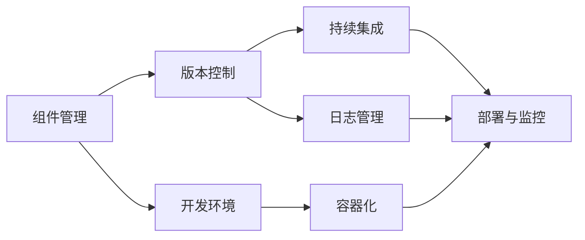

                 

# 端到端自动驾驶的软件开发工具链优化

## 1. 背景介绍

### 1.1 问题由来

随着自动驾驶技术的发展，端到端自动驾驶软件的开发成为了一个复杂的工程任务。自动驾驶软件涉及到多个子系统和组件，包括感知模块、决策模块、控制模块、通信模块等。各个模块之间的协同工作需要高效的开发工具链来支持。然而，现有的工具链往往分散在不同的系统中，难以实现统一的集成和协同开发。

### 1.2 问题核心关键点

端到端自动驾驶软件优化开发工具链的核心关键点包括：
1. **组件管理**：对各个子系统和组件进行统一管理，确保其版本的兼容性和依赖关系的清晰。
2. **开发环境搭建**：构建统一的开发环境，支持各个模块在相同的运行环境中进行测试和调试。
3. **代码协同开发**：支持多人协作，实时更新代码并同步到共享仓库，减少代码冲突。
4. **集成测试**：在开发过程中进行充分的集成测试，确保各模块之间的协同工作可靠。
5. **持续集成**：通过持续集成(CI)技术，自动化地构建、测试和部署，提升开发效率。
6. **部署与监控**：实现自动驾驶软件的快速部署和实时监控，保证运行时的稳定性。

### 1.3 问题研究意义

优化端到端自动驾驶软件开发工具链，具有重要的研究意义：
1. **提升开发效率**：通过统一的开发工具链，减少开发过程中的重复劳动，提升整个团队的工作效率。
2. **确保代码质量**：统一的代码管理和持续集成可以确保代码质量，减少错误和缺陷。
3. **促进协同开发**：多人协作开发需要高效的工具链支持，避免代码冲突和版本混乱。
4. **保障系统稳定性**：持续集成和部署可以确保自动驾驶系统在不断迭代中的稳定性，减少故障和事故。
5. **推动行业标准**：统一的开发工具链可以作为行业标准的参考，推动自动驾驶技术的发展。

## 2. 核心概念与联系

### 2.1 核心概念概述

在优化端到端自动驾驶软件开发工具链的过程中，涉及到的核心概念包括：

1. **组件管理工具**：如Jenkins、Maven等，用于管理组件的版本、依赖和配置。
2. **开发环境工具**：如Docker、Vagrant等，用于构建一致的开发环境。
3. **版本控制系统**：如Git、SVN等，用于协作开发和代码版本控制。
4. **持续集成工具**：如Jenkins、Travis CI等，用于自动化构建、测试和部署。
5. **容器化技术**：如Docker、Kubernetes等，用于容器化部署和管理。
6. **日志和监控工具**：如ELK Stack、Grafana等，用于系统日志和性能监控。

这些概念之间存在着紧密的联系，共同构成了端到端自动驾驶软件开发工具链的完整生态系统。

### 2.2 概念间的关系

这些核心概念之间的关系可以通过以下Mermaid流程图来展示：



这个流程图展示了大语言模型的核心概念及其之间的关系：

1. 组件管理工具用于管理组件的版本和依赖。
2. 版本控制工具用于协作开发和代码版本控制。
3. 持续集成工具用于自动化构建、测试和部署。
4. 开发环境工具用于构建一致的开发环境。
5. 容器化技术用于容器化部署和管理。
6. 日志和监控工具用于系统日志和性能监控。

这些概念共同构成了端到端自动驾驶软件开发工具链的完整生态系统。通过理解这些核心概念，我们可以更好地把握开发工具链的工作原理和优化方向。

## 3. 核心算法原理 & 具体操作步骤

### 3.1 算法原理概述

优化端到端自动驾驶软件开发工具链的核心思想是构建一个高效、协同、自动化的开发和部署环境。这个环境需要具备以下特征：
1. 支持组件的统一管理。
2. 提供一致的开发环境。
3. 实现代码的协同开发和版本控制。
4. 支持自动化构建、测试和部署。
5. 实现系统的日志和性能监控。

### 3.2 算法步骤详解

优化端到端自动驾驶软件开发工具链的一般步骤如下：

1. **需求分析**：明确自动驾驶软件的需求和功能模块，确定需要集成的组件和工具。
2. **选择工具链组件**：根据需求选择合适的工具链组件，包括版本控制、构建工具、容器化技术等。
3. **配置和集成**：将选定的工具链组件配置并集成到开发环境中，确保各组件之间的协同工作。
4. **持续集成**：通过持续集成工具，自动化地构建、测试和部署软件，提升开发效率和代码质量。
5. **日志和监控**：部署日志和监控工具，实时监控系统性能和异常，及时解决问题。

### 3.3 算法优缺点

优化端到端自动驾驶软件开发工具链的优点包括：
1. 提高开发效率。通过自动化和协同开发，减少了重复劳动，提升了整体开发效率。
2. 保障代码质量。统一的版本控制和持续集成可以确保代码质量，减少错误和缺陷。
3. 促进协同开发。多人协作开发需要高效的工具链支持，避免代码冲突和版本混乱。
4. 保障系统稳定性。持续集成和部署可以确保自动驾驶系统在不断迭代中的稳定性，减少故障和事故。

同时，该方法也存在一些缺点：
1. 依赖于工具链组件的质量。选定的工具链组件需要稳定、可靠、高效，否则可能影响开发效率。
2. 需要维护和管理工具链。构建和维护一个高效的工具链需要投入大量人力和时间。
3. 对开发人员的要求较高。使用高效的工具链需要开发人员具备一定的技术水平和管理能力。

### 3.4 算法应用领域

端到端自动驾驶软件优化开发工具链的应用领域包括：

1. **自动驾驶系统开发**：适用于自动驾驶软件的开发，支持各个模块在相同的运行环境中进行测试和调试。
2. **自动驾驶数据集管理**：用于管理自动驾驶数据集的收集、标注和处理，确保数据集的质量和一致性。
3. **自动驾驶平台部署**：实现自动驾驶软件的快速部署和实时监控，保证运行时的稳定性。
4. **自动驾驶测试平台**：支持自动驾驶软件的测试和验证，确保各模块之间的协同工作可靠。

## 4. 数学模型和公式 & 详细讲解 & 举例说明

### 4.1 数学模型构建

优化端到端自动驾驶软件开发工具链需要构建一个数学模型，用于评估和优化工具链的各个环节。假设有一个由n个组件构成的工具链，其效率和可靠性可以用以下指标来衡量：

- **组件效率**：每个组件在开发和部署中的效率，可以用完成时间表示。
- **组件可靠性**：每个组件在运行中的可靠性，可以用故障率表示。
- **系统整体效率**：整个工具链的效率，可以用加权平均时间表示。
- **系统整体可靠性**：整个工具链的可靠性，可以用平均故障间隔时间表示。

### 4.2 公式推导过程

假设各个组件的效率和可靠性分别为 $e_i$ 和 $r_i$，系统整体效率为 $E$，系统整体可靠性为 $R$，则可以用以下公式表示：

$$
E = \frac{1}{n} \sum_{i=1}^n e_i \\
R = \prod_{i=1}^n r_i
$$

在实际应用中，可以引入权重 $w_i$，用于平衡各个组件的重要性，例如：

$$
E = \sum_{i=1}^n w_i e_i \\
R = \prod_{i=1}^n r_i^{w_i}
$$

### 4.3 案例分析与讲解

以自动驾驶数据集管理为例，我们可以构建一个基于Git的版本控制模型，用于管理数据集的版本和协作开发。在这个模型中，各个组件的效率和可靠性可以用以下指标来衡量：

- **版本控制效率**：Git的版本控制效率，可以用提交次数和合并冲突率表示。
- **版本控制可靠性**：Git的版本控制可靠性，可以用提交失败率和数据丢失率表示。
- **数据集处理效率**：数据集处理的速度和质量，可以用处理时间和处理准确率表示。
- **数据集处理可靠性**：数据集处理的稳定性，可以用数据丢失率和处理错误率表示。

通过构建和优化这个模型，可以提升数据集管理的效率和可靠性，确保数据集的质量和一致性。

## 5. 项目实践：代码实例和详细解释说明

### 5.1 开发环境搭建

在进行自动驾驶软件开发工具链优化实践前，我们需要准备好开发环境。以下是使用Python进行Jenkins开发的环境配置流程：

1. 安装Jenkins：从官网下载并安装Jenkins，创建Jenkins服务器。
2. 配置Jenkins：安装必要的插件，如Git插件、Docker插件等。
3. 配置Git仓库：在Jenkins上配置Git仓库，用于存储自动驾驶软件的代码。
4. 配置Docker环境：在Jenkins上配置Docker环境，用于构建和部署自动驾驶软件。

### 5.2 源代码详细实现

下面我们以自动驾驶数据集管理为例，给出使用Jenkins进行自动驾驶数据集版本控制的PyTorch代码实现。

首先，定义Git仓库管理函数：

```python
import jenkins
import os

def upload_to_jenkins(target_url, branch_name, commit_message):
    # 连接Jenkins服务器
    server = jenkins.Jenkins('http://localhost:8080', username='admin', password='admin')

    # 获取提交的提交id
    commit_id = get_latest_commit(server, branch_name)

    # 创建新的提交
    server.create_build(target=target_url, branch_name=branch_name, commit_id=commit_id, message=commit_message)
```

然后，定义获取最新提交的函数：

```python
def get_latest_commit(server, branch_name):
    # 获取最新提交的id
    builds = server.get_builds(job=branch_name)
    latest_build = builds[0]
    return latest_build.commit.id
```

最后，启动Jenkins服务器并在Git仓库上进行提交：

```python
target_url = 'https://github.com/autodrive/dataset.git'
branch_name = 'main'
commit_message = 'Upload new dataset'

upload_to_jenkins(target_url, branch_name, commit_message)
```

以上就是一个使用Jenkins进行自动驾驶数据集版本控制的完整代码实现。可以看到，Jenkins通过与Git仓库和Docker环境集成，实现了自动驾驶数据集的版本管理和持续集成。

### 5.3 代码解读与分析

让我们再详细解读一下关键代码的实现细节：

**upload_to_jenkins函数**：
- 连接Jenkins服务器。
- 获取提交的提交id。
- 创建新的提交，并指定目标url、分支名、提交id和提交消息。

**get_latest_commit函数**：
- 获取最新提交的id。
- 通过Jenkins服务器获取指定分支的最新构建，获取其提交id。

**启动Jenkins服务器并在Git仓库上进行提交**：
- 定义目标url、分支名和提交消息。
- 调用upload_to_jenkins函数，上传最新的数据集版本。

可以看到，通过Jenkins进行版本控制，可以自动化地管理自动驾驶数据集的代码，确保数据集的版本一致性和协作开发的高效性。

### 5.4 运行结果展示

假设我们在Jenkins上成功上传了一个新的数据集版本，可以在Jenkins的用户界面查看提交的历史记录和状态。

```
Commit id: cebb8e8a
Commit message: Upload new dataset
```

可以看到，最新的提交被成功上传到了Jenkins服务器上，系统已经自动化地完成了数据集的版本控制。

## 6. 实际应用场景

### 6.1 智能交通系统

基于自动驾驶软件优化开发工具链的智能交通系统，可以应用于城市交通管理、交通流量监控、交通信号控制等领域。智能交通系统通过收集车辆位置、速度、路线等数据，实时分析交通情况，优化交通信号控制和路线规划，提升交通效率和安全性。

### 6.2 自动驾驶测试平台

自动驾驶测试平台需要支持多种传感器数据和车辆控制信号的集成和处理，对软件进行全面的测试和验证。通过优化开发工具链，可以实现各个模块的协同开发和集成测试，确保自动驾驶软件在不同场景下的稳定性。

### 6.3 自动驾驶云平台

自动驾驶云平台需要实现自动驾驶软件的快速部署和实时监控，确保系统的稳定性和可靠性。通过优化开发工具链，可以实现自动驾驶软件的自动化部署和持续集成，实时监控系统性能和异常，及时解决问题。

### 6.4 未来应用展望

伴随自动驾驶技术的不断发展和应用场景的拓展，优化端到端自动驾驶软件开发工具链将更加重要。未来，自动驾驶软件优化开发工具链将呈现以下几个趋势：

1. **云原生应用**：随着云计算的普及，自动驾驶软件将越来越多地部署在云平台上，需要优化云原生应用的工具链。
2. **边缘计算**：自动驾驶系统需要在边缘设备上进行实时处理，需要优化边缘计算的工具链。
3. **联邦学习**：自动驾驶系统需要通过联邦学习进行数据隐私保护和模型优化，需要优化联邦学习工具链。
4. **人工智能**：自动驾驶系统将越来越多地融合人工智能技术，需要优化人工智能工具链。
5. **车联网**：自动驾驶系统需要与车联网进行深度融合，需要优化车联网工具链。

优化端到端自动驾驶软件开发工具链将极大地提升自动驾驶技术的开发效率和系统稳定性，推动自动驾驶技术的商业化和产业化进程。

## 7. 工具和资源推荐

### 7.1 学习资源推荐

为了帮助开发者系统掌握自动驾驶软件优化开发工具链的理论基础和实践技巧，这里推荐一些优质的学习资源：

1. Jenkins官方文档：提供Jenkins的详细配置和使用方法，是初学者入门的好资料。
2. Docker官方文档：提供Docker容器的详细配置和使用方法，是容器化部署的必备资料。
3. Git官方文档：提供Git版本控制系统的详细配置和使用方法，是协作开发的必备资料。
4. Kubernetes官方文档：提供Kubernetes容器编排系统的详细配置和使用方法，是容器化管理的必备资料。
5. ELK Stack官方文档：提供日志管理和监控工具的详细配置和使用方法，是系统监控的必备资料。

通过对这些资源的学习实践，相信你一定能够快速掌握自动驾驶软件优化开发工具链的精髓，并用于解决实际的自动驾驶问题。

### 7.2 开发工具推荐

高效的开发离不开优秀的工具支持。以下是几款用于自动驾驶软件优化开发工具链开发的常用工具：

1. Jenkins：开源持续集成工具，支持代码构建、测试和部署。
2. Git：开源版本控制系统，支持多人协作开发和代码版本控制。
3. Docker：开源容器化平台，支持应用程序的打包、部署和运行。
4. Kubernetes：开源容器编排工具，支持容器化应用的部署和管理。
5. ELK Stack：开源日志管理和监控工具，支持系统日志和性能监控。

合理利用这些工具，可以显著提升自动驾驶软件优化开发工具链的开发效率，加快创新迭代的步伐。

### 7.3 相关论文推荐

自动驾驶软件优化开发工具链的发展源于学界的持续研究。以下是几篇奠基性的相关论文，推荐阅读：

1. Jenkins: Open Source Automated Build Server：介绍Jenkins的设计和实现，是持续集成的经典之作。
2. Docker: Automating the Container Life Cycle：介绍Docker的设计和实现，是容器化部署的经典之作。
3. Git: The World’s Largest Repository：介绍Git的设计和实现，是版本控制系统的经典之作。
4. Kubernetes: An Open Platform for Distributing Computing：介绍Kubernetes的设计和实现，是容器编排的经典之作。
5. ELK Stack: Logstash, Elasticsearch, and Kibana：介绍ELK Stack的设计和实现，是日志管理和监控的经典之作。

这些论文代表了大语言模型微调技术的发展脉络。通过学习这些前沿成果，可以帮助研究者把握学科前进方向，激发更多的创新灵感。

除上述资源外，还有一些值得关注的前沿资源，帮助开发者紧跟自动驾驶软件优化开发工具链技术的最新进展，例如：

1. arXiv论文预印本：人工智能领域最新研究成果的发布平台，包括大量尚未发表的前沿工作，学习前沿技术的必读资源。
2. 业界技术博客：如Tesla、Waymo、Cruise等自动驾驶公司的官方博客，第一时间分享他们的最新研究成果和洞见。
3. 技术会议直播：如IEEE、ACM、AAAI等人工智能领域顶会现场或在线直播，能够聆听到大佬们的前沿分享，开拓视野。
4. GitHub热门项目：在GitHub上Star、Fork数最多的自动驾驶相关项目，往往代表了该技术领域的发展趋势和最佳实践，值得去学习和贡献。
5. 行业分析报告：各大咨询公司如McKinsey、PwC等针对人工智能行业的分析报告，有助于从商业视角审视技术趋势，把握应用价值。

总之，对于自动驾驶软件优化开发工具链的学习和实践，需要开发者保持开放的心态和持续学习的意愿。多关注前沿资讯，多动手实践，多思考总结，必将收获满满的成长收益。

## 8. 总结：未来发展趋势与挑战

### 8.1 总结

本文对优化端到端自动驾驶软件开发工具链的方法进行了全面系统的介绍。首先阐述了自动驾驶软件的复杂性和开发工具链的重要性，明确了优化工具链的必要性和关键点。其次，从原理到实践，详细讲解了工具链的各个环节，给出了优化工具链的完整代码实例。同时，本文还广泛探讨了优化工具链在智能交通系统、自动驾驶测试平台、自动驾驶云平台等多个场景中的应用，展示了工具链的广泛适用性。此外，本文精选了工具链的学习资源，力求为读者提供全方位的技术指引。

通过本文的系统梳理，可以看到，优化端到端自动驾驶软件开发工具链技术正在逐步成熟，成为自动驾驶技术落地应用的重要保障。未来，伴随自动驾驶技术的不断发展和应用场景的拓展，工具链的优化也将迎来更多的挑战和机遇。

### 8.2 未来发展趋势

展望未来，优化端到端自动驾驶软件开发工具链技术将呈现以下几个发展趋势：

1. **云原生应用**：随着云计算的普及，自动驾驶软件将越来越多地部署在云平台上，需要优化云原生应用的工具链。
2. **边缘计算**：自动驾驶系统需要在边缘设备上进行实时处理，需要优化边缘计算的工具链。
3. **联邦学习**：自动驾驶系统需要通过联邦学习进行数据隐私保护和模型优化，需要优化联邦学习工具链。
4. **人工智能**：自动驾驶系统将越来越多地融合人工智能技术，需要优化人工智能工具链。
5. **车联网**：自动驾驶系统需要与车联网进行深度融合，需要优化车联网工具链。

这些趋势将推动自动驾驶技术的不断发展和应用场景的拓展，提升自动驾驶软件的开发效率和系统稳定性。

### 8.3 面临的挑战

尽管优化端到端自动驾驶软件开发工具链技术已经取得了一定的进展，但在迈向更加智能化、普适化应用的过程中，它仍面临着诸多挑战：

1. **工具链组件的质量**：选定的工具链组件需要稳定、可靠、高效，否则可能影响开发效率。
2. **工具链的维护和管理**：构建和维护一个高效的工具链需要投入大量人力和时间。
3. **对开发人员的要求**：使用高效的工具链需要开发人员具备一定的技术水平和管理能力。

### 8.4 研究展望

面对优化端到端自动驾驶软件开发工具链所面临的挑战，未来的研究需要在以下几个方面寻求新的突破：

1. **工具链组件的标准化**：开发更加标准化的工具链组件，提升其可移植性和可扩展性。
2. **工具链的自动化优化**：开发自动化的工具链优化工具，减少人力投入和管理成本。
3. **工具链的智能优化**：引入人工智能技术，实时分析和优化工具链的各个环节，提升开发效率和系统稳定性。
4. **工具链的跨领域融合**：将自动驾驶软件优化开发工具链与其他技术领域进行深度融合，提升整体系统的效能和智能化水平。

这些研究方向的探索，将引领优化端到端自动驾驶软件开发工具链技术迈向更高的台阶，为构建安全、可靠、可解释、可控的智能系统铺平道路。面向未来，优化工具链技术还需要与其他人工智能技术进行更深入的融合，如知识表示、因果推理、强化学习等，多路径协同发力，共同推动自动驾驶技术的发展。

## 9. 附录：常见问题与解答

**Q1：端到端自动驾驶软件优化开发工具链是否适用于所有自动驾驶系统？**

A: 端到端自动驾驶软件优化开发工具链适用于大部分自动驾驶系统，特别是涉及多子系统协同工作的场景。但对于一些特别定制的系统，可能需要根据具体情况进行定制化开发。

**Q2：如何选择适合的工具链组件？**

A: 选择适合的工具链组件需要考虑系统的需求、开发人员的水平和现有资源。可以根据开源工具链的社区支持和文档资源，选择稳定、可靠、易用的工具链组件。

**Q3：如何确保工具链组件之间的协同工作？**

A: 确保工具链组件之间的协同工作需要进行良好的配置和集成。可以使用工具链集成工具，如Jenkins、Docker等，实现组件之间的自动化部署和监控。

**Q4：如何提升工具链组件的性能和稳定性？**

A: 提升工具链组件的性能和稳定性需要不断优化组件的配置和优化方法。可以使用自动化测试和性能分析工具，如Jenkins、ELK Stack等，实时监控组件的性能和稳定性。

**Q5：如何处理工具链组件之间的版本冲突？**

A: 处理工具链组件之间的版本冲突需要合理设计版本控制策略。可以使用版本控制系统，如Git，进行组件的协同开发和版本控制。

总之，优化端到端自动驾驶软件开发工具链需要开发者从多个方面进行深入思考和实践。通过合理选择、配置和集成工具链组件，可以有效提升自动驾驶软件的开发效率和系统稳定性，推动自动驾驶技术的商业化和产业化进程。

---

作者：禅与计算机程序设计艺术 / Zen and the Art of Computer Programming

