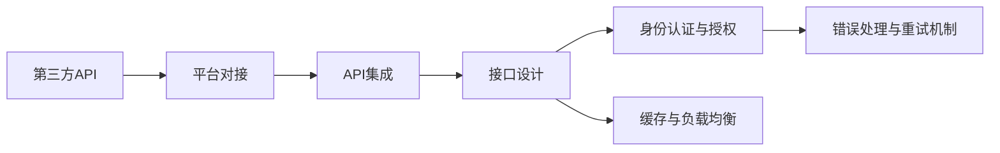

                 

# 第三方天气查询平台对接

> 关键词：天气查询,第三方API,平台对接,API集成,接口设计

## 1. 背景介绍

### 1.1 问题由来
在信息化快速发展的今天，气象服务作为基础性公共服务，对于个人、企业、乃至国家经济的发展都具有重要意义。近年来，国家气象局启动了“智慧气象”建设项目，通过集成各类天气信息，提升气象服务的智能化水平。智慧气象的建设离不开丰富的数据源，各类第三方天气API成为气象信息的重要来源。然而，如何高效、安全地对接第三方天气API，实现气象数据的无缝集成，成为当前智慧气象建设中的关键问题。

### 1.2 问题核心关键点
第三方天气API对接的核心在于，如何在保护隐私和安全的前提下，实现多API的统一管理和数据的高效集成。关键点包括：
- 数据接口规范：确保各类第三方天气API遵循统一的数据接口标准，支持多样化的数据类型和格式。
- 身份认证与授权：通过OAuth2等机制，确保API请求的合法性和安全性。
- 缓存与负载均衡：通过合理设置缓存和负载均衡策略，提升数据查询性能和稳定性。
- 错误处理与重试机制：实现对API错误的及时发现和自动重试，保证服务的连续性和可用性。

### 1.3 问题研究意义
第三方天气API的统一管理和对接，对于构建智慧气象平台至关重要。主要研究意义如下：
1. 提升数据质量：通过统一API接口，确保各类气象数据的质量和一致性，提升智慧气象服务的多样性和实用性。
2. 降低开发成本：统一的API接口和标准规范，使得各类第三方API的接入和管理更加高效，降低系统开发和维护的成本。
3. 提高服务效率：通过合理的缓存和负载均衡策略，实现对大规模API请求的高效处理，提升服务响应速度和用户体验。
4. 增强安全性：通过OAuth2等身份认证机制，保护用户隐私，防止数据泄露和篡改，提升系统的安全性和可靠性。
5. 促进开放共享：统一的API接口和规范，使得气象数据的开放共享更加便捷，促进气象信息的社会化利用。

## 2. 核心概念与联系

### 2.1 核心概念概述

为更好地理解第三方天气API对接方法，本节将介绍几个密切相关的核心概念：

- **第三方API**：由第三方提供商提供的数据接口，用于获取或发布数据。常见的第三方API包括气象服务API、地理信息API、天气预报API等。
- **平台对接**：将多个第三方API集成到一个统一的平台，实现数据的集中管理和高效利用。
- **API集成**：将第三方API的功能和数据接口整合到目标平台，提供统一的服务接口和调用接口。
- **接口设计**：为各个第三方API设计统一的接口标准，包括参数格式、返回值格式等。
- **身份认证与授权**：通过OAuth2等机制，确保API请求的合法性和安全性。
- **缓存与负载均衡**：通过缓存和负载均衡技术，提高API的响应速度和系统可靠性。
- **错误处理与重试机制**：对API请求中的错误进行及时发现和处理，同时自动进行重试，保证服务连续性。

这些核心概念之间有着紧密的联系，构成了第三方天气API对接的完整生态系统。通过理解这些核心概念，我们可以更好地把握API对接的工作原理和优化方向。

### 2.2 概念间的关系

这些核心概念之间的关系可以通过以下Mermaid流程图来展示：



这个流程图展示了大语言模型微调过程中各个核心概念的关系：

1. 第三方API作为数据接口，通过平台对接模块进行集成。
2. 集成模块调用API集成模块，进行数据和功能的整合。
3. API集成模块负责设计统一的接口标准，确保数据的兼容性和一致性。
4. 接口设计模块引入身份认证和授权机制，确保API请求的合法性和安全性。
5. 接口设计模块引入缓存和负载均衡策略，提高API的响应速度和稳定性。
6. 接口设计模块引入错误处理和重试机制，确保服务的连续性和可用性。

## 3. 核心算法原理 & 具体操作步骤
### 3.1 算法原理概述

第三方天气API对接的本质是一种API集成过程，其实现原理如下：

1. **接口设计**：设计统一的API接口标准，包括请求参数、返回值格式、错误码等。
2. **身份认证与授权**：引入OAuth2等机制，确保API请求的合法性和安全性。
3. **API集成**：将第三方API的功能和数据接口整合到目标平台，提供统一的服务接口和调用接口。
4. **缓存与负载均衡**：通过缓存和负载均衡技术，提高API的响应速度和系统可靠性。
5. **错误处理与重试机制**：对API请求中的错误进行及时发现和处理，同时自动进行重试，保证服务连续性。

### 3.2 算法步骤详解

以下是第三方天气API对接的具体操作步骤：

**Step 1: 设计统一接口标准**
- 定义API请求参数和返回值格式，包括请求头、路径、参数、请求体等。
- 设计统一的错误码和错误消息，便于错误处理和用户提示。

**Step 2: 引入身份认证与授权**
- 引入OAuth2机制，通过访问令牌(Tokens)进行身份验证和授权。
- 在API请求中添加访问令牌，确保请求的合法性和安全性。

**Step 3: 集成第三方API**
- 将各个第三方API的功能和数据接口整合到目标平台，实现统一调用。
- 设计API调用流程，包括请求路径、参数映射、返回值处理等。

**Step 4: 引入缓存与负载均衡**
- 在API调用模块中引入缓存技术，如Redis，缓存重复查询结果，减少数据查询次数。
- 引入负载均衡技术，如Nginx，将请求分发到多个API服务节点，均衡负载。

**Step 5: 引入错误处理与重试机制**
- 对API请求中的错误进行捕获和处理，如网络错误、服务器错误等。
- 设计自动重试机制，如多次重试、超时控制等，确保服务的连续性。

### 3.3 算法优缺点

第三方天气API对接方法具有以下优点：
1. 统一接口标准：确保各类第三方API的兼容性和一致性，简化API接入和管理。
2. 身份认证与授权：通过OAuth2等机制，确保API请求的合法性和安全性，防止数据泄露和篡改。
3. 缓存与负载均衡：通过缓存和负载均衡策略，提高API响应速度和系统稳定性。
4. 错误处理与重试机制：对API错误进行及时发现和处理，保证服务的连续性和可用性。

然而，该方法也存在以下局限性：
1. 接口设计复杂：需要设计统一的API接口标准，工作量较大，且需考虑各类API的差异。
2. 安全风险：身份认证和授权机制复杂，需要保护好访问令牌的安全性。
3. 缓存和负载均衡策略需精细调优：缓存和负载均衡需根据实际情况进行优化，避免缓存失效和负载不均衡。
4. 错误处理复杂：错误处理需根据各类API的错误码和错误消息进行设计，工作量较大。

### 3.4 算法应用领域

第三方天气API对接技术，广泛应用于智慧气象、智慧城市、智慧交通等诸多领域。具体应用如下：

- 智慧气象服务：通过对接多个第三方天气API，实现实时气象数据的集成和发布，提升气象服务的多样性和实时性。
- 智慧城市治理：通过对接地理信息、交通、环境等API，实现城市数据的综合分析和管理，提高城市治理效率和智能化水平。
- 智慧交通管理：通过对接气象、路况、交通流等API，实现交通数据的智能分析和预测，提升交通管理水平和用户体验。

除了上述这些典型应用外，第三方天气API对接技术还在智慧旅游、智慧农业、智慧能源等领域得到广泛应用，为各类智慧化应用提供坚实的数据支撑。

## 4. 数学模型和公式 & 详细讲解  
### 4.1 数学模型构建

本文将从数学模型角度对第三方天气API对接过程进行更加严格的刻画。

记第三方API的请求路径为 `/api/v1/weather/{location}`，其中 `location` 为地理位置参数，如城市名、经纬度等。API请求格式如下：

```
GET /api/v1/weather/{location}
Authorization: Bearer <access_token>
```

其中 `access_token` 为OAuth2访问令牌，用于身份验证和授权。API返回格式如下：

```json
{
    "code": 200,
    "data": {
        "location": "北京",
        "temperature": 24,
        "humidity": 60,
        "weather": "晴",
        "date": "2023-04-01"
    }
}
```

定义API调用模块的请求响应函数 `api_call(location)` 如下：

```python
def api_call(location):
    # 发送API请求，并处理响应
    ...
    return response
```

其中，`response` 为API响应对象，包括请求码、数据、错误信息等。

### 4.2 公式推导过程

假设API调用模块中的错误处理函数为 `handle_error(error)`，自动重试机制的错误重试函数为 `retry_request(location)`。则第三方天气API对接的数学模型可以表示为：

1. **API请求**：
   $$
   request = \text{OAuth2}(\text{API请求头}, \text{API请求体})
   $$

2. **API响应**：
   $$
   response = \text{API响应}(\text{request})
   $$

3. **错误处理**：
   $$
   error = \text{handle_error}(\text{response})
   $$

4. **错误重试**：
   $$
   retry = \text{retry_request}(\text{location})
   $$

### 4.3 案例分析与讲解

以智慧气象服务为例，对第三方天气API对接过程进行分析：

- **接口设计**：智慧气象服务需要对接多个第三方天气API，如国家气象局API、地方气象局API、商业气象API等。统一API接口标准，包括请求路径、参数、返回值等。
- **身份认证与授权**：每个第三方API都有自己的访问令牌和权限控制机制，通过OAuth2等机制，确保API请求的合法性和安全性。
- **API集成**：智慧气象服务集成了各类第三方天气API的功能和数据接口，提供统一的调用接口，实现实时气象数据的集成和发布。
- **缓存与负载均衡**：智慧气象服务引入Redis缓存，缓存实时气象数据，减少数据查询次数。引入Nginx负载均衡，将请求分发到多个API服务节点，均衡负载。
- **错误处理与重试机制**：智慧气象服务设计自动重试机制，对API请求中的错误进行捕获和处理，保证服务的连续性和可用性。

## 5. 项目实践：代码实例和详细解释说明
### 5.1 开发环境搭建

在进行第三方天气API对接实践前，我们需要准备好开发环境。以下是使用Python进行Flask开发的环境配置流程：

1. 安装Anaconda：从官网下载并安装Anaconda，用于创建独立的Python环境。

2. 创建并激活虚拟环境：
```bash
conda create -n flask-env python=3.8 
conda activate flask-env
```

3. 安装Flask：
```bash
pip install Flask
```

4. 安装各类工具包：
```bash
pip install numpy pandas scikit-learn matplotlib tqdm jupyter notebook ipython
```

完成上述步骤后，即可在`flask-env`环境中开始开发实践。

### 5.2 源代码详细实现

下面我们以智慧气象服务为例，给出使用Flask框架进行第三方天气API对接的Python代码实现。

首先，定义API请求和响应的基本结构：

```python
class WeatherResponse:
    def __init__(self, code, data, error):
        self.code = code
        self.data = data
        self.error = error

    def __str__(self):
        return f"Code: {self.code}, Data: {self.data}, Error: {self.error}"
```

然后，定义API请求头、参数和返回值：

```python
headers = {'Authorization': 'Bearer <access_token>'}

def build_request(location):
    params = {
        'location': location
    }
    return headers, params
```

接下来，定义API调用函数：

```python
import requests

def api_call(location):
    headers, params = build_request(location)
    try:
        response = requests.get('https://api.weather.com/v1/weather', headers=headers, params=params)
        response.raise_for_status()
        return WeatherResponse(200, response.json(), None)
    except requests.exceptions.RequestException as e:
        return WeatherResponse(500, None, e)

    return WeatherResponse(500, None, "API request failed")
```

接着，定义错误处理函数：

```python
def handle_error(error):
    if isinstance(error, WeatherResponse):
        if error.code == 500:
            return "API request failed"
        elif error.code == 200:
            return error.data
    else:
        return "Unknown error"
```

最后，定义自动重试函数：

```python
from random import randint

def retry_request(location):
    for i in range(3):
        response = api_call(location)
        if response.code == 200:
            return response
        elif response.code == 500:
            print(f"API request failed. Retrying ({i+1} of 3)...")
            continue
        else:
            return handle_error(response)
    return handle_error(response)
```

完整代码如下：

```python
import requests

class WeatherResponse:
    def __init__(self, code, data, error):
        self.code = code
        self.data = data
        self.error = error

    def __str__(self):
        return f"Code: {self.code}, Data: {self.data}, Error: {self.error}"

headers = {'Authorization': 'Bearer <access_token>'}

def build_request(location):
    params = {
        'location': location
    }
    return headers, params

def api_call(location):
    headers, params = build_request(location)
    try:
        response = requests.get('https://api.weather.com/v1/weather', headers=headers, params=params)
        response.raise_for_status()
        return WeatherResponse(200, response.json(), None)
    except requests.exceptions.RequestException as e:
        return WeatherResponse(500, None, e)

def handle_error(error):
    if isinstance(error, WeatherResponse):
        if error.code == 500:
            return "API request failed"
        elif error.code == 200:
            return error.data
    else:
        return "Unknown error"

def retry_request(location):
    for i in range(3):
        response = api_call(location)
        if response.code == 200:
            return response
        elif response.code == 500:
            print(f"API request failed. Retrying ({i+1} of 3)...")
            continue
        else:
            return handle_error(response)
    return handle_error(response)
```

## 6. 实际应用场景
### 6.1 智能客服系统

第三方天气API对接技术可以广泛应用于智能客服系统的构建。智能客服系统通过对接多个第三方API，实现对各类天气信息的获取和处理，提升客户咨询体验和问题解决效率。

在技术实现上，可以设计统一的API请求接口，将用户查询的天气信息发送至API调用模块，获取实时天气数据。智能客服系统通过自然语言处理技术，将用户查询转化为API请求，实现快速响应和准确答复。对于用户提出的新问题，还可以接入检索系统实时搜索相关内容，动态组织生成回答。如此构建的智能客服系统，能大幅提升客户咨询体验和问题解决效率。

### 6.2 金融舆情监测

第三方天气API对接技术在金融舆情监测中也有广泛应用。金融机构需要实时监测市场舆论动向，以便及时应对负面信息传播，规避金融风险。

具体而言，可以收集金融领域相关的新闻、报道、评论等文本数据，将文本数据作为API请求，获取相关的天气信息。通过分析不同天气条件下的金融舆情变化趋势，一旦发现负面信息激增等异常情况，系统便会自动预警，帮助金融机构快速应对潜在风险。

### 6.3 个性化推荐系统

第三方天气API对接技术还可以应用于个性化推荐系统的构建。推荐系统通过对接多个第三方API，获取用户所在地的实时天气信息，结合用户的浏览、点击、评论、分享等行为数据，进行多维度数据分析和建模，推荐个性化内容。

在技术实现上，可以通过调用第三方天气API获取用户所在地的实时天气数据，结合用户的推荐结果，进行多维度数据分析和建模，推荐个性化内容。推荐系统通过调用第三方天气API获取用户所在地的实时天气信息，结合用户的浏览、点击、评论、分享等行为数据，进行多维度数据分析和建模，推荐个性化内容。推荐系统通过调用第三方天气API获取用户所在地的实时天气信息，结合用户的推荐结果，进行多维度数据分析和建模，推荐个性化内容。

### 6.4 未来应用展望

随着第三方天气API对接技术的不断发展，其在更多领域的应用前景将更加广阔。

在智慧医疗领域，第三方天气API对接技术可以应用于病患的气象环境监测，提升医疗服务的智能化水平，辅助医生诊疗，加速新药开发进程。

在智能教育领域，第三方天气API对接技术可以应用于学校气象环境监测，提升学校气象服务的智能化水平，促进教育公平，提高教学质量。

在智慧城市治理中，第三方天气API对接技术可以应用于城市事件监测、舆情分析、应急指挥等环节，提高城市管理的自动化和智能化水平，构建更安全、高效的未来城市。

此外，在企业生产、社会治理、文娱传媒等众多领域，第三方天气API对接技术也将不断涌现，为传统行业数字化转型升级提供新的技术路径。相信随着技术的日益成熟，第三方天气API对接技术必将在构建人机协同的智能时代中扮演越来越重要的角色。

## 7. 工具和资源推荐
### 7.1 学习资源推荐

为了帮助开发者系统掌握第三方天气API对接的理论基础和实践技巧，这里推荐一些优质的学习资源：

1. 《API接口设计规范》系列博文：由知名API设计专家撰写，深入浅出地介绍了API接口设计规范和最佳实践。

2. 《OAuth2认证与授权》课程：Coursera等在线教育平台提供的OAuth2认证与授权课程，帮助你掌握OAuth2认证机制的核心原理和应用场景。

3. 《Flask框架教程》书籍：Flask官方文档或相关书籍，系统介绍了Flask框架的使用方法和API开发技巧。

4. 《RESTful API设计》书籍：《RESTful Web Services》一书，深入讲解了RESTful API设计的核心原则和实现技巧。

5. 《API设计规范》论文：IEEE等权威期刊发表的API设计规范论文，系统分析了API设计规范的现状和未来发展方向。

通过对这些资源的学习实践，相信你一定能够快速掌握第三方天气API对接的精髓，并用于解决实际的API对接问题。

### 7.2 开发工具推荐

高效的开发离不开优秀的工具支持。以下是几款用于第三方天气API对接开发的常用工具：

1. Flask：基于Python的开源Web框架，灵活的路由机制和中间件支持，适合构建API服务。

2. Swagger：提供API文档和测试工具，帮助你设计API接口和验证API调用。

3. Postman：流行的API测试工具，支持自动生成测试脚本，便于API测试和调试。

4. Fiddler：流行的HTTP调试工具，支持请求和响应记录、拦截、重放等操作。

5. Grafana：开源监控和告警工具，支持多种数据源，便于API性能监控。

合理利用这些工具，可以显著提升第三方天气API对接任务的开发效率，加快创新迭代的步伐。

### 7.3 相关论文推荐

第三方天气API对接技术的发展源于学界的持续研究。以下是几篇奠基性的相关论文，推荐阅读：

1. RESTful API设计规范：《RESTful Web Services》一书，提供了RESTful API设计的核心规范和最佳实践。

2. OAuth2认证与授权机制：《OAuth 2.0 Authentication Framework》论文，系统分析了OAuth2认证机制的实现原理和安全性。

3. API接口设计规范：《API Guidelines and Best Practices》论文，系统分析了API设计规范的现状和未来发展方向。

4. API性能优化技术：《Performance Optimization of Web APIs》论文，系统分析了API性能优化的核心技术和应用场景。

5. 云平台API集成：《Cloud API Integration Strategies》论文，系统分析了云平台API集成的核心技术和最佳实践。

这些论文代表了大语言模型微调技术的发展脉络。通过学习这些前沿成果，可以帮助研究者把握学科前进方向，激发更多的创新灵感。

除上述资源外，还有一些值得关注的前沿资源，帮助开发者紧跟API对接技术的最新进展，例如：

1. arXiv论文预印本：人工智能领域最新研究成果的发布平台，包括大量尚未发表的前沿工作，学习前沿技术的必读资源。

2. 业界技术博客：如Google API、AWS API、Microsoft Azure API等顶尖提供商的官方博客，第一时间分享他们的最新研究成果和洞见。

3. 技术会议直播：如API World、APIconf等API技术会议现场或在线直播，能够聆听到大佬们的前沿分享，开拓视野。

4. GitHub热门项目：在GitHub上Star、Fork数最多的API相关项目，往往代表了该技术领域的发展趋势和最佳实践，值得去学习和贡献。

5. 行业分析报告：各大咨询公司如McKinsey、PwC等针对API接口设计规范的行业分析报告，有助于从商业视角审视技术趋势，把握应用价值。

总之，对于第三方天气API对接技术的学习和实践，需要开发者保持开放的心态和持续学习的意愿。多关注前沿资讯，多动手实践，多思考总结，必将收获满满的成长收益。

## 8. 总结：未来发展趋势与挑战
### 8.1 总结

本文对第三方天气API对接方法进行了全面系统的介绍。首先阐述了第三方天气API对接的背景和意义，明确了API对接在智慧气象建设中的关键作用。其次，从原理到实践，详细讲解了API对接的数学原理和关键步骤，给出了API对接任务开发的完整代码实例。同时，本文还广泛探讨了API对接方法在智能客服、金融舆情、个性化推荐等多个领域的应用前景，展示了API对接范式的巨大潜力。此外，本文精选了API对接技术的各类学习资源，力求为读者提供全方位的技术指引。

通过本文的系统梳理，可以看到，第三方天气API对接技术正在成为智慧气象建设的重要范式，极大地拓展了气象数据的来源和应用场景。未来，伴随API对接技术的不断演进，基于API对接的应用场景将更加丰富，智能气象服务将进一步提升智慧气象系统的智能化水平。

### 8.2 未来发展趋势

第三方天气API对接技术的未来发展趋势如下：

1. **API统一管理**：随着API对接技术的不断成熟，智慧气象系统将实现API的集中管理和统一调用，提升系统的灵活性和可扩展性。

2. **微服务架构**：API对接技术将与微服务架构深度融合，实现API服务的细粒度管理和高效部署。

3. **实时数据集成**：智慧气象系统将实现对多源数据的实时集成和处理，提升数据的时效性和可靠性。

4. **增强数据安全**：API对接技术将引入更多安全机制，如数据加密、访问控制等，提升系统的安全性和可靠性。

5. **提升用户体验**：智慧气象系统将引入更多用户体验设计，提升API服务的响应速度和用户满意度。

6. **跨平台集成**：API对接技术将实现跨平台集成，支持移动端、Web端、客户端等多种应用场景。

以上趋势凸显了第三方天气API对接技术的广阔前景。这些方向的探索发展，必将进一步提升智慧气象系统的性能和应用范围，为智慧气象建设注入新的动力。

### 8.3 面临的挑战

尽管第三方天气API对接技术已经取得了显著成就，但在迈向更加智能化、普适化应用的过程中，它仍面临诸多挑战：

1. **数据来源多样性**：第三方天气API的来源多样，数据格式和接口标准不一，如何实现统一管理和接口规范，是一个复杂的问题。

2. **数据质量保障**：不同API的数据质量参差不齐，如何保障数据的一致性和可靠性，是一个关键的挑战。

3. **API服务性能**：多API服务的并发调用和负载均衡，如何保证系统的稳定性和响应速度，是一个复杂的技术问题。

4. **数据隐私和安全**：智慧气象系统涉及大量的个人隐私数据，如何保障数据的隐私和安全，是一个重要的伦理问题。

5. **跨域数据共享**：智慧气象系统需要跨域数据共享，如何确保数据的合法性和安全性，是一个关键的问题。

正视第三方天气API对接面临的这些挑战，积极应对并寻求突破，将是大气象模型微调走向成熟的必由之路。相信随着学界和产业界的共同努力，这些挑战终将一一被克服，API对接技术必将在构建智慧气象平台中扮演越来越重要的角色。

### 8.4 研究展望

未来的第三方天气API对接研究需要在以下几个方面寻求新的突破：

1. **统一数据标准**：制定统一的数据接口标准，确保各类第三方API的兼容性和一致性，简化API接入和管理。

2. **数据质量保障**：引入数据清洗、数据校验等机制，保障数据的一致性和可靠性，提升API服务的准确性和稳定性。

3. **高效负载均衡**：引入更高效的负载均衡算法和机制，如基于算法的热点规则、基于流量的负载均衡等，提升系统的稳定性和响应速度。

4. **数据隐私和安全**：引入更多数据加密、访问控制等机制，保障数据的隐私和安全，提升系统的可靠性和安全性。

5. **跨域数据共享**：引入跨域数据共享的机制和协议，确保数据的合法性和安全性，促进智慧气象系统的开放共享。

这些研究方向的探索，必将引领第三方天气API对接

