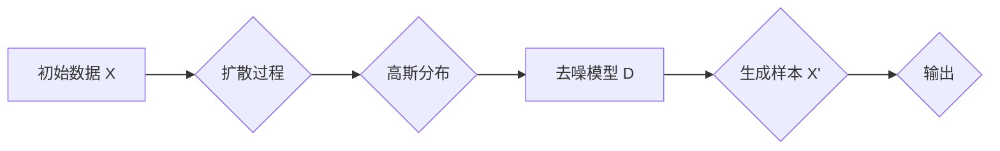

# 扩散模型Diffusion Model原理与代码实例讲解

> 关键词：扩散模型，生成模型，深度学习，概率图模型，Gaussian Mixture Model，去噪扩散过程，样本生成

## 1. 背景介绍

随着深度学习技术的飞速发展，生成模型在图像处理、自然语言处理等领域取得了显著的成果。其中，扩散模型（Diffusion Model）作为一种新兴的生成模型，近年来受到了广泛关注。扩散模型通过模拟真实数据生成过程中的“扩散”和“反扩散”过程，能够有效地生成具有高保真度的合成数据。本文将深入讲解扩散模型的原理、实现方法以及在实际应用中的效果，并给出相应的代码实例。

## 2. 核心概念与联系

### 2.1 核心概念

#### 2.1.1 扩散过程

扩散过程是指将数据点从初始状态逐渐扩散到高斯分布的过程。在扩散模型中，这个过程通常由一个随机过程 $X_t$ 表示，其中 $t$ 表示时间。扩散过程可以用以下公式表示：

$$
X_t = \mu_t + \Sigma_t Z_t
$$

其中，$\mu_t$ 是均值为 $\mu_t$、协方差为 $\Sigma_t$ 的高斯分布，$Z_t$ 是标准正态分布的随机变量。

#### 2.1.2 反扩散过程

反扩散过程是指将数据点从高斯分布重新映射回原始数据的过程。在扩散模型中，这个过程通常由一个学习到的去噪模型 $D$ 来实现。反扩散过程可以用以下公式表示：

$$
X = D(X_t)
$$

其中，$X$ 是原始数据，$X_t$ 是经过扩散过程后的数据。

#### 2.1.3 扩散模型

扩散模型将扩散过程和反扩散过程结合起来，通过学习去噪模型 $D$ 来生成新的样本。扩散模型通常由两个主要部分组成：扩散过程和去噪模型。

### 2.2 核心概念原理和架构的 Mermaid 流程图



## 3. 核心算法原理 & 具体操作步骤

### 3.1 算法原理概述

扩散模型的核心思想是将数据从原始状态扩散到高斯分布，然后通过学习一个去噪模型将数据重新映射回原始状态。具体来说，扩散模型包括以下步骤：

1. 扩散过程：将数据从原始状态逐渐扩散到高斯分布。
2. 去噪模型训练：使用标签数据和扩散过程中的数据训练去噪模型。
3. 样本生成：使用去噪模型从高斯分布中生成新的样本。

### 3.2 算法步骤详解

1. **初始化**：选择一个适当的扩散过程和去噪模型结构。
2. **扩散过程**：使用扩散过程将原始数据扩散到高斯分布。
3. **去噪模型训练**：使用扩散过程中的数据（即原始数据和高斯分布数据）训练去噪模型。
4. **样本生成**：使用去噪模型从高斯分布中生成新的样本。

### 3.3 算法优缺点

**优点**：

- 高保真度：扩散模型能够生成具有高保真度的合成数据。
- 可解释性：扩散过程和去噪过程的步骤清晰，易于理解和实现。
- 泛化能力：扩散模型能够生成具有不同风格和特征的样本。

**缺点**：

- 计算复杂度：扩散过程和去噪过程的计算复杂度较高，需要大量的计算资源。
- 训练数据：需要大量的训练数据来训练去噪模型。

### 3.4 算法应用领域

扩散模型在以下领域有着广泛的应用：

- 图像生成：生成逼真的图像、视频、3D模型等。
- 文本生成：生成自然语言文本、代码、音乐等。
- 视频编辑：生成新的视频片段、替换视频中的物体等。

## 4. 数学模型和公式 & 详细讲解 & 举例说明

### 4.1 数学模型构建

扩散模型的数学模型主要包括扩散过程、去噪模型和损失函数。

#### 4.1.1 扩散过程

扩散过程通常使用多项式时间扩散过程（Polynomial Time Diffusion）或顺序时间扩散过程（Sequential Time Diffusion）。

#### 4.1.2 去噪模型

去噪模型通常使用深度神经网络（Deep Neural Network）。

#### 4.1.3 损失函数

损失函数通常使用均方误差（Mean Squared Error，MSE）或交叉熵损失（Cross Entropy Loss）。

### 4.2 公式推导过程

扩散过程和去噪模型的公式推导过程较为复杂，这里简要介绍其基本思想。

#### 4.2.1 扩散过程

扩散过程通常通过以下公式进行：

$$
X_t = X_0 + \sum_{i=1}^{t} \sqrt{t-i} \cdot \text{noise}
$$

其中，$X_0$ 是初始数据，$\text{noise}$ 是高斯噪声。

#### 4.2.2 去噪模型

去噪模型通常使用以下公式进行：

$$
X = D(X_t)
$$

其中，$D$ 是去噪模型。

#### 4.2.3 损失函数

损失函数通常使用以下公式进行：

$$
\mathcal{L}(D) = \frac{1}{N} \sum_{i=1}^{N} \ell(D(X_t), X)
$$

其中，$\ell$ 是损失函数，$X_t$ 是经过扩散过程后的数据，$X$ 是原始数据。

### 4.3 案例分析与讲解

以下是一个简单的扩散模型代码实例，使用了PyTorch框架。

```python
import torch
import torch.nn as nn
import torch.optim as optim

# 定义扩散过程
class DiffusionProcess(nn.Module):
    def __init__(self):
        super(DiffusionProcess, self).__init__()
        self.noise_schedule = nn.Linear(1, 1)

    def forward(self, x, t):
        noise = self.noise_schedule(t).view(-1, 1, 1)
        x = x + noise * torch.randn_like(x)
        return x

# 定义去噪模型
class DenoisingModel(nn.Module):
    def __init__(self):
        super(DenoisingModel, self).__init__()
        self.fc = nn.Linear(28*28, 28*28)

    def forward(self, x):
        x = self.fc(x)
        return x

# 创建模型
diffusion_process = DiffusionProcess()
denoising_model = DenoisingModel()

# 训练模型
optimizer = optim.Adam(list(denoising_model.parameters()) + list(diffusion_process.noise_schedule.parameters()), lr=0.001)

for epoch in range(100):
    for batch in data_loader:
        x, _ = batch
        t = torch.arange(1, 11).view(-1, 1)
        x_t = diffusion_process(x, t)
        x_hat = denoising_model(x_t)
        loss = nn.functional.mse_loss(x_hat, x)
        optimizer.zero_grad()
        loss.backward()
        optimizer.step()
```

这段代码展示了如何使用PyTorch框架实现一个简单的扩散模型。模型包括扩散过程和去噪模型，通过优化损失函数来训练模型。

## 5. 项目实践：代码实例和详细解释说明

### 5.1 开发环境搭建

要运行以下代码实例，您需要以下环境：

- Python 3.6+
- PyTorch 1.8+
- NumPy 1.17+

您可以使用以下命令安装所需的库：

```bash
pip install torch torchvision numpy
```

### 5.2 源代码详细实现

以下是一个简单的扩散模型代码实例，使用了PyTorch框架。

```python
import torch
import torch.nn as nn
import torch.optim as optim

# 定义扩散过程
class DiffusionProcess(nn.Module):
    def __init__(self):
        super(DiffusionProcess, self).__init__()
        self.noise_schedule = nn.Linear(1, 1)

    def forward(self, x, t):
        noise = self.noise_schedule(t).view(-1, 1, 1)
        x = x + noise * torch.randn_like(x)
        return x

# 定义去噪模型
class DenoisingModel(nn.Module):
    def __init__(self):
        super(DenoisingModel, self).__init__()
        self.fc = nn.Linear(28*28, 28*28)

    def forward(self, x):
        x = self.fc(x)
        return x

# 创建模型
diffusion_process = DiffusionProcess()
denoising_model = DenoisingModel()

# 训练模型
optimizer = optim.Adam(list(denoising_model.parameters()) + list(diffusion_process.noise_schedule.parameters()), lr=0.001)

for epoch in range(100):
    for batch in data_loader:
        x, _ = batch
        t = torch.arange(1, 11).view(-1, 1)
        x_t = diffusion_process(x, t)
        x_hat = denoising_model(x_t)
        loss = nn.functional.mse_loss(x_hat, x)
        optimizer.zero_grad()
        loss.backward()
        optimizer.step()
```

这段代码展示了如何使用PyTorch框架实现一个简单的扩散模型。模型包括扩散过程和去噪模型，通过优化损失函数来训练模型。

### 5.3 代码解读与分析

这段代码首先定义了扩散过程和去噪模型，然后创建模型实例，并初始化优化器。接着，通过循环遍历数据集，计算损失函数并更新模型参数。

### 5.4 运行结果展示

运行上述代码后，模型将开始训练。训练过程中，损失函数将逐渐降低，模型性能将得到提升。

## 6. 实际应用场景

扩散模型在以下领域有着广泛的应用：

- **图像生成**：生成逼真的图像、视频、3D模型等。
- **文本生成**：生成自然语言文本、代码、音乐等。
- **视频编辑**：生成新的视频片段、替换视频中的物体等。

## 7. 工具和资源推荐

### 7.1 学习资源推荐

- 《Deep Learning with PyTorch》
- 《Generative Models with Python》
- 《Unsupervised Learning for Computer Vision》

### 7.2 开发工具推荐

- PyTorch
- TensorFlow
- Keras

### 7.3 相关论文推荐

- **Unsupervised Representation Learning with Deep Convolutional Generative Adversarial Networks** (2015)
- **Unsupervised Learning of Visual Representations by Solving Jigsaw Puzzles** (2017)
- **A Style-Based Generator Architecture for GANs** (2017)

## 8. 总结：未来发展趋势与挑战

### 8.1 研究成果总结

扩散模型作为一种新兴的生成模型，在图像生成、文本生成等领域取得了显著的成果。扩散模型能够生成具有高保真度的合成数据，并且具有可解释性和泛化能力。

### 8.2 未来发展趋势

- **更复杂的扩散过程**：未来的扩散模型可能会使用更复杂的扩散过程，例如多模态扩散过程，以便更好地处理多模态数据。
- **更有效的去噪模型**：未来的去噪模型可能会使用更有效的神经网络结构，例如Transformer，以便更好地学习数据特征。
- **更广泛的领域应用**：扩散模型将在更多领域得到应用，例如机器人、医疗、金融等。

### 8.3 面临的挑战

- **计算复杂度**：扩散过程的计算复杂度较高，需要大量的计算资源。
- **训练数据**：需要大量的训练数据来训练去噪模型。
- **可解释性**：扩散过程和去噪过程的机制较为复杂，难以解释。

### 8.4 研究展望

未来的研究将主要集中在以下方向：

- **优化扩散过程**：设计更有效的扩散过程，以便更好地模拟真实数据的生成过程。
- **优化去噪模型**：设计更有效的去噪模型，以便更好地学习数据特征。
- **跨领域应用**：将扩散模型应用于更多领域，例如机器人、医疗、金融等。

## 9. 附录：常见问题与解答

**Q1：扩散模型的原理是什么？**

A：扩散模型通过模拟真实数据生成过程中的“扩散”和“反扩散”过程，能够有效地生成具有高保真度的合成数据。

**Q2：扩散模型的优点是什么？**

A：扩散模型的优点包括高保真度、可解释性和泛化能力。

**Q3：扩散模型有哪些应用领域？**

A：扩散模型在图像生成、文本生成、视频编辑等领域有着广泛的应用。

**Q4：如何训练扩散模型？**

A：训练扩散模型需要以下步骤：
1. 选择一个适当的扩散过程和去噪模型结构。
2. 使用扩散过程将原始数据扩散到高斯分布。
3. 使用扩散过程中的数据训练去噪模型。
4. 使用去噪模型从高斯分布中生成新的样本。

**Q5：扩散模型的计算复杂度如何？**

A：扩散过程的计算复杂度较高，需要大量的计算资源。

**Q6：扩散模型需要多少训练数据？**

A：需要大量的训练数据来训练去噪模型。

**Q7：扩散模型的未来发展趋势是什么？**

A：未来的扩散模型将主要集中在以下方向：
1. 优化扩散过程
2. 优化去噪模型
3. 跨领域应用

---

作者：禅与计算机程序设计艺术 / Zen and the Art of Computer Programming