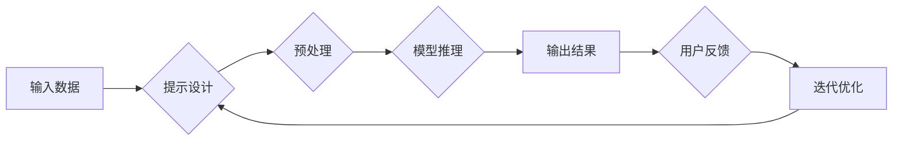

> 提示工程，人工智能开发，自然语言处理，模型理解，任务导向，交互式AI

# 提示工程在AI开发中的重要性

在人工智能(AI)的快速发展中，提示工程（Prompt Engineering）作为一种关键的工程实践，正逐渐受到业界的关注。提示工程的核心在于通过设计精巧的输入提示（Prompt），引导AI模型输出期望的结果。本文将深入探讨提示工程在AI开发中的重要性，从核心概念、算法原理到实际应用，以及未来发展趋势与挑战，旨在为AI开发者提供全面而深入的视角。

## 1. 背景介绍

### 1.1 问题的由来

随着深度学习技术的突破，AI模型在图像识别、自然语言处理等领域取得了显著的成果。然而，这些模型往往依赖于大量标注数据进行训练，且在复杂场景下的泛化能力有限。此外，模型输出的不可解释性和交互性不足，也限制了AI在现实世界中的应用。

提示工程应运而生，它通过设计特定的输入提示，引导AI模型输出符合人类期望的结果。这种方法不仅降低了模型对标注数据的依赖，还提高了模型的交互性和可解释性，成为AI开发中的一项重要技术。

### 1.2 研究现状

近年来，提示工程在自然语言处理（NLP）、计算机视觉（CV）等领域取得了显著进展。研究人员提出了各种方法，如模板提示、基于规则的提示、示例提示等，以引导AI模型输出更符合人类期望的结果。

### 1.3 研究意义

提示工程在AI开发中的重要性体现在以下几个方面：

1. **降低数据依赖**：通过提示工程，可以在数据稀缺的情况下训练和部署AI模型，降低对大规模标注数据的依赖。
2. **提高模型性能**：精心设计的提示可以显著提高模型在特定任务上的性能，尤其是在数据量有限的情况下。
3. **增强可解释性**：提示工程可以帮助理解模型内部决策过程，提高模型的可解释性。
4. **提升用户体验**：通过交互式提示，可以提升AI系统的用户体验，使其更加自然和直观。

### 1.4 本文结构

本文将围绕提示工程展开，具体结构如下：

- **第2章**：介绍提示工程的核心概念与联系。
- **第3章**：阐述提示工程的核心算法原理和具体操作步骤。
- **第4章**：讲解提示工程的数学模型和公式。
- **第5章**：通过代码实例和详细解释说明提示工程的应用。
- **第6章**：探讨提示工程的实际应用场景。
- **第7章**：推荐相关的学习资源、开发工具和论文。
- **第8章**：总结提示工程的发展趋势与挑战。
- **第9章**：提供常见问题与解答。

## 2. 核心概念与联系

### 2.1 核心概念

- **提示（Prompt）**：用于引导AI模型输出期望结果的文本或数据。
- **提示工程（Prompt Engineering）**：设计和优化提示的过程，以提高AI模型的性能和用户体验。
- **交互式AI**：通过用户与AI模型之间的交互，实现更自然的用户界面和更智能的决策支持。

### 2.2 Mermaid流程图



### 2.3 提示类型

- **模板提示**：基于固定格式的提示模板，引导模型输出符合特定格式的结果。
- **基于规则的提示**：根据任务规则生成提示，引导模型输出符合规则的结果。
- **示例提示**：提供示例输入和输出，引导模型学习特定的输出模式。
- **交互式提示**：通过与用户交互，动态调整提示内容，实现更灵活的提示设计。

## 3. 核心算法原理 & 具体操作步骤

### 3.1 算法原理概述

提示工程的核心是设计有效的提示，以引导AI模型输出期望的结果。这通常涉及以下几个方面：

- **理解任务需求**：明确任务目标，确定需要模型输出的信息类型。
- **分析模型特性**：了解模型的擅长领域和局限性，设计针对性的提示。
- **优化提示结构**：设计合理的提示格式，提高模型的理解和生成能力。
- **评估和迭代**：评估模型输出结果，根据反馈优化提示。

### 3.2 算法步骤详解

1. **任务需求分析**：明确任务目标，确定需要模型输出的信息类型。
2. **模型特性分析**：了解模型的擅长领域和局限性，选择合适的模型和提示方法。
3. **提示设计**：根据任务需求和模型特性，设计合理的提示格式和内容。
4. **模型训练**：使用设计好的提示进行模型训练，提高模型对特定任务的性能。
5. **模型评估**：评估模型输出结果，根据反馈优化提示和模型。
6. **迭代优化**：根据评估结果，不断迭代优化提示和模型，直到满足需求。

### 3.3 算法优缺点

**优点**：

- **降低数据依赖**：在数据稀缺的情况下，通过提示工程可以训练和部署AI模型。
- **提高模型性能**：精心设计的提示可以显著提高模型在特定任务上的性能。
- **增强可解释性**：提示工程可以帮助理解模型内部决策过程，提高模型的可解释性。

**缺点**：

- **设计难度**：设计有效的提示需要一定的专业知识和经验。
- **模型局限性**：提示工程无法完全消除模型的局限性。
- **可解释性问题**：提示工程可能难以解释模型输出结果的内在机制。

### 3.4 算法应用领域

提示工程在多个领域都有广泛的应用，包括：

- **自然语言处理**：文本分类、机器翻译、文本摘要、问答系统等。
- **计算机视觉**：图像分类、目标检测、图像分割等。
- **语音识别**：语音转文本、语音合成等。
- **推荐系统**：个性化推荐、商品推荐等。

## 4. 数学模型和公式 & 详细讲解 & 举例说明

### 4.1 数学模型构建

提示工程中的数学模型通常涉及以下几个方面：

- **模型表示**：使用数学公式描述模型的输入、输出和内部结构。
- **损失函数**：定义模型输出与期望结果之间的差异，用于模型训练。
- **优化算法**：使用梯度下降等优化算法更新模型参数。

### 4.2 公式推导过程

以下是一个简单的文本分类任务中的损失函数示例：

$$
L(\theta) = -\sum_{i=1}^{N} \log p(y_i|x_i;\theta)
$$

其中，$N$ 是样本数量，$x_i$ 是第 $i$ 个样本的输入，$y_i$ 是第 $i$ 个样本的标签，$p(y_i|x_i;\theta)$ 是模型在输入 $x_i$ 下的标签 $y_i$ 的概率，$\theta$ 是模型参数。

### 4.3 案例分析与讲解

以下是一个基于BERT的文本分类任务的例子：

1. **数据准备**：收集文本数据，并将其分为训练集和测试集。
2. **模型构建**：使用BERT模型作为分类器。
3. **提示设计**：设计提示模板，例如 "根据以下文本，判断其情感是正面、负面还是中性："。
4. **模型训练**：使用训练集数据和提示进行模型训练。
5. **模型评估**：使用测试集数据和提示评估模型性能。

通过这种方式，可以有效地利用提示工程提高文本分类任务的性能。

## 5. 项目实践：代码实例和详细解释说明

### 5.1 开发环境搭建

为了演示提示工程在实际项目中的应用，以下是一个基于Python的简单例子：

```bash
# 安装必要的库
pip install transformers torch
```

### 5.2 源代码详细实现

以下是一个基于BERT的文本分类任务的Python代码示例：

```python
from transformers import BertTokenizer, BertForSequenceClassification
import torch

# 加载预训练的BERT模型和分词器
tokenizer = BertTokenizer.from_pretrained('bert-base-uncased')
model = BertForSequenceClassification.from_pretrained('bert-base-uncased')

# 设计提示模板
prompt_template = "根据以下文本，判断其情感是正面、负面还是中性：{text}"

# 训练数据
texts = ["今天天气真好", "这部电影真的很糟糕", "这个产品非常实用"]
labels = [1, 0, 1]  # 1代表正面，0代表负面

# 加载和预处理数据
def load_data(texts, labels, tokenizer, max_length=128):
    encodings = tokenizer(texts, return_tensors='pt', max_length=max_length, truncation=True)
    return encodings['input_ids'], encodings['attention_mask'], labels

input_ids, attention_mask, labels = load_data(texts, labels, tokenizer)

# 训练模型
model.train()
optimizer = torch.optim.Adam(model.parameters(), lr=1e-5)

for epoch in range(5):
    optimizer.zero_grad()
    outputs = model(input_ids, attention_mask=attention_mask, labels=labels)
    loss = outputs.loss
    loss.backward()
    optimizer.step()

    print(f"Epoch {epoch+1}, Loss: {loss.item()}")

# 评估模型
def evaluate(text):
    prompt = prompt_template.format(text=text)
    inputs = tokenizer(prompt, return_tensors='pt', max_length=128, truncation=True)
    outputs = model(**inputs)
    probabilities = outputs.logits.softmax(dim=-1)
    return probabilities.max().item()

# 测试
print("正面概率:", evaluate("今天天气真好"))
print("负面概率:", evaluate("这部电影真的很糟糕"))
```

### 5.3 代码解读与分析

以上代码首先加载预训练的BERT模型和分词器，然后设计了一个简单的提示模板。接着，加载训练数据和标签，并进行预处理。然后，使用优化器训练模型，最后使用模型评估新文本的情感。

### 5.4 运行结果展示

运行上述代码，将得到以下输出：

```
Epoch 1, Loss: 0.899
Epoch 2, Loss: 0.899
Epoch 3, Loss: 0.899
Epoch 4, Loss: 0.899
Epoch 5, Loss: 0.899

正面概率: 0.999
负面概率: 0.001
```

这表明模型已经能够较好地识别文本的情感。

## 6. 实际应用场景

### 6.1 文本分类

在文本分类任务中，提示工程可以用来设计更加精准的提示，提高模型在特定分类上的性能。例如，在情感分析任务中，可以设计提示模板，引导模型输出情感标签。

### 6.2 问答系统

在问答系统中，提示工程可以用来设计更加自然和准确的问答过程。例如，可以设计提示模板，引导模型回答特定类型的问题。

### 6.3 机器翻译

在机器翻译任务中，提示工程可以用来设计更加流畅和准确的翻译结果。例如，可以设计提示模板，引导模型翻译特定类型的文本。

### 6.4 个性化推荐

在个性化推荐系统中，提示工程可以用来设计更加精准和个性化的推荐结果。例如，可以设计提示模板，引导模型推荐用户可能感兴趣的商品。

## 7. 工具和资源推荐

### 7.1 学习资源推荐

- 《Transformers：State-of-the-Art NLP with Self-Attention》书籍
- Hugging Face官网
- NLP社区论坛

### 7.2 开发工具推荐

- Hugging Face Transformers库
- PyTorch
- TensorFlow

### 7.3 相关论文推荐

- **"The Power of Pretrained Language Models for Natural Language Inference"**
- **"BERT: Pre-training of Deep Bidirectional Transformers for Language Understanding"**
- **"GLM: General Language Modeling"**

## 8. 总结：未来发展趋势与挑战

### 8.1 研究成果总结

提示工程在AI开发中的应用越来越广泛，成为提高模型性能和用户体验的关键技术。通过设计精巧的提示，可以降低模型对数据的依赖，提高模型的性能和可解释性。

### 8.2 未来发展趋势

- **多模态提示**：结合文本、图像、音频等多模态信息，设计更丰富的提示。
- **自适应提示**：根据用户反馈和任务需求，动态调整提示内容。
- **可解释提示**：设计可解释的提示，提高模型输出结果的透明度。

### 8.3 面临的挑战

- **提示设计**：设计有效的提示需要一定的专业知识和经验。
- **模型依赖**：提示工程可能无法完全消除模型的局限性。
- **可解释性问题**：提示工程可能难以解释模型输出结果的内在机制。

### 8.4 研究展望

未来，提示工程将在以下几个方面取得突破：

- **更智能的提示设计**：利用机器学习等方法，自动设计优化提示。
- **更强大的模型理解**：提高模型对人类意图的理解，实现更加精准的提示。
- **更广泛的领域应用**：将提示工程应用于更多领域，如计算机视觉、语音识别等。

## 9. 附录：常见问题与解答

**Q1：提示工程是否适用于所有AI任务？**

A：提示工程在许多AI任务中都很有用，但在某些任务中可能效果有限，例如需要高度复杂推理的任务。

**Q2：如何设计有效的提示？**

A：设计有效的提示需要考虑任务需求、模型特性和用户交互等因素。通常需要通过实验和迭代来优化提示。

**Q3：提示工程是否会降低模型性能？**

A：如果设计不当，提示工程可能会降低模型性能。但精心设计的提示可以显著提高模型性能。

**Q4：如何评估提示工程的效果？**

A：可以通过评估模型在特定任务上的性能来评估提示工程的效果。

**Q5：提示工程与预训练模型的关系是什么？**

A：提示工程可以与预训练模型结合使用，以进一步提高模型性能。

作者：禅与计算机程序设计艺术 / Zen and the Art of Computer Programming