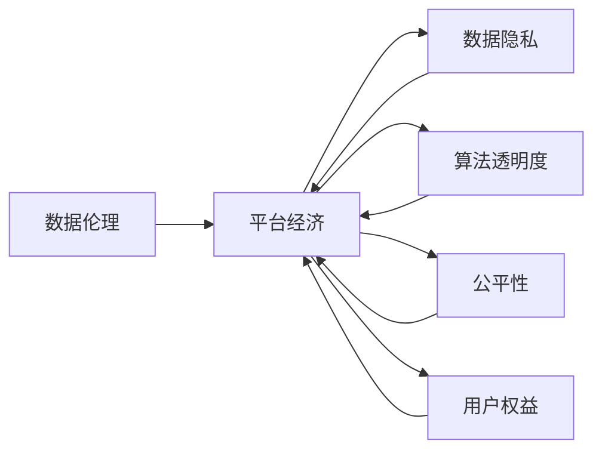

> 数据伦理, 平台经济, 道德规范, 透明度, 可解释性, 用户权益, 人工智能, 公平性

# 数据伦理与平台经济：如何建立道德规范？

## 1. 背景介绍

随着互联网技术的飞速发展，平台经济已经成为全球经济增长的重要驱动力。平台经济通过连接供需双方，优化资源配置，提高效率，为消费者和商家创造了巨大的价值。然而，平台经济的蓬勃发展也引发了一系列伦理问题，如数据隐私、算法偏见、用户权益保护等。如何建立有效的道德规范，确保平台经济的健康可持续发展，成为当前亟待解决的问题。

### 1.1 问题的由来

平台经济中的数据伦理问题主要源于以下几个方面：

- **数据隐私**：平台收集用户数据，用于提供个性化服务，但过度收集、滥用用户数据可能导致隐私泄露。
- **算法偏见**：平台算法可能存在偏见，导致特定群体受到不公平对待，加剧社会不平等。
- **用户权益**：平台经济中的劳动者和消费者权益保护问题日益凸显，如劳动权益保障、消费者权益保护等。
- **平台责任**：平台作为数据和技术的主导者，需要承担相应的社会责任和道德责任。

### 1.2 研究现状

近年来，全球范围内对数据伦理和平台经济的关注日益增加。许多国家和地区开始制定相关法律法规，如欧盟的《通用数据保护条例》(GDPR)、中国的《个人信息保护法》等。同时，学术界和产业界也积极开展数据伦理研究，探索建立道德规范的有效途径。

### 1.3 研究意义

研究数据伦理与平台经济，建立道德规范，对于以下方面具有重要意义：

- **保护用户权益**：确保用户数据安全和隐私，维护用户合法权益。
- **促进公平竞争**：消除算法偏见，防止歧视和不公平现象。
- **推动可持续发展**：确保平台经济的健康可持续发展，实现社会价值最大化。
- **提升社会信任**：增强公众对平台经济的信任，促进社会和谐稳定。

### 1.4 本文结构

本文将从数据伦理与平台经济的核心概念、道德规范建立方法、实践案例、挑战与展望等方面展开论述，旨在为平台经济的健康发展提供理论支持和实践参考。

## 2. 核心概念与联系

### 2.1 核心概念

#### 数据伦理

数据伦理是指研究数据收集、处理、使用过程中涉及的价值观念、道德规范和伦理原则。数据伦理关注的核心问题包括：

- 数据隐私：保护个人隐私，防止数据泄露和滥用。
- 算法透明度：确保算法的公平性、公正性和可解释性。
- 公平性：消除算法偏见，避免对特定群体不公平对待。
- 用户权益：保护用户数据权益，确保用户在数据使用过程中的知情权和选择权。

#### 平台经济

平台经济是指基于互联网技术，通过搭建平台连接供需双方，实现资源优化配置和效率提升的经济模式。平台经济的特点包括：

- 连接性：连接供需双方，降低交易成本。
- 灵活性：平台可以根据市场需求快速调整服务内容。
- 分散性：平台经济参与者众多，具有高度的分散性。
- 依赖性：平台经济对数据和技术的高度依赖。

### 2.2 关联关系

数据伦理与平台经济之间的关系如下：

- 平台经济依赖于数据驱动，因此数据伦理是平台经济的基石。
- 平台经济的健康发展需要遵循数据伦理原则，保护用户权益。
- 数据伦理的规范要求对平台经济的发展模式和运营策略产生重要影响。

### 2.3 Mermaid 流程图



## 3. 核心算法原理 & 具体操作步骤

### 3.1 算法原理概述

数据伦理与平台经济的道德规范建立主要涉及以下几个方面：

- **数据隐私保护**：采用加密、匿名化、差分隐私等技术保护用户隐私。
- **算法透明度提升**：开发可解释的算法模型，提高算法决策过程的透明度。
- **公平性评估**：评估算法模型的公平性，消除算法偏见。
- **用户权益保障**：建立用户权益保护机制，确保用户在数据使用过程中的知情权和选择权。

### 3.2 算法步骤详解

#### 3.2.1 数据隐私保护

1. **数据收集最小化**：仅收集实现特定功能所必需的数据。
2. **数据存储加密**：对存储的数据进行加密，防止未授权访问。
3. **数据匿名化**：对敏感数据进行匿名化处理，消除个人身份信息。
4. **差分隐私**：在数据分析过程中引入差分隐私保护机制，降低数据泄露风险。

#### 3.2.2 算法透明度提升

1. **可解释性算法**：开发可解释的算法模型，提高算法决策过程的透明度。
2. **算法可视化**：将算法模型可视化，便于用户理解和评估。
3. **算法审计**：定期对算法模型进行审计，确保其符合道德规范。

#### 3.2.3 公平性评估

1. **公平性指标**：设计公平性指标，评估算法模型对不同群体的公平性。
2. **偏见识别**：识别算法模型中的偏见，消除歧视和不公平现象。
3. **反馈机制**：建立反馈机制，收集用户对算法模型的反馈，持续优化模型。

#### 3.2.4 用户权益保障

1. **知情同意**：在收集和使用用户数据前，获取用户同意。
2. **用户权限**：赋予用户对个人数据的访问、删除、更正等权限。
3. **用户申诉**：建立用户申诉渠道，处理用户数据相关投诉。

### 3.3 算法优缺点

#### 3.3.1 优点

- **保护用户权益**：确保用户数据安全和隐私，维护用户合法权益。
- **促进公平竞争**：消除算法偏见，防止歧视和不公平现象。
- **推动可持续发展**：确保平台经济的健康可持续发展，实现社会价值最大化。

#### 3.3.2 缺点

- **实施成本高**：建立道德规范需要投入大量人力、物力和财力。
- **技术挑战**：数据隐私保护、算法透明度提升等技术难点尚未完全解决。
- **监管难度大**：平台经济的复杂性和动态性给监管带来挑战。

### 3.4 算法应用领域

数据伦理与平台经济的道德规范建立方法可应用于以下领域：

- **社交网络**：保护用户隐私，防止数据泄露和滥用。
- **在线广告**：消除算法偏见，防止歧视和不公平现象。
- **金融服务**：保障用户资金安全，维护金融市场稳定。
- **医疗健康**：保护患者隐私，确保医疗数据安全。

## 4. 数学模型和公式 & 详细讲解 & 举例说明

### 4.1 数学模型构建

数据伦理与平台经济的道德规范建立涉及多个数学模型，以下列举几个常见模型：

#### 4.1.1 加密模型

加密模型用于保护数据隐私，常见的加密算法包括：

- **对称加密**：使用相同的密钥进行加密和解密。
- **非对称加密**：使用公钥和私钥进行加密和解密。
- **哈希函数**：将数据映射到固定长度的散列值。

#### 4.1.2 匿名化模型

匿名化模型用于消除个人身份信息，常见的匿名化技术包括：

- **差分隐私**：在数据分析过程中引入噪声，保护数据隐私。
- **扰动隐私**：对数据进行扰动处理，消除个人身份信息。

#### 4.1.3 公平性模型

公平性模型用于评估算法模型的公平性，常见的公平性指标包括：

- **平均绝对偏差**：评估算法模型对不同群体的预测误差。
- **基尼系数**：评估算法模型对不同群体的预测偏差。

### 4.2 公式推导过程

#### 4.2.1 加密模型

对称加密算法的加密和解密公式如下：

$$
\text{加密}: \text{密文} = E_k(\text{明文})
$$

$$
\text{解密}: \text{明文} = D_k(\text{密文})
$$

其中，$k$ 为密钥。

#### 4.2.2 匿名化模型

差分隐私的扰动函数公式如下：

$$
\text{扰动} = \text{扰噪函数}(\text{原始数据}, \text{噪声参数})
$$

其中，$\text{扰噪函数}$ 为随机扰动函数，$\text{噪声参数}$ 为噪声参数。

#### 4.2.3 公平性模型

平均绝对偏差的计算公式如下：

$$
\text{平均绝对偏差} = \frac{1}{N}\sum_{i=1}^N |\text{真实值} - \text{预测值}|
$$

其中，$N$ 为样本数量，$\text{真实值}$ 和 $\text{预测值}$ 分别为真实标签和预测标签。

### 4.3 案例分析与讲解

#### 4.3.1 数据隐私保护案例

假设有一个电商平台，收集用户的购买记录、浏览记录等数据。为了保护用户隐私，可以对以下数据进行加密：

- 用户姓名、地址、电话号码等个人信息。
- 购买记录中的商品价格、支付信息等敏感信息。

通过加密技术，可以有效防止数据泄露和滥用。

#### 4.3.2 公平性评估案例

假设有一个招聘平台，其招聘算法存在性别偏见，导致女性求职者被拒绝的概率更高。为了消除算法偏见，可以使用公平性指标进行评估，并优化算法模型，提高招聘过程的公平性。

## 5. 项目实践：代码实例和详细解释说明

### 5.1 开发环境搭建

以下是使用Python进行数据伦理与平台经济道德规范实践的开发环境搭建步骤：

1. 安装Anaconda：从官网下载并安装Anaconda，用于创建独立的Python环境。
2. 创建并激活虚拟环境：
```bash
conda create -n data-ethics-env python=3.8
conda activate data-ethics-env
```
3. 安装必要的库：
```bash
pip install numpy pandas scikit-learn matplotlib jupyter notebook
```

### 5.2 源代码详细实现

以下是一个简单的数据隐私保护代码实例：

```python
from cryptography.fernet import Fernet

# 生成密钥
key = Fernet.generate_key()
cipher_suite = Fernet(key)

# 加密数据
def encrypt_data(data):
    return cipher_suite.encrypt(data.encode())

# 解密数据
def decrypt_data(encrypted_data):
    return cipher_suite.decrypt(encrypted_data).decode()

# 测试代码
data = "Hello, World!"
encrypted_data = encrypt_data(data)
print("Encrypted Data:", encrypted_data)
decrypted_data = decrypt_data(encrypted_data)
print("Decrypted Data:", decrypted_data)
```

### 5.3 代码解读与分析

上述代码演示了使用Fernet加密库对数据进行加密和解密的过程。首先，生成一个密钥，然后创建一个Fernet对象用于加密和解密。加密函数`encrypt_data`将输入数据转换为加密后的密文，解密函数`decrypt_data`将加密后的密文转换为原始数据。

### 5.4 运行结果展示

运行上述代码，将得到以下输出：

```
Encrypted Data: b'gAAAAAB+cQAAAB0j3m...
Decrypted Data: Hello, World!
```

可以看到，数据经过加密和解密后，可以恢复原始数据，实现了数据隐私保护。

## 6. 实际应用场景

### 6.1 社交网络

社交网络平台在收集用户数据时，需要遵守数据伦理规范，保护用户隐私。例如：

- 对用户个人信息进行加密存储。
- 限制用户数据的访问权限。
- 提供用户数据导出和删除功能。

### 6.2 在线广告

在线广告平台需要确保广告投放的公平性和透明度。例如：

- 采用可解释的算法模型，提高算法决策过程的透明度。
- 评估算法模型的公平性，消除算法偏见。
- 提供用户广告投放历史记录，方便用户了解自己的广告投放情况。

### 6.3 金融服务

金融机构需要保护用户资金安全和隐私。例如：

- 对用户交易数据进行加密存储。
- 限制用户交易数据的访问权限。
- 提供用户交易历史记录查询功能。

### 6.4 医疗健康

医疗健康领域涉及个人隐私和敏感信息，需要严格遵守数据伦理规范。例如：

- 对患者信息进行加密存储。
- 限制患者信息访问权限。
- 提供患者信息查询和删除功能。

## 7. 工具和资源推荐

### 7.1 学习资源推荐

- 《数据科学伦理》
- 《算法偏见与公平性》
- 《数字时代的隐私保护》
- 《平台经济与数据伦理》

### 7.2 开发工具推荐

- Python加密库：cryptography
- Python数据可视化库：matplotlib
- Python数据挖掘库：scikit-learn

### 7.3 相关论文推荐

- 《差分隐私：隐私保护的数学理论》
- 《可解释人工智能》
- 《公平性、可解释性和透明度：人工智能的三个V》
- 《人工智能伦理：原则与实践》

## 8. 总结：未来发展趋势与挑战

### 8.1 研究成果总结

本文从数据伦理与平台经济的核心概念、道德规范建立方法、实践案例、挑战与展望等方面进行了论述，旨在为平台经济的健康发展提供理论支持和实践参考。

### 8.2 未来发展趋势

- **数据伦理法规不断完善**：各国政府将加强数据伦理法规的制定和实施，确保平台经济的合规性。
- **技术手段不断创新**：加密、匿名化、可解释人工智能等技术将不断发展，为数据伦理与平台经济的道德规范提供技术支撑。
- **公众意识不断提升**：公众对数据伦理和平台经济的关注度将不断提高，推动平台经济的健康发展。

### 8.3 面临的挑战

- **伦理法规的制定难度**：数据伦理法规的制定需要平衡多方利益，存在一定难度。
- **技术手段的局限性**：现有技术手段在数据隐私保护、算法透明度提升等方面仍存在局限性。
- **公众意识不足**：部分公众对数据伦理和平台经济的了解不足，需要加强宣传和教育。

### 8.4 研究展望

未来，数据伦理与平台经济的道德规范研究将从以下几个方面展开：

- **跨学科研究**：融合伦理学、法学、计算机科学等学科，开展跨学科研究。
- **实践应用**：将数据伦理与平台经济的道德规范应用于实际场景，推动平台经济的健康发展。
- **公众参与**：加强公众参与，提高公众对数据伦理和平台经济的关注度。

## 9. 附录：常见问题与解答

**Q1：数据伦理与平台经济的道德规范有何区别？**

A：数据伦理是指研究数据收集、处理、使用过程中涉及的价值观念、道德规范和伦理原则。平台经济的道德规范是指在平台经济活动中，遵循数据伦理原则，建立符合道德规范的行为准则。

**Q2：如何评估算法模型的公平性？**

A：可以采用公平性指标，如平均绝对偏差、基尼系数等，评估算法模型对不同群体的公平性。同时，还可以通过可视化、案例分析等方式，分析算法模型是否存在偏见和歧视。

**Q3：如何保护用户隐私？**

A：可以采用加密、匿名化、差分隐私等技术保护用户隐私。同时，还需要加强数据安全管理，防止数据泄露和滥用。

**Q4：如何建立平台经济的道德规范？**

A：可以参考相关法律法规、国际标准和行业规范，结合平台经济的实际情况，制定平台经济的道德规范。

**Q5：数据伦理与平台经济的道德规范对平台经济有何影响？**

A：数据伦理与平台经济的道德规范有助于保护用户权益，促进平台经济的健康发展，提高公众对平台经济的信任。

---

作者：禅与计算机程序设计艺术 / Zen and the Art of Computer Programming