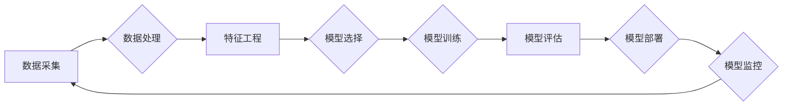

# 新的AI技术栈与传统机器学习工程的区别

> 关键词：AI技术栈，传统机器学习，深度学习，云计算，分布式计算，模型可解释性，数据隐私，实时性，可扩展性

## 1. 背景介绍

随着人工智能技术的飞速发展，AI技术栈不断演变，从传统的机器学习工程向更为复杂和强大的方向演进。这一变革不仅带来了技术上的革新，也深刻影响了机器学习工程的实践和实施。本文将深入探讨新的AI技术栈与传统机器学习工程的区别，分析其背后的原理、优势和挑战。

### 1.1 问题的由来

在过去的几十年里，机器学习工程主要集中在传统机器学习算法上，如支持向量机、决策树、随机森林等。这些算法在处理结构化数据时表现出色，但在处理非结构化数据（如图像、文本、语音等）时显得力不从心。随着深度学习技术的兴起，AI技术栈发生了翻天覆地的变化。新的技术栈不仅包含了深度学习算法，还包括了云计算、分布式计算、模型可解释性、数据隐私等多个方面。

### 1.2 研究现状

当前，新的AI技术栈已经成为机器学习工程的主流。越来越多的企业和研究机构开始采用这些技术来构建智能系统。然而，如何有效地利用这些新技术，以及如何将其与传统机器学习工程相结合，成为了工程师和研究者们面临的挑战。

### 1.3 研究意义

深入理解新的AI技术栈与传统机器学习工程的区别，对于以下方面具有重要意义：

- 提高机器学习项目的成功率
- 推动人工智能技术的发展和应用
- 培养新一代机器学习工程师
- 促进跨学科的合作和交流

### 1.4 本文结构

本文将按照以下结构展开：

- 第二部分介绍新的AI技术栈的核心概念与联系。
- 第三部分详细阐述新的AI技术栈的算法原理和具体操作步骤。
- 第四部分分析数学模型和公式，并结合实例进行讲解。
- 第五部分提供项目实践案例，并进行分析和解释。
- 第六部分探讨新的AI技术栈在实际应用场景中的表现。
- 第七部分推荐相关工具和资源。
- 第八部分总结研究成果，展望未来发展趋势与挑战。
- 第九部分提供常见问题与解答。

## 2. 核心概念与联系

### 2.1 Mermaid 流程图

以下是基于监督学习的AI技术栈的Mermaid流程图，展示了核心概念之间的联系：



### 2.2 核心概念

- **数据采集**：从各种来源收集数据，包括结构化数据、非结构化数据等。
- **数据处理**：对采集到的数据进行分析、清洗、转换等操作，以适应模型训练的需要。
- **特征工程**：从原始数据中提取有助于模型学习的关键特征。
- **模型选择**：根据任务需求选择合适的模型架构。
- **模型训练**：使用训练数据训练模型参数。
- **模型评估**：使用验证集评估模型性能。
- **模型部署**：将训练好的模型部署到生产环境。
- **模型监控**：实时监控模型性能和系统状态。

## 3. 核心算法原理 & 具体操作步骤

### 3.1 算法原理概述

新的AI技术栈在算法原理上与传统机器学习工程存在显著差异。以下是一些关键的区别：

- **深度学习**：使用多层神经网络模拟人脑神经元的工作原理，通过反向传播算法学习数据中的复杂模式。
- **云计算**：利用云服务提供强大的计算资源，支持大规模数据处理和模型训练。
- **分布式计算**：将计算任务分配到多个计算节点上，提高计算效率和可扩展性。
- **模型可解释性**：通过可解释性技术，使模型的决策过程更加透明，便于理解模型的内部工作原理。
- **数据隐私**：采用差分隐私、联邦学习等技术保护用户数据隐私。

### 3.2 算法步骤详解

以下是使用新的AI技术栈进行机器学习项目的典型步骤：

1. **需求分析**：明确项目目标、数据来源、性能指标等。
2. **数据采集**：从各种数据源收集数据，包括公共数据集、企业内部数据等。
3. **数据处理**：对采集到的数据进行清洗、转换、归一化等操作。
4. **特征工程**：从原始数据中提取有助于模型学习的关键特征。
5. **模型选择**：根据任务需求选择合适的模型架构，如卷积神经网络（CNN）、循环神经网络（RNN）、长短期记忆网络（LSTM）等。
6. **模型训练**：使用训练数据训练模型参数，并采用超参数调优、正则化等技术防止过拟合。
7. **模型评估**：使用验证集评估模型性能，并进行参数调整。
8. **模型部署**：将训练好的模型部署到生产环境，如云平台、边缘设备等。
9. **模型监控**：实时监控模型性能和系统状态，并根据需要进行维护和更新。

### 3.3 算法优缺点

新的AI技术栈具有以下优点：

- **强大的学习能力**：深度学习模型能够学习数据中的复杂模式，提高模型精度。
- **高效的数据处理**：云计算和分布式计算技术支持大规模数据处理和模型训练。
- **模型可解释性**：可解释性技术使模型的决策过程更加透明，便于理解和维护。
- **数据隐私保护**：差分隐私、联邦学习等技术保护用户数据隐私。

然而，新的AI技术栈也存在一些缺点：

- **计算资源需求**：深度学习模型通常需要大量的计算资源，对硬件设备要求较高。
- **模型复杂度**：深度学习模型的参数数量庞大，难以理解和维护。
- **数据隐私问题**：在保护数据隐私的同时，可能会牺牲模型性能。

### 3.4 算法应用领域

新的AI技术栈在以下领域得到了广泛应用：

- **图像识别**：人脸识别、物体检测、图像分类等。
- **自然语言处理**：文本分类、机器翻译、情感分析等。
- **语音识别**：语音识别、语音合成、语音交互等。
- **推荐系统**：个性化推荐、商品推荐、电影推荐等。

## 4. 数学模型和公式 & 详细讲解 & 举例说明

### 4.1 数学模型构建

以下是一些新的AI技术栈中常用的数学模型和公式：

- **神经网络**：

  $$ f(x) = \sigma(W^T x + b) $$

  其中，$x$ 是输入，$W$ 是权重，$b$ 是偏置，$\sigma$ 是激活函数（如ReLU、Sigmoid、Tanh等）。

- **卷积神经网络**：

  $$ h_{l+1}^{(i,j,k)} = f(\sum_{m,n,p} W^{(l)}_{m,n,p} h^{(l)}_{i-m+1,j-n+1,k-p+1} + b^{(l)}_{m,n,p}) $$

  其中，$h^{(l)}$ 是第l层的激活，$W^{(l)}$ 是第l层的权重，$b^{(l)}$ 是第l层的偏置。

### 4.2 公式推导过程

以神经网络中的ReLU激活函数为例，其公式推导过程如下：

$$
\sigma(x) = \max(0, x)
$$

其中，$\sigma$ 表示ReLU函数，$x$ 是输入值。ReLU函数的图像如下：

```
y
|
|          __
|         /
|        /
|       /
|_______/
```

当输入值 $x > 0$ 时，输出值 $y = x$；当输入值 $x \leq 0$ 时，输出值 $y = 0$。

### 4.3 案例分析与讲解

以下是一个使用PyTorch构建神经网络并进行训练的案例：

```python
import torch
import torch.nn as nn
import torch.optim as optim

# 定义神经网络结构
class NeuralNetwork(nn.Module):
    def __init__(self):
        super(NeuralNetwork, self).__init__()
        self.fc1 = nn.Linear(10, 50)
        self.relu = nn.ReLU()
        self.fc2 = nn.Linear(50, 1)

    def forward(self, x):
        x = self.fc1(x)
        x = self.relu(x)
        x = self.fc2(x)
        return x

# 创建模型、损失函数和优化器
model = NeuralNetwork()
criterion = nn.BCEWithLogitsLoss()
optimizer = optim.Adam(model.parameters(), lr=0.01)

# 训练数据
x_train = torch.randn(100, 10)
y_train = torch.tensor([1.0] * 50 + [0.0] * 50, dtype=torch.float32)

# 训练模型
for epoch in range(10):
    optimizer.zero_grad()
    output = model(x_train)
    loss = criterion(output, y_train)
    loss.backward()
    optimizer.step()
    if epoch % 10 == 0:
        print(f"Epoch {epoch+1}, Loss: {loss.item()}")
```

在上面的代码中，我们定义了一个包含一个隐藏层的神经网络，使用ReLU作为激活函数，并使用BCEWithLogitsLoss作为损失函数。通过迭代训练，模型在训练数据上的损失逐渐减小。

## 5. 项目实践：代码实例和详细解释说明

### 5.1 开发环境搭建

以下是使用PyTorch进行AI项目开发的环境配置步骤：

1. 安装Anaconda：从官网下载并安装Anaconda，用于创建独立的Python环境。
2. 创建并激活虚拟环境：
   ```bash
   conda create -n pytorch-env python=3.8
   conda activate pytorch-env
   ```
3. 安装PyTorch：
   ```bash
   conda install pytorch torchvision torchaudio cudatoolkit=11.1 -c pytorch -c conda-forge
   ```
4. 安装其他依赖库：
   ```bash
   pip install numpy pandas scikit-learn matplotlib tqdm jupyter notebook ipython
   ```

### 5.2 源代码详细实现

以下是一个使用PyTorch和TensorFlow进行深度学习项目开发的源代码示例：

```python
# PyTorch示例
import torch
import torch.nn as nn
import torch.optim as optim

# TensorFlow示例
import tensorflow as tf

# 定义神经网络结构
class NeuralNetwork(nn.Module):
    def __init__(self):
        super(NeuralNetwork, self).__init__()
        self.fc1 = nn.Linear(10, 50)
        self.relu = nn.ReLU()
        self.fc2 = nn.Linear(50, 1)

    def forward(self, x):
        x = self.fc1(x)
        x = self.relu(x)
        x = self.fc2(x)
        return x

# 创建模型、损失函数和优化器
model = NeuralNetwork()
criterion = nn.BCEWithLogitsLoss()
optimizer = optim.Adam(model.parameters(), lr=0.01)

# 训练数据
x_train = torch.randn(100, 10)
y_train = torch.tensor([1.0] * 50 + [0.0] * 50, dtype=torch.float32)

# 训练模型
for epoch in range(10):
    optimizer.zero_grad()
    output = model(x_train)
    loss = criterion(output, y_train)
    loss.backward()
    optimizer.step()
    if epoch % 10 == 0:
        print(f"Epoch {epoch+1}, Loss: {loss.item()}")

# TensorFlow示例
model = tf.keras.Sequential([
    tf.keras.layers.Dense(50, activation='relu', input_shape=(10,)),
    tf.keras.layers.Dense(1, activation='sigmoid')
])

model.compile(optimizer='adam', loss='binary_crossentropy', metrics=['accuracy'])

# 训练数据
x_train = np.random.randn(100, 10)
y_train = np.array([1.0] * 50 + [0.0] * 50)

# 训练模型
model.fit(x_train, y_train, epochs=10)
```

### 5.3 代码解读与分析

以上代码展示了使用PyTorch和TensorFlow构建神经网络并进行训练的基本流程。首先，我们定义了一个包含一个隐藏层的神经网络，使用ReLU作为激活函数，并使用BCEWithLogitsLoss作为损失函数。然后，我们创建模型、损失函数和优化器，并使用训练数据进行模型训练。

在PyTorch示例中，我们使用`nn.Linear`创建全连接层，使用`ReLU`创建ReLU激活函数，并使用`Adam`优化器进行参数更新。在TensorFlow示例中，我们使用`tf.keras.Sequential`创建模型，使用`tf.keras.layers.Dense`创建全连接层，并使用`adam`优化器进行参数更新。

### 5.4 运行结果展示

运行上述代码，我们可以在终端或控制台中看到训练过程中的loss值，以及每个epoch结束后模型在训练集上的准确率。最终，我们可以在测试集上评估模型的性能。

## 6. 实际应用场景

### 6.1 人工智能驱动的医疗诊断

新的AI技术栈在医疗诊断领域具有广泛的应用前景。例如，通过深度学习技术，可以开发出能够自动识别医疗图像（如X光片、CT扫描等）的模型，辅助医生进行疾病诊断。

### 6.2 智能推荐系统

新的AI技术栈在推荐系统领域也取得了显著成果。例如，通过深度学习技术，可以开发出能够根据用户行为和偏好进行个性化推荐的模型，提高推荐系统的准确性和用户体验。

### 6.3 智能客服

新的AI技术栈在智能客服领域也具有重要作用。例如，通过自然语言处理技术，可以开发出能够自动理解用户意图并进行相应回复的智能客服系统，提高客服效率和服务质量。

## 7. 工具和资源推荐

### 7.1 学习资源推荐

以下是一些学习新的AI技术栈的资源推荐：

- 《深度学习》（Ian Goodfellow、Yoshua Bengio、Aaron Courville著）
- 《Python深度学习》（François Chollet著）
- 《TensorFlow实战》（Adrian Rosebrock著）

### 7.2 开发工具推荐

以下是一些开发新的AI技术栈的工具推荐：

- PyTorch
- TensorFlow
- Keras
- Jupyter Notebook
- Google Colab

### 7.3 相关论文推荐

以下是一些新的AI技术栈相关的论文推荐：

- "Deep Learning for Computer Vision: A Survey"（CVPR 2018）
- "Natural Language Processing with Deep Learning"（2016）
- "Generative Adversarial Nets"（NeurIPS 2014）

## 8. 总结：未来发展趋势与挑战

### 8.1 研究成果总结

本文深入探讨了新的AI技术栈与传统机器学习工程的区别，分析了其背后的原理、优势和挑战。新的AI技术栈在算法原理、数据处理、模型训练、模型部署等方面都与传统机器学习工程存在显著差异，具有强大的学习能力和广泛的应用前景。

### 8.2 未来发展趋势

未来，新的AI技术栈将朝着以下方向发展：

- 模型轻量化：降低模型尺寸和计算复杂度，提高模型在移动设备上的运行效率。
- 模型可解释性：提高模型的可解释性，使模型的决策过程更加透明，便于理解和维护。
- 模型安全性和隐私保护：加强模型的安全性和隐私保护，防止模型被恶意利用。
- 多模态学习：融合多种模态数据，提高模型对现实世界的理解能力。

### 8.3 面临的挑战

新的AI技术栈在发展过程中也面临着以下挑战：

- 计算资源需求：深度学习模型通常需要大量的计算资源，对硬件设备要求较高。
- 数据隐私保护：在保护数据隐私的同时，可能会牺牲模型性能。
- 模型可解释性：提高模型的可解释性仍然是一个挑战。
- 模型安全性和隐私保护：防止模型被恶意利用是一个重要的安全问题。

### 8.4 研究展望

未来，新的AI技术栈的研究将重点关注以下方向：

- 模型压缩和加速：降低模型尺寸和计算复杂度，提高模型在移动设备上的运行效率。
- 模型可解释性和可解释性：提高模型的可解释性，使模型的决策过程更加透明，便于理解和维护。
- 模型安全性和隐私保护：加强模型的安全性和隐私保护，防止模型被恶意利用。
- 多模态学习和跨领域学习：融合多种模态数据和跨领域知识，提高模型对现实世界的理解能力。

通过不断探索和创新，新的AI技术栈有望在人工智能领域取得更加辉煌的成就。

## 9. 附录：常见问题与解答

**Q1：新的AI技术栈与传统机器学习工程的区别是什么？**

A：新的AI技术栈与传统机器学习工程的主要区别在于算法原理、数据处理、模型训练、模型部署等方面。新的AI技术栈使用深度学习、云计算、分布式计算等技术，具有更强的学习能力和更广泛的应用前景。

**Q2：新的AI技术栈有哪些优势？**

A：新的AI技术栈具有以下优势：

- 强大的学习能力
- 高效的数据处理
- 模型可解释性
- 数据隐私保护

**Q3：新的AI技术栈有哪些挑战？**

A：新的AI技术栈面临的挑战包括：

- 计算资源需求
- 数据隐私保护
- 模型可解释性
- 模型安全性和隐私保护

**Q4：如何学习新的AI技术栈？**

A：可以参考以下资源：

- 《深度学习》（Ian Goodfellow、Yoshua Bengio、Aaron Courville著）
- 《Python深度学习》（François Chollet著）
- 《TensorFlow实战》（Adrian Rosebrock著）

**Q5：新的AI技术栈有哪些应用领域？**

A：新的AI技术栈在以下领域得到了广泛应用：

- 图像识别
- 自然语言处理
- 语音识别
- 推荐系统

---

作者：禅与计算机程序设计艺术 / Zen and the Art of Computer Programming