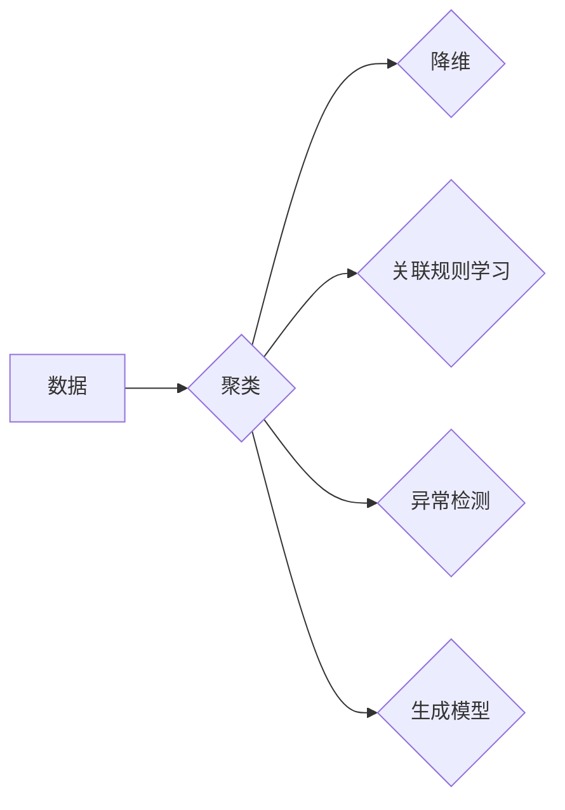

# 无监督学习 原理与代码实例讲解

> 关键词：无监督学习，聚类，降维，关联规则学习，生成模型，深度学习，K-Means，PCA，Autoencoder，Apriori

## 1. 背景介绍

无监督学习（Unsupervised Learning）是机器学习领域中一个重要的分支，它旨在从未标记的数据集中发现数据内在的结构和模式。与监督学习不同，无监督学习不依赖于预先标记的训练数据。这种学习方式在处理大量无标签数据时非常有用，尤其是在数据标注困难或成本高昂的情况下。

### 1.1 问题的由来

随着互联网和物联网技术的飞速发展，我们每天产生的数据量呈指数级增长。这些数据中包含着丰富的模式和知识，但大部分数据都是无标签的。无监督学习为这些无标签数据的分析和利用提供了可能。

### 1.2 研究现状

无监督学习涵盖了多种方法，包括聚类、降维、关联规则学习、异常检测和生成模型等。近年来，随着深度学习技术的发展，无监督学习领域也取得了显著的进展，如自编码器、变分自编码器（VAEs）和生成对抗网络（GANs）等。

### 1.3 研究意义

无监督学习在以下方面具有重要意义：

- **数据探索**：通过无监督学习可以探索数据中的潜在结构，帮助研究人员发现数据中的未知模式。
- **特征提取**：无监督学习可以用于提取数据中的特征，这些特征可以作为后续分析或监督学习的输入。
- **数据压缩**：无监督学习可以用于数据压缩，减少数据存储和传输的开销。
- **模式识别**：无监督学习可以帮助识别数据中的异常或稀有模式。

### 1.4 本文结构

本文将分为以下章节：

- **第2章**：介绍无监督学习的核心概念与联系。
- **第3章**：讲解无监督学习的核心算法原理与具体操作步骤。
- **第4章**：详细讲解数学模型和公式，并结合案例进行分析。
- **第5章**：提供代码实例和详细解释。
- **第6章**：探讨无监督学习的实际应用场景。
- **第7章**：推荐学习资源和开发工具。
- **第8章**：总结无监督学习的未来发展趋势与挑战。
- **第9章**：提供常见问题与解答。

## 2. 核心概念与联系

### 2.1 核心概念

- **聚类（Clustering）**：将相似的数据点归为一类，通常用于数据探索和模式识别。
- **降维（Dimensionality Reduction）**：降低数据维度，减少数据的复杂性和计算成本。
- **关联规则学习（Association Rule Learning）**：发现数据项之间的关联性。
- **异常检测（Anomaly Detection）**：识别数据中的异常或离群点。
- **生成模型（Generative Models）**：学习数据的分布，并生成新的数据样本。

### 2.2 Mermaid 流程图



## 3. 核心算法原理 & 具体操作步骤

### 3.1 算法原理概述

无监督学习的算法原理多种多样，以下是一些常见算法的概述：

- **K-Means**：一种基于距离的聚类算法，将数据点划分到最近的聚类中心。
- **PCA（主成分分析）**：一种降维技术，通过线性变换将数据投影到低维空间。
- **Apriori**：一种关联规则学习算法，用于发现数据项之间的频繁项集。
- **Autoencoder**：一种生成模型，用于学习数据的分布并生成新的数据样本。

### 3.2 算法步骤详解

#### 3.2.1 K-Means 算法

1. 随机选择K个数据点作为初始聚类中心。
2. 将每个数据点分配到距离最近的聚类中心。
3. 计算每个聚类的中心（均值）。
4. 重复步骤2和3，直到聚类中心不再变化。

#### 3.2.2 PCA 算法

1. 计算数据协方差矩阵。
2. 计算协方差矩阵的特征值和特征向量。
3. 选择最大的K个特征向量作为新的特征空间。
4. 将数据投影到新的特征空间。

#### 3.2.3 Apriori 算法

1. 从单项集开始，寻找频繁项集。
2. 逐步合并频繁项集，形成更大项集，并检查它们是否频繁。
3. 生成关联规则。

#### 3.2.4 Autoencoder 算法

1. 设计一个编码器，将输入数据映射到一个低维空间。
2. 设计一个解码器，将低维空间的数据映射回原始空间。
3. 使用重建误差来优化编码器和解码器的参数。

### 3.3 算法优缺点

#### K-Means

- **优点**：简单易实现，运行速度快。
- **缺点**：对初始聚类中心敏感，可能陷入局部最优。

#### PCA

- **优点**：可以显著降低数据维度。
- **缺点**：可能丢失一些重要信息。

#### Apriori

- **优点**：可以找到数据项之间的频繁关联。
- **缺点**：对于大数据集效率较低。

#### Autoencoder

- **优点**：可以学习数据的分布。
- **缺点**：需要大量数据来学习良好的分布。

### 3.4 算法应用领域

- **K-Means**：图像分割、文本聚类、社交网络分析。
- **PCA**：图像压缩、数据可视化。
- **Apriori**：市场篮分析、推荐系统。
- **Autoencoder**：图像生成、异常检测。

## 4. 数学模型和公式 & 详细讲解 & 举例说明

### 4.1 数学模型构建

#### 4.1.1 K-Means

假设有K个聚类中心 $C_k$，每个数据点 $x$ 到聚类中心 $C_k$ 的距离为 $d(x, C_k)$，则 $x$ 被分配到最近的聚类中心 $C_k$。

#### 4.1.2 PCA

假设数据集 $X \in \mathbb{R}^{m \times n}$，协方差矩阵为 $C = \frac{1}{m-1}XX^T$，特征值分解为 $C = U\Sigma V^T$，其中 $U$ 是特征向量矩阵，$\Sigma$ 是特征值矩阵，$V$ 是特征向量矩阵的转置。

#### 4.1.3 Apriori

假设项集 $X = \{x_1, x_2, ..., x_m\}$，项集 $X$ 的支持度定义为 $sup(X) = \frac{count(X)}{total \ transactions}$。

#### 4.1.4 Autoencoder

假设编码器 $E$ 和解码器 $D$，编码器输出 $z = E(x)$，解码器输出 $x' = D(z)$，重建误差为 $L(x, x')$。

### 4.2 公式推导过程

#### 4.2.1 K-Means

K-Means算法不涉及复杂的数学推导，主要是迭代过程。

#### 4.2.2 PCA

PCA的推导过程涉及特征值和特征向量的计算。

#### 4.2.3 Apriori

Apriori的推导过程基于支持度的计算。

#### 4.2.4 Autoencoder

Autoencoder的推导过程涉及最小化重建误差。

### 4.3 案例分析与讲解

#### 4.3.1 K-Means

假设有一个二维数据集，包含100个点，需要将其划分为3个聚类。

#### 4.3.2 PCA

假设有一个包含1000个样本，每个样本有10个特征的二维数据集，需要将其降维到2个特征。

#### 4.3.3 Apriori

假设有一个包含100个交易，每个交易包含10个商品的数据集，需要找出频繁项集。

#### 4.3.4 Autoencoder

假设有一个包含100个样本，每个样本有10个特征的二维数据集，需要学习数据的分布并生成新的数据样本。

## 5. 项目实践：代码实例和详细解释说明

### 5.1 开发环境搭建

使用Python编程语言和常见的机器学习库（如scikit-learn、TensorFlow、PyTorch等）进行无监督学习的项目实践。

### 5.2 源代码详细实现

以下是一个使用scikit-learn库实现K-Means聚类的示例代码：

```python
from sklearn.cluster import KMeans
import numpy as np

# 假设数据集X是一个100x2的NumPy数组
X = np.random.rand(100, 2)

# 初始化KMeans对象
kmeans = KMeans(n_clusters=3, random_state=0).fit(X)

# 获取聚类标签
labels = kmeans.labels_

# 获取聚类中心
centroids = kmeans.cluster_centers_
```

### 5.3 代码解读与分析

上述代码首先导入了必要的库，然后创建了一个100x2的随机二维数据集。接着，初始化了一个KMeans对象，并使用该对象对数据集进行聚类。最后，获取了聚类标签和聚类中心。

### 5.4 运行结果展示

运行上述代码后，将得到聚类标签和聚类中心，可以进一步分析聚类的效果。

## 6. 实际应用场景

无监督学习在许多实际应用场景中都有广泛的应用，以下是一些例子：

- **市场细分**：通过分析客户购买行为，将客户划分为不同的市场细分。
- **图像分割**：将图像中的物体分割成不同的区域。
- **社交网络分析**：分析社交网络中用户之间的关系。
- **异常检测**：检测数据中的异常或离群点。

## 7. 工具和资源推荐

### 7.1 学习资源推荐

- **书籍**：
  - "Pattern Recognition and Machine Learning" by Christopher M. Bishop
  - "Unsupervised Learning" by Alpaydın and Malekian
- **在线课程**：
  - Coursera上的"Machine Learning"课程
  - edX上的"Practical Reinforcement Learning for Beginners"课程

### 7.2 开发工具推荐

- **Python库**：
  - scikit-learn
  - TensorFlow
  - PyTorch
- **在线平台**：
  - Kaggle
  - Google Colab

### 7.3 相关论文推荐

- "K-Means clustering" by MacQueen
- "Principal Component Analysis" by Hotelling
- "Association rule learning" by Agrawal et al.
- "Autoencoders" by Vincent et al.

## 8. 总结：未来发展趋势与挑战

### 8.1 研究成果总结

无监督学习在过去几十年中取得了显著的发展，为数据分析和模式识别提供了强大的工具。随着深度学习技术的进步，无监督学习在图像识别、自然语言处理等领域取得了突破性进展。

### 8.2 未来发展趋势

- **深度学习与无监督学习融合**：将深度学习技术与无监督学习相结合，提高模型的性能和鲁棒性。
- **无监督学习的可解释性**：提高无监督学习算法的可解释性，使其更加透明和可信。
- **多模态无监督学习**：将无监督学习扩展到多模态数据，如文本、图像和视频。

### 8.3 面临的挑战

- **可解释性**：无监督学习模型的决策过程往往不可解释，难以理解模型的内部工作机制。
- **计算复杂性**：随着数据规模的扩大，无监督学习算法的计算复杂性也随之增加。
- **数据隐私**：在处理敏感数据时，如何保护数据隐私是一个重要的挑战。

### 8.4 研究展望

无监督学习在未来将继续发展，为数据分析和模式识别提供更强大的工具。随着技术的进步，无监督学习将在更多领域得到应用，并推动人工智能技术的发展。

## 9. 附录：常见问题与解答

**Q1：无监督学习是否适用于所有数据类型？**

A：无监督学习适用于各种类型的数据，包括数值数据、文本数据、图像数据和音频数据等。

**Q2：无监督学习与监督学习的区别是什么？**

A：无监督学习不依赖于预先标记的训练数据，而监督学习需要大量的标记数据。

**Q3：无监督学习有哪些常见的应用场景？**

A：无监督学习的应用场景包括市场细分、图像分割、社交网络分析和异常检测等。

**Q4：如何选择合适的无监督学习算法？**

A：选择合适的无监督学习算法取决于具体的应用场景和数据类型。

**Q5：无监督学习模型的可解释性如何提高？**

A：提高无监督学习模型的可解释性是一个挑战，但可以通过可视化、特征重要性分析等方法来提高。

作者：禅与计算机程序设计艺术 / Zen and the Art of Computer Programming