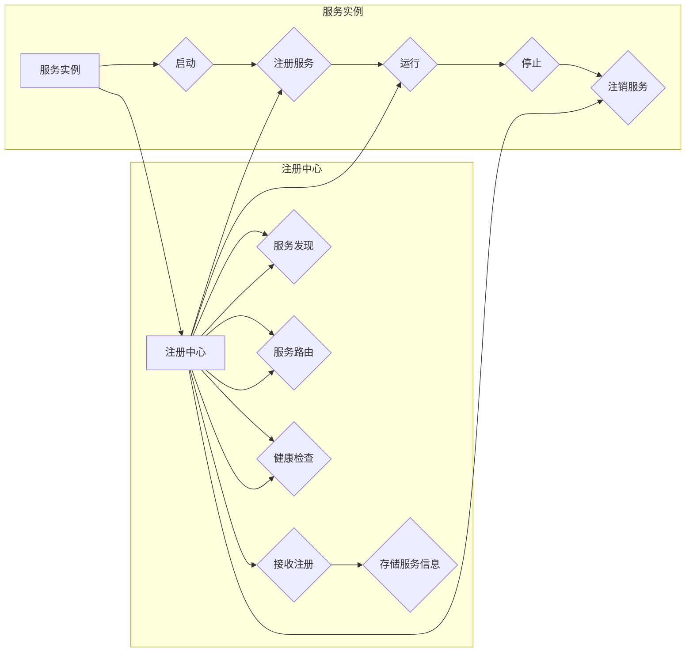

# 服务注册中心的设计与实现

> 关键词：服务注册中心，服务发现，服务治理，微服务架构，API网关，分布式系统

## 1. 背景介绍

随着云计算和微服务架构的兴起，企业级应用逐渐向分布式、服务化的方向发展。在这种架构下，服务注册中心（Service Registry）扮演着至关重要的角色。它负责服务的注册、发现、路由和监控，是确保微服务系统稳定、高效运行的核心组件。

### 1.1 问题的由来

在传统的单体架构中，应用程序通常是一个单一的、自包含的实体，所有功能都在一个进程中执行。这种架构简单易懂，易于开发和维护。然而，随着业务规模的扩大，单体架构逐渐暴露出以下问题：

- **可扩展性差**：单体架构难以适应业务量的快速增长，扩展性能有限。
- **维护成本高**：随着系统功能的增加，单体架构的复杂度不断上升，维护成本也随之增加。
- **部署困难**：单体架构通常需要整体部署，部署周期长，风险大。

为了解决上述问题，企业级应用开始向微服务架构转型。微服务架构将应用程序拆分成多个独立的服务，每个服务负责特定的业务功能，服务之间通过轻量级协议进行通信。这种架构具有以下优势：

- **可扩展性**：通过水平扩展服务实例，可以轻松应对业务量的增长。
- **可维护性**：服务之间独立部署，降低了系统复杂度，便于开发和维护。
- **可重用性**：服务可以独立开发、部署和升级，提高了代码的可重用性。

然而，微服务架构也带来了新的挑战，其中之一就是服务的注册和发现。随着服务数量的增加，如何高效地进行服务注册、发现和路由，成为构建微服务系统的重要问题。

### 1.2 研究现状

为了解决微服务架构中的服务注册和发现问题，业界涌现了多种服务注册中心解决方案，如Consul、Eureka、Zookeeper等。这些服务注册中心通常具备以下功能：

- **服务注册**：服务实例启动时，向注册中心注册自身信息，如服务名称、IP地址、端口、元数据等。
- **服务发现**：客户端通过注册中心获取服务列表，根据路由策略选择合适的服务实例进行调用。
- **服务健康检查**：注册中心定期对服务实例进行健康检查，确保服务的可用性。
- **服务路由**：根据路由策略，将客户端请求转发到合适的服务实例。

### 1.3 研究意义

研究服务注册中心的设计与实现，对于构建稳定、高效、可扩展的微服务系统具有重要意义：

- **提高系统可用性**：服务注册中心可以快速发现并选择健康的服务实例，提高系统的可用性。
- **提高系统可扩展性**：服务注册中心可以动态地发现新服务，并自动分配服务实例，提高系统的可扩展性。
- **提高系统可维护性**：服务注册中心可以方便地管理服务实例，降低系统的维护成本。

## 2. 核心概念与联系

为了更好地理解服务注册中心的设计与实现，本节将介绍几个核心概念，并给出其之间的Mermaid流程图。

### 2.1 核心概念

- **服务实例**：运行在服务器上的单个服务实例。
- **服务元数据**：描述服务实例信息的属性，如服务名称、IP地址、端口、健康状态等。
- **服务注册**：服务实例向注册中心注册自身信息的过程。
- **服务发现**：客户端从注册中心获取服务列表的过程。
- **服务路由**：根据路由策略，将客户端请求转发到合适的服务实例的过程。
- **服务健康检查**：注册中心定期对服务实例进行健康检查的过程。

### 2.2 Mermaid流程图



从流程图中可以看出，服务实例启动后，首先向注册中心注册自身信息，然后开始运行。注册中心负责存储服务信息，并对外提供服务发现、服务路由和健康检查等服务。客户端通过服务发现获取服务列表，并根据服务路由策略选择合适的服务实例进行调用。

## 3. 核心算法原理 & 具体操作步骤

### 3.1 算法原理概述

服务注册中心的设计与实现主要涉及以下算法原理：

- **服务注册**：服务实例启动时，通过HTTP/HTTPS请求向注册中心发送注册信息。
- **服务发现**：客户端通过HTTP/HTTPS请求从注册中心获取服务列表。
- **服务路由**：根据客户端的请求和路由策略，将请求转发到合适的服务实例。
- **服务健康检查**：注册中心通过HTTP/HTTPS请求定期对服务实例进行健康检查。

### 3.2 算法步骤详解

#### 3.2.1 服务注册

1. 服务实例启动后，向注册中心发送HTTP/HTTPS请求，包含服务名称、IP地址、端口、元数据等信息。
2. 注册中心接收请求，验证服务信息，并将服务信息存储在本地数据库或缓存中。

#### 3.2.2 服务发现

1. 客户端通过HTTP/HTTPS请求从注册中心获取服务列表。
2. 注册中心返回包含服务名称、IP地址、端口、元数据等信息的服务列表。

#### 3.2.3 服务路由

1. 根据客户端请求和路由策略，选择合适的服务实例。
2. 将客户端请求转发到选择的服务实例。

#### 3.2.4 服务健康检查

1. 注册中心定期通过HTTP/HTTPS请求对服务实例进行健康检查。
2. 服务实例返回健康状态信息。
3. 注册中心根据健康状态信息更新服务列表。

### 3.3 算法优缺点

#### 3.3.1 优点

- **高可用性**：服务注册中心通常采用高可用架构，确保服务的稳定运行。
- **可扩展性**：服务注册中心可以水平扩展，提高系统性能。
- **灵活的路由策略**：支持多种路由策略，满足不同场景的需求。

#### 3.3.2 缺点

- **单点故障**：服务注册中心作为系统的核心组件，存在单点故障的风险。
- **性能瓶颈**：随着服务数量的增加，服务注册中心可能会出现性能瓶颈。
- **配置复杂**：服务注册中心配置较为复杂，需要一定的学习成本。

### 3.4 算法应用领域

服务注册中心在以下领域得到广泛应用：

- **微服务架构**：微服务架构的核心组件，负责服务注册、发现、路由和监控。
- **分布式系统**：分布式系统中，服务注册中心用于管理服务实例，提高系统可用性和可扩展性。
- **云计算平台**：云计算平台中，服务注册中心用于管理云资源，提高资源利用率。

## 4. 数学模型和公式 & 详细讲解 & 举例说明

### 4.1 数学模型构建

服务注册中心的设计与实现主要涉及以下数学模型：

- **服务元数据模型**：描述服务实例信息的属性，如服务名称、IP地址、端口、健康状态等。
- **服务路由模型**：根据客户端请求和路由策略，选择合适的服务实例。

### 4.2 公式推导过程

服务注册中心的主要功能是服务注册、发现、路由和健康检查。以下以服务路由模型为例，介绍其公式推导过程。

#### 4.2.1 服务路由模型

服务路由模型可以表示为：

$$
R(x, y) = f(x, P)
$$

其中：

- $R(x, y)$ 表示根据请求 $x$ 和路由策略 $P$ 选择的服务实例 $y$。
- $f$ 表示路由函数。

#### 4.2.2 路由函数

路由函数 $f$ 可以表示为：

$$
f(x, P) = \arg\max_{y \in S} \sigma(w \cdot h(x, y))
$$

其中：

- $x$ 表示客户端请求。
- $y$ 表示服务实例。
- $S$ 表示所有可用的服务实例集合。
- $\sigma$ 表示激活函数，常用的有Sigmoid、ReLU等。
- $w$ 表示权重向量。
- $h(x, y)$ 表示特征向量，用于表示请求 $x$ 和服务实例 $y$。

### 4.3 案例分析与讲解

以下以Consul服务注册中心为例，介绍其实现原理。

Consul是一个高可用的服务注册中心，支持服务注册、发现、路由和健康检查等功能。Consul使用Raft算法保证集群状态的一致性，使用HTTP/HTTPS协议进行通信。

#### 4.3.1 服务注册

Consul服务实例启动后，通过HTTP/HTTPS请求向Consul服务器发送注册信息，包括服务名称、IP地址、端口、元数据等。

#### 4.3.2 服务发现

Consul客户端通过HTTP/HTTPS请求从Consul服务器获取服务列表，包括服务名称、IP地址、端口、元数据等信息。

#### 4.3.3 服务路由

Consul支持多种路由策略，如轮询、随机、最少连接等。客户端可以根据路由策略选择合适的服务实例进行调用。

#### 4.3.4 服务健康检查

Consul定期通过HTTP/HTTPS请求对服务实例进行健康检查，如果服务实例不健康，则将其从服务列表中移除。

## 5. 项目实践：代码实例和详细解释说明

### 5.1 开发环境搭建

1. 安装Go语言环境。
2. 安装Consul服务注册中心。

### 5.2 源代码详细实现

以下以Consul服务注册中心的服务注册功能为例，介绍其代码实现。

```go
func (s *Server) RegisterService(service *api.AgentServiceRegistration) error {
    // 检查服务名称是否已存在
    if _, err := s.getServiceKey(service.Name); err == nil {
        return fmt.Errorf("service %s already exists", service.Name)
    }

    // 将服务信息存储到本地数据库
    key := fmt.Sprintf("service:%s", service.Name)
    _, err := s.store.Set(key, service, 0)
    if err != nil {
        return err
    }

    // 发送HTTP请求通知其他Consul节点
    for _, peer := range s.config.Peers {
        _, err := peer.Call("service.register", service, &resp)
        if err != nil {
            return err
        }
    }

    return nil
}
```

### 5.3 代码解读与分析

上述代码展示了Consul服务注册中心的注册服务功能。首先，检查服务名称是否已存在，如果存在则返回错误。如果服务名称不存在，则将服务信息存储到本地数据库，并向其他Consul节点发送HTTP请求通知服务注册。

### 5.4 运行结果展示

运行Consul服务注册中心后，可以通过以下命令注册服务：

```bash
consul agent agent-service-register -name my-service -address <consul-server-address> -port 8080 -tags role=web
```

其中，`my-service` 是服务名称，`<consul-server-address>` 是Consul服务器的地址，`8080` 是服务实例的端口，`role=web` 是服务的标签。

注册成功后，可以在Consul的Web界面中查看服务列表，并发现已注册的服务实例。

## 6. 实际应用场景

### 6.1 微服务架构

服务注册中心是微服务架构的核心组件，负责服务注册、发现、路由和监控。以下是一个典型的微服务架构示例：

```
+----------------+     +-----------------+     +------------------+
|                |     |                 |     |                  |
| 客户端         | --> | 服务注册中心    | --> | 服务实例         |
|                |     |                 |     |                  |
+--------+--------+     +--------+--------+     +--------+--------+
        |        |     |        |        |     |        |        |
        |        |     |        |        |     |        |        |
+--------v--------+     +--------v--------+     +--------v--------+
| HTTP/HTTPS      |     | HTTP/HTTPS      |     | HTTP/HTTPS       |
+----------------+     +-----------------+     +------------------+
```

客户端通过服务注册中心获取服务列表，并根据路由策略选择合适的服务实例进行调用。

### 6.2 分布式系统

服务注册中心在分布式系统中也扮演着重要角色，用于管理分布式服务实例，提高系统可用性和可扩展性。以下是一个典型的分布式系统示例：

```
+----------------+     +-----------------+     +------------------+
|                |     |                 |     |                  |
| 客户端         | --> | 服务注册中心    | --> | 分布式服务实例   |
|                |     |                 |     |                  |
+--------+--------+     +--------+--------+     +--------+--------+
        |        |     |        |        |     |        |        |
        |        |     |        |        |     |        |        |
+--------v--------+     +--------v--------+     +--------v--------+
| HTTP/HTTPS      |     | HTTP/HTTPS      |     | HTTP/HTTPS       |
+----------------+     +-----------------+     +------------------+
```

客户端通过服务注册中心获取服务实例列表，并根据路由策略选择合适的服务实例进行调用。

## 7. 工具和资源推荐

### 7.1 学习资源推荐

- 《服务化架构：原理与实践》
- 《微服务架构：设计与开发》
- 《Consul官方文档》
- 《Eureka官方文档》
- 《Zookeeper官方文档`

### 7.2 开发工具推荐

- Go语言开发环境
- Consul服务注册中心
- Eureka服务注册中心
- Zookeeper服务注册中心

### 7.3 相关论文推荐

- 《Service Discovery in Large-scale Distributed Systems》
- 《Service Fabric: Design and Implementation of an Elastic Microservices Platform》
- 《Consul: A Distributed Service Discovery Tool》

## 8. 总结：未来发展趋势与挑战

### 8.1 研究成果总结

本文对服务注册中心的设计与实现进行了全面系统的介绍，从背景介绍、核心概念、算法原理、实际应用场景等方面进行了深入探讨。通过学习本文，读者可以了解到服务注册中心在微服务架构和分布式系统中的应用价值，并掌握服务注册中心的设计与实现方法。

### 8.2 未来发展趋势

未来，服务注册中心将呈现以下发展趋势：

- **高可用性**：服务注册中心将采用更加可靠的高可用架构，确保服务的稳定运行。
- **可扩展性**：服务注册中心将支持水平扩展，提高系统性能。
- **智能化**：服务注册中心将引入人工智能技术，实现智能服务发现、智能路由等功能。

### 8.3 面临的挑战

服务注册中心在未来的发展中也将面临以下挑战：

- **单点故障**：如何避免单点故障，提高系统可用性。
- **性能瓶颈**：如何提高系统性能，满足大规模服务注册中心的需求。
- **安全性**：如何提高系统安全性，防止恶意攻击。

### 8.4 研究展望

未来，服务注册中心的研究将主要集中在以下几个方面：

- **高可用性**：研究更加可靠的高可用架构，如分布式架构、集群架构等。
- **可扩展性**：研究更加高效的扩展机制，如水平扩展、垂直扩展等。
- **智能化**：研究人工智能在服务注册中心中的应用，如智能服务发现、智能路由等。

通过不断的研究和探索，服务注册中心将为微服务架构和分布式系统提供更加稳定、高效、智能的服务，推动信息技术的发展。

## 9. 附录：常见问题与解答

**Q1：服务注册中心与负载均衡器有什么区别？**

A1：服务注册中心和服务负载均衡器都是微服务架构中的重要组件，但它们的作用不同。服务注册中心负责服务注册、发现和路由，而负载均衡器负责将客户端请求分发到不同的服务实例。

**Q2：Consul和Eureka有哪些区别？**

A2：Consul和Eureka都是常用的服务注册中心，但它们在架构、功能、性能等方面存在一些差异。Consul采用Raft算法保证集群状态一致性，支持服务发现、健康检查、Key/Value存储等功能；Eureka采用Zookeeper保证集群状态一致性，支持服务注册、发现、健康检查等功能。

**Q3：如何提高服务注册中心的性能？**

A3：提高服务注册中心的性能可以从以下几个方面入手：

- 采用高可用架构，如分布式架构、集群架构等。
- 优化数据存储和查询，如使用缓存、索引等技术。
- 优化网络通信，如使用HTTP/2、gRPC等技术。

**Q4：如何保证服务注册中心的安全性？**

A4：保证服务注册中心的安全性可以从以下几个方面入手：

- 使用HTTPS协议进行通信。
- 对客户端进行认证和授权。
- 对服务实例进行健康检查和黑白名单管理。

**Q5：服务注册中心如何实现服务路由？**

A5：服务注册中心可以通过以下方式实现服务路由：

- 轮询路由：将请求均匀地分发到所有服务实例。
- 随机路由：将请求随机分发到服务实例。
- 最少连接路由：将请求分发到连接数最少的服务实例。

作者：禅与计算机程序设计艺术 / Zen and the Art of Computer Programming