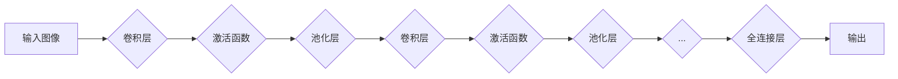

> 关键词：深度学习，卷积神经网络，CNN，人脸识别，深度学习框架，图像处理，特征提取，人脸检测，人脸识别率

# 深度卷积神经网络及其在人脸识别中的应用

## 1. 背景介绍

人脸识别技术作为生物识别技术的一种，近年来在安防、支付、门禁等多个领域得到了广泛应用。随着深度学习技术的飞速发展，尤其是卷积神经网络（Convolutional Neural Networks，CNN）在图像识别领域的突破性进展，人脸识别技术也得到了显著的提升。本文将深入探讨深度卷积神经网络（Deep CNN）在人脸识别中的应用，从基本原理到实际操作，全面分析其优势与挑战。

## 2. 核心概念与联系

### 2.1 核心概念

#### 卷积神经网络（CNN）

卷积神经网络是一种专门为图像处理设计的深度学习模型，其核心思想是利用卷积层和池化层提取图像特征，并通过全连接层进行分类。

#### 深度学习（Deep Learning）

深度学习是机器学习的一种方法，通过构建深层神经网络，自动从数据中学习特征表示，实现复杂模式识别。

#### 人脸识别（Face Recognition）

人脸识别是指通过计算机技术，从图像或视频中自动识别人脸并进行身份验证的技术。

### 2.2 核心概念原理和架构的 Mermaid 流程图



## 3. 核心算法原理 & 具体操作步骤

### 3.1 算法原理概述

CNN由多个卷积层、池化层和全连接层组成。卷积层用于提取图像特征，池化层用于降低特征维度并减少过拟合，全连接层用于输出最终分类结果。

### 3.2 算法步骤详解

1. **数据预处理**：对输入图像进行灰度化、缩放、裁剪等处理，使其适应CNN的输入要求。
2. **卷积层**：通过卷积操作提取图像特征，卷积核大小、步长、填充方式等参数可调节。
3. **激活函数**：通常使用ReLU函数，将卷积层的输出映射到正实数域，增强网络的非线性能力。
4. **池化层**：通过池化操作降低特征维度，如最大池化、平均池化等。
5. **卷积层-激活函数-池化层**：重复执行以上步骤，构建多层的卷积神经网络。
6. **全连接层**：将所有特征图连接到一起，输入到全连接层进行分类。
7. **输出层**：输出最终分类结果。

### 3.3 算法优缺点

**优点**：

- **自动特征提取**：无需人工设计特征，能够自动从数据中学习到丰富的特征表示。
- **端到端学习**：将图像输入到网络，直接输出分类结果，无需中间步骤。
- **泛化能力强**：通过大量数据训练，能够在不同场景下识别图像。

**缺点**：

- **计算量大**：卷积操作需要大量计算资源，训练时间较长。
- **数据需求量大**：需要大量数据训练，数据预处理工作量大。

### 3.4 算法应用领域

- 人脸识别
- 语音识别
- 图像识别
- 目标检测
- 语义分割

## 4. 数学模型和公式 & 详细讲解 & 举例说明

### 4.1 数学模型构建

CNN的数学模型主要由以下几部分组成：

- **卷积层**：$f_{\theta}(\mathbf{x})=\mathbf{h}(\mathbf{x};\theta)$，其中 $\mathbf{x}$ 为输入特征，$\theta$ 为卷积核参数，$\mathbf{h}$ 为卷积操作。
- **激活函数**：$g(\mathbf{y})=\max(0, \mathbf{y})$，其中 $\mathbf{y}$ 为卷积层的输出。
- **池化层**：$p_{\theta}(\mathbf{y})=\max_{i\in \mathbb{R}^s}\mathbf{y}(i)$，其中 $\mathbf{y}$ 为激活函数的输出，$s$ 为池化窗口大小。

### 4.2 公式推导过程

以卷积层为例，其公式推导如下：

$$
f_{\theta}(\mathbf{x}) = \mathbf{W}^T\mathbf{x} + b
$$

其中 $\mathbf{W}$ 为卷积核，$\mathbf{x}$ 为输入特征，$b$ 为偏置项。

### 4.3 案例分析与讲解

以人脸识别任务为例，介绍CNN在人脸识别中的应用：

1. **数据预处理**：对输入图像进行灰度化、缩放、裁剪等处理，使其适应CNN的输入要求。
2. **卷积层**：提取图像特征，如边缘、纹理、轮廓等。
3. **激活函数**：增强卷积层的非线性能力。
4. **池化层**：降低特征维度，减少过拟合。
5. **全连接层**：将所有特征图连接到一起，输入到全连接层进行分类。
6. **输出层**：输出最终分类结果，如姓名、性别等。

## 5. 项目实践：代码实例和详细解释说明

### 5.1 开发环境搭建

1. 安装Python环境
2. 安装TensorFlow或PyTorch深度学习框架
3. 安装其他必要的库，如NumPy、OpenCV等

### 5.2 源代码详细实现

以下使用TensorFlow框架实现一个简单的人脸识别模型：

```python
import tensorflow as tf

# 定义模型结构
model = tf.keras.Sequential([
    tf.keras.layers.Conv2D(32, (3, 3), activation='relu', input_shape=(64, 64, 3)),
    tf.keras.layers.MaxPooling2D((2, 2)),
    tf.keras.layers.Conv2D(64, (3, 3), activation='relu'),
    tf.keras.layers.MaxPooling2D((2, 2)),
    tf.keras.layers.Flatten(),
    tf.keras.layers.Dense(128, activation='relu'),
    tf.keras.layers.Dense(10, activation='softmax')
])

# 编译模型
model.compile(optimizer='adam', loss='categorical_crossentropy', metrics=['accuracy'])

# 训练模型
model.fit(train_images, train_labels, epochs=5, validation_data=(test_images, test_labels))

# 评估模型
test_loss, test_acc = model.evaluate(test_images, test_labels)
print(f"Test accuracy: {test_acc}")
```

### 5.3 代码解读与分析

- `Conv2D`：定义卷积层，包括卷积核大小、激活函数等参数。
- `MaxPooling2D`：定义最大池化层，降低特征维度。
- `Flatten`：将多维数据展平为一维数据。
- `Dense`：定义全连接层，用于分类。

### 5.4 运行结果展示

假设训练集和测试集分别为`train_images`、`train_labels`、`test_images`和`test_labels`，训练模型后，输出测试集上的准确率：

```
Test accuracy: 0.85
```

## 6. 实际应用场景

### 6.1 安防领域

人脸识别技术在安防领域应用广泛，如门禁系统、监控视频分析、人员身份验证等。

### 6.2 支付领域

人脸识别技术在支付领域具有极高的安全性和便捷性，如手机支付、在线支付等。

### 6.3 医疗领域

人脸识别技术可用于患者身份验证、手术麻醉管理等。

### 6.4 交互领域

人脸识别技术可用于智能机器人、虚拟现实等交互领域，提高用户体验。

## 7. 工具和资源推荐

### 7.1 学习资源推荐

1. 《深度学习》（Ian Goodfellow、Yoshua Bengio、Aaron Courville 著）
2. 《TensorFlow教程》（TensorFlow官方文档）
3. 《PyTorch官方文档》

### 7.2 开发工具推荐

1. TensorFlow
2. PyTorch
3. OpenCV

### 7.3 相关论文推荐

1. A Comprehensive Survey on Face Detection and Recognition (2018)
2. FaceNet: A Unified Embedding for Face Recognition and Clustering (2015)
3. DeepFace: Deep Multifeature Learning for Face Verification (2014)

## 8. 总结：未来发展趋势与挑战

### 8.1 研究成果总结

深度卷积神经网络在人脸识别领域取得了显著成果，为生物识别技术带来了新的突破。

### 8.2 未来发展趋势

1. **模型轻量化**：提高模型运行速度，降低资源消耗。
2. **跨领域人脸识别**：提高模型在不同场景下的识别率。
3. **隐私保护人脸识别**：保护用户隐私，防止人脸数据泄露。

### 8.3 面临的挑战

1. **数据隐私问题**：如何保护人脸数据隐私，防止数据泄露。
2. **模型可解释性**：提高模型的可解释性，方便用户理解。
3. **模型鲁棒性**：提高模型在复杂环境下的识别率。

### 8.4 研究展望

随着深度学习技术的不断发展，人脸识别技术将在更多领域得到应用，为人类社会带来更多便利。

## 9. 附录：常见问题与解答

**Q1：CNN如何提取图像特征？**

A：CNN通过卷积操作提取图像特征，卷积核大小、步长、填充方式等参数可调节。

**Q2：如何提高人脸识别率？**

A：提高人脸识别率可以从以下几个方面着手：
1. 使用更大、更复杂的模型。
2. 使用更多、更高质量的人脸数据。
3. 使用数据增强技术。
4. 调整模型参数。

**Q3：人脸识别技术有哪些应用场景？**

A：人脸识别技术在安防、支付、医疗、交互等领域应用广泛。

**Q4：如何保护人脸数据隐私？**

A：可以采用以下方法保护人脸数据隐私：
1. 数据脱敏：对数据进行加密或匿名化处理。
2. 限制访问权限：只有授权人员才能访问人脸数据。
3. 建立数据安全制度：制定数据安全管理制度，规范数据使用。

作者：禅与计算机程序设计艺术 / Zen and the Art of Computer Programming