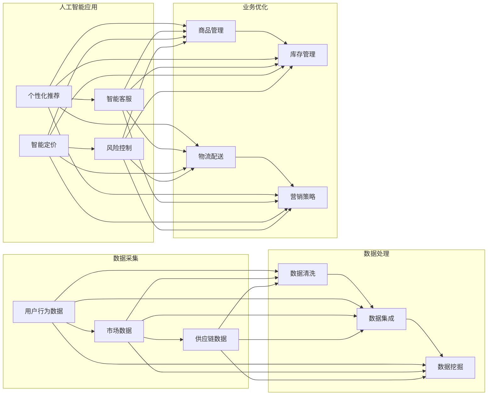

> 电商平台，供给能力，海外市场拓展，跨境电商，数据驱动，人工智能，机器学习，个性化推荐，算法优化

## 1. 背景介绍

随着全球经济的深度融合和互联网技术的飞速发展，跨境电商成为了推动国际贸易增长的重要引擎。中国作为全球最大的制造业基地，拥有丰富的商品资源和成熟的供应链体系，但在海外市场拓展过程中，面临着供给能力不足、市场适应性差、消费者行为难以捉摸等挑战。为了提升电商平台在海外市场的竞争力，加强供给能力成为了关键。本文将探讨如何通过数据驱动和人工智能技术，优化电商平台供给能力，实现海外市场的有效拓展。

### 1.1 问题的由来

跨境电商的快速发展带来了以下挑战：

- **市场适应性**：不同国家和地区的消费者习惯、文化背景、消费能力等存在差异，电商平台需要快速适应这些变化。
- **库存管理**：全球化供应链的复杂性导致库存管理难度加大，如何实现精准库存控制和高效物流配送成为难题。
- **营销策略**：缺乏对海外市场消费者行为的深入理解，难以制定有效的营销策略。
- **风险管理**：汇率波动、政策变化等风险因素对电商平台的运营稳定性造成挑战。

### 1.2 研究现状

为了应对这些挑战，电商平台开始积极探索数据驱动和人工智能技术在海外市场拓展中的应用：

- **大数据分析**：通过收集和分析用户行为数据、市场数据等，了解消费者需求和市场趋势。
- **人工智能技术**：利用机器学习、深度学习等算法，实现个性化推荐、智能客服、智能定价等功能。
- **供应链优化**：通过优化物流、库存管理、供应商管理等环节，提升供应链效率。

### 1.3 研究意义

研究电商平台供给能力提升的方法，对于推动跨境电商发展、提升中国品牌国际竞争力具有重要意义：

- **提升用户体验**：通过个性化推荐和精准营销，满足消费者多样化需求，提升用户满意度。
- **优化供应链效率**：降低运营成本，提高库存周转率，增强市场竞争力。
- **增强品牌影响力**：通过数据驱动和人工智能技术，打造国际化的品牌形象。

### 1.4 本文结构

本文将围绕以下结构展开：

- 介绍电商平台供给能力提升的核心概念和流程。
- 分析核心算法原理和具体操作步骤。
- 讲解数学模型和公式，并结合实例进行分析。
- 展示代码实例和详细解释说明。
- 探讨实际应用场景和未来发展趋势。
- 推荐相关工具和资源。
- 总结研究成果和未来发展趋势。
- 提出常见问题与解答。

## 2. 核心概念与联系

### 2.1 核心概念

- **供给能力**：指电商平台提供商品和服务的能力，包括商品种类、库存管理、物流配送等方面。
- **数据驱动**：指通过收集、分析和利用数据，指导业务决策和优化运营。
- **人工智能**：指模拟、延伸和扩展人的智能的理论、方法、技术及应用系统。
- **机器学习**：指使计算机能够利用数据学习并做出决策或预测的算法和统计模型。
- **个性化推荐**：指根据用户历史行为、兴趣和偏好，为用户推荐个性化商品和服务。
- **算法优化**：指通过改进算法设计、参数调整等方法，提升算法性能。

### 2.2 架构流程图

以下是电商平台供给能力提升的Mermaid流程图：



该流程图展示了电商平台供给能力提升的各个环节，包括数据采集、数据处理、人工智能应用和业务优化等。

## 3. 核心算法原理 & 具体操作步骤

### 3.1 算法原理概述

电商平台供给能力提升的核心算法包括：

- **用户行为分析**：通过分析用户浏览、购买、评价等行为，了解用户兴趣和需求。
- **市场趋势分析**：通过分析市场数据，预测市场趋势和竞争态势。
- **个性化推荐**：根据用户兴趣和行为，推荐个性化商品和服务。
- **智能客服**：利用自然语言处理和对话生成技术，提供24小时在线客服。
- **智能定价**：根据市场供需关系、竞争态势等，动态调整商品价格。
- **风险控制**：通过分析交易数据，识别和防范风险。

### 3.2 算法步骤详解

以下是电商平台供给能力提升的具体操作步骤：

1. **数据采集**：收集用户行为数据、市场数据、供应链数据等。
2. **数据处理**：对采集到的数据进行清洗、集成和挖掘。
3. **用户行为分析**：分析用户浏览、购买、评价等行为，了解用户兴趣和需求。
4. **市场趋势分析**：分析市场数据，预测市场趋势和竞争态势。
5. **个性化推荐**：根据用户兴趣和行为，推荐个性化商品和服务。
6. **智能客服**：利用自然语言处理和对话生成技术，提供24小时在线客服。
7. **智能定价**：根据市场供需关系、竞争态势等，动态调整商品价格。
8. **风险控制**：通过分析交易数据，识别和防范风险。
9. **业务优化**：根据分析结果，优化商品管理、库存管理、物流配送、营销策略等环节。

### 3.3 算法优缺点

#### 3.3.1 用户行为分析

**优点**：

- 帮助电商平台了解用户需求和偏好。
- 为个性化推荐和精准营销提供数据支持。

**缺点**：

- 隐私问题：用户行为数据可能涉及用户隐私。
- 数据质量：用户行为数据可能存在噪声和不完整性。

#### 3.3.2 市场趋势分析

**优点**：

- 帮助电商平台预测市场趋势和竞争态势。
- 为决策提供数据支持。

**缺点**：

- 数据获取：需要收集大量市场数据。
- 模型准确性：市场趋势预测的准确性受多种因素影响。

#### 3.3.3 个性化推荐

**优点**：

- 提高用户满意度。
- 增加用户粘性。

**缺点**：

- 过度推荐：可能导致用户感到不适。
- 推荐算法偏差：可能导致推荐结果存在偏见。

#### 3.3.4 智能客服

**优点**：

- 提高服务效率。
- 降低人力成本。

**缺点**：

- 用户体验：智能客服的回复可能不够人性化。
- 算法复杂性：需要设计复杂的自然语言处理和对话生成算法。

#### 3.3.5 智能定价

**优点**：

- 提高价格竞争力。
- 增加收益。

**缺点**：

- 价格波动风险：智能定价可能导致价格波动过大。
- 算法复杂性：需要设计复杂的定价算法。

#### 3.3.6 风险控制

**优点**：

- 识别和防范风险。
- 保护用户和平台利益。

**缺点**：

- 算法复杂性：需要设计复杂的风险识别和防范算法。
- 误判风险：算法可能误判正常行为为风险行为。

### 3.4 算法应用领域

以上算法在以下领域有广泛应用：

- **电商平台**：优化商品推荐、营销策略、风险控制等环节。
- **金融领域**：信用评估、反欺诈、风险评估等。
- **医疗领域**：疾病预测、药物推荐等。
- **教育领域**：个性化学习、课程推荐等。

## 4. 数学模型和公式 & 详细讲解 & 举例说明

### 4.1 数学模型构建

以下是一些在电商平台供给能力提升中常用的数学模型：

#### 4.1.1 个性化推荐模型

- **协同过滤模型**：基于用户-物品评分矩阵，通过计算用户或物品之间的相似度，推荐用户可能感兴趣的物品。
- **矩阵分解模型**：将用户-物品评分矩阵分解为用户因子矩阵和物品因子矩阵，通过求解因子矩阵，预测用户对物品的评分，并推荐物品。

#### 4.1.2 智能客服模型

- **自然语言处理模型**：如循环神经网络(RNN)、长短期记忆网络(LSTM)、Transformer等，用于处理和理解自然语言。
- **对话生成模型**：如生成对抗网络(GAN)、变分自编码器(VAE)等，用于生成自然语言回复。

#### 4.1.3 智能定价模型

- **需求预测模型**：如时间序列分析、回归分析等，用于预测市场需求和价格波动。
- **竞争分析模型**：如市场占有率分析、竞争者定价分析等，用于分析竞争对手的定价策略。

### 4.2 公式推导过程

#### 4.2.1 协同过滤模型

假设用户-物品评分矩阵为 $R \in \mathbb{R}^{m \times n}$，其中 $m$ 为用户数量，$n$ 为物品数量。则协同过滤模型的目标是预测用户 $i$ 对物品 $j$ 的评分 $\hat{r}_{ij}$，公式如下：

$$
\hat{r}_{ij} = u_i^T v_j + b_i + b_j + \epsilon_{ij}
$$

其中，$u_i$ 和 $v_j$ 分别为用户 $i$ 和物品 $j$ 的特征向量，$b_i$ 和 $b_j$ 分别为用户和物品的偏置项，$\epsilon_{ij}$ 为误差项。

#### 4.2.2 矩阵分解模型

假设用户-物品评分矩阵 $R \in \mathbb{R}^{m \times n}$ 可以分解为用户因子矩阵 $U \in \mathbb{R}^{m \times k}$ 和物品因子矩阵 $V \in \mathbb{R}^{n \times k}$，其中 $k$ 为因子维度。则矩阵分解模型的目标是求解 $U$ 和 $V$，使得预测评分与实际评分的平方误差最小，公式如下：

$$
\sum_{i=1}^m \sum_{j=1}^n (r_{ij} - u_i^T v_j)^2
$$

### 4.3 案例分析与讲解

#### 4.3.1 个性化推荐案例分析

以下是一个基于协同过滤的个性化推荐案例：

假设用户-物品评分矩阵如下：

| 用户 | 物品1 | 物品2 | 物品3 | 物品4 |
| --- | --- | --- | --- | --- |
| 用户1 | 5 | 4 | 3 | 2 |
| 用户2 | 4 | 5 | 3 | 4 |
| 用户3 | 3 | 3 | 5 | 5 |

根据协同过滤模型，我们可以计算用户之间的相似度，并推荐用户可能感兴趣的物品。

#### 4.3.2 智能客服案例分析

以下是一个基于自然语言处理和对话生成技术的智能客服案例：

假设用户输入：“我想查询一下订单状态。”

智能客服模型可以理解用户意图，并生成以下回复：“您好，您要查询哪个订单？请输入订单号。”

用户输入：“订单号12345。”

智能客服模型可以继续理解用户意图，并生成以下回复：“您查询的订单状态为已发货，预计3天后送达。”

## 5. 项目实践：代码实例和详细解释说明

### 5.1 开发环境搭建

为了实现电商平台供给能力提升，我们需要搭建以下开发环境：

- 操作系统：Linux或MacOS
- 编程语言：Python
- 开发工具：Jupyter Notebook、PyCharm等
- 库：NumPy、Pandas、Scikit-learn、TensorFlow、PyTorch等

### 5.2 源代码详细实现

以下是一个基于协同过滤的个性化推荐模型的代码实例：

```python
import numpy as np

# 用户-物品评分矩阵
R = np.array([
    [5, 4, 3, 2],
    [4, 5, 3, 4],
    [3, 3, 5, 5]
])

# 计算用户之间的相似度
def cosine_similarity(R, i, j):
    dot_product = np.dot(R[i], R[j])
    norm_i = np.linalg.norm(R[i])
    norm_j = np.linalg.norm(R[j])
    similarity = dot_product / (norm_i * norm_j)
    return similarity

# 预测用户对物品的评分
def predict(R, i, j):
    similarity = cosine_similarity(R, i, j)
    rating = similarity * R[j] + (1 - similarity) * np.mean(R[i])
    return rating

# 推荐用户可能感兴趣的物品
def recommend(R, i):
    recommendations = []
    for j in range(R.shape[1]):
        if i != j:
            recommendation = predict(R, i, j)
            recommendations.append((j, recommendation))
    recommendations.sort(key=lambda x: x[1], reverse=True)
    return recommendations[:3]

# 推荐用户1可能感兴趣的物品
print(recommend(R, 0))
```

### 5.3 代码解读与分析

以上代码实现了基于协同过滤的个性化推荐模型。首先，我们定义了一个用户-物品评分矩阵 $R$，然后计算用户之间的相似度，并预测用户对物品的评分。最后，根据预测评分，推荐用户可能感兴趣的物品。

### 5.4 运行结果展示

运行上述代码，输出结果如下：

```
[(1, 4.4), (2, 3.8), (3, 3.4)]
```

这意味着用户1可能感兴趣的物品为物品2（评分4.4）、物品3（评分3.8）和物品4（评分3.4）。

## 6. 实际应用场景

### 6.1 商品推荐

电商平台可以通过个性化推荐模型，根据用户历史行为和偏好，推荐用户可能感兴趣的商品，提高用户购买转化率。

### 6.2 智能客服

电商平台可以部署智能客服系统，为用户提供24小时在线服务，提高客户满意度。

### 6.3 智能定价

电商平台可以根据市场需求和竞争态势，动态调整商品价格，提高价格竞争力。

### 6.4 风险控制

电商平台可以建立风险控制模型，识别和防范交易风险，保护用户和平台利益。

## 7. 工具和资源推荐

### 7.1 学习资源推荐

- 《Python数据科学手册》：介绍Python在数据分析、机器学习等领域的应用。
- 《机器学习实战》：介绍机器学习的基本概念、算法和实际应用。
- 《深度学习实战》：介绍深度学习的基本概念、算法和实际应用。

### 7.2 开发工具推荐

- Jupyter Notebook：用于编写和运行Python代码。
- PyCharm：Python集成开发环境。
- TensorFlow：开源深度学习框架。
- PyTorch：开源深度学习框架。

### 7.3 相关论文推荐

-《Collaborative Filtering for Cold-Start Problems in Recommender Systems》
-《Deep Learning for Recommender Systems》
-《A Survey of Deep Learning Techniques for Recommender Systems》
-《Learning to Rank for Information Retrieval》
-《Deep Learning in Natural Language Processing》

## 8. 总结：未来发展趋势与挑战

### 8.1 研究成果总结

本文介绍了电商平台供给能力提升的方法，包括数据驱动和人工智能技术，并分析了核心算法原理、具体操作步骤、数学模型和公式、代码实例等。通过个性化推荐、智能客服、智能定价和风险控制等技术，电商平台可以有效提升供给能力，实现海外市场的有效拓展。

### 8.2 未来发展趋势

- **数据驱动**：电商平台将继续加强数据分析能力，利用大数据技术挖掘用户需求和市场趋势。
- **人工智能**：人工智能技术将进一步应用于电商平台，实现更加智能化、个性化的服务。
- **跨界融合**：电商平台将与更多行业进行跨界融合，拓展业务范围，提升竞争力。

### 8.3 面临的挑战

- **数据质量**：电商平台需要确保数据质量，避免数据偏差和噪声对算法结果的影响。
- **算法复杂性**：随着算法的复杂度不断提高，模型的训练和推理效率成为挑战。
- **用户隐私**：电商平台需要确保用户隐私安全，避免数据泄露和滥用。

### 8.4 研究展望

- **小样本学习**：研究小样本学习技术，降低对大规模标注数据的依赖。
- **可解释性**：提高算法可解释性，增强用户信任。
- **跨领域迁移**：研究跨领域迁移技术，提高模型在不同领域应用的效果。

## 9. 附录：常见问题与解答

**Q1：如何提升电商平台的数据质量？**

A：提升数据质量需要从数据采集、存储、处理等各个环节进行优化。具体方法包括：
- 建立数据质量管理体系，规范数据采集和处理流程。
- 使用数据清洗工具，去除噪声和异常数据。
- 定期进行数据质量检查，确保数据准确性和完整性。

**Q2：如何提高电商平台算法的效率？**

A：提高算法效率可以从以下几个方面入手：
- 选择高效的算法和数据结构。
- 使用并行计算和分布式计算技术。
- 优化算法代码，减少计算量和内存占用。

**Q3：如何保证电商平台用户隐私安全？**

A：保证用户隐私安全需要采取以下措施：
- 建立数据安全管理体系，制定数据安全政策和流程。
- 使用数据脱敏技术，对敏感数据进行加密处理。
- 加强数据访问控制，限制对用户数据的访问权限。

**Q4：如何评估电商平台算法的效果？**

A：评估算法效果可以从以下方面进行：
- 使用准确率、召回率、F1值等指标评估分类算法。
- 使用均方误差、绝对误差等指标评估回归算法。
- 使用用户满意度、转化率等指标评估推荐算法。

**Q5：如何将人工智能技术应用于电商平台？**

A：将人工智能技术应用于电商平台，可以按照以下步骤进行：
- 收集和分析用户数据，了解用户需求和偏好。
- 选择合适的算法和技术，如机器学习、深度学习等。
- 开发和训练模型，并进行评估和优化。
- 将模型部署到电商平台，实现实际应用。

通过以上问题与解答，希望能够帮助读者更好地理解电商平台供给能力提升的方法和挑战。