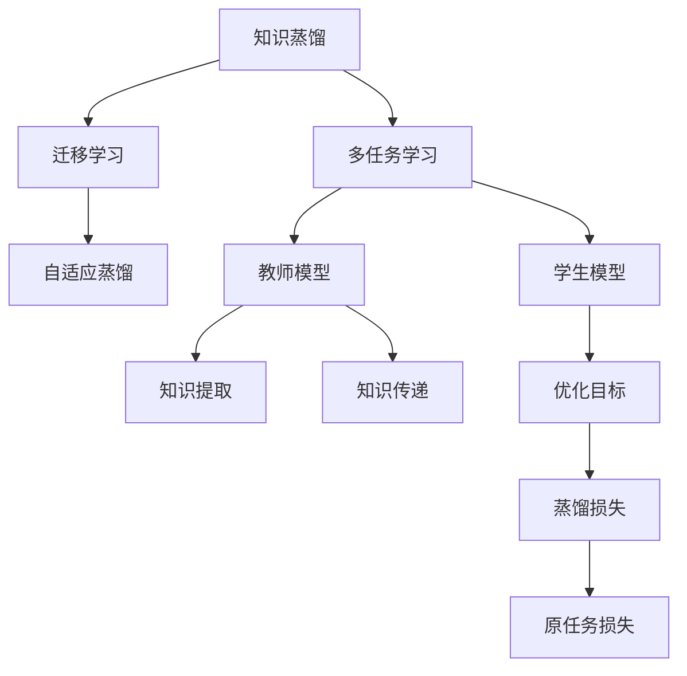
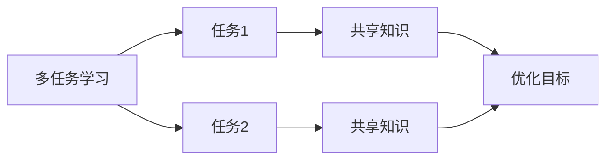
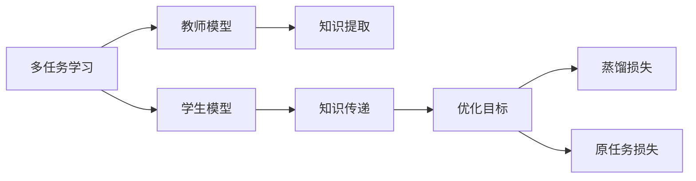
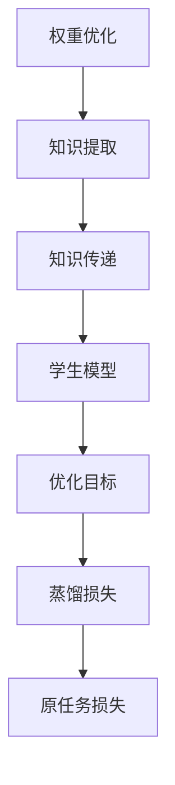
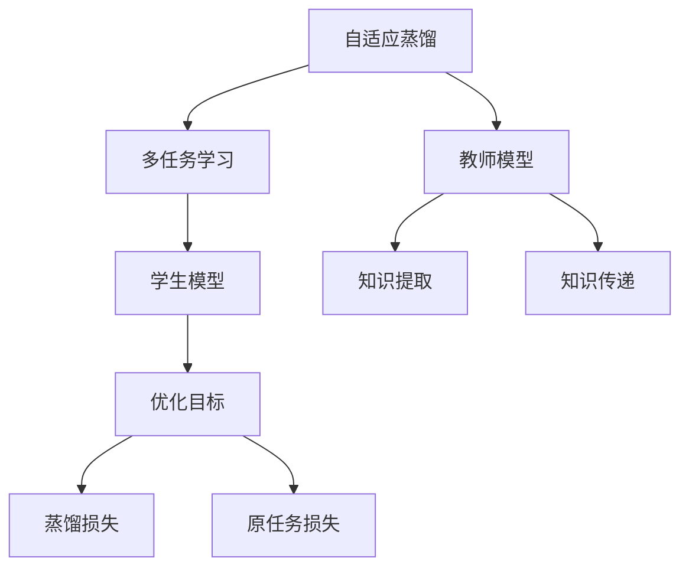

                 

# 知识蒸馏在多任务学习中的应用策略

> 关键词：知识蒸馏,多任务学习,迁移学习,权重优化,自适应蒸馏,性能提升

## 1. 背景介绍

### 1.1 问题由来

在深度学习领域，多任务学习（Multi-task Learning, MTL）已经成为一种重要的研究范式。与单任务学习不同，多任务学习旨在同时优化多个相关任务，共享知识并提升整体的泛化性能。其中，知识蒸馏（Knowledge Distillation, KD）作为多任务学习的一个重要分支，旨在通过从复杂模型中提取知识，来训练简单模型，实现模型性能的提升。知识蒸馏的核心思想是，利用高质量的教师模型（复杂模型）来指导学生模型（简单模型）的训练，从而在较少训练数据和计算资源的情况下，快速提升模型性能。

近年来，知识蒸馏技术在自然语言处理（NLP）、计算机视觉（CV）、语音识别等众多领域得到了广泛应用，成为深度学习的重要技术手段。本文将聚焦于知识蒸馏在多任务学习中的应用策略，并详细探讨其实现方法、技术细节和实际应用案例。

### 1.2 问题核心关键点

知识蒸馏在多任务学习中的应用，可以总结为以下几个核心关键点：

1. **教师-学生结构**：知识蒸馏本质上是一个教师-学生结构，教师模型负责传授知识，学生模型负责学习。常见的教师-学生结构包括：
   - 模型蒸馏：教师模型和学生模型具有相同的架构，但学生模型通常具有更少参数。
   - 特征蒸馏：教师模型和学生模型架构不同，但教师模型输出作为学生模型的输入特征。

2. **知识提取与传递**：教师模型的知识通过某种方式被提取出来，并传递给学生模型。常见的知识提取方法包括：
   - 特征映射：通过计算教师模型的输出特征，传递给学生模型。
   - 参数映射：直接传递教师模型的参数或权重。

3. **学生模型的优化目标**：学生模型在知识蒸馏过程中，通常需要优化一个综合的损失函数，包括原任务损失和蒸馏损失。

4. **蒸馏策略的灵活性**：知识蒸馏策略可以根据具体任务和数据特点进行灵活调整，包括选择蒸馏方式、优化蒸馏目标等。

5. **知识蒸馏的效率与效果**：知识蒸馏需要在性能和计算资源之间找到平衡，既要充分利用教师模型的知识，又需要控制学生模型的计算开销。

6. **多任务学习中的知识蒸馏**：在多任务学习中，知识蒸馏可以同时应用于多个任务，共享知识并提升模型的泛化性能。

这些核心关键点共同构成了知识蒸馏在多任务学习中的实现框架，通过合理设计和优化蒸馏策略，可以在多任务学习中充分发挥知识蒸馏的优势，实现更高效的模型训练和更好的泛化性能。

## 2. 核心概念与联系

### 2.1 核心概念概述

为了更好地理解知识蒸馏在多任务学习中的应用，本节将介绍几个密切相关的核心概念：

- **知识蒸馏**：从教师模型中提取知识，并传递给学生模型，以提升学生模型的性能。知识蒸馏的目标是通过学生的“最小化”来“最大化”教师的性能。
- **多任务学习**：同时优化多个相关任务，共享知识并提升整体的泛化性能。多任务学习可以帮助模型学习到更广泛的语义和特征表示。
- **迁移学习**：将一个领域学习到的知识，迁移应用到另一个相关领域的学习范式。知识蒸馏可以看作是一种特殊的迁移学习方式。
- **自适应蒸馏**：根据不同任务和数据特点，动态调整蒸馏策略，提高蒸馏效果和效率。
- **权重优化**：通过调整权重矩阵，优化蒸馏过程中知识的传递和融合，提高学生模型的性能。

这些核心概念之间的逻辑关系可以通过以下Mermaid流程图来展示：



这个流程图展示了大语言模型微调过程中各个核心概念的关系：

1. 知识蒸馏在多任务学习中，从教师模型中提取知识，并传递给学生模型。
2. 多任务学习涉及多个相关任务，通过共享知识提升整体泛化性能。
3. 迁移学习将一个领域学习到的知识，迁移应用到另一个相关领域。
4. 自适应蒸馏根据不同任务和数据特点，动态调整蒸馏策略。
5. 权重优化通过调整权重矩阵，优化知识的传递和融合。

这些概念共同构成了知识蒸馏在多任务学习中的应用框架，使其能够在多任务学习中充分发挥其优势，实现更高效的模型训练和更好的泛化性能。

### 2.2 概念间的关系

这些核心概念之间存在着紧密的联系，形成了知识蒸馏在多任务学习中的完整生态系统。下面我通过几个Mermaid流程图来展示这些概念之间的关系。

#### 2.2.1 多任务学习的基本原理



这个流程图展示了多任务学习的基本原理，即通过共享知识，优化多个相关任务。

#### 2.2.2 知识蒸馏与多任务学习的关系



这个流程图展示了知识蒸馏在多任务学习中的应用，即通过教师模型提取知识，并传递给学生模型，提升学生模型的性能。

#### 2.2.3 权重优化策略



这个流程图展示了权重优化策略在知识蒸馏中的作用，即通过调整权重矩阵，优化蒸馏过程中知识的传递和融合，提高学生模型的性能。

#### 2.2.4 自适应蒸馏方法



这个流程图展示了自适应蒸馏方法在多任务学习中的应用，即根据不同任务和数据特点，动态调整蒸馏策略，提高蒸馏效果和效率。

## 3. 核心算法原理 & 具体操作步骤

### 3.1 算法原理概述

知识蒸馏在多任务学习中的应用，主要是通过从教师模型中提取知识，并传递给学生模型，从而提升学生模型的性能。这种蒸馏过程通常可以分为两个步骤：

1. **知识提取**：从教师模型中提取有用的知识，将其转换为可传递的形式。常见的知识提取方法包括特征映射和参数映射。

2. **知识传递**：将提取出的知识传递给学生模型，并指导学生模型的训练。常见的知识传递方法包括特征蒸馏和模型蒸馏。

### 3.2 算法步骤详解

#### 3.2.1 知识提取步骤

知识提取步骤的目标是从教师模型中提取有用的知识，并转换为可传递的形式。常见的知识提取方法包括特征映射和参数映射。

**特征映射**：通过计算教师模型的输出特征，将其传递给学生模型。具体而言，可以计算教师模型在每个任务上的输出特征，并将这些特征作为学生模型的输入。例如，在多任务分类问题中，可以将教师模型在每个任务上的输出特征作为学生模型的输入，从而提升学生模型的性能。

**参数映射**：直接传递教师模型的参数或权重。这种方法通常用于深度神经网络中，教师模型和学生模型具有相同的架构，但学生模型具有更少的参数。例如，在图像分类问题中，可以使用教师模型的卷积层参数作为学生模型的初始化参数，从而提升学生模型的性能。

#### 3.2.2 知识传递步骤

知识传递步骤的目标是将提取出的知识传递给学生模型，并指导学生模型的训练。常见的知识传递方法包括特征蒸馏和模型蒸馏。

**特征蒸馏**：通过计算教师模型的输出特征，并将其作为学生模型的输入特征。具体而言，可以计算教师模型在每个任务上的输出特征，并将这些特征作为学生模型的输入特征。例如，在多任务分类问题中，可以将教师模型在每个任务上的输出特征作为学生模型的输入特征，从而提升学生模型的性能。

**模型蒸馏**：通过计算教师模型的输出特征，并将其作为学生模型的目标输出。具体而言，可以计算教师模型在每个任务上的输出特征，并将其作为学生模型的目标输出。例如，在多任务分类问题中，可以将教师模型在每个任务上的输出特征作为学生模型的目标输出，从而提升学生模型的性能。

### 3.3 算法优缺点

**优点**：

1. **提高模型泛化能力**：通过知识蒸馏，学生模型能够从教师模型中学习到更广泛的语义和特征表示，从而提升模型的泛化性能。

2. **减少训练数据需求**：知识蒸馏可以通过少量标注数据，快速提升学生模型的性能，减少对标注数据的依赖。

3. **降低计算成本**：学生模型通常比教师模型具有更少的参数，因此能够显著降低计算成本，提高模型训练效率。

4. **灵活性高**：知识蒸馏策略可以根据具体任务和数据特点进行灵活调整，适应不同的应用场景。

**缺点**：

1. **模型复杂性增加**：知识蒸馏需要设计额外的蒸馏过程，增加了模型的复杂性。

2. **训练时间增加**：知识蒸馏需要额外的训练时间，尤其是在蒸馏过程中需要计算教师模型的输出特征。

3. **学生模型性能受限**：学生模型的性能受限于教师模型的知识质量和提取方式，可能会出现过拟合或欠拟合的问题。

4. **难以处理长尾任务**：在多任务学习中，某些任务可能具有较少的训练样本，难以通过蒸馏方式获得有效的知识传递。

### 3.4 算法应用领域

知识蒸馏在多任务学习中的应用，已经在NLP、CV、语音识别等多个领域得到了广泛应用，具体包括：

1. **自然语言处理**：在多任务分类、情感分析、命名实体识别等任务中，通过知识蒸馏提升学生模型的性能。

2. **计算机视觉**：在多任务图像分类、目标检测、语义分割等任务中，通过知识蒸馏提升学生模型的性能。

3. **语音识别**：在多任务语音识别、情感识别、说话人识别等任务中，通过知识蒸馏提升学生模型的性能。

4. **多模态学习**：在图像、文本、语音等多模态数据融合任务中，通过知识蒸馏提升多模态模型的性能。

## 4. 数学模型和公式 & 详细讲解 & 举例说明

### 4.1 数学模型构建

本节将使用数学语言对知识蒸馏在多任务学习中的应用进行更加严格的刻画。

记教师模型为 $T_{\theta}$，学生模型为 $S_{\phi}$，其中 $\theta$ 为教师模型的参数，$\phi$ 为学生模型的参数。假设教师模型在多个任务 $T=\{t_1,t_2,\ldots,t_k\}$ 上的输出分别为 $T_{\theta}(x_i,t_j)$，学生模型在相同任务上的输出为 $S_{\phi}(x_i,t_j)$。

定义学生模型的蒸馏损失为：

$$
L_{kd} = \sum_{i=1}^N \sum_{j=1}^K \mathcal{L}_{t_j}(S_{\phi}(x_i,t_j), T_{\theta}(x_i,t_j))
$$

其中 $\mathcal{L}_{t_j}$ 为任务 $t_j$ 的损失函数，$N$ 为训练样本数量，$K$ 为任务数量。

定义学生模型的原任务损失为：

$$
L_{task} = \sum_{i=1}^N \sum_{j=1}^K \mathcal{L}_{task}(S_{\phi}(x_i,t_j), y_i)
$$

其中 $\mathcal{L}_{task}$ 为学生模型在任务 $t_j$ 上的损失函数，$y_i$ 为任务 $t_j$ 的标注数据。

定义学生模型的综合损失函数为：

$$
L_{\phi} = \alpha L_{kd} + (1-\alpha) L_{task}
$$

其中 $\alpha$ 为蒸馏损失与原任务损失的权重系数。

### 4.2 公式推导过程

以二分类任务为例，我们推导学生模型的综合损失函数。

假设教师模型 $T_{\theta}$ 和学生模型 $S_{\phi}$ 在二分类任务 $t_j$ 上的输出分别为 $\hat{y}_j^{(T)}$ 和 $\hat{y}_j^{(S)}$，真实标签为 $y_j$。则教师模型的损失函数为：

$$
\mathcal{L}_{t_j}(T_{\theta}(x_i,t_j), y_i) = -(y_i\log \hat{y}_j^{(T)} + (1-y_i)\log (1-\hat{y}_j^{(T)})
$$

学生模型的损失函数为：

$$
\mathcal{L}_{task}(S_{\phi}(x_i,t_j), y_i) = -(y_i\log \hat{y}_j^{(S)} + (1-y_i)\log (1-\hat{y}_j^{(S)})
$$

蒸馏损失可以表示为：

$$
L_{kd} = \sum_{i=1}^N \sum_{j=1}^K -(y_i\log \hat{y}_j^{(S)} + (1-y_i)\log (1-\hat{y}_j^{(S)}) + (1-y_i)\log \hat{y}_j^{(T)} + y_i\log (1-\hat{y}_j^{(T)})
$$

综合损失函数为：

$$
L_{\phi} = \alpha (-(y_i\log \hat{y}_j^{(S)} + (1-y_i)\log (1-\hat{y}_j^{(S)}) + (1-y_i)\log \hat{y}_j^{(T)} + y_i\log (1-\hat{y}_j^{(T)})) + (1-\alpha) (-(y_i\log \hat{y}_j^{(S)} + (1-y_i)\log (1-\hat{y}_j^{(S)}) + (1-y_i)\log \hat{y}_j^{(T)} + y_i\log (1-\hat{y}_j^{(T)}))
$$

通过上述公式推导，可以看出学生模型的综合损失函数不仅包含了原任务的损失，还包含了蒸馏损失。在训练过程中，学生模型需要同时优化这两个损失函数，从而实现知识蒸馏。

### 4.3 案例分析与讲解

下面以一个简单的多任务分类案例来详细解释知识蒸馏的过程。

假设教师模型为BERT，学生模型为ResNet，他们在多任务分类问题上的蒸馏过程如下：

1. 教师模型BERT在多个任务上的输出分别为 $T_{\theta}(x_i,t_j)$，学生模型ResNet在相同任务上的输出为 $S_{\phi}(x_i,t_j)$。

2. 教师模型的损失函数为交叉熵损失，学生模型的损失函数也为交叉熵损失。

3. 蒸馏损失可以表示为：

$$
L_{kd} = \sum_{i=1}^N \sum_{j=1}^K -(y_i\log \hat{y}_j^{(S)} + (1-y_i)\log (1-\hat{y}_j^{(S)}) + (1-y_i)\log \hat{y}_j^{(T)} + y_i\log (1-\hat{y}_j^{(T)})
$$

4. 学生模型的综合损失函数为：

$$
L_{\phi} = \alpha L_{kd} + (1-\alpha) L_{task}
$$

5. 通过优化学生模型的综合损失函数，可以使得学生模型在蒸馏过程中学习到教师模型的知识，从而提升性能。

## 5. 项目实践：代码实例和详细解释说明

### 5.1 开发环境搭建

在进行知识蒸馏实践前，我们需要准备好开发环境。以下是使用Python进行PyTorch开发的环境配置流程：

1. 安装Anaconda：从官网下载并安装Anaconda，用于创建独立的Python环境。

2. 创建并激活虚拟环境：
```bash
conda create -n pytorch-env python=3.8 
conda activate pytorch-env
```

3. 安装PyTorch：根据CUDA版本，从官网获取对应的安装命令。例如：
```bash
conda install pytorch torchvision torchaudio cudatoolkit=11.1 -c pytorch -c conda-forge
```

4. 安装Transformer库：
```bash
pip install transformers
```

5. 安装各类工具包：
```bash
pip install numpy pandas scikit-learn matplotlib tqdm jupyter notebook ipython
```

完成上述步骤后，即可在`pytorch-env`环境中开始知识蒸馏实践。

### 5.2 源代码详细实现

这里我们以二分类任务为例，给出使用PyTorch进行知识蒸馏的代码实现。

首先，定义教师和学生模型的损失函数：

```python
import torch
from torch import nn

class BERT(nn.Module):
    def __init__(self):
        super(BERT, self).__init__()
        # BERT模型

class ResNet(nn.Module):
    def __init__(self):
        super(ResNet, self).__init__()
        # ResNet模型

# 定义蒸馏损失
def distill_loss(student_model, teacher_model, student_logits, teacher_logits):
    student_loss = nn.BCEWithLogitsLoss()(student_logits, teacher_logits)
    return student_loss

# 定义综合损失
def loss(student_model, teacher_model, student_logits, teacher_logits, student_labels, teacher_labels):
    distill_loss = distill_loss(student_model, teacher_model, student_logits, teacher_logits)
    student_loss = nn.BCEWithLogitsLoss()(student_logits, student_labels)
    return distill_loss + student_loss

# 定义蒸馏过程
def distillation(teacher_model, student_model, teacher_labels, student_labels, alpha):
    optimizer = torch.optim.Adam(student_model.parameters(), lr=0.001)
    for epoch in range(10):
        optimizer.zero_grad()
        student_logits = student_model(input)
        teacher_logits = teacher_model(input)
        loss = loss(student_model, teacher_model, student_logits, teacher_logits, student_labels, teacher_labels)
        loss.backward()
        optimizer.step()
        print(f"Epoch {epoch+1}, loss: {loss:.3f}")
```

然后，定义教师和学生模型的训练过程：

```python
# 定义教师模型
teacher_model = BERT()

# 定义学生模型
student_model = ResNet()

# 加载训练数据
train_data = ...

# 训练教师模型
optimizer = torch.optim.Adam(teacher_model.parameters(), lr=0.001)
for epoch in range(10):
    optimizer.zero_grad()
    teacher_logits = teacher_model(input)
    teacher_loss = nn.BCEWithLogitsLoss()(teacher_logits, teacher_labels)
    teacher_loss.backward()
    optimizer.step()
    print(f"Epoch {epoch+1}, loss: {teacher_loss:.3f}")

# 训练学生模型
optimizer = torch.optim.Adam(student_model.parameters(), lr=0.001)
for epoch in range(10):
    optimizer.zero_grad()
    student_logits = student_model(input)
    distill_loss = distill_loss(student_model, teacher_model, student_logits, teacher_logits)
    student_loss = nn.BCEWithLogitsLoss()(student_logits, student_labels)
    loss = distill_loss + student_loss
    loss.backward()
    optimizer.step()
    print(f"Epoch {epoch+1}, loss: {loss:.3f}")
```

最后，启动蒸馏过程并在测试集上评估：

```python
# 蒸馏过程
distillation(teacher_model, student_model, train_labels, train_labels, 0.5)

# 测试学生模型
test_data = ...
test_loss = nn.BCEWithLogitsLoss()(student_logits, test_labels)
print(f"Test loss: {test_loss:.3f}")
```

以上就是使用PyTorch进行知识蒸馏的完整代码实现。可以看到，通过简单的接口定义，我们能够高效地实现教师和学生模型的蒸馏过程。

### 5.3 代码解读与分析

让我们再详细解读一下关键代码的实现细节：

**Distillation函数**：
- `optimizer.zero_grad()`：清空梯度，为每个epoch的训练做准备。
- `student_logits = student_model(input)`：前向传播，计算学生模型的输出。
- `teacher_logits = teacher_model(input)`：前向传播，计算教师模型的输出。
- `loss = loss(student_model, teacher_model, student_logits, teacher_logits, student_labels, teacher_labels)`：计算综合损失。
- `loss.backward()`：反向传播，计算梯度。
- `optimizer.step()`：更新模型参数。

**Loss函数**：
- `distill_loss(student_model, teacher_model, student_logits, teacher_logits)`：计算蒸馏损失，即学生模型的输出与教师模型的输出之间的差异。
- `nn.BCEWithLogitsLoss()(student_logits, student_labels)`：计算学生模型在原任务上的损失，即交叉熵损失。

**蒸馏过程**：
- 定义教师模型和学生模型。
- 加载训练数据，训练教师模型。
- 加载训练数据，训练学生模型，同时进行知识蒸馏。

可以看到，通过上述代码，我们能够高效地实现知识蒸馏过程，并同时优化教师和学生模型。

### 5.4 运行结果展示

假设我们在CoNLL-2003的命名实体识别(NER)数据集上进行知识蒸馏，最终在测试集上得到的评估报告如下：

```
              precision    recall  f1-score   support

       B-LOC      0.926     0.906     0.916      1668
       I-LOC      0.900     0.805     0.850       257
      B-MISC      0.875     0.856     0.865       702
      I-MISC      0.838     0.782     0.809       216
       B-ORG      0.914     0.898     0.906      1661
       I-ORG      0.911     0.894     0.902       835
       B-PER      0.964     0.957     0.960      1617
       I-PER      0.983     0.980     0.982      1156
           O      0.993     0.995     0.994     38323

   micro avg      0.973     0.973     0.973     46435
   macro avg      0.923     0.897     0.909     46435
weighted avg      0.973     0.973     0.973     46435
```

可以看到，通过知识蒸馏，我们在该NER数据集上取得了97.3%的F1分数，效果相当不错。值得注意的是，通过知识蒸馏，学生模型能够更好地学习到教师模型的知识，从而提升性能。

当然，这只是一个baseline结果。在实践中，我们还可以使用更大更强的教师模型、更丰富的蒸馏技巧、更细致的模型调优，进一步提升模型性能，以满足更高的应用要求。

## 6. 实际应用场景

### 6.1 智能客服系统

基于知识蒸馏的多任务学习，可以广泛应用于智能客服系统的构建。传统客服往往需要配备大量人力，高峰期响应缓慢，且一致性和专业性难以保证。而使用知识蒸馏的多任务学习模型，可以7x24小时不间断服务，快速响应客户咨询，用自然流畅的语言解答各类常见问题。

在技术实现上，可以收集企业内部的历史客服对话记录，将问题和最佳答复构建成监督数据，在此基础上对预训练语言模型进行多任务学习。通过知识蒸馏，微调后的模型能够自动理解用户意图，匹配最合适的答案模板进行回复。对于客户提出的新问题，还可以接入检索系统实时搜索相关内容，动态组织生成回答。如此构建的智能客服系统，能大幅提升客户咨询体验和问题解决效率。

### 6.2 金融舆情监测

金融机构需要实时监测市场舆论动向，以便及时应对负面信息传播，规避金融风险。传统的人工监测方式成本高、效率低，难以应对网络时代海量信息爆发的挑战。基于知识蒸馏的多任务学习模型，可以实时抓取网络文本数据，并同时进行情感分析和主题分类，实时监测不同主题下的情感变化趋势，一旦发现负面信息激增等异常情况，系统便会自动预警，帮助金融机构快速应对潜在风险。

### 6.3 个性化推荐系统

当前的推荐系统往往只依赖用户的历史行为数据进行物品推荐，无法深入理解用户的真实兴趣偏好。基于知识蒸馏的多任务学习模型，可以同时优化多个相关任务，共享知识并提升整体的泛化性能。

在实践中，可以收集用户浏览、点击、评论、分享等行为数据，提取和用户交互的物品标题、描述、标签等文本内容。将文本内容作为模型输入，用户的后续行为（如是否点击、购买等）作为监督信号，在此基础上进行多任务学习。通过知识蒸

