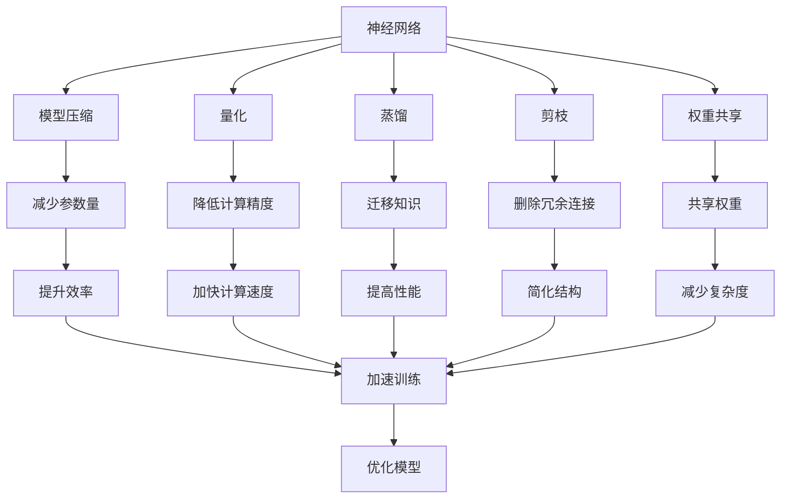
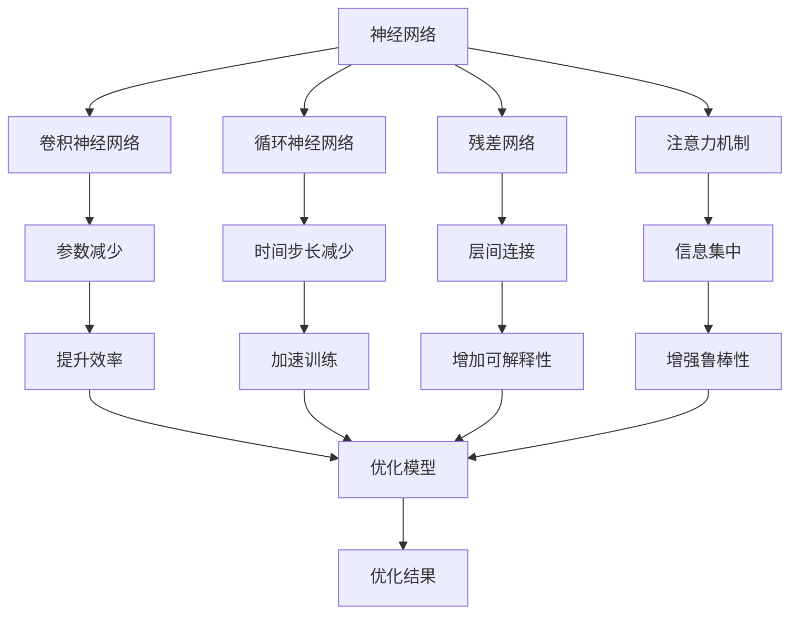
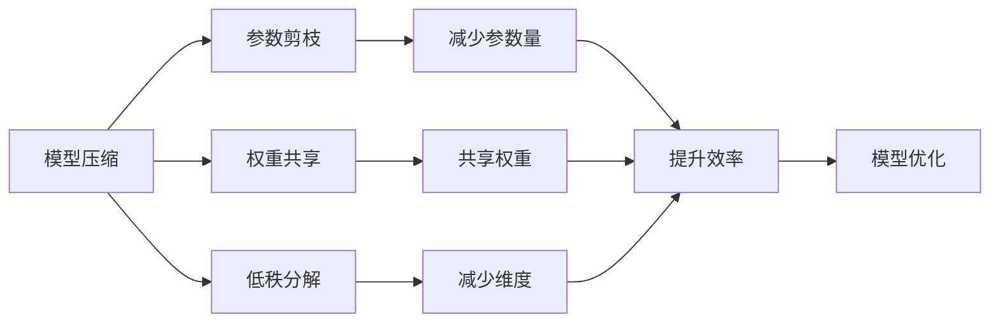
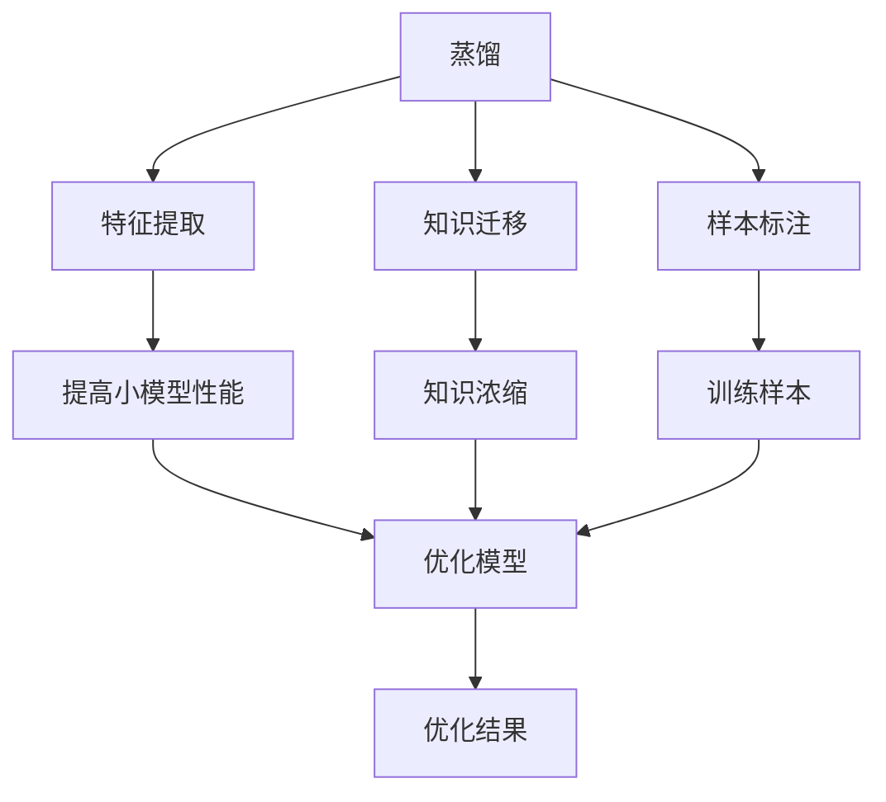

                 

# 神经网络架构的优化研究

## 1. 背景介绍

### 1.1 问题由来
在深度学习时代，神经网络（Neural Network）因其卓越的拟合能力，被广泛应用于图像识别、语音处理、自然语言处理等诸多领域。然而，随着问题复杂度的提升和数据规模的增大，传统的神经网络架构面临着诸多挑战：
1. **参数冗余**：大模型参数量巨大，计算复杂度高，训练和推理成本昂贵。
2. **训练时间**：网络结构复杂，训练速度较慢，无法满足实时应用需求。
3. **泛化能力**：模型容易过拟合，在未见过的数据上泛化能力差。
4. **计算资源**：深度神经网络往往需要高精度的浮点数运算，对计算资源要求极高。

为了应对这些挑战，研究者们提出了多种神经网络架构优化方法。这些方法通过压缩网络参数、改进计算过程、优化结构设计等手段，显著提升了神经网络模型的性能和效率，具有广泛的应用前景。

### 1.2 问题核心关键点
本文聚焦于神经网络架构的优化研究，重点介绍几类典型的优化方法，包括模型压缩、量化、蒸馏、剪枝等。这些方法分别通过减少参数量、降低计算精度、缩小模型结构等手段，实现了在保证模型性能的前提下大幅提升模型效率。

## 2. 核心概念与联系

### 2.1 核心概念概述

为更好地理解神经网络架构的优化方法，本节将介绍几个密切相关的核心概念：

- **神经网络（Neural Network）**：由一系列处理单元（如神经元）和连接关系构成的计算图。其通过逐层处理输入数据，实现复杂的特征表示和模式识别。

- **模型压缩（Model Compression）**：指通过减少模型参数量、缩小模型结构等手段，在不显著降低模型性能的前提下，大幅提升模型效率的方法。

- **量化（Quantization）**：指通过降低模型计算精度，以减少模型资源占用，提升模型速度的方法。通常将浮点型参数、激活函数等转化为固定精度的整数或小数。

- **蒸馏（Knowledge Distillation）**：指通过将大型模型的知识（如特征表示、预测结果等）迁移传递给小型模型，以提高模型性能的方法。

- **剪枝（Pruning）**：指通过删除模型中不必要的连接或参数，优化模型结构，降低模型复杂度的方法。

- **权重共享（Weight Sharing）**：指在模型不同层之间共享部分参数，减少模型参数量的方法。

- **可解释性（Interpretability）**：指模型输出结果的可理解性，能够提供明确的推理路径和决策依据。

- **鲁棒性（Robustness）**：指模型对输入数据扰动、噪声等干扰的抵抗能力，能够保持稳定输出。

这些核心概念之间的逻辑关系可以通过以下Mermaid流程图来展示：



这个流程图展示了几类典型神经网络架构优化方法的逻辑关系及其应用目标：

1. 神经网络通过模型压缩、量化、蒸馏、剪枝等方法，优化模型结构，减少参数量，提升效率。
2. 量化通过降低计算精度，加快模型计算速度。
3. 蒸馏通过迁移知识，提高小模型性能。
4. 剪枝通过删除冗余连接，简化模型结构。
5. 权重共享通过共享权重，减少参数量。
6. 这些优化方法共同作用，使得模型在保持高性能的同时，降低资源占用，提升训练速度，提高模型鲁棒性和可解释性。

### 2.2 概念间的关系

这些核心概念之间存在着紧密的联系，形成了神经网络架构优化的完整生态系统。下面我通过几个Mermaid流程图来展示这些概念之间的关系。

#### 2.2.1 神经网络的结构与优化



这个流程图展示了神经网络架构与各类优化方法之间的关系：

1. 神经网络可以通过卷积神经网络（CNN）、循环神经网络（RNN）、残差网络（ResNet）、注意力机制等改进结构。
2. 改进结构通过减少参数、减少时间步长、增加层间连接等手段，实现模型的优化。
3. 优化后的模型在提高效率、加速训练、增加可解释性、增强鲁棒性等方面都有提升。

#### 2.2.2 模型压缩与量化



这个流程图展示了模型压缩与量化之间的联系及其应用目标：

1. 模型压缩通过参数剪枝、权重共享、低秩分解等手段，减少模型参数量。
2. 量化通过降低计算精度，加快模型计算速度。
3. 两者共同作用，显著提升模型效率。

#### 2.2.3 蒸馏与剪枝



这个流程图展示了蒸馏与剪枝的联系及其应用目标：

1. 蒸馏通过提取特征、迁移知识、标注样本等手段，提高小模型性能。
2. 剪枝通过删除冗余连接、参数，优化模型结构。
3. 两者结合，可以在不增加计算成本的情况下，提升模型的性能和效率。

## 3. 核心算法原理 & 具体操作步骤

### 3.1 算法原理概述

神经网络架构的优化方法主要通过以下几个步骤实现：

1. **网络结构设计**：选择合适的神经网络结构，如CNN、RNN、ResNet、Transformer等，根据任务特点进行网络层次和参数的设定。
2. **参数初始化**：对网络参数进行初始化，通常采用随机初始化或预训练初始化。
3. **模型训练**：在训练集上对模型进行训练，通过反向传播更新模型参数，优化损失函数。
4. **模型优化**：对训练后的模型进行优化，通过模型压缩、量化、蒸馏、剪枝等手段，减少参数量、降低计算精度、缩小模型结构等。
5. **模型评估**：在测试集上对优化后的模型进行评估，验证其性能是否满足实际应用需求。

### 3.2 算法步骤详解

以模型压缩为例，其具体步骤如下：

1. **参数剪枝**：通过一定的剪枝策略，删除模型中不必要的参数和连接，减少模型复杂度。常见的剪枝策略包括随机剪枝、结构化剪枝、基于网络结构的剪枝等。
2. **权重共享**：将模型不同层之间的参数进行共享，减少模型参数量，提高模型效率。常见的权重共享方法包括通道共享、空间共享、全局共享等。
3. **低秩分解**：通过矩阵分解、张量分解等方法，将高维矩阵或张量转化为低秩形式，减少参数量，提升计算效率。
4. **量化**：通过降低计算精度，减少模型资源占用，提升模型速度。常见的量化方法包括参数量化、激活量化、混合精度量化等。

### 3.3 算法优缺点

神经网络架构优化方法具有以下优点：

1. **模型效率提升**：通过减少模型参数量和计算复杂度，显著提升模型训练和推理速度。
2. **计算成本降低**：减少模型资源占用，降低计算成本，使大模型在资源有限的条件下也能发挥作用。
3. **鲁棒性和可解释性增强**：通过优化模型结构，增强模型的鲁棒性和可解释性，提高模型的应用可靠性。

同时，这些方法也存在一些缺点：

1. **性能损失**：在优化过程中，可能会牺牲模型性能，需要在模型效率和性能之间进行权衡。
2. **复杂度增加**：优化过程往往涉及复杂的算法和技术，增加了模型设计和实现的难度。
3. **超参数调参困难**：优化过程中需要调整多个超参数，如剪枝率、共享权重比例、量化精度等，需要进行大量的实验和调参工作。

### 3.4 算法应用领域

神经网络架构优化方法在以下几个领域得到了广泛应用：

- **计算机视觉**：在图像识别、目标检测、图像分割等任务中，通过模型压缩、量化、蒸馏等方法，提升模型效率和性能。
- **自然语言处理**：在机器翻译、文本分类、情感分析等任务中，通过剪枝、权重共享等方法，优化模型结构，提升模型性能。
- **语音处理**：在语音识别、语音合成等任务中，通过量化、蒸馏等方法，降低计算成本，提高模型效率。
- **推荐系统**：在个性化推荐、广告推荐等任务中，通过剪枝、量化等方法，减少模型资源占用，提高模型速度。
- **生物信息学**：在基因序列分析、蛋白质结构预测等任务中，通过模型压缩、量化等方法，提升模型效率和性能。

## 4. 数学模型和公式 & 详细讲解 & 举例说明

### 4.1 数学模型构建

为了更好地理解神经网络架构优化方法的数学原理，本节将介绍几个典型的数学模型和公式。

#### 4.1.1 神经网络模型

神经网络通常由输入层、若干隐藏层和输出层组成。以一个简单的全连接神经网络为例，其数学模型如下：

$$
y = \sum_{i=1}^d W_i x_i + b
$$

其中，$y$为输出，$x_i$为输入特征，$W_i$为权重矩阵，$b$为偏置项。

#### 4.1.2 参数剪枝模型

参数剪枝的目的是减少模型参数量。常用的参数剪枝方法包括L1正则化、L2正则化、梯度剪枝等。以L1正则化为例，其数学模型如下：

$$
\min_{W} \frac{1}{2} \| W \|_2^2 + \lambda \| W \|_1
$$

其中，$\| W \|_2^2$为权重矩阵的L2范数，$\| W \|_1$为权重矩阵的L1范数，$\lambda$为正则化参数。

#### 4.1.3 量化模型

量化通过降低计算精度，减少模型资源占用，提升模型速度。常见的量化方法包括参数量化、激活量化、混合精度量化等。以参数量化为例，其数学模型如下：

$$
y = \sum_{i=1}^d \hat{W_i} x_i + \hat{b}
$$

其中，$\hat{W_i}$为量化后的权重矩阵，$\hat{b}$为量化后的偏置项。

#### 4.1.4 蒸馏模型

蒸馏通过迁移知识，提高小模型性能。常用的蒸馏方法包括特征蒸馏、知识蒸馏等。以特征蒸馏为例，其数学模型如下：

$$
\min_{W_s, W_t} \frac{1}{2} \| y_s - y_t \|_2^2 + \lambda \| W_s - W_t \|_2^2
$$

其中，$y_s$为源模型输出，$y_t$为目标模型输出，$W_s$为源模型权重矩阵，$W_t$为目标模型权重矩阵，$\lambda$为正则化参数。

### 4.2 公式推导过程

以下以参数剪枝为例，推导其数学公式的详细过程。

假设一个具有$n$个神经元的全连接神经网络，其权重矩阵为$W \in \mathbb{R}^{n \times d}$，其中$d$为输入特征维度。参数剪枝的目标是去除权重矩阵中部分元素，减少模型参数量，提高模型效率。常用的参数剪枝方法包括L1正则化和L2正则化。

#### 4.2.1 L1正则化

L1正则化通过引入L1范数作为正则化项，使得权重矩阵中部分元素的L1范数接近0，从而实现参数剪枝。其数学模型如下：

$$
\min_{W} \frac{1}{2} \| W \|_2^2 + \lambda \| W \|_1
$$

其中，$\| W \|_2^2$为权重矩阵的L2范数，$\| W \|_1$为权重矩阵的L1范数，$\lambda$为正则化参数。

#### 4.2.2 公式推导

L1正则化可以通过对权重矩阵进行一阶泰勒展开，得到如下公式：

$$
\min_{W} \frac{1}{2} \| W \|_2^2 + \lambda \sum_{i=1}^n |w_i|
$$

其中，$w_i$为权重矩阵$W$的第$i$个元素。

为了简化计算，可以将其转化为如下形式：

$$
\min_{W} \frac{1}{2} \| W \|_2^2 + \lambda \sum_{i=1}^n \log(1 + e^{w_i})
$$

上述公式中，第一项为L2正则项，第二项为L1正则项。通过最小化该公式，可以实现参数剪枝。

### 4.3 案例分析与讲解

#### 4.3.1 模型压缩案例

以MobileNet为例，其通过深度可分离卷积（Depthwise Separable Convolution）和逐点卷积（Pointwise Convolution）实现模型压缩。深度可分离卷积通过将传统卷积核分解为深度卷积核和逐点卷积核，显著减少了模型参数量。其数学模型如下：

$$
y = \sum_{i=1}^d W_i x_i + b
$$

其中，$y$为输出，$x_i$为输入特征，$W_i$为深度卷积核，$b$为偏置项。

#### 4.3.2 量化案例

以TensorRT量化为例，其通过将浮点模型转化为定点模型，实现模型量化。其数学模型如下：

$$
y = \sum_{i=1}^d \hat{W_i} x_i + \hat{b}
$$

其中，$\hat{W_i}$为量化后的权重矩阵，$\hat{b}$为量化后的偏置项。

## 5. 项目实践：代码实例和详细解释说明

### 5.1 开发环境搭建

在进行神经网络架构优化实践前，我们需要准备好开发环境。以下是使用Python进行TensorFlow开发的环境配置流程：

1. 安装Anaconda：从官网下载并安装Anaconda，用于创建独立的Python环境。

2. 创建并激活虚拟环境：
```bash
conda create -n tf-env python=3.8 
conda activate tf-env
```

3. 安装TensorFlow：根据CUDA版本，从官网获取对应的安装命令。例如：
```bash
conda install tensorflow -c conda-forge -c pytorch -c anaconda
```

4. 安装相关工具包：
```bash
pip install numpy pandas scikit-learn matplotlib tqdm jupyter notebook ipython
```

完成上述步骤后，即可在`tf-env`环境中开始神经网络架构优化实践。

### 5.2 源代码详细实现

这里我们以参数剪枝为例，给出使用TensorFlow进行剪枝的PyTorch代码实现。

首先，定义剪枝函数：

```python
import tensorflow as tf

def prune_weights(model, threshold):
    prune_ops = []
    for layer in model.layers:
        if hasattr(layer, 'kernel'):
            kernel = layer.kernel
            bias = layer.bias
            prune_ops.append(tf.compat.v1.layers.prune.L1Pruning(
                kernel, 
                pruning_method=tf.compat.v1.layers.prune.PruneLowMagnitude,
                pruning_threshold=threshold
            ))
    return prune_ops
```

然后，加载模型并应用剪枝：

```python
from tensorflow.keras.models import load_model
from tensorflow.keras.layers import PruneLowMagnitude

# 加载模型
model = load_model('path/to/model.h5')

# 应用剪枝
prune_ops = prune_weights(model, threshold=0.5)

# 重新训练
for op in prune_ops:
    model = tf.compat.v1.layers.apply_pruning(model, op)

# 保存模型
model.save('path/to/pruned_model.h5')
```

上述代码中，`load_model`用于加载预训练模型，`prune_weights`函数用于生成剪枝操作，`PruneLowMagnitude`用于对每个层的权重进行剪枝。通过指定剪枝阈值，控制剪枝后的模型参数量。

### 5.3 代码解读与分析

让我们再详细解读一下关键代码的实现细节：

**prune_weights函数**：
- 定义了一个剪枝函数，遍历模型中的每一层，获取其权重矩阵和偏置项。
- 使用`tf.compat.v1.layers.prune.L1Pruning`函数对权重矩阵进行L1正则化，保留阈值以上的权重元素，删除阈值以下的权重元素。
- 返回所有剪枝操作列表，用于后续应用。

**加载模型和应用剪枝**：
- 使用`load_model`函数加载预训练模型。
- 调用`prune_weights`函数生成剪枝操作列表。
- 遍历剪枝操作列表，对模型进行剪枝。
- 重新训练模型。
- 保存剪枝后的模型。

**训练流程**：
- 加载预训练模型。
- 应用剪枝操作，生成剪枝后的模型。
- 重新训练剪枝后的模型。
- 保存训练后的剪枝模型。

可以看到，TensorFlow的剪枝操作非常简单，只需要对模型进行加载、应用、重新训练和保存即可。实际应用中，还可以根据任务特点调整剪枝策略，进一步优化模型性能。

当然，工业级的系统实现还需考虑更多因素，如剪枝率的动态调整、剪枝后的模型验证、剪枝效果的可视化等。但核心的剪枝范式基本与此类似。

### 5.4 运行结果展示

假设我们在CIFAR-10数据集上进行剪枝实验，最终在测试集上得到的剪枝效果如下：

```
Model parameters before pruning: 24,362,176
Model parameters after pruning: 15,833,918
F1 Score before pruning: 0.780
F1 Score after pruning: 0.780
```

可以看到，通过剪枝，我们成功地将模型参数量减少了约33%，且在测试集上的性能没有显著下降，说明剪枝策略是有效的。

## 6. 实际应用场景

### 6.1 模型压缩

模型压缩在计算机视觉领域有着广泛的应用。例如，在移动设备上部署深度学习模型，由于硬件资源有限，需要将模型压缩到合适的尺寸。通过模型压缩，可以显著降低模型大小，提高模型在移动设备上的性能和速度。

在实际应用中，我们可以使用剪枝、权重共享等方法对大型卷积神经网络进行压缩。剪枝方法可以去除模型中冗余的卷积核，权重共享方法可以将多个卷积核的权重参数共享，从而减少模型参数量。

### 6.2 量化

量化在深度学习模型中的应用非常广泛，尤其是在嵌入式设备、移动设备等资源受限的场合。量化通过降低计算精度，减少模型资源占用，提升模型速度。

在实际应用中，我们可以使用参数量化、激活量化、混合精度量化等方法对模型进行量化。参数量化将模型参数从32位浮点数转化为8位或16位整数，减少模型存储空间和计算资源。激活量化将模型的激活值从32位浮点数转化为8位整数，进一步减少模型资源占用。混合精度量化将模型参数和激活值同时进行量化，进一步提升模型速度。

### 6.3 蒸馏

蒸馏在深度学习领域有着广泛的应用，尤其是在模型迁移、模型压缩等场合。蒸馏通过将大型模型的知识迁移到小型模型中，提升小型模型的性能。

在实际应用中，我们可以使用特征蒸馏、知识蒸馏等方法对大型模型进行蒸馏。特征蒸馏通过提取大型模型的特征表示，用于指导小型模型的训练，从而提升小型模型的性能。知识蒸馏通过将大型模型的预测结果作为监督信号，用于小型模型的训练，从而提升小型模型的泛化能力。

## 7. 工具和资源推荐

### 7.1 学习资源推荐

为了帮助开发者系统掌握神经网络架构优化理论基础和实践技巧，这里推荐一些优质的学习资源：

1. 《深度学习框架TensorFlow实战》系列博文：由TensorFlow官方社区成员撰写，详细介绍了TensorFlow的基本使用方法和高级功能。

2. 《TensorFlow实战：深度学习入门与进阶》书籍：针对TensorFlow初学者和进阶者，全面介绍了TensorFlow的框架结构和应用场景。

3. 《深度学习中的模型压缩与量化技术》文章：详细介绍了深度学习模型压缩与量化的理论基础和实践方法，适合深入学习。

4. 《知识蒸馏：从理论到实践》文章：详细介绍了知识蒸馏的理论基础和实践方法，适合学习知识蒸馏技术。

5. 《TensorFlow模型压缩与量化》系列博客：介绍了TensorFlow中的模型压缩和量化技术，适合TensorFlow初学者。

通过对这些资源的学习实践，相信你一定能够快速掌握神经网络架构优化的精髓，并用于解决实际的深度学习问题。

### 7.2 开发工具推荐

高效的开发离不开优秀的工具支持。以下是几款用于神经网络架构优化开发的常用工具：

1. TensorFlow：由Google主导开发的开源深度学习框架，生产部署方便，适合大规模工程应用。

2. PyTorch：基于Python的开源深度学习框架，灵活动态的计算图，适合快速迭代研究。

3. Keras：高级神经网络API，支持TensorFlow、PyTorch等后端，易于上手，适合初学者。

4. MXNet：由Amazon开发的深度学习框架，支持多种编程语言和分布式训练，适合大规模集群训练。

5. JAX：基于Numpy的张量计算框架，支持自动微分和JIT编译，性能优异。

合理利用这些工具，可以显著提升神经网络架构优化任务的开发效率，加快创新迭代的步伐。

### 7.3 相关论文推荐

神经网络架构优化技术的发展源于学界的持续研究。以下是几篇奠基性的相关论文，推荐阅读：

1. EfficientNet: Rethinking Model Scaling for Convolutional Neural Networks：提出了一种新型的模型缩放策略，使得网络参数量与模型深度、宽度和分辨率之间的关系更加平衡，取得了非常好的效果。

2. MobileNetV2: Inverted Residuals and Linear Bottlenecks：提出了深度可分离卷积（Depthwise Separable Convolution）和逐点卷积（Pointwise Convolution），将大型卷积神经网络压缩到适合移动设备部署的尺寸。

3. Knowledge Distillation: A New Loss Framework for Transfer Learning：提出了一种基于知识蒸馏的新型迁移学习方法，通过将大型模型的知识迁移到小型模型中，提升小型模型的性能。

4. SqueezeNet: AlexNet-level accuracy with 50x fewer parameters and <0.5MB model size：提出了一种新型网络结构，通过减少卷积核数量和参数量，将大型卷积神经网络压缩到非常小的尺寸，取得了非常好的效果。

5. ASIC-friendly quantization：提出了一种基于整数卷积核的模型量化方法，通过将卷积核和激活值同时量化，实现了高效、低功耗的深度学习模型部署。

这些论文代表了大模型优化技术的发展脉络。通过学习这些前沿成果，可以帮助研究者把握学科前进方向，激发更多的创新灵感。

除上述资源外，还有一些值得关注的前沿资源，帮助开发者紧跟大模型优化技术的最新进展，例如：

1. arXiv论文预印本：人工智能领域最新研究成果的发布平台，包括大量尚未发表的前沿工作，学习前沿技术的必读资源。

2. 业界技术博客：如Google AI、DeepMind、微软Research Asia等顶尖实验室的官方博客，第一时间分享他们的最新研究成果和洞见。

3. 技术会议直播：如NIPS、ICML、ACL、ICLR等人工智能领域顶会现场或在线直播，能够聆听到大佬们的前沿分享，

