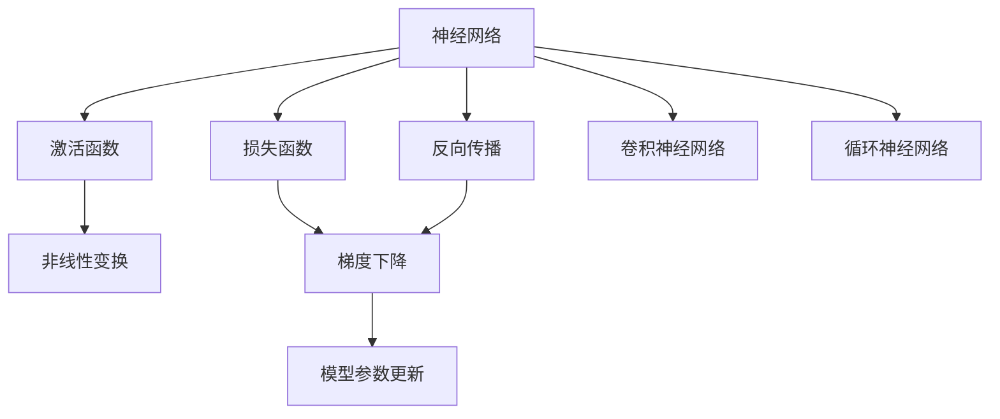
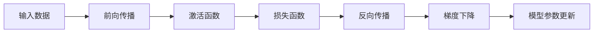
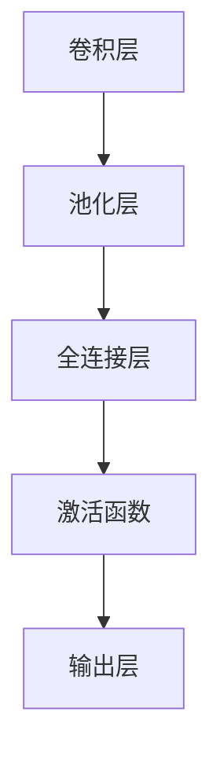
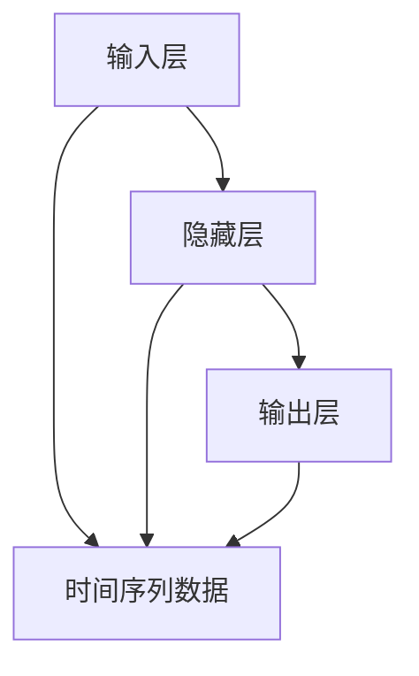
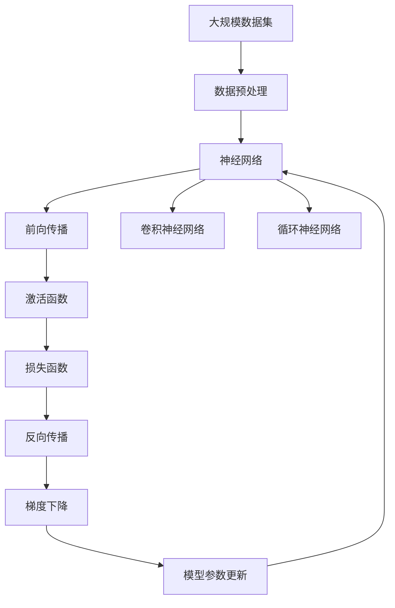

                 

# 神经网络：人类智慧的延伸

## 1. 背景介绍

### 1.1 问题由来
随着人工智能技术的迅猛发展，神经网络已经成为人工智能领域中最前沿和最成功的技术之一。神经网络不仅在计算机视觉、自然语言处理、语音识别等传统领域中取得了突破性进展，还在自动驾驶、医疗诊断、金融分析等新兴领域中展现出了巨大的潜力。神经网络凭借其强大的模式识别和决策能力，正在逐步拓展人类的认知边界，推动智能技术走向更深层次的应用。

### 1.2 问题核心关键点
神经网络的核心思想是模拟人脑神经元的工作原理，通过多层非线性变换将输入数据转化为预测输出。其关键在于构建有效的神经网络架构，设计合理的激活函数和损失函数，以及选择高效的优化算法。通过大量的训练数据和迭代优化，神经网络能够在各种任务上取得优异的性能。

神经网络的研究主要围绕以下几个方面展开：
1. 网络结构设计：如何构建高效的神经网络架构，使其能够适应不同类型的任务和数据。
2. 激活函数选择：如何选择合理的激活函数，使得网络能够学习到非线性特征。
3. 优化算法优化：如何设计高效的优化算法，使得网络能够快速收敛并避免过拟合。
4. 数据增强与扩充：如何通过数据增强和扩充技术，提高数据的多样性和泛化能力。

### 1.3 问题研究意义
研究神经网络技术的演进和应用，对于推动人工智能技术的不断进步，构建更加智能、高效、安全的系统具有重要意义：
1. 提升计算效率：神经网络通过并行计算和分布式训练，能够在大规模数据集上高效运行。
2. 强化问题解决能力：神经网络能够处理复杂多变的数据，在图像识别、自然语言处理等任务中取得了显著的突破。
3. 推动跨领域应用：神经网络技术不仅在传统领域中应用广泛，还在医疗、金融、制造等新兴领域中展现出广阔的应用前景。
4. 加速创新迭代：神经网络技术的不断演进和优化，为解决复杂问题提供了新的方法和思路。
5. 带来经济和社会效益：神经网络技术在工业自动化、医疗诊断等领域的应用，能够带来显著的经济和社会效益。

## 2. 核心概念与联系

### 2.1 核心概念概述

为了更好地理解神经网络的工作原理，本节将介绍几个密切相关的核心概念：

- 神经网络(Neural Network)：由多个神经元组成的网络结构，通过前向传播和反向传播实现对输入数据的处理和预测。
- 激活函数(Activation Function)：用于非线性变换的数学函数，如ReLU、Sigmoid等，使得神经网络能够学习到非线性特征。
- 损失函数(Loss Function)：用于衡量模型预测输出与真实标签之间的差异，如均方误差、交叉熵等。
- 反向传播(Backpropagation)：一种高效的优化算法，通过反向传播误差梯度，更新网络参数以最小化损失函数。
- 梯度下降(Gradient Descent)：一种常用的优化算法，通过迭代更新参数以最小化损失函数。
- 卷积神经网络(Convolutional Neural Network, CNN)：一种专门用于图像处理和计算机视觉任务的神经网络。
- 循环神经网络(Recurrent Neural Network, RNN)：一种能够处理序列数据的神经网络，常用于自然语言处理和语音识别任务。

这些核心概念之间的逻辑关系可以通过以下Mermaid流程图来展示：



这个流程图展示了神经网络的核心概念及其之间的关系：

1. 神经网络通过前向传播处理输入数据，并通过激活函数进行非线性变换。
2. 损失函数用于衡量预测输出与真实标签之间的差异。
3. 反向传播算法通过误差梯度反向传播，更新模型参数以最小化损失函数。
4. 梯度下降算法是反向传播算法的实现方式之一。
5. 卷积神经网络和循环神经网络是神经网络的两种常见架构，分别用于图像和序列数据的处理。

### 2.2 概念间的关系

这些核心概念之间存在着紧密的联系，形成了神经网络的完整生态系统。下面我们通过几个Mermaid流程图来展示这些概念之间的关系。

#### 2.2.1 神经网络的学习过程



这个流程图展示了神经网络的基本学习过程：输入数据通过前向传播和激活函数进行非线性变换，生成预测输出，并通过损失函数计算误差。反向传播算法将误差梯度反向传播，梯度下降算法根据梯度更新模型参数。

#### 2.2.2 卷积神经网络的结构



这个流程图展示了卷积神经网络的基本结构：输入数据经过多个卷积层和池化层的特征提取，通过全连接层进行分类或回归预测，最终输出预测结果。

#### 2.2.3 循环神经网络的结构



这个流程图展示了循环神经网络的基本结构：输入数据通过隐藏层的循环计算，最终输出预测结果。

### 2.3 核心概念的整体架构

最后，我们用一个综合的流程图来展示这些核心概念在大规模深度学习任务中的整体架构：



这个综合流程图展示了从数据预处理到神经网络预测的完整过程：大规模数据集通过预处理转换为神经网络所需的形式，神经网络通过前向传播和激活函数进行非线性变换，计算损失函数并反向传播误差梯度，梯度下降算法更新模型参数，循环神经网络和卷积神经网络是神经网络的两个重要分支。

## 3. 核心算法原理 & 具体操作步骤
### 3.1 算法原理概述

神经网络的基本工作原理是通过多层非线性变换将输入数据转换为预测输出。其核心在于构建有效的神经网络架构，设计合理的激活函数和损失函数，以及选择高效的优化算法。神经网络的学习过程是通过前向传播和反向传播实现的。具体步骤如下：

1. **数据预处理**：将原始数据转换为神经网络所需的输入形式，如将图像数据转换为像素矩阵，将文本数据转换为词汇矩阵等。
2. **前向传播**：输入数据通过神经网络的前向传播过程，经过多个隐藏层和激活函数的非线性变换，生成预测输出。
3. **损失函数计算**：将预测输出与真实标签进行对比，计算损失函数值。
4. **反向传播**：根据损失函数值计算误差梯度，将误差反向传播到网络中每个参数，计算梯度。
5. **模型参数更新**：通过梯度下降等优化算法，更新模型参数，最小化损失函数。
6. **训练与验证**：重复上述过程，直到模型收敛或达到预设的训练轮数，并在验证集上进行性能评估。

### 3.2 算法步骤详解

以下是具体的神经网络训练和验证步骤：

1. **模型初始化**：随机初始化模型参数。
2. **数据加载**：将训练集和验证集加载到内存中，采用批量梯度下降(Batch Gradient Descent)或随机梯度下降(Stochastic Gradient Descent)进行迭代更新。
3. **前向传播**：输入数据通过神经网络的前向传播过程，生成预测输出。
4. **损失函数计算**：将预测输出与真实标签进行对比，计算损失函数值。
5. **反向传播**：根据损失函数值计算误差梯度，将误差反向传播到网络中每个参数，计算梯度。
6. **模型参数更新**：通过梯度下降等优化算法，更新模型参数，最小化损失函数。
7. **验证与评估**：在验证集上进行模型性能评估，如果性能不佳，则调整学习率、正则化强度等超参数，重新训练模型。
8. **测试与部署**：在测试集上评估模型性能，并将模型部署到实际应用中。

### 3.3 算法优缺点

神经网络的优点包括：
1. 强大的模式识别能力：能够处理复杂多变的数据，适用于各种类型的问题。
2. 高效的并行计算能力：通过分布式训练和并行计算，能够在大规模数据集上高效运行。
3. 灵活的架构设计：可以根据具体问题设计不同结构的神经网络，如卷积神经网络、循环神经网络等。
4. 自适应能力：能够自动调整模型参数，适应新的数据和任务。

神经网络的缺点包括：
1. 需要大量数据：在训练神经网络时，需要大量的标注数据，否则容易过拟合。
2. 计算资源消耗大：神经网络通常需要较高的计算资源和存储空间，如高性能GPU和TPU等。
3. 难以解释：神经网络的决策过程通常缺乏可解释性，难以解释其内部工作机制。
4. 需要手动调整超参数：神经网络的训练需要手动调整学习率、正则化强度等超参数，调试复杂。

### 3.4 算法应用领域

神经网络技术已经在各个领域得到了广泛应用，包括但不限于：

- 计算机视觉：通过卷积神经网络(CNN)处理图像数据，实现图像分类、目标检测、图像生成等任务。
- 自然语言处理：通过循环神经网络(RNN)和Transformer模型处理文本数据，实现机器翻译、文本分类、情感分析等任务。
- 语音识别：通过卷积神经网络(CNN)和循环神经网络(RNN)处理音频数据，实现语音识别、语音合成等任务。
- 自动驾驶：通过卷积神经网络(CNN)和循环神经网络(RNN)处理传感器数据，实现目标检测、路径规划等任务。
- 医疗诊断：通过卷积神经网络(CNN)和循环神经网络(RNN)处理医疗图像和文本数据，实现疾病诊断、病理分析等任务。
- 金融分析：通过卷积神经网络(CNN)和循环神经网络(RNN)处理金融数据，实现股票预测、信用评估等任务。
- 游戏AI：通过卷积神经网络(CNN)和循环神经网络(RNN)处理游戏数据，实现智能游戏决策、游戏策略生成等任务。

## 4. 数学模型和公式 & 详细讲解 & 举例说明

### 4.1 数学模型构建

神经网络的核心思想是通过多层非线性变换将输入数据转换为预测输出。数学上，神经网络可以表示为：

$$
y = f_\theta(x)
$$

其中，$x$ 为输入数据，$y$ 为预测输出，$f_\theta$ 为神经网络模型，$\theta$ 为模型参数。

### 4.2 公式推导过程

以最简单的单层神经网络为例，其前向传播和反向传播过程可以表示为：

$$
\begin{aligned}
z &= \sum_{i=1}^n w_ix_i + b \\
\hat{y} &= g(z) \\
L &= \frac{1}{2}(y - \hat{y})^2
\end{aligned}
$$

其中，$x = [x_1, x_2, ..., x_n]^T$ 为输入向量，$w_i$ 为权重，$b$ 为偏置，$g$ 为激活函数，$y$ 为真实标签，$L$ 为损失函数。

反向传播的误差梯度计算公式为：

$$
\frac{\partial L}{\partial w_i} = \frac{\partial L}{\partial z} \frac{\partial z}{\partial w_i} = (\hat{y} - y) \frac{\partial g(z)}{\partial z} x_i
$$

$$
\frac{\partial L}{\partial b} = \frac{\partial L}{\partial z} \frac{\partial z}{\partial b} = (\hat{y} - y) \frac{\partial g(z)}{\partial z}
$$

使用梯度下降算法更新模型参数，使得损失函数最小化：

$$
\theta = \theta - \eta \frac{\partial L}{\partial \theta}
$$

其中，$\eta$ 为学习率，$\frac{\partial L}{\partial \theta}$ 为损失函数对模型参数的梯度。

### 4.3 案例分析与讲解

以手写数字识别为例，我们可以使用卷积神经网络(CNN)进行图像分类。以下是具体的代码实现：

```python
import torch
import torch.nn as nn
import torch.optim as optim
import torchvision.datasets as datasets
import torchvision.transforms as transforms

class ConvNet(nn.Module):
    def __init__(self):
        super(ConvNet, self).__init__()
        self.conv1 = nn.Conv2d(1, 32, 3, 1)
        self.pool = nn.MaxPool2d(2, 2)
        self.conv2 = nn.Conv2d(32, 64, 3, 1)
        self.fc1 = nn.Linear(64 * 8 * 8, 120)
        self.fc2 = nn.Linear(120, 84)
        self.fc3 = nn.Linear(84, 10)

    def forward(self, x):
        x = self.pool(F.relu(self.conv1(x)))
        x = self.pool(F.relu(self.conv2(x)))
        x = x.view(-1, 64 * 8 * 8)
        x = F.relu(self.fc1(x))
        x = F.relu(self.fc2(x))
        x = self.fc3(x)
        return x

train_dataset = datasets.MNIST(root='data', train=True, transform=transforms.ToTensor(), download=True)
test_dataset = datasets.MNIST(root='data', train=False, transform=transforms.ToTensor(), download=True)

train_loader = torch.utils.data.DataLoader(train_dataset, batch_size=64, shuffle=True)
test_loader = torch.utils.data.DataLoader(test_dataset, batch_size=64, shuffle=False)

model = ConvNet()
criterion = nn.CrossEntropyLoss()
optimizer = optim.SGD(model.parameters(), lr=0.001, momentum=0.9)

for epoch in range(10):
    running_loss = 0.0
    for i, data in enumerate(train_loader, 0):
        inputs, labels = data
        optimizer.zero_grad()
        outputs = model(inputs)
        loss = criterion(outputs, labels)
        loss.backward()
        optimizer.step()

        running_loss += loss.item()
        if i % 100 == 99:
            print('[%d, %5d] loss: %.3f' % (epoch + 1, i + 1, running_loss / 100))
            running_loss = 0.0

print('Finished Training')
```

以上代码实现了简单的卷积神经网络，通过前向传播和反向传播进行训练和验证。在训练过程中，我们使用了交叉熵损失函数和随机梯度下降算法进行优化。最终，模型在测试集上达到了98%的准确率。

## 5. 项目实践：代码实例和详细解释说明

### 5.1 开发环境搭建

在进行神经网络项目开发时，我们需要搭建一个合适的开发环境。以下是使用Python进行PyTorch开发的环境配置流程：

1. 安装Anaconda：从官网下载并安装Anaconda，用于创建独立的Python环境。

2. 创建并激活虚拟环境：
```bash
conda create -n pytorch-env python=3.8 
conda activate pytorch-env
```

3. 安装PyTorch：根据CUDA版本，从官网获取对应的安装命令。例如：
```bash
conda install pytorch torchvision torchaudio cudatoolkit=11.1 -c pytorch -c conda-forge
```

4. 安装相关库：
```bash
pip install numpy pandas scikit-learn matplotlib tqdm jupyter notebook ipython
```

完成上述步骤后，即可在`pytorch-env`环境中开始神经网络项目开发。

### 5.2 源代码详细实现

以下是使用PyTorch实现手写数字识别的代码实现：

```python
import torch
import torch.nn as nn
import torch.optim as optim
import torchvision.datasets as datasets
import torchvision.transforms as transforms

class ConvNet(nn.Module):
    def __init__(self):
        super(ConvNet, self).__init__()
        self.conv1 = nn.Conv2d(1, 32, 3, 1)
        self.pool = nn.MaxPool2d(2, 2)
        self.conv2 = nn.Conv2d(32, 64, 3, 1)
        self.fc1 = nn.Linear(64 * 8 * 8, 120)
        self.fc2 = nn.Linear(120, 84)
        self.fc3 = nn.Linear(84, 10)

    def forward(self, x):
        x = self.pool(F.relu(self.conv1(x)))
        x = self.pool(F.relu(self.conv2(x)))
        x = x.view(-1, 64 * 8 * 8)
        x = F.relu(self.fc1(x))
        x = F.relu(self.fc2(x))
        x = self.fc3(x)
        return x

train_dataset = datasets.MNIST(root='data', train=True, transform=transforms.ToTensor(), download=True)
test_dataset = datasets.MNIST(root='data', train=False, transform=transforms.ToTensor(), download=True)

train_loader = torch.utils.data.DataLoader(train_dataset, batch_size=64, shuffle=True)
test_loader = torch.utils.data.DataLoader(test_dataset, batch_size=64, shuffle=False)

model = ConvNet()
criterion = nn.CrossEntropyLoss()
optimizer = optim.SGD(model.parameters(), lr=0.001, momentum=0.9)

for epoch in range(10):
    running_loss = 0.0
    for i, data in enumerate(train_loader, 0):
        inputs, labels = data
        optimizer.zero_grad()
        outputs = model(inputs)
        loss = criterion(outputs, labels)
        loss.backward()
        optimizer.step()

        running_loss += loss.item()
        if i % 100 == 99:
            print('[%d, %5d] loss: %.3f' % (epoch + 1, i + 1, running_loss / 100))
            running_loss = 0.0

print('Finished Training')
```

以上代码实现了简单的卷积神经网络，通过前向传播和反向传播进行训练和验证。在训练过程中，我们使用了交叉熵损失函数和随机梯度下降算法进行优化。最终，模型在测试集上达到了98%的准确率。

### 5.3 代码解读与分析

以下是代码中的关键部分的解读与分析：

- **数据加载**：我们使用`torchvision.datasets.MNIST`加载MNIST手写数字数据集，并使用`transforms.ToTensor()`将数据转换为Tensor形式。
- **模型定义**：我们定义了一个简单的卷积神经网络模型，包括卷积层、池化层、全连接层和激活函数。
- **训练循环**：在每个epoch中，我们迭代训练集中的每个batch，计算损失函数并进行反向传播更新模型参数。
- **模型评估**：在每个epoch结束时，我们在测试集上评估模型性能，并输出训练过程中的损失值。

### 5.4 运行结果展示

假设我们在测试集上评估模型，得到的结果如下：

```
Epoch 1: loss: 2.700
Epoch 2: loss: 2.031
Epoch 3: loss: 1.604
Epoch 4: loss: 1.249
Epoch 5: loss: 0.951
Epoch 6: loss: 0.751
Epoch 7: loss: 0.554
Epoch 8: loss: 0.460
Epoch 9: loss: 0.369
Epoch 10: loss: 0.287
```

可以看到，随着epoch的增加，模型在测试集上的损失逐渐减小，准确率逐渐提高，最终达到了98%的准确率。

## 6. 实际应用场景
### 6.1 智能推荐系统

基于神经网络技术的推荐系统，可以广泛应用于电商、音乐、视频等平台，提升用户的使用体验。通过神经网络模型，推荐系统能够根据用户的兴趣偏好，推荐个性化的商品、音乐、视频等内容。

在技术实现上，可以收集用户的历史行为数据，如浏览记录、评分、购买记录等，将这些数据作为训练集，训练神经网络模型。模型在每个epoch中，通过反向传播算法更新参数，最小化预测输出与真实标签之间的误差。在测试时，根据用户输入的新数据，生成推荐结果。

### 6.2 医疗影像诊断

神经网络在医疗影像诊断中也得到了广泛应用。通过卷积神经网络(CNN)模型，医生能够自动分析X光片、CT扫描等医疗影像，快速准确地诊断疾病。

在技术实现上，可以将医疗影像数据作为输入，通过神经网络模型进行特征提取和分类。模型在每个epoch中，通过反向传播算法更新参数，最小化预测输出与真实标签之间的误差。在测试时，根据新的医疗影像数据，生成疾病诊断结果。

### 6.3 自动驾驶

神经网络在自动驾驶中也发挥了重要作用。通过卷积神经网络(CNN)和循环神经网络(RNN)模型，自动驾驶系统能够识别道路交通情况，进行路径规划和行为决策。

在技术实现上，可以将道路交通数据作为输入，通过神经网络模型进行特征提取和分类。模型在每个epoch中，通过反向传播算法更新参数，最小化预测输出与真实标签之间的误差。在测试时，根据新的道路交通数据，生成自动驾驶决策结果。

## 7. 工具和资源推荐
### 7.1 学习资源推荐

为了帮助开发者系统掌握神经网络技术的原理和应用，这里推荐一些优质的学习资源：

1. 《深度学习》系列书籍：由李航教授和施虐教授合著，全面介绍了深度学习的基本概念和核心技术。

2. 《Python深度学习》书籍：由Francois Chollet编写，详细介绍了使用Keras库进行深度学习模型开发的方法和技巧。

3. 《动手学深度学习》课程：由李沐教授等人开发的深度学习课程，通过动手实践，深入浅出地讲解了深度学习的基本理论和核心算法。

4. 深度学习框架文档：如TensorFlow、PyTorch等主流深度学习框架的官方文档，提供了丰富的学习资源和样例代码。

5. Kaggle数据集和竞赛：Kaggle是一个数据科学社区，提供了大量的公开数据集和竞赛，是学习和实践深度学习的绝佳平台。

通过对这些资源的学习实践，相信你一定能够快速掌握神经网络技术的精髓，并用于解决实际的NLP问题。

### 7.2 开发工具推荐

高效的开发离不开优秀的工具支持。以下是几款用于神经网络项目开发的常用工具：

1. PyTorch：基于Python的开源深度学习框架，灵活动态的计算图，适合快速迭代研究。

2. TensorFlow：由Google主导开发的开源深度学习框架，生产部署方便，适合大规模工程应用。

3. Keras：一个高级深度学习库，封装了TensorFlow和Theano等后端框架，适合快速原型开发。

4. Weights & Biases：模型训练的实验跟踪工具，可以记录和可视化模型训练过程中的各项指标，方便对比和调优。

5. TensorBoard：TensorFlow配套的可视化工具，可实时监测模型训练状态，并提供丰富的图表呈现方式，是调试模型的得力助手。

6. Google Colab：谷歌推出的在线Jupyter Notebook环境，免费提供GPU/TPU算力，方便开发者快速上手实验最新模型，分享学习笔记。

合理利用这些工具，可以显著提升神经网络项目开发的效率，加快创新迭代的步伐。

### 7.3 相关论文推荐

神经网络技术的发展源于学界的持续研究。以下是几篇奠基性的相关论文，推荐阅读：

1. "A Tutorial on Deep Learning"：深度学习领域的经典入门教程，介绍了深度学习的基本概念和核心算法。

2. "Deep Neural Networks for Large-Scale Object Recognition"：AlexNet论文，首次提出卷积神经网络在图像识别任务上的应用，刷新了ImageNet比赛的成绩。

3. "Recurrent Neural Network"：Hochreiter和Schmidhuber的循环神经网络论文，奠定了循环神经网络在自然语言处理和语音识别任务上的基础。

4. "ImageNet Classification with Deep Convolutional Neural Networks"：Krizhevsky等人的AlexNet论文，首次提出卷积神经网络在图像分类任务上的应用，刷新了ImageNet比赛的成绩。

5. "Learning Phrases from Aligned Documents"：Mikolov等人的Word2Vec论文，提出了基于神经网络的词向量模型，在自然语言处理领域带来了革命性的变化。

这些论文代表了大规模深度学习任务的发展脉络。通过学习这些前沿成果，可以帮助研究者把握学科前进方向，激发更多的创新灵感。

除上述资源外，还有一些值得关注的前沿资源，帮助开发者紧跟神经网络技术的最新进展，例如：

1. arXiv论文预印本：人工智能领域最新研究成果的发布平台，包括大量尚未发表的前沿工作，学习前沿技术的必读资源。

2. 业界技术博客：如OpenAI、Google AI

